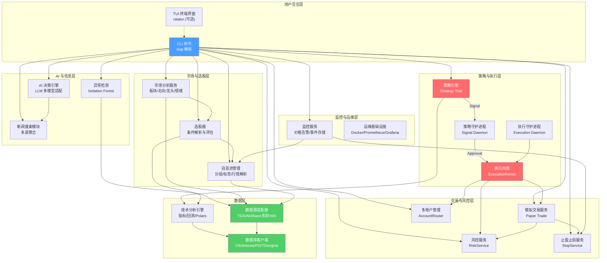

Quantix-Rust 是一个面向 **A 股市场**的量化交易 CLI 工具，使用 Rust 语言从零构建。它以命令行界面为核心交互形式，提供从数据采集、策略回测、信号生成到模拟执行的全链路量化能力。项目与已有的 Python 版 quantix 共享数据库和数据格式，定位为 Python 版本的高性能互补引擎——Python 负责快速开发和完整业务功能，Rust 负责高性能计算与低延迟分析。无论你是想了解量化系统的完整架构，还是希望在 A 股市场实践自己的交易策略，Quantix-Rust 都提供了一个结构清晰、可逐步深入的学习和开发平台。

Sources: [README.md](README.md#L1-L5), [Cargo.toml](Cargo.toml#L1-L8)

## 项目定位与核心目标

Quantix-Rust 的核心目标可以用三个关键词概括：**高性能**、**全链路**、**可演进**。

**高性能**体现在技术选型上——项目基于 Rust 2024 Edition 和 tokio 异步运行时构建，利用 Rust 的零成本抽象和所有权模型，在保证内存安全的前提下追求极致性能。Polars DataFrame 引擎用于批量数据计算，ClickHouse 用于 OLAP 级别的时序数据分析，这些都是面向高性能场景的刻意选择。

Sources: [Cargo.toml](Cargo.toml#L4-L6), [Cargo.toml](Cargo.toml#L22-L23)

**全链路**意味着项目不是单纯的回测框架或数据采集工具，而是覆盖了量化交易的完整生命周期：数据采集 → 技术分析 → 策略生成 → 信号审批 → 执行请求 → 订单撮合 → 风控检查 → 监控告警。目前项目已交付至 Phase 29C，策略执行主线已闭环到 paper/mock_live 执行层面，execution daemon 与自动审批机制已可运行。

Sources: [README.md](README.md#L37-L76), [ROADMAP.md](ROADMAP.md#L17-L19)

**可演进**体现在项目的分层设计上——当前以 CLI 和单机 daemon 为主要运行形态，通过 `systemd --user` 实现后台服务化，但架构上预留了多账户、多适配器、算法执行器等扩展点。真实 live broker 执行、Wind/Choice 数据源对接等能力被明确规划在路线图的后序阶段，而非临时打补丁。

Sources: [README.md](README.md#L11), [ROADMAP.md](ROADMAP.md#L56-L68)

## 架构总览

下面的架构图展示了 Quantix-Rust 从用户输入到最终执行的完整数据流，以及各功能层之间的依赖关系。理解这张图是掌握整个项目的关键起点。



Sources: [src/lib.rs](src/lib.rs#L17-L43), [docs/FUNCTION_MAP.md](docs/FUNCTION_MAP.md#L1-L50)

## 技术栈概览

项目在技术选型上追求"每一层都用最合适的工具"。下表列出了核心技术组件及其在项目中的角色：

| 层级 | 技术 | 版本 | 项目中的角色 |
|------|------|------|-------------|
| 语言 | Rust | 2024 Edition | 核心开发语言，保证内存安全与零成本抽象 |
| 异步运行时 | tokio | 1.35 | 驱动所有异步 I/O、定时任务、守护进程 |
| CLI 框架 | clap | 4.5 | 命令行参数解析与子命令分发 |
| 数据库 | ClickHouse | latest | 主 OLAP 存储，K线与行情数据 |
| 数据库 | PostgreSQL | 17+ | 关系型存储，日线数据与股票信息 |
| 数据库 | TDengine | 3.3+ | 时序数据库（可选），分钟线存储 |
| 本地存储 | SQLite | via sqlx | 运行时状态、告警、风控、止盈止损持久化 |
| DataFrame | Polars | 0.43 | 批量数据计算，技术指标批量引擎 |
| 序列化 | serde / serde_json | 1.0 | JSON 配置与数据交换格式 |
| HTTP | reqwest | 0.11 | 东方财富 API、Bridge 通信 |
| WebSocket | tokio-tungstenite | 0.21 | 实时行情推送订阅 |
| 精确数值 | rust_decimal | 1.33 | 金融场景的精确十进制计算 |
| 机器学习 | rand + statrs + rayon | - | Isolation Forest 异常检测 |
| 日志 | tracing | 0.1 | 结构化日志与追踪 |
| 监控 | Prometheus + Grafana + Loki | - | 指标采集、可视化、日志聚合 |
| 容器化 | Docker + Docker Compose | - | 开发与生产环境标准化部署 |

Sources: [Cargo.toml](Cargo.toml#L14-L97), [docker-compose.yml](docker-compose.yml#L1-L38), [README.md](README.md#L922-L940)

## 功能模块全景

项目包含 **222 个 Rust 源文件**，总计约 **43,000 行代码**，以及 **49 个集成测试文件**。这些代码被组织成 22 个顶层模块，每个模块负责量化交易链条中的一个明确环节。

Sources: [src/lib.rs](src/lib.rs#L17-L43)

下表按功能域对各模块进行归类，帮助你快速建立项目全局认知：

| 功能域 | 模块 | 职责 | 关键入口 |
|--------|------|------|----------|
| **核心基础设施** | `core` | 配置管理、错误处理、交易日历、交易时间、运行时 | [src/core/mod.rs](src/core/mod.rs) |
| **数据模型** | `data` | OHLCV K线、GBBQ 事件、股票信息等数据结构 | [src/data/models.rs](src/data/models.rs) |
| **数据源** | `sources` | TDX、AkShare、东方财富、WebSocket、Bridge TDX 适配 | [src/sources/mod.rs](src/sources/mod.rs) |
| **数据库** | `db` | ClickHouse、PostgreSQL、TDengine 客户端封装 | [src/db/mod.rs](src/db/mod.rs) |
| **技术分析** | `analysis` | 技术指标（MA/MACD/RSI/KDJ/BOLL 等）、回测引擎、竞价分析、Polars 批量层 | [src/analysis/mod.rs](src/analysis/mod.rs) |
| **策略引擎** | `strategy` | Strategy trait、5 种内置策略、策略注册表、守护进程、systemd 服务 | [src/strategy/mod.rs](src/strategy/mod.rs) |
| **执行引擎** | `execution` | ExecutionKernel、Paper/MockLive/QMT 适配器、运行时存储、对账、守护进程 | [src/execution/mod.rs](src/execution/mod.rs) |
| **交易服务** | `trade` | 模拟账户管理、费用计算、交易记录、交易报告 | [src/trade/mod.rs](src/trade/mod.rs) |
| **风控** | `risk` | 持仓限制、日亏损限制、波动率检查、行业集中度、实盘流水导入 | [src/risk/mod.rs](src/risk/mod.rs) |
| **止盈止损** | `stop` | 固定/百分比/跟踪止损规则管理与实时评估 | [src/stop/mod.rs](src/stop/mod.rs) |
| **账户管理** | `account` | 多账户注册表、账户组、智能路由、资金分配策略 | [src/account/mod.rs](src/account/mod.rs) |
| **市场分析** | `market` | 板块排名、北向资金、龙头股识别、市场情绪 | [src/market/mod.rs](src/market/mod.rs) |
| **选股器** | `screener` | 条件解析、评估引擎、预设筛选（close_above_ma 等） | [src/screener/mod.rs](src/screener/mod.rs) |
| **自选池** | `watchlist` | 分组管理、标签系统、多源行情解析 | [src/watchlist/mod.rs](src/watchlist/mod.rs) |
| **监控** | `monitor` | 价格告警、事件存储、monitor 守护进程、systemd 集成 | [src/monitor/mod.rs](src/monitor/mod.rs) |
| **监控系统** | `monitoring` | 信号/持仓/性能监控、告警管理、健康检查、通知 | [src/monitoring/mod.rs](src/monitoring/mod.rs) |
| **AI 决策** | `ai` | LLM 多模型适配（OpenAI/DeepSeek/Gemini/Anthropic/Ollama）、决策仪表盘 | [src/ai/mod.rs](src/ai/mod.rs) |
| **新闻搜索** | `news` | 多源聚合（Tavily/SerpAPI/博查/Brave/SearXNG）、Fallback 策略、缓存 | [src/news/mod.rs](src/news/mod.rs) |
| **异常检测** | `anomaly` | Isolation Forest 算法、A 股过滤器（ST/涨跌停/停牌/新股） | [src/anomaly/mod.rs](src/anomaly/mod.rs) |
| **基本面** | `fundamental` | 估值数据、财报、机构持仓、龙虎榜 | [src/fundamental/mod.rs](src/fundamental/mod.rs) |
| **数据同步** | `sync` | PostgreSQL/TDengine → ClickHouse ETL 桥接 | [src/sync/mod.rs](src/sync/mod.rs) |
| **数据 I/O** | `io` | CSV/JSON/Parquet 多格式导入导出、验证、批处理 | [src/io/mod.rs](src/io/mod.rs) |

Sources: [src/lib.rs](src/lib.rs#L1-L50), [docs/FUNCTION_MAP.md](docs/FUNCTION_MAP.md#L1-L200)

## 两条核心 trait：Strategy 与 ExecutionAdapter

虽然各个模块各司其职，但贯穿整个策略-执行主线的核心抽象只有两个 trait，理解它们就理解了项目最关键的设计模式。

**`Strategy` trait** 定义了所有策略的统一接口——策略接收 K 线数据，输出 `Buy` / `Sell` / `Hold` 信号。当前已实现 5 种内置策略：MA Cross（均线交叉）、Mean Reversion（均值回归）、Momentum（动量）、Breakout（突破）、Grid Trading（网格）。所有策略参数完全可配置，无硬编码。

Sources: [src/strategy/trait_def.rs](src/strategy/trait_def.rs#L10-L29)

**`ExecutionAdapter` trait** 定义了执行层与底层撮合/经纪商的统一接口——适配器接收订单请求，返回订单状态。当前实现了三种适配器：Paper（立即成交模拟）、MockLive（模拟非终态订单生命周期）、QMT Bridge（受 `qmt.mode=live` 保护的实盘路径）。这种设计使得策略逻辑与执行通道完全解耦。

Sources: [src/execution/adapter.rs](src/execution/adapter.rs#L48-L63)

## 与 Python quantix 的关系

Quantix-Rust 并非独立项目，而是与 Python 版 quantix 形成**互补共生**的关系。两者共享同一套数据库（PostgreSQL、TDengine、ClickHouse）和数据格式（一致的序列化结构），Python 端负责快速开发完整业务功能，Rust 端负责高性能计算与低延迟分析。

```
┌──────────────────────────────────────────────────┐
│              Python quantix (mystocks)            │
│   数据采集 · Web API · 完整业务逻辑 · 快速迭代    │
└──────────────────────┬───────────────────────────┘
                       │ 共享 PostgreSQL / TDengine / ClickHouse
                       │ 共享数据模型与序列化格式
┌──────────────────────▼───────────────────────────┐
│              quantix-rust (本项目)                 │
│   高性能回测 · 实时分析 · 策略执行 · 任务调度      │
└──────────────────────────────────────────────────┘
```

对于初学者而言，这意味着你可以：
- 在 Python 端完成数据采集和基础业务处理，在 Rust 端运行高性能回测
- 使用 Rust CLI 操作 Python 端已采集的数据，无需重复入库
- 两端共享相同的 ClickHouse 表结构和 PostgreSQL schema

Sources: [README.md](README.md#L955-L974), [Cargo.toml](Cargo.toml#L5)

## 当前状态与路线图

截至 2026-03-28，项目已完成 **Phase 1 ~ Phase 30** 的全部历史基础阶段，策略执行主线已闭环到 `paper` / `mock_live` / `execution_request` / `execution daemon` 层面。当前运行边界为：前台 CLI、单机 daemon 和 `systemd --user` 用户服务，不假设多 worker 或分布式调度。

Sources: [README.md](README.md#L36-L76), [ROADMAP.md](ROADMAP.md#L16-L19)

**已完成的关键里程碑**：

| 里程碑 | 状态 | 核心交付 |
|--------|------|----------|
| 数据采集基础 (Phase 1-10) | ✅ | TDX/AkShare/东财/WebSocket 数据源，ClickHouse 批量优化 |
| 分析与策略 (Phase 11-15) | ✅ | 技术指标引擎、Polars 批量层、5 种内置策略 |
| 监控与运维 (Phase 16-20) | ✅ | 实时监控、导入导出、Docker 部署、CI/CD |
| 交易与风控 (Phase 21-28) | ✅ | 自选池、选股器、市场分析、监控告警、止盈止损、模拟交易、风控 |
| 策略执行主线 (Phase 29/29B/29C) | ✅ | Paper 执行骨架、Signal Daemon、Execution Daemon、自动审批 |
| 异常检测 (Phase 30) | ✅ | Isolation Forest、东方财富数据源、A 股过滤器 |
| AI 决策 + 新闻搜索 | ✅ | LLM 多模型适配、新闻多源聚合 |

**仍在推进的方向**（按优先级排列）：

| 优先级 | 方向 | 说明 |
|--------|------|------|
| P0 | Real live broker execution | 通用 `target_mode=live`，真实 QMT 提交 |
| P1 | 风控规则增强 | 行业白名单、自动减仓 |
| P2 | 市场分析增强 | 历史数据、详情能力、实时推送 |
| P3 | 工程占坑 | TUI 菜单、Parquet 导出、交易日历节假日加载 |

Sources: [ROADMAP.md](ROADMAP.md#L22-L68), [README.md](README.md#L941-L954)

## 项目目录结构速览

下面是项目源码目录的精简视图，帮助你快速定位感兴趣的模块。每个 `src/` 下的子目录对应上表中的一个功能模块：

```
quantix-rust/
├── src/
│   ├── main.rs              # 程序入口：tokio 异步 main + CLI 解析
│   ├── lib.rs               # 库入口：模块声明与常用类型重导出
│   ├── cli/                 # CLI 层：clap 命令定义与处理函数
│   ├── core/                # 核心层：配置、错误类型、交易日历
│   ├── data/                # 数据模型层：K线、股票信息等结构体
│   ├── sources/             # 数据源层：TDX、AkShare、东财、WebSocket
│   ├── db/                  # 数据库层：ClickHouse、PostgreSQL、TDengine
│   ├── analysis/            # 分析层：指标、回测、竞价、Polars 批量
│   ├── strategy/            # 策略层：Strategy trait、5 种策略、守护进程
│   ├── execution/           # 执行层：执行内核、适配器、运行时存储
│   ├── trade/               # 交易层：模拟账户、费用、报告
│   ├── risk/                # 风控层：规则引擎、行业、波动率
│   ├── stop/                # 止盈止损层：规则管理、实时评估
│   ├── account/             # 账户层：多账户、路由、分配策略
│   ├── market/              # 市场层：板块、北向资金、龙头、情绪
│   ├── screener/            # 选股层：条件解析、评估引擎
│   ├── watchlist/           # 自选池层：分组、标签、行情解析
│   ├── monitor/             # 监控服务层：告警、事件、守护进程
│   ├── monitoring/          # 监控系统层：信号/持仓/性能监控、通知
│   ├── ai/                  # AI 层：LLM 适配、决策引擎
│   ├── news/                # 新闻层：多源聚合、缓存
│   ├── anomaly/             # 异常检测层：Isolation Forest
│   ├── fundamental/         # 基本面层：估值、财报、机构、龙虎榜
│   ├── bridge/              # Bridge 层：Windows WSL2 数据桥接
│   ├── sync/                # 数据同步层：ETL 桥接
│   ├── io/                  # I/O 层：导入导出、验证、批处理
│   ├── tasks/               # 任务调度层：Cron 解析、调度器
│   ├── import/              # 智能导入层：代码/名称/拼音解析
│   └── tui/                 # TUI 层：ratatui 终端界面（可选）
├── config/                  # 配置文件：default.toml、ai.toml、节假日
├── tests/                   # 49 个集成测试文件
├── benches/                 # Criterion 基准测试
├── monitoring/              # Prometheus/Grafana/Loki 配置
├── scripts/                 # 部署、开发、运行时脚本
├── docs/                    # 文档、报告、规范
└── docker-compose.yml       # 完整服务栈编排
```

Sources: [src/main.rs](src/main.rs#L1-L23), [src/lib.rs](src/lib.rs#L17-L43)

## 推荐阅读路径

作为入门指南的第一页，我们建议你按以下顺序逐步深入：

**第一步：搭建运行环境**
→ 阅读 [快速搭建与运行](2-kuai-su-da-jian-yu-yun-xing)，了解如何编译、配置和运行项目

**第二步：理解配置体系**
→ 阅读 [环境变量与配置管理](3-huan-jing-bian-liang-yu-pei-zhi-guan-li)，掌握数据库连接、数据源、存储路径的配置方式

**第三步：深入架构设计**
→ 进入 **深度解析** 章节，从 [分层架构设计与模块依赖关系](4-fen-ceng-jia-gou-she-ji-yu-mo-kuai-yi-lai-guan-xi) 开始，按目录顺序逐步了解每个子系统