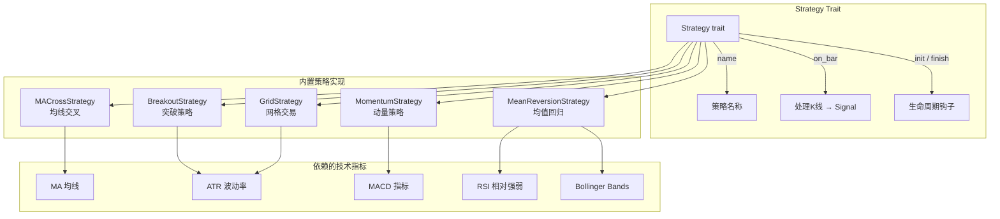
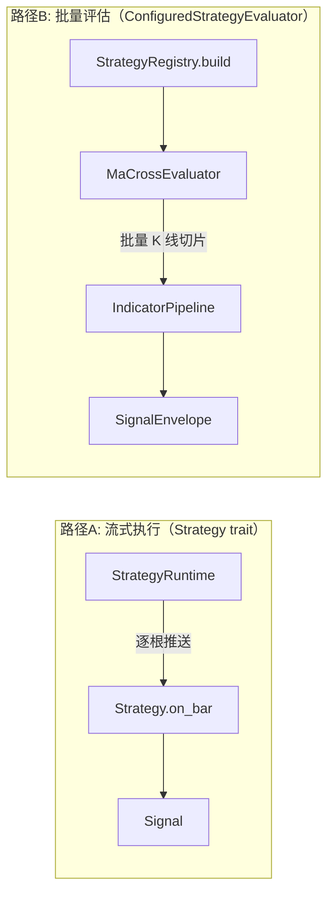

策略模块是 Quantix 量化交易系统的核心决策引擎之一。它定义了一套统一的 `Strategy` trait 接口，所有策略实现——无论是简单的均线交叉还是复杂的网格交易——都遵循相同的方法签名和生命周期。本文将深入解析策略 trait 的设计哲学、五个内置策略的实现细节，以及策略注册与运行时执行的全链路机制。

Sources: [mod.rs](src/strategy/mod.rs#L1-L45)

## Strategy Trait 核心接口

`Strategy` trait 定义在 [trait_def.rs](src/strategy/trait_def.rs) 中，使用 `async_trait` 宏将自身声明为异步 trait，并约束 `Send + Sync` 以保证线程安全。接口包含四个方法，构成了一个完整的策略生命周期：

```text
init() → on_bar()×N → finish()
```

- **`name(&self) -> &str`**：返回策略的标识名称，用于日志追踪和注册表查找。
- **`init(&mut self)`**：策略初始化钩子，默认为空操作，子策略可按需重写以完成预热逻辑。
- **`on_bar(&mut self, bar: &Kline)`**：策略的核心决策方法。每收到一根 K 线数据调用一次，返回 `Signal` 枚举——`Buy`、`Sell` 或 `Hold`。默认实现直接返回 `Hold`。
- **`finish(&mut self)`**：策略结束钩子，用于清理内部状态（清空缓存、重置持仓标记等）。默认为空操作。

`Signal` 枚举是策略与执行系统之间的契约：它被包装为 `SignalEnvelope`（包含信号值和元数据 JSON）后，传递给下游的 [ExecutionKernel 执行决策核心与订单生命周期](11-executionkernel-zhi-xing-jue-ce-he-xin-yu-ding-dan-sheng-ming-zhou-qi) 进行订单生成。

Sources: [trait_def.rs](src/strategy/trait_def.rs#L1-L38), [models.rs](src/execution/models.rs#L236-L249)

## Kline 数据模型

策略的输入是 `Kline` 结构体，定义在 [data/models.rs](src/data/models.rs) 中。该结构体承载了一根 K 线的全部信息：

| 字段 | 类型 | 说明 |
|------|------|------|
| `code` | `String` | 证券代码（如 `"000001"`） |
| `date` | `NaiveDate` | 交易日期 |
| `open` | `Decimal` | 开盘价 |
| `high` | `Decimal` | 最高价 |
| `low` | `Decimal` | 最低价 |
| `close` | `Decimal` | 收盘价 |
| `volume` | `i64` | 成交量（股） |
| `amount` | `Option<Decimal>` | 成交额（可选） |
| `adjust_type` | `AdjustType` | 复权类型（None/QFQ/HFQ） |

所有价格字段使用 `rust_decimal::Decimal` 类型而非浮点数，确保金融计算的精确性。策略通过 `on_bar` 逐根接收 K 线数据，在内部维护历史序列缓存后计算技术指标。

Sources: [models.rs](src/data/models.rs#L1-L29)

## 内置策略概览

Quantix 当前提供五种内置策略，覆盖趋势跟踪、均值回归、动量追踪和震荡套利等典型交易场景：



下表从策略逻辑、核心指标、适用市场、数据预热量四个维度对五个策略进行对比：

| 策略 | 核心逻辑 | 关键指标 | 适用市场 | 最小数据量 |
|------|----------|----------|----------|-----------|
| **MACrossStrategy** | 短期/长期均线交叉 | MA（简单移动平均） | 趋势市 | `long_period` |
| **BreakoutStrategy** | 价格突破+成交量确认 | ATR + 成交量 | 突破行情 | `lookback + atr_period + 1` |
| **MomentumStrategy** | MACD 柱状图零轴穿越 | MACD（DIF/DEA） | 趋势启动 | `max(fast,slow,signal) + slow` |
| **MeanReversionStrategy** | RSI 超买超卖+布林带边界 | RSI + Bollinger Bands | 震荡市 | `max(bb_period, rsi_period+1)` |
| **GridStrategy** | 价格区间网格挂单 | ATR（确定区间） | 震荡市 | `atr_period + 1` |

Sources: [mod.rs](src/strategy/mod.rs#L6-L11), [indicators.rs](src/analysis/indicators.rs#L97-L336)

## MACrossStrategy 均线交叉策略

均线交叉是最经典的趋势跟踪策略。`MACrossStrategy` 维护一个收盘价序列 `price_history`，每收到一根新 K 线后，分别计算短期均线和长期均线，然后通过比较相邻两个时间步的均线位置关系来判定交叉：

**金叉判定**（买入信号）：上一时刻 `short_ma ≤ long_ma`，当前时刻 `short_ma > long_ma`。这意味着短期趋势刚刚超越长期趋势，释放看多信号。**死叉判定**（卖出信号）：上一时刻 `short_ma ≥ long_ma`，当前时刻 `short_ma < long_ma`，表明短期趋势下穿长期趋势，释放看空信号。

策略内部使用 `last_short_ma` 和 `last_long_ma` 字段保存前一个时间步的均线值，避免每次都重新遍历历史数据。构造函数接收 `short_period` 和 `long_period` 两个参数，策略名称自动格式化为 `MA_{short}_{long}`。`finish()` 方法会清空所有缓存并重置持仓状态。

Sources: [ma_cross.rs](src/strategy/ma_cross.rs#L1-L128)

## BreakoutStrategy 突破策略

突破策略是一个多维度的入场模型，综合了价格位置、成交量和波动率三个维度。核心配置项如下：

| 配置字段 | 默认值 | 含义 |
|----------|--------|------|
| `lookback_period` | 20 | 观察窗口长度（计算历史高/低位） |
| `atr_period` | 14 | ATR 计算周期 |
| `volume_multiplier` | 1.5 | 成交量放大阈值 |
| `min_breakout_atr` | 0.5 | 最小突破幅度（ATR 倍数） |
| `stop_loss_atr` | 2.0 | 止损距离（ATR 倍数） |
| `take_profit_atr` | 6.0 | 止盈距离（ATR 倍数） |

策略的决策流程是：首先在 `lookback_period` 窗口内计算历史最高价和最低价，同时计算该窗口的平均成交量。当当前 K 线的收盘价突破历史高点、成交量放大到均量的指定倍数以上、且突破幅度超过 `min_breakout_atr × ATR` 时，触发向上突破信号（买入）。突破成功后，以入场价为基准，按 ATR 的倍数动态设定止损价和止盈价。持仓期间优先检查止损止盈条件，而非继续寻找新的突破机会。

该策略还支持向下突破（做空），做空时的止损在上方、止盈在下方，参数计算逻辑对称。

Sources: [breakout.rs](src/strategy/breakout.rs#L1-L318)

## MomentumStrategy 动量策略

动量策略基于 **MACD（Moving Average Convergence Divergence）** 指标，追踪趋势的启动和结束。策略依赖 `analysis::indicators::macd()` 函数，该函数接收收盘价序列和三个周期参数（快线、慢线、信号线），返回包含 DIF、DEA 和 MACD 柱状图的序列。

策略关注的是 MACD 柱状图的零轴穿越：当 MACD 值从负转正（即 DIF 上穿 DEA），判断为多头启动，发出买入信号；当 MACD 值从正转负，判断为空头启动，发出卖出信号。策略通过 `position` 布尔字段追踪当前持仓状态——持仓中只检测卖出条件（死叉），空仓中只检测买入条件（金叉），避免在趋势中频繁反转。

`MomentumConfig` 还预留了 `enable_divergence` 字段（背离检测），当前默认关闭。背离检测是 MACD 策略的高级形态，未来可扩展为检测价格与指标之间的顶部/底部背离。

Sources: [momentum.rs](src/strategy/momentum.rs#L1-L161)

## MeanReversionStrategy 均值回归策略

均值回归策略同时使用 **RSI（相对强弱指数）** 和 **布林带（Bollinger Bands）** 两个指标，在价格偏离均值过多时进行反向交易。它的核心假设是：价格终将回归均值。

**买入条件**（超卖回归）：RSI 低于 `rsi_oversold`（默认 30）**且** 收盘价低于布林带下轨再偏移 `buy_deviation_pct`（默认 2%）。双重条件确保只在价格真正被过度抛售时才入场。**卖出条件**（超买回归）：RSI 高于 `rsi_overbought`（默认 70）**且** 收盘价高于布林带上轨再偏移 `sell_deviation_pct`。

该策略与动量策略形成互补：动量策略适用于趋势行情，均值回归策略适用于震荡行情。两者的 `position` 状态管理逻辑一致——持仓时只检测卖出条件，空仓时只检测买入条件。

Sources: [mean_reversion.rs](src/strategy/mean_reversion.rs#L1-L169)

## GridStrategy 网格交易策略

网格交易策略与前四个策略的信号模式不同——它不是简单的"买入/卖出/持有"三态切换，而是在价格区间内维护一组网格订单，根据价格触碰网格线来触发交易。

策略首先基于 ATR 计算网格参数：以当前价格为**中心价格**，上下各延伸 `range_multiplier × ATR / 10` 作为网格边界，然后均匀划分为 `grid_count` 个网格。中心价格下方的网格线挂买单，上方的网格线挂卖单。每根 K 线到来时，检查当前价格是否触碰了未成交的网格订单。

网格策略支持**动态调整**：当 `dynamic_adjustment` 为 `true` 时，每隔 `adjustment_period` 根 K 线会重新计算网格参数（中心价格、边界、间距），并重新生成网格订单。这使得网格能适应市场波动率的变化。

| 配置字段 | 默认值 | 含义 |
|----------|--------|------|
| `grid_count` | 10 | 网格数量 |
| `atr_period` | 14 | ATR 计算周期 |
| `range_multiplier` | 2.0 | 价格区间 = ±ATR × 此值 |
| `position_size_pct` | 10% | 每格资金占比 |
| `dynamic_adjustment` | true | 是否动态调整网格 |
| `adjustment_period` | 100 | 动态调整间隔（K 线数） |

Sources: [grid.rs](src/strategy/grid.rs#L1-L258)

## 策略注册与配置系统

### StrategyRegistry 策略注册表

[registry.rs](src/strategy/registry.rs) 提供了 `StrategyRegistry` 和 `ConfiguredStrategyEvaluator` trait，实现了**配置驱动的策略评估**。与 `Strategy` trait 的逐根 K 线流式处理不同，`ConfiguredStrategyEvaluator` 接收完整的 K 线切片，一次性返回 `SignalEnvelope`。当前注册表仅支持 `"ma_cross"` 策略名，通过 `IndicatorPipeline`（指标管线）来计算均线，而非直接调用策略的 `on_bar` 方法。这是两条并行运行的策略执行路径：



### StrategyDaemonConfig 策略守护配置

[config.rs](src/strategy/config.rs) 定义了 JSON 格式的策略配置体系。`StrategyDaemonConfig` 是顶层配置，包含检查间隔（`check_interval_secs`）、引导策略（`BootstrapPolicy::LatestOnly`）和股票列表。每只股票（`ConfiguredStock`）下挂载多个策略实例（`ConfiguredStrategyInstance`），每个实例包含唯一 ID、策略名称、启用标志和参数 JSON。

`JsonStrategyConfigStore` 负责配置的持久化，默认存储路径为 `~/.quantix/strategy/config.json`。它使用"先写临时文件再原子重命名"的方式保存，避免写入中途崩溃导致配置损坏。

Sources: [registry.rs](src/strategy/registry.rs#L1-L174), [config.rs](src/strategy/config.rs#L1-L110)

## 策略运行时与数据加载

### StrategyRuntime

[runtime.rs](src/strategy/runtime.rs) 提供了 `StrategyRuntime<L>` 泛型结构体，其中 `L` 是 `StrategyBarLoader` trait 的实现。当前仅封装了 `run_ma_cross_once()` 方法——加载指定股票代码的日线数据（上限 10,000 条），创建 `MACrossStrategy` 实例，逐根调用 `on_bar()`，最终返回最后一个信号包装为 `SignalEnvelope`。

### FallbackStrategyBarLoader

[fallback_loader.rs](src/strategy/fallback_loader.rs) 实现了数据加载的降级策略：首选从主数据源加载 K 线数据，若主源失败则回退到本地通达信日 K 线文件（`.day` 格式）。它通过 `QUANTIX_TDX_ROOT` / `TDX_ROOT` 环境变量定位通达信数据目录，并通过 `QUANTIX_TDX_MARKET` / `TDX_MARKET` 环境变量指定市场路径。这种设计确保在网络不可用时策略仍能正常运行。

Sources: [runtime.rs](src/strategy/runtime.rs#L1-L68), [fallback_loader.rs](src/strategy/fallback_loader.rs#L1-L28)

## 测试工具体系

[test_utils.rs](src/strategy/test_utils.rs) 为策略测试提供了一套完整的 K 线数据生成工具。核心组件是 `KlineBuilder`——一个 Builder 模式的 K 线构造器，支持从收盘价、完整 OHLCV、或价格序列三种方式生成测试数据。

`TestDataConfig` 控制生成参数：`spread` 决定 high/low 与 close 的偏差幅度，`base_volume` 设置默认成交量。提供了三种预设配置：`default()`（1 元价差）、`tight_spread()`（0.1 元，适合高频测试）、`wide_spread()`（5 元，适合波动性测试）。

`PriceTrend` 枚举定义了四种趋势模式——`Up`（上涨）、`Down`（下跌）、`Sideways`（横盘震荡）、`Volatile`（高波动），配合 `generate_price_series()` 函数可快速生成不同市场环境下的测试序列。所有内置策略都包含单元测试，使用这些工具验证金叉/死叉检测、突破信号、网格初始化等核心逻辑。

Sources: [test_utils.rs](src/strategy/test_utils.rs#L1-L251)

## 延伸阅读

策略产生的 `Signal` 如何转化为实际订单？参见 [ExecutionKernel 执行决策核心与订单生命周期](11-executionkernel-zhi-xing-jue-ce-he-xin-yu-ding-dan-sheng-ming-zhou-qi)。策略如何以守护进程方式长期运行？参见 [策略守护进程、Signal Daemon 与 systemd 服务管理](13-ce-lue-shou-hu-jin-cheng-signal-daemon-yu-systemd-fu-wu-guan-li)。策略依赖的技术指标底层实现详见 [技术指标计算引擎与 Polars 批量数据层](31-ji-zhu-zhi-biao-ji-suan-yin-qing-yu-polars-pi-liang-shu-ju-ceng)。