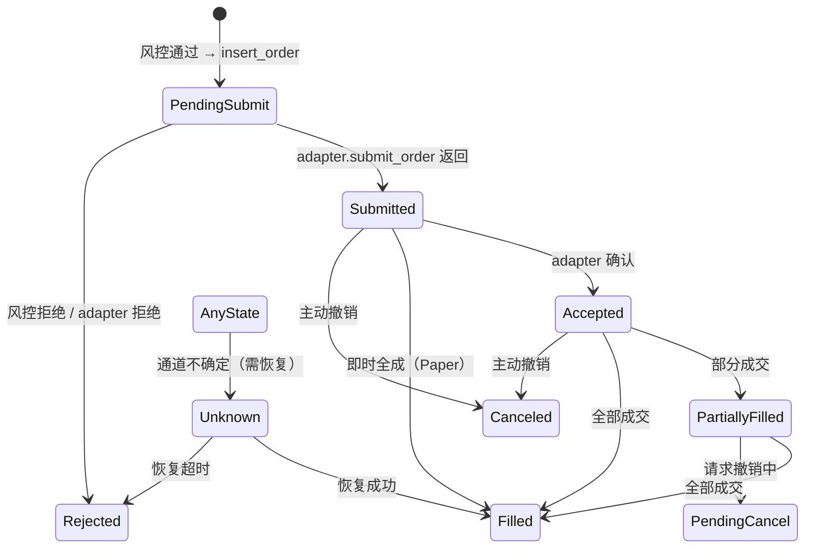
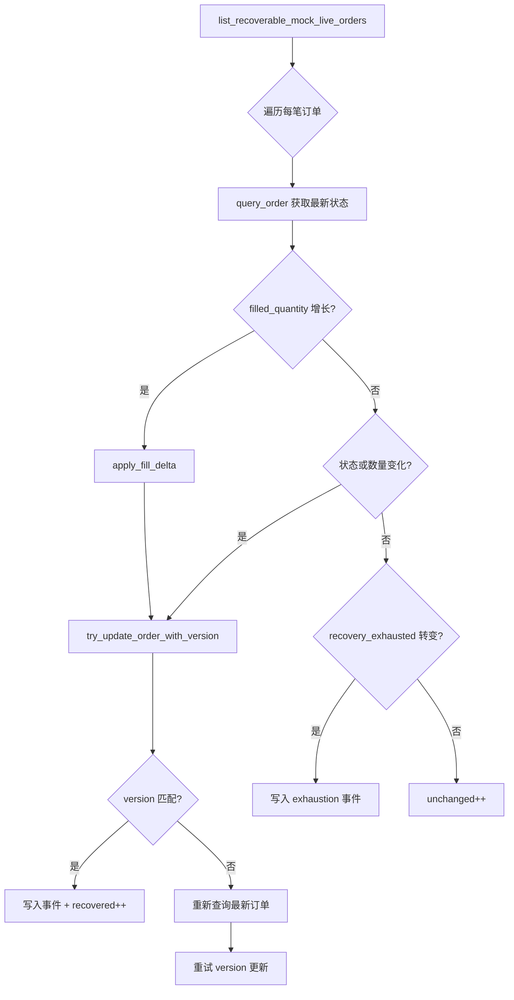

ExecutionKernel 是 Quantix 交易系统的**中央决策引擎**——它不直接理解行情数据，也不直接管理资金账户，而是作为一座精密的"调度枢纽"，将策略信号（Signal）、风控评估（RiskEvaluator）、执行适配器（ExecutionAdapter）与成交增量处理（FillDeltaApplier）四个关注点编织为一条原子化的订单流水线。本文将从架构拓扑、核心数据模型、订单全生命周期、恢复对账机制四个维度展开，揭示这一决策核心的设计哲学与实现细节。

## 架构定位与模块依赖

ExecutionKernel 采用**参数化泛型架构** `ExecutionKernel<A, F, R>`，其中 `A` 是适配器、`F` 是成交增量处理器、`R` 是风控评估器。这种设计使 Kernel 本身不依赖任何具体实现，所有行为通过 trait 注入，在编译期完成单态化（monomorphization），消除了运行时虚调度的开销。整个 `execution` 模块的内部依赖拓扑如下：

```
                    ┌──────────────────────┐
                    │   ExecutionDaemon    │  ← 守护进程入口
                    └──────┬───────────────┘
                           │ consume_next_pending_request
                    ┌──────▼───────────────┐
                    │   ExecutionKernel    │  ← 决策核心
                    │   <A, F, R>          │
                    └──┬───┬───┬──────────┘
              ┌────────┘   │   └────────┐
       ┌──────▼──┐  ┌─────▼─────┐  ┌───▼────────┐
       │ Adapter │  │ RiskEval  │  │FillDelta   │
       │ (trait) │  │ (trait)   │  │ (trait)    │
       └────┬────┘  └───────────┘  └────────────┘
            │ paper / mock_live / qmt_live
       ┌────▼────────────────────────────────┐
       │      StrategyRuntimeStore           │  ← SQLite 持久层
       │  (strategy_runs, orders, events...)  │
       └─────────────────────────────────────┘
```

上图中，ExecutionDaemon 作为运行时入口负责消费待执行的请求队列，将具体的适配器实例注入 Kernel 后启动执行流水线。Kernel 与持久层 `StrategyRuntimeStore` 的交互贯穿始终——从去重校验到订单状态变迁，每一步都留下不可变的事件记录。

Sources: [kernel.rs](src/execution/kernel.rs#L96-L101), [mod.rs](src/execution/mod.rs#L1-L13), [daemon.rs](src/execution/daemon.rs#L223-L250)

## 核心泛型结构体与 Trait 契约

### ExecutionKernel 三参数泛型

```rust
pub struct ExecutionKernel<A, F, R> {
    store: StrategyRuntimeStore,
    adapter: A,
    fill_delta: F,
    risk: R,
}
```

三个泛型参数分别约束为：

| 泛型参数 | Trait 约束 | 职责 |
|---------|-----------|------|
| `A` | `ExecutionAdapter` | 提交/查询/撤销订单，与外部交易通道交互 |
| `F` | `FillDeltaApplier` | 处理成交增量（delta），将成交转化为交易记录 |
| `R` | `RiskEvaluator` | 评估订单意图是否通过风控，以及在成交后同步风控状态 |

Kernel 提供两个构造器：`new()` 使用 `NoopFillDeltaApplier`（不处理增量成交），适用于 Paper 等即时成交模式；`with_fill_delta()` 注入自定义增量处理器，适用于 MockLive 等需要异步分步成交的场景。这种区分的核心洞察是：**并非所有执行模式都需要增量成交语义**——Paper 模式下单即全成，不存在"部分成交→后续再成交"的时序问题。

Sources: [kernel.rs](src/execution/kernel.rs#L96-L128)

### ExecutionAdapter Trait

ExecutionAdapter 定义了执行通道的**最小公共接口**——只包含三个操作：`submit_order`、`query_order`、`cancel_order`。返回类型 `OrderInitialResponse` 和 `OrderQueryResponse` 携带 adapter 侧的订单 ID、最新状态、成交数量、成交均价，以及可选的 `FillDetails` 结构（包含逐笔成交明细、手续费、执行场所等）。

Sources: [adapter.rs](src/execution/adapter.rs#L48-L63)

### RiskEvaluator Trait

```rust
pub trait RiskEvaluator: Send + Sync {
    async fn evaluate(&self, intent: OrderIntent) -> Result<RiskDecision>;
    async fn sync_after_fill(&self) -> Result<()>;
}
```

风控评估器只需回答一个二元问题：**允许或拒绝**（`RiskDecision::Allow` / `Reject { reason }`）。成交后的 `sync_after_fill` 回调则用于刷新风控服务的内部状态快照（如可用资金、持仓集中度等）。在 daemon 实现中，`RequestRuntimeRiskBridge` 将这一 trait 桥接到 `RiskService` 的买入规则引擎——卖出操作默认放行，买入操作则经过完整的集中度、波动率等检查链。

Sources: [kernel.rs](src/execution/kernel.rs#L16-L26), [daemon.rs](src/execution/daemon.rs#L98-L132)

## 订单生命周期：从信号到成交

### 状态机全景

订单在 Kernel 中经历的状态转换遵循以下有限状态机：



`OrderStatus` 枚举定义了 9 种状态，其中 `Filled`、`Canceled`、`Rejected` 为终态，`Unknown` 是一个特殊的中间态——表示执行通道返回了不确定的结果，需要后续恢复轮询来确认真实状态。

Sources: [models.rs](src/execution/models.rs#L36-L78)

### execute_once 完整流水线

`execute_once` 是 Kernel 的**主入口方法**，接收 `ExecutionRunRequest`（运行请求）和 `SignalEnvelope`（信号信封），执行以下五阶段流水线：

**阶段一：去重校验**。通过 `find_run_by_dedupe_key` 在 `strategy_runs` 表中查找是否已存在相同 `(strategy_name, mode, symbol, timeframe, bar_end)` 五元组的运行记录。若命中则直接返回既有结果，避免重复执行。这一机制依赖 `strategy_runs` 表上的 UNIQUE 索引 `idx_strategy_runs_dedupe`。

**阶段二：运行记录与信号事件持久化**。创建 `StrategyRunRecord`（状态 `Running`）和 `SignalEventRecord`，写入 SQLite。此时无论后续是否产生订单，运行记录和信号事件已被持久化，确保"信号发生了"这一事实永不丢失。

**阶段三：信号翻译（translate_signal）**。将 `Signal` 枚举翻译为 `Option<OrderIntent>`：
- `Signal::Hold` → `None`（无需下单，直接标记运行成功）
- `Signal::Buy` → 根据 `ExecutionPolicy.fixed_cash_per_buy` 和当前市价计算整手数量，再施加滑点（`slippage_bps` 基点）得到委托价
- `Signal::Sell` → 取当前持仓全量卖出，同样施加反向滑点

`board_lot_quantity` 函数将固定金额除以市价后取整到 100 的整数倍（A 股整手规则），确保委托数量合法。

**阶段四：执行已准备好的订单流（execute_prepared_order_flow）**。这是核心决策路径：

1. **客户端订单号去重**：`find_order_by_client_order_id` 检查是否已存在相同 `client_order_id` 的订单
2. **风控评估**：`risk.evaluate(intent)` 返回 `Allow` 或 `Reject`
3. **拒绝路径**：写入 `OrderRecord`（状态 `Rejected`）+ `OrderEventRecord`（事件类型 `risk_rejected`）+ 更新运行状态为 `Success`
4. **允许路径**：写入 `OrderRecord`（状态 `PendingSubmit`）+ 调用 `adapter.submit_order` → 处理响应

**阶段五：成交增量处理**。当适配器返回 `filled_quantity > 0` 时，进入增量成交流程：

```
apply_fill_delta(FillDeltaContext) → FillDeltaResult
    ↓ applied = true
insert_order_event(status_event)
insert_order_event(fill_applied_event)
update_order(status, filled_quantity, avg_fill_price)
mark_mock_live_fill_applied()  ← 记录已处理的 fill_id
risk.sync_after_fill()
```

如果增量处理失败，会写入 `fill_apply_failed` 事件并将运行状态标记为 `Failed`，确保异常可追溯。

Sources: [kernel.rs](src/execution/kernel.rs#L172-L267), [kernel.rs](src/execution/kernel.rs#L269-L523), [models.rs](src/execution/models.rs#L463-L547)

### translate_signal 的量化逻辑

| 信号 | 方向 | 数量计算 | 价格计算 | 订单类型 |
|------|------|---------|---------|---------|
| Buy | 买入 | `floor(fixed_cash / price / 100) * 100` | `price × (1 + slippage_bps / 10000)` | Market |
| Sell | 卖出 | `held_volume`（全量） | `price × (1 - slippage_bps / 10000)` | Market |
| Hold | — | — | — | — |

买入滑点向上（模拟真实市价单的冲击成本），卖出滑点向下（模拟滑点损失）。`ExecutionPolicy` 的两个字段 `fixed_cash_per_buy` 和 `slippage_bps` 构成了策略执行的**基础风控参数**——每笔买入固定金额控制了单笔风险敞口，滑点基点则保守地模拟了执行成本。

Sources: [models.rs](src/execution/models.rs#L463-L547)

## 核心数据模型

Kernel 的数据模型围绕**三个核心实体**和**一个事件溯源表**构建：

### StrategyRunRecord（运行记录）

每次策略执行对应一条记录，以 `run_id` 为主键，`(strategy_name, mode, symbol, timeframe, bar_end)` 五元组为去重键。`StrategyRunStatus` 只有三种状态：`Running` → `Success`/`Failed`。运行记录的生命周期覆盖从信号产生到订单终结的全过程。

Sources: [models.rs](src/execution/models.rs#L210-L223)

### OrderRecord（订单记录）

订单记录是整个执行子系统的**核心数据载体**，包含 17 个字段。关键设计点：

- **双重 ID**：`order_id`（内部主键）和 `client_order_id`（全局唯一，用于跨系统对账）
- **版本控制**：`version` 字段配合 `try_update_order_with_version` 实现乐观并发控制，防止恢复流程中的竞态写入
- **转换时间**：`last_transition_at` 独立于 `updated_at`，精确记录状态变迁时刻

Sources: [models.rs](src/execution/models.rs#L268-L288), [runtime_store.rs](src/execution/runtime_store.rs#L806-L841)

### OrderEventRecord（订单事件溯源）

每一笔状态变迁都写入 `order_events` 表，事件类型包括 `pending_submit`、`risk_rejected`、`fill_applied`、`fill_apply_failed`、`recovery_exhausted` 等。这种事件溯源（Event Sourcing）模式确保了订单生命周期的**完整审计链**——任何时刻都可以从事件流重建订单状态。

Sources: [models.rs](src/execution/models.rs#L397-L405), [kernel.rs](src/execution/kernel.rs#L868-L879)

### FillDetails 与成交增量

`FillDetails` 携带逐笔成交的完整信息——`fill_id`（适配器侧的唯一递增 ID）、`fill_quantity`、`fill_price`、`commission`、`fees`、`venue`、`broker_fill_id`。Kernel 通过比较 `fill_details.fill_id` 与 `MockLiveOrderState.last_applied_fill_id` 来实现**幂等增量处理**，确保同一次成交不会被重复应用。

Sources: [models.rs](src/execution/models.rs#L290-L336)

## 恢复与对账机制

### recover_pending_orders（订单恢复）

当 MockLive 适配器在不确定状态（`Unknown`）下返回时，订单的真实状态需要后续轮询确认。`recover_pending_orders` 方法扫描所有可恢复的 MockLive 订单，逐一调用 `adapter.query_order` 获取最新状态：



恢复流程的核心安全保障是**乐观并发控制**——`try_update_order_with_version` 在 SQL 层面执行 `WHERE order_id = ? AND version = ?`，只有当版本号匹配时才更新并递增版本。若版本不匹配（说明其他流程已更新该订单），恢复流程会重新读取最新订单并重试。这种设计避免了在并发恢复场景下的状态覆盖问题。

Sources: [kernel.rs](src/execution/kernel.rs#L548-L857)

### ReconciliationService（对账服务）

对账服务提供更高层次的**状态一致性保障**，由 `OpenOrderScanner` 和 `ReconciliationService` 两层组成：

| 组件 | 职责 |
|------|------|
| `OpenOrderScanner` | 扫描非终态订单、过滤 Unknown/过期订单、按状态聚合统计 |
| `ReconciliationService` | 对每笔敞口订单执行对账，处理 Unknown 超时、状态修复 |

对账动作枚举 `ReconciliationAction` 定义了五种可能的结果：`NoAction`（状态一致）、`StateUpdated`（本地已更新）、`Recovered`（从 Unknown 恢复）、`MarkedFailed`（超时标记失败）、`Cancelled`（因不一致撤销）、`ManualIntervention`（需人工介入）。

Sources: [reconciliation.rs](src/execution/reconciliation.rs#L60-L100), [reconciliation.rs](src/execution/reconciliation.rs#L216-L272)

## ExecutionDaemon：运行时入口

ExecutionDaemon 是 Kernel 的**生产级调度器**，其核心函数 `execute_request_by_id_with_components` 实现了从 ExecutionRequest 到完成的全流程：

1. 从 `StrategyRuntimeStore` 获取 pending 状态的 ExecutionRequest
2. 使用 `try_start_execution_request` 原子地将其状态转为 `InProgress`（CAS 操作，防止并发消费）
3. 根据 `target_mode` 动态构造 Kernel 实例：
   - **paper**：`PaperExecutionAdapter` + 默认 NoopFillDeltaApplier
   - **mock_live**：`MockLiveExecutionAdapter` + `RequestFillDeltaBridge`
   - **qmt_live**：`QmtLiveExecutionAdapter`（通过 Windows Bridge）
4. 调用 `kernel.execute_request(prepared)`
5. 成功则 `try_complete_execution_request`，失败则 `try_fail_execution_request`

每个模式的适配器实例化策略不同，但都共享同一个 `ExecutionKernel` 执行框架。这种"同一 Kernel、不同适配器"的架构确保了从 Paper 到实盘的行为一致性。

Sources: [daemon.rs](src/execution/daemon.rs#L179-L304)

## 持久层：StrategyRuntimeStore

`StrategyRuntimeStore` 基于 SQLite（通过 sqlx 的 `SqlitePool`），管理以下核心数据表：

| 表名 | 主键 | 核心索引 | 用途 |
|------|------|---------|------|
| `strategy_runs` | `run_id` | `(strategy_name, mode, symbol, timeframe, bar_end)` UNIQUE | 运行记录去重 |
| `signal_events` | `event_id` | `(run_id)`, `(symbol, ts)` | 信号事件流 |
| `orders` | `order_id` | `(client_order_id)` UNIQUE, `(run_id)`, `(symbol, status)` | 订单状态 |
| `order_events` | `event_id` | `(order_id)`, `(client_order_id, event_time)` | 订单事件溯源 |
| `mock_live_orders` | `order_id` | — | MockLive 状态机 |
| `runner_checkpoints` | `checkpoint_id` | `(strategy_name, mode, symbol, timeframe)` UNIQUE | 检查点 |
| `signals` | `signal_id` | `(strategy_instance_id, symbol, timeframe, bar_end)` UNIQUE | 信号审批 |
| `execution_requests` | `request_id` | `(signal_id)` UNIQUE, `(request_status)`, `(target_mode, request_status)` | 执行请求队列 |
| `strategy_daemon_checkpoints` | `checkpoint_id` | `(strategy_instance_id, symbol, timeframe)` UNIQUE | 守护进程检查点 |

连接池配置为 `max_connections(1)`，确保 SQLite 的写入串行化。Schema 使用 `CREATE TABLE IF NOT EXISTS` + `CREATE UNIQUE INDEX IF NOT EXISTS` 的幂等创建策略，并通过 `ensure_column_exists` 方法处理渐进式列扩展（如 `remaining_quantity`、`last_transition_at`、`version` 三个后续新增列）。

Sources: [runtime_store.rs](src/execution/runtime_store.rs#L19-L228), [runtime_store.rs](src/execution/runtime_store.rs#L255-L328)

## 算法交易扩展（algo 模块）

在 Kernel 的同步订单流之上，`execution::algo` 子模块提供了**异步算法交易**能力。核心抽象是 `AlgorithmExecutor` trait，支持将大额订单拆分为多个子订单（Slice），按时间（TWAP）或成交量（VWAP）分布执行：

```rust
pub trait AlgorithmExecutor: Send + Sync {
    fn algo_type(&self) -> AlgoType;
    async fn initialize(&mut self, params: AlgoParams) -> Result<String>;
    async fn start(&mut self, algo_id: &str) -> Result<()>;
    async fn step(&mut self, algo_id: &str, adapter: &dyn ExecutionAdapter) -> Result<Option<ChildOrder>>;
    // ...
}
```

`AlgoManager` 使用 `Arc<RwLock<HashMap>>` 管理活跃算法实例，提供 `get_ready_algos()` 供调度器查询已到执行时间的子订单。目前实现了 TWAP 和 VWAP 两种算法，POV 和 Iceberg 为预留接口。

Sources: [algo/mod.rs](src/execution/algo/mod.rs#L1-L60), [algo/executor.rs](src/execution/algo/executor.rs#L104-L140)

## 设计总结与关键模式

| 设计模式 | 在 Kernel 中的体现 |
|---------|-------------------|
| **策略模式（Strategy Pattern）** | `ExecutionAdapter` / `RiskEvaluator` / `FillDeltaApplier` 三个 trait 注入 |
| **事件溯源（Event Sourcing）** | `order_events` 表记录每次状态变迁，支持完整审计重建 |
| **乐观并发控制（OCC）** | `version` 字段 + `try_update_order_with_version` SQL 条件更新 |
| **幂等处理（Idempotency）** | `find_run_by_dedupe_key` 去重 + `find_order_by_client_order_id` 去重 + `fill_id` 幂等检查 |
| **CAS 状态机（Compare-And-Swap）** | `try_start_execution_request` / `try_complete_execution_request` 原子状态转换 |

ExecutionKernel 的核心设计哲学可以归纳为一句话：**通过 trait 隔离变数，通过事件记录一切，通过版本号防止竞态**。这使得从 Paper 测试到 MockLive 模拟再到 QMT 实盘，执行逻辑保持完全一致，唯一的差异仅在于适配器注入的具体实现。

Sources: [kernel.rs](src/execution/kernel.rs#L1-L135)

---

**延伸阅读**：

- 要了解三种执行适配器的具体实现细节，参见 [执行适配器架构（Paper / MockLive / QMT Bridge）](12-zhi-xing-gua-pei-qi-jia-gou-paper-mocklive-qmt-bridge)
- 要了解策略信号如何产生并被 Kernel 消费，参见 [Strategy Trait 策略接口与内置策略实现](10-strategy-trait-ce-lue-jie-kou-yu-nei-zhi-ce-lue-shi-xian)
- 要了解风控评估器的完整规则链，参见 [风控服务：规则引擎、行业集中度与波动率检查](16-feng-kong-fu-wu-gui-ze-yin-qing-xing-ye-ji-zhong-du-yu-bo-dong-lu-jian-cha)
- 要了解策略守护进程如何触发 Kernel 执行，参见 [策略守护进程、Signal Daemon 与 systemd 服务管理](13-ce-lue-shou-hu-jin-cheng-signal-daemon-yu-systemd-fu-wu-guan-li)
- 要了解运行时数据库的表结构与冻结快照，参见 [策略运行时存储（SQLite runtime.db）与冻结快照机制](14-ce-lue-yun-xing-shi-cun-chu-sqlite-runtime-db-yu-dong-jie-kuai-zhao-ji-zhi)