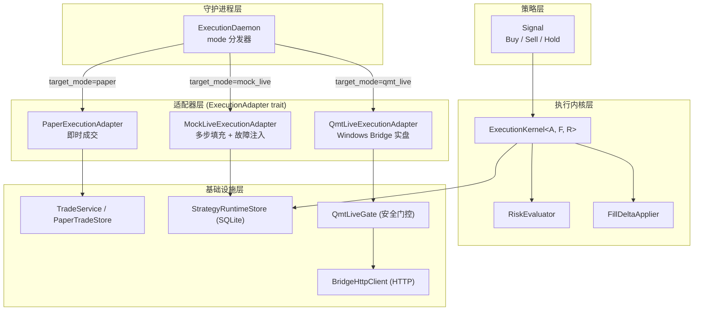
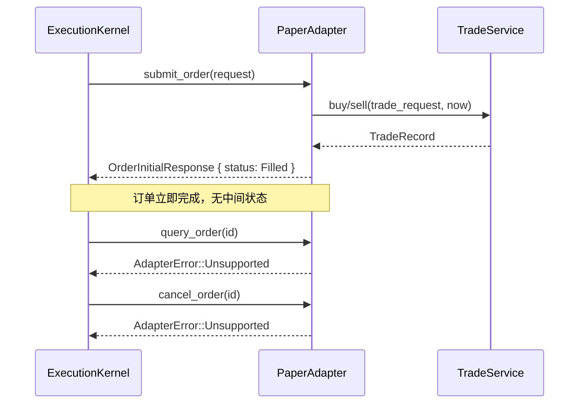
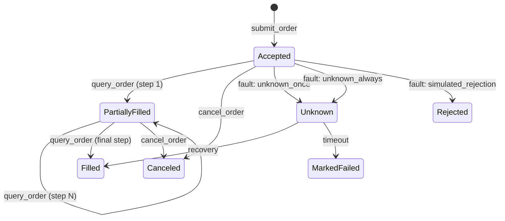
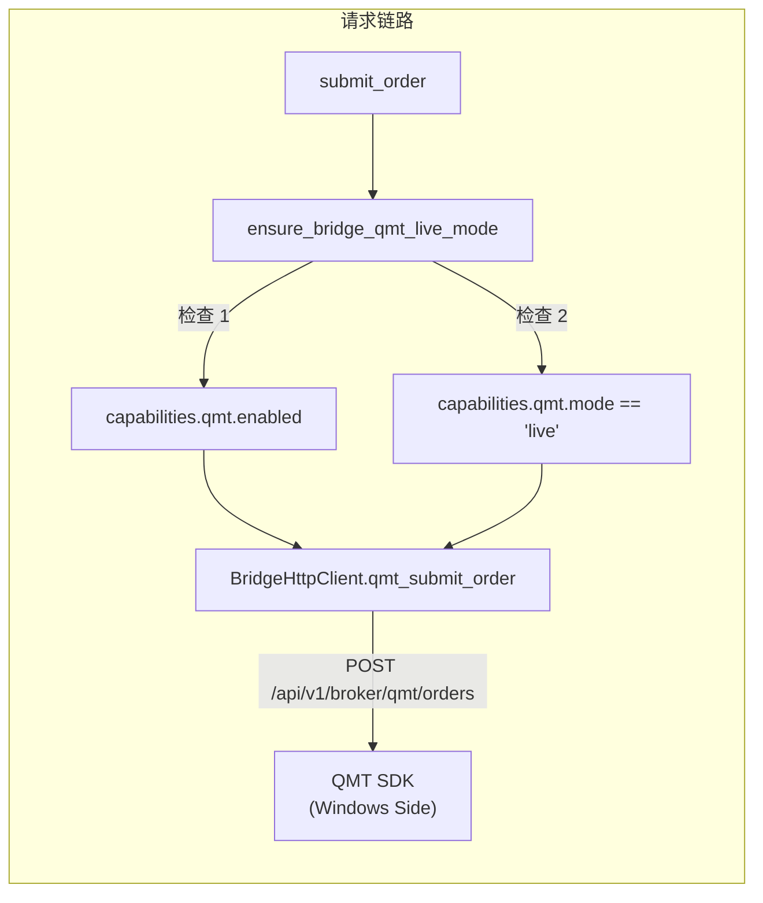
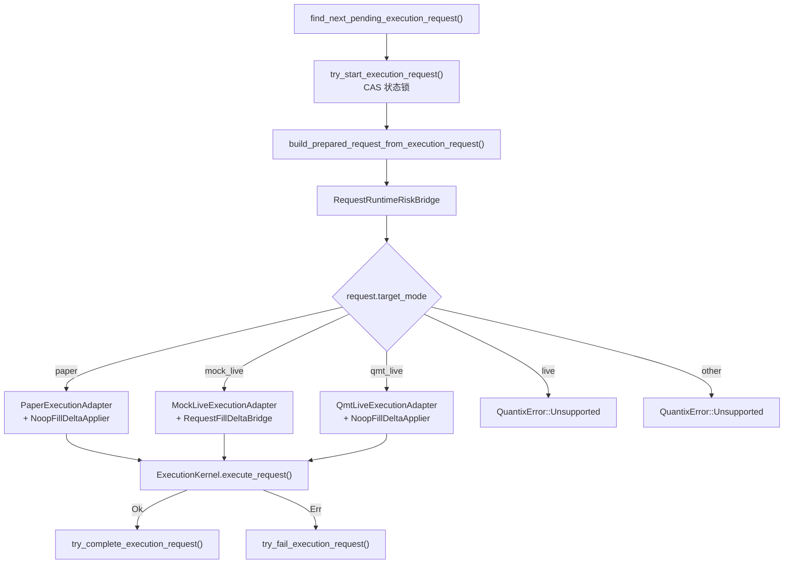

执行适配器是 Quantix 交易系统的核心抽象层，它将策略信号的下单执行逻辑从具体的交易通道中解耦出来。通过定义统一的 `ExecutionAdapter` trait，系统支持从纯纸面模拟（Paper）、带故障注入的多步模拟实盘（MockLive）到真实的 QMT 券商下单三种执行通道，并可在运行时通过 `target_mode` 无缝切换。本文将深入剖析适配器接口契约、各适配器的内部实现机制、安全门控设计以及对账恢复流程。

Sources: [adapter.rs](src/execution/adapter.rs#L1-L64), [mod.rs](src/execution/mod.rs#L1-L14)

## 架构总览：分层抽象与适配器契约

执行适配器位于 `ExecutionKernel` 与底层交易通道之间，承担 **下单 / 查询 / 撤单** 三个核心操作的抽象。系统遵循 **策略 → 内核 → 适配器 → 交易通道** 的调用链路，每一层都有清晰的职责边界。

`ExecutionAdapter` trait 定义了三个异步方法，构成了所有适配器必须遵守的 **最小契约**：

| 方法 | 签名 | 职责 |
|------|------|------|
| `adapter_name` | `fn adapter_name(&self) -> &'static str` | 返回适配器标识符，用于日志和订单记录 |
| `submit_order` | `async fn submit_order(AdapterOrderRequest) -> Result<OrderInitialResponse, AdapterError>` | 提交订单，返回初始状态 |
| `query_order` | `async fn query_order(order_id: &str) -> Result<OrderQueryResponse, AdapterError>` | 查询订单当前状态与成交详情 |
| `cancel_order` | `async fn cancel_order(order_id: &str) -> Result<(), AdapterError>` | 请求撤销指定订单 |

请求/响应数据结构经过精心设计，`AdapterOrderRequest` 携带 `client_order_id`、`symbol`、`side`、`quantity`、`price` 五个核心字段；`OrderInitialResponse` 和 `OrderQueryResponse` 共享相同的返回结构，包括 `adapter_order_id`、`latest_status`、`filled_quantity`、`avg_fill_price`、`fill_details` 和 `rejection_reason`。`AdapterError` 枚举区分 `Unsupported`（功能未实现）、`Execution`（执行失败）和 `Network`（网络故障）三种错误类型，为上层提供了精确的错误分类依据。

Sources: [adapter.rs](src/execution/adapter.rs#L7-L63)

## OrderStatus 状态机与订单生命周期

所有适配器共享统一的 `OrderStatus` 枚举，定义了订单从创建到终态的完整状态流转路径：

| 状态 | 含义 | 是否终态 |
|------|------|----------|
| `PendingSubmit` | 等待提交 | 否 |
| `Submitted` | 已提交至交易所 | 否 |
| `Accepted` | 交易所已接受 | 否 |
| `PartiallyFilled` | 部分成交 | 否 |
| `PendingCancel` | 撤单请求已发出 | 否 |
| `Filled` | 完全成交 | **是** |
| `Canceled` | 已撤销 | **是** |
| `Rejected` | 已拒绝 | **是** |
| `Unknown` | 状态不确定（需恢复） | 否 |

`Unknown` 状态是一个特殊设计——它不是终态，而是一个 **需要主动恢复的中间状态**。当适配器返回网络错误或超时时，订单会被标记为 `Unknown`，随后由 `recover_pending_orders` 流程或 `ReconciliationService` 尝试恢复。

Sources: [models.rs](src/execution/models.rs#L36-L78)

## Paper 适配器：即时成交模拟

**PaperExecutionAdapter** 是最简单的适配器实现，其设计哲学是 **同步即时成交**——`submit_order` 调用后直接返回 `Filled` 状态，不经过 `Accepted` → `PartiallyFilled` 等中间状态。

该适配器的核心实现围绕 `TradeService<Store>` 泛型构建，其中 `Store` 必须实现 `PaperTradeStore` trait。下单时，`AdapterOrderRequest` 被转换为 `TradeOrderRequest`（通过 `to_trade_order_request` 辅助函数完成 `Decimal → f64` 的价格转换），然后根据 `OrderSide` 分别调用 `trade_service.buy()` 或 `trade_service.sell()`。成交结果中 `commission` 和 `fees` 被设为 `Decimal::ZERO`，venue 标记为 `"paper"`。

值得注意的是，`query_order` 和 `cancel_order` 均返回 `AdapterError::Unsupported`，这是设计上的有意为之——Paper 模式下订单即时完成，不存在需要查询或撤销的挂单。

Sources: [paper.rs](src/execution/paper.rs#L1-L127)

## MockLive 适配器：多步填充与故障注入

**MockLiveExecutionAdapter** 是系统中最复杂的模拟适配器，它的核心价值在于 **精确模拟实盘交易的行为特征**：异步成交、部分填充、状态轮询、甚至各类故障场景。

### 多步填充计划（Fill Plan）

MockLive 的成交模拟基于 **可配置的填充计划**（`Vec<MockLiveFillStep>`），每个 step 定义了 `quantity` 和 `delay_secs`。订单提交时仅返回 `Accepted` 状态，随后每次 `query_order` 调用推进填充计划的一个 step，状态依次从 `Accepted` → `PartiallyFilled` → `Filled` 演进。

`MockLiveOrderState` 持有完整的填充状态机：`fill_plan`（填充计划）、`next_step_index`（当前执行到的步骤）、`last_applied_fill_id`（已应用到交易系统的填充 ID）、`simulated_fill_price`（模拟成交价）等。状态通过 `StrategyRuntimeStore` 持久化到 SQLite，确保进程重启后可以恢复。

Sources: [mock_live.rs](src/execution/mock_live.rs#L1-L113)

### 故障注入引擎

MockLive 适配器内置了六种故障注入模式，通过 `MockLiveFaultInjection.mode` 字段控制，覆盖了实盘交易中最常见的异常场景：

| 故障模式 | 行为 | 恢复策略 |
|----------|------|----------|
| `unknown_once` | 首次查询返回 `Unknown`，之后自动清除 | 自动恢复 |
| `unknown_always` | 始终返回 `Unknown`，累计 3 次后标记 `recovery_exhausted` | 超时后强制失败 |
| `network_timeout` | 模拟网络延迟后返回 `AdapterError::Network` | 一次性触发 |
| `network_disconnect` | 立即返回 `AdapterError::Network` | 一次性触发 |
| `delayed_response:<secs>` | 延迟指定秒数后正常返回 | 一次性触发 |
| `simulated_rejection:<reason>` | 返回 `Rejected` 状态和指定拒绝原因 | 一次性触发 |

`unknown_always` 模式特别值得注意：它模拟了持续性的状态不明确场景，当 `unknown_retries` 超过阈值（3 次）时，会将 `recovery_exhausted` 设为 `true` 并记录 `exhausted_reason`。这个设计直接驱动了 `ExecutionKernel::recover_pending_orders` 中的恢复流程——当检测到 `recovery_exhausted` 转为 `true` 时，系统会记录 `recovery_exhausted` 事件。

Sources: [mock_live.rs](src/execution/mock_live.rs#L155-L332), [models.rs](src/execution/models.rs#L346-L395)

### 时钟抽象与可测试性

MockLive 引入了 `MockLiveClock` trait 抽象时钟，默认实现 `SystemMockLiveClock` 返回 `Utc::now()`。这个设计允许测试代码注入可控的时间源，精确验证 `planned_fill_time` 等时间相关的行为。

Sources: [mock_live.rs](src/execution/mock_live.rs#L11-L22)

## QMT Live 适配器：真实交易通道

**QmtLiveExecutionAdapter** 是连接 Windows 端 `quantix-bridge` 服务的真实交易适配器。它通过 `BridgeHttpClient` 发送 HTTP 请求到 bridge 服务，bridge 再调用 QMT SDK 执行实际的下单操作。

### 三层安全防护

**安全门控**（`qmt_live_gate.rs`）在每次下单前执行双重验证：
1. **能力检查**：`capabilities.qmt.enabled` 必须为 `true`，确认 bridge 的 QMT 模块已启用
2. **模式检查**：`capabilities.qmt.mode` 必须等于 `"live"`，防止在 preview/mock 模式下误提交真实订单

这两项检查通过 `ensure_bridge_qmt_live_mode` 函数实现，任何一项不满足都会返回 `QuantixError::Other` 错误，阻止订单提交。

Sources: [qmt_live_gate.rs](src/execution/qmt_live_gate.rs#L1-L25), [qmt_live_adapter.rs](src/execution/qmt_live_adapter.rs#L160-L224)

### Bridge 通信协议

QMT Live 适配器与 bridge 服务之间定义了完整的 RESTful 通信协议：

| 操作 | HTTP 方法 | 路径 | 请求体 | 响应体 |
|------|-----------|------|--------|--------|
| 下单 | POST | `/api/v1/broker/qmt/orders` | `BridgeQmtOrderRequest` | `BridgeQmtOrderResponse` |
| 查询 | GET | `/api/v1/broker/qmt/orders/{id}` | — | `BridgeQmtOrderQueryResponse` |
| 撤单 | DELETE | `/api/v1/broker/qmt/orders/{id}` | — | `BridgeQmtCancelResponse` |
| 预览 | POST | `/api/v1/broker/qmt/orders/preview` | `BridgeQmtPreviewRequest` | `BridgeQmtPreviewResponse` |
| 账户状态 | GET | `/api/v1/broker/qmt/account/status` | — | `BridgeQmtAccountStatusResponse` |
| 持仓查询 | GET | `/api/v1/broker/qmt/positions` | — | `Vec<BridgeQmtPosition>` |
| 资产查询 | GET | `/api/v1/broker/qmt/account/asset` | — | `BridgeQmtAsset` |

所有请求通过 `X-Quantix-Api-Key` 头进行认证。订单类型判断逻辑为：价格为零时视为市价单（`"market"`），否则为限价单（`"limit"`）。

Sources: [qmt_live_adapter.rs](src/execution/qmt_live_adapter.rs#L70-L96), [bridge/client.rs](src/bridge/client.rs#L113-L206), [bridge/models.rs](src/bridge/models.rs#L88-L167)

### QmtBridgePreviewAdapter：下单前预览

`QmtBridgePreviewAdapter` 是一个独立的预览组件，不实现 `ExecutionAdapter` trait，而是提供 `preview_request` 方法用于在下单前获取 bridge 的预览结果。它从 `ExecutionRequestRecord.payload_json` 中提取 `execution_snapshot` 和 `order_intent`，调用 bridge 的 preview 接口，返回 `OrderInitialResponse`。代码中还包含 `normalize_symbol` 函数，自动为纯数字代码添加市场后缀（`6` 开头加 `.SH`，其他加 `.SZ`）。

Sources: [qmt_bridge.rs](src/execution/qmt_bridge.rs#L1-L93)

## ExecutionDaemon：模式分发器

`ExecutionDaemon` 是连接执行请求队列与具体适配器的 **调度中心**。它通过 `consume_next_pending_request_with_components` 函数消费 pending 状态的 `ExecutionRequestRecord`，根据 `target_mode` 字段动态选择适配器：

关键设计点在于 **FillDeltaApplier 的差异配置**：
- **Paper 模式**：使用 `NoopFillDeltaApplier`，因为 Paper 直接成交，无需增量处理
- **MockLive 模式**：使用 `RequestFillDeltaBridge`，将增量成交转化为 `TradeService` 的 buy/sell 操作
- **QMT Live 模式**：使用 `NoopFillDeltaApplier`，实盘的真实成交由 bridge 侧管理

`RequestRuntimeRiskBridge` 是 Daemon 中的风控桥接器，它在买入时从 `PaperTradeAccount` 构建 `RiskAccountSnapshot` 和 `ProjectedBuyImpact`，调用 `RiskService.buy_checks()` 进行前置风控检查。

Sources: [daemon.rs](src/execution/daemon.rs#L134-L304)

## 对账与恢复机制

系统在两个层面实现对账恢复，形成互补的安全网。

### ExecutionKernel 层：recover_pending_orders

`ExecutionKernel::recover_pending_orders` 专门针对 MockLive 模式的挂单恢复。它通过 `store.list_recoverable_mock_live_orders()` 获取所有可恢复订单，逐个调用 `adapter.query_order()` 查询最新状态，然后与本地记录对比：

1. **成交增量 > 0**：计算 delta，调用 `fill_delta.apply_fill_delta()`，更新订单状态
2. **状态变化但无成交增量**：直接更新订单状态
3. **recovery_exhausted 转换**：记录 `recovery_exhausted` 事件

整个过程使用 `try_update_order_with_version` 实现乐观并发控制，防止并发更新导致数据不一致。

Sources: [kernel.rs](src/execution/kernel.rs#L548-L857)

### ReconciliationService 层：全量对账

`ReconciliationService` 提供更高层次的对账能力，通过 `OpenOrderScanner` 扫描所有非终态订单：

| 组件 | 职责 | 关键参数 |
|------|------|----------|
| `OpenOrderScanner` | 扫描挂单、过期订单、Unknown 订单 | `stale_threshold_seconds=3600`、`unknown_timeout_seconds=300` |
| `ReconciliationService` | 执行对账、处理 Unknown 状态 | 自动处理 `recovery_exhausted` |
| `ReconciliationAction` | 对账动作枚举 | `NoAction`/`StateUpdated`/`Recovered`/`MarkedFailed`/`Cancelled`/`ManualIntervention` |

对账流程对 Unknown 订单有专门的处理路径：若超过 5 分钟仍在 Unknown 状态，系统会检查 MockLive 订单状态进行恢复判定；若 `recovery_exhausted` 为 true，则将订单标记为失败。

Sources: [reconciliation.rs](src/execution/reconciliation.rs#L1-L491)

## 三适配器能力对比

| 特性 | Paper | MockLive | QMT Live |
|------|-------|----------|----------|
| `submit_order` | ✅ 即时 Filled | ✅ 返回 Accepted | ✅ 转发至 Bridge |
| `query_order` | ❌ Unsupported | ✅ 多步推进 | ✅ 查询 Bridge |
| `cancel_order` | ❌ Unsupported | ✅ 设置 cancel_requested | ✅ 调用 Bridge DELETE |
| 成交延迟 | 零延迟 | 按 fill_plan 分步 | 取决于实盘 |
| 故障注入 | 无 | 6 种模式 | 无 |
| 持久化 | TradeService | StrategyRuntimeStore | Bridge 侧 |
| 安全门控 | 无 | 无 | QmtLiveGate 双重检查 |
| 网络依赖 | 无 | 无 | HTTP to Bridge |
| FillDeltaApplier | Noop | RequestFillDeltaBridge | Noop |
| 适用场景 | 策略回测验证 | 实盘模拟训练 | 真实交易 |

Sources: [paper.rs](src/execution/paper.rs#L25-L110), [mock_live.rs](src/execution/mock_live.rs#L115-L332), [qmt_live_adapter.rs](src/execution/qmt_live_adapter.rs#L154-L338)

## 算法交易扩展（algo 模块）

`execution/algo` 模块在适配器之上提供了算法交易能力，当前实现了 TWAP（时间加权平均价格）和 VWAP（成交量加权平均价格）两种算法。该模块定义了 `AlgorithmExecutor` trait 和 `Slice`/`SlicePlan` 数据结构，将大额订单拆分为多个子订单通过底层适配器逐步执行。

| 算法类型 | 策略 | 适用场景 |
|----------|------|----------|
| TWAP | 按时间均匀切片 | 流动性一般的标的 |
| VWAP | 按历史成交量分布切片 | 大盘蓝筹 |
| POV | 按实时成交量参与率 | 流动性充足的标的 |
| Iceberg | 隐藏真实订单量 | 避免市场冲击 |

Sources: [algo/mod.rs](src/execution/algo/mod.rs#L1-L61)

## 相关阅读

- 适配器的上层调用链路请参阅 [ExecutionKernel 执行决策核心与订单生命周期](11-executionkernel-zhi-xing-jue-ce-he-xin-yu-ding-dan-sheng-ming-zhou-qi)
- 守护进程的持续运行机制请参阅 [策略守护进程、Signal Daemon 与 systemd 服务管理](13-ce-lue-shou-hu-jin-cheng-signal-daemon-yu-systemd-fu-wu-guan-li)
- 运行时存储的持久化细节请参阅 [策略运行时存储（SQLite runtime.db）与冻结快照机制](14-ce-lue-yun-xing-shi-cun-chu-sqlite-runtime-db-yu-dong-jie-kuai-zhao-ji-zhi)
- Bridge 的 Windows 侧架构请参阅 [Windows Bridge 架构：WSL2 与通达信/QMT 数据桥接](27-windows-bridge-jia-gou-wsl2-yu-tong-da-xin-qmt-shu-ju-qiao-jie)
- 模拟交易的费用计算请参阅 [模拟交易、费用计算与交易报告](17-mo-ni-jiao-yi-fei-yong-ji-suan-yu-jiao-yi-bao-gao)