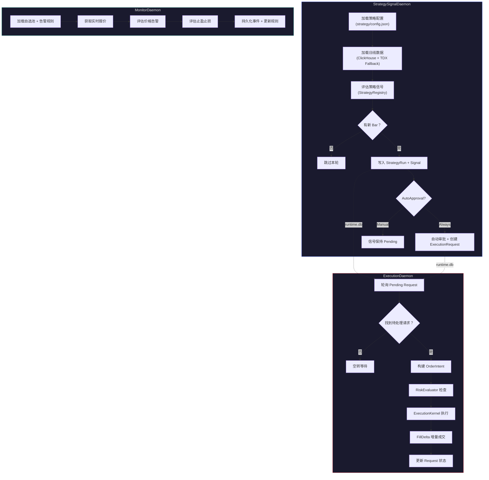
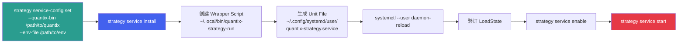

Quantix 的**策略守护进程体系**是实现"信号发现 → 审批 → 执行"自动化流水线的中枢神经。该体系由三个独立但协作的守护进程组成：**StrategySignalDaemon**（策略信号守护进程）负责周期性扫描行情、评估策略并产出信号；**ExecutionDaemon**（执行守护进程）负责消费已审批信号并完成订单提交；**MonitorDaemon**（监控守护进程）负责自选池价格告警与止盈止损规则评估。三者通过 SQLite runtime.db 的信号表和执行请求表进行松耦合协作，并通过 systemd 用户级服务实现生产化部署。本文将深入解析每个守护进程的核心机制、数据流设计、配置热加载策略以及 systemd 双层服务管理架构。

Sources: [daemon.rs](src/strategy/daemon.rs#L24-L33), [daemon.rs](src/execution/daemon.rs#L134-L177), [runner.rs](src/monitor/runner.rs#L27-L33)

## 架构总览：三层守护进程协作模型

整个守护进程体系采用**分层解耦**设计：StrategySignalDaemon 产出信号记录，人工或自动审批后生成 ExecutionRequest，再由 ExecutionDaemon 消费执行。MonitorDaemon 则独立运行，与交易系统通过共享的 paper trade 存储间接关联。三层之间没有直接 RPC 调用，全部通过 `runtime.db` 的 SQLite 表（`strategy_runs`、`signal_events`、`execution_requests`、`daemon_checkpoints`）完成状态传递。



三层守护进程共享的设计原则包括：**幂等性**（同一 bar_end 不会重复处理信号）、**热配置加载**（配置文件修改后自动生效无需重启）、**原子性状态转移**（通过 SQLite 的 CAS 操作防止并发竞争）。

Sources: [daemon.rs](src/strategy/daemon.rs#L71-L200), [daemon.rs](src/execution/daemon.rs#L134-L304), [runner.rs](src/monitor/runner.rs#L58-L104)

## StrategySignalDaemon：信号生产引擎

### 核心结构与初始化

`StrategySignalDaemon<L>` 是一个泛型结构体，其类型参数 `L` 代表数据加载器，必须同时实现 `StrategyBarLoader`（加载日线数据）和 `StrategyBarLoadTelemetry`（报告数据来源）两个 trait。这种泛型设计使得生产环境可以使用 ClickHouse + TDX fallback 组合加载器，而测试环境可以注入内存假数据。

| 字段 | 类型 | 职责 |
|------|------|------|
| `loader` | `L`（泛型） | 日线 K 线数据加载器 |
| `store` | `StrategyRuntimeStore` | SQLite runtime.db 的访问句柄 |
| `config_store` | `JsonStrategyConfigStore` | 策略配置 JSON 文件的读写器 |
| `execution_config_store` | `Option<JsonExecutionConfigStore>` | 执行配置（可选，控制自动审批） |
| `registry` | `StrategyRegistry` | 策略实例工厂，按名称构建策略评估器 |
| `config` | `StrategyDaemonConfig` | 当前内存中的策略配置快照 |
| `last_config_mtime` | `Option<SystemTime>` | 上次加载配置时的文件修改时间戳 |

初始化流程分为两个构造路径：`new()` 创建基础 daemon，不包含执行配置（自动审批不生效）；`with_execution_config_store()` 则额外绑定执行配置存储，启用基于 `AutoApprovalMode` 的自动审批逻辑。构造时立即读取配置文件的 `mtime`，作为后续热加载的比对基准。

Sources: [daemon.rs](src/strategy/daemon.rs#L24-L69)

### 单轮执行流程：`run_once()`

`run_once()` 是 daemon 的核心方法，每一轮执行遵循以下严格步骤：

**第一步：配置热加载。** 通过 `reload_config_if_changed()` 比较当前文件 `mtime` 与上次记录值。如果文件被外部修改（例如用户编辑了 `config.json`），立即重新加载配置到内存。这意味着运维人员无需重启 daemon 即可增删策略实例或修改参数。

**第二步：筛选活跃标的。** 从配置中过滤出 `enabled: true` 的股票。当前版本要求**恰好一个 enabled 股票**——这是 MVP 阶段的有意限制，简化了信号处理的复杂度。

**第三步：数据加载与策略评估。** 对每个 enabled 策略实例，通过 `StrategyRegistry::build()` 构建评估器，加载数据量取 `max(10000, evaluator.lookback_required() + 1)` 条日线。加载完成后调用 `evaluator.evaluate(&bars)` 获取 `SignalEnvelope`，包含最终的 Buy/Sell/Hold 信号。

**第四步：检查点比对（幂等性保证）。** 从 `runtime.db` 的 `daemon_checkpoints` 表查询该策略实例+标的+周期的最近处理位置。如果 `checkpoint.last_processed_bar >= latest_bar_end`，说明该 K 线已经处理过，跳过本轮——这是防止重复信号的核心机制。

**第五步：Bootstrap 首次初始化。** 如果不存在检查点记录，daemon 仅创建 checkpoint 而不产生信号。这遵循 `BootstrapPolicy::LatestOnly` 策略：首次启动不回填历史信号，仅将当前最新 K 线标记为已处理基准点。

**第六步：写入三元组记录。** 对于有新 K 线的情况，daemon 在一个事务中写入三条记录：`StrategyRunRecord`（运行记录）、`StrategySignalRecord`（信号记录，包含 bar_source_id、market_price、execution_policy 等元数据）、`StrategyDaemonCheckpointRecord`（更新检查点）。

**第七步：自动审批决策。** 如果绑定了 `execution_config_store` 且 `auto_approval.mode == Always`，立即调用 `approve_signal_and_create_request()`，将信号状态从 Pending 推进到 Approved，并创建一个 `target_mode=paper, target_account=default` 的执行请求。

Sources: [daemon.rs](src/strategy/daemon.rs#L71-L237)

### 数据加载的 Fallback 策略

`FallbackStrategyBarLoader<P>` 实现了一个两级数据获取策略：**主数据源优先 → TDX 日线文件兜底**。主数据源通常是 ClickHouse 存储的历史 K 线，当主数据源返回空结果或出错时，自动尝试从通达信本地 `.day` 文件加载。

数据来源信息通过 `StrategyBarLoadSource` 结构体进行遥测记录：

| 字段 | 说明 | 示例值 |
|------|------|--------|
| `source_id` | 实际使用的数据源标识 | `"clickhouse-storage"` 或 `"tdx-day-file"` |
| `fallback_used` | 是否使用了备用数据源 | `false`（主数据源成功）/ `true`（回退到 TDX） |

TDX 文件路径解析支持两种模式：通过 `QUANTIX_TDX_MARKET` 环境变量指定市场（如 `sh`、`sz`），或在未指定时自动搜索 `sh/sz/bj/ds` 四个市场目录。环境变量同时兼容新旧命名：`QUANTIX_TDX_ROOT` / `TDX_ROOT`、`QUANTIX_TDX_MARKET` / `TDX_MARKET`。

Sources: [fallback_loader.rs](src/strategy/fallback_loader.rs#L22-L131)

### 日线 Bar 结束时间规范化

一个容易被忽视但至关重要的细节是 `normalize_daily_bar_end()` 函数。它将 K 线的 `NaiveDate`（如 `2026-03-15`）转换为 UTC 时间戳 `2026-03-15T07:00:00Z`（对应北京时间 15:00 收盘）。这个时间戳是检查点比对的 key，确保不同时区的运行环境不会产生重复信号。

Sources: [daemon.rs](src/strategy/daemon.rs#L246-L254)

## ExecutionDaemon：请求消费与订单执行

### 设计定位与角色

ExecutionDaemon 是信号流水线的第二阶段，其职责是将已审批的信号转化为实际的订单执行。与 StrategySignalDaemon 不同，ExecutionDaemon 不是一个长期运行的对象，而是通过 `consume_next_pending_request_with_components()` 函数以无状态方式工作——每轮调用独立地查找、认领、执行并完成一个 pending 请求。

Sources: [daemon.rs](src/execution/daemon.rs#L134-L177)

### 请求消费流程

`consume_next_pending_request_with_components()` 的执行流程如下：

1. **查找 Pending 请求：** 调用 `store.find_next_pending_execution_request()` 从 `execution_requests` 表中获取一个状态为 `Pending` 的记录。
2. **认领请求（CAS 操作）：** 通过 `try_start_execution_request()` 尝试将请求状态从 Pending 转移到 Running。使用 CAS（Compare-And-Swap）语义防止多个 daemon 实例并发处理同一请求。
3. **构建执行上下文：** 从请求的 `payload_json` 中解析 `order_intent`（包含 side、order_type、requested_price、requested_quantity）和信号快照。
4. **创建风险评估桥接：** `RequestRuntimeRiskBridge` 将执行请求转换为风控系统可理解的格式，调用 `RiskService.check_buy()` 进行买入风控检查。
5. **选择执行适配器并执行：** 根据 `target_mode` 选择适配器：

| target_mode | 适配器 | 说明 |
|-------------|--------|------|
| `paper` | `PaperExecutionAdapter` | 模拟执行，写入 paper trade 记录 |
| `mock_live` | `MockLiveExecutionAdapter` | 模拟实盘，支持增量成交回调 |
| `qmt_live` | `QmtLiveExecutionAdapter` | 通过 Windows Bridge 提交真实 QMT 订单 |
| `live` | 不支持 | 显式拒绝，引导使用 `qmt_live` |

6. **完成或失败：** 成功时通过 `try_complete_execution_request()` 将状态设为 Completed；失败时通过 `try_fail_execution_request()` 将状态设为 Failed，并在 payload 中记录错误信息。

Sources: [daemon.rs](src/execution/daemon.rs#L179-L304)

### 增量成交机制：FillDelta

对于 `mock_live` 模式，ExecutionDaemon 引入了 `RequestFillDeltaBridge`，它实现了 `FillDeltaApplier` trait。当 mock 执行产生增量成交（`new_filled_quantity > old_filled_quantity`）时，bridge 将成交细节转换为 `TradeOrderRequest` 并通过 `TradeService` 记录到 paper trade 账户，确保模拟交易的持仓和资金与 mock live 的订单状态保持同步。

Sources: [daemon.rs](src/execution/daemon.rs#L29-L81)

### 迭代摘要

每次执行返回 `ExecutionDaemonIterationSummary`，包含 `claimed`（认领数）、`completed`（完成数）、`failed`（失败数）和 `request`（处理的请求详情）。在 daemon 循环模式下，这个摘要会被格式化输出到日志，便于监控消费速率和异常情况。

Sources: [daemon.rs](src/execution/daemon.rs#L21-L27)

## MonitorDaemon：价格告警与止盈止损评估

MonitorDaemon 的运行逻辑封装在 `MonitorRunner` 中，每轮 `run_once()` 执行一个完整的监控循环：

1. **加载自选池快照：** 通过 `MonitorWatchlistReader` 获取自选股列表，通过 `MonitorQuoteReader` 获取实时报价，合并为 `MonitorWatchlistSnapshot`。如果配置了 `watchlist_group` 过滤器，仅保留该分组的标的。
2. **评估价格告警：** 遍历所有活跃告警规则，检查当前价格是否触发 Above/Below 阈值。触发后通过 `record_event_edge()` 去重记录事件，避免重复告警。
3. **评估止盈止损规则：** 调用 `StopService.evaluate_rules_with_anchor_map()` 对所有持仓标的的止盈止损规则进行评估。支持止损（Loss）、止盈（Profit）和跟踪止损（TrailingLoss）三种类型。触发后更新规则状态（如跟踪止损的阈值上移）并记录历史事件。
4. **返回迭代结果：** `MonitorIterationOutput` 包含完整的快照、触发的止盈止损列表和新增事件列表。

Sources: [runner.rs](src/monitor/runner.rs#L58-L104), [service.rs](src/monitor/service.rs#L59-L121)

## CLI 命令体系与守护进程入口

三个守护进程通过 CLI 子命令进入，每个都支持 `--once` 单次执行模式和持续循环模式：

| CLI 命令 | 入口函数 | 循环间隔 | 配置来源 |
|----------|----------|----------|----------|
| `strategy daemon run [--once]` | `execute_strategy_daemon_run()` | `check_interval_secs`（默认 60s） | `~/.quantix/strategy/config.json` |
| `execution daemon run [--once]` | `execute_execution_daemon_run()` | `poll_interval_secs`（默认 10s） | `~/.quantix/execution/config.json` |
| `monitor daemon run` | `run_monitor_loop()` | `interval_seconds`（默认 30s） | `~/.quantix/monitor/config.json` |

此外，CLI 还提供了完整的信号管理和执行请求管理命令体系：

- **`strategy signal list`** — 列出信号，支持按 `--approval-status` 和 `--signal-status` 过滤
- **`strategy signal approve`** — 手动审批信号，指定 `--target-mode` 和 `--target-account`
- **`strategy signal reject`** — 拒绝信号并记录原因
- **`strategy request list`** — 列出执行请求，支持 `--stats` 统计摘要
- **`strategy request execute`** — 手动执行单个待处理请求
- **`strategy request cancel`** — 取消待处理请求

Sources: [strategy.rs](src/cli/commands/strategy.rs#L1-L209), [handlers/mod.rs](src/cli/handlers/mod.rs#L1285-L1340), [handlers/mod.rs](src/cli/handlers/mod.rs#L856-L882)

## 策略配置体系

### StrategyDaemonConfig 结构

策略守护进程的配置以 JSON 文件存储（默认路径 `~/.quantix/strategy/config.json`），结构如下：

```json
{
  "check_interval_secs": 60,
  "bootstrap_policy": "latest_only",
  "stocks": [
    {
      "code": "000001",
      "enabled": true,
      "strategies": [
        {
          "id": "ma_fast_5_slow_20",
          "name": "ma_cross",
          "enabled": true,
          "params": { "fast": 5, "slow": 20 }
        }
      ]
    }
  ]
}
```

| 配置项 | 类型 | 默认值 | 说明 |
|--------|------|--------|------|
| `check_interval_secs` | `u64` | 60 | daemon 循环间隔（秒） |
| `bootstrap_policy` | `BootstrapPolicy` | `LatestOnly` | 首次启动策略，当前仅支持 `latest_only` |
| `stocks[].code` | `String` | "000001" | 标的代码 |
| `stocks[].enabled` | `bool` | true | 是否启用 |
| `stocks[].strategies[].id` | `String` | — | 策略实例唯一标识，用于检查点隔离 |
| `stocks[].strategies[].name` | `String` | — | 策略名称，必须在 `StrategyRegistry` 中注册 |
| `stocks[].strategies[].params` | `Value` | — | 传递给策略构造器的参数对象 |

`JsonStrategyConfigStore` 使用原子写入（先写 `.tmp` 再 `rename`）确保配置文件不会因中途崩溃而损坏。

Sources: [config.rs](src/strategy/config.rs#L1-L109)

### ExecutionDaemonConfig 结构

执行守护进程的配置存储在 `~/.quantix/execution/config.json`：

```json
{
  "poll_interval_secs": 10,
  "max_requests_per_iteration": 1,
  "auto_approval": { "mode": "manual" }
}
```

`auto_approval.mode` 支持两种值：`Manual`（默认，信号需要手动审批）和 `Always`（信号产出后立即审批并创建执行请求）。`max_requests_per_iteration` 控制每轮最大处理请求数，当前固定为 1。

Sources: [config.rs](src/execution/config.rs#L1-L96)

### MonitorConfig 结构

监控守护进程配置存储在 `~/.quantix/monitor/config.json`：

```json
{
  "interval_seconds": 30,
  "watchlist_group": null,
  "persist_events": true,
  "max_event_history": 1000
}
```

`persist_events` 控制是否将监控事件写入 SQLite 存储；`max_event_history` 限制每种事件源保留的历史边数，用于 `record_event_edge()` 去重判断。

Sources: [config.rs](src/monitor/config.rs#L1-L60)

## systemd 服务管理：双层架构

Quantix 的 systemd 集成采用**双层架构**：系统级服务（`config/systemd/` 下的模板文件）用于生产服务器的多用户部署；用户级服务（通过 CLI 动态生成）用于开发者的单用户快速部署。

### 系统级服务（生产部署）

`config/systemd/` 目录包含三个预定义的系统级 service 文件：

| 服务文件 | 命令 | 资源限制 | 依赖 |
|----------|------|----------|------|
| `quantix-data-collector.service` | `quantix task start --daemon` | MemoryMax=2G, CPUQuota=200% | clickhouse.service, postgresql.service |
| `quantix-strategy-runner.service` | `quantix strategy run --daemon` | MemoryMax=1G, CPUQuota=100% | quantix-data-collector.service |
| `quantix-task-scheduler.service` | `quantix task start --daemon` | MemoryMax=512M, CPUQuota=50% | clickhouse.service, postgresql.service |

这三个文件通过 `scripts/runtime/install-services.sh` 安装到 `/etc/systemd/system/`，使用 `ProtectSystem=strict`、`PrivateTmp=true`、`NoNewPrivileges=true` 等安全加固选项，以专用的 `quantix` 用户运行。

Sources: [quantix-data-collector.service](config/systemd/quantix-data-collector.service#L1-L47), [quantix-strategy-runner.service](config/systemd/quantix-strategy-runner.service#L1-L46), [install-services.sh](scripts/runtime/install-services.sh#L1-L57)

### 用户级服务（开发者部署）

用户级服务通过 CLI 的 `strategy service *` 和 `monitor service *` 命令集动态管理，采用 `systemd --user` 作用域，无需 root 权限。

#### StrategyUserServiceInstaller 工作流



安装过程分为三个关键步骤：

**1. Wrapper Script 生成。** 创建 `~/.local/bin/quantix-strategy-run` 脚本，内容为 `#!/bin/sh\nexec "/path/to/quantix" strategy daemon run`。这个中间层使得 systemd unit 的 ExecStart 路径保持稳定（`~/.local/bin/quantix-strategy-run`），即使 quantix 二进制文件升级也只需更新 wrapper 内容。

**2. Unit File 渲染。** 生成的 systemd unit 文件包含以下关键配置：

```ini
[Unit]
Description=Quantix strategy signal daemon
After=network.target

[Service]
Type=simple
ExecStart=~/.local/bin/quantix-strategy-run
Restart=on-failure
RestartSec=5
Environment=QUANTIX_STRATEGY_CONFIG_PATH=...
Environment=QUANTIX_STRATEGY_RUNTIME_DB_PATH=...
EnvironmentFile=-/path/to/service.env

[Install]
WantedBy=default.target
```

**3. 原子化安装与回滚。** `install()` 方法实现了严格的原子性：先写 wrapper → 再写 unit → 再 `daemon-reload` → 最后验证 `LoadState`。任何步骤失败都会清理已创建的文件。特别是 `LoadState=not-found` 检测，能发现 systemd 未识别 unit 的边缘情况。

Sources: [systemd.rs](src/strategy/systemd.rs#L58-L163)

#### MonitorUserServiceInstaller

Monitor 的用户级服务安装器采用完全相同的模式，但环境变量不同：

| 环境变量 | 用途 |
|----------|------|
| `QUANTIX_WATCHLIST_PATH` | 自选池 JSON 文件路径 |
| `QUANTIX_MONITOR_DB_PATH` | 监控告警 SQLite 路径 |
| `QUANTIX_MONITOR_CONFIG_PATH` | 监控配置 JSON 路径 |
| `QUANTIX_TRADE_PATH` | Paper trade 存储路径 |
| `QUANTIX_RISK_PATH` | 风控状态存储路径 |

Sources: [systemd.rs](src/monitor/systemd.rs#L72-L111)

#### 服务状态查询

两个安装器都提供 `status_summary()` 方法，返回结构化的状态摘要：

| 字段 | Strategy | Monitor |
|------|----------|---------|
| `installed` | unit 文件是否存在 | unit 文件是否存在 |
| `enabled` | `systemctl --user is-enabled` | 同左 |
| `active` | `"active"` / `"inactive"` | 同左 |
| `unit_path` | `~/.config/systemd/user/quantix-strategy.service` | `~/.config/systemd/user/quantix-monitor.service` |
| `wrapper_path` | `~/.local/bin/quantix-strategy-run` | `~/.local/bin/quantix-monitor-run` |
| `environment_file_path` | 可选，额外的环境变量文件 | 不支持 |

Sources: [systemd.rs](src/strategy/systemd.rs#L10-L19), [systemd.rs](src/monitor/systemd.rs#L9-L18)

### 运维管理脚本

`scripts/runtime/services.sh` 提供了系统级服务的快捷管理命令：

```bash
# 单个服务管理
./scripts/runtime/services.sh start data-collector
./scripts/runtime/services.sh status strategy-runner
./scripts/runtime/services.sh logs task-scheduler

# 批量操作
./scripts/runtime/services.sh start-all
./scripts/runtime/services.sh stop-all
./scripts/runtime/services.sh status-all
```

该脚本内部维护了一个 `SERVICES` 关联数组，将短名称映射到完整的 systemd unit 名称。

Sources: [services.sh](scripts/runtime/services.sh#L1-L57)

## 完整服务管理 CLI 命令参考

| 命令族 | 命令 | 说明 |
|--------|------|------|
| **Strategy Daemon** | `strategy daemon run [--once]` | 运行信号守护进程 |
| | `strategy config init` | 初始化策略配置 |
| | `strategy config show` | 显示策略配置 |
| **Signal 管理** | `strategy signal list` | 列出信号 |
| | `strategy signal approve --signal-id ID --target-mode MODE --target-account ACCT` | 审批信号 |
| | `strategy signal reject --signal-id ID [--reason R]` | 拒绝信号 |
| **Request 管理** | `strategy request list [--status S] [--stats]` | 列出执行请求 |
| | `strategy request show --request-id ID [--verbose]` | 显示请求详情 |
| | `strategy request execute --request-id ID` | 手动执行请求 |
| | `strategy request cancel --request-id ID [--reason R]` | 取消请求 |
| **Strategy Service** | `strategy service install` | 安装 systemd 用户服务 |
| | `strategy service uninstall` | 卸载服务 |
| | `strategy service start / stop / status` | 服务生命周期管理 |
| | `strategy service enable / disable` | 开机自启控制 |
| **Service Config** | `strategy service-config show` | 显示服务配置 |
| | `strategy service-config set --quantix-bin PATH [--env-file PATH]` | 配置服务参数 |
| **Execution Daemon** | `execution daemon run [--once]` | 运行执行守护进程 |
| | `execution config init / show` | 执行配置管理 |
| **Monitor Daemon** | `monitor daemon run` | 运行监控守护进程 |
| | `monitor service install / uninstall / start / stop / status` | Monitor 服务管理 |

Sources: [strategy.rs](src/cli/commands/strategy.rs#L1-L209), [trade.rs](src/cli/commands/trade.rs#L84-L145), [monitor.rs](src/cli/commands/monitor.rs#L1-L131)

## 设计决策与约束

### 为什么要求"恰好一个 enabled 股票"？

当前 MVP 版本通过 `active_stocks.len() != 1` 的硬检查限制为单标的模式。这个设计简化了检查点管理（每个策略实例+标的+周期一条记录），避免了多标的并发信号排序问题。后续版本计划移除这个限制，引入多标的轮询和优先级队列。

Sources: [daemon.rs](src/strategy/daemon.rs#L80-L84)

### 为什么 Bootstrap 策略只有 LatestOnly？

`LatestOnly` 策略意味着 daemon 首次启动时不会回填历史信号——它只记录当前最新 K 线的位置作为基准，从下一个新 K 线开始产生信号。这避免了 daemon 启动时对大量历史数据重复计算的问题，同时也防止了历史回测信号混入实时交易流。

Sources: [daemon.rs](src/strategy/daemon.rs#L175-L179)

### 为什么 ExecutionDaemon 不共享同一个进程？

StrategySignalDaemon 和 ExecutionDaemon 的刻意分离带来了几个好处：**独立的故障隔离**（策略评估崩溃不影响订单执行）；**独立的扩缩容**（可以只运行一个信号 daemon 但多个执行 daemon）；**独立的配置节奏**（信号检查间隔 60s vs 执行轮询间隔 10s）。

### systemd 用户级 vs 系统级的选择指南

| 维度 | 用户级（`systemctl --user`） | 系统级（`systemctl`） |
|------|------|------|
| 权限要求 | 无需 root | 需要 sudo |
| 适用场景 | 开发者工作站、WSL2 | 生产服务器 |
| 服务管理方式 | 通过 CLI 命令 | 通过 `services.sh` 脚本 |
| 配置来源 | `~/.quantix/` 下的 JSON 文件 | `/etc/systemd/system/` 下的 unit 文件 |
| 环境变量 | Unit 文件内 `Environment=` 指令 | Unit 文件内 `Environment=` 指令 |
| 安全加固 | 无（用户信任模型） | `ProtectSystem`, `PrivateTmp` 等 |

Sources: [install-services.sh](scripts/runtime/install-services.sh#L1-L57), [systemd.rs](src/strategy/systemd.rs#L126-L163)

## 延伸阅读

- 信号产出后进入执行流水线的完整生命周期，参见 [ExecutionKernel 执行决策核心与订单生命周期](11-executionkernel-zhi-xing-jue-ce-he-xin-yu-ding-dan-sheng-ming-zhou-qi)
- 策略接口定义和内置策略实现细节，参见 [Strategy Trait 策略接口与内置策略实现](10-strategy-trait-ce-lue-jie-kou-yu-nei-zhi-ce-lue-shi-xian)
- 策略运行时数据在 SQLite 中的持久化机制，参见 [策略运行时存储（SQLite runtime.db）与冻结快照机制](14-ce-lue-yun-xing-shi-cun-chu-sqlite-runtime-db-yu-dong-jie-kuai-zhao-ji-zhi)
- Monitor 服务的完整功能描述，参见 [Monitor 服务：价格告警、事件存储与 systemd 集成](26-monitor-fu-wu-jie-ge-gao-jing-shi-jian-cun-chu-yu-systemd-ji-cheng)
- 容器化部署和监控栈的配置方法，参见 [Docker 容器化部署与监控栈](29-docker-rong-qi-hua-bu-shu-yu-jian-kong-zhan-prometheus-grafana-loki)