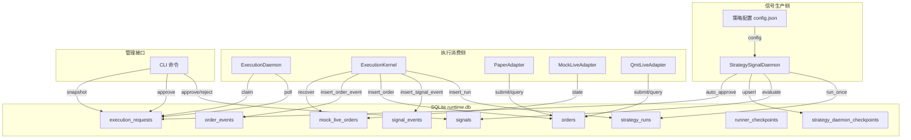
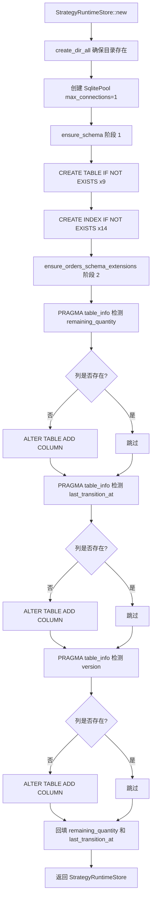
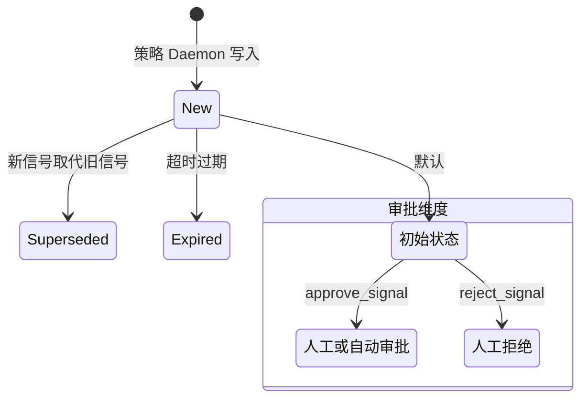
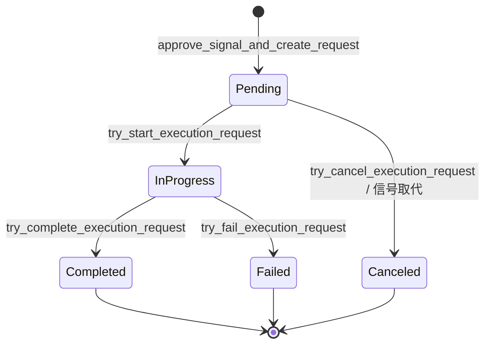
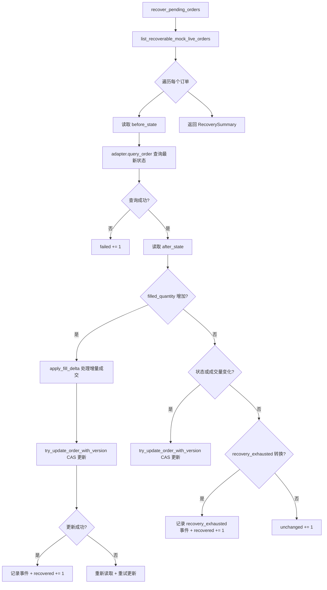

`runtime.db` 是 Quantix 策略运行时的**本地事务性状态中枢**，基于 SQLite 构建并通过 `sqlx` 异步驱动访问。它承载了从策略信号产生到订单执行完成的完整生命周期数据——包括策略运行记录、信号事件、订单簿、执行请求审批流、检查点快照以及 MockLive 模拟状态。**冻结快照机制**在信号审批时捕获当时的策略参数、市价、执行策略等完整上下文，确保执行请求在任何时刻都能被确定性重放。本文将系统性地解析其表结构设计、状态机模型、乐观锁并发控制、检查点驱动的幂等运行以及订单恢复机制。

Sources: [runtime_store.rs](src/execution/runtime_store.rs#L1-L16), [models.rs](src/execution/models.rs#L1-L8)

## 整体架构与数据流

`StrategyRuntimeStore` 是围绕单个 SQLite 连接池构建的轻量级持久层。整个系统中有三类核心参与者与之交互：**StrategySignalDaemon**（信号守护进程）负责周期性地驱动策略评估并将结果写入 store；**ExecutionDaemon**（执行守护进程）从 store 中拉取已审批的执行请求并调用 `ExecutionKernel` 完成订单；**CLI 命令**则提供人工审批、查询、恢复等管理操作。三者通过数据库的事务与唯一约束协调并发，确保信号不会重复产生、订单不会重复提交。

该架构的一个核心设计约束是连接池上限设置为 **`max_connections(1)`**，这意味着所有数据库操作都通过单连接串行化，天然避免了 SQLite 的写锁竞争问题，同时也简化了事务模型。

Sources: [runtime_store.rs](src/execution/runtime_store.rs#L229-L253), [daemon.rs](src/strategy/daemon.rs#L25-L33), [kernel.rs](src/execution/kernel.rs#L95-L101)

## 数据库表结构总览

`runtime.db` 共包含 **9 张核心表**，按职责可分为四组。以下表格展示了每张表的定位与关键索引。

| 分组 | 表名 | 主键 | 唯一约束/核心索引 | 核心职责 |
|------|------|------|-------------------|----------|
| **运行追踪** | `strategy_runs` | `run_id` | `(strategy_name, mode, symbol, timeframe, bar_end)` UNIQUE | 记录每次策略运行的去重标识与状态 |
| **信号生命周期** | `signal_events` | `event_id` | `(run_id)` INDEX, `(symbol, ts)` INDEX | 运行过程中的信号事件日志 |
| | `signals` | `signal_id` | `(strategy_instance_id, symbol, timeframe, bar_end)` UNIQUE | 策略信号的审批状态机 |
| **订单与执行** | `orders` | `order_id` | `client_order_id` UNIQUE, `(symbol, status)` INDEX | 订单全生命周期记录 |
| | `order_events` | `event_id` | `(order_id)` INDEX, `(client_order_id, event_time)` INDEX | 订单状态变更事件溯源 |
| | `mock_live_orders` | `order_id` | — | MockLive 模拟订单的内部状态 |
| | `execution_requests` | `request_id` | `signal_id` UNIQUE, `(request_status)` INDEX | 执行请求的审批与状态流转 |
| **检查点** | `runner_checkpoints` | `checkpoint_id` | `(strategy_name, mode, symbol, timeframe)` UNIQUE | 执行器运行进度检查点 |
| | `strategy_daemon_checkpoints` | `checkpoint_id` | `(strategy_instance_id, symbol, timeframe)` UNIQUE | Daemon 运行进度检查点 |

**去重索引** 是整个幂等设计的基石。`strategy_runs` 表通过 `(strategy_name, mode, symbol, timeframe, bar_end)` 五元组唯一索引保证同一策略对同一根 K 线只产生一次运行记录；`signals` 表通过 `(strategy_instance_id, symbol, timeframe, bar_end)` 保证同一策略实例对同一时间窗口只保留一条信号；`orders` 表通过 `client_order_id` 保证同一订单不会被重复创建。

Sources: [runtime_store.rs](src/execution/runtime_store.rs#L19-L227)

## Schema 初始化与在线迁移

`StrategyRuntimeStore::new()` 在构造时执行两个阶段的初始化。第一阶段 `ensure_schema()` 通过 `CREATE TABLE IF NOT EXISTS` 和 `CREATE INDEX IF NOT EXISTS` 原子性地建立全部 9 张表及其索引。第二阶段 `ensure_orders_schema_extensions()` 针对已存在的数据库执行在线列添加——这是一种 **向后兼容的迁移策略**，通过 `PRAGMA table_info` 探测列是否存在，仅在缺失时才执行 `ALTER TABLE`。

这种设计的优势在于：旧版本的数据库可以直接被新版本代码打开，无需手动迁移脚本。新增的 `remaining_quantity`、`last_transition_at` 和 `version` 列通过 `DEFAULT` 值和回填逻辑保证了数据一致性。

Sources: [runtime_store.rs](src/execution/runtime_store.rs#L234-L347)

## 信号生命周期与审批状态机

信号（Signal）是策略运行的核心产出物，其生命周期由两个正交的状态维度控制：**信号状态**（`SignalStatus`）和**审批状态**（`ApprovalStatus`）。

| SignalStatus | 含义 | 触发条件 |
|---|---|---|
| `New` | 当前有效信号 | Daemon 评估后写入 |
| `Superseded` | 已被更新信号取代 | `supersede_previous_signals_and_cancel_pending_requests()` |
| `Expired` | 已过期 | 预留状态 |

| ApprovalStatus | 含义 | 触发条件 |
|---|---|---|
| `Pending` | 等待审批 | 信号创建时的初始值 |
| `Approved` | 已审批通过 | `approve_signal_and_create_request()` |
| `Rejected` | 已拒绝 | `reject_signal()` |

**取代机制**是信号生命周期中最关键的设计。当 `StrategySignalDaemon` 产生一个新信号时，`record_daemon_signal_run()` 会在同一个事务中完成三件事：(1) 插入运行记录和新信号；(2) 将同一策略实例上所有更早的 `New` 信号标记为 `Superseded`；(3) 将这些被取代信号对应的 `Pending` 执行请求标记为 `Canceled`。这保证了在任意时刻，同一策略实例+股票+时间维度上最多只有一条 `New` 信号。

Sources: [models.rs](src/execution/models.rs#L80-L130), [runtime_store.rs](src/execution/runtime_store.rs#L1525-L1695), [daemon.rs](src/strategy/daemon.rs#L71-L198)

## 冻结快照机制（Execution Snapshot）

**冻结快照**是信号审批流程中最关键的数据完整性保障。当信号从 `Pending` 转为 `Approved` 时，`approve_signal_and_create_request()` 会调用 `build_execution_snapshot()` 在执行请求的 `payload_json` 中冻结当时的完整决策上下文。

快照包含以下字段：

| 快照字段 | 来源 | 作用 |
|---|---|---|
| `strategy_name` | 信号记录 | 标识产生信号的策略 |
| `strategy_instance_id` | 信号记录 | 策略实例唯一标识 |
| `symbol` / `timeframe` / `bar_end` | 信号记录 | 定位到具体 K 线 |
| `signal_value` | 信号记录 | buy / sell / hold |
| `market_price` | 信号 metadata | 审批时的市价快照 |
| `execution_policy` | 信号 metadata | 包含 `fixed_cash_per_buy` 和 `slippage_bps` |
| `bar_source_id` / `bar_source_fallback` | 信号 metadata | 数据来源追踪 |
| `held_volume` | 信号 metadata | 当前持仓量 |
| `order_intent` | 实时计算 | 根据信号值、市价、执行策略推算出的拟下单信息 |

其中 `order_intent` 是快照中最有价值的部分。它通过 `translate_signal()` 函数在审批时刻实时计算：对于 Buy 信号，按照 `fixed_cash_per_buy / market_price` 向下取整到 100 股整数倍计算下单数量，并附加滑点调整后的委托价格；对于 Sell 信号，以当前持仓全部卖出。这个计算结果被永久冻结在 `execution_requests.payload_json.execution_snapshot.order_intent` 中，确保执行守护进程在后续任何时刻消费该请求时，都能获取到审批时的精确下单意图，而非使用可能已经变化的当前市价。

Sources: [runtime_store.rs](src/execution/runtime_store.rs#L1911-L1960), [runtime_store.rs](src/execution/runtime_store.rs#L994-L1097), [models.rs](src/execution/models.rs#L463-L515)

## 执行请求状态机

执行请求（`execution_requests`）是信号审批与实际订单执行之间的桥梁。其状态机设计为严格的单向流转：

每个状态转换都通过 `try_update_execution_request_status()` 以 **CAS（Compare-And-Swap）** 模式执行：`WHERE request_id = ? AND request_status = ?` 确保只有当前状态匹配时才能更新，返回 `rows_affected == 1` 表示成功，`0` 表示已被其他进程处理。这保证了即使多个执行守护进程并发运行，同一个请求也只会被一个进程处理一次。

执行守护进程的工作循环是：(1) 调用 `find_next_pending_execution_request()` 获取最早的 Pending 请求；(2) 调用 `try_start_execution_request()` 抢占它；(3) 从快照中提取 `order_intent`，构造 `PreparedExecutionRequest`；(4) 通过 `ExecutionKernel` 执行下单流程；(5) 根据结果调用 `try_complete_execution_request()` 或 `try_fail_execution_request()`。

Sources: [runtime_store.rs](src/execution/runtime_store.rs#L1247-L1335), [daemon.rs](src/execution/daemon.rs#L134-L177)

## 订单版本控制与乐观锁

订单（`orders`）表的 `version` 列实现了**乐观并发控制**，防止并发更新导致数据丢失。订单记录包含以下与并发控制相关的字段：

| 字段 | 类型 | 作用 |
|---|---|---|
| `version` | `INTEGER NOT NULL DEFAULT 0` | 乐观锁版本号，每次更新 +1 |
| `remaining_quantity` | `INTEGER NOT NULL DEFAULT 0` | 剩余未成交数量 = `requested_quantity - filled_quantity` |
| `last_transition_at` | `TEXT NOT NULL DEFAULT ''` | 最近一次状态变更时间 |

`try_update_order_with_version()` 是核心的并发安全更新方法。它的 SQL 条件同时匹配 `order_id` 和 `expected_version`，只有版本号一致时才执行更新并将版本号 +1。如果返回 `rows_affected == 0`，说明版本号已被其他操作修改，调用方需要重新读取最新版本后重试。这种模式在 `ExecutionKernel.recover_pending_orders()` 中被大量使用——恢复流程先读取订单及其当前版本，向适配器查询最新状态后，尝试用读到的版本号更新；如果更新失败则重新读取并重试。

Sources: [runtime_store.rs](src/execution/runtime_store.rs#L806-L841), [kernel.rs](src/execution/kernel.rs#L548-L857)

## 检查点机制与幂等运行

系统设计了**两层检查点**来保证策略运行和信号生成的幂等性：

**Runner 检查点**（`runner_checkpoints`）服务于 `ExecutionKernel` 的单次执行模式。通过 `(strategy_name, mode, symbol, timeframe)` 四元组唯一索引，记录每个策略流的最后处理 K 线和运行 ID。`upsert_checkpoint()` 使用 `ON CONFLICT DO UPDATE` 语义，保证检查点总是最新的。

**Daemon 检查点**（`strategy_daemon_checkpoints`）服务于 `StrategySignalDaemon` 的周期性评估。通过 `(strategy_instance_id, symbol, timeframe)` 三元组唯一索引，记录每个策略实例流的进度。Daemon 的 `run_once()` 流程如下：

1. 重新加载配置文件（如果修改时间戳变化）
2. 遍历所有启用的股票和策略
3. 加载历史 K 线数据，评估策略产出信号
4. 读取 Daemon 检查点，比较 `last_processed_bar`
5. 如果 `checkpoint.last_processed_bar >= latest_bar_end`，**跳过**（幂等保证）
6. 如果检查点不存在，执行**引导策略**（当前仅支持 `LatestOnly`，即只写入初始检查点不产生信号）
7. 否则，在事务中执行 `record_daemon_signal_run()`：插入运行记录 + 信号 + 更新检查点 + 取代旧信号
8. 检查是否需要自动审批（`auto_approval.mode == Always` 时自动审批）

这种设计确保了即使 Daemon 因故障重启，也不会对同一根 K 线重复产生信号。

Sources: [runtime_store.rs](src/execution/runtime_store.rs#L843-L915), [runtime_store.rs](src/execution/runtime_store.rs#L1433-L1507), [daemon.rs](src/strategy/daemon.rs#L71-L238), [config.rs](src/strategy/config.rs#L7-L11)

## MockLive 订单恢复机制

MockLive 适配器是连接模拟环境与实盘接口的关键桥梁，其订单可能处于各种中间状态（如 `Submitted`、`Accepted`、`PartiallyFilled`、`Unknown`、`PendingCancel`）。`recover_pending_orders()` 提供了从这些非终态中恢复的能力。

`RecoverySummary` 提供了完整的恢复统计：`scanned`（扫描数）、`recovered`（恢复数）、`unchanged`（无变化数）、`failed`（失败数）、`skipped`（跳过数）。恢复流程中对 `MockLiveOrderState.recovery_exhausted` 标志的检测尤为重要——当 MockLive 适配器的 Unknown 状态重试次数耗尽后，该标志从 `false` 变为 `true`，恢复流程会记录一条 `recovery_exhausted` 事件并标记为 `recovered`，避免对已放弃的订单反复查询。

Sources: [kernel.rs](src/execution/kernel.rs#L548-L857), [models.rs](src/execution/models.rs#L346-L395), [runtime_store.rs](src/execution/runtime_store.rs#L699-L783)

## 路径解析与部署配置

`runtime.db` 的文件路径通过三层回退机制解析：

| 优先级 | 来源 | 路径模式 |
|---|---|---|
| 1（最高） | 环境变量 `QUANTIX_STRATEGY_RUNTIME_DB_PATH` | 用户指定路径 |
| 2 | `$HOME/.quantix/strategy/runtime.db` | 用户主目录 |
| 3（兜底） | `.quantix/strategy/runtime.db` | 当前工作目录 |

这种设计使得本地开发、Docker 容器部署和 systemd 服务三种场景都能灵活配置。在 Docker 环境中，通常将 `runtime.db` 挂载到持久化卷；在 systemd 服务中，通过环境变量文件（`EnvironmentFile`）指定路径。

Sources: [runtime.rs](src/core/runtime.rs#L16-L16), [runtime.rs](src/core/runtime.rs#L227-L242)

## 关键类型速查表

以下表格汇总了 `runtime.db` 涉及的核心 Rust 类型及其对应的数据库表：

| Rust 类型 | 数据库表 | 核心字段概览 |
|---|---|---|
| `StrategyRunRecord` | `strategy_runs` | `run_id`, `strategy_name`, `mode`, `status`, `bar_end` |
| `SignalEventRecord` | `signal_events` | `event_id`, `run_id`, `signal`, `ts` |
| `StrategySignalRecord` | `signals` | `signal_id`, `signal_value`, `signal_status`, `approval_status` |
| `OrderRecord` | `orders` | `order_id`, `side`, `status`, `filled_quantity`, `version` |
| `OrderEventRecord` | `order_events` | `event_id`, `event_type`, `details_json` |
| `MockLiveOrderState` | `mock_live_orders` | `fill_plan`, `next_step_index`, `fault_injection` |
| `ExecutionRequestRecord` | `execution_requests` | `request_id`, `request_status`, `payload_json`（含快照） |
| `RunnerCheckpointRecord` | `runner_checkpoints` | `last_processed_bar`, `last_run_id` |
| `StrategyDaemonCheckpointRecord` | `strategy_daemon_checkpoints` | `strategy_instance_id`, `last_processed_bar` |
| `ExecutionPolicy` | 嵌入 `metadata_json` | `fixed_cash_per_buy`, `slippage_bps` |

Sources: [models.rs](src/execution/models.rs#L210-L461)

---

**延伸阅读**：理解了运行时存储的内部机制后，建议继续阅读 [ExecutionKernel 执行决策核心与订单生命周期](11-executionkernel-zhi-xing-jue-ce-he-xin-yu-ding-dan-sheng-ming-zhou-qi) 了解执行引擎如何基于 store 数据驱动订单流转；[策略守护进程、Signal Daemon 与 systemd 服务管理](13-ce-lue-shou-hu-jin-cheng-signal-daemon-yu-systemd-fu-wu-guan-li) 展示了 Daemon 如何利用检查点实现周期性调度；[执行适配器架构（Paper / MockLive / QMT Bridge）](12-zhi-xing-gua-pei-qi-jia-gou-paper-mocklive-qmt-bridge) 则解释了不同适配器如何与 `runtime.db` 中的订单状态交互。