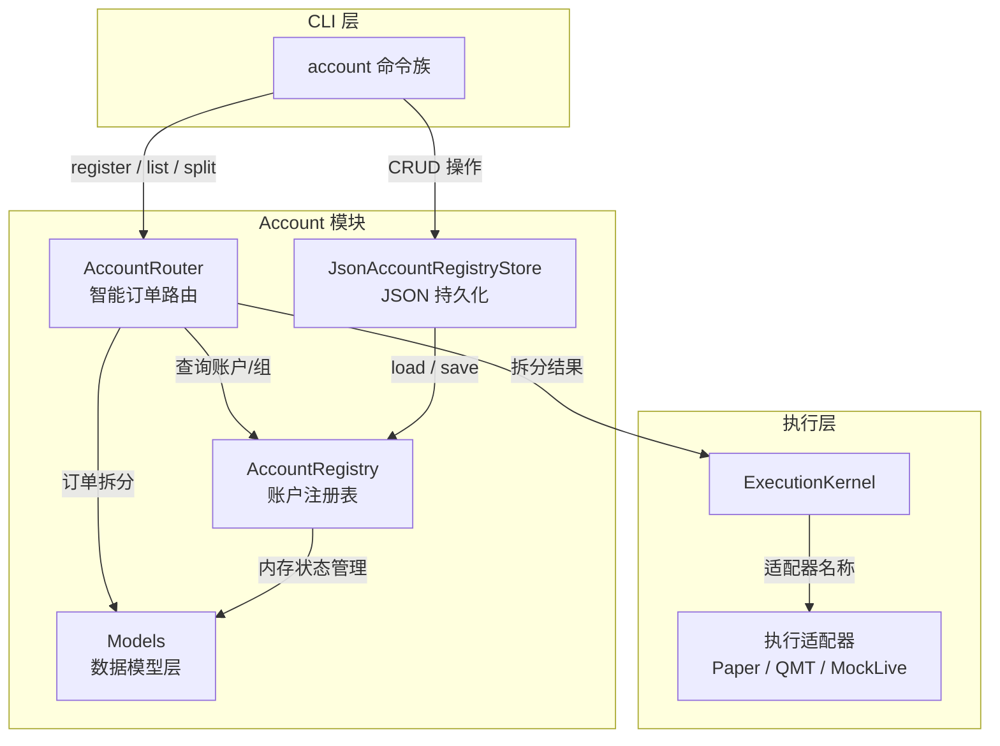
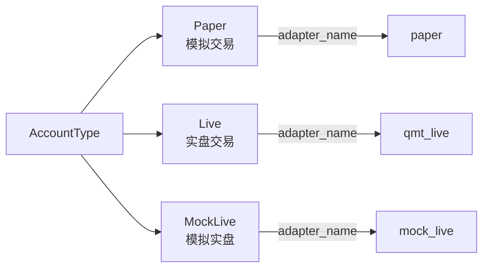
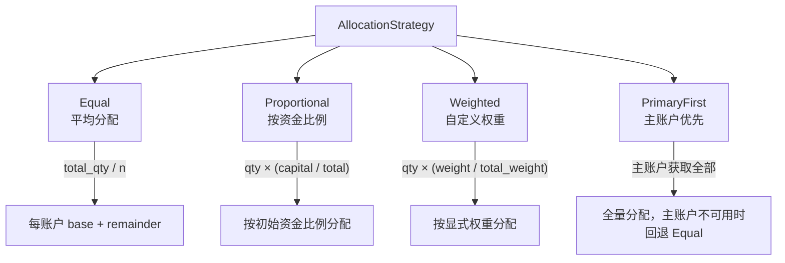
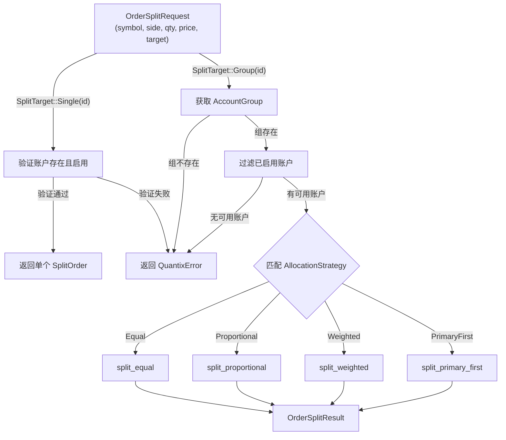
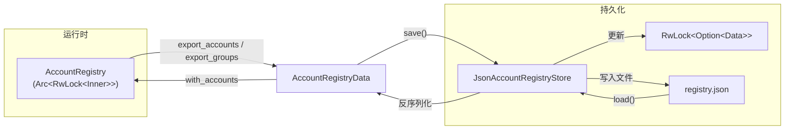

Quantix 的 `account` 模块实现了一套**三层架构的多账户管理方案**：底层是声明式账户模型（`models`），中间层是基于 `Arc<RwLock>` 的并发安全注册表（`registry`），顶层是负责订单拆分与路由的智能路由器（`router`）。配合 JSON 持久化存储（`storage`）和完整的 CLI 命令体系，这套系统可以在同一进程中同时管理 Paper、Live、MockLive 三类交易账户，并通过账户组机制实现灵活的资金分配策略。本文将深入解析每个组件的设计意图、数据流路径以及它们与 [ExecutionKernel 执行决策核心](11-executionkernel-zhi-xing-jue-ce-he-xin-yu-ding-dan-sheng-ming-zhou-qi)的衔接方式。

Sources: [mod.rs](src/account/mod.rs#L1-L21)

## 模块总览与架构关系

整个 `account` 模块由五个文件组成，职责边界清晰。在深入每个组件之前，先通过下面的架构图理解它们之间的协作关系：



**关键设计决策**：`AccountRegistry` 使用 `Arc<RwLock<AccountRegistryInner>>` 实现内部可变性，允许多个异步任务通过读锁并发查询账户信息，同时保证写操作（注册、注销、组配置变更）的独占性。这种读写分离策略在「频繁查询、低频变更」的账户管理场景中具有最优吞吐量。

Sources: [mod.rs](src/account/mod.rs#L1-L21), [registry.rs](src/account/registry.rs#L13-L16)

| 文件 | 核心结构 | 职责 |
|---|---|---|
| `models.rs` | `AccountConfig`, `AccountGroup`, `AllocationStrategy`, `OrderSplitRequest/Result` | 定义所有数据模型和枚举类型 |
| `registry.rs` | `AccountRegistry` | 内存中的账户注册表，管理账户和账户组的 CRUD |
| `router.rs` | `AccountRouter` | 智能订单路由，根据策略拆分订单到多个账户 |
| `storage.rs` | `JsonAccountRegistryStore`, `AccountRegistryStore` trait | JSON 文件持久化与存储抽象接口 |

Sources: [models.rs](src/account/models.rs#L1-L9), [registry.rs](src/account/registry.rs#L1-L10), [router.rs](src/account/router.rs#L1-L12), [storage.rs](src/account/storage.rs#L1-L11)

## 账户模型与类型体系

### 账户类型三层分类

系统定义了三种账户类型，每种类型自动关联一个默认执行适配器：



| 类型 | 说明 | 默认适配器 | 适用场景 |
|---|---|---|---|
| `Paper` | 纯模拟交易，不连接任何外部系统 | `paper` | 策略回测验证、快速迭代 |
| `Live` | 实盘交易，通过 QMT 桥接真实券商 | `qmt_live` | 真金白银的实盘运行 |
| `MockLive` | 模拟实盘，使用真实行情但不实际下单 | `mock_live` | 策略上线前的最终验证 |

Sources: [models.rs](src/account/models.rs#L10-L43)

### AccountConfig —— 账户配置实体

`AccountConfig` 是一个 Builder 模式的配置结构体，每个字段都有明确的语义。其中 `metadata: HashMap<String, serde_json::Value>` 是一个扩展字段，允许在不修改结构体定义的前提下为特定账户附加自定义信息（如券商配置、风险参数等）。

```rust
// 构建器用法示例
let config = AccountConfig::new("paper-001".to_string(), AccountType::Paper, dec!(500000))
    .with_name("实验账户A")
    .with_adapter("paper")
    .disable(); // 禁用而非删除
```

Builder 方法链中的 `with_name`、`with_adapter`、`disable` 都返回 `Self`，支持流畅的链式调用。值得注意的是 `disable()` 方法并不删除账户——这是**软禁用**设计，账户仍然保留在注册表中，但路由器不会将订单分配给已禁用的账户。

Sources: [models.rs](src/account/models.rs#L46-L114)

### AccountGroup —— 账户组与分配策略

`AccountGroup` 将多个账户聚合为一个逻辑单元，并绑定一种 `AllocationStrategy`。账户组的 `account_ids` 字段使用 `Vec<String>` 维护有序的成员列表，`add_account` 方法内部通过 `contains` 检查去重，确保同一账户不会被重复添加。

Sources: [models.rs](src/account/models.rs#L116-L174)

## 资金分配策略详解

`AllocationStrategy` 枚举定义了四种订单拆分策略，每种策略对应路由器中独立的拆分算法：



### 策略对比

| 策略 | 拆分逻辑 | 余数处理 | 降级策略 | 适用场景 |
|---|---|---|---|---|
| **Equal** | `total_quantity / n` 均分 | 余数 +1 分配给前 `remainder` 个账户 | 无 | 账户资金规模相近 |
| **Proportional** | 按 `initial_capital / total_capital` 比例 | 余数追加给第一个账户 | 资金为零时降级为 Equal | 账户资金规模差异大 |
| **Weighted** | 按显式配置的 `weights` 比例 | 余数追加给第一个账户 | 权重为零时降级为 Equal | 精细控制分配比例 |
| **PrimaryFirst** | 全部分配给主账户 | 无 | 主账户不可用时降级为 Equal | 主从架构，实盘优先 |

**余数处理的一致性保证**：所有策略最终都保证 `sum(splits.quantity) == request.total_quantity`。`split_equal` 通过枚举索引将余数均匀分散，而 `split_proportional` 和 `split_weighted` 则将余数直接追加给 `splits[0]`（即第一个被分配到数量的账户）。`split_primary_first` 由于不拆分，天然不存在余数问题。

Sources: [router.rs](src/account/router.rs#L139-L288), [models.rs](src/account/models.rs#L162-L180)

### 拆分算法核心实现

以 `split_equal` 为例，展示整数拆分中的精确性设计：

```rust
fn split_equal(&self, accounts: &[AccountConfig], total_quantity: i64, price: Option<Decimal>) -> Vec<SplitOrder> {
    let n = accounts.len() as i64;
    let base_qty = total_quantity / n;        // 整除基底
    let remainder = total_quantity % n;       // 不可除尽的余数
    
    accounts.iter().enumerate()
        .map(|(i, account)| SplitOrder {
            account_id: account.account_id.clone(),
            quantity: base_qty + if (i as i64) < remainder { 1 } else { 0 },
            price,
        })
        .filter(|s| s.quantity > 0)          // 过滤零数量
        .collect()
}
```

`filter(|s| s.quantity > 0)` 是一道安全闸——当账户数量大于订单数量时，确保不会产生数量为 0 的子订单。对于 1000 股分配到 3 个账户的情况，结果是 `[334, 333, 333]`，前 `1000 % 3 = 1` 个账户各多分 1 股。

Sources: [router.rs](src/account/router.rs#L140-L164)

## AccountRegistry —— 并发安全注册表

### 内部结构与锁策略

`AccountRegistry` 的核心是 `Arc<RwLock<AccountRegistryInner>>`，其中 `AccountRegistryInner` 持有三个字段：

| 字段 | 类型 | 用途 |
|---|---|---|
| `accounts` | `HashMap<String, AccountConfig>` | 全部账户配置，以 `account_id` 为键 |
| `groups` | `HashMap<String, AccountGroup>` | 全部账户组，以 `group_id` 为键 |
| `default_account_id` | `String` | 系统默认账户 ID |

所有读操作（`get_account`、`list_accounts`、`get_group`）获取 **读锁**（`read().await`），所有写操作（`register_account`、`create_group`、`set_group_allocation_strategy`）获取 **写锁**（`write().await`）。这种设计在 Tokio 异步运行时中是高效的——多个策略守护进程可以同时查询账户信息而互不阻塞。

Sources: [registry.rs](src/account/registry.rs#L13-L50)

### 关键操作：添加账户到组

`add_account_to_group` 方法的实现值得特别关注，它展示了**先读后写**的锁升级模式：

```rust
pub async fn add_account_to_group(&self, group_id: &str, account_id: String) -> Result<()> {
    let inner = self.inner.read().await;          // 第一步：读锁检查账户存在性
    if !inner.accounts.contains_key(&account_id) {
        return Err(QuantixError::Other(format!("账户不存在: {}", account_id)));
    }
    drop(inner);                                  // 显式释放读锁
    
    let mut inner = self.inner.write().await;     // 第二步：写锁修改组
    let group = inner.groups.get_mut(group_id)...;
    group.add_account(account_id);
    Ok(())
}
```

两阶段锁的设计避免了在写锁期间进行不必要的账户存在性检查（写锁会阻塞所有并发读操作）。`drop(inner)` 释放读锁后重新获取写锁，确保在读锁释放和写锁获取之间没有竞态条件——因为账户注册和组操作在正常使用中不会并发冲突。

Sources: [registry.rs](src/account/registry.rs#L182-L199)

### 查询能力矩阵

`AccountRegistry` 提供了多维度查询接口：

| 方法 | 过滤条件 | 锁类型 | 返回 |
|---|---|---|---|
| `get_account(id)` | 精确匹配 ID | 读锁 | `Option<AccountConfig>` |
| `get_default_account()` | 匹配 `default_account_id` | 读锁 | `Option<AccountConfig>` |
| `list_accounts()` | 无 | 读锁 | `Vec<AccountConfig>` |
| `list_accounts_by_type(ty)` | 匹配 `AccountType` | 读锁 | `Vec<AccountConfig>` |
| `list_enabled_accounts()` | `enabled == true` | 读锁 | `Vec<AccountConfig>` |
| `get_account_groups(id)` | 反向查找包含该 ID 的所有组 | 读锁 | `Vec<AccountGroup>` |

Sources: [registry.rs](src/account/registry.rs#L91-L245)

## AccountRouter —— 订单路由与拆分引擎

### 路由决策流程

`AccountRouter` 是唯一与 [ExecutionKernel](11-executionkernel-zhi-xing-jue-ce-he-xin-yu-ding-dan-sheng-ming-zhou-qi) 直接交互的账户层组件。它的核心入口 `split_order` 接收 `OrderSplitRequest`，根据 `SplitTarget` 分两路处理：



**SplitTarget** 枚举是路由决策的分叉点——`Single` 直接透传订单到目标账户（验证但不拆分），`Group` 触发策略驱动的拆分逻辑。这种设计将「单账户直连」和「多账户分单」两条路径在类型层面完全隔离，避免了运行时的条件分支混乱。

Sources: [router.rs](src/account/router.rs#L18-L124)

### 订单拆分请求/结果模型

拆分过程涉及四个核心类型的协作：

| 类型 | 角色 | 关键字段 |
|---|---|---|
| `OrderSplitRequest` | 输入：拆分请求 | `symbol`, `side`, `total_quantity`, `price`, `target` |
| `SplitTarget` | 路由目标 | `Single(account_id)` 或 `Group(group_id)` |
| `SplitOrder` | 输出：子订单 | `account_id`, `quantity`, `price` |
| `OrderSplitResult` | 输出：拆分结果 | `request`（原始请求）, `splits`（子订单列表）, `strategy`（使用的策略） |

`OrderSplitResult` 中保留了原始 `request` 和实际使用的 `strategy`，这为下游的审计日志和[策略运行时存储](14-ce-lue-yun-xing-shi-cun-chu-sqlite-runtime-db-yu-dong-jie-kuai-zhao-ji-zhi)提供了完整的可追溯信息。

Sources: [models.rs](src/account/models.rs#L224-L268)

## 持久化存储与 JSON 注册表

### 存储抽象与实现

`AccountRegistryStore` trait 定义了 `load` / `save` 两个异步方法，`JsonAccountRegistryStore` 是其默认实现，将注册表序列化为 JSON 文件存储在 `~/.quantix/accounts/registry.json`。



`JsonAccountRegistryStore` 内部维护了一个 `Arc<RwLock<Option<AccountRegistryData>>>` 缓存层。`save` 和 `load` 操作在完成磁盘 I/O 后都会自动更新这个缓存，`refresh_cache` 和 `get_cached` 方法允许调用方在不触发磁盘读取的情况下获取最近一次加载的数据。这种设计在 CLI 场景下（每次命令只操作一次存储）意义不大，但在长期运行的守护进程场景中可以显著减少磁盘 I/O。

Sources: [storage.rs](src/account/storage.rs#L1-L99)

### AccountRegistryData 版本化

`AccountRegistryData` 包含一个 `version: u32` 字段，当前固定为 `1`。这是为未来的迁移策略预留的——当注册表格式发生变更时，可以通过版本号检测并自动升级旧格式数据。

Sources: [storage.rs](src/account/storage.rs#L24-L45)

### 持久化辅助函数

`load_registry` 和 `save_registry` 是两个桥接函数，负责在存储抽象和内存注册表之间进行双向转换：

- `load_registry(store)`: 从存储加载数据，若文件不存在则返回空注册表
- `save_registry(store, registry)`: 调用注册表的 `export_*` 方法提取数据并写入存储

Sources: [storage.rs](src/account/storage.rs#L140-L164)

## CLI 命令体系

### 账户管理命令

`quantix account` 命令族通过 Clap 子命令分发，覆盖账户的完整生命周期管理：

| 命令 | 说明 | 关键参数 |
|---|---|---|
| `account register` | 注册新账户 | `--id`, `--account-type`, `--capital`, `--adapter` |
| `account list` | 列出账户 | `--account-type`（过滤类型）, `--enabled-only` |
| `account show` | 查看详情（含所属组） | `--id` |
| `account update` | 更新配置 | `--id`, `--enable/--disable`, `--capital`, `--adapter` |
| `account remove` | 删除账户 | `--id` |
| `account default` | 设置默认账户 | `--id` |
| `account summary` | 资金聚合视图 | 无参数，按类型汇总所有启用账户 |
| `account split` | 订单拆分预览 | `--code`, `--side`, `--quantity`, `--target-type`, `--target-id`, `--price` |

Sources: [commands/account.rs](src/cli/commands/account.rs#L1-L112)

### 账户组子命令

账户组操作作为 `account group` 的嵌套子命令实现：

| 命令 | 说明 | 关键参数 |
|---|---|---|
| `account group create` | 创建账户组 | `--id`, `--name`, `--strategy` |
| `account group list` | 列出所有组 | 无 |
| `account group show` | 查看组详情 | `--id` |
| `account group remove` | 删除组 | `--id` |
| `account group add-account` | 添加账户到组 | `--group-id`, `--account-id` |
| `account group remove-account` | 从组移除账户 | `--group-id`, `--account-id` |
| `account group set-strategy` | 设置分配策略 | `--group-id`, `--strategy`, `--primary-account` |

Sources: [commands/account.rs](src/cli/commands/account.rs#L114-L185)

### CLI 操作模式

所有 CLI 命令遵循统一的 **「加载 → 操作 → 保存」** 三步模式：

```rust
// 每个 handler 的骨架
let store = JsonAccountRegistryStore::default_store();
let registry = load_or_create_registry(&store).await?;
// ... 执行业务逻辑 ...
save_registry(&store, &registry).await?;
```

这意味着 CLI 每次执行都是独立的事务——从磁盘加载最新状态、在内存中变更、再写回磁盘。不存在跨命令的内存状态共享，这保证了在脚本化批量操作时的数据一致性。

Sources: [handlers/account.rs](src/cli/handlers/account.rs#L621-L626)

## 与执行层的集成

### target_account 在执行请求中的角色

`ExecutionRequestRecord` 包含一个 `target_account: String` 字段，它记录了执行请求的目标账户标识。当 [ExecutionKernel](11-executionkernel-zhi-xing-jue-ce-he-xin-yu-ding-dan-sheng-ming-zhou-qi) 接收到订单时，`target_account` 可以是一个具体的账户 ID（对应 `SplitTarget::Single`），也可以在更复杂的场景中指向一个账户组。执行层通过这个字段查询 `AccountRouter`，获取对应的适配器名称（`paper` / `qmt_live` / `mock_live`），最终将订单分发到正确的执行适配器。

Sources: [models.rs (execution)](src/execution/models.rs#L437-L448), [router.rs](src/account/router.rs#L28-L41)

### 适配器名称映射

`AccountConfig` 的 `adapter_name` 字段是连接账户层与[执行适配器层](12-zhi-xing-gua-pei-qi-jia-gou-paper-mocklive-qmt-bridge)的桥梁。路由器通过 `get_adapter_name` 方法将账户 ID 翻译为适配器名称，执行层再根据这个名称选择具体的执行通道：

```
account_id → AccountRouter.get_adapter_name() → adapter_name → ExecutionKernel → 具体适配器
```

Sources: [router.rs](src/account/router.rs#L28-L41)

## 设计权衡与扩展点

### 当前设计的边界

**资金比例基于 `initial_capital`**：`Proportional` 策略使用 `AccountConfig.initial_capital` 计算分配比例，而非实时的可用资金。这意味着如果账户已经持有大量仓位，实际可用现金可能与初始资金差异巨大。这是一个已知的简化——引入实时资金查询需要与执行适配器建立同步通道，增加系统复杂度。

**Weighted 策略的 CLI 限制**：CLI 的 `parse_allocation_strategy` 函数在遇到 `weighted` 策略时会打印警告并降级为 `Equal`。完整的权重配置需要通过 API 或直接编辑 JSON 文件来完成。

Sources: [handlers/account.rs](src/cli/handlers/account.rs#L629-L654), [router.rs](src/account/router.rs#L167-L178)

### 可预见的扩展方向

| 扩展点 | 当前状态 | 潜在实现路径 |
|---|---|---|
| 动态资金感知 | 基于 `initial_capital` | 通过适配器接口查询实时资金 |
| 权重 CLI 配置 | 降级为 Equal | 增加权重参数解析 `--weights acc1:0.5,acc2:0.3,acc3:0.2` |
| 注册表热重载 | CLI 每次从磁盘加载 | 守护进程中添加 `watch` 文件变更通知 |
| 多存储后端 | 仅 JSON 文件 | 实现 `AccountRegistryStore` trait 的 SQLite 版本 |
| 账户级风控联动 | 无 | 集成[风控服务](16-feng-kong-fu-wu-gui-ze-yin-qing-xing-ye-ji-zhong-du-yu-bo-dong-lu-jian-cha)的持仓限额检查 |

Sources: [storage.rs](src/account/storage.rs#L14-L21)

---

**相关阅读**：

- 了解执行层如何使用路由结果：[ExecutionKernel 执行决策核心与订单生命周期](11-executionkernel-zhi-xing-jue-ce-he-xin-yu-ding-dan-sheng-ming-zhou-qi)
- 了解资金分配后的风控校验：[风控服务：规则引擎、行业集中度与波动率检查](16-feng-kong-fu-wu-gui-ze-yin-qing-xing-ye-ji-zhong-du-yu-bo-dong-lu-jian-cha)
- 了解交易执行后的费用与报告：[模拟交易、费用计算与交易报告](17-mo-ni-jiao-yi-fei-yong-ji-suan-yu-jiao-yi-bao-gao)