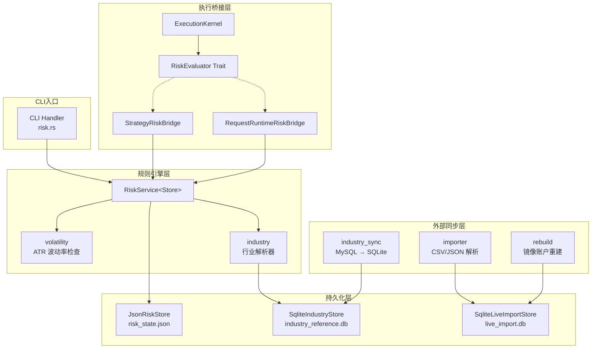
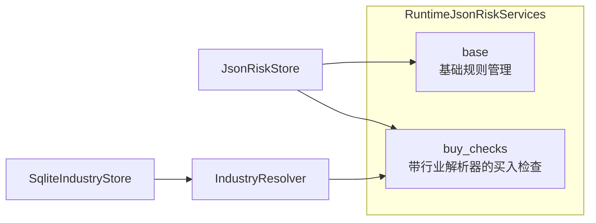
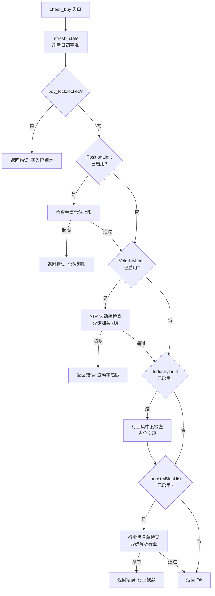
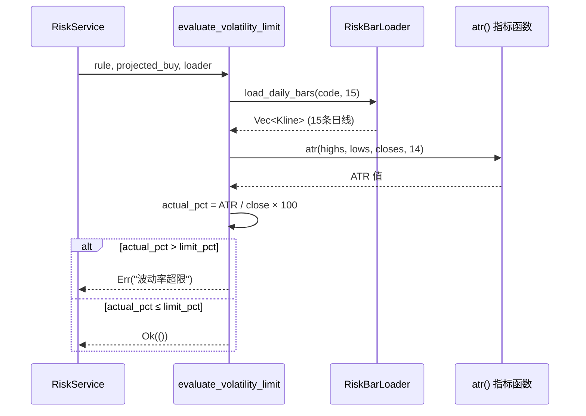

风控服务（`src/risk/`）是 Quantix 交易系统的前置安全阀门。它在每笔买入指令提交到执行层之前，依次检查六类规则——单票仓位上限、日亏损限制、波动率限制、行业集中度、行业黑名单与自动减仓——任何一项规则触发即拦截该笔交易。本文从架构分层到各规则的具体检查逻辑，完整拆解这一模块的设计与实现，帮助中级开发者理解风控如何在策略信号与订单执行之间形成闭环。

Sources: [mod.rs](src/risk/mod.rs#L1-L39)

## 模块全景与分层架构

风控模块由 11 个文件组成，按职责分为四层：**模型层**（models）、**规则引擎层**（service + volatility + industry）、**持久化层**（storage + industry_store + import_store）和**外部同步层**（industry_sync + importer + rebuild）。下面的依赖关系图展示了各组件之间的调用方向。



模块文件的职责划分如下表所示：

| 文件 | 行数 | 职责 |
|------|------|------|
| `models.rs` | 504 | 风控状态、规则、快照、实盘导入等全部领域模型 |
| `service.rs` | 779 | `RiskService` 核心服务，规则 CRUD、买入检查、状态刷新 |
| `volatility.rs` | 145 | ATR 波动率限制检查实现 |
| `industry.rs` | 251 | 行业解析器 `IndustryResolver`，四级回退查询 |
| `industry_store.rs` | 441 | SQLite 持久化的行业引用表与快照存储 |
| `industry_sync.rs` | 222 | 从 MySQL 上游同步申万行业分类数据 |
| `storage.rs` | 81 | JSON 文件风控状态持久化（`JsonRiskStore`） |
| `import_store.rs` | 518 | SQLite 实盘流水导入存储 |
| `importer.rs` | 181 | CSV/JSON 实盘流水解析 |
| `rebuild.rs` | 235 | 实盘镜像账户重建引擎 |

Sources: [mod.rs](src/risk/mod.rs#L1-L39), [models.rs](src/risk/models.rs#L1-L9)

## 核心数据模型

风控的状态以 `RiskState` 为根节点，包含当前账户标识、规则列表、日初基准线、买入锁状态和事件日志。`RiskState` 通过 `serde` 序列化为 JSON，由 `JsonRiskStore` 持久化到本地文件系统。

```rust
pub struct RiskState {
    pub version: u32,                          // 状态版本号，当前为 1
    pub account_id: String,                    // 默认 "default"
    pub rules: Vec<RiskRule>,                  // 已配置的规则列表
    pub daily_baseline: Option<DailyRiskBaseline>, // 日初资产基准
    pub buy_lock: BuyLockState,                // 买入锁定状态
    pub events: Vec<RiskLogEvent>,             // 事件日志（上限 100 条）
}
```

`RiskRule` 由 `RiskRuleType` 和 `RuleValue` 组成，每条规则独立启用/禁用：

```rust
pub struct RiskRule {
    pub rule_type: RiskRuleType,
    pub value: RuleValue,
    pub enabled: bool,
    pub created_at: DateTime<Utc>,
    pub updated_at: DateTime<Utc>,
}
```

### 六种规则类型与值约束

`RiskRuleType` 枚举定义了系统支持的全部规则类型，`RuleValue` 对每种类型施加严格的值域约束。解析逻辑在 `RuleValue::parse` 中集中处理，确保任何非法输入在入库前即被拦截。

| 规则类型 | CLI 标识 | 值类型 | 说明 |
|----------|----------|--------|------|
| `PositionLimit` | `position-limit` | 仅 `Percentage` | 单票仓位占总资产的最大百分比 |
| `DailyLossLimit` | `daily-loss-limit` | `Percentage` 或 `Amount` | 日亏损触发阈值，支持百分比或绝对金额 |
| `VolatilityLimit` | `volatility-limit` | 仅 `Percentage` | ATR 波动率上限 |
| `IndustryLimit` | `industry-limit` | 仅 `Percentage` | 单一行业持仓占总资产的最大百分比 |
| `AutoReduce` | `auto-reduce` | `Percentage` 或 `Amount` | 亏损达到阈值时自动减仓 |
| `IndustryBlocklist` | `industry-blocklist` | `TextList` | 禁止买入的行业名称列表 |

值的解析遵循以下原则：带 `%` 后缀的值解析为 `Percentage`，纯数字根据规则类型判断是 `Amount` 还是 `Percentage`；`IndustryBlocklist` 使用逗号分隔的文本列表。所有数值必须严格大于零。

Sources: [models.rs](src/risk/models.rs#L11-L172)

### 账户快照与预期买入影响

风控检查接收两个关键输入结构：`RiskAccountSnapshot` 描述当前账户状态，`ProjectedBuyImpact` 描述预期买入后的影响。这两个结构将风控检查与具体的账户实现解耦——无论是 Paper Trade 账户还是实盘镜像账户，只要能提供这两个快照，就能接入风控体系。

```rust
pub struct RiskAccountSnapshot {
    pub account_id: String,
    pub total_assets: Decimal,                  // 当前总资产
    pub positions: Vec<RiskPositionSnapshot>,   // 当前持仓列表
}

pub struct ProjectedBuyImpact {
    pub code: String,                           // 目标股票代码
    pub projected_position_value: Decimal,      // 买入后该票的持仓市值
    pub projected_total_assets: Decimal,        // 买入后总资产
}
```

Sources: [models.rs](src/risk/models.rs#L298-L347)

## RiskService 规则引擎

`RiskService<Store>` 是整个风控模块的核心服务，泛型参数 `Store` 实现 `RiskStore` trait，默认使用 `JsonRiskStore`。服务对外暴露规则管理（CRUD）、状态查询、买入检查和日志检索四组方法。

### 服务构造与依赖注入

服务通过 Builder 风格的构造函数注入依赖——K线数据加载器（用于波动率检查）和行业解析器（用于行业黑名单检查）。生产环境通过 `RuntimeJsonRiskServices` 包装器延迟初始化带有行业解析器的买入检查实例。



`RuntimeJsonRiskServices` 内部使用 `Arc<Mutex<Option<...>>>` 实现延迟初始化：第一次调用 `buy_checks()` 时，自动从 JSON 存储路径推导出 SQLite 行业数据库路径，构建完整的 `RiskService` 实例并缓存。

Sources: [service.rs](src/risk/service.rs#L50-L88), [service.rs](src/risk/service.rs#L94-L147)

### 买入检查流程：check_buy

`check_buy` 是风控阻断交易的核心方法。它按固定顺序依次评估所有已启用的规则，任何一项失败即返回错误：



关键设计点：卖出操作**永远不会**被风控阻断。`RiskEvaluator` 的两个实现（`StrategyRiskBridge` 和 `RequestRuntimeRiskBridge`）在 `evaluate` 方法中，当 `intent.side == Sell` 时直接返回 `RiskDecision::Allow`。

Sources: [service.rs](src/risk/service.rs#L223-L267), [kernel.rs](src/execution/kernel.rs#L15-L26)

### 日亏损锁定与跨日重置

`DailyLossLimit` 规则采用**日内锁定**机制：一旦触发，当日剩余时间禁止所有买入。锁定状态通过 `BuyLockState` 持久化，包含锁定原因、触发时间和作用交易日。

系统通过 `refresh_state` 方法检测跨日重置：当 `daily_baseline.trading_date` 与当前日期不一致时，自动重置基准线和买入锁。此外，手动释放买入锁也是受控操作——同一交易日内释放后不会因亏损再次自动锁定（通过 `released_for_date` 字段实现）。

Sources: [service.rs](src/risk/service.rs#L383-L423), [models.rs](src/risk/models.rs#L174-L187)

### 自动减仓决策

`check_auto_reduce_trigger` 函数独立于 `check_buy` 流程，由上层策略循环定期调用。当日亏损达到 `AutoReduce` 规则阈值时，返回 `AutoReduceDecision` 结构体，包含触发规则、当前亏损比例、减仓比例（当前固定 50%）和需要减仓的持仓列表。

Sources: [service.rs](src/risk/service.rs#L729-L778)

## 波动率检查：ATR 引擎

波动率检查是唯一需要异步加载数据的规则。它基于 **ATR（Average True Range）** 指标衡量个股的短期波动程度，拒绝波动率过高的标的。

### 计算流程



关键常量：`VOLATILITY_ATR_PERIOD = 14`（ATR 计算周期），`VOLATILITY_REQUIRED_BARS = 15`（至少需要 15 条日线，即 14 个 ATR 计算窗口 + 1 条前置数据）。如果可用K线不足，检查直接失败——这是一种保守策略，宁可阻止交易也不在数据不充分时放行。

`RiskBarLoader` trait 的默认实现 `DefaultRiskBarLoader` 通过 `FallbackStrategyBarLoader` 加载K线数据，支持多数据源回退。

Sources: [volatility.rs](src/risk/volatility.rs#L1-L144)

## 行业分类体系

行业分类为 `IndustryLimit`（行业集中度）和 `IndustryBlocklist`（行业黑名单）提供数据基础。系统当前采用**申万一级行业**分类标准。

### 四级回退解析

`IndustryResolver` 对任意股票代码执行四级回退查询，确保在各种数据完整性场景下都能返回行业归属：

| 优先级 | 数据源 | 说明 |
|--------|--------|------|
| 1 | `CurrentActive` | `industry_reference_current` 表，最新的行业映射 |
| 2 | `SnapshotMonth` | `risk_industry_snapshots` 表，查询月份的快照记录 |
| 3 | `Historical` | `industry_reference_history` 表，按有效日期区间查找 |
| 4 | `LatestSnapshot` | `risk_industry_snapshots` 表，取最近月份的快照 |

查询成功后，解析器会将结果写入当月快照表（`INSERT OR IGNORE`），为后续查询缓存结果。股票代码在查询前经过 `normalize_security_code` 标准化——去除交易所后缀并转为大写。

Sources: [industry.rs](src/risk/industry.rs#L111-L236), [industry.rs](src/risk/industry.rs#L239-L250)

### 行业数据同步

行业分类数据通过 `industry_sync` 模块从 MySQL 上游数据库同步到本地 SQLite。同步流程：

1. 连接上游 MySQL（配置来自 `UpstreamMySqlSettings`）
2. 读取 `sw_industry_classification` 表获取当前行业映射
3. 读取 `sw_stock_update` + `sw_industry` 表获取历史变更记录
4. 在事务中清空并重建本地 SQLite 表（`refresh_shenwan_current_rows` / `refresh_shenwan_history_rows`）

历史记录的 `effective_to` 字段在同步时通过相邻记录推导计算——同一股票的上一条记录的 `effective_to` 设置为下一条记录的 `effective_from` 的前一天。

Sources: [industry_sync.rs](src/risk/industry_sync.rs#L1-L188), [industry_store.rs](src/risk/industry_store.rs#L13-L50)

### 行业黑名单检查

`evaluate_industry_blocklist` 是异步检查——需要调用行业解析器确定目标股票所属行业，再与黑名单比对。如果未配置行业解析器，检查直接报错而非静默放行，这是另一种保守设计：

```rust
let resolver = resolver.ok_or_else(|| {
    QuantixError::Config(format!(
        "risk rule industry-blocklist 检查失败: code={} 原因=未配置行业解析器",
        projected_buy.code
    ))
})?;
```

Sources: [service.rs](src/risk/service.rs#L550-L592)

## 风控与执行内核的集成

风控服务通过 `RiskEvaluator` trait 与 [ExecutionKernel 执行决策核心与订单生命周期](11-executionkernel-zhi-xing-jue-ce-he-xin-yu-ding-dan-sheng-ming-zhou-qi) 集成。该 trait 定义了两个方法：

```rust
pub trait RiskEvaluator: Send + Sync {
    async fn evaluate(&self, intent: OrderIntent) -> Result<RiskDecision>;
    async fn sync_after_fill(&self) -> Result<()>;
}
```

`evaluate` 在订单提交前调用，返回 `Allow` 或 `Reject { reason }`。`sync_after_fill` 在成交确认后调用，更新风控状态。系统有两个桥接实现：

- **`StrategyRiskBridge`**（CLI handler）：用于 `strategy run --mode paper` 命令，直接持有 `RiskService<JsonRiskStore>`
- **`RequestRuntimeRiskBridge`**（execution daemon）：用于异步执行守护进程，通过 `RuntimeJsonRiskServices` 延迟获取带行业解析器的风控实例

当 `ExecutionKernel` 收到风控拒绝时，会记录一条 `status: Rejected`、`adapter: "risk"` 的订单记录，并写入 `risk_rejected` 事件，确保审计轨迹完整。

Sources: [kernel.rs](src/execution/kernel.rs#L15-L26), [kernel.rs](src/execution/kernel.rs#L294-L340), [daemon.rs](src/execution/daemon.rs#L83-L132)

## 状态持久化

风控使用两种持久化机制，均为**原子写入**保证数据安全：

### JSON 风控状态（risk_state.json）

`JsonRiskStore` 将 `RiskState` 序列化为 pretty-printed JSON。写入时先创建临时文件（`.risk_state.json.<uuid>.tmp`），写入并调用 `sync_all()` 刷盘后，再原子 `rename` 覆盖目标文件。默认路径为 `~/.quantix/risk/risk_state.json`。

Sources: [storage.rs](src/risk/storage.rs#L1-L81)

### SQLite 行业引用库（industry_reference.db）

`SqliteIndustryStore` 使用三个 SQLite 表存储行业分类数据：

| 表名 | 主键 | 用途 |
|------|------|------|
| `industry_reference_current` | (standard, level, code) | 当前有效的行业映射 |
| `industry_reference_history` | (standard, level, code, effective_from) | 按日期的历史变更记录 |
| `risk_industry_snapshots` | (standard, level, snapshot_month, code) | 月度快照缓存 |

数据库文件位于 JSON 状态文件的同级目录下，通过 `from_risk_state_path` 方法自动推导路径。

Sources: [industry_store.rs](src/risk/industry_store.rs#L52-L104)

## 实盘流水导入与镜像重建

风控模块还包含实盘交易流水导入和账户镜像重建的完整链路。

### 流水导入

`importer.rs` 支持 CSV 和 JSON 两种格式的实盘流水解析。每条记录的类型分为 `Trade`（交易）和 `Cash`（资金变动），对应不同的必填字段验证规则。导入过程通过 `SqliteLiveImportStore` 按批次管理，记录去重（基于 `account_id + external_id`）和冲突检测。

Sources: [importer.rs](src/risk/importer.rs#L1-L181)

### 镜像账户重建

`SqliteLiveMirrorRebuildEngine` 从导入的流水记录重建完整的账户镜像：按时间排序后逐笔重放交易，维护现金余额、持仓成本和已实现盈亏。重建完成后将结果持久化到 `live_import_mirror_accounts` 和 `live_import_mirror_positions` 表，并写入审计记录。

Sources: [rebuild.rs](src/risk/rebuild.rs#L1-L235)

## CLI 命令体系

风控服务通过 `quantix risk` 子命令暴露全部功能。命令结构如下：

```
quantix risk
├── rule
│   ├── set --type <规则> --value <值>    # 设置规则
│   ├── list                               # 列出所有规则
│   ├── enable --type <规则>              # 启用规则
│   └── disable --type <规则>             # 禁用规则
├── log [--date YYYY-MM-DD] [--type <事件>] [--limit N]  # 事件日志
├── lock
│   └── release                            # 手动释放买入锁
├── status [--source paper|live_import] [--account <ID>]  # 风控状态
├── pnl [--source ...] [--account ...]     # 当日盈亏
├── position [--source ...] [--account ...] # 持仓风险
├── sync
│   └── industry --standard shenwan        # 同步行业分类
├── import
│   └── live-trades --account <ID> --input <文件>  # 导入实盘流水
└── rebuild
    └── live-account --account <ID>        # 重建镜像账户
```

Sources: [risk.rs](src/cli/commands/risk.rs#L1-L142)

## 事件日志系统

所有风控操作通过 `push_risk_event` 记录到 `RiskState.events` 中。事件类型覆盖规则变更、锁状态变化和自动减仓等完整生命周期：

| 事件类型 | CLI 标识 | 触发场景 |
|----------|----------|----------|
| `RuleSet` | `rule-set` | 设置或更新规则 |
| `RuleEnabled` | `rule-enabled` | 启用规则 |
| `RuleDisabled` | `rule-disabled` | 禁用规则 |
| `DailyLossLockTriggered` | `daily-loss-lock-triggered` | 日亏损触发买入锁 |
| `BuyLockReleased` | `buy-lock-released` | 手动释放买入锁 |
| `BuyLockCleared` | `buy-lock-cleared` | 跨日重置或账户重置清除锁 |
| `IndustryLimitTriggered` | `industry-limit-triggered` | 行业集中度超限 |
| `AutoReduceTriggered` | `auto-reduce-triggered` | 自动减仓触发 |
| `AutoReduceExecuted` | `auto-reduce-executed` | 自动减仓执行完成 |

事件日志上限为 100 条（`DEFAULT_RISK_EVENT_LIMIT`），超出时丢弃最早的记录。CLI 输出按日期分组并附带统计摘要。

Sources: [models.rs](src/risk/models.rs#L196-L255), [service.rs](src/risk/service.rs#L682-L688)

## 设计原则总结

风控服务的设计遵循三个一致性的原则：

**保守优先**——数据不足时阻断交易而非放行。K线条数不足导致波动率检查失败、缺少行业解析器导致黑名单检查失败，都体现了这一原则。

**状态独立**——风控状态（`RiskState`）与交易账户状态（`PaperTradeAccount`）完全解耦，各自独立持久化。风控通过快照接口（`RiskAccountSnapshot`、`ProjectedBuyImpact`）与账户层交互，不直接操作交易数据。

**顺序保证**——`check_buy` 中规则检查的顺序（PositionLimit → VolatilityLimit → IndustryLimit → IndustryBlocklist）是固定的，确保低成本的同步检查先于需要异步数据加载的检查执行，减少不必要的 I/O 开销。

下一步建议阅读 [模拟交易、费用计算与交易报告](17-mo-ni-jiao-yi-fei-yong-ji-suan-yu-jiao-yi-bao-gao) 了解风控与 Paper Trade 账户的完整交互流程，或阅读 [止盈止损规则管理与实时评估](18-zhi-ying-zhi-sun-gui-ze-guan-li-yu-shi-shi-ping-gu) 了解止损系统如何与风控模块协同工作。