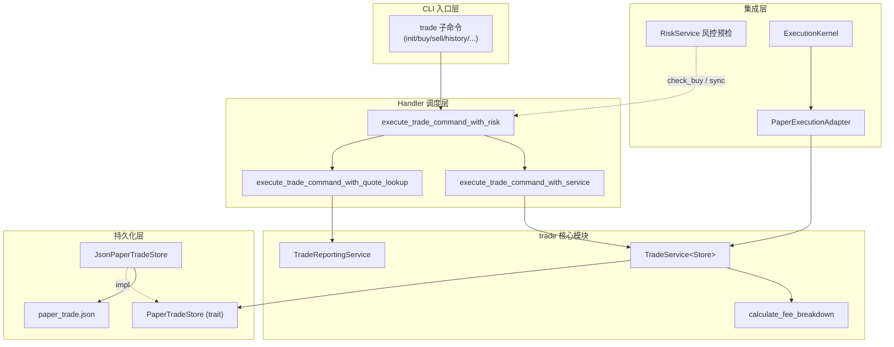
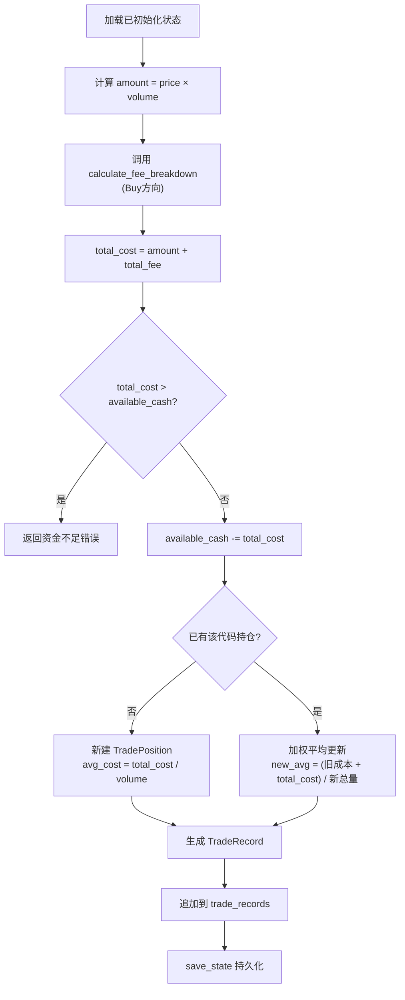
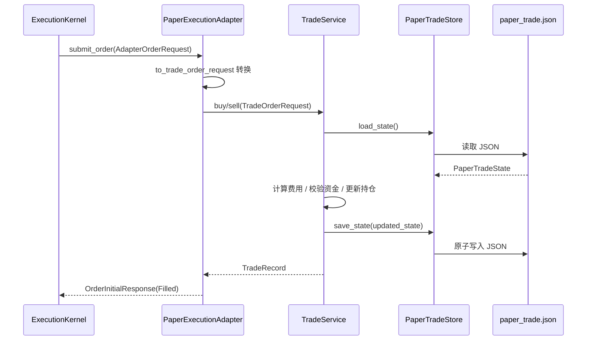

模拟交易系统（Paper Trading）是 Quantix 的**零风险交易验证层**，允许开发者在不涉及真实资金的前提下模拟完整的 A 股交易流程——从账户初始化、买卖下单到费用计算与交易报告生成。该系统基于 JSON 文件的原子写入实现持久化状态，并严格遵循 A 股三大费用结构（佣金、印花税、过户费），同时提供多层次报告视图（历史明细、费用分解、账户概览、实时持仓浮盈）。模拟交易还作为执行内核的 Paper 适配器，为策略守护进程提供回测级沙盒环境，并在每次交易前与风控服务联动进行预检。

Sources: [mod.rs](src/trade/mod.rs#L1-L16), [models.rs](src/trade/models.rs#L1-L11)

## 模块架构总览

`src/trade/` 模块由五个核心文件组成，每个文件承担明确的单一职责。`models.rs` 定义所有数据模型与验证逻辑，`fees.rs` 实现纯函数式费用计算引擎，`service.rs` 封装带状态的异步交易操作，`storage.rs` 提供基于 JSON 的原子化持久化，`reporting.rs` 则作为无状态的只读报告生成器。



该架构的设计遵循**依赖倒置原则**：`TradeService` 通过泛型参数 `Store: PaperTradeStore` 与存储层解耦，使得测试中可注入内存 Fake Store，生产环境使用 JSON 文件 Store。报告服务完全无状态（`TradeReportingService` 仅持有零大小实例），接受 `PaperTradeState` 快照作为输入，确保读写路径彻底分离。

Sources: [service.rs](src/trade/service.rs#L1-L33), [reporting.rs](src/trade/reporting.rs#L13-L19), [storage.rs](src/trade/storage.rs#L10-L23)

## 数据模型体系

### 核心状态模型

`PaperTradeState` 是模拟交易系统的**顶层聚合根**，以版本化格式（`version: 1`）序列化为 JSON，包含一个可选账户和全部交易记录列表。`PaperTradeAccount` 持有账户标识、初始/可用资金、费用配置和持仓映射（`BTreeMap<String, TradePosition>`），其中 `BTreeMap` 确保持仓按代码字典序稳定排列。

Sources: [models.rs](src/trade/models.rs#L12-L48)

| 模型 | 职责 | 关键字段 |
|------|------|----------|
| `PaperTradeState` | 顶层状态聚合根 | `version`, `account`, `trade_records` |
| `PaperTradeAccount` | 账户资金与持仓 | `initial_capital`, `available_cash`, `fee_config`, `positions` |
| `TradePosition` | 单股票持仓快照 | `volume`, `avg_cost`, `last_trade_price` |
| `TradeRecord` | 单笔成交记录 | `side`, `price`, `volume`, `amount`, `commission`, `stamp_duty`, `transfer_fee`, `total_fee` |
| `FeeConfig` | 费率参数集 | `commission_rate`, `commission_min`, `stamp_duty_rate`, `transfer_fee_rate` |
| `FeeBreakdown` | 单笔费用分解 | `commission`, `stamp_duty`, `transfer_fee`, `total_fee` |

### 输入验证层

`TradeOrderRequest::new` 和 `InitAccountRequest::new` 在构造阶段即执行严格的前置校验，包括股票代码格式（必须为6位纯数字）、价格正数约束、成交量为正整数、费率非负数校验。验证失败直接返回 `QuantixError::Other`，携带精确到 `--flag` 名称的错误信息，杜绝脏数据进入交易逻辑。

Sources: [models.rs](src/trade/models.rs#L226-L297)

```rust
// 代码验证：6位纯数字
fn validate_trade_code(code: &str) -> Result<()> {
    let is_valid = code.len() == 6 && code.chars().all(|ch| ch.is_ascii_digit());
    ...
}
// 价格验证：有限正数
fn parse_required_positive_decimal(flag: &str, value: f64) -> Result<Decimal> {
    if !value.is_finite() || value <= 0.0 { ... }
}
```

Sources: [models.rs](src/trade/models.rs#L255-L296)

## 费用计算引擎

Quantix 的费用计算引擎在 `fees.rs` 中以纯函数 `calculate_fee_breakdown` 实现，严格模拟 A 股真实费用结构。引擎接收交易方向、股票代码、成交金额和费率配置四个参数，输出包含四项指标的 `FeeBreakdown` 结构体。

Sources: [fees.rs](src/trade/fees.rs#L1-L34)

### A 股三大费用规则

| 费用类型 | 买入 | 卖出 | 计算公式 | 默认值 |
|----------|------|------|----------|--------|
| **佣金 (Commission)** | ✅ 收取 | ✅ 收取 | `amount × commission_rate`，不低于 `commission_min` | 万2.5，最低 5 元 |
| **印花税 (Stamp Duty)** | ❌ 不收 | ✅ 收取 | `amount × stamp_duty_rate` | 千1（仅卖出） |
| **过户费 (Transfer Fee)** | ✅ 仅沪市 | ✅ 仅沪市 | `amount × transfer_fee_rate`，仅代码以 `60`/`68` 开头 | 十万分之1 |

该设计的关键决策在于：**买入成本包含费用**（`total_cost = amount + total_fee`），而**卖出收入扣除费用**（`net_cash = amount - total_fee`）。这意味着 `avg_cost` 字段已内含买入费用，持仓真实成本被准确反映。

Sources: [fees.rs](src/trade/fees.rs#L5-L33), [service.rs](src/trade/service.rs#L72-L120)

### 沪市识别逻辑

过户费仅适用于上海证券交易所股票，通过代码前缀判定：

```rust
fn is_shanghai_code(code: &str) -> bool {
    code.starts_with("60") || code.starts_with("68")
}
```

`60xxxx` 对应沪市主板，`68xxxx` 对应科创板。深市股票（`00xxxx`、`30xxxx`）不收取过户费。

Sources: [fees.rs](src/trade/fees.rs#L31-L33)

### 默认费率配置

`FeeConfig::default()` 提供开箱即用的 A 股标准费率，同时 `from_inputs` 方法支持通过 CLI 参数完全覆盖各项费率，满足不同券商场景的模拟需求：

```rust
impl Default for FeeConfig {
    fn default() -> Self {
        Self {
            commission_rate: dec!(0.00025),    // 万2.5
            commission_min: dec!(5),           // 最低5元
            stamp_duty_rate: dec!(0.001),      // 千1
            transfer_fee_rate: dec!(0.00001),  // 十万分之1
        }
    }
}
```

Sources: [models.rs](src/trade/models.rs#L79-L122)

## TradeService 交易核心

`TradeService<Store>` 是模拟交易的**核心服务层**，通过泛型参数接受任意 `PaperTradeStore` 实现。服务提供完整的账户生命周期管理：初始化（`init_account`）、重置（`reset_account`）、买入（`buy`）、卖出（`sell`）、持仓查询（`positions`）、资金快照（`cash_snapshot`）和状态快照（`state_snapshot`）。

Sources: [service.rs](src/trade/service.rs#L22-L204)

### 买入流程

买入操作的核心逻辑包含五个步骤：加载已初始化状态 → 计算成交金额与费用 → 校验可用资金是否充足 → 更新持仓（新建或加权平均成本合并）→ 生成交易记录并持久化。对于已有持仓的加仓，系统使用加权平均法计算新的 `avg_cost`，将买入费用纳入成本基数：



Sources: [service.rs](src/trade/service.rs#L72-L120)

### 卖出流程

卖出流程先校验持仓存在性和数量充足性，然后计算卖出收入（`amount - total_fee`）增加可用资金。若卖出数量等于持仓总量则移除持仓条目，否则仅减少数量。值得注意的是，卖出后的 `avg_cost` 保持不变（不因卖出而调整），这与真实 A 股账户逻辑一致。

Sources: [service.rs](src/trade/service.rs#L122-L160)

### 账户保护机制

`init_account` 方法会检查账户是否已存在，若存在则拒绝重复初始化并提示使用 `trade reset`。`reset_account` 则无条件覆盖，清空所有历史记录和持仓。这两个操作在 Handler 层还会同步触发风控服务的 `sync_after_trade_reset`，确保风控状态与交易状态一致。

Sources: [service.rs](src/trade/service.rs#L35-L70)

## JSON 持久化与原子写入

`JsonPaperTradeStore` 实现了 `PaperTradeStore` trait，将 `PaperTradeState` 以 pretty-print JSON 格式持久化到本地文件。其核心设计亮点在于**原子写入**机制：先写入带 UUID 后缀的临时文件（`.paper_trade.json.<uuid>.tmp`），调用 `sync_all` 确保数据落盘，然后通过 `fs::rename` 原子替换目标文件。若写入过程中发生错误，临时文件会被主动清理，避免残留脏数据。

Sources: [storage.rs](src/trade/storage.rs#L25-L80)

### 文件路径解析

默认文件路径为 `$HOME/.quantix/trade/paper_trade.json`，可通过 `QUANTIX_TRADE_PATH` 环境变量完全覆盖。`load_state` 在文件不存在时返回 `Ok(None)`，与 `PaperTradeState::default()` 配合实现首次使用的零配置体验。

Sources: [storage.rs](src/trade/storage.rs#L27-L35), [runtime.rs](src/core/runtime.rs#L176-L185)

## 交易报告服务

`TradeReportingService` 是一个**无状态纯计算服务**，所有方法接受 `PaperTradeState` 快照作为输入，不持有任何可变状态。这种设计使得报告生成与交易写入完全解耦——即使并发读取也不会产生数据竞争。服务提供四类报告视图：

Sources: [reporting.rs](src/trade/reporting.rs#L13-L19)

### 历史成交明细 (`history_rows`)

从 `trade_records` 中提取每笔交易的执行时间、代码、方向、价格、数量、金额、费用以及**净现金流影响**（`net_cash_impact`）。净现金流的计算规则为：买入为 `-(amount + total_fee)`（资金流出），卖出为 `amount - total_fee`（资金流入）。结果按时间倒序排列，默认取最近 20 条，支持按代码过滤和自定义条数限制。

Sources: [reporting.rs](src/trade/reporting.rs#L21-L45), [reporting.rs](src/trade/reporting.rs#L189-L194)

### 费用分解明细 (`fee_rows`)

将每笔交易记录中的佣金、印花税、过户费、总费用提取为独立的 `TradeFeeRow`，方便分析交易成本结构。同样支持代码过滤和条数限制。

Sources: [reporting.rs](src/trade/reporting.rs#L47-L70)

### 账户概览 (`overview`)

`TradeOverview` 聚合了账户的核心指标：初始资金、可用现金、账面持仓市值（基于 `last_trade_price`）、账面总资产、交易笔数、持仓数、总买入金额、总卖出金额、总费用。当通过 `--current` 标志传入实时行情时，还会填充 `live_position_value`（实时持仓市值）、`live_total_assets`（实时总资产）和 `quote_coverage`（行情覆盖率 `(已解析数, 总持仓数)`）。

Sources: [reporting.rs](src/trade/reporting.rs#L72-L113)

### 持仓与实时浮盈 (`position_rows` / `position_rows_with_quotes`)

基础版 `position_rows` 仅返回账面数据（成交量、平均成本、最近成交价），行情状态标记为 `BookOnly`。增强版 `position_rows_with_quotes` 接受一个 `BTreeMap<String, Decimal>` 的实时报价映射，对每个持仓计算当前市值、浮动盈亏（绝对值与百分比）。行情状态分为三种：

| 状态 | 含义 | 浮盈计算 |
|------|------|----------|
| `BookOnly` | 无行情输入，仅账面数据 | ❌ 不可用 |
| `Live` | 行情已获取 | ✅ `current_market_value - cost_basis` |
| `Missing` | 持仓代码在行情映射中未找到 | ❌ 不可用 |

浮盈百分比的计算公式为 `unrealized_pnl / cost_basis × 100`，当成本基数为零时安全降级为 `0%`。

Sources: [reporting.rs](src/trade/reporting.rs#L115-L186)

## CLI 命令体系

模拟交易通过 `quantix trade` 子命令暴露完整的交互接口，所有命令在 Handler 层统一经过风控服务的前置检查和状态同步。

Sources: [trade.rs](src/cli/commands/trade.rs#L1-L81)

| 命令 | 用途 | 关键参数 |
|------|------|----------|
| `trade init` | 初始化默认模拟账户 | `--capital`（默认 100 万）、`--commission-rate`、`--commission-min`、`--stamp-duty-rate`、`--transfer-fee-rate` |
| `trade reset` | 重置账户（清空历史和持仓） | 同 `init` 参数 |
| `trade buy <code>` | 限价买入（立即成交） | `--price`（必填）、`--volume`（必填） |
| `trade sell <code>` | 限价卖出（立即成交） | `--price`（必填）、`--volume`（必填） |
| `trade history` | 查看成交历史 | `--code`（过滤代码）、`--limit`（条数） |
| `trade fees` | 查看费用明细 | `--code`（过滤代码）、`--limit`（条数） |
| `trade overview` | 查看账户概览 | `--current`（启用实时行情估值） |
| `trade position` | 查看当前持仓 | `--current`（启用实时浮盈计算） |
| `trade cash` | 查看现金快照 | 无 |

### 风控集成路径

Handler 层的 `execute_trade_command_with_risk` 是所有 trade 命令的实际入口。在 `buy` 操作中，系统先加载当前账户构造 `RiskAccountSnapshot`，再生成 `ProjectedBuyImpact`（含目标代码、预期增仓市值、当前总资产），调用 `risk_service.check_buy` 进行风控预检。只有预检通过后才执行实际买入，随后通过 `sync_risk_from_trade_store` 将最新账户状态同步回风控服务。`init` 和 `reset` 操作同样会触发 `risk_service.sync_after_trade_reset` 确保状态一致。

Sources: [handlers/mod.rs](src/cli/handlers/mod.rs#L3039-L3127), [handlers/mod.rs](src/cli/handlers/mod.rs#L4802-L4889)

### 实时行情估值

`overview --current` 和 `position --current` 通过 `execute_trade_command_with_quote_lookup` 路径执行，使用 `TdxWatchlistQuoteLookup` 获取通达信实时行情。`overview` 会计算 `quote_coverage`（已获取行情的持仓数 / 总持仓数）和 `live_total_assets`；`position` 则为每个持仓计算实时浮盈。若行情获取失败，系统降级为账面数据而非报错。

Sources: [handlers/mod.rs](src/cli/handlers/mod.rs#L2988-L3037), [handlers/mod.rs](src/cli/handlers/mod.rs#L4831-L4850)

## PaperExecutionAdapter 与执行内核集成

`PaperExecutionAdapter` 是连接模拟交易系统与执行内核（`ExecutionKernel`）的适配器，实现了 `ExecutionAdapter` trait。它将执行层的 `AdapterOrderRequest` 转换为 `TradeOrderRequest`，委托给内部持有的 `TradeService` 完成买卖操作。由于模拟交易是立即成交的，`submit_order` 始终返回 `OrderStatus::Filled` 状态和完整的 `FillDetails`。`query_order` 和 `cancel_order` 在当前阶段（phase29a）返回 `Unsupported` 错误。

Sources: [paper.rs](src/execution/paper.rs#L1-L127)



该适配器的设计确保策略守护进程在 Paper 模式下可无缝切换到真实交易——只需替换适配器实现（从 `PaperExecutionAdapter` 切换为 `QmtLiveAdapter`），策略逻辑无需任何改动。

Sources: [paper.rs](src/execution/paper.rs#L25-L110)

## 典型使用场景

### 场景一：手动模拟交易

开发者通过 CLI 手动操作完整的模拟交易流程：

```bash
# 1. 初始化账户（默认100万资金）
quantix trade init

# 2. 买入 000001（平安银行），价格 15 元，1000 股
quantix trade buy 000001 --price 15.0 --volume 1000

# 3. 加仓，价格 15.5 元，500 股（avg_cost 会自动加权平均）
quantix trade buy 000001 --price 15.5 --volume 500

# 4. 部分卖出
quantix trade sell 000001 --price 16.0 --volume 500

# 5. 查看账户概览（含实时行情估值）
quantix trade overview --current

# 6. 查看实时持仓浮盈
quantix trade position --current

# 7. 查看费用明细
quantix trade fees

# 8. 查看成交历史（按代码过滤）
quantix trade history --code 000001 --limit 10
```

Sources: [trade.rs](src/cli/commands/trade.rs#L4-L81)

### 场景二：策略自动交易

策略守护进程通过 `ExecutionKernel` 使用 Paper 适配器执行自动交易，成交记录自动写入 `paper_trade.json`，可通过 CLI 命令查看。这种模式下，策略信号经过 `ExecutionKernel` 的冻结-审批-执行流程，最终由 `PaperExecutionAdapter` 完成模拟成交，其体验与真实 QMT 交易流程一致。

Sources: [paper.rs](src/execution/paper.rs#L11-L23), [handlers/mod.rs](src/cli/handlers/mod.rs#L856-L875)

---

**相关阅读**：
- 了解执行内核如何调度订单 → [ExecutionKernel 执行决策核心与订单生命周期](11-executionkernel-zhi-xing-jue-ce-he-xin-yu-ding-dan-sheng-ming-zhou-qi)
- 了解 Paper/MockLive/QMT 三种适配器差异 → [执行适配器架构（Paper / MockLive / QMT Bridge）](12-zhi-xing-gua-pei-qi-jia-gou-paper-mocklive-qmt-bridge)
- 了解交易前的风控预检机制 → [风控服务：规则引擎、行业集中度与波动率检查](16-feng-kong-fu-wu-gui-ze-yin-qing-xing-ye-ji-zhong-du-yu-bo-dong-lu-jian-cha)
- 了解多账户与资金分配 → [多账户管理、智能路由与资金分配策略](15-duo-zhang-hu-guan-li-zhi-neng-lu-you-yu-zi-jin-fen-pei-ce-lue)