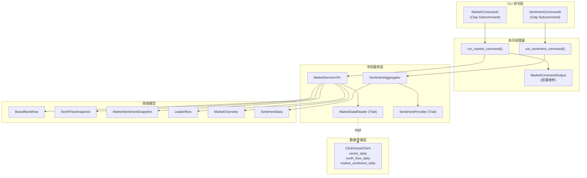
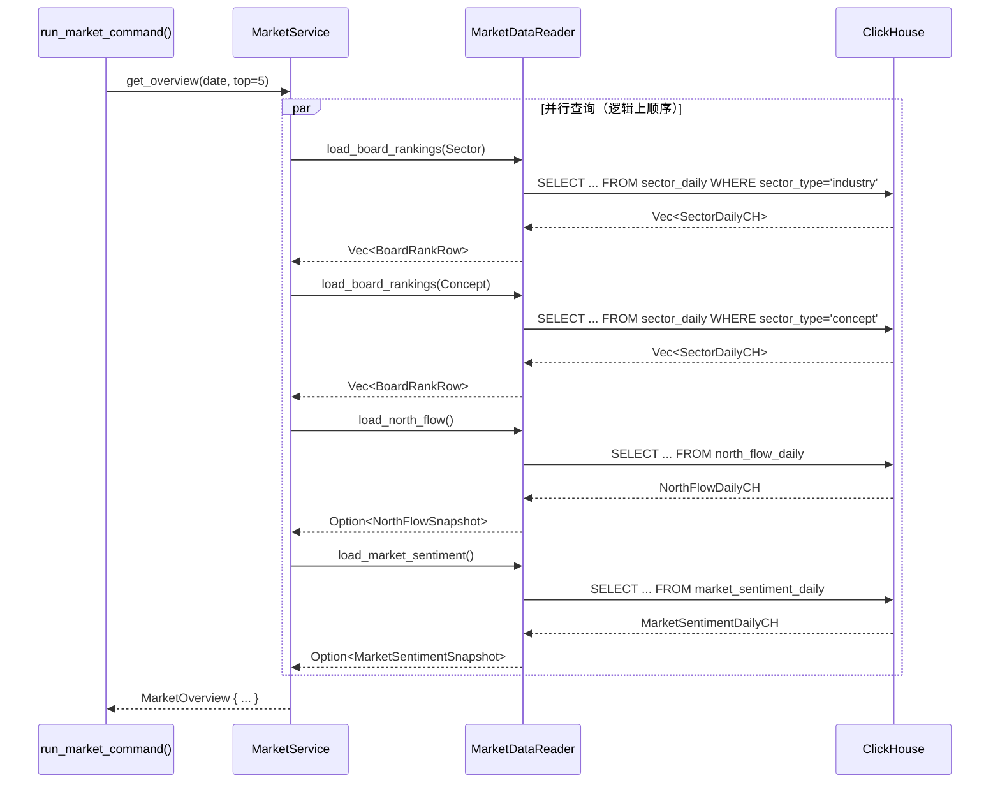

市场分析模块（`src/market/`）是 Quantix 系统中负责宏观市场状态感知的核心层，它将板块排名、北向资金流向、龙头股识别、市场情绪快照四类关键数据聚合为统一的服务接口，通过 `MarketDataReader` Trait 抽象数据读取层，底层默认对接 ClickHouse 列式存储引擎。模块整体遵循 **策略模式**——业务逻辑（`MarketService`）与数据获取（`MarketDataReader` 实现）完全解耦，使得单元测试可以用 `FakeReader` 零依赖地覆盖所有业务路径。

Sources: [mod.rs](src/market/mod.rs#L1-L11), [models.rs](src/market/models.rs#L1-L146)

---

## 模块架构总览

市场分析模块由三个子层次构成：**领域模型层**（`models.rs`）定义纯数据结构；**服务层**（`service.rs`）封装业务逻辑与 `MarketDataReader` Trait；**舆情子系统**（`sentiment/`）提供可扩展的多源情绪分析框架。CLI 层通过 `MarketCommands` 枚举将 Clap 子命令映射到服务调用，最终以格式化表格输出结果。

Sources: [mod.rs](src/market/mod.rs#L1-L11)



---

## 领域模型详解

### 板块排名模型（BoardRankRow / BoardType / BoardSortBy）

板块排名系统将 A 股市场分为两大类别：**行业板块**（`BoardType::Sector`，对应 ClickHouse 中 `sector_type = 'industry'`）和**概念板块**（`BoardType::Concept`，对应 `sector_type = 'concept'`）。每条排名记录包含板块代码、名称、类别、排名序号和涨跌幅百分比，目前仅支持按涨跌幅降序排列（`BoardSortBy::ChangePct`）。

| 字段 | 类型 | 说明 |
|------|------|------|
| `board_code` | `String` | 板块唯一标识（如 `BK001`） |
| `board_name` | `String` | 板块名称（如"银行"、"人工智能"） |
| `board_type` | `BoardType` | `Sector`（行业）或 `Concept`（概念） |
| `rank` | `usize` | 当日排名序号 |
| `change_pct` | `f64` | 涨跌幅百分比 |

Sources: [models.rs](src/market/models.rs#L4-L40)

### 北向资金快照（NorthFlowSnapshot）

北向资金模型捕获沪深港通的资金流向数据，分为沪股通（`sh_amount`）和深股通（`sz_amount`）两个通道，`total_amount` 为合计净流入，`balance` 为当日余额。所有金额单位为亿元。当未指定查询日期时，服务层自动查询 `north_flow_daily` 表中最新交易日数据。

| 字段 | 类型 | 说明 |
|------|------|------|
| `trade_date` | `NaiveDate` | 交易日期 |
| `sh_amount` | `f64` | 沪股通净流入（亿元） |
| `sz_amount` | `f64` | 深股通净流入（亿元） |
| `total_amount` | `f64` | 合计净流入（亿元） |
| `balance` | `f64` | 当日余额（亿元） |

Sources: [models.rs](src/market/models.rs#L42-L67)

### 市场情绪快照（MarketSentimentSnapshot）

市场情绪快照提供了 A 股市场日内情绪的量化画像，包含涨跌家数、涨停跌停数量、封板率/炸板率以及连板股数量。这套指标体系对判断市场强弱、赚钱效应具有直接参考价值——例如 `seal_rate`（封板率）高于 0.80 通常意味着市场做多情绪强烈，`consecutive_board_count`（连板股数量）则反映短线情绪的持续性。

| 字段 | 类型 | 说明 |
|------|------|------|
| `trade_date` | `NaiveDate` | 交易日期 |
| `up_count` | `usize` | 上涨家数 |
| `down_count` | `usize` | 下跌家数 |
| `limit_up_count` | `usize` | 涨停家数 |
| `limit_down_count` | `usize` | 跌停家数 |
| `seal_rate` | `f64` | 封板率（0.0 ~ 1.0） |
| `break_rate` | `f64` | 炸板率（0.0 ~ 1.0） |
| `consecutive_board_count` | `usize` | 连板股数量 |

Sources: [models.rs](src/market/models.rs#L69-L103)

### 龙头股模型（LeaderRow / LeaderFilter）

龙头股识别是板块分析的延伸——每个板块都有对应的领涨个股，系统通过 `LeaderFilter` 枚举支持三种筛选模式：按行业名称（`LeaderFilter::Sector`）、按概念名称（`LeaderFilter::Concept`）或全市场龙头（`LeaderFilter::All`）。`LeaderRow` 中 `sector_name` 和 `concept_name` 互斥填充，取决于过滤条件的来源类型。

| 字段 | 类型 | 说明 |
|------|------|------|
| `code` | `String` | 股票代码（如 `600000`） |
| `name` | `String` | 股票名称 |
| `sector_name` | `Option<String>` | 所属行业板块名 |
| `concept_name` | `Option<String>` | 所属概念板块名 |
| `change_pct` | `f64` | 龙头股涨跌幅 |

Sources: [models.rs](src/market/models.rs#L105-L137)

### 市场综合概览（MarketOverview）

`MarketOverview` 是一个**聚合值对象**，将前述四个维度合并为单一数据结构，由 `MarketService::get_overview()` 方法一次性组装。它的设计意图是为 CLI 的 `market overview` 命令和策略系统提供"一眼看穿市场"的快捷入口。

```rust
pub struct MarketOverview {
    pub top_sectors: Vec<BoardRankRow>,
    pub top_concepts: Vec<BoardRankRow>,
    pub north_flow: Option<NorthFlowSnapshot>,
    pub sentiment: Option<MarketSentimentSnapshot>,
}
```

Sources: [models.rs](src/market/models.rs#L139-L146)

---

## MarketService 服务层设计

### MarketDataReader Trait

`MarketDataReader` 是整个市场模块的**抽象数据门面**，定义了四个异步方法，分别对应四大查询维度。`ClickHouseClient` 是其默认实现，通过动态拼接 SQL 查询 ClickHouse。在测试和策略模拟场景中，可以用任意实现了该 Trait 的类型注入。

```rust
#[async_trait]
pub trait MarketDataReader: Send + Sync {
    async fn load_board_rankings(...) -> Result<Vec<BoardRankRow>>;
    async fn load_north_flow(...) -> Result<Option<NorthFlowSnapshot>>;
    async fn load_market_sentiment(...) -> Result<Option<MarketSentimentSnapshot>>;
    async fn load_leaders(...) -> Result<Vec<LeaderRow>>;
}
```

Sources: [service.rs](src/market/service.rs#L18-L41)

### 智能日期解析策略

`MarketDataReader` 的所有方法接受 `Option<NaiveDate>` 参数。当传入 `None` 时，服务层并非简单地不设置日期过滤——而是通过 `latest_date_clause()` 辅助函数生成子查询 `WHERE trade_date = (SELECT max(trade_date) FROM table)`，确保始终返回**最新可用交易日**的数据。这种设计避免了调用方需要知道"最新交易日是哪天"的额外负担。

对于板块查询，日期子查询还附加了 `sector_type` 过滤条件，例如 `WHERE sector_type = 'industry'`，确保 max 聚合只在目标板块类型内计算，避免行业和概念数据混合导致日期选取偏移。

Sources: [service.rs](src/market/service.rs#L306-L324)

### get_overview 聚合流程

`MarketService::get_overview()` 是模块的**旗舰方法**，它顺序发起四个查询并组装 `MarketOverview`。默认展示 Top 5 行业、Top 5 概念、当日北向资金和市场情绪。流程如下：



Sources: [service.rs](src/market/service.rs#L98-L121)

### 龙头股去重逻辑

龙头股查询（`load_leaders`）有一个重要的**去重机制**：由于同一只股票可能同时是多个概念板块的龙头，查询结果中可能出现重复代码。实现中使用 `HashSet<String>` 跟踪已见过的 `leader.code`，确保最终列表中每只股票只出现一次。排序规则为 `leader_change DESC, rank ASC, sector_code ASC`——优先展示涨幅最大的龙头。

Sources: [service.rs](src/market/service.rs#L279-L290)

---

## ClickHouse 存储层

### 三张核心表

市场模块依赖 ClickHouse 中的三张 `ReplacingMergeTree` 引擎表，均按月分区（`toYYYYMM(trade_date)`），以 `updated_at` 作为版本列实现幂等写入：

| 表名 | 排序键 | 用途 |
|------|--------|------|
| `sector_daily` | `(trade_date, sector_type, rank, sector_code)` | 板块日线排名 + 龙头股 |
| `north_flow_daily` | `(trade_date)` | 北向资金日线 |
| `market_sentiment_daily` | `(trade_date)` | 市场情绪日线 |

`sector_daily` 表的设计值得注意——它将板块排名和龙头股信息存储在同一张表中，通过 `leader_code`、`leader_name`、`leader_change` 三个 `Nullable` 字段承载龙头数据。这意味着一次查询即可同时获取板块排名和对应的龙头股，避免了跨表 JOIN 的性能开销。

Sources: [clickhouse.rs](src/db/clickhouse.rs#L998-L1056)

### 数据转换层（CH Row → Domain Model）

ClickHouse 行类型（`SectorDailyCH`、`NorthFlowDailyCH`、`MarketSentimentDailyCH`）到领域模型的转换通过专属方法完成。`SectorDailyCH` 提供了两个转换路径：`try_into_board_rank()` 用于板块排名查询，`try_into_leader()` 用于龙头股查询。后者会检查 `leader_code` 和 `leader_name` 是否为空，空值直接返回 `Ok(None)` 而非报错，这与 SQL 层的 `leader_code IS NOT NULL` 过滤形成双重保障。

Sources: [clickhouse.rs](src/db/clickhouse.rs#L891-L996)

---

## 舆情子系统（Sentiment）

### 分层架构

舆情子系统位于 `src/market/sentiment/` 目录下，采用**提供者-聚合器**模式：`SentimentProvider` Trait 定义单个数据源的行为契约，`SentimentAggregator` 负责协调多个 Provider 并计算加权综合得分。

| 组件 | 文件 | 职责 |
|------|------|------|
| `SentimentProvider` | [provider.rs](src/market/sentiment/provider.rs) | 数据源 Trait，定义 `get_sentiment`、`get_score`、`get_mentions`、`get_history` |
| `SentimentAggregator` | [aggregator.rs](src/market/sentiment/aggregator.rs) | 多源聚合，按样本数加权计算综合得分 |
| `SentimentData` | [types.rs](src/market/sentiment/types.rs) | 聚合结果模型 |
| `SentimentLevel` | [types.rs](src/market/sentiment/types.rs) | 七级情绪等级（从 VeryBearish 到 VeryBullish） |
| `SocialMention` | [types.rs](src/market/sentiment/types.rs) | 社交媒体提及记录 |

Sources: [mod.rs](src/market/sentiment/mod.rs#L1-L12)

### SentimentProvider Trait

每个舆情提供者需要实现五个方法，其中 `is_available()` 提供健康检查，默认返回 `true`。聚合器在每次查询前会先检查提供者的可用状态，跳过不可用的源。

```rust
#[async_trait]
pub trait SentimentProvider: Send + Sync {
    fn name(&self) -> &'static str;
    async fn get_sentiment(&self, code: &str) -> Result<SentimentData>;
    async fn get_score(&self, code: &str) -> Result<SentimentScore>;
    async fn get_mentions(&self, code: &str, limit: usize) -> Result<Vec<SocialMention>>;
    async fn get_history(&self, code: &str, days: u32) -> Result<Vec<SentimentHistoryPoint>>;
    fn is_available(&self) -> bool { true }
}
```

Sources: [provider.rs](src/market/sentiment/provider.rs#L1-L30)

### 加权聚合算法

`SentimentAggregator::get_sentiment()` 的核心算法是**样本数加权平均**：遍历所有可用 Provider，获取各自的 `SentimentScore`，以 `sample_count` 作为权重进行加权求和。公式为 `overall_score = Σ(score_i × sample_count_i) / Σ(sample_count_i)`。如果所有 Provider 均无数据，综合得分默认为 0.0（中性）。

聚合器还会从各 Provider 收集最近的社交媒体提及（每个源最多 5 条），合并后按发布时间降序排列，截断到最多 20 条。

Sources: [aggregator.rs](src/market/sentiment/aggregator.rs#L22-L79)

### 七级情绪等级

`SentimentLevel` 将 `[-1.0, 1.0]` 的连续得分映射为七个离散等级，每个等级配有 emoji 和中文标签，便于终端展示：

| 得分范围 | 等级 | Emoji | 标签 |
|----------|------|-------|------|
| `[0.6, 1.0]` | `VeryBullish` | 🚀 | 非常看多 |
| `[0.4, 0.6)` | `Bullish` | 📈 | 看多 |
| `[0.2, 0.4)` | `SlightlyBullish` | 🙂 | 中性偏多 |
| `(-0.2, 0.2)` | `Neutral` | 😐 | 中性 |
| `(-0.4, -0.2]` | `SlightlyBearish` | 😟 | 中性偏空 |
| `(-0.6, -0.4]` | `Bearish` | 📉 | 看空 |
| `[-1.0, -0.6]` | `VeryBearish` | 🔥 | 非常看空 |

Sources: [types.rs](src/market/sentiment/types.rs#L28-L88)

---

## CLI 命令映射

### Market 命令族

CLI 层通过 `MarketCommands` 枚举定义了六个子命令，每个子命令携带独立的参数集。`run_market_command()` 入口函数创建 `ClickHouseClient` 作为 `MarketDataReader` 的实现，调用 `execute_market_command_with_reader()` 执行查询，最终根据 `MarketCommandOutput` 枚举分派到对应的打印函数。

| 子命令 | 说明 | 关键参数 | 服务方法 |
|--------|------|----------|----------|
| `market sector` | 行业板块排名 | `--top`, `--date`, `--sort-by` | `get_board_rankings(Sector)` |
| `market concept` | 概念板块排名 | `--top`, `--date`, `--sort-by` | `get_board_rankings(Concept)` |
| `market north` | 北向资金概览 | `--date` | `get_north_flow()` |
| `market sentiment` | 市场情绪概览 | `--date` | `get_market_sentiment()` |
| `market leader` | 龙头股识别 | `--sector`/`--concept`/`--all`, `--limit`, `--date` | `get_leaders()` |
| `market overview` | 市场综合概览 | `--top`, `--date` | `get_overview()` |

`market leader` 命令通过 Clap 的 `ArgGroup` 约束，要求**必须且只能**指定 `--sector`、`--concept`、`--all` 三者之一，该约束在编译期由 `#[command(group(...))]` 属性保证，在运行时由 `build_leader_filter()` 函数二次校验。

Sources: [market.rs](src/cli/commands/market.rs#L1-L88), [handlers/mod.rs](src/cli/handlers/mod.rs#L2526-L2549)

### Sentiment 命令族

舆情命令独立于 Market 命令族，通过顶层 `sentiment` 子命令访问。当前实现中 `SentimentAggregator` 以空 Provider 列表初始化（`vec![]`），CLI 输出会提示"暂无舆情数据源，请配置 SentimentProvider"，并列举可配置的提供商：Adanos、EastMoney Guba、Sina Finance。

| 子命令 | 说明 | 关键参数 |
|--------|------|----------|
| `sentiment show` | 显示舆情数据 | `-c`（股票代码） |
| `sentiment history` | 历史趋势 | `-c`, `-d`（天数，默认 7） |
| `sentiment mentions` | 社交媒体提及 | `-c`, `-n`（最大数量，默认 20） |

Sources: [info.rs](src/cli/commands/info.rs#L225-L254), [sentiment.rs](src/cli/handlers/sentiment.rs#L1-L126)

---

## 测试策略

市场模块的测试体系采用 **Trait 替换** 模式——测试文件 [market_service_test.rs](tests/market_service_test.rs) 定义了 `FakeReader`，它完全在内存中实现 `MarketDataReader`，返回预构造的板块、北向资金、情绪和龙头数据。这使得所有测试用例可以脱离 ClickHouse 依赖，在毫秒级完成执行。

测试覆盖了以下关键场景：

| 测试名称 | 验证点 |
|----------|--------|
| `returns_sector_rankings_with_requested_limit_and_sort` | 行业排名的 limit 透传和排序参数正确性 |
| `returns_concept_rankings_from_same_service_path` | 概念排名的完整列表返回 |
| `returns_north_flow_snapshot` | 北向资金指定日期查询和字段值正确性 |
| `returns_market_sentiment_snapshot` | 市场情绪快照字段完整性 |
| `returns_sector_leaders` | 按行业名称筛选龙头股 |
| `returns_concept_leaders` | 按概念名称筛选龙头股 |
| `builds_market_overview_from_component_queries` | Overview 聚合的各子查询整合 |
| `empty_inputs_return_readable_empty_results` | 空数据源的优雅降级（返回空列表/None） |

Sources: [market_service_test.rs](tests/market_service_test.rs#L1-L304)

---

## 扩展指南

市场分析服务的架构天然支持扩展。如果需要新增数据维度（如融资融券余额、主力资金流向），推荐遵循以下步骤：

1. 在 [models.rs](src/market/models.rs) 中定义新的快照结构体
2. 在 `MarketDataReader` Trait 中添加对应的 `load_*` 异步方法
3. 在 `MarketService` 中添加公开的 `get_*` 业务方法，设置合理默认值
4. 在 ClickHouse 中创建对应表并实现 `impl MarketDataReader for ClickHouseClient`
5. 在 [market.rs](src/cli/commands/market.rs) 中添加 `MarketCommands` 变体
6. 在 `MarketCommandOutput` 枚举中添加结果变体并实现打印函数

对于舆情子系统的扩展，只需实现 `SentimentProvider` Trait 并将新 Provider 注入 `SentimentAggregator::new(providers)` 即可，无需修改任何现有代码。

Sources: [service.rs](src/market/service.rs#L43-L121), [provider.rs](src/market/sentiment/provider.rs#L1-L30)

---

## 相关页面

- [选股器：条件解析、评估引擎与预设筛选](20-xuan-gu-qi-tiao-jian-jie-xi-ping-gu-yin-qing-yu-yu-she-shai-xuan) — 选股器如何利用板块排名数据进行条件筛选
- [多数据源适配器（TDX / AkShare / 东方财富 / WebSocket）](7-duo-shu-ju-yuan-gua-pei-qi-tdx-akshare-dong-fang-cai-fu-websocket) — 底层数据源如何将板块和北向资金数据写入 ClickHouse
- [数据库客户端层（ClickHouse / PostgreSQL / TDengine）](8-shu-ju-ku-ke-hu-duan-ceng-clickhouse-postgresql-tdengine) — ClickHouse 客户端的完整实现细节
- [Strategy Trait 策略接口与内置策略实现](10-strategy-trait-ce-lue-jie-kou-yu-nei-zhi-ce-lue-shi-xian) — 策略如何消费市场情绪和板块数据作为决策输入