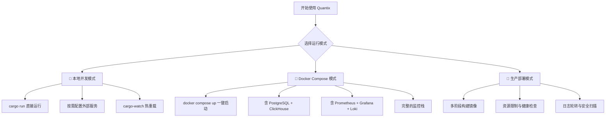

本文档是 Quantix-Rust 项目的**搭建与运行指南**，面向首次接触本项目的开发者。你将按顺序完成环境安装、项目克隆、配置初始化、首次构建与运行，并在最后了解三种运行模式（本地开发、Docker 一键启动、生产部署）的差异。所有命令以 Linux/WSL2 为执行基线，Cursor 等编辑器可作为辅助但不应成为唯一执行路径。

Sources: [main.rs](src/main.rs#L1-L24), [Cargo.toml](Cargo.toml#L1-L125)

---

## 系统要求

在开始之前，请确认你的开发环境满足以下最低要求：

| 依赖项 | 最低版本 | 用途 | 是否必须 |
|--------|---------|------|---------|
| **Rust toolchain** | 1.85+（edition 2024） | 编译与运行 | ✅ 必须 |
| **Git** | 2.30+ | 代码版本管理 | ✅ 必须 |
| **pkg-config / libssl-dev** | 系统默认 | OpenSSL 编译链接 | ✅ 编译必须 |
| **PostgreSQL** | 17+ | 交易数据、风控、账户等关系型存储 | ⚡ 可选（按需） |
| **ClickHouse** | latest | K线、行情等时序数据主存储 | ⚡ 可选（按需） |
| **Docker + Docker Compose** | 24+ / v2 | 容器化一键部署 | ⚡ 可选（按需） |

> **快速判断**：如果你只需要阅读代码、审阅文档或做结构分析，Rust toolchain 不是必须的。但任何涉及 `cargo build`、`cargo test`、`cargo clippy` 的操作都要求完整的 Rust 工具链。

Sources: [Cargo.toml](Cargo.toml#L5-L6), [Dockerfile](Dockerfile#L4-L5), [QUICKSTART.md](docs/QUICKSTART.md#L1-L40)

---

## 第一步：安装 Rust 工具链

Quantix 使用 Rust **2024 edition**，需要 Rust 1.85 或更高版本。推荐通过 `rustup` 安装：

```bash
# 安装 rustup（官方推荐方式）
curl --proto '=https' --tlsv1.2 -sSf https://sh.rustup.rs | sh

# 加载环境变量
source "$HOME/.cargo/env"

# 验证安装
cargo --version   # 应显示 1.85+ 对应的 cargo 版本
rustc --version   # 应显示 1.85+
```

安装完成后，建议补充以下开发工具以提升日常开发效率：

```bash
# 代码格式化与静态检查（CI 强制要求）
rustup component add rustfmt clippy

# 热重载开发（可选，用于 watch 模式）
cargo install cargo-watch

# 安全审计（可选）
cargo install cargo-audit
```

Sources: [ci.yml](.github/workflows/ci.yml#L30-L36), [watch.sh](scripts/dev/watch.sh#L23-L26)

---

## 第二步：克隆项目

```bash
# 克隆仓库
git clone https://github.com/chengjon/quantix-rust.git
cd quantix-rust
```

项目根目录的**核心文件结构**如下，了解它有助于你快速定位后续配置和代码：

```
quantix-rust/
├── Cargo.toml              # 项目清单：依赖、特性、构建配置
├── .env.example            # 环境变量模板（复制为 .env 后填写）
├── config/                 # TOML 配置文件目录
│   ├── default.toml        # 默认配置（数据库、数据源、交易时段、通知）
│   ├── ai.toml             # AI 决策模块配置（LLM 提供商、模型、参数）
│   └── news.toml           # 新闻搜索模块配置（Tavily/SerpAPI/博查）
├── src/
│   ├── main.rs             # CLI 入口（Clap 解析 + Tokio 异步运行时）
│   └── lib.rs              # 库入口（模块声明与类型重导出）
├── Dockerfile              # 生产多阶段构建
├── Dockerfile.dev          # 开发热重载构建
├── docker-compose.yml      # 完整开发环境编排
├── scripts/
│   ├── init-postgres.sql   # PostgreSQL 初始化脚本
│   ├── init-clickhouse.sql # ClickHouse 初始化脚本（建表）
│   └── dev/                # 开发辅助脚本
└── monitoring/             # Prometheus / Grafana / Loki 配置
```

Sources: [lib.rs](src/lib.rs#L1-L50), [config/default.toml](config/default.toml#L1-L87)

---

## 第三步：环境配置

### 3.1 创建 .env 文件

从模板复制并按需修改：

```bash
cp .env.example .env
```

`.env` 文件按功能区块组织，下表列出**首次运行最常配置**的变量：

| 变量名 | 默认值 | 说明 |
|--------|-------|------|
| `POSTGRES_HOST` | localhost | PostgreSQL 主机地址 |
| `POSTGRES_PORT` | 5432 | PostgreSQL 端口 |
| `POSTGRES_DB` | quantix | 数据库名称 |
| `POSTGRES_USER` / `POSTGRES_PASSWORD` | quantix / your_password | 认证凭据 |
| `CLICKHOUSE_URL` | http://localhost:8123 | ClickHouse HTTP 接口地址 |
| `CLICKHOUSE_DB` | quantix | ClickHouse 数据库名称 |
| `TDX_HOSTS` | 114.80.63.12,114.80.63.13 | 通达信行情服务器地址 |
| `TDX_PORT` | 7709 | 通达信端口 |
| `RUST_LOG` | quantix_cli=info,sqlx=warn | 日志级别过滤 |
| `LLM_PROVIDER` | deepseek | AI 决策默认 LLM 提供商 |

> **重要**：PostgreSQL 和 ClickHouse 都是按需启用的外部服务，不影响项目编译。只有在你需要实际查询数据或运行策略时，才需要配置对应的连接信息。首次体验建议先跳过数据库配置，直接尝试编译和 CLI 帮助命令。

Sources: [.env.example](.env.example#L1-L105), [config/default.toml](config/default.toml#L1-L30)

### 3.2 TOML 配置文件

除 `.env` 外，项目使用 `config/` 目录下的 TOML 文件管理结构化配置：

- **`config/default.toml`** — 数据库连接参数、数据源配置、交易时段、通知渠道等核心运行时参数
- **`config/ai.toml`** — LLM 提供商设置（DeepSeek/OpenAI/Ollama/Anthropic/Gemini）、模型选择、决策引擎参数
- **`config/news.toml`** — 新闻搜索提供商配置（Tavily/SerpAPI/博查）、缓存策略、搜索深度

这些配置文件中的值会被 `.env` 环境变量覆盖，环境变量优先级最高。配置体系的完整说明参见 [环境变量与配置管理](3-huan-jing-bian-liang-yu-pei-zhi-guan-li)。

Sources: [config/default.toml](config/default.toml#L1-L87), [config/ai.toml](config/ai.toml#L1-L72), [config/news.toml](config/news.toml#L1-L57)

---

## 第四步：首次构建与运行

### 4.1 编译项目

```bash
# 开发模式编译（快速迭代，不优化）
cargo build

# 或直接运行（自动编译 + 执行）
cargo run -- --help
```

编译成功后，你会看到 quantix CLI 的完整帮助信息，列出所有可用子命令。如果你想构建**优化后的发布版本**：

```bash
# Release 构建（启用 LTO、单 codegen-unit、strip 符号）
cargo build --release

# 产物位于 target/release/quantix
./target/release/quantix --help
```

> **Release 构建配置**：项目在 `[profile.release]` 中设置了 `opt-level = 3`、`lto = true`、`codegen-units = 1`、`strip = true`，构建时间较长但产物体积最小、性能最优。

Sources: [Cargo.toml](Cargo.toml#L112-L124), [main.rs](src/main.rs#L1-L24)

### 4.2 初始化配置

```bash
# 初始化配置和数据库连接
cargo run -- init

# 查看系统状态与健康检查
cargo run -- status --health
```

`init` 命令会读取 `config/` 目录下的 TOML 文件和环境变量，验证数据库连接（如果配置了的话），并创建必要的运行时目录。

Sources: [commands/mod.rs](src/cli/commands/mod.rs#L88-L93)

### 4.3 探索 CLI 命令体系

Quantix 提供了丰富的子命令，覆盖从数据采集到策略执行的完整量化交易工作流：

```bash
# 查看所有顶层命令
cargo run -- --help

# 交互式菜单（适合探索）
cargo run -- menu
```

以下是核心子命令的快速参考：

| 命令 | 说明 | 示例 |
|------|------|------|
| `init` | 初始化配置和数据库 | `cargo run -- init` |
| `menu` | 交互式菜单 | `cargo run -- menu` |
| `data` | 数据查询与管理 | `cargo run -- data query --code 000001` |
| `strategy` | 策略运行与管理 | `cargo run -- strategy list` |
| `analyze` | 技术指标计算 | `cargo run -- analyze indicators --code 000001` |
| `market` | 市场分析（板块/北向/情绪） | `cargo run -- market --help` |
| `trade` | 模拟交易管理 | `cargo run -- trade init --capital 1000000` |
| `risk` | 风控规则管理 | `cargo run -- risk --help` |
| `watchlist` | 自选池管理 | `cargo run -- watchlist --help` |
| `screener` | 选股器 | `cargo run -- screener --help` |
| `stop` | 止盈止损规则 | `cargo run -- stop --help` |
| `ai` | AI 决策引擎 | `cargo run -- ai --help` |
| `news` | 新闻搜索 | `cargo run -- news search --keyword "贵州茅台"` |
| `fundamental` | 基本面数据 | `cargo run -- fundamental valuation --code 600519` |
| `execution` | 执行自动化 | `cargo run -- execution config show` |
| `monitor` | 监控服务 | `cargo run -- monitor --help` |
| `status --health` | 系统健康检查 | `cargo run -- status --health` |

CLI 命令的完整架构设计参见 [CLI 命令体系与 Clap 子命令分发](6-cli-ming-ling-ti-xi-yu-clap-zi-ming-ling-fen-fa)。

Sources: [commands/mod.rs](src/cli/commands/mod.rs#L82-L172), [QUICKSTART.md](docs/QUICKSTART.md#L117-L155)

---

## 第五步：运行测试

### 5.1 基础测试

```bash
# 运行所有单元测试
cargo test --lib --all-features

# 运行文档测试
cargo test --doc --all-features

# 运行全部测试（包括集成测试）
cargo test --all-features
```

### 5.2 代码质量检查

项目 CI 强制执行以下质量门禁，本地开发时建议在提交前运行：

```bash
# 1. 代码格式化
cargo fmt

# 2. 静态分析（CI 使用 -D warnings，任何 warning 视为错误）
cargo clippy --all-targets --all-features -- -D warnings

# 3. 安全审计
cargo audit
```

### 5.3 功能验证脚本

项目提供了自动化的功能验证脚本，可一次性检查所有核心功能的可用性：

```bash
bash scripts/verify_features.sh
```

该脚本会自动执行编译检查、CLI 命令可达性验证、策略/执行/风控等模块的冒烟测试，并输出 PASS/WARN/FAIL 统计摘要。日志保存在 `logs/` 目录下，便于回溯排查。

Sources: [ci.yml](.github/workflows/ci.yml#L90-L105), [verify_features.sh](scripts/verify_features.sh#L1-L103)

---

## 三种运行模式

Quantix 支持三种运行模式，覆盖从本地开发到生产部署的全场景。下图展示了各模式的适用场景与核心差异：



### 模式一：本地开发

最轻量的方式，只需 Rust 工具链即可开始：

```bash
# 直接运行
cargo run -- --help

# 热重载开发（自动重新编译 + 测试 + clippy）
bash scripts/dev/watch.sh

# 仅测试监控
bash scripts/dev/watch-test.sh

# Zellij 多窗口开发环境（需要安装 Zellij）
bash scripts/dev/dev.zsh
```

本地模式下，PostgreSQL 和 ClickHouse 等外部服务**不需要启动**，只有在执行涉及数据查询的命令时才需要配置。日志级别通过 `RUST_LOG` 环境变量控制，开发时建议设置为 `debug` 以获取更详细的输出：

```bash
RUST_LOG=quantix_cli=debug cargo run -- strategy list
```

Sources: [watch.sh](scripts/dev/watch.sh#L1-L37), [dev.zsh](scripts/dev/dev.zsh#L1-L38), [main.rs](src/main.rs#L12-L15)

### 模式二：Docker Compose（推荐用于完整体验）

Docker Compose 编排了一套完整的开发环境，包含应用本身以及所有依赖服务：

```bash
# 一键启动全部服务
docker compose up -d

# 查看服务状态
docker compose ps

# 查看应用日志
docker compose logs -f quantix

# 停止全部服务
docker compose down
```

启动后的服务访问地址：

| 服务 | 地址 | 用途 |
|------|------|------|
| **Quantix CLI** | 容器内 `8080` 端口 | 主应用（`quantix health` 健康检查） |
| **PostgreSQL** | `localhost:5432` | 关系型数据存储 |
| **ClickHouse** | `localhost:8123` (HTTP) / `9000` (Native) | 时序数据主存储 |
| **Prometheus** | `localhost:9090` | 指标采集 |
| **Grafana** | `localhost:3000` | 监控面板（admin/admin） |
| **Loki** | `localhost:3100` | 日志聚合 |
| **PgAdmin**（可选） | `localhost:5050` | PostgreSQL 管理工具 |

> **PgAdmin** 通过 Docker Compose profiles 机制控制，默认不启动。需要时使用 `docker compose --profile tools up -d` 启动。

Sources: [docker-compose.yml](docker-compose.yml#L1-L200), [Dockerfile](Dockerfile#L1-L77)

### 模式三：生产部署

生产环境使用独立的 `docker-compose.prod.yml` 覆盖文件，在开发配置基础上增加**资源限制、安全加固、日志轮转和 TLS 支持**：

```bash
# 生产环境启动（需设置必需的环境变量）
export POSTGRES_PASSWORD=<强密码>
export CLICKHOUSE_PASSWORD=<强密码>
export GRAFANA_ADMIN_PASSWORD=<强密码>
export VERSION=latest

docker compose -f docker-compose.yml -f docker-compose.prod.yml up -d
```

生产配置与开发配置的关键差异：

| 维度 | 开发环境 | 生产环境 |
|------|---------|---------|
| **镜像来源** | 本地构建 | `ghcr.io/chengjon/quantix-rust/quantix:latest` |
| **CPU 限制** | 无限制 | 2 核（预留 1 核） |
| **内存限制** | 无限制 | 4GB（预留 2GB） |
| **密码管理** | 明文 `quantix123` | **必需**环境变量（未设置则拒绝启动） |
| **日志** | 标准输出 | JSON 文件轮转（100MB × 5 份） |
| **重启策略** | `unless-stopped` | `always` + 失败重启（最多 3 次） |
| **TLS** | 无 | Traefik + Let's Encrypt 自动证书 |
| **安全扫描** | 无 | Trivy 漏洞扫描 + GitHub Security 集成 |

Sources: [docker-compose.prod.yml](docker-compose.prod.yml#L1-L80), [docker.yml](.github/workflows/docker.yml#L1-L60)

---

## Cargo 特性（Features）说明

项目通过 Cargo features 控制**可选功能模块**的启用：

| Feature | 默认启用 | 说明 |
|---------|---------|------|
| `postgresql` | ✅ | PostgreSQL 数据库支持（sqlx） |
| `tdengine-rest` | ✅ | TDengine REST API 支持 |
| `sqlite` | ❌ | SQLite 支持（本地轻量存储） |
| `tdengine-ws` | ❌ | TDengine WebSocket 连接支持 |
| `tui` | ❌ | 终端用户界面（ratatui + crossterm） |

自定义编译示例：

```bash
# 仅启用 PostgreSQL，禁用 TDengine
cargo build --no-default-features --features postgresql

# 启用 TUI 界面
cargo build --features tui
cargo run --features tui -- menu --tui
```

Sources: [Cargo.toml](Cargo.toml#L103-L111)

---

## 常见问题排查

| 问题 | 可能原因 | 解决方案 |
|------|---------|---------|
| `cargo build` 报 `edition 2024` 错误 | Rust 版本低于 1.85 | 运行 `rustup update stable` 升级 |
| 编译报 `OpenSSL` 链接错误 | 缺少 `libssl-dev` / `pkg-config` | `sudo apt install pkg-config libssl-dev` |
| `cargo run -- status --health` 连接失败 | 数据库未启动或 `.env` 未配置 | 仅影响数据查询功能，不影响编译和其他命令 |
| Docker Compose 启动后 ClickHouse 健康检查失败 | ClickHouse 初始化较慢 | 等待约 20 秒后重试，或查看 `docker compose logs clickhouse` |
| `cargo clippy` 报大量 warnings | 代码未通过静态检查 | 运行 `cargo fmt` 格式化后重新检查 |
| `cargo test` 某些测试超时 | 测试需要数据库连接 | 确保数据库服务已启动，或跳过集成测试只运行 `cargo test --lib` |

Sources: [Dockerfile](Dockerfile#L6-L10), [ci.yml](.github/workflows/ci.yml#L91-L130), [health-check.sh](scripts/health-check.sh#L1-L40)

---

## 下一步

完成搭建后，建议按以下顺序深入探索项目：

1. **[环境变量与配置管理](3-huan-jing-bian-liang-yu-pei-zhi-guan-li)** — 了解完整的配置体系、优先级规则和运行时路径管理
2. **[分层架构设计与模块依赖关系](4-fen-ceng-jia-gou-she-ji-yu-mo-kuai-yi-lai-guan-xi)** — 从宏观视角理解项目的分层架构和模块间依赖
3. **[CLI 命令体系与 Clap 子命令分发](6-cli-ming-ling-ti-xi-yu-clap-zi-ming-ling-fen-fa)** — 深入了解命令解析架构和 handler 分发机制