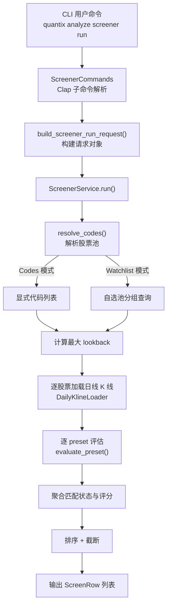
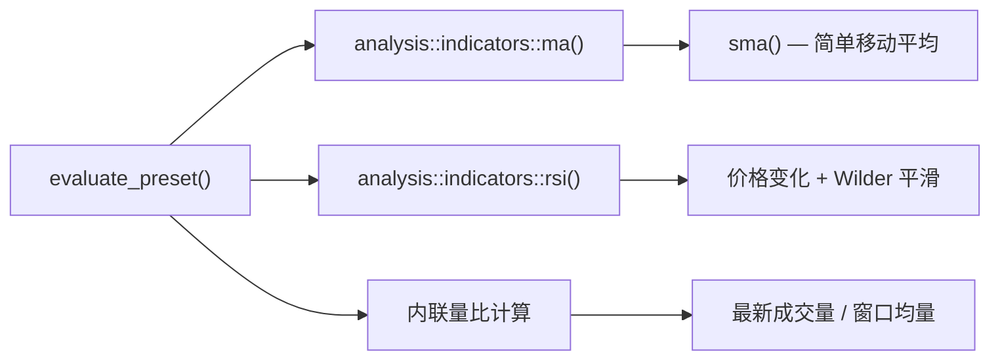
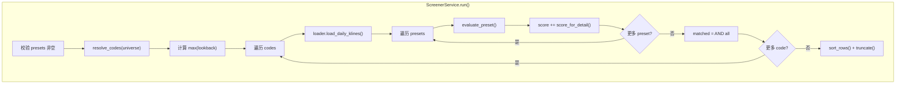

选股器（Screener）是 Quantix 中面向 **批量股票技术面筛选** 的核心子系统。它接受一组用户定义的 **预设条件**（Preset），在指定的 **股票池**（Universe）上逐一加载日线数据、计算技术指标并判断是否命中，最终输出带评分和匹配详情的排序结果。整个模块由四个文件组成：`models.rs`（类型定义）、`parser.rs`（DSL 解析）、`evaluator.rs`（指标评估）和 `service.rs`（编排服务），总计约 470 行代码，职责边界清晰。

Sources: [mod.rs](src/screener/mod.rs#L1-L13), [models.rs](src/screener/models.rs#L1-L63)

## 整体架构与数据流

选股器的核心流程可以用以下 Mermaid 图来概括——从用户在 CLI 输入命令开始，经过条件解析、股票池解析、K 线加载与指标计算，最终输出排序后的筛选结果。



上图揭示了三个核心抽象层：**解析层**（parser）将字符串 DSL 转化为结构化的 `PresetInvocation`；**评估层**（evaluator）基于 K 线数据计算指标并生成 `RuleMatchDetail`；**编排层**（service）协调股票池、数据加载和结果聚合。这种分层设计使得每一层都可以独立测试和替换。

Sources: [service.rs](src/screener/service.rs#L37-L85), [handlers/mod.rs](src/cli/handlers/mod.rs#L4515-L4544)

## 数据模型体系

### 核心类型一览

选股器模块的所有数据类型定义在 `models.rs` 中，各类型之间的关系如下：

| 类型 | 职责 | 关键字段 |
|---|---|---|
| `PresetKind` | 预设条件枚举（5 种） | `CloseAboveMa`, `CloseBelowMa`, `RsiGte`, `RsiLte`, `VolumeRatioGte` |
| `PresetInvocation` | 一个待执行的预设条件 | `kind: PresetKind` + `params: BTreeMap<String, String>` |
| `RuleMatchDetail` | 单条预设的评估结果 | `matched`, `actual_value`, `threshold_value`, `reason` |
| `ScreenUniverse` | 股票池定义（互斥二选一） | `Codes(Vec<String>)` / `Watchlist { group }` |
| `ScreenSortBy` | 排序方式 | `Code` / `Score` |
| `ScreenRunOptions` | 运行选项 | `limit`, `sort_by` |
| `ScreenRow` | 单只股票的最终筛选结果 | `code`, `matched`, `score`, `details: Vec<RuleMatchDetail>` |

**`ScreenRow.matched`** 的语义是 **全量 AND 逻辑**——只有当所有 preset 的 `detail.matched` 均为 `true` 时，该股票才会被标记为 `matched = true`。score 则是各 preset 超额幅度的累加值。

Sources: [models.rs](src/screener/models.rs#L1-L63)

### 类型关系图

```mermaid
classDiagram
    class PresetKind {
        <<enum>>
        CloseAboveMa
        CloseBelowMa
        RsiGte
        RsiLte
        VolumeRatioGte
    }
    class PresetInvocation {
        kind: PresetKind
        params: BTreeMap~String, String~
    }
    class ScreenUniverse {
        <<enum>>
        Codes(Vec~String~)
        Watchlist{group: Option~String~}
    }
    class ScreenRunOptions {
        limit: Option~usize~
        sort_by: ScreenSortBy
    }
    class RuleMatchDetail {
        preset_name: String
        matched: bool
        actual_value: Option~Decimal~
        threshold_value: Option~Decimal~
        reason: Option~String~
    }
    class ScreenRow {
        code: String
        matched: bool
        score: Decimal
        details: Vec~RuleMatchDetail~
    }
    PresetInvocation --> PresetKind
    ScreenRow --> RuleMatchDetail : 1:N
```

Sources: [models.rs](src/screener/models.rs#L4-L62)

## 条件解析器：Preset DSL 语法

`parser.rs` 提供了将字符串形式的选择条件转化为结构化 `PresetInvocation` 的能力。这是用户与系统之间的契约接口，采用 `name:key=value,key=value` 的简洁 DSL 语法。

### DSL 语法规范

```
<preset_spec> ::= <name> ":" <param_list>
<param_list>  ::= <param> ("," <param>)*
<param>       ::= <key> "=" <value>
```

解析流程分为三步：首先按 `:` 分割提取 preset 名称和参数区域；然后按 `,` 分割参数，再按 `=` 提取键值对；最后根据 preset 类型校验参数的合法性和类型。

Sources: [parser.rs](src/screener/parser.rs#L5-L15)

### 五种内置预设及其参数约束

| 预设名称 | 必需参数 | 参数类型 | 语义说明 |
|---|---|---|---|
| `close_above_ma` | `period` | usize | 收盘价高于指定周期均线 |
| `close_below_ma` | `period` | usize | 收盘价低于指定周期均线 |
| `rsi_gte` | `period`, `value` | usize, f64 | RSI 大于等于指定阈值 |
| `rsi_lte` | `period`, `value` | usize, f64 | RSI 小于等于指定阈值 |
| `volume_ratio_gte` | `window`, `value` | usize, f64 | 量比（最新成交量 / 窗口均量）大于等于阈值 |

参数校验逻辑通过 `validate_params()` 函数严格实施：**多余参数会报错**、**缺少必需参数会报错**、**数值类型不匹配会报错**。例如传入 `close_above_ma:value=20` 会被拒绝，因为该预设只接受 `period` 参数。

Sources: [parser.rs](src/screener/parser.rs#L54-L73)

### 解析示例

| 输入字符串 | 解析结果 |
|---|---|
| `close_above_ma:period=20` | `PresetInvocation { kind: CloseAboveMa, params: {"period": "20"} }` |
| `rsi_gte:period=14,value=55` | `PresetInvocation { kind: RsiGte, params: {"period": "14", "value": "55"} }` |
| `volume_ratio_gte:window=5,value=1.5` | `PresetInvocation { kind: VolumeRatioGte, params: {"window": "5", "value": "1.5"} }` |
| `unknown_rule:period=20` | **错误**：`未知的 preset: unknown_rule` |
| `close_above_ma:value=20` | **错误**：`不支持的参数: value` |
| `rsi_gte:period=abc,value=55` | **错误**：`参数 period 必须是正整数` |

Sources: [parser.rs](src/screener/parser.rs#L17-L26), [screener_parser_test.rs](tests/screener_parser_test.rs#L1-L63)

## 评估引擎：指标计算与匹配判定

`evaluator.rs` 是选股器的核心计算层，提供两个公共函数：`required_lookback()` 计算给定 preset 所需的最少 K 线数量，`evaluate_preset()` 执行实际的指标计算与匹配判定。

### 回看窗口计算

不同的预设条件需要不同长度的历史数据窗口。`required_lookback()` 函数根据预设类型返回所需的最小 K 线条数：

| 预设类型 | 所需 lookback | 计算依据 |
|---|---|---|
| `CloseAboveMa` / `CloseBelowMa` | `period` 值 | MA 需要恰好 period 个收盘价 |
| `RsiGte` / `RsiLte` | `period + 1` | RSI 需要先计算 price changes，再平滑 period 期 |
| `VolumeRatioGte` | `window` 值 | 量比计算需要 window 条成交量的窗口 |

当 K 线数量不足时，评估不会报错，而是返回一个 `matched = false` 的 `RuleMatchDetail`，并在 `reason` 字段中标注 `"数据不足: 至少需要 N 条日线"`。这种 **优雅降级** 设计确保了批量筛选场景下单只股票的数据缺失不会中断整个流程。

Sources: [evaluator.rs](src/screener/evaluator.rs#L7-L28)

### 各预设的评估逻辑

**均线类条件**（`CloseAboveMa` / `CloseBelowMa`）从 `analysis::indicators::ma()` 函数获取 SMA 均线序列，取最后一个有效值与最新收盘价比较。评估结果中 `actual_value` 为最新收盘价，`threshold_value` 为均线值。

**RSI 类条件**（`RsiGte` / `RsiLte`）调用 `analysis::indicators::rsi()` 计算相对强弱指标，将最新 RSI 值与用户指定阈值进行大小比较。`actual_value` 为计算出的 RSI 值，`threshold_value` 为用户传入的阈值。

**量比条件**（`VolumeRatioGte`）的计算完全内联实现：取最新一根 K 线的成交量除以最近 `window` 根 K 线的平均成交量。当均量为零时，比值安全地退化为 `Decimal::ZERO`。

Sources: [evaluator.rs](src/screener/evaluator.rs#L30-L128)

### 指标计算依赖关系



所有指标计算都基于 `rust_decimal::Decimal` 类型，避免了浮点精度问题。`ma()` 和 `rsi()` 的底层实现在 [技术指标计算引擎与 Polars 批量数据层](31-ji-zhu-zhi-biao-ji-suan-yin-qing-yu-polars-pi-liang-shu-ju-ceng) 中有详细说明。

Sources: [evaluator.rs](src/screener/evaluator.rs#L1-L6), [indicators.rs](src/analysis/indicators.rs#L96-L115)

## 编排服务：ScreenerService

`ScreenerService<L>` 是选股器的顶层编排器，泛型参数 `L` 代表日线数据加载器，需实现 `DailyKlineLoader` trait。这种 **依赖倒转** 设计使得测试时可以注入 `FakeLoader`，生产环境中注入 `ClickHouseDailyKlineLoader`。

### DailyKlineLoader Trait

```rust
#[async_trait]
pub trait DailyKlineLoader: Send + Sync {
    async fn load_daily_klines(&self, code: &str, lookback: usize) -> Result<Vec<Kline>>;
}
```

该 trait 定义了异步 K 线加载的统一接口。生产环境使用 `ClickHouseDailyKlineLoader` 从 ClickHouse 加载日线数据，测试环境使用内存中的 `FakeLoader`。`PresetList` 命令则使用 `NullDailyKlineLoader`（永远返回空数据）以避免不必要的数据库连接。

Sources: [service.rs](src/screener/service.rs#L13-L16), [handlers/mod.rs](src/cli/handlers/mod.rs#L4434-L4493)

### run() 方法核心流程

`ScreenerService::run()` 方法的执行步骤如下：

1. **校验 preset 非空**：至少需要一个预设条件
2. **解析股票池**：通过 `resolve_codes()` 将 `ScreenUniverse` 转为具体代码列表
3. **计算最大 lookback**：遍历所有 preset，取最大值作为统一的数据加载窗口
4. **逐股票处理**：加载 K 线 → 逐 preset 评估 → 累加 score → AND 聚合 matched
5. **排序与截断**：按 `sort_by` 排序后，应用 `limit` 截断



Sources: [service.rs](src/screener/service.rs#L37-L85)

### 股票池解析

`ScreenUniverse` 提供两种互斥的股票池定义方式：

- **`Codes(Vec<String>)`**：用户显式传入股票代码列表，系统执行去重和空值过滤
- **`Watchlist { group }`**：从 [自选池管理：分组、标签与多源行情解析](21-zi-xuan-chi-guan-li-fen-zu-biao-qian-yu-duo-yuan-xing-qing-jie-xi) 的存储中读取指定分组（或全部分组）的股票代码

`normalize_codes()` 函数确保代码列表无重复、无空值、无前后空白，保证后续处理的确定性。

Sources: [service.rs](src/screener/service.rs#L87-L118)

### 评分与排序机制

**评分函数** `score_for_detail()` 计算单条 preset 的超额分数：对于 "大于等于" 类条件（`CloseAboveMa`、`RsiGte`、`VolumeRatioGte`），score = actual - threshold；对于 "小于等于" 类条件（`CloseBelowMa`、`RsiLte`），score = threshold - actual。单只股票的总 score 为所有 preset 分数的累加。

**排序策略** 根据用户指定的 `ScreenSortBy` 而定：

- `Code`：按股票代码字典序排列（默认）
- `Score`：三级排序——先按 `matched` 降序（命中的排前面），再按 `score` 降序，最后按 `code` 升序打破平局

Sources: [service.rs](src/screener/service.rs#L120-L143)

## CLI 命令体系

选股器作为 `analyze` 命令的子命令挂载在 CLI 树中，提供 `preset-list` 和 `run` 两个子命令。

### 命令结构

```
quantix analyze screener <subcommand>
├── preset-list                    # 列出所有内置预设模板
└── run                            # 执行选股筛选
    ├── --codes <code1,code2>      # 显式股票代码（与 --watchlist 互斥）
    ├── --watchlist                # 使用自选池作为股票池
    ├── --group <name>             # 自选池分组（仅与 --watchlist 配合）
    ├── --preset <spec>            # 预设条件（可重复传入，AND 逻辑）
    ├── --limit <n>                # 限制返回条数
    └── --sort-by <code|score>     # 排序方式（默认 code）
```

Sources: [analysis.rs](src/cli/commands/analysis.rs#L116-L152)

### 参数互斥校验

Handler 层的 `build_screener_run_request()` 函数在构建请求时执行严格的参数互斥校验：

| 场景 | 校验结果 |
|---|---|
| 同时传入 `--codes` 和 `--watchlist` | 报错：`--codes 与 --watchlist 不能同时使用` |
| 两者都未传入 | 报错：`必须指定 --codes 或 --watchlist` |
| 传入 `--group` 但未传 `--watchlist` | 报错：`--group 仅可与 --watchlist 一起使用` |
| 未传入任何 `--preset` | 报错：`至少需要一个 --preset` |
| `--sort-by` 传入非法值 | 报错：`不支持的 sort_by: xxx，仅支持 code 或 score` |

Sources: [handlers/mod.rs](src/cli/handlers/mod.rs#L4576-L4635)

### 输出格式

**preset-list** 输出为格式化的预设模板表格：

```
Preset               参数                     说明
------------------------------------------------------------------------
close_above_ma       period=<n>              收盘价高于均线
close_below_ma       period=<n>              收盘价低于均线
rsi_gte              period=<n>,value=<x>    RSI 大于等于阈值
rsi_lte              period=<n>,value=<x>    RSI 小于等于阈值
volume_ratio_gte     window=<n>,value=<x>    量比大于等于阈值
```

**run** 输出为筛选结果表格，每行包含代码、命中状态、评分和详情。详情格式为 `Y/N:preset_name actual_value / threshold_value`，数据不足时显示原因。

Sources: [handlers/mod.rs](src/cli/handlers/mod.rs#L4546-L4698)

### 完整使用示例

```bash
# 查看所有可用的预设条件
quantix analyze screener preset-list

# 筛选 000001 和 600519，收盘价高于 20 日均线
quantix analyze screener run \
  --codes "000001,600519" \
  --preset "close_above_ma:period=20"

# 使用自选池 "core" 分组，多条件 AND 筛选：收盘价高于 20 日均线 + RSI(14) ≥ 55
quantix analyze screener run \
  --watchlist --group "core" \
  --preset "close_above_ma:period=20" \
  --preset "rsi_gte:period=14,value=55" \
  --sort-by score --limit 10
```

Sources: [screener.rs](src/cli/tests/screener.rs#L1-L89)

## 测试策略与覆盖面

选股器模块的测试分布在三个独立的测试文件中，覆盖解析、评估和编排三个层次。

### 测试分布

| 测试文件 | 覆盖层 | 测试数量 | 关键场景 |
|---|---|---|---|
| [screener_parser_test.rs](tests/screener_parser_test.rs) | 解析层 | 6 | 正常解析、未知 preset、非法参数键、非法数值 |
| [screener_evaluator_test.rs](tests/screener_evaluator_test.rs) | 评估层 | 6 | 五种 preset 的正常评估 + 数据不足降级 |
| [screener_service_test.rs](tests/screener_service_test.rs) | 编排层 | 5 | 代码池、自选池、多 preset AND、数据缺失、排序+limit |
| [handlers/tests/mod.rs](src/cli/handlers/tests/mod.rs#L1594-L1746) | CLI 集成层 | 4 | preset-list 输出、run + codes、run + watchlist、非法 preset |

测试中使用了 `FakeLoader` 模式：一个基于 `HashMap<String, Vec<Kline>>` 的内存 mock 实现，使得每个测试用例可以精确控制输入数据，无需依赖任何外部数据源。这种 **测试替身** 模式正是 `DailyKlineLoader` trait 设计的核心收益。

Sources: [screener_service_test.rs](tests/screener_service_test.rs#L1-L42), [screener_evaluator_test.rs](tests/screener_evaluator_test.rs#L1-L129)

### 关键测试场景

**多 preset AND 逻辑**是编排层最核心的测试场景。在 `applies_multi_preset_and_logic` 测试中，股票 000001 同时满足 `close_above_ma:period=3`（收盘 12 > MA(3)=11）和 `volume_ratio_gte:window=5,value=1.5`（量比 300/100=3.0 ≥ 1.5），因此 `matched=true`；而 000002 虽然收盘价高于均线，但成交量未放量（100/100=1.0 < 1.5），因此 `matched=false`。

**数据缺失优雅降级**通过 `keeps_rows_when_kline_data_is_missing` 测试验证：当某只股票的 K 线数据不足以计算指标时，该股票仍然出现在结果中，但 `matched=false` 且 `reason` 包含 `"数据不足"`，不会导致整批筛选失败。

Sources: [screener_service_test.rs](tests/screener_service_test.rs#L134-L220)

## 扩展方向与相关模块

选股器的设计预留了清晰的扩展点：`PresetKind` 枚举可以直接新增变体来支持更多条件类型（如 MACD 金叉、布林带突破等），`evaluator.rs` 中只需在 match 分支中添加对应的计算逻辑和参数校验。`DailyKlineLoader` trait 的抽象使得数据源切换不影响业务逻辑。

从架构协作角度看，选股器与以下模块紧密关联：

- **[自选池管理：分组、标签与多源行情解析](21-zi-xuan-chi-guan-li-fen-zu-biao-qian-yu-duo-yuan-xing-qing-jie-xi)**：提供 `WatchlistService` 和 `WatchlistStorage`，支持以自选池分组作为股票池
- **[技术指标计算引擎与 Polars 批量数据层](31-ji-zhu-zhi-biao-ji-suan-yin-qing-yu-polars-pi-liang-shu-ju-ceng)**：提供 `ma()`、`rsi()` 等底层指标计算函数
- **[数据库客户端层（ClickHouse / PostgreSQL / TDengine）](8-shu-ju-ku-ke-hu-duan-ceng-clickhouse-postgresql-tdengine)**：`ClickHouseDailyKlineLoader` 依赖 ClickHouse 客户端加载日线数据