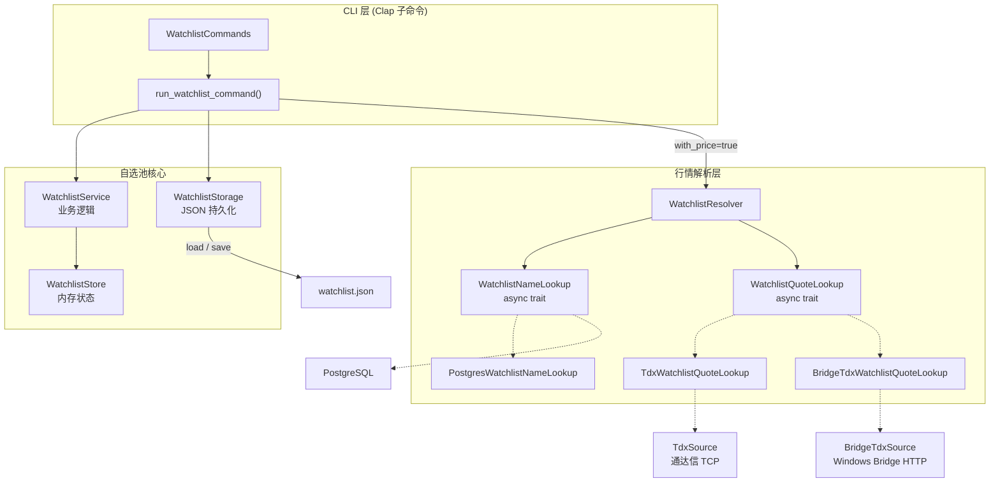
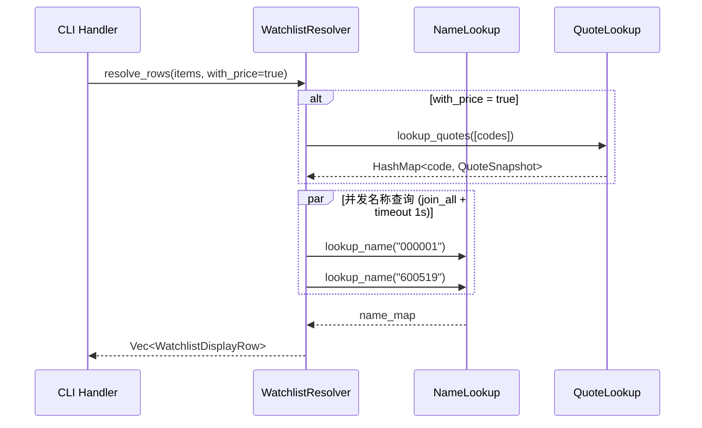

自选池（Watchlist）是 Quantix 中管理用户关注股票集合的核心模块，提供了**分组组织、标签分类、操作历史追溯**三层数据模型，以及**多源行情解析**能力，将静态的股票代码列表与动态的实时价格、名称信息组装为完整的展示行。模块采用纯内存状态 + JSON 文件持久化的轻量架构，通过 async trait 解耦行情数据源，支持通达信直连与 Windows Bridge 代理两种行情获取路径。

## 模块架构总览

自选池模块由四个子文件组成，职责边界清晰：`models.rs` 定义数据结构与常量，`storage.rs` 负责文件持久化，`service.rs` 封装全部业务逻辑，`resolver.rs` 实现异步多源行情解析。CLI 层通过 Clap 子命令定义用户接口，在 handler 中组装各层完成完整操作链路。

```
src/watchlist/
├── mod.rs         — 模块导出与 re-export 声明
├── models.rs      — WatchlistStore / WatchlistEntry / WatchlistHistoryEvent 等数据模型
├── storage.rs     — JSON 文件持久化（WatchlistStorage）
├── service.rs     — 业务逻辑层（WatchlistService）
└── resolver.rs    — 异步行情解析（WatchlistResolver + 双 trait 抽象）
```

以下 Mermaid 图展示了模块内部的核心数据流与外部依赖关系：



Sources: [mod.rs](src/watchlist/mod.rs#L1-L16), [models.rs](src/watchlist/models.rs#L1-L67), [storage.rs](src/watchlist/storage.rs#L1-L50), [service.rs](src/watchlist/service.rs#L1-L333), [resolver.rs](src/watchlist/resolver.rs#L1-L220)

## 数据模型：分组、标签与操作历史

`WatchlistStore` 是自选池的核心数据结构，采用三个 `HashMap` / `Vec` 组合实现分组-标签-历史三层语义：

| 字段 | 类型 | 用途 |
|------|------|------|
| `groups` | `HashMap<String, Vec<String>>` | 分组名 → 股票代码列表，默认包含 `"default"` 分组 |
| `entries` | `HashMap<String, WatchlistEntry>` | 股票代码 → 条目详情（标签、时间戳） |
| `history` | `Vec<WatchlistHistoryEvent>` | 变更事件日志，FIFO 淘汰，默认上限 500 条 |
| `version` | `u32` | 存储格式版本号，当前固定为 `1` |
| `default_group` | `String` | 默认分组名，固定为 `"default"` |

**分组模型**使用 `groups` 的 key 作为分组名称、value 为该分组内的股票代码有序列表。一只股票同一时刻只存在于一个分组中（`move_code` 操作先从所有分组中移除再插入目标分组），但 `entries` 以股票代码为 key 独立存储标签等元数据，因此分组归属与标签标注是两个正交维度。

**标签模型**存储在 `WatchlistEntry.tags` 中，是一个简单的 `Vec<String>`，无预定义枚举约束，允许用户自由创建任意标签文本。标签的增删通过 `add_tag` / `remove_tag` 方法实现，每次操作都会更新 `entry.updated_at` 并追加历史事件。

**操作历史**通过 `WatchlistHistoryEvent` 记录每次变更，包含时间戳、动作类型（`WatchlistAction` 枚举）、关联的股票代码、分组名和标签名。当事件数量超过 `history_limit` 时，采用 FIFO 策略从头部淘汰最旧事件，确保内存占用可控。

Sources: [models.rs](src/watchlist/models.rs#L1-L67)

### WatchlistAction 枚举与语义映射

| 枚举值 | 触发方法 | 含义 |
|--------|----------|------|
| `Add` | `service.add()` | 添加股票到指定分组 |
| `Remove` | `service.remove()` | 从自选池中彻底移除 |
| `Move` | `service.move_code()` | 在分组间迁移 |
| `TagAdd` | `service.add_tag()` | 为股票添加标签 |
| `TagRemove` | `service.remove_tag()` | 移除股票标签 |
| `GroupCreate` | `service.create_group()` | 创建新分组 |

Sources: [models.rs](src/watchlist/models.rs#L8-L17)

## 业务逻辑层：WatchlistService

`WatchlistService` 是无状态的业务逻辑层（仅持有 `history_limit` 配置），所有方法接受 `&mut WatchlistStore` 引用以完成就地变更。这种设计使得上层可以灵活控制持久化时机——在内存中完成所有变更后，再统一调用 `storage.save()` 写入文件。

### 股票代码校验

所有涉及股票代码的方法均通过内部函数 `validate_code` 进行格式校验，要求代码必须恰好 6 位纯 ASCII 数字。这一规则匹配 A 股市场标准编码格式（如 `000001`、`600519`），在业务逻辑入口处拦截无效输入。

Sources: [service.rs](src/watchlist/service.rs#L325-L332)

### 添加与移除

`add` 方法接受股票代码、可选分组名和时间戳。若未指定分组，则使用 `store.default_group`（即 `"default"`）。方法首先校验分组是否存在、代码是否重复，然后同步更新 `groups` 和 `entries` 两个 HashMap，最后追加历史事件并更新 `store.updated_at`。

`remove` 方法执行**跨分组扫描**——遍历所有分组移除匹配代码，确保即使数据出现不一致也能完整清理。移除操作同时删除 `entries` 中的对应记录。

Sources: [service.rs](src/watchlist/service.rs#L17-L88)

### 分组间移动

`move_code` 实现分组迁移的两阶段操作：先从所有分组中 `retain` 移除该代码，再插入目标分组。这一设计保证了股票在任意时刻只属于一个分组，避免了分组归属冲突。如果股票不存在或目标分组不存在，则返回错误。

Sources: [service.rs](src/watchlist/service.rs#L119-L163)

### 标签管理

标签操作（`add_tag` / `remove_tag`）仅修改 `entries` 中的 `WatchlistEntry.tags` 向量，不涉及 `groups` 结构。添加时检查标签是否已存在以防止重复，移除时通过 `retain` 过滤目标标签，若标签不存在则返回错误。

Sources: [service.rs](src/watchlist/service.rs#L165-L230)

### 列表查询与过滤

`list` 方法支持按分组和标签双重过滤：先按分组名过滤 `groups` 中的条目，再在每个条目上检查是否包含指定标签。结果按分组名 + 股票代码字典序排列，返回 `Vec<WatchlistListItem>`，每项包含 `code`、`group`、`tags` 三个字段。

Sources: [service.rs](src/watchlist/service.rs#L232-L272)

## 持久化层：JSON 文件存储

`WatchlistStorage` 提供基于 JSON 文件的持久化能力，路径通过 `CliRuntime.watchlist_path` 解析，支持三种配置方式：

| 优先级 | 配置方式 | 路径示例 |
|--------|----------|----------|
| 1 | 环境变量 `QUANTIX_WATCHLIST_PATH` | 任意绝对路径 |
| 2 | `$HOME/.quantix/watchlist/watchlist.json` | `~/.quantix/watchlist/watchlist.json` |
| 3 | 回退到 `.quantix/watchlist/watchlist.json` | 当前目录下 |

存储使用 `serde_json::to_string_pretty` 进行序列化，保持 JSON 文件的可读性。`load_or_create` 方法在文件不存在时自动创建默认空存储（包含 `"default"` 空分组），并自动创建缺失的父目录——`save` 方法通过 `fs::create_dir_all` 确保路径存在。

Sources: [storage.rs](src/watchlist/storage.rs#L1-L50), [runtime.rs](src/core/runtime.rs#L10-L11), [runtime.rs](src/core/runtime.rs#L127-L140)

## 多源行情解析：WatchlistResolver

行情解析是自选池模块中最具架构复杂度的部分。`WatchlistResolver` 通过两个 async trait 实现数据源解耦：

- **`WatchlistNameLookup`**：根据股票代码查询股票名称（如 `000001` → `"平安银行"`）
- **`WatchlistQuoteLookup`**：批量查询股票实时行情快照（最新价、涨跌幅）



### 优雅降级机制

`resolve_rows` 方法内置了多级降级策略，确保在任何数据源不可用时仍能返回基本结果：

1. **行情源失败**：`lookup_quotes` 返回 `Err` 时，通过 `unwrap_or_default()` 降级为空的 `HashMap`，所有股票的 `latest_price` 和 `price_change_pct` 均为 `None`
2. **名称查询超时**：每个名称查询包裹在 1 秒 `timeout` 中，超时或失败时返回 `None`，名称列显示为 `"-"`
3. **部分数据缺失**：当行情源返回的 `HashMap` 中缺少某只股票的数据时，该股票的价格字段为 `None`，不影响其他股票的正常展示

Sources: [resolver.rs](src/watchlist/resolver.rs#L59-L108)

### 行情数据源实现

系统提供了两个 `WatchlistQuoteLookup` 实现，对应不同的运行环境：

| 实现 | 数据源 | 适用场景 |
|------|--------|----------|
| `TdxWatchlistQuoteLookup` | 通达信 TCP 直连 | Linux 原生环境 |
| `BridgeTdxWatchlistQuoteLookup` | Windows Bridge HTTP API | WSL2 环境，通过 Bridge 代理访问通达信 |

两个实现均通过 `infer_market` 函数根据股票代码首位字符推断市场标识（`6` 开头 → 上海市场 `1`，其他 → 深圳市场 `0`），然后调用对应数据源的 `fetch_quotes_batch` 方法批量获取行情，并将 `f64` 价格转换为 `Decimal` 以保证精度。

名称查询方面，`PostgresWatchlistNameLookup` 通过环境变量 `POSTGRES_URL` 连接 PostgreSQL 数据库查询 `stock_info` 表。若未配置该环境变量，则直接返回 `None`，不影响自选池的基本功能。

Sources: [resolver.rs](src/watchlist/resolver.rs#L110-L220)

### WatchlistDisplayRow 最终组装

`WatchlistDisplayRow` 是面向展示层的聚合数据结构，将分组、标签、名称、价格合并为一行完整信息：

| 字段 | 来源 | 说明 |
|------|------|------|
| `code` | `WatchlistListItem.code` | 股票代码 |
| `name` | `WatchlistNameLookup` | 股票名称，可能为 `None` |
| `group` | `WatchlistListItem.group` | 所属分组 |
| `tags` | `WatchlistListItem.tags` | 标签列表 |
| `latest_price` | `WatchlistQuoteSnapshot` | 最新价格 |
| `price_change_pct` | `WatchlistQuoteSnapshot` | 涨跌幅百分比 |

Sources: [resolver.rs](src/watchlist/resolver.rs#L14-L28)

## CLI 命令体系

自选池通过 `quantix watchlist` 子命令对外暴露完整功能，命令结构如下：

```
quantix watchlist
├── add          --code <CODE> [--group <GROUP>]
├── remove       --code <CODE>
├── list         [--group <GROUP>] [--tag <TAG>] [--with-price]
├── move         --code <CODE> --group <GROUP>
├── group
│   ├── create   --name <NAME>
│   └── list
├── tag
│   ├── add      --code <CODE> --tag <TAG>
│   ├── remove   --code <CODE> --tag <TAG>
│   └── list     --code <CODE>
└── history      [--code <CODE>] [--limit <N>]
```

### 命令处理流程

每个写操作命令的处理流程遵循统一的 **加载→变更→持久化** 三步模式：

1. 通过 `create_watchlist_storage()` 获取 `WatchlistStorage` 实例（路径来自 `CliRuntime`）
2. 调用 `storage.load_or_create()` 获取或创建 `WatchlistStore`
3. 调用 `WatchlistService` 的对应方法执行业务逻辑
4. 调用 `storage.save()` 将变更后的 store 写回文件

读操作（`list`、`group list`、`tag list`、`history`）则通过 `load_watchlist_store_for_read` 加载，该函数在文件不存在时返回默认空 store，不触发文件创建。

### 行情增强列表

当 `list` 命令携带 `--with-price` 标志时，handler 会实例化 `WatchlistResolver`，注入 `PostgresWatchlistNameLookup` 和 `TdxWatchlistQuoteLookup`，调用 `resolve_rows` 获取增强后的展示行。输出格式从基础的三列表（代码、分组、标签）扩展为六列表（代码、名称、分组、标签、最新价、涨跌幅），缺失数据以 `"-"` 填充。

Sources: [market.rs](src/cli/commands/market.rs#L90-L199), [handlers/mod.rs](src/cli/handlers/mod.rs#L4701-L4998)

## 与监控系统的集成

自选池模块通过 `MonitorWatchlistReader` trait 与 [监控系统](26-monitor-fu-wu-jie-ge-gao-jing-shi-jian-cun-chu-yu-systemd-ji-cheng) 集成。该 trait 定义了 `list_items() -> Result<Vec<WatchlistListItem>>` 方法，由监控服务的 `MonitorService` 消费，用于加载自选池快照并结合实时行情触发价格告警。

`MonitorService` 在 `load_watchlist_snapshot` 方法中依次调用 `watchlist_reader.list_items()` 获取自选池列表、`quote_reader.load_quotes()` 批量查询行情、`alert_store.list_alerts()` 获取告警规则，然后将三者组装为 `MonitorWatchlistSnapshot`，其中包含每只股票的快照行、已触发的告警列表和警告信息。

Sources: [service.rs](src/monitor/service.rs#L1-L121), [models.rs](src/monitor/models.rs#L89-L94)

## 设计要点总结

| 设计决策 | 实现方式 | 优势 |
|----------|----------|------|
| 无状态 Service | 所有方法接受 `&mut WatchlistStore` | 上层可灵活控制事务与持久化时机 |
| 分组与标签正交 | `groups` HashMap + `entries` HashMap | 一只股票一个分组，但可拥有多个自由标签 |
| async trait 解耦 | `WatchlistNameLookup` / `WatchlistQuoteLookup` | 行情源可替换，测试可 mock |
| 超时降级 | 名称查询 1s timeout，行情失败返回空 | 数据源不可用时仍能展示基本列表 |
| FIFO 历史淘汰 | `history_limit` 默认 500 | 防止历史无限增长 |
| JSON 文件持久化 | `serde_json` pretty format | 可读、可手动编辑、无外部依赖 |

### 推荐阅读

- 如果想了解行情数据的底层采集机制，请参阅 [多数据源适配器（TDX / AkShare / 东方财富 / WebSocket）](7-duo-shu-ju-yuan-gua-pei-qi-tdx-akshare-dong-fang-cai-fu-websocket)
- 如果想了解自选池如何参与监控告警循环，请参阅 [Monitor 服务：价格告警、事件存储与 systemd 集成](26-monitor-fu-wu-jie-ge-gao-jing-shi-jian-cun-chu-yu-systemd-ji-cheng)
- 如果想了解 Windows Bridge 代理的完整架构，请参阅 [Windows Bridge 架构：WSL2 与通达信/QMT 数据桥接](27-windows-bridge-jia-gou-wsl2-yu-tong-da-xin-qmt-shu-ju-qiao-jie)