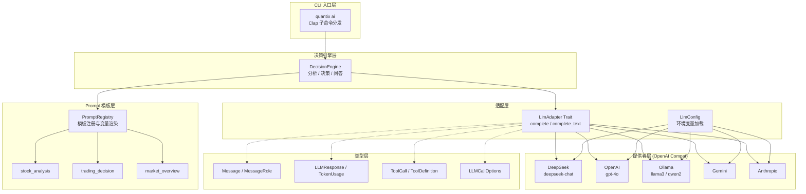
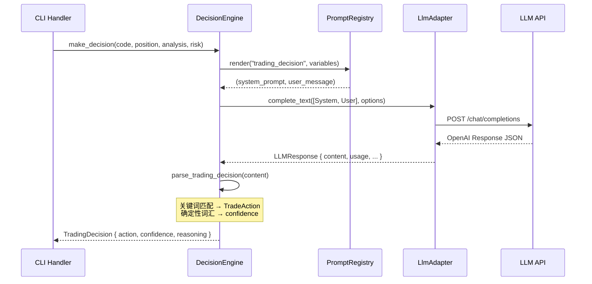

Quantix 的 AI 决策引擎是一个基于大语言模型（LLM）的量化交易辅助分析系统。它采用 **适配器模式（Adapter Pattern）** 统一封装了 DeepSeek、OpenAI、Anthropic、Gemini、Ollama 五种 LLM 提供商，通过一套标准化的 `LlmAdapter` trait 接口对外提供文本补全、股票分析、交易决策等能力，并将 Prompt 模板管理、对话上下文建模、工具调用（Function Calling）等机制封装为可组合的内部组件。整个模块位于 `src/ai/` 目录下，通过 `quantix ai` 子命令族对外暴露 CLI 交互入口。

Sources: [mod.rs](src/ai/mod.rs#L1-L22)

## 模块架构总览

AI 决策引擎的内部结构遵循清晰的分层原则：**类型层**定义统一数据结构，**适配层**抽象 LLM 调用接口，**提供者层**实现具体 API 对接，**模板层**管理 Prompt 渲染，**决策层**编排高层业务逻辑。下方的架构图展示了这些层次之间的调用关系与数据流方向。



Sources: [mod.rs](src/ai/mod.rs#L1-L22), [handlers/mod.rs](src/cli/handlers/mod.rs#L106-L127)

## 核心类型体系

### 消息与对话模型

AI 模块的类型体系围绕 **对话（Conversation）** 概念构建。`Message` 结构体是所有 LLM 交互的基本单元，它携带 `role`（角色）、`content`（内容）、`tool_calls`（工具调用）和 `reasoning_content`（推理链）四个核心字段。`MessageRole` 枚举定义了四种角色类型：`System`（系统指令）、`User`（用户输入）、`Assistant`（模型回复）、`Tool`（工具返回），这与 OpenAI Chat Completions API 的消息模型完全对齐。每个 `Message` 提供了语义化的构造方法（`Message::system()`、`Message::user()`、`Message::assistant()`、`Message::tool_response()`），使得构建多轮对话的代码具有高可读性。

Sources: [types.rs](src/ai/types.rs#L60-L143)

### 统一响应结构

**`LLMResponse`** 是所有 LLM 提供商返回值的归一化封装。无论底层调用的是 DeepSeek、OpenAI 还是 Ollama，上层代码始终操作同一套响应结构：`content` 字段承载文本回复，`tool_calls` 向量收集模型发起的函数调用请求，`reasoning_content` 保留思维链模型（如 DeepSeek-R1）的推理过程，`usage` 记录 token 消耗统计，`provider` 和 `model` 标记实际使用的后端。这种设计确保了提供者切换的透明性——调用方无需关心底层差异。

Sources: [types.rs](src/ai/types.rs#L22-L50)

### 工具调用定义

`ToolDefinition` 结构体封装了 LLM Function Calling 的元信息，包含工具名称（`name`）、描述文本（`description`）和 JSON Schema 格式的参数定义（`parameters`）。当模型返回 `ToolCall` 时，调用方可以根据 `id` 追踪调用链路，根据 `name` 分发到对应的执行逻辑，根据 `arguments` 解析入参。`thought_signature` 字段为推理型模型保留了思维签名，允许在复杂决策场景中记录模型的决策依据。

Sources: [types.rs](src/ai/types.rs#L7-L19), [types.rs](src/ai/types.rs#L146-L169)

### 提供商枚举

`LLMProvider` 枚举定义了系统支持的六种提供商标识：`OpenAI`、`DeepSeek`、`Gemini`、`Anthropic`、`Ollama`、`Custom`。该枚举实现了 `Display` 和 `FromStr` trait，支持字符串双向转换，且 `FromStr` 实现中包含别名映射（如 `"gpt"` → `OpenAI`、`"claude"` → `Anthropic`、`"local"` → `Ollama`），提升了配置文件的容错性。

Sources: [types.rs](src/ai/types.rs#L207-L246)

## LLM 适配器：统一接口与多提供者实现

### LlmAdapter Trait

`LlmAdapter` trait 是整个 AI 模块的核心抽象。它使用 `async_trait` 宏定义了异步接口，要求实现者提供三个方法：`provider()` 返回提供商标识，`is_available()` 检查凭证是否就绪，`complete()` 发送带可选工具的补全请求。trait 还提供了 `complete_text()` 默认方法，作为无工具场景的快捷入口——其实现直接委托给 `complete()` 并传入空工具列表。`Send + Sync` 约束确保适配器可以安全地跨线程使用，满足 Tokio 异步运行时的要求。

Sources: [adapter.rs](src/ai/adapter.rs#L1-L36)

### LlmConfig 配置加载

**`LlmConfig`** 是 LLM 调用的全局配置中心，其加载策略采用 **环境变量优先** 原则。`from_env()` 方法依次读取 `LLM_DEFAULT_MODEL`、`LLM_FALLBACK_MODELS`、`LLM_TEMPERATURE`、`LLM_MAX_TOKENS` 等变量构建基础配置，随后调用 `load_provider_configs()` 扫描五个提供商的 API Key 环境变量（`DEEPSEEK_API_KEY`、`OPENAI_API_KEY`、`GEMINI_API_KEY`、`ANTHROPIC_API_KEY`、`OLLAMA_API_BASE`/`OLLAMA_HOST`），为每个已配置的提供商创建 `ProviderConfig` 实例并注册到 `providers` HashMap 中。这种 **按需注册** 的设计意味着系统仅激活用户实际配置的提供商，避免了无效 API 调用。

`ProviderConfig` 结构体存储了每个提供商的三项关键信息：`api_key`（认证凭证，Ollama 本地部署时为 `None`）、`base_url`（API 端点，支持自定义代理）、`models`（该提供商下可用的模型名称列表）。

Sources: [adapter.rs](src/ai/adapter.rs#L38-L214)

### OpenAI Compat 适配器

系统采用 **"一套实现，多种配置"** 的策略：`OpenAICompatAdapter` 是唯一的 `LlmAdapter` 实现类型，它通过工厂方法（`deepseek()`、`openai()`、`ollama()`、`custom()`）为不同提供商创建不同配置的实例。每个实例内嵌一个 `reqwest::Client`，以提供商特定的 `base_url` 和 `api_key` 发起 HTTP POST 请求到 `/chat/completions` 端点。这种设计的可行性基于一个关键事实：**主流 LLM 提供商（DeepSeek、Ollama 等）均兼容 OpenAI Chat Completions API 格式**，因此无需为每个提供商编写独立的协议层。

`complete()` 方法的执行流程如下：(1) 将 `Message` 数组转换为 `OpenAIMessage` 格式；(2) 将 `ToolDefinition` 数组转换为 `OpenAITool` 格式；(3) 构建 JSON 请求体，包含 `model`、`messages`、`temperature`、可选的 `max_tokens` 和 `tools`；(4) 通过 `get_thinking_extra()` 检测模型是否需要额外的 thinking 模式参数（如 `deepseek-chat` 需要 `{"thinking": {"type": "enabled"}}`，而 `deepseek-reasoner` 和 `qwq` 等推理模型自动启用，无需额外参数）；(5) 发送请求并解析 `OpenAIResponse`；(6) 将响应中的 `content`、`tool_calls`、`usage` 字段映射为统一的 `LLMResponse`。

Sources: [openai_compat.rs](src/ai/providers/openai_compat.rs#L1-L316)

### 多提供者对比

| 提供商 | 认证方式 | 默认 Base URL | 默认模型 | 思维链支持 | 部署模式 |
|--------|---------|-------------|---------|----------|---------|
| **DeepSeek** | API Key | `https://api.deepseek.com/v1` | `deepseek-chat` | ✅ 自动检测 | 云端 |
| **OpenAI** | API Key | `https://api.openai.com/v1` | `gpt-4o` | ❌ | 云端 |
| **Ollama** | 无需认证 | `http://localhost:11434/v1` | `llama3` | ❌ | 本地 |
| **Gemini** | API Key | Google AI 端点 | `gemini-2.5-flash` | ❌ | 云端 |
| **Anthropic** | API Key | Anthropic 端点 | `claude-3-5-sonnet-latest` | ❌ | 云端 |

Sources: [adapter.rs](src/ai/adapter.rs#L122-L188), [config/ai.toml](config/ai.toml#L1-L72)

## Prompt 模板系统

### 模板注册与渲染机制

**`PromptRegistry`** 是模板系统的核心容器，内部维护一个 `HashMap<String, PromptTemplate>` 映射。系统启动时通过 `register_defaults()` 方法注册三套内置模板，每套模板包含 `system_prompt`（系统指令）和 `user_template`（用户消息模板）两部分，其中用户模板使用 `{{variable_name}}` 占位符语法标记变量位置。模板文件通过 `include_str!` 宏在编译时嵌入二进制，避免了运行时文件依赖。

渲染时调用 `render(name, variables)` 方法，内部执行简单的字符串替换：遍历 `variables` HashMap，将模板中的 `{{key}}` 替换为对应的 value。如果模板名不存在，`DecisionEngine` 会提供内联的 Fallback 模板，确保即使模板文件缺失也能正常工作。

Sources: [prompt.rs](src/ai/prompt.rs#L1-L132)

### 内置模板详解

系统预置了三套面向 A 股量化交易场景的 Prompt 模板：

| 模板名称 | 用途 | 系统指令核心 | 所需变量 |
|---------|------|------------|---------|
| **stock_analysis** | 个股技术分析 | A 股量化分析师角色，覆盖技术面/基本面/量化策略 | `code`, `name`, `price_data`, `indicators`, `news` |
| **trading_decision** | 交易决策生成 | 量化交易决策助手，定义买入/卖出/持有规则 | `code`, `current_position`, `analysis`, `risk_level` |
| **market_overview** | 市场复盘展望 | A 股市场分析师，覆盖大盘/板块/北向资金/情绪 | `date`, `index_data`, `sector_performance`, `north_flow` |

**stock_analysis** 模板的系统指令明确定位为"专业 A 股量化分析师"，要求输出包含技术面分析、风险提示和操作建议，同时约束"不给出具体买入/卖出价位"和"不构成投资建议"。用户模板以结构化 Markdown 格式组织股票代码、价格数据、技术指标和相关新闻四个数据区域。

**trading_decision** 模板定义了三条决策规则：买入条件为"技术面转强 + 风险可控"，卖出条件为"技术面转弱或达到止损/止盈位"，持有条件为"信号不明确或趋势未变"。输出格式要求包含决策（买入/卖出/持有）、置信度（高/中/低）和理由。

Sources: [stock_analysis_system.md](src/ai/templates/stock_analysis_system.md#L1-L16), [decision_system.md](src/ai/templates/decision_system.md#L1-L12), [market_overview_system.md](src/ai/templates/market_overview_system.md#L1-L13)

## DecisionEngine：决策编排核心

### 引擎结构

**`DecisionEngine`** 是 AI 模块对外暴露的高层业务接口。它组合了三个内部组件：一个 `Box<dyn LlmAdapter>`（LLM 适配器实例）、一个 `PromptRegistry`（模板注册表）、一个 `DecisionEngineConfig`（引擎配置，包含最大重试次数 `max_retries`、超时时间 `timeout_secs`、思维链开关 `enable_thinking`）。通过构造函数 `new()` 或 `with_config()` 创建实例，前者使用默认配置（3 次重试、120 秒超时、启用思维链），后者允许自定义。

Sources: [decision.rs](src/ai/decision.rs#L34-L63)

### 三大核心能力

**1. 股票分析（`analyze_stock`）**：接收股票代码、名称、价格数据、技术指标和可选新闻，构造变量映射并调用 `PromptRegistry::render("stock_analysis", ...)` 渲染模板，随后通过 `adapter.complete_text()` 发送请求，返回 `DecisionResult`（包含分析文本、推理链、模型名称和 token 用量）。

**2. 交易决策（`make_decision`）**：接收股票代码、当前持仓、分析结果和风险等级，渲染 `trading_decision` 模板后调用 LLM，再通过 `parse_trading_decision()` 函数从回复文本中提取结构化决策。该解析器采用 **关键词匹配** 策略：检测"买入"/"buy"映射为 `TradeAction::Buy`，"卖出"/"sell"映射为 `TradeAction::Sell`，其余为 `Hold`；置信度则根据确定性词汇（"强烈"/"非常" → 85%，"建议"/"recommend" → 70%，"可能"/"might" → 50%，默认 60%）估算。

**3. 自由问答（`chat`）**：最简化的接口，接收用户问题和可选系统指令，构造消息列表后直接调用 `complete_text()`，返回纯文本响应。

Sources: [decision.rs](src/ai/decision.rs#L65-L180)

### 决策数据流



Sources: [decision.rs](src/ai/decision.rs#L114-L160)

## CLI 命令体系

### 五个子命令

AI 模块通过 `quantix ai` 命令暴露五个子命令，每个子命令对应一个独立的异步处理函数，统一定义在 `src/cli/commands/info.rs` 的 `AiCommands` 枚举中：

| 子命令 | 参数 | 功能 | 底层方法 |
|-------|------|------|---------|
| `ai analyze` | `--code`, `--model`, `--with-news` | 股票技术分析 | `DecisionEngine::analyze_stock()` |
| `ai decide` | `--code`, `--position`, `--risk` | 交易决策建议 | `DecisionEngine::make_decision()` |
| `ai ask` | `--question`, `--code`, `--model` | 自由问答 | `DecisionEngine::chat()` |
| `ai market` | `--date` | 市场整体复盘 | `DecisionEngine::chat()` |
| `ai config` | `--show`, `--test` | 配置查看与连通性测试 | `LlmConfig::from_env()` |

Sources: [info.rs](src/cli/commands/info.rs#L47-L110)

### 提供商选择优先级

所有 CLI 处理函数共享同一套提供商选择逻辑，优先级为 **DeepSeek → OpenAI → Ollama**。选择流程为：首先调用 `LlmConfig::from_env()` 加载配置，检查 `has_any_provider()` 是否有可用提供商；若无可提示用户配置环境变量；若有则按优先级依次检查 `config.get_provider("deepseek")`、`config.get_provider("openai")`、`config.get_provider("ollama")`，创建第一个命中的 `OpenAICompatAdapter` 实例并包装为 `Box<dyn LlmAdapter>`，注入 `DecisionEngine` 使用。

`ai config` 命令提供两种操作模式：`--show` 展示当前配置详情（默认模型、温度、最大 token、已配置提供商及模型列表），`--test` 逐一测试各提供商的连通性。不带参数运行时仅输出配置状态摘要。

Sources: [handlers/ai.rs](src/cli/handlers/ai.rs#L1-L286)

## 配置体系

AI 决策引擎的配置采用 **环境变量 + TOML 文件** 双轨制。运行时配置通过 `LlmConfig::from_env()` 从环境变量加载（用于实际 API 调用），声明式配置通过 `config/ai.toml` 描述各提供商的默认参数和决策引擎设置。

环境变量命名遵循 `{PROVIDER}_API_KEY` 和 `{PROVIDER}_BASE_URL` 模式，所有支持的环境变量如下：

| 环境变量 | 用途 | 示例值 |
|---------|------|-------|
| `LLM_PROVIDER` | 默认提供商标识 | `deepseek` |
| `LLM_DEFAULT_MODEL` | 默认模型名 | `deepseek-chat` |
| `LLM_FALLBACK_MODELS` | 回退模型列表（逗号分隔） | `gpt-4o,qwen2` |
| `LLM_TEMPERATURE` | 采样温度 | `0.7` |
| `LLM_MAX_TOKENS` | 最大生成 token 数 | `4096` |
| `DEEPSEEK_API_KEY` | DeepSeek 认证 | `sk-xxx` |
| `DEEPSEEK_BASE_URL` | DeepSeek 自定义端点 | `https://api.deepseek.com` |
| `OPENAI_API_KEY` | OpenAI 认证 | `sk-xxx` |
| `OPENAI_BASE_URL` | OpenAI 自定义端点 | `https://api.openai.com/v1` |
| `ANTHROPIC_API_KEY` | Anthropic 认证 | `sk-ant-xxx` |
| `GOOGLE_API_KEY` | Gemini 认证 | `AIza...` |
| `OLLAMA_API_BASE` / `OLLAMA_HOST` | Ollama 地址 | `http://localhost:11434` |

Sources: [adapter.rs](src/ai/adapter.rs#L83-L188), [.env.example](.env.example#L67-L91), [config/ai.toml](config/ai.toml#L1-L72)

## 文件结构一览

```
src/ai/
├── mod.rs                          # 模块声明与公共 re-export
├── types.rs                        # 核心类型：Message, LLMResponse, ToolCall, LLMProvider 等
├── adapter.rs                      # LlmAdapter trait, LlmConfig, ProviderConfig
├── providers.rs                    # 提供者模块入口
├── providers/
│   └── openai_compat.rs            # OpenAI 兼容适配器（统一实现）
├── prompt.rs                       # PromptRegistry, PromptTemplate, 变量渲染
├── decision.rs                     # DecisionEngine, DecisionResult, TradingDecision, TradeAction
└── templates/
    ├── stock_analysis_system.md    # 股票分析 - 系统指令
    ├── stock_analysis_user.md      # 股票分析 - 用户模板
    ├── decision_system.md          # 交易决策 - 系统指令
    ├── decision_user.md            # 交易决策 - 用户模板
    ├── market_overview_system.md   # 市场复盘 - 系统指令
    └── market_overview_user.md     # 市场复盘 - 用户模板
```

Sources: [mod.rs](src/ai/mod.rs#L1-L22)

## 延伸阅读

- **[新闻搜索模块：多源聚合、Fallback 策略与缓存](23-xin-wen-sou-suo-mo-kuai-duo-yuan-ju-he-fallback-ce-lue-yu-huan-cun)** — 新闻数据如何作为 `analyze_stock` 的输入源之一参与 AI 分析
- **[风控服务：规则引擎、行业集中度与波动率检查](16-feng-kong-fu-wu-gui-ze-yin-qing-xing-ye-ji-zhong-du-yu-bo-dong-lu-jian-cha)** — 风险等级 `risk_level` 参数如何由风控服务生成并传递给 `make_decision`
- **[市场分析服务：板块排名、北向资金、龙头股与情绪指数](19-shi-chang-fen-xi-fu-wu-ban-kuai-pai-ming-bei-xiang-zi-jin-long-tou-gu-yu-qing-xu-zhi-shu)** — `market_overview` 模板所需的指数数据和北向资金由该服务提供
- **[CLI 命令体系与 Clap 子命令分发](6-cli-ming-ling-ti-xi-yu-clap-zi-ming-ling-fen-fa)** — `quantix ai` 子命令如何注册到 Clap 命令树中