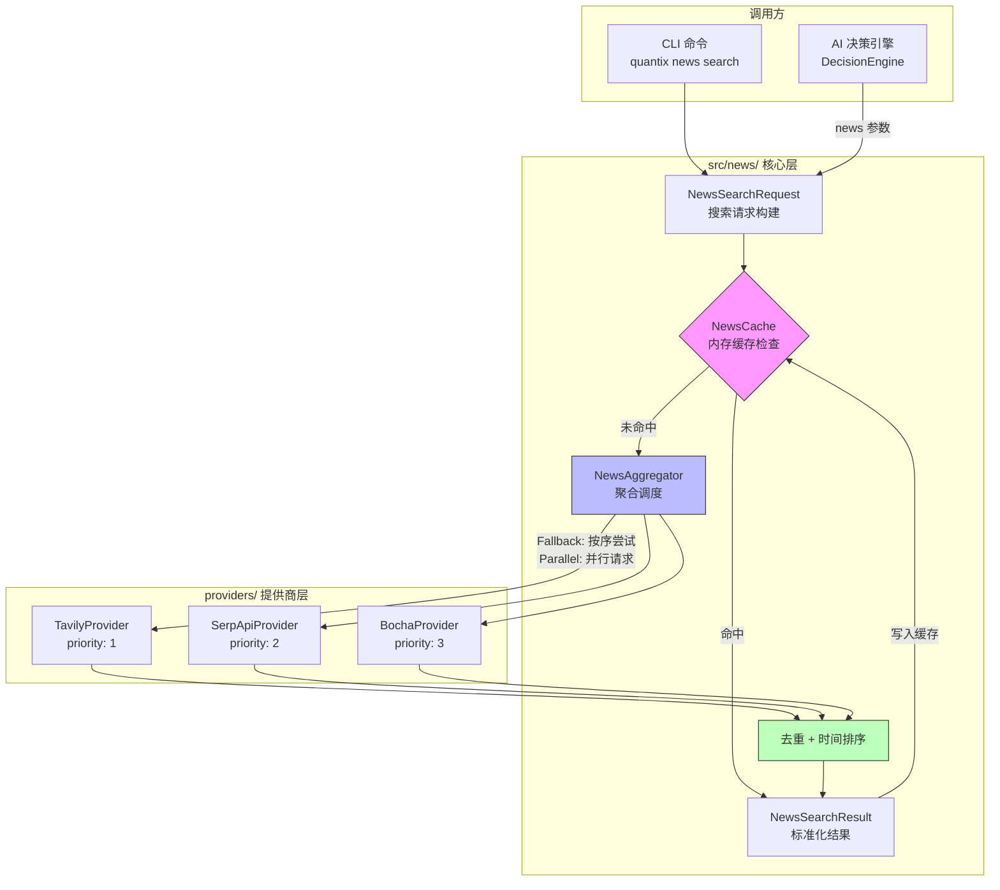
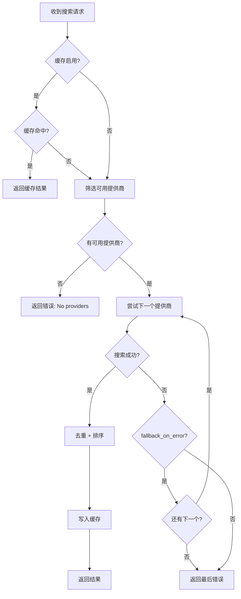

Quantix 的新闻搜索模块为股票分析提供**多源聚合**的外部新闻数据能力。该模块围绕一个核心设计理念构建：**任何单一新闻源都可能不可用，但系统必须始终尝试返回有意义的结果**。为此，模块采用 **Provider Trait 抽象 → Aggregator 聚合调度 → Cache 缓存加速** 的三层架构，将 Tavily、SerpAPI、博查（Bocha）三个异构新闻 API 统一封装为可插拔的提供商，通过优先级排序的 Fallback 策略和可选的并行搜索模式保证数据获取的鲁棒性，最终以 URL + 标题双重去重和按时间排序的方式向下游（尤其是 [AI 决策引擎](22-ai-jue-ce-yin-qing-llm-duo-mo-xing-gua-pei-yu-jue-ce-yi-biao-pan)）交付标准化的 `NewsSearchResult`。

Sources: [mod.rs](src/news/mod.rs#L1-L15), [lib.rs](src/lib.rs#L16-L33)

## 模块架构总览

新闻模块位于 `src/news/` 目录下，由 6 个文件和 3 个提供商实现组成。模块对外暴露的核心类型通过 `mod.rs` 统一 re-export：`NewsAggregator`（聚合器）、`NewsCache`（缓存）、`NewsProvider`（提供商 Trait）、以及 `NewsArticle` / `NewsSearchRequest` / `NewsSearchResult` 等数据类型。

```
src/news/
├── mod.rs              # 模块入口，统一 re-export
├── types.rs            # 核心数据结构定义
├── provider.rs         # NewsProvider / NewsProviderBuilder Trait
├── aggregator.rs       # NewsAggregator 聚合器（Fallback + 并行）
├── cache.rs            # NewsCache 内存缓存
└── providers/          # 三个具体提供商实现
    ├── mod.rs
    ├── tavily.rs       # Tavily（优先级 1）
    ├── serpapi.rs      # SerpAPI（优先级 2）
    └── bocha.rs        # 博查（优先级 3）
```

Sources: [mod.rs](src/news/mod.rs#L1-L15)

### 架构关系图

下面的 Mermaid 图展示了新闻模块的完整数据流——从 CLI 命令触发，经过缓存检查，到提供商调度（Fallback 或并行），最终到去重排序输出的全过程。在阅读此图之前，需要理解两个关键概念：**Fallback 模式**指按优先级顺序逐个尝试提供商，首个成功即返回；**并行模式**指同时向所有可用提供商发起请求，合并结果。



Sources: [aggregator.rs](src/news/aggregator.rs#L57-L148), [cache.rs](src/news/cache.rs#L1-L122), [providers/mod.rs](src/news/providers/mod.rs#L1-L12)

## 核心数据类型

新闻模块的所有数据流转都围绕四个核心结构体展开，定义在 `types.rs` 中。这些类型均实现了 `Serialize` / `Deserialize`，可以直接序列化为 JSON 供 API 或存储使用。

### NewsArticle — 新闻文章

`NewsArticle` 是新闻数据的原子单位，包含标题、链接、来源、发布时间、摘要、正文、关联股票代码、标签、情感得分等字段。它采用**建造者模式**（Builder Pattern），通过 `with_code()` 和 `with_tag()` 等方法实现链式调用：

```rust
let article = NewsArticle::new("标题".into(), "https://...".into(), "tavily".into())
    .with_code("000001")
    .with_tag("金融");
```

其中 `sentiment` 字段取值范围为 `-1.0`（极度悲观）到 `1.0`（极度乐观），Tavily 提供商会将其返回的相关性得分（`score`）映射到此字段。

Sources: [types.rs](src/news/types.rs#L8-L67)

### NewsSearchRequest — 搜索请求

`NewsSearchRequest` 封装了搜索的所有参数，包含合理的默认值：时间范围默认 3 天，最大结果数默认 20 条，语言默认中文。`provider` 字段为 `Option<String>`，当设为 `None` 时聚合器会尝试所有已启用的提供商；当指定具体名称（如 `"tavily"`）时则只使用该提供商。

| 字段 | 类型 | 默认值 | 说明 |
|------|------|--------|------|
| `query` | `String` | 空 | 搜索关键词（必填） |
| `codes` | `Vec<String>` | `[]` | 关联股票代码列表 |
| `days` | `u32` | `3` | 时间范围（天数） |
| `max_results` | `usize` | `20` | 最大返回条数 |
| `provider` | `Option<String>` | `None` | 指定提供商（None = 全部） |
| `language` | `Option<String>` | `"zh"` | 搜索语言 |
| `include_content` | `bool` | `false` | 是否包含正文 |

Sources: [types.rs](src/news/types.rs#L69-L128)

### NewsSearchResult — 搜索结果

搜索结果携带文章列表和元数据。其中 `from_cache` 标识结果是否来自缓存，`elapsed_ms` 记录实际耗时，`provider` 记录数据来源（并行模式下为逗号分隔的多个提供商名称）。

Sources: [types.rs](src/news/types.rs#L130-L172)

### NewsProviderConfig — 提供商配置

每个提供商的配置通过 `NewsProviderConfig` 描述，支持 API Key 环境变量映射、Base URL 自定义、请求超时和每日限额等。`priority` 字段是一个 `u8` 值，**数值越小优先级越高**。

Sources: [types.rs](src/news/types.rs#L174-L253)

## NewsProvider Trait — 统一接口抽象

`provider.rs` 定义了两个核心 Trait，建立了新闻模块的**扩展契约**：

**`NewsProvider`**（异步 Trait）是所有新闻源必须实现的核心接口，要求实现 `name()`、`search()` 和 `config()` 三个方法。它还提供了 `search_by_code()` 的默认实现——将股票代码转换为搜索请求的便捷方法，以及 `is_available()` 和 `remaining_quota()` 的默认实现。

**`NewsProviderBuilder`** 是工厂 Trait，负责从 `NewsProviderConfig` 构建具体的提供商实例，其 `validate_config()` 默认检查 `enabled == true && api_key.is_some()`。

```rust
#[async_trait]
pub trait NewsProvider: Send + Sync {
    fn name(&self) -> &'static str;
    async fn search(&self, request: &NewsSearchRequest) -> Result<NewsSearchResult>;
    fn is_available(&self) -> bool { true }
    fn config(&self) -> &NewsProviderConfig;
    fn remaining_quota(&self) -> Option<u32> { None }
}
```

所有 Trait 方法都要求 `Send + Sync`，确保可以安全地在异步运行时中跨线程共享。

Sources: [provider.rs](src/news/provider.rs#L1-L61)

## 三个新闻提供商实现

模块内置三个新闻搜索提供商，各自对接不同的外部 API。它们的结构高度一致：持有 `NewsProviderConfig` 和 `reqwest::Client`，从环境变量读取 API Key，将外部 API 的响应格式转换为标准的 `NewsArticle` 列表。

### 提供商对比

| 特性 | Tavily | SerpAPI | 博查（Bocha） |
|------|--------|---------|--------------|
| **优先级** | 1（最高） | 2 | 3（最低） |
| **定位** | AI 友好的搜索 API | Google 搜索结果 API | 中文优化的新闻搜索 |
| **Base URL** | `https://api.tavily.com` | `https://serpapi.com` | `https://api.bocha.io` |
| **请求方式** | POST（JSON Body） | GET（Query Params） | GET（Query Params） |
| **API Key 环境变量** | `TAVILY_API_KEY` | `SERPAPI_API_KEY` | `BOCHA_API_KEY` |
| **特色能力** | 支持 AI 摘要答案、相关性得分 | Google News 引擎、缩略图 | 原生中文分词、发布时间 |
| **HTTP 方法** | POST `/search` | GET `/search` | GET `/news/search` |

### Tavily 提供商（优先级 1）

Tavily 是推荐的默认提供商，定位于 AI 友好的搜索 API。它的请求体结构最为丰富，支持 `search_depth`（basic / advanced）、`include_answer`（AI 生成的摘要答案）、`include_raw_content`（原始 HTML）等参数。在响应映射中，Tavily 的 `score` 字段被映射为 `NewsArticle.sentiment`，`content` 映射为摘要，`raw_content` 映射为正文。

Sources: [tavily.rs](src/news/providers/tavily.rs#L1-L176)

### SerpAPI 提供商（优先级 2）

SerpAPI 封装了 Google 搜索能力，使用 `engine=google_news` 参数专门搜索新闻。它的独特之处在于：当 `request.codes` 非空时，会自动将股票代码拼接到查询词后面（`format!("{} {}", query, codes.join(" "))`），提高搜索精准度。响应中的 `thumbnail` 字段映射到 `NewsArticle.image_url`。

Sources: [serpapi.rs](src/news/providers/serpapi.rs#L1-L161)

### 博查提供商（优先级 3）

博查是专为中文场景优化的新闻搜索 API，其响应结构采用嵌套的 `code` / `message` / `data.list` 模式，需要先检查 `code != 0` 的错误条件。博查提供商强制设置 `language = "zh"`，在中文 A 股场景下通常能返回更相关的结果。

Sources: [bocha.rs](src/news/providers/bocha.rs#L1-L176)

## NewsAggregator — 聚合调度与 Fallback 策略

`NewsAggregator` 是整个新闻模块的调度中枢，管理一个 `Vec<Box<dyn NewsProvider>>` 提供商列表和可选的 `Arc<NewsCache>` 缓存实例。它提供两种搜索模式：**串行 Fallback** 和 **并行聚合**。

### Fallback 串行模式（`search`）

这是默认的搜索模式，核心逻辑如下：

1. **缓存检查**：若缓存启用且命中有效条目，直接返回 `from_cache = true` 的结果
2. **提供商筛选**：过滤出 `is_available()` 为 true 且在 `enabled_providers` 列表中的提供商；若请求指定了 `provider`，则只保留匹配的那一个
3. **逐个尝试**：按 providers Vec 中的顺序依次调用 `search()`，**首个成功即返回**
4. **失败传播**：若当前提供商失败且 `fallback_on_error == true`，记录警告日志并尝试下一个；若 `fallback_on_error == false`，立即返回错误
5. **去重排序**：对返回的文章列表执行 URL + 标题双重去重，按发布时间降序排列
6. **缓存写入**：将去重后的结果写入缓存



Sources: [aggregator.rs](src/news/aggregator.rs#L57-L148)

### 并行聚合模式（`search_parallel`）

并行模式使用 `futures::future::join_all` 同时向所有可用提供商发起请求，然后合并所有成功的结果。这种模式的优势是**延迟取最慢的那个提供商**而非所有提供商之和，缺点是无法利用 Fallback 的"首个成功即返回"特性。并行模式在结果中用逗号拼接多个提供商名称（如 `"tavily,serpapi"`）标识数据来源。

Sources: [aggregator.rs](src/news/aggregator.rs#L150-L231)

### 去重算法

`deduplicate()` 方法实现了两层去重：首先用 `HashSet<String>` 对 URL 做精确匹配去重，然后对标题做小写化后的精确匹配去重。去重后按 `published_at` 降序排列——有发布时间的文章排在前面，没有的排在后面。

| 去重维度 | 比较方式 | 目的 |
|----------|----------|------|
| URL | 精确匹配 | 过滤同一文章在不同位置的重复 |
| 标题 | 小写化精确匹配 | 过滤同一内容不同 URL 的重复 |

Sources: [aggregator.rs](src/news/aggregator.rs#L233-L265)

### AggregatorConfig 配置项

| 配置项 | 类型 | 默认值 | 说明 |
|--------|------|--------|------|
| `enabled_providers` | `Vec<String>` | `["tavily","serpapi","bocha"]` | 参与搜索的提供商列表 |
| `max_concurrent` | `usize` | `3` | 最大并发请求数 |
| `timeout_seconds` | `u64` | `30` | 单次请求超时 |
| `enable_cache` | `bool` | `true` | 是否启用缓存 |
| `cache_ttl_seconds` | `u64` | `3600`（1小时） | 缓存过期时间 |
| `fallback_on_error` | `bool` | `true` | 失败时是否尝试下一个提供商 |

Sources: [aggregator.rs](src/news/aggregator.rs#L23-L55)

## NewsCache — 内存缓存机制

`NewsCache` 实现了一个基于 `tokio::sync::RwLock<HashMap>` 的**线程安全内存缓存**，以搜索关键词（小写化）为键，以 `NewsSearchResult` 为值。

### 缓存淘汰策略

缓存采用两层淘汰机制：

1. **惰性过期清理**：每次 `get()` 时检查 `expires_at > Instant::now()`，过期条目返回 `None`（不主动删除）
2. **容量淘汰**：当 `set()` 发现缓存已满（`len() >= max_size`），先执行 `retain()` 清除所有过期条目；若仍超出容量，则**删除最早插入的一半条目**（简单的 FIFO 策略而非严格的 LRU）

默认配置为最大 1000 条目、默认 TTL 3600 秒（1 小时）。缓存还提供 `clear()`、`clear_expired()` 和 `stats()` 等管理方法，其中 `stats()` 返回 `CacheStats` 结构，包含总条目数、有效条目数和过期条目数。

Sources: [cache.rs](src/news/cache.rs#L1-L122)

### 并发安全

缓存的读写操作使用 `RwLock` 保护：`get()` 获取读锁，`set()` 获取写锁。这允许多个读取操作并发执行，而写入操作独占访问。在新闻搜索的高读低写场景下（大量缓存命中 + 偶尔写入），这种锁策略具有良好的吞吐量表现。

Sources: [cache.rs](src/news/cache.rs#L36-L74)

## 配置文件与 CLI 集成

### news.toml 配置

新闻模块的外部配置位于 `config/news.toml`，采用 TOML 格式组织为 `[default]` 全局配置和各提供商的独立 `[tavily]`、`[serpapi]`、`[bocha]` 配置段。每个提供商的 API Key 通过环境变量注入（而非写在配置文件中），对应的变量名分别为 `TAVILY_API_KEY`、`SERPAPI_API_KEY` 和 `BOCHA_API_KEY`。

Sources: [news.toml](config/news.toml#L1-L57)

### CLI 命令

新闻模块通过 `quantix news` 子命令暴露四个操作：

| 子命令 | 说明 | 关键参数 |
|--------|------|----------|
| `search` | 关键词搜索新闻 | `--query`, `--code`, `--days`, `--max`, `--provider` |
| `code` | 按股票代码搜索 | `--code`, `--days`, `--max` |
| `trend` | 新闻趋势分析 | `--date`, `--code` |
| `providers` | 列出可用提供商 | 无 |

`code` 子命令会自动将股票代码拼接为 `"{code} 股票"` 格式的查询词。`providers` 子命令检测环境变量配置状态并以 ✅/❌ 标记各提供商的可用性。

Sources: [info.rs](src/cli/commands/info.rs#L112-L165), [news.rs](src/cli/handlers/news.rs#L1-L144)

## 与 AI 决策引擎的集成

新闻模块的输出直接服务于 [AI 决策引擎](22-ai-jue-ce-yin-qing-llm-duo-mo-xing-gua-pei-yu-jue-ce-yi-biao-pan)。在 `DecisionEngine::analyze_stock()` 方法中，`news` 参数作为模板变量注入到 `stock_analysis` Prompt 模板中。当新闻数据不可用时，引擎使用 `"暂无新闻"` 作为兜底值，确保 AI 分析流程不会因新闻源故障而中断。

```rust
// src/ai/decision.rs — 新闻参数注入
variables.insert("news".to_string(), news.unwrap_or("暂无新闻").to_string());
```

这种设计体现了新闻模块在整个系统中的定位：**新闻是增强分析质量的辅助信号，而非关键路径上的必需依赖**。

Sources: [decision.rs](src/ai/decision.rs#L66-L111), [prompt.rs](src/ai/prompt.rs#L25-L39)

## 扩展指南

要添加新的新闻提供商，需要完成以下步骤：

1. **创建提供商文件**：在 `src/news/providers/` 下创建新文件（如 `jinrong.rs`）
2. **实现 `NewsProvider` Trait**：至少实现 `name()`、`search()` 和 `config()` 三个方法
3. **注册模块**：在 `providers/mod.rs` 中添加 `pub mod jinrong;` 和 `pub use jinrong::JinrongProvider;`
4. **更新配置**：在 `config/news.toml` 中添加新提供商配置段，在 `AggregatorConfig::default().enabled_providers` 中添加名称
5. **添加环境变量**：在 `.env.example` 中添加对应的 API Key 环境变量

由于所有提供商都通过 `Box<dyn NewsProvider>` 注入到 `NewsAggregator`，新增提供商无需修改聚合器的核心逻辑——这正是 Trait 抽象带来的开闭原则收益。

Sources: [provider.rs](src/news/provider.rs#L48-L60), [providers/mod.rs](src/news/providers/mod.rs#L1-L12)

## 延伸阅读

- 了解新闻数据如何融入 AI 分析流程：[AI 决策引擎：LLM 多模型适配与决策仪表盘](22-ai-jue-ce-yin-qing-llm-duo-mo-xing-gua-pei-yu-jue-ce-yi-biao-pan)
- 了解市场情绪如何与新闻关联：[市场分析服务：板块排名、北向资金、龙头股与情绪指数](19-shi-chang-fen-xi-fu-wu-ban-kuai-pai-ming-bei-xiang-zi-jin-long-tou-gu-yu-qing-xu-zhi-shu)
- 了解异常检测如何与新闻形成互补信号：[异常检测：Isolation Forest 算法与 A 股过滤器](24-yi-chang-jian-ce-isolation-forest-suan-fa-yu-a-gu-guo-lu-qi)
- 了解模块的统一错误处理体系：[统一错误处理与 QuantixError 体系](5-tong-cuo-wu-chu-li-yu-quantixerror-ti-xi)