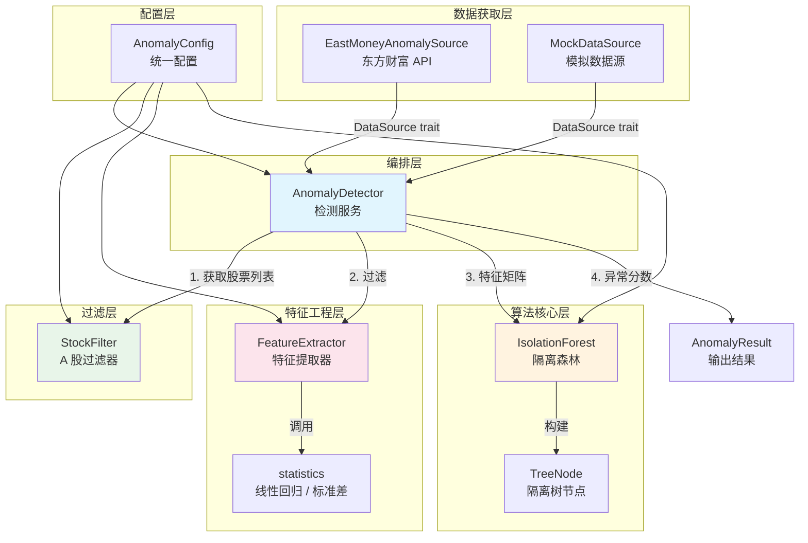
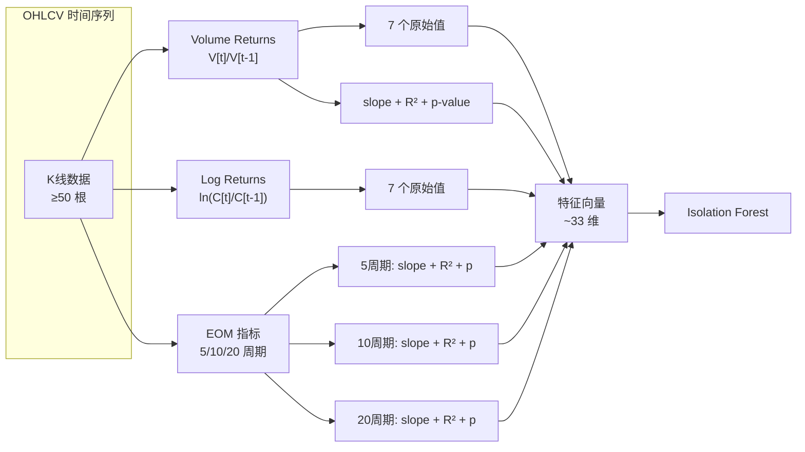
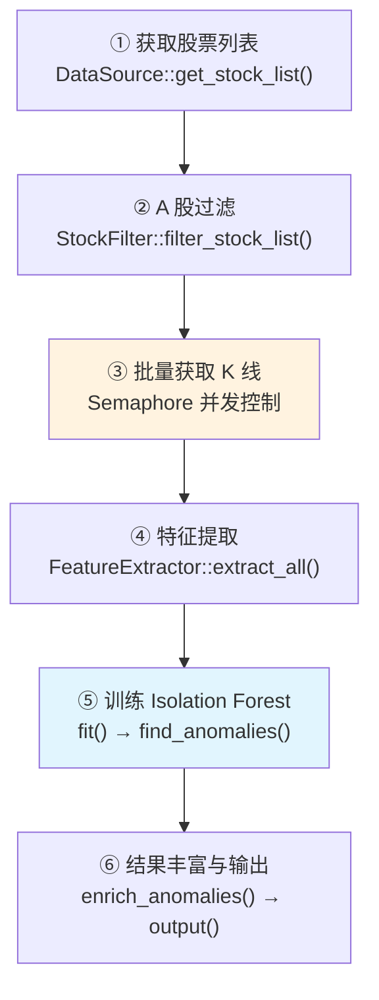
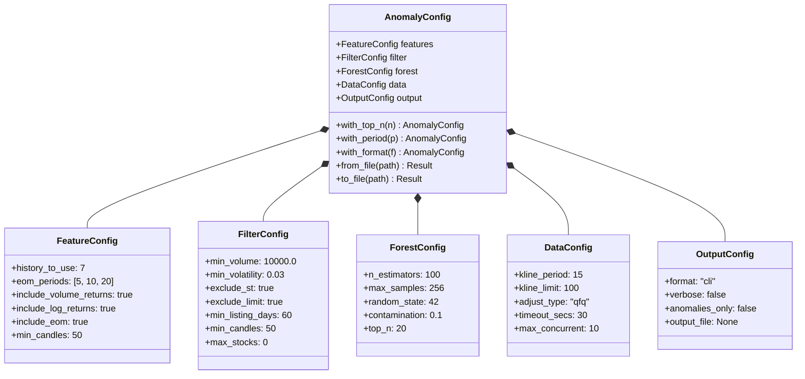

Quantix 的异常检测模块 (`src/anomaly`) 基于 **Isolation Forest** 算法实现了一套端到端的 A 股异动识别系统。该模块从东方财富 API 实时获取全市场 K 线数据，通过 A 股特有规则过滤不适合分析的标的（ST、涨跌停、停牌等），然后利用多维统计特征（成交量比率、对数收益率、Ease of Movement 等）构建特征向量，最终由并行训练的 Isolation Forest 森林计算每只股票的异常分数。整套流水线通过 CLI 命令 `anomaly run` 一键触发，支持 CLI 表格、JSON、CSV 三种输出格式，并可通过 `--mock` 标志使用模拟数据进行离线测试。

Sources: [mod.rs](src/anomaly/mod.rs#L1-L51)

## 模块架构与组件关系

异常检测模块由七个源文件组成，每个文件承担单一职责。下方架构图展示了数据在组件间的流转路径——从数据获取到最终输出，形成一个清晰的六阶段流水线。



**核心调用链路**：`AnomalyDetector::detect()` 方法按序执行六个阶段——获取股票列表 → 过滤 → 批量获取 K 线 → 特征提取 → 训练森林 → 输出结果。整个过程中，`AnomalyConfig` 作为统一配置中心驱动所有子组件的行为参数。

Sources: [detector.rs](src/anomaly/detector.rs#L1-L18), [mod.rs](src/anomaly/mod.rs#L35-L51)

## Isolation Forest 算法原理与实现

**核心直觉**：Isolation Forest 的理论基础是"异常样本更稀少且与正常样本存在显著差异，因此更容易被随机分割孤立"。算法通过递归地随机选择特征和分割值来构建二叉树，异常样本由于远离多数群体，通常只需更少的分割次数即可被单独隔离到叶子节点——即**路径长度更短**。

**评分公式**为 `s(x, n) = 2^(-E[h(x)] / c(n)) - 0.5`，其中 `E[h(x)]` 是样本在所有树中的平均路径长度，`c(n)` 是基于训练样本数的归一化因子（即 BST 的平均路径长度）。分数范围约为 `[-0.5, 0.5]`：负值表示异常（路径短），正值表示正常（路径长），接近零表示边界样本。

Sources: [forest.rs](src/anomaly/forest.rs#L1-L18)

### TreeNode：隔离树的递归构建

`TreeNode` 是 Isolation Forest 的基本构建单元，采用递归二叉树结构。每个内部节点存储一个随机选择的特征索引 `split_feature` 和分割值 `split_value`，将数据按 `sample[feature] < value` 分入左右子树。构建过程的终止条件有三个：达到高度限制 (`height_limit`)、样本数 ≤ 1、或所有特征方差为零（无法有效分割）。

关键实现细节：叶子节点会累加一个 **预期剩余路径长度** `avg_path_length(n)`，该值基于 Euler-Mascheroni 常数计算：`c(n) = 2 * (ln(n) + γ) - 2 * (n-1) / n`。这一近似来自 BST 搜索失败时的平均路径长度理论，用于补偿因高度限制而提前终止的路径偏差。

Sources: [forest.rs](src/anomaly/forest.rs#L52-L183), [forest.rs](src/anomaly/forest.rs#L382-L397)

### IsolationForest：并行训练与评分

`IsolationForest` 结构体管理一个由 `n_estimators` 棵 `IsolationTree` 组成的森林。训练阶段 (`fit`) 的核心逻辑是：对每棵树从训练集中有放回地抽取 `max_samples` 个样本（默认 256），然后调用 `TreeNode::build` 递归构建。**关键性能优化**在于使用 Rayon 的 `into_par_iter()` 并行构建所有树——每棵树拥有独立的 ChaCha8 随机数生成器（以 `random_state + tree_index` 为种子），既保证了并行安全性又确保结果可复现。

评分阶段 (`decision_function`) 同样采用 Rayon 并行：对每个样本遍历所有树计算路径长度，取平均值后代入评分公式。`find_anomalies` 方法在此基础上将分数升序排列并返回 `top_n` 个最异常样本。`predict` 方法则基于 `contamination` 比例动态计算阈值，将排序后的分数数组取第 `contamination * n` 个分位数作为判定边界。

| 参数 | 默认值 | 说明 |
|------|--------|------|
| `n_estimators` | 100 | 森林中树的数量，越多越稳定但越慢 |
| `max_samples` | 256 | 每棵树采样的最大样本数 |
| `random_state` | 42 | 随机种子，确保可复现 |
| `contamination` | 0.1 | 预期异常比例，影响阈值计算 |
| `top_n` | 20 | 返回的最异常样本数量 |

Sources: [forest.rs](src/anomaly/forest.rs#L198-L380)

## 特征工程：从 OHLCV 到多维向量

特征工程是连接原始 K 线数据和机器学习算法的桥梁。`FeatureExtractor` 将每只股票的 OHLCV 时间序列转化为固定长度的浮点数向量，供 Isolation Forest 消费。

### 特征体系

模块实现了三类特征维度，每类均通过 `FeatureConfig` 独立控制开关：

**1. 成交量收益率（Volume Returns）**：计算连续两根 K 线的成交量比值 `V[t] / V[t-1]`，取最近 `history_to_use`（默认 7）个周期的原始值，再加上通过线性回归计算的三个统计量（斜率 `slope`、决定系数 `r_squared`、p 值 `p_value`），共贡献 `7 + 3 = 10` 个特征维度。斜率为正表示成交量递增趋势，配合 p 值可判断趋势的统计显著性。

**2. 对数收益率（Log Returns）**：计算收盘价的对数变化率 `ln(C[t] / C[t-1])`，取最近 7 个周期的原始值。这是金融时间序列分析中最基础的价格变动度量，相比简单收益率具有时间可加性的优势。

**3. Ease of Movement（EOM）指标**：衡量价格移动相对于成交量的"容易程度"。公式为 `(midpoint_move × box_ratio)`，其中 `midpoint_move = (H[t]+L[t])/2 - (H[t-1]+L[t-1])/2`，`box_ratio = (V[t] / 1e6) / (H[t] - L[t])`。对每个配置周期（默认 5、10、20）分别计算 SMA 平滑后的 EOM 序列，再提取回归统计量（slope、r²、p-value），共贡献 `3 × 3 = 9` 个特征维度。



特征提取的最后一步是 **NaN 过滤**：如果任何特征值为 NaN，整只股票将被跳过。这保证了输入 Isolation Forest 的特征矩阵是完全干净的。此外，`FeatureSet` 还附带三个辅助统计量（`volume_ratio`、`volatility_5`、`volatility_20`），这些不参与模型训练，而是在后处理阶段用于丰富异常结果的展示信息。

Sources: [features.rs](src/anomaly/features.rs#L1-L12), [features.rs](src/anomaly/features.rs#L190-L349), [features.rs](src/anomaly/features.rs#L357-L408)

### 统计基础设施工具

`statistics.rs` 为特征提取提供线性回归和描述性统计基础能力。`linear_regression` 函数以时间索引 `[0, 1, ..., n-1]` 为自变量、特征值为因变量，通过最小二乘法计算斜率、截距、R²、p 值和标准误差。p 值的计算使用 **Abramowitz & Stegun 误差函数近似**，通过 `erf()` → `normal_cdf()` → 双尾 p 值的链路实现，无需引入外部统计库。该模块还提供 `std_dev`、`mean`、`volatility` 等辅助函数。

Sources: [statistics.rs](src/anomaly/statistics.rs#L1-L101), [statistics.rs](src/anomaly/statistics.rs#L144-L167)

## A 股过滤器：市场特有规则引擎

A 股市场存在独特的交易制度（涨跌停板、ST 特别处理、停牌机制等），这些制度性因素会干扰异常检测的统计判断。`StockFilter` 提供两层过滤机制——**信息层过滤** (`passes_info_filter`) 和 **序列层过滤** (`passes_series_filter`)——在数据进入特征提取之前剔除不适合分析的标的。

### 信息层过滤

`passes_info_filter` 基于 `StockInfo` 结构体的静态信息进行判断，包含三条规则：

| 过滤规则 | 实现方式 | 配置开关 |
|----------|----------|----------|
| **ST 股票** | 名称包含 "ST"、"\*ST"、"退" | `exclude_st: true` |
| **涨跌停股票** | 根据板块类型匹配不同阈值 | `exclude_limit: true` |
| **低成交量** | 成交量 < `min_volume` | `min_volume: 10000` |

涨跌停检测的阈值根据股票代码前缀自动识别板块类型：主板（`000/600` 开头）为 ±9.9%、创业板（`300`）和科创板（`688`）为 ±19.9%、北交所（`8/4` 开头）为 ±29.9%、ST 股为 ±4.9%。

Sources: [filter.rs](src/anomaly/filter.rs#L1-L9), [filter.rs](src/anomaly/filter.rs#L60-L138)

### 序列层过滤

`passes_series_filter` 基于 K 线序列的动态特征进行更深入的判断，包含五条规则：

- **最小 K 线数**：序列长度必须 ≥ `min_candles`（默认 50），保证有足够的历史数据计算统计特征
- **最低平均成交量**：全序列平均成交量 ≥ `min_volume`，过滤流动性极差的标的
- **最低波动率**：对数收益率的标准差 ≥ `min_volatility`（默认 0.03），过滤价格几乎不动的"僵尸股"
- **停牌检测**：最近 5 根 K 线收盘价完全一致则判定为停牌
- **最新涨跌停**：最后一根 K 线的涨跌幅绝对值 ≥ 9.9% 则过滤（涨跌停当日的价格行为不具代表性）

Sources: [filter.rs](src/anomaly/filter.rs#L140-L215)

## 数据源：东方财富 API 与可扩展抽象

异常检测的数据获取通过 `DataSource` trait 实现抽象，支持两种实现：

### DataSource Trait

```rust
#[async_trait]
pub trait DataSource: Send + Sync {
    async fn get_stock_list(&self) -> Result<Vec<StockInfo>, String>;
    async fn get_klines(&self, code: &str, period: u32, adjust: &str, limit: usize) -> Result<OHLCVSeries, String>;
}
```

`DataSource` trait 定义了两个异步方法：获取全市场股票列表和获取单只股票的 K 线数据。通过 `Arc<dyn DataSource>` 传入 `AnomalyDetector`，实现数据源的灵活替换。

Sources: [detector.rs](src/anomaly/detector.rs#L60-L74)

### 东方财富数据源实现

`EastMoneyAnomalySource` 直接调用东方财富 Push API（`push2.eastmoney.com`）获取实时行情数据。股票列表获取使用 `/api/qt/clist/get` 接口，通过 `fs` 参数组合深圳 A 股（`m:0+t:6`）、创业板（`m:0+t:80`）、上海 A 股（`m:1+t:2`）、科创板（`m:1+t:23`）四个板块，单次请求最多获取 5000 只股票。K 线数据通过 `/api/qt/stock/kline/get` 接口获取，支持 1/5/15/30/60 分钟和日/周/月线周期，配合前复权 (`qfq`) 参数确保除权除息后的价格连续性。

`build_secid` 辅助函数根据股票代码首位数字自动映射市场标识：6 开头 → 上海 (`1.xxx`)、0/3 开头 → 深圳 (`0.xxx`)、8/4 开头 → 北交所 (`0.xxx`)。

Sources: [eastmoney_source.rs](src/anomaly/eastmoney_source.rs#L1-L63), [eastmoney_source.rs](src/anomaly/eastmoney_source.rs#L72-L231)

### 模拟数据源

`MockDataSource` 生成确定性随机游走数据用于测试。价格从 100.0 出发，每步乘以 `1 + (i % 10 - 5) * 0.01`，成交量在 100 万基础上叠加周期性波动。该数据源还内置了一只注入异常的股票，确保测试中始终能检测到异常模式。

Sources: [detector.rs](src/anomaly/detector.rs#L340-L406)

## 检测流水线：AnomalyDetector 编排服务

`AnomalyDetector` 是整个异常检测的编排中心，其 `detect()` 方法按六个阶段顺序执行完整流水线：



**阶段③的并发控制**是一个值得关注的工程细节：使用 `tokio::sync::Semaphore` 限制同时发出的 HTTP 请求数（默认 `max_concurrent = 10`），避免对东方财富 API 造成过大压力。每个股票的 K 线获取被包装为独立的 `tokio::spawn` 任务，通过 `acquire_owned()` 获取信号量许可，任务完成后自动释放。

**阶段⑥的结果丰富化**（`enrich_anomalies`）将 K 线数据中的辅助统计量回填到 `AnomalyScore` 中：量比（当日成交量 / 5 日均量）、5 日波动率、20 日波动率和最新时间戳。这些信息帮助用户快速理解异常股票的交易特征。

最终输出支持三种格式：CLI 表格（带中文标注和 emoji 标记）、JSON（完整序列化的 `AnomalyResult`）和 CSV（逗号分隔的平面数据）。

Sources: [detector.rs](src/anomaly/detector.rs#L82-L167), [detector.rs](src/anomaly/detector.rs#L169-L209), [detector.rs](src/anomaly/detector.rs#L211-L337)

## 配置体系

`AnomalyConfig` 是整个模块的配置入口，由五个子配置结构体组成。每个子配置均实现了 `Default` trait，提供合理的开箱即用参数。



配置支持 Builder 模式的链式调用（`with_top_n`、`with_period`、`with_format`），也支持从 TOML 文件加载（`from_file`）和序列化保存（`to_file`），便于在生产和测试环境间切换。

Sources: [config.rs](src/anomaly/config.rs#L1-L174)

## CLI 使用指南

异常检测功能通过 `anomaly run` 子命令触发，支持丰富的命令行参数：

| 参数 | 默认值 | 说明 |
|------|--------|------|
| `--top-n` | 20 | 返回的最异常股票数量 |
| `--period` | 15 | K 线周期（分钟）：1, 5, 15, 30, 60 |
| `--min-volume` | 10000 | 最小成交量过滤阈值 |
| `--min-volatility` | 0.03 | 最小波动率过滤阈值 |
| `--output` | cli | 输出格式：cli、json、csv |
| `--n-estimators` | 100 | Isolation Forest 树数量 |
| `--history` | 7 | 用于特征计算的历史 K 线数 |
| `--mock` | false | 使用模拟数据（测试用） |
| `--mock-count` | 100 | 模拟数据股票数量 |

**典型使用场景**：运行 `quantix anomaly run --top-n 30 --period 5 --n-estimators 200` 将以 5 分钟 K 线、200 棵树的配置扫描全市场并返回前 30 只最异常股票。开发调试时可使用 `--mock --mock-count 50` 快速验证流水线。

Sources: [trade.rs](src/cli/commands/trade.rs#L165-L204), [anomaly.rs](src/cli/handlers/anomaly.rs#L1-L127)

## 下一步阅读

- 了解 K 线数据的底层获取机制，参见 [多数据源适配器（TDX / AkShare / 东方财富 / WebSocket）](7-duo-shu-ju-yuan-gua-pei-qi-tdx-akshare-dong-fang-cai-fu-websocket)
- 了解技术指标的计算引擎，参见 [技术指标计算引擎与 Polars 批量数据层](31-ji-zhu-zhi-biao-ji-suan-yin-qing-yu-polars-pi-liang-shu-ju-ceng)
- 了解选股器的评估逻辑，参见 [选股器：条件解析、评估引擎与预设筛选](20-xuan-gu-qi-tiao-jian-jie-xi-ping-gu-yin-qing-yu-yu-she-shai-xuan)