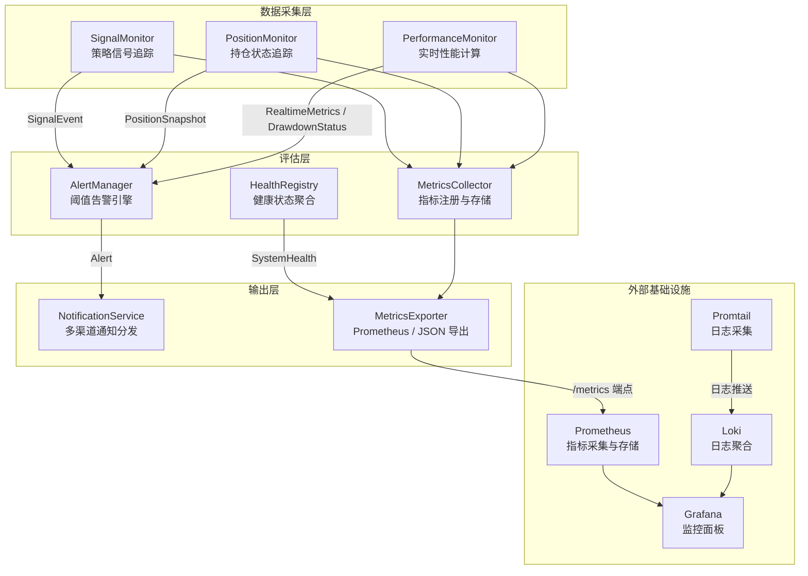
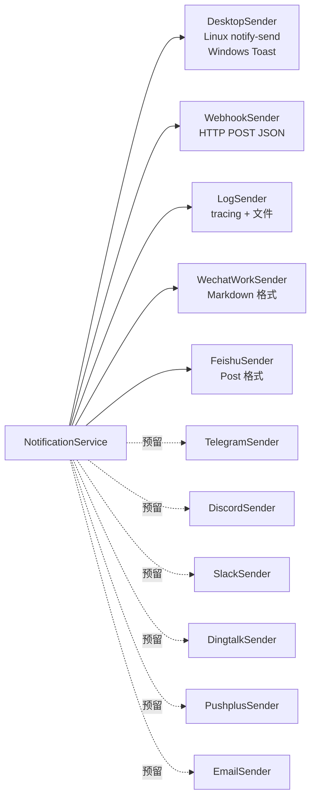

Quantix 的监控系统（`src/monitoring/`）是一个 **Phase 16** 实现的实时监控框架，由七大子模块组成，覆盖从应用层阈值告警到基础设施指标采集的完整可观测性链路。该系统遵循"采集 → 评估 → 通知"三段式架构：信号监控器（Signal Monitor）、持仓监控器（Position Monitor）、性能监控器（Performance Monitor）持续采集运行时数据；告警管理器（Alert Manager）依据预设阈值进行评估；通知服务（Notification Service）通过多渠道推送告警消息。与此同时，健康检查注册表（Health Registry）和指标收集器（Metrics Collector）分别提供组件存活状态报告和 Prometheus 兼容的指标导出能力。

Sources: [mod.rs](src/monitoring/mod.rs#L1-L28)

## 架构总览

监控系统以分层解耦的方式组织——**数据采集层**（三个专用监控器）产生原始事件，**评估层**（告警管理器 + 健康检查注册表）执行规则匹配与状态聚合，**输出层**（通知服务 + 指标导出器）负责多通道分发与格式化输出。各层通过 Rust trait 和结构体组合实现松耦合，上层模块仅依赖下层的数据模型，不依赖具体实现。

Sources: [mod.rs](src/monitoring/mod.rs#L1-L28), [docker-compose.yml](docker-compose.yml#L90-L159)

## 告警系统

**告警管理器**（`AlertManager`）是监控系统的核心决策引擎，负责维护告警阈值集合、检测阈值越界、管理告警生命周期（活跃 → 确认 → 归档），并执行冷却时间（cooldown）策略以防止告警风暴。每个告警阈值由 `AlertThreshold` 结构体定义，包含唯一标识符、阈值数值、告警级别、启用状态、冷却时间（默认 5 分钟）和最后告警时间戳。

告警级别的优先级从低到高依次为 **Info → Warning → Error → Critical**，并通过 `PartialOrd`/`Ord` trait 实现级别比较，使得通知系统可以基于 `min_level` 过滤低级别告警。告警类型覆盖五种业务域：信号告警（Signal）、持仓告警（Position）、性能告警（Performance）、风险告警（Risk）和系统告警（System），每种类型携带与业务相关的上下文字段。

`AlertManager::check_and_alert()` 是阈值检查的入口方法——它先验证阈值是否存在且已启用，然后调用 `AlertThreshold::should_alert()` 执行双重判断：**阈值越界检查**（当前值 ≥ 阈值）和**冷却时间检查**（距上次告警 ≥ `cooldown_secs`）。通过冷却时间机制，同一阈值在 5 分钟内最多触发一次告警，有效抑制了持续性异常导致的告警洪泛。

Sources: [alert.rs](src/monitoring/alert.rs#L1-L118), [alert.rs](src/monitoring/alert.rs#L233-L357)

### 预定义告警阈值构建器

系统提供 `AlertThresholdBuilder` 工具类，封装了四种常见的告警阈值快速构建方法：

| 构建方法 | 默认告警级别 | 典型用途 |
|---|---|---|
| `drawdown_warning(threshold)` | Warning | 回撤率超过阈值（如 10%） |
| `drawdown_critical(threshold)` | Critical | 严重回撤（如 20%） |
| `position_ratio(threshold)` | Warning | 单票持仓比例超限 |
| `signal_frequency(threshold)` | Info | 信号频率异常 |

Sources: [alert.rs](src/monitoring/alert.rs#L419-L462)

### Prometheus 告警规则

除了应用内告警引擎，项目在 `monitoring/alerts.yml` 中定义了 Prometheus 层面的告警规则，覆盖三层监控维度：

| 维度 | 规则名称 | 触发条件 | 严重级别 |
|---|---|---|---|
| 应用层 | `ApplicationDown` | `up == 0` 持续 1 分钟 | Critical |
| 应用层 | `HighErrorRate` | 5xx 错误率 > 5% 持续 5 分钟 | Warning |
| 应用层 | `HighLatency` | P95 延迟 > 1s 持续 5 分钟 | Warning |
| 应用层 | `DatabaseConnectionPoolExhausted` | 连接池使用率 > 90% | Warning |
| 业务层 | `DataCollectionDelay` | 最后采集时间距今 > 5 分钟 | Warning |
| 业务层 | `StrategySignalAnomaly` | 信号频率 > 10/分钟 | Info |
| 业务层 | `BacktestFailureRate` | 回测失败率 > 10% | Warning |
| 资源层 | `HighCPUUsage` | CPU 使用率 > 90% 持续 10 分钟 | Warning |
| 资源层 | `HighMemoryUsage` | 内存使用率 > 90% 持续 10 分钟 | Warning |
| 资源层 | `DiskSpaceLow` | 磁盘剩余 < 10% | Warning |
| 数据库 | `PostgreSQLDown` | `pg_up == 0` | Critical |
| 数据库 | `ClickHouseHighMemoryUsage` | 内存使用率 > 90% | Warning |

Sources: [alerts.yml](monitoring/alerts.yml#L1-L217)

## 健康检查

**健康检查注册表**（`HealthRegistry`）采用组件注册模式，每个系统组件（数据库连接、数据源适配器、执行适配器、策略运行时等）以 `ComponentHealth` 结构体注册自身的健康状态。注册表维护一个 `HashMap<String, ComponentHealth>` 映射，支持动态更新单个组件状态。

`HealthStatus` 定义了三级健康状态：**Healthy**（全部正常）、**Degraded**（部分降级但可用）、**Unhealthy**（关键组件异常）。`HealthStatus::combine()` 方法以"取最差"策略聚合多个组件状态——任何组件 Unhealthy 则整体 Unhealthy，否则任何 Degraded 则整体 Degraded，全部 Healthy 才判定为 Healthy。`HealthRegistry::system_health()` 方法遍历所有已注册组件，调用 `combine()` 聚合出 `SystemHealth` 结构体，其中包含检查时间、整体状态、各组件详情和系统运行时间。

`HealthCheck` trait 定义了异步健康检查的标准接口，包含 `name()`（组件名称）和 `check()`（执行检查并返回 `ComponentHealth`）两个方法。`ComponentHealth` 提供了三个便利构造函数：`healthy()`、`degraded()` 和 `unhealthy()`，以及 Builder 风格的 `with_response_time()` 和 `with_detail()` 方法用于附加响应时间和详细信息。

Sources: [health.rs](src/monitoring/health.rs#L1-L188)

## 指标收集与导出

**指标收集器**（`MetricsCollector`）内部维护一个 `Arc<RwLock<HashMap<String, Metric>>>`，支持三种 Prometheus 标准指标类型的注册和更新：

| 指标类型 | 注册方法 | 更新方法 | 语义 |
|---|---|---|---|
| Counter | `register_counter()` | `increment_counter()` | 单调递增计数器（如请求总数） |
| Gauge | `register_gauge()` | `set_gauge()` | 可增可减的瞬时值（如内存使用量） |
| Histogram | `register_histogram()` | `observe_histogram()` | 分布统计（如请求延迟分位数） |

所有指标名称自动添加前缀（默认 `quantix_`），例如注册 `requests_total` 将生成 `quantix_requests_total`。Histogram 类型采用 Prometheus 默认桶配置（0.005s ~ 10s），每次 `observe()` 调用同时更新计数、总和和各桶计数。

**指标导出器**（`MetricsExporter`）支持两种导出格式：

- **Prometheus 文本格式**：生成标准 `# HELP`、`# TYPE`、值行三段式输出，Histogram 生成 `_bucket{le="..."}`、`_sum`、`_count` 完整指标序列，支持自定义标签。
- **JSON 格式**：将所有指标序列化为 `serde_json` 格式，适用于自定义仪表盘或 API 集成。

Sources: [metrics.rs](src/monitoring/metrics.rs#L1-L337)

### Prometheus 基础设施配置

`monitoring/prometheus.yml` 定义了七个抓取任务（scrape job），构建完整的可观测性采集链：

| 抓取任务 | 目标 | 采集间隔 | 用途 |
|---|---|---|---|
| `quantix` | `quantix:8080/metrics` | 30s | 应用指标 |
| `postgres` | `postgres-exporter:9187` | 30s | PostgreSQL 指标 |
| `clickhouse` | `clickhouse-exporter:9116` | 30s | ClickHouse 指标 |
| `node` | `node-exporter:9100` | 30s | 系统资源指标 |
| `cadvisor` | `cadvisor:8080` | 30s | 容器资源指标 |
| `grafana` | `grafana:3000` | 30s | Grafana 自身指标 |
| `prometheus` | `localhost:9090` | 15s | Prometheus 自身指标 |

数据保留策略为 30 天（`storage.tsdb.retention.time=30d`），告警规则从 `/etc/prometheus/alerts.yml` 加载。

Sources: [prometheus.yml](monitoring/prometheus.yml#L1-L65)

## 通知系统

**通知服务**（`NotificationService`）是告警系统与外部世界的桥梁，采用 **Strategy 模式** 实现多渠道通知。系统定义了 `NotificationSender` trait（异步 `send()` 方法 + `channel()` + `is_available()`），所有渠道发送器统一实现该接口。`NotificationService` 在初始化时根据配置中的 `enabled_channels` 列表动态构建发送器集合。

Sources: [notification.rs](src/monitoring/notification.rs#L1-L166), [notification.rs](src/monitoring/notification.rs#L296-L550)

### 多渠道配置矩阵

通知系统支持十一种通知渠道，渠道可用性通过环境变量自动检测：

| 渠道 | 环境变量 | 实现状态 | 消息格式 |
|---|---|---|---|
| Log（日志） | 始终启用 | ✅ 已实现 | `[时间] [级别] 标题 - 消息` |
| Desktop（桌面） | 平台检测 | ✅ 已实现 | notify-send / Windows Toast |
| Webhook | `WEBHOOK_URL` | ✅ 已实现 | JSON POST |
| 企业微信 | `WECHAT_WORK_WEBHOOK_URL` | ✅ 已实现 | Markdown |
| 飞书 | `FEISHU_WEBHOOK_URL` | ✅ 已实现 | Post 富文本 |
| Telegram | `TELEGRAM_BOT_TOKEN` + `TELEGRAM_CHAT_ID` | 🔜 预留 | — |
| Discord | `DISCORD_WEBHOOK_URL` | 🔜 预留 | — |
| Slack | `SLACK_WEBHOOK_URL` | 🔜 预留 | — |
| 钉钉 | `DINGTALK_WEBHOOK_URL` | 🔜 预留 | — |
| PushPlus | `PUSHPLUS_TOKEN` | 🔜 预留 | — |
| Email | — | 🔜 预留 | — |

### 通知过滤与静默机制

通知服务在发送前执行两层过滤：**级别过滤**（通知级别低于 `min_level` 则丢弃）和**静默时段过滤**（`QuietHours` 配置的时段内不发送通知）。静默时段支持跨午夜配置（如 22:00 ~ 06:00），通过字符串比较实现轻量级时间判断。

`NotificationService::notify()` 方法在发送时遍历所有已注册发送器，对每个可用渠道调用 `send()`。即使部分渠道发送失败，只要有一个成功即标记为已发送；若全部失败则返回错误。所有通知记录存储在 `notification_history` 中（默认上限 100 条），支持历史查询和清空。

Sources: [notification.rs](src/monitoring/notification.rs#L703-L840)

### 配置方式

通知系统支持两种配置方式。**环境变量方式**（推荐用于 Docker 部署）：`NotificationConfig::from_env()` 自动扫描环境变量，检测到相应变量即启用对应渠道，默认最低级别为 `Warning`。**TOML 配置文件方式**：`config/default.toml` 的 `[notification]` 段落提供完整配置项，包括渠道列表、最低级别、日志路径、静默时段和各渠道 Webhook URL。

Sources: [notification.rs](src/monitoring/notification.rs#L100-L166), [default.toml](config/default.toml#L41-L87), [.env.example](.env.example#L31-L65)

## 实时监控器

### 性能监控器

**PerformanceMonitor** 是量化交易系统最关键的监控组件，实时计算并维护一套完整的策略绩效指标。核心数据结构是 `RealtimeMetrics`，包含 17 个字段覆盖收益、风险、效率三个维度：

| 维度 | 指标 | 计算逻辑 |
|---|---|---|
| 收益 | `total_return` | `(当前权益 - 初始资金) / 初始资金` |
| 收益 | `annual_return` | `日收益率 × 365` |
| 风险 | `current_drawdown` | `(峰值权益 - 当前权益) / 峰值权益` |
| 风险 | `max_drawdown` | 历史最大回撤（遍历权益历史） |
| 风险 | `sharpe_ratio` | `(超额收益 / 标准差) × √365` |
| 风险 | `sortino_ratio` | `(超额收益 / 下行标准差) × √365` |
| 效率 | `win_rate` | `盈利交易数 / 总交易数 × 100` |
| 效率 | `profit_loss_ratio` | `总盈利 / 总亏损` |

性能监控器通过 `update_equity()` 接收权益快照更新，内部维护 `VecDeque<EquityPoint>` 滑动窗口（默认最大 1000 条），并在每次更新后触发完整的指标重算。`DrawdownStatus` 分四级（Normal → Caution → Warning → Critical），对应阈值倍数关系：Caution = threshold/2，Warning = threshold，Critical = threshold×2。当 `drawdown_alert_threshold` 设为 10% 时，回撤 5% 为 Caution，10% 为 Warning，20% 为 Critical。

Sources: [performance_monitor.rs](src/monitoring/performance_monitor.rs#L1-L419)

### 信号监控器

**SignalMonitor** 追踪策略产生的交易信号，维护三个维度的数据：**信号历史**（`VecDeque<SignalEvent>`，默认上限 1000）、**按策略分组的统计**（`strategy_stats: HashMap<String, SignalStats>`）和**按股票代码分组的统计**（`code_stats: HashMap<String, SignalStats>`）。每个 `SignalStats` 记录买入/卖出/观望次数、信号频率（每分钟）和最近信号序列。

信号监控器采用**滑动时间窗口**机制（默认 1 小时），`window_start` 记录窗口起点。当 `window_start.elapsed() >= stats_window_secs` 时，自动调用 `reset_window_stats()` 清零所有计数器并重置窗口起点，实现周期性统计刷新。

Sources: [signal_monitor.rs](src/monitoring/signal_monitor.rs#L1-L355)

### 持仓监控器

**PositionMonitor** 追踪持仓变化，核心能力是**变化检测**。每次调用 `update_positions()` 时，监控器将新旧持仓集合做 diff，自动识别五种变化类型：New（新建）、Increased（加仓）、Decreased（减仓）、Closed（平仓）、PriceUpdated（价格变化）。每个变化事件封装为 `PositionChangeEvent`，记录变化类型、前后状态、数量变化和市值变化。

监控器还支持**定时快照**（默认每 60 秒）功能，通过 `create_snapshot()` 将当前所有持仓信息汇总为 `PositionSnapshot`，包含总市值、总成本、总浮动盈亏和持仓数量。`check_position_ratio()` 方法检测单票持仓是否超过阈值（默认 20%），为风控系统提供实时数据支撑。

Sources: [position_monitor.rs](src/monitoring/position_monitor.rs#L1-L390)

## 日志采集与聚合

**Promtail** 负责日志采集，配置了四个采集任务：Docker 容器日志（JSON 解析 + 正则提取容器名）、系统日志（正则匹配日志级别）、Quantix 应用日志（JSON 格式解析，提取 timestamp/level/target/span_id/trace_id 等结构化字段）和 PostgreSQL 日志（匹配 ERROR/FATAL/PANIC）。所有日志推送到 **Loki**（端口 3100），Loki 使用 BoltDB Shipper 索引 + 文件系统存储，查询结果缓存上限 100MB。

Sources: [promtail.yml](monitoring/promtail.yml#L1-L110), [loki.yml](monitoring/loki.yml#L1-L50)

## 容器健康检查

Docker Compose 中定义了多层健康检查机制。Quantix 应用容器的健康检查通过 `quantix health` CLI 命令执行，间隔 30 秒，超时 10 秒，连续失败 3 次标记为不健康。`scripts/health-check.sh` 脚本提供了 HTTP 端点健康检查的降级方案——优先使用 curl 访问 `/health` 端点，其次使用 wget，最后降级到 `quantix health` 命令。

Sources: [docker-compose.yml](docker-compose.yml#L33-L38), [health-check.sh](scripts/health-check.sh#L1-L55)

## 关键设计决策

| 决策 | 选择 | 理由 |
|---|---|---|
| 指标存储 | `Arc<RwLock<HashMap>>` | 读多写少场景，RwLock 允许多线程并发读 |
| 告警防风暴 | 冷却时间机制（默认 5 分钟） | 避免持续性异常触发告警洪泛 |
| 通知架构 | Strategy 模式 + 异步 trait | 新增渠道只需实现 `NotificationSender` |
| 状态聚合 | "取最差"策略 | 保守原则——任何组件异常即反映到全局状态 |
| 历史数据 | `VecDeque` 滑动窗口 + 上限裁剪 | O(1) 尾部插入，自动淘汰过期数据 |

## 延伸阅读

- [Monitor 服务：价格告警、事件存储与 systemd 集成](26-monitor-fu-wu-jie-ge-gao-jing-shi-jian-cun-chu-yu-systemd-ji-cheng) — 监控模块在 systemd 服务中的集成方式
- [Docker 容器化部署与监控栈](29-docker-rong-qi-hua-bu-shu-yu-jian-kong-zhan-prometheus-grafana-loki) — 监控基础设施的完整部署方案
- [风控服务：规则引擎、行业集中度与波动率检查](16-feng-kong-fu-wu-gui-ze-yin-qing-xing-ye-ji-zhong-du-yu-bo-dong-lu-jian-cha) — 与告警系统联动的风控规则
- [策略守护进程、Signal Daemon 与 systemd 服务管理](13-ce-lue-shou-hu-jin-cheng-signal-daemon-yu-systemd-fu-wu-guan-li) — 信号监控器的上游数据来源