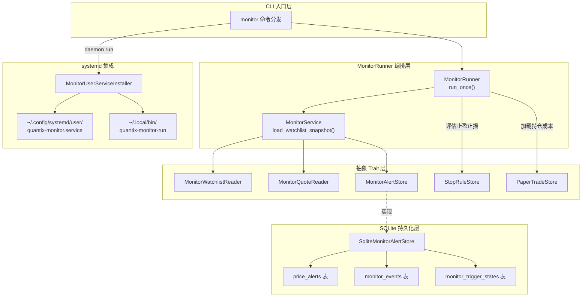
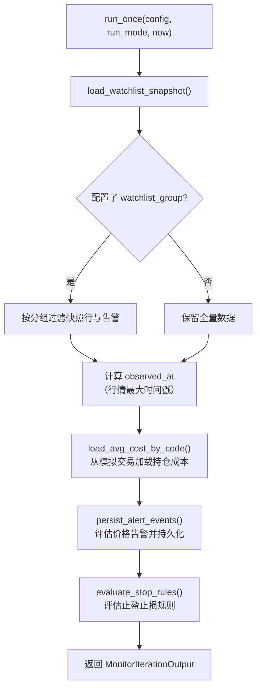
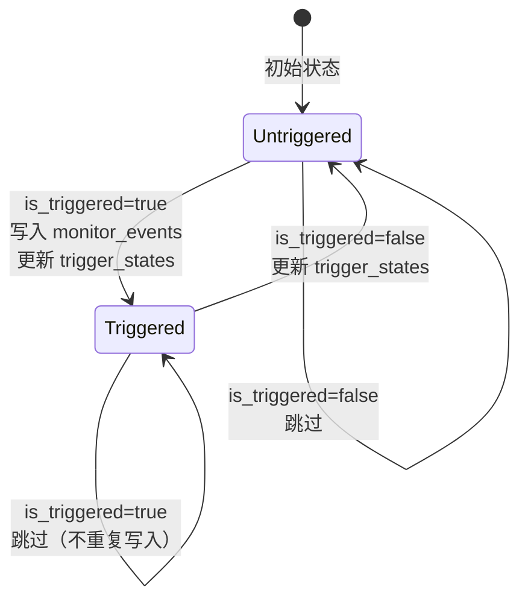
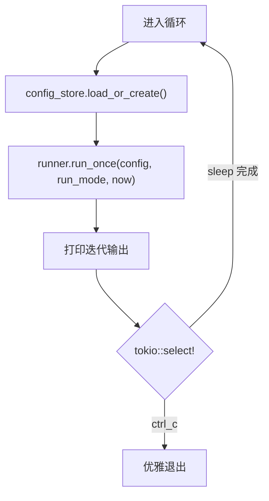
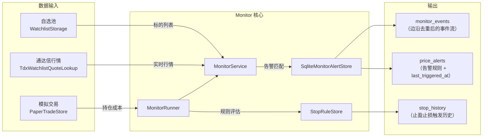

`src/monitor/` 模块是 Quantix 的实时监控引擎，负责从自选池拉取行情快照、评估价格告警与止盈止损规则、持久化监控事件，并通过 systemd 用户级服务实现守护进程化运行。该模块与 [监控系统：告警、健康检查、指标收集与通知](25-jian-kong-xi-tong-gao-jing-jian-kang-jian-cha-zhi-biao-shou-ji-yu-tong-zhi) 中的通用告警框架互补——后者关注系统级指标，而本模块聚焦于**个股级别的价格事件检测**。

Sources: [mod.rs](src/monitor/mod.rs#L1-L19)

## 模块总览与架构

Monitor 模块由 7 个子文件组成，职责边界清晰：**配置管理**（config.rs / service_config.rs）控制运行参数与服务路径；**领域模型**（models.rs）定义告警、事件、快照等核心数据结构；**服务层**（service.rs）以泛型 trait 实现行情快照组装与告警匹配；**运行器**（runner.rs）编排完整的监控迭代流程；**持久化**（storage.rs）基于 SQLite 实现事件去重与历史裁剪；**systemd 集成**（systemd.rs）生成 unit 文件并管理服务生命周期。



整个监控流程的核心循环由 `MonitorRunner::run_once()` 驱动：先通过 `MonitorService` 获取自选池行情快照和已触发的价格告警，再调用止盈止损评估引擎计算 `TriggeredStop`，最终通过 `SqliteMonitorAlertStore::record_event_edge()` 仅在**状态跃迁边沿**写入事件，避免重复触发。

Sources: [runner.rs](src/monitor/runner.rs#L58-L104), [service.rs](src/monitor/service.rs#L39-L43), [storage.rs](src/monitor/storage.rs#L50-L54), [systemd.rs](src/monitor/systemd.rs#L1-L8)

## 领域模型：告警、事件与快照

Monitor 模块定义了三类核心数据结构，分别对应"规则定义"、"事件记录"和"一次迭代的聚合视图"。

**价格告警** `PriceAlert` 表示一条用户定义的阈值规则，包含 `Above`（高于目标价）和 `Below`（低于目标价）两种方向。告警通过 `is_active` 字段实现软删除——`remove_alert` 仅将状态置为 0，而非物理删除。

**监控事件** `NewMonitorEvent` / `MonitorEventRow` 是系统检测到触发后写入的不可变事件记录。`MonitorEventType` 枚举覆盖四种事件来源：`PriceAlert`（价格告警）、`StopLoss`（止损）、`StopProfit`（止盈）和 `TrailingStop`（跟踪止损）。每条事件携带 `source_type` + `source_key` 复合键用于去重。

**快照** `MonitorWatchlistSnapshot` 是一次监控迭代的完整输出，包含自选池行情行 (`MonitorQuoteRow`)、已触发的告警列表 (`TriggeredAlert`) 以及行情获取失败产生的警告信息。

| 结构体 | 用途 | 关键字段 |
|---|---|---|
| `PriceAlert` | 用户定义的价格告警规则 | `code`, `kind`(Above/Below), `target_price`, `last_triggered_at` |
| `NewMonitorEvent` | 待写入的监控事件 | `event_type`, `code`, `price`, `source_type`, `source_key`, `run_mode` |
| `MonitorEventRow` | 已持久化的事件（带 ID） | 在 `NewMonitorEvent` 基础上增加 `id` |
| `MonitorEventFilter` | 事件查询过滤器 | `limit`, `code`(可选), `event_type`(可选) |
| `TriggeredAlert` | 告警触发上下文 | `alert_id`, `current_price`, `target_price`, `triggered_at` |
| `MonitorWatchlistSnapshot` | 一次迭代的聚合视图 | `rows`, `triggered_alerts`, `warnings` |
| `MonitorRunMode` | 运行模式标识 | `Foreground` / `Daemon` |

Sources: [models.rs](src/monitor/models.rs#L1-L95)

## MonitorService：快照组装与告警匹配

`MonitorService<RW, RQ, RS>` 是监控服务的核心，通过三个泛型 trait 参数解耦数据源依赖：

- **`MonitorWatchlistReader`** — 从自选池读取监控标的列表，返回 `Vec<WatchlistListItem>`
- **`MonitorQuoteReader`** — 批量加载指定股票代码的最新行情，返回 `Vec<MonitorQuoteRow>`
- **`MonitorAlertStore`** — 管理价格告警的 CRUD 及触发标记

`load_watchlist_snapshot()` 方法执行以下流程：首先获取自选池标的列表和最新行情，通过 `build_snapshot_row()` 将行情数据与自选池元信息（分组、标签）合并，对于行情不可用的标的会记录警告信息。然后加载所有活跃告警，遍历每个告警与当前价格进行匹配——`is_triggered()` 函数根据告警方向（Above ≥ 目标价 / Below ≤ 目标价）判定触发状态。最终返回包含行情行、已触发告警和警告的完整快照。

生产环境中，CLI 层提供了两个具体实现：`ConfiguredMonitorWatchlistReader` 封装了 `WatchlistStorage` 读取自选池数据；`TdxMonitorQuoteReader` 通过 `TdxWatchlistQuoteLookup` 从通达信数据源获取实时行情。

Sources: [service.rs](src/monitor/service.rs#L1-L180), [handlers/mod.rs](src/cli/handlers/mod.rs#L2552-L2598)

## MonitorRunner：监控迭代编排器

`MonitorRunner<RW, RQ, SS, TS>` 是监控循环的编排器，在 `MonitorService` 的基础上引入了止盈止损规则评估能力。它组合了四个组件：`MonitorService`（行情快照 + 价格告警）、`SqliteMonitorAlertStore`（事件持久化）、`StopRuleStore`（止盈止损规则）和 `PaperTradeStore`（持仓成本）。

`run_once()` 方法是一次完整监控迭代的入口，执行流程如下：



**告警事件持久化** `persist_alert_events()` 的关键设计是**边沿检测（Edge Detection）**：对于每个活跃告警，通过 `record_event_edge()` 维护触发状态机——仅当状态从"未触发"跃迁到"已触发"时才写入事件记录；如果告警持续处于触发状态则跳过，直到其恢复为"未触发"后再次触发才会产生新事件。

**止盈止损评估** `evaluate_stop_rules()` 调用 `StopService::evaluate_rules_with_anchor_map()` 进行规则评估，传入持仓成本 (`avg_cost_by_code`) 作为锚定价来源之一。触发后的规则会自动 upsert 更新，并追加历史记录 (`StopHistoryEvent`)。同样使用 `record_event_edge()` 进行事件去重。

Sources: [runner.rs](src/monitor/runner.rs#L1-L314)

## SQLite 存储层与事件去重机制

`SqliteMonitorAlertStore` 基于单个 SQLite 数据库文件管理三张表：

| 表名 | 用途 | 主键 |
|---|---|---|
| `price_alerts` | 用户定义的价格告警规则 | `id` (自增) |
| `monitor_events` | 不可变监控事件记录 | `id` (自增) |
| `monitor_trigger_states` | 触发状态机（边沿检测核心） | `(source_type, source_key)` 复合主键 |

**事件边沿检测**由 `record_event_edge()` 方法实现，其核心逻辑如下图所示：



当 `is_triggered=true` 且当前状态为"未触发"时，方法会同时写入 `monitor_events` 表和更新 `monitor_trigger_states` 表，并调用 `trim_event_history()` 将事件总数裁剪到 `max_event_history` 上限（默认 1000 条）。裁剪策略保留最新的事件记录，删除最旧的溢出部分。当 `is_triggered=false` 时，仅更新状态表为"未触发"，不产生事件。

`SqliteMonitorAlertStore` 的连接池配置为 `max_connections(1)`，配合 SQLite 的单写者模型保证数据一致性。数据库文件在 `new()` 时自动创建，`ensure_schema()` 确保三张表的 DDL 幂等执行。

Sources: [storage.rs](src/monitor/storage.rs#L13-L238)

## MonitorConfig：运行参数配置

`MonitorConfig` 以 JSON 文件存储，通过 `JsonMonitorConfigStore` 管理读写。默认路径为 `~/.quantix/monitor/config.json`，可通过 `QUANTIX_MONITOR_CONFIG_PATH` 环境变量覆盖。

| 配置项 | 类型 | 默认值 | 说明 |
|---|---|---|---|
| `interval_seconds` | `u64` | 30 | 守护模式下的轮询间隔（秒） |
| `watchlist_group` | `Option<String>` | `None` | 限定监控的自选池分组，`None` 表示监控全部 |
| `persist_events` | `bool` | `true` | 是否持久化监控事件到数据库 |
| `max_event_history` | `usize` | 1000 | 事件历史记录保留条数上限 |

`JsonMonitorConfigStore` 采用原子写入策略（先写 `.tmp` 临时文件再 `rename`），防止写入中断导致配置文件损坏。`load_or_create()` 方法在文件不存在时自动创建默认配置。

Sources: [config.rs](src/monitor/config.rs#L1-L61)

## MonitorRunner 的守护进程循环

CLI 层通过 `run_monitor_loop()` 函数将 `MonitorRunner` 包装为持续运行的守护进程。该循环在每次迭代中重新加载配置（支持运行时热更新配置参数），执行 `run_once()` 后打印输出，然后通过 `tokio::select!` 同时等待 Ctrl-C 信号和轮询间隔计时器：



该循环支持两种运行模式：`Foreground`（通过 `monitor watchlist --repeat` 启动）和 `Daemon`（通过 `monitor daemon run` 启动）。两者执行逻辑相同，区别仅在于 `MonitorRunMode` 标记——该标记会被写入事件记录中，用于区分事件来源。

Sources: [handlers/mod.rs](src/cli/handlers/mod.rs#L3649-L3693)

## systemd 用户服务集成

`MonitorUserServiceInstaller` 负责将 Monitor 守护进程注册为 systemd **用户级服务**（`--user` scope），无需 root 权限。它生成两个文件：

**Wrapper 脚本** `~/.local/bin/quantix-monitor-run`：一个简单的 shell 脚本，调用配置的 quantix 二进制执行 `monitor daemon run`。

**Unit 文件** `~/.config/systemd/user/quantix-monitor.service`：标准的 systemd 服务单元，包含以下关键配置：

```ini
[Unit]
Description=Quantix monitor daemon
After=network.target

[Service]
Type=simple
ExecStart=~/.local/bin/quantix-monitor-run
Restart=on-failure
RestartSec=5
Environment=QUANTIX_WATCHLIST_PATH=...
Environment=QUANTIX_MONITOR_DB_PATH=...
Environment=QUANTIX_MONITOR_CONFIG_PATH=...
Environment=QUANTIX_TRADE_PATH=...
Environment=QUANTIX_RISK_PATH=...

[Install]
WantedBy=default.target
```

Unit 文件中的 `Environment` 行从 `CliRuntime` 获取所有运行时路径，确保 systemd 服务与 CLI 使用完全一致的文件路径。`Restart=on-failure` + `RestartSec=5` 提供了基本的故障自愈能力。

**安装流程** `install()` 执行严格的事务性操作：先创建 wrapper 脚本（设置 0o755 权限），再创建 unit 文件，最后执行 `daemon-reload`。任何步骤失败都会回滚已创建的文件。**卸载** `uninstall()` 则要求服务必须先停止（通过 `is-active` 检查），防止误操作。

`MonitorServiceConfig` 存储于 `~/.quantix/monitor/service.json`，包含唯一的 `quantix_bin_path` 字段。`validate()` 方法确保该路径是绝对路径、文件存在且具有可执行权限。

Sources: [systemd.rs](src/monitor/systemd.rs#L1-L276), [service_config.rs](src/monitor/service_config.rs#L1-L89)

## CLI 命令体系

Monitor 模块通过 `quantix monitor` 子命令暴露所有功能，命令树结构如下：

| 命令 | 说明 |
|---|---|
| `monitor watchlist --once` | 执行一次监控快照 |
| `monitor watchlist --repeat` | 前台持续监控循环 |
| `monitor daemon run` | 以 Daemon 模式运行监控循环 |
| `monitor alert add <code> --above/--below <price>` | 添加价格告警 |
| `monitor alert list` | 列出所有活跃告警 |
| `monitor alert remove <id>` | 删除指定告警 |
| `monitor config show` | 显示当前监控配置 |
| `monitor config set --interval-seconds/--group/--persist-events` | 修改配置 |
| `monitor config clear-group` | 清除分组限制 |
| `monitor event list [--limit] [--code] [--type]` | 查看事件历史 |
| `monitor service install/uninstall/start/stop/status/enable/disable` | systemd 服务管理 |
| `monitor service-config show/set --quantix-bin` | 服务配置管理 |

CLI 入口函数 `run_monitor_command()` 根据命令类型选择不同的组装路径：告警和单次快照使用 `MonitorService` 直接执行；重复监控和守护进程模式创建 `MonitorRunner` 并进入循环；systemd 管理命令则委托给 `MonitorUserServiceInstaller`。

Sources: [commands/monitor.rs](src/cli/commands/monitor.rs#L1-L163), [handlers/mod.rs](src/cli/handlers/mod.rs#L2371-L2450)

## 环境变量与文件路径

Monitor 模块的所有文件路径由 `CliRuntime` 统一管理，支持通过环境变量覆盖默认路径：

| 环境变量 | 默认路径 | 用途 |
|---|---|---|
| `QUANTIX_MONITOR_DB_PATH` | `~/.quantix/monitor/alerts.db` | SQLite 数据库（告警 + 事件） |
| `QUANTIX_MONITOR_CONFIG_PATH` | `~/.quantix/monitor/config.json` | 监控运行参数配置 |
| `QUANTIX_WATCHLIST_PATH` | `~/.quantix/watchlist/watchlist.json` | 自选池数据 |
| `QUANTIX_TRADE_PATH` | `~/.quantix/trade/paper_trade.json` | 模拟交易状态（持仓成本） |
| `QUANTIX_RISK_PATH` | `~/.quantix/risk/risk_state.json` | 风控状态 |

Sources: [runtime.rs](src/core/runtime.rs#L10-L174)

## 与其他模块的协作关系

Monitor 模块在运行时与多个模块存在交互，形成完整的监控闭环：

- **[自选池管理：分组、标签与多源行情解析](21-zi-xuan-chi-guan-li-fen-zu-biao-qian-yu-duo-yuan-xing-qing-jie-xi)** — `MonitorWatchlistReader` trait 的实现从自选池获取监控标的列表，支持按分组过滤
- **[止盈止损规则管理与实时评估](18-zhi-ying-zhi-sun-gui-ze-guan-li-yu-shi-shi-ping-gu)** — `MonitorRunner` 在每次迭代中评估止盈止损规则，触发后写入 `monitor_events` 并追加 `StopHistoryEvent`
- **[模拟交易、费用计算与交易报告](17-mo-ni-jiao-yi-fei-yong-ji-suan-yu-jiao-yi-bao-gao)** — `PaperTradeStore` 提供持仓成本数据，作为止盈止损的锚定价来源之一
- **[多数据源适配器（TDX / AkShare / 东方财富 / WebSocket）](7-duo-shu-ju-yuan-gua-pei-qi-tdx-akshare-dong-fang-cai-fu-websocket)** — `TdxMonitorQuoteReader` 通过通达信数据源获取实时行情



Sources: [runner.rs](src/monitor/runner.rs#L266-L281), [service.rs](src/monitor/service.rs#L174-L179)

## 关键设计决策总结

| 设计决策 | 动机 | 实现位置 |
|---|---|---|
| **Trait 泛型解耦** | 允许测试中注入 Fake 实现，生产中组装真实数据源 | `MonitorService<RW, RQ, RS>`, `MonitorRunner<RW, RQ, SS, TS>` |
| **边沿检测去重** | 避免告警持续触发时产生大量重复事件 | `record_event_edge()` + `monitor_trigger_states` 表 |
| **单连接 SQLite** | 简化并发控制，监控模块为单进程场景 | `SqlitePoolOptions::new().max_connections(1)` |
| **原子文件写入** | 防止配置写入中断导致数据损坏 | `.tmp` + `rename` 模式 |
| **systemd 用户级服务** | 无需 root 权限，用户可自行管理 | `--user` scope + `~/.config/systemd/user/` 路径 |
| **事务性安装/卸载** | 安装失败时回滚，卸载前强制停止 | `install()` 错误时 `remove_file()`，`uninstall()` 检查 `is-active` |

这些设计决策共同构成了一个**可靠性优先**的监控架构：边沿检测避免告警风暴，原子写入防止配置损坏，事务性安装保证服务状态一致性。