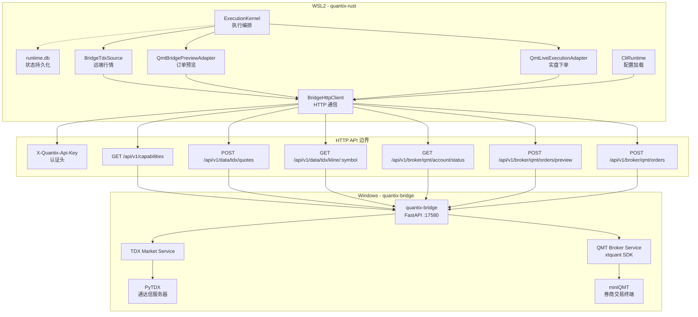
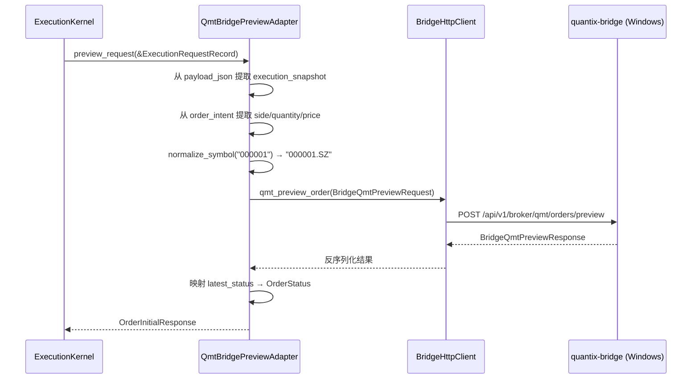
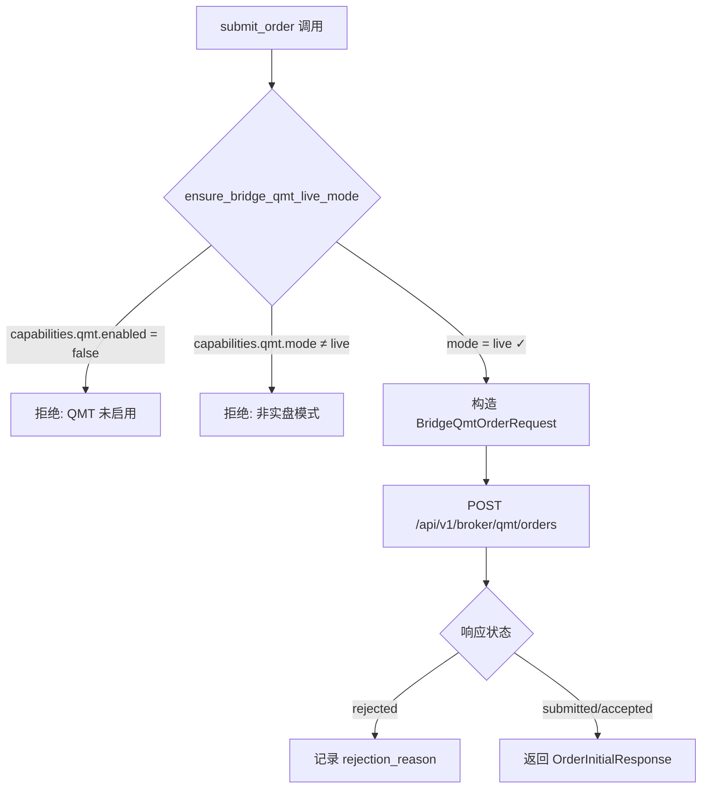

Quantix-Rust 以 WSL2 为核心运行环境，但通达信（TDX）行情接口与 QMT 券商交易 SDK 仅存在于 Windows 生态中。**Windows Bridge** 正是解决这一跨系统边界的关键架构层——它在 Windows 侧以 Python FastAPI 服务（`quantix-bridge`）的形式封装 TDX 行情读取与 QMT 订单预览/提交能力，通过 HTTP API 暴露给 WSL2 中的 Rust 应用消费。本文将深入剖析 Bridge 的分层设计、数据契约、安全门控机制，以及从 `BridgeHttpClient` 到 `ExecutionKernel` 的完整调用链路。

Sources: [WSL2_WINDOWS_BRIDGE_ARCHITECTURE.md](docs/architecture/WSL2_WINDOWS_BRIDGE_ARCHITECTURE.md#L1-L30), [QMT_LIVE_TRADING_SETUP.md](docs/QMT_LIVE_TRADING_SETUP.md#L1-L46)

## 架构总览与设计哲学

Windows Bridge 的核心设计哲学可归纳为两个词：**边界清晰、状态隔离**。Bridge 不是 quantix-rust 执行状态机的延伸，而是一个纯粹的**远端能力代理**——它只提供数据读取与券商接口探测，绝不拥有策略运行时、风控判定、订单生命周期或持仓快照等核心状态。这一边界约束在架构设计文档中被反复强调，确保 Bridge 不会膨胀为"第二套后端"。

整个系统分为三个逻辑层：**WSL2 Rust 层**（策略引擎 + 执行内核 + Bridge 客户端）、**HTTP API 边界**（API Key 认证 + JSON 契约）、**Windows Python 层**（TDX 服务 + QMT 服务）。以下 Mermaid 图展示了完整的组件关系与数据流向：



Sources: [WSL2_WINDOWS_BRIDGE_ARCHITECTURE.md](docs/architecture/WSL2_WINDOWS_BRIDGE_ARCHITECTURE.md#L116-L164), [daemon.rs](src/execution/daemon.rs#L223-L251)

## 设计目标与非目标

架构决策的第一步是明确**做什么**与**不做什么**。以下表格对比了 Bridge v1 的目标与非目标边界：

| 维度 | 目标（v1 范围） | 非目标（v1 明确不做） |
|------|-----------------|----------------------|
| **TDX 行情** | 通过 Bridge 读取实时行情与日线 K 线 | WebSocket 广播式实时推送 |
| **QMT 交易** | 订单预览（preview_only 模式）与合约验证 | 真实发单（live 模式为 v2+） |
| **状态所有权** | quantix-rust 保留全部核心状态 | 不迁移 runtime.db / 风控状态到 Windows |
| **传输协议** | HTTP 同步请求-响应 | gRPC / 双向流式通信 |
| **安全模型** | API Key + 本机绑定 + 显式配置 | 自动发现 / 匿名访问 |
| **执行生命周期** | `execution_request` → `ExecutionKernel` 不变 | Bridge 不复制交易状态机 |

这一约束的本质是：**先稳定边界，再扩展能力**。TDX 行情是 v1 真正交付的可运行能力，QMT preview 则是 v1 的契约验证目标——确保参数可映射、状态可归一化、错误可追踪，但不触碰真实券商副作用。

Sources: [WSL2_WINDOWS_BRIDGE_ARCHITECTURE.md](docs/architecture/WSL2_WINDOWS_BRIDGE_ARCHITECTURE.md#L34-L57)

## Bridge 客户端层：`src/bridge/`

Bridge 客户端层是 Rust 侧与 Windows 服务通信的唯一入口，由三个模块组成：

| 模块 | 文件 | 职责 |
|------|------|------|
| `client` | [client.rs](src/bridge/client.rs) | HTTP 请求封装、API Key 注入、超时与错误归一化 |
| `models` | [models.rs](src/bridge/models.rs) | Bridge 响应反序列化模型（含 TDX 行情、K 线、QMT 订单等） |
| `error` | [error.rs](src/bridge/error.rs) | 统一错误类型（`BridgeError::Config` / `BridgeError::Http`） |

### BridgeHttpClient 核心设计

`BridgeHttpClient` 是整个 Bridge 通信的核心。它在构造时接收 `base_url` 和可选的 `api_key`，所有后续请求自动注入 `X-Quantix-Api-Key` 请求头：

```rust
// src/bridge/client.rs — 构造与 capabilities 查询
pub struct BridgeHttpClient {
    client: Client,
    base_url: String,
    api_key: Option<String>,
}

impl BridgeHttpClient {
    pub fn new(base_url: String, api_key: Option<String>) -> Result<Self> {
        if base_url.trim().is_empty() {
            return Err(BridgeError::Config("bridge base_url cannot be empty".into()));
        }
        Ok(Self { client: Client::new(), base_url: base_url.trim_end_matches('/').to_string(), api_key })
    }
}
```

客户端暴露了完整的 API 方法集，涵盖 TDX 行情读取、QMT 账户查询、订单预览、实盘下单与撤单：

| 方法 | HTTP | 端点 | 功能 |
|------|------|------|------|
| `capabilities()` | GET | `/api/v1/capabilities` | 查询 Bridge 能力（TDX/QMT 状态） |
| `fetch_tdx_quotes()` | POST | `/api/v1/data/tdx/quotes` | 批量获取实时行情 |
| `fetch_tdx_kline()` | GET | `/api/v1/data/tdx/kline/{symbol}` | 获取 K 线数据 |
| `qmt_preview_order()` | POST | `/api/v1/broker/qmt/orders/preview` | 订单预览（不实际下单） |
| `qmt_submit_order()` | POST | `/api/v1/broker/qmt/orders` | 提交实盘订单 |
| `qmt_query_order()` | GET | `/api/v1/broker/qmt/orders/{id}` | 查询订单状态 |
| `qmt_cancel_order()` | DELETE | `/api/v1/broker/qmt/orders/{id}` | 撤销订单 |
| `qmt_account_status()` | GET | `/api/v1/broker/qmt/account/status` | 查询账户连接状态 |
| `qmt_positions()` | GET | `/api/v1/broker/qmt/positions` | 查询持仓 |
| `qmt_asset()` | GET | `/api/v1/broker/qmt/account/asset` | 查询资产 |

每个方法在实现上遵循统一模式：构造带 API Key 的请求 → 发送 → 错误状态检查 → JSON 反序列化。`base_url` 为空时直接返回 `BridgeError::Config`，防止运行时出现不可追踪的连接错误。

Sources: [client.rs](src/bridge/client.rs#L1-L206), [models.rs](src/bridge/models.rs#L1-L167), [error.rs](src/bridge/error.rs#L1-L13)

## TDX 行情桥接：`BridgeTdxSource`

`BridgeTdxSource` 是 Bridge 数据通道在**数据源层**的集成点，它实现了现有的 `Fetcher` trait，使得通过 Bridge 获取的 TDX 行情数据可以直接融入 quantix-rust 的数据源体系，与本地 TDX 直连、AkShare、东方财富等数据源处于同等地位。

### 符号格式转换

Bridge API 采用 `000001.SZ` / `600519.SH` 格式的符号标识，而 quantix-rust 内部使用纯数字代码（如 `000001`）加市场编号（`0` = 深圳, `1` = 上海）。`BridgeTdxSource` 内部维护了双向转换工具函数：

| 函数 | 方向 | 示例 |
|------|------|------|
| `format_symbol(market, code)` | 内部 → Bridge | `(0, "000001")` → `"000001.SZ"` |
| `infer_symbol(code)` | 纯代码 → Bridge | `"600519"` → `"600519.SH"`（6 开头为沪市） |
| `split_symbol(symbol)` | Bridge → 内部 | `"000001.SZ"` → `("000001", 0)` |

### 行情与 K 线数据流

**批量行情查询**（`fetch_quotes_batch`）接收 `[(market, code)]` 列表，转换为 Bridge 符号格式后调用 `fetch_tdx_quotes`，再将响应中的 `BridgeQuotePayload` 映射为内部 `StockQuote`。涨跌幅百分比由 `StockQuote::from_tdx` 在构造时自动计算。

**K 线数据查询**（`get_kline`）实现了 `Fetcher` trait 的同名方法，将日期范围参数格式化为 `%Y-%m-%d` 字符串，调用 Bridge K 线 API 后将 `BridgeKlineBarPayload` 映射为内部 `Kline` 结构，其中浮点价格字段通过 `Decimal::from_f64_retain` 安全转换为 `rust_decimal::Decimal`。

**连接健康检查**（`check_connection`）直接调用 `capabilities` 端点，成功即表示 Bridge 可达。

Sources: [bridge_tdx.rs](src/sources/bridge_tdx.rs#L1-L142)

## QMT 交易桥接：Preview 与 Live 双层架构

QMT 交易桥接分为两个阶段、两个适配器，体现了**渐进式安全开放**的设计理念：

### Preview 阶段：`QmtBridgePreviewAdapter`

`QmtBridgePreviewAdapter` 是 v1 阶段的 QMT 集成点，它从 `ExecutionRequestRecord` 的 frozen snapshot 中提取订单意图（symbol、side、quantity、price、order_type），构造 `BridgeQmtPreviewRequest` 发送到 Windows Bridge 的 preview 端点，返回的 `BridgeQmtPreviewResponse` 被映射为 `OrderInitialResponse`。



Preview 适配器**不实现 `ExecutionAdapter` trait**，它是一个独立的预览工具，由 CLI handler 直接调用，不参与 `ExecutionKernel` 的执行流。

Sources: [qmt_bridge.rs](src/execution/qmt_bridge.rs#L1-L93)

### Live 阶段：`QmtLiveExecutionAdapter` 与安全门控

`QmtLiveExecutionAdapter` 是真正的实盘执行适配器，它完整实现了 `ExecutionAdapter` trait 的三个方法：`submit_order`、`query_order`、`cancel_order`。它的关键安全机制是**双重门控**：

**第一道门控：`ensure_bridge_qmt_live_mode`**（[qmt_live_gate.rs](src/execution/qmt_live_gate.rs#L1-L25)）。每次 `submit_order` 调用前，适配器首先查询 Bridge 的 `capabilities` 端点，验证 `qmt.enabled == true` 且 `qmt.mode == "live"`。如果 Bridge 处于 `preview_only` 模式或 QMT 未启用，请求直接被拒绝，**不会产生任何券商副作用**。



**第二道门控：Bridge 配置约束**。Windows 侧的 `.env` 文件中 `BRIDGE_QMT_MODE` 决定了 Bridge 的运行模式，默认为 `preview_only`，需要显式设置为 `live` 才能启用真实发单。

| 状态映射 | Bridge `latest_status` | Rust `OrderStatus` |
|----------|----------------------|-------------------|
| 提交中 | `pending_submit` | `PendingSubmit`（由内核本地生成） |
| 已提交 | `submitted` | `Submitted` |
| 已接受 | `accepted` | `Accepted` |
| 部分成交 | `partially_filled` | `PartiallyFilled` |
| 全部成交 | `filled` | `Filled` |
| 已撤销 | `canceled` / `cancelled` | `Canceled` |
| 已拒绝 | `rejected` | `Rejected` |
| 未知 | 其他值 | `Unknown` |

`QmtLiveExecutionAdapter` 的 `response_to_initial` 方法还负责从 Bridge 响应中解析 `FillDetails`（含 fill_id、fill_price、commission、fees、venue、broker_fill_id 等字段），为后续的成交增量处理（`FillDeltaApplier`）提供完整数据。

Sources: [qmt_live_adapter.rs](src/execution/qmt_live_adapter.rs#L1-L391), [qmt_live_gate.rs](src/execution/qmt_live_gate.rs#L1-L25), [models.rs](src/execution/models.rs#L37-L78)

## 执行内核集成：Daemon 的多模式路由

`ExecutionDaemon` 是 Bridge 与执行内核的集成枢纽。在 `execute_request_by_id_with_components` 中，daemon 根据 `ExecutionRequestRecord.target_mode` 字段进行适配器选择：

```rust
// src/execution/daemon.rs — 简化的路由逻辑
let execution_result = match request.target_mode.as_str() {
    "paper" => {
        let adapter = PaperExecutionAdapter::new(TradeService::new(trade_store));
        let kernel = ExecutionKernel::new(store.clone(), adapter, risk);
        kernel.execute_request(prepared).await
    }
    "mock_live" => { /* MockLive 路径 */ }
    "qmt_live" => {
        let bridge_client = crate::cli::handlers::create_bridge_client()?;
        let adapter = QmtLiveExecutionAdapter::new(bridge_client);
        let kernel = ExecutionKernel::new(store.clone(), adapter, risk);
        kernel.execute_request(prepared).await
    }
    "live" => Err(QuantixError::Unsupported("请使用 qmt_live".to_string())),
    other => Err(QuantixError::Unsupported(format!("{other} 未实现"))),
};
```

这一设计的精妙之处在于：**无论选择哪种适配器，`ExecutionKernel` 的执行编排逻辑完全不变**——run 记录写入、signal 事件写入、风控评估、order 记录写入、order_event 状态追踪、fill-delta 处理全部由内核统一管理。QMT Live 适配器只是一个实现 `ExecutionAdapter` trait 的"执行插件"，它对内核来说与 Paper 适配器没有任何结构上的区别。

Sources: [daemon.rs](src/execution/daemon.rs#L179-L251), [kernel.rs](src/execution/kernel.rs#L96-L170)

## 运行时配置与 Bridge 启动

### WSL2 侧配置

Bridge 配置通过环境变量注入，由 `CliRuntime` 在启动时加载。关键常量定义在 `src/core/runtime.rs` 中：

| 环境变量 | 默认值 | 说明 |
|----------|--------|------|
| `QUANTIX_BRIDGE_BASE_URL` | `http://127.0.0.1:17580` | Bridge 服务地址 |
| `QUANTIX_BRIDGE_API_KEY` | `None`（可选） | API Key 认证凭据 |

`BridgeRuntimeSettings` 结构体通过 `from_env()` 加载这些配置，`create_bridge_client()` 工厂函数将其转换为 `BridgeHttpClient` 实例：

```rust
// src/cli/handlers/mod.rs — Bridge 客户端工厂
pub fn create_bridge_client() -> Result<BridgeHttpClient> {
    let runtime = CliRuntime::load();
    BridgeHttpClient::new(runtime.bridge.base_url, runtime.bridge.api_key)
        .map_err(|err| QuantixError::Other(err.to_string()))
}
```

### Windows 侧配置与启动

Windows Bridge（`quantix-bridge`）是一个独立的 Python FastAPI 项目，部署路径通常为 `D:\mystocks\quantix\quantix_bridge\`。核心配置通过 `.env` 文件管理：

```bash
# Bridge 服务配置
BRIDGE_SERVER_HOST=127.0.0.1
BRIDGE_SERVER_PORT=17580
BRIDGE_API_KEY=                    # 可选，留空则不验证

# TDX 行情（通过 PyTDX，无需 QMT 客户端）
BRIDGE_TDX_ENABLED=true

# QMT 交易（需要 miniQMT 客户端登录）
BRIDGE_QMT_ENABLED=true
BRIDGE_QMT_MODE=preview_only       # 首期使用 preview_only
BRIDGE_QMT_USERDATA_PATH=D:\\国金QMT交易端模拟\\userdata_mini
BRIDGE_QMT_ACCOUNT_ID=40330341
```

启动命令：

```powershell
cd D:\mystocks\quantix\quantix_bridge
uv run uvicorn app.main:app --host 127.0.0.1 --port 17580
```

**重要提示**：TDX 行情通过 PyTDX 独立获取，无需启动 QMT 客户端。只有执行 QMT 交易时才需要 QMT 客户端登录。

Sources: [runtime.rs](src/core/runtime.rs#L69-L121), [handlers/mod.rs](src/cli/handlers/mod.rs#L838-L842), [QMT_LIVE_TRADING_SETUP.md](docs/QMT_LIVE_TRADING_SETUP.md#L131-L163)

## Windows Bridge API 契约

### 能力发现端点

`GET /api/v1/capabilities` 是所有 Bridge 交互的起点，返回当前启用能力：

```json
{
  "tdx": {
    "enabled": true,
    "supports": ["quote", "batch_quotes", "kline"]
  },
  "qmt": {
    "enabled": true,
    "mode": "preview_only",
    "supports": ["account_status", "order_preview"]
  }
}
```

`qmt.mode` 的值决定了 Rust 侧的行为边界：`preview_only` 模式下 `QmtLiveExecutionAdapter` 的安全门控会拒绝所有提交请求；只有 `live` 模式才允许真实发单。

Sources: [WSL2_WINDOWS_BRIDGE_ARCHITECTURE.md](docs/architecture/WSL2_WINDOWS_BRIDGE_ARCHITECTURE.md#L342-L358), [qmt_live_gate.rs](src/execution/qmt_live_gate.rs#L4-L24)

### TDX 行情端点

**批量行情**（`POST /api/v1/data/tdx/quotes`）接收 `{"symbols": ["000001.SZ", "600519.SH"]}` 格式请求，返回包含 symbol、name、last、bid、ask、open、high、low、pre_close、volume、turnover、timestamp、source 的完整行情数据。

**K 线数据**（`GET /api/v1/data/tdx/kline/{symbol}?period=1d&start=2026-03-01&end=2026-03-26`）返回指定时间范围内的 OHLCV 数据，每根 K 线包含 datetime、open、high、low、close、volume、turnover 字段。

### QMT 交易端点

| 端点 | 方法 | 功能 | 数据模型 |
|------|------|------|----------|
| `/broker/qmt/account/status` | GET | 账户连接状态 | `BridgeQmtAccountStatusResponse` |
| `/broker/qmt/account/asset` | GET | 资产信息（总资产/现金/市值） | `BridgeQmtAsset` |
| `/broker/qmt/positions` | GET | 持仓列表 | `Vec<BridgeQmtPosition>` |
| `/broker/qmt/orders/preview` | POST | 订单预览（不实际下单） | `BridgeQmtPreviewResponse` |
| `/broker/qmt/orders` | POST | 提交实盘订单 | `BridgeQmtOrderResponse` |
| `/broker/qmt/orders/{id}` | GET | 查询订单状态 | `BridgeQmtOrderQueryResponse` |
| `/broker/qmt/orders/{id}` | DELETE | 撤销订单 | `BridgeQmtCancelResponse` |

Sources: [WSL2_WINDOWS_BRIDGE_ARCHITECTURE.md](docs/architecture/WSL2_WINDOWS_BRIDGE_ARCHITECTURE.md#L318-L504), [models.rs](src/bridge/models.rs#L65-L167)

## 安全架构

Bridge 的安全设计遵循**默认最小暴露**原则：

1. **API Key 认证**：所有业务端点要求 `X-Quantix-Api-Key` 请求头，未携带时 Bridge 返回 401。`GET /health` 仅暴露基础健康状态，不泄露敏感信息。

2. **网络隔离**：Bridge 默认绑定 `127.0.0.1:17580`，不开放到局域网。从 WSL2 访问时，Windows 的 `127.0.0.1` 与 WSL2 的 `127.0.0.1` 在 Windows 11 22H2+ 版本中默认互通（通过 WSL2 的 localhost 转发特性）。

3. **显式配置优先**：`QUANTIX_BRIDGE_BASE_URL` 必须显式设置或使用默认值，代码中**不依赖** `/etc/resolv.conf` 自动发现 Windows host IP，也不硬编码任何 `172.x.x.x` 地址。

4. **日志脱敏**：Windows Bridge 在日志中不记录账号密码、API Key、完整请求 payload。

5. **防火墙限制**：若需开放到 WSL2 网段，防火墙规则应限定到必要端口和必要网段，不建议一次性放开范围端口。

Sources: [WSL2_WINDOWS_BRIDGE_ARCHITECTURE.md](docs/architecture/WSL2_WINDOWS_BRIDGE_ARCHITECTURE.md#L569-L603), [client.rs](src/bridge/client.rs#L43-L53)

## 测试策略

Bridge 相关测试分为三层：

### 单元测试（wiremock Mock Server）

使用 `wiremock` 库在本地启动 Mock HTTP Server，模拟 Bridge 的 API 响应，验证 Rust 侧的数据映射、错误处理和门控逻辑：

| 测试文件 | 覆盖范围 |
|----------|----------|
| [bridge_client_test.rs](tests/bridge_client_test.rs) | `BridgeHttpClient` capabilities 查询 + API Key 注入 |
| [bridge_tdx_source_test.rs](tests/bridge_tdx_source_test.rs) | `BridgeTdxSource` 行情/K线映射 + 符号格式转换 |
| [qmt_bridge_preview_test.rs](tests/qmt_bridge_preview_test.rs) | `QmtBridgePreviewAdapter` 从 frozen snapshot 提取订单意图 |
| [qmt_live_adapter_test.rs](tests/qmt_live_adapter_test.rs) | `QmtLiveExecutionAdapter` 提交/拒绝/状态映射 |
| [qmt_live_gate_test.rs](tests/qmt_live_gate_test.rs) | `ensure_bridge_qmt_live_mode` 安全门控 |

### 集成测试（需运行 Bridge 服务）

[bridge_integration_test.rs](tests/bridge_integration_test.rs) 包含需要真实 Windows Bridge 服务运行的端到端测试（标记为 `#[ignore]`），覆盖 capabilities、账户状态、持仓查询、资产查询等真实场景。

### 验证命令

从 WSL2 通过 curl 快速验证 Bridge 连通性：

```bash
curl -s http://127.0.0.1:17580/health | jq .
curl -s http://127.0.0.1:17580/api/v1/capabilities | jq .
curl -s http://127.0.0.1:17580/api/v1/broker/qmt/account/status | jq .
```

Sources: [bridge_client_test.rs](tests/bridge_client_test.rs#L1-L59), [qmt_live_adapter_test.rs](tests/qmt_live_adapter_test.rs#L1-L97), [bridge_integration_test.rs](tests/bridge_integration_test.rs#L1-L87)

## 故障排查指南

| 症状 | 可能原因 | 排查路径 |
|------|----------|----------|
| Connection refused | Bridge 未启动 / 端口被阻 | 检查 `netstat -ano \| findstr 17580`；确认 uvicorn 进程运行 |
| 401 Unauthorized | API Key 缺失或不匹配 | 检查 `QUANTIX_BRIDGE_API_KEY` 与 Bridge 侧 `BRIDGE_API_KEY` 一致 |
| `QMT 实盘下单被拒绝: bridge qmt.mode=preview_only` | Bridge 处于预览模式 | 修改 `.env` 中 `BRIDGE_QMT_MODE=live` 并重启 |
| `connected: false` | QMT 客户端未登录 | 启动 QMT 客户端并确认 miniQMT 目录正确 |
| `request 缺少 execution_snapshot` | 请求 payload 格式错误 | 确认 `ExecutionRequestRecord.payload_json` 包含完整 snapshot |
| TDX 数据格式异常 | Bridge 侧归一化失败 | 检查 Bridge 日志；确认 PyTDX 连接正常 |

Sources: [QMT_LIVE_TRADING_SETUP.md](docs/QMT_LIVE_TRADING_SETUP.md#L404-L470)

## 延伸阅读

- [执行适配器架构（Paper / MockLive / QMT Bridge）](12-zhi-xing-gua-pei-qi-jia-gou-paper-mocklive-qmt-bridge) — 了解 `ExecutionAdapter` trait 的完整设计与 Paper/MockLive 实现
- [ExecutionKernel 执行决策核心与订单生命周期](11-executionkernel-zhi-xing-jue-ce-he-xin-yu-ding-dan-sheng-ming-zhou-qi) — 深入执行内核的编排逻辑与状态追踪
- [多数据源适配器（TDX / AkShare / 东方财富 / WebSocket）](7-duo-shu-ju-yuan-gua-pei-qi-tdx-akshare-dong-fang-cai-fu-websocket) — Bridge TDX 在数据源生态中的定位
- [策略守护进程、Signal Daemon 与 systemd 服务管理](13-ce-lue-shou-hu-jin-cheng-signal-daemon-yu-systemd-fu-wu-guan-li) — Daemon 如何驱动 Bridge 集成的执行流程