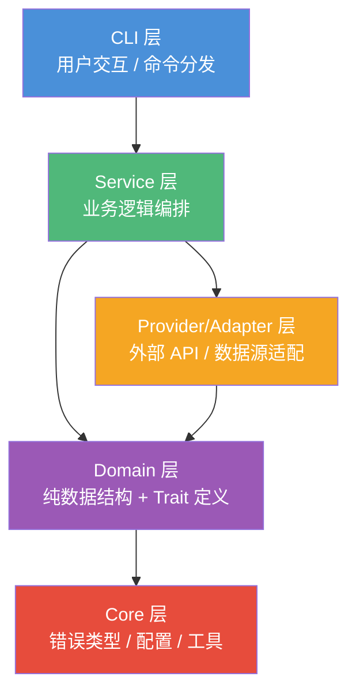
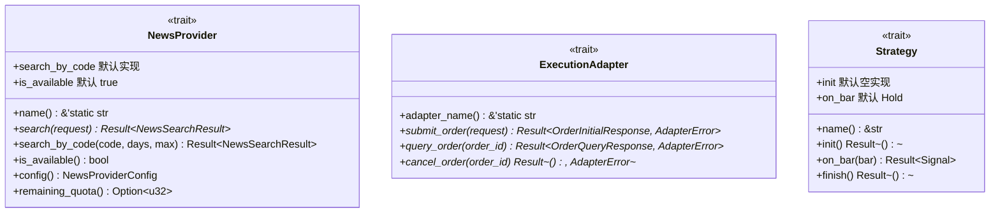
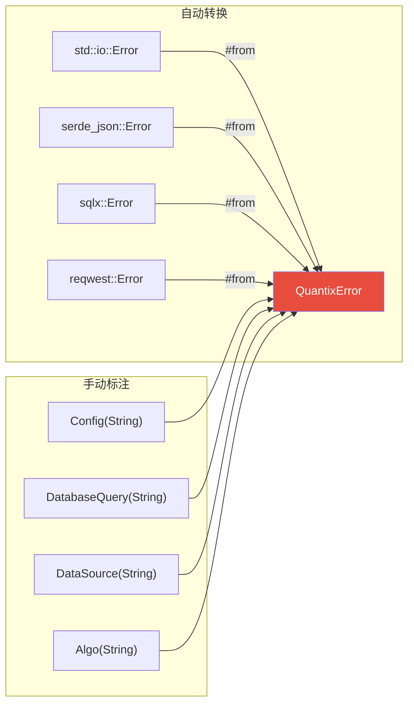
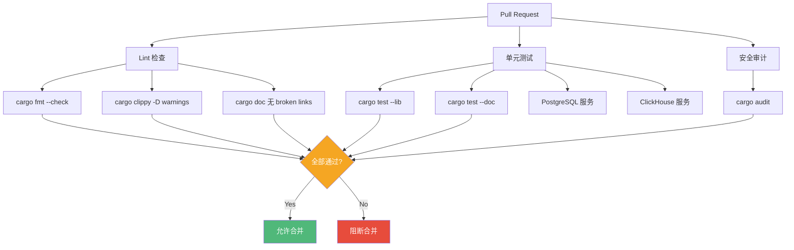

本文档系统阐述 quantix-rust 项目在 Rust 工程实践中所遵循的编码规范，涵盖**文件行数限制与拆分策略**、**模块组织与依赖层级**、**类型安全与 Trait 设计**三大核心领域。这些规范不是抽象的理论准则，而是从 222 个源文件、64,000+ 行代码的实际开发中沉淀出的工程约束，通过 `clippy`、`rustfmt`、CI 流水线三层机制强制执行。理解并内化这些规范，是参与本项目开发的必要前提。

Sources: [RUST_CODING_STANDARDS.md](docs/RUST_CODING_STANDARDS.md#L1-L508), [DEVELOPMENT_GUIDELINES.md](docs/standards/DEVELOPMENT_GUIDELINES.md#L1-L200)

---

## 文件行数限制：量化阈值与拆分策略

quantix-rust 对不同类型的文件设定了**两级阈值**——"考虑拆分"与"强制拆分"——而非一刀切的单一限制。这种分层的策略既保证了代码的可维护性，又避免了过度拆分带来的模块碎片化问题。

### 文件行数阈值表

| 文件类型 | 考虑拆分 | 强制拆分 | 设计意图 |
|----------|---------|---------|----------|
| `.rs` 模块文件 | > 500 行 | > 800 行 | 含 `mod.rs`，单文件承载单一关注点 |
| 单一 struct/enum 实现 | > 300 行 | > 500 行 | trait impl 应拆到独立文件 |
| `handlers.rs` (CLI/路由) | > 800 行 | > 1200 行 | 按功能拆为 `handlers/xxx.rs` |
| `lib.rs` / `main.rs` | > 100 行 | > 150 行 | 仅保留 mod 声明和 re-export |
| 测试文件 `*_test.rs` | > 500 行 | > 1000 行 | 按测试模块拆分 |
| `Cargo.toml` | — | — | 依赖超过 40 个须审查必要性 |

项目当前的实际数据佐证了这些阈值的有效性：入口文件 [lib.rs](src/lib.rs#L1-L50) 仅 50 行、[main.rs](src/main.rs#L1-L24) 仅 24 行，完全符合"精简入口"原则。绝大多数 `mod.rs` 文件控制在 50 行以内（如 [news/mod.rs](src/news/mod.rs#L1-L15) 为 15 行、[market/mod.rs](src/market/mod.rs#L1-L11) 为 11 行），仅承担模块声明与类型重导出职责。

Sources: [RUST_CODING_STANDARDS.md](docs/RUST_CODING_STANDARDS.md#L7-L43), [lib.rs](src/lib.rs#L1-L50), [main.rs](src/main.rs#L1-L24)

### 拆分策略：四项核心原则

当文件触及阈值时，项目遵循四项拆分原则执行重构。这些原则不是孤立的规则，而是一套相互支撑的组织体系：

**1. 按职责拆分**：`types`（数据结构定义）、`traits`（行为抽象）、`service`（业务逻辑编排）各归其位。典型案例如 `market` 模块的结构——[models.rs](src/market/models.rs) 管理数据类型、[service.rs](src/market/service.rs) 封装业务逻辑、[sentiment/](src/market/sentiment/mod.rs) 作为子模块封装舆情分析能力。

**2. mod.rs 纯净**：`mod.rs` **仅允许** `pub mod` 声明和 `pub use` 重导出，**禁止**嵌入任何业务逻辑。以 [risk/mod.rs](src/risk/mod.rs#L1-L39) 为例——39 行代码全部是模块声明和类型重导出，将 `RiskService`、`RiskStore`、`IndustryResolver` 等核心类型通过 `pub use` 提升到模块层级。

**3. 单文件单一关注点**：一个文件只做一个事情——定义类型、实现 trait、或编写业务逻辑。这一原则的典型体现是策略模块：[trait_def.rs](src/strategy/trait_def.rs) 定义 `Strategy` trait 和 `Signal` 枚举，而 [ma_cross.rs](src/strategy/ma_cross.rs)、[breakout.rs](src/strategy/breakout.rs) 等文件各自实现具体策略。

**4. handlers/ 目录模式**：当 handler 文件超过阈值，从扁平的 `handlers.rs` 拆为 `handlers/mod.rs` + `handlers/xxx.rs` 的目录结构。项目的 [cli/handlers/](src/cli/handlers/mod.rs) 便是这一模式的实际应用——主分发文件虽然较大（5615 行），但已按 `risk.rs`、`account.rs`、`algo.rs` 等功能子文件进行组织。

```
# 拆分后的标准结构（以 market 为例）
src/market/
├── mod.rs          # 仅 mod 声明 + pub use（11 行）
├── models.rs       # 数据结构定义
├── service.rs      # 业务逻辑
└── sentiment/      # 子模块（嵌套拆分）
    ├── mod.rs      # 子模块入口（12 行）
    ├── types.rs    # 舆情数据类型
    ├── provider.rs # Trait 定义
    └── aggregator.rs # 聚合逻辑
```

Sources: [RUST_CODING_STANDARDS.md](docs/RUST_CODING_STANDARDS.md#L37-L43), [risk/mod.rs](src/risk/mod.rs#L1-L39), [strategy/trait_def.rs](src/strategy/trait_def.rs#L1-L38)

---

## 模块组织：声明秩序与依赖层级

模块组织不仅关乎文件布局，更决定了代码的**认知负荷**和**编译隔离**效率。quantix-rust 通过严格的声明顺序、入口纯净性和单向依赖层级三重约束，构建了可预测的模块架构。

### mod.rs 声明顺序规范

每个 `mod.rs` 内部遵循固定顺序，使开发者能在任何模块中快速定位内容：

```rust
// ── 第一段：子模块声明（按字母序） ──
pub mod aggregator;
pub mod cache;
pub mod provider;
pub mod types;

// ── 第二段：类型重导出（按使用频率排序） ──
pub use types::{NewsArticle, NewsSearchRequest};
pub use provider::NewsProvider;
pub use aggregator::NewsAggregator;
```

这一模式在 [news/mod.rs](src/news/mod.rs#L1-L15) 中得到精确体现：5 个 `pub mod` 声明 + 4 行 `pub use` 重导出，总计 15 行。重导出使得外部消费者可以直接写 `use quantix_cli::news::NewsProvider`，而非深入到 `news::provider::NewsProvider`，降低了模块间的耦合深度。

Sources: [RUST_CODING_STANDARDS.md](docs/RUST_CODING_STANDARDS.md#L48-L62), [news/mod.rs](src/news/mod.rs#L1-L15)

### lib.rs 与 main.rs：极简入口

入口文件的规范最为严格——**禁止**在 `lib.rs` 中写业务逻辑、**禁止**超过 150 行。合法内容仅限三类：`pub mod` 声明、`pub use` 重导出、模块级文档注释。

项目的 [lib.rs](src/lib.rs#L1-L50) 完美遵循这一规范：1-16 行是模块级文档注释，17-43 行是 26 个 `pub mod` 声明，45-49 行是核心类型的 `pub use` 重导出（`Cli`、`QuantixError`、`Result`、`models::*`、`sources::*`）。[main.rs](src/main.rs#L1-L24) 同样精简——24 行代码完成日志初始化和 CLI 命令分发，所有业务逻辑委托给 `Cli::parse().run().await`。

Sources: [RUST_CODING_STANDARDS.md](docs/RUST_CODING_STANDARDS.md#L64-L78), [lib.rs](src/lib.rs#L1-L50), [main.rs](src/main.rs#L1-L24)

### 单向依赖层级

项目强制执行单向依赖规则，通过五层架构保证依赖方向的清晰性：



依赖方向的约束可以简化为一句话：**上层可以依赖下层，下层禁止依赖上层，同层之间通过 Core 层解耦**。具体的依赖关系验证如下：

| 依赖方向 | 示例 | 状态 |
|----------|------|------|
| CLI → Service | [cli/handlers](src/cli/handlers/mod.rs) 调用 [MarketService](src/market/service.rs) | ✅ 合法 |
| Service → Provider | [MarketService](src/market/service.rs) 使用 [EastMoneySource](src/sources/eastmoney.rs) | ✅ 合法 |
| Service → Domain | [RiskService](src/risk/service.rs) 操作 [RiskRule](src/risk/models.rs) 数据结构 | ✅ 合法 |
| Domain → Core | [models.rs](src/data/models.rs) 引用 [QuantixError](src/core/error.rs) | ✅ 合法 |
| Service ↔ CLI 双向 | — | ❌ 禁止 |
| A → B → C → A 环路 | — | ❌ 禁止 |

Sources: [RUST_CODING_STANDARDS.md](docs/RUST_CODING_STANDARDS.md#L80-L101), [core/error.rs](src/core/error.rs#L1-L58)

### 条件编译与 Feature Gate

可选功能必须通过 Cargo feature gate 保护，确保核心构建不受可选依赖的影响。项目的 [Cargo.toml](Cargo.toml#L98-L104) 定义了 5 个 feature：`postgresql`（默认启用）、`sqlite`、`tdengine-ws`、`tdengine-rest`（默认启用）、`tui`。其中 `tui` feature 通过 `ratatui` 和 `crossterm` 的可选依赖实现终端 UI 功能的隔离编译。

Sources: [Cargo.toml](Cargo.toml#L98-L104), [RUST_CODING_STANDARDS.md](docs/RUST_CODING_STANDARDS.md#L486-L490)

---

## 类型安全：强类型约束与 Trait 设计

类型安全是 Rust 的核心优势，quantix-rust 在金融场景下将这一优势发挥到了极致——从**拒绝浮点数**到**枚举替代魔法值**，从**统一错误类型**到**Trait 抽象隔离**，每一层都有明确的类型约束。

### 金融类型安全：Decimal 优先原则

量化交易对数值精度有着极其严苛的要求——`f64` 的 IEEE 754 浮点表示在金额计算中会导致不可接受的精度丢失。项目为此确立了**Decimal 优先**原则：所有价格和金额字段**必须**使用 `rust_decimal::Decimal`，整数数量使用 `i64`。

```rust
// ✅ 正确：K线数据使用 Decimal
pub struct Kline {
    pub open: Decimal,    // 开盘价
    pub high: Decimal,    // 最高价
    pub low: Decimal,     // 最低价
    pub close: Decimal,   // 收盘价
    pub volume: i64,      // 成交量（整数）
    pub amount: Option<Decimal>,  // 成交额
}

// ❌ 禁止：使用 f64 可能导致精度丢失
pub struct OrderBad {
    pub price: f64,  // 危险！
}
```

项目的 [data/models.rs](src/data/models.rs#L1-L112) 完整贯彻了这一原则：`Kline`、`Tick` 的所有价格字段均为 `Decimal`。同样，[execution/adapter.rs](src/execution/adapter.rs#L1-L64) 中的 `AdapterOrderRequest` 使用 `Decimal` 表示订单价格，`OrderInitialResponse` 的 `avg_fill_price` 也是 `Option<Decimal>`——精确到小数点的成交均价不允许任何精度妥协。

Sources: [DEVELOPMENT_GUIDELINES.md](docs/standards/DEVELOPMENT_GUIDELINES.md#L127-L200), [data/models.rs](src/data/models.rs#L1-L112), [execution/adapter.rs](src/execution/adapter.rs#L1-L64)

### 枚举替代魔法值

项目通过**枚举类型**消灭了所有"魔法字符串"和"魔法数字"的使用。这一模式在交易领域尤为关键——订单状态、交易方向、信号类型等概念天然适合枚举表达。

以 [execution/models.rs](src/execution/models.rs#L1-L200) 为例，该文件定义了交易领域的一整套枚举体系：

| 枚举类型 | 变体数量 | 用途 |
|----------|---------|------|
| `OrderStatus` | 9 | 订单完整生命周期状态机 |
| `OrderSide` | 2 | 买卖方向 |
| `OrderType` | 2 | 限价/市价 |
| `SignalStatus` | 3 | 信号生命周期 |
| `ApprovalStatus` | 3 | 审批流程 |
| `ExecutionRequestStatus` | 5 | 执行请求状态 |
| `StrategyRunStatus` | 3 | 策略运行状态 |

每个枚举都配套实现了 `as_str()` 和 `from_str()` 方法，用于序列化边界（数据库存储、JSON 传输）的字符串转换，而在业务逻辑层始终使用类型安全的枚举变体。

Sources: [DEVELOPMENT_GUIDELINES.md](docs/standards/DEVELOPMENT_GUIDELINES.md#L173-L201), [execution/models.rs](src/execution/models.rs#L1-L200)

### Serde 序列化约束

所有公共数据结构必须派生必要的 trait，并遵循 serde 命名规范：

```rust
// ✅ 公共类型必须 derive 必要 trait
#[derive(Debug, Clone, Serialize, Deserialize)]
pub struct NewsArticle { ... }

// ✅ 枚举使用 snake_case 序列化
#[derive(Debug, Clone, Serialize, Deserialize)]
#[serde(rename_all = "snake_case")]
pub enum WatchlistAction {
    Add, Remove, Move, TagAdd, TagRemove, GroupCreate,
}
```

项目的 [watchlist/models.rs](src/watchlist/models.rs#L1-L67) 和 [news/types.rs](src/news/types.rs#L1-L200) 是这一模式的典范——每个结构体都精确标注了 `Serialize`/`Deserialize`，枚举统一使用 `#[serde(rename_all = "snake_case")]`，确保 JSON 输出风格的一致性。

Sources: [RUST_CODING_STANDARDS.md](docs/RUST_CODING_STANDARDS.md#L104-L127), [watchlist/models.rs](src/watchlist/models.rs#L1-L67), [news/types.rs](src/news/types.rs#L1-L200)

### Trait 设计：抽象隔离与默认实现

项目的 Trait 设计遵循三大原则：**独立文件定义**、**async_trait 标注异步方法**、**提供合理默认实现**。这一设计使得新增外部适配器时只需实现少量核心方法，其余方法自动获得默认行为。



三个核心 Trait 的实际代码模式：

**NewsProvider**（[news/provider.rs](src/news/provider.rs#L1-L61)）：`search` 是唯一必须实现的核心方法，`search_by_code` 提供了基于 `search` 的默认组合实现，`is_available` 默认返回 `true`。这使得新的新闻源接入只需实现 `name()` + `search()` + `config()` 即可。

**ExecutionAdapter**（[execution/adapter.rs](src/execution/adapter.rs#L1-L64)）：定义了 `submit_order`、`query_order`、`cancel_order` 三个核心异步方法，使用独立的 `AdapterError` 错误类型（而非全局 `QuantixError`），体现了**领域错误隔离**的设计——适配器层的错误不需要污染全局错误空间。

**Strategy**（[strategy/trait_def.rs](src/strategy/trait_def.rs#L1-L38)）：`init`、`on_bar`、`finish` 均提供默认实现（空操作或返回 `Hold`），策略实现者可以按需覆盖。

所有 Trait 都标注了 `Send + Sync` 约束和 `#[async_trait]`，确保异步安全和跨线程兼容。

Sources: [news/provider.rs](src/news/provider.rs#L1-L61), [execution/adapter.rs](src/execution/adapter.rs#L1-L64), [strategy/trait_def.rs](src/strategy/trait_def.rs#L1-L38)

### Builder 模式与显式类型标注

项目在数据构造中广泛使用 **Builder 模式**（通过 `with_xxx` 链式调用），确保不可变性约束的同时提供流畅的 API 体验。[news/types.rs](src/news/types.rs#L56-L128) 中的 `NewsSearchRequest` 是典型案例：

```rust
let request = NewsSearchRequest::new("000001")
    .with_code("000001")
    .with_days(7)
    .with_max_results(50);
```

配合**显式类型标注**规范——公共 API 的返回类型、公共 struct 的字段类型必须显式标注——确保接口契约的清晰性。内部实现允许类型推导，但建议标注以提高可读性。

Sources: [news/types.rs](src/news/types.rs#L56-L128), [RUST_CODING_STANDARDS.md](docs/RUST_CODING_STANDARDS.md#L154-L171)

---

## 错误处理：统一类型与红线规则

### QuantixError 统一错误体系

项目使用 `thiserror` 构建了统一的错误类型 [QuantixError](src/core/error.rs#L1-L58)，通过 `pub type Result<T> = std::result::Result<T, QuantixError>` 为全项目提供一致的错误返回签名。该体系的设计遵循**自动转换 + 手动标注**的混合策略：



自动转换的 `#[from]` 属性使得外部库错误可以直接通过 `?` 运算符无缝传播；而 `Config`、`DatabaseQuery`、`DataSource` 等手动变体则用于包装需要上下文描述的业务错误。特别值得注意的是 `Algo` 变体——它通过 [手动 `From` impl](src/core/error.rs#L53-L57) 从 `execution::algo::AlgoError` 转换，实现了领域错误向上传播的同时保持了错误链的完整性。

Sources: [core/error.rs](src/core/error.rs#L1-L58), [RUST_CODING_STANDARDS.md](docs/RUST_CODING_STANDARDS.md#L175-L217)

### 错误处理红线

| 规则 | 要求 | 违反后果 |
|------|------|---------|
| **禁止 `unwrap()`** | 生产代码使用 `?` 或 `map_err` | CI clippy `-D warnings` 阻断 |
| **禁止 `panic!()`** | 业务逻辑使用 `Result` 传播 | 代码评审驳回 |
| **错误上下文** | `map_err` 必须附加描述性信息 | 可读性降级 |
| **禁止吞错误** | 禁止 `let _ = may_fail()`，必须至少 log | 静默故障风险 |
| **CLI 层兜底** | CLI handler 最外层打印用户友好信息 | 用户体验问题 |

正确的错误处理范式在项目中有统一模板：

```rust
// ✅ 带上下文的错误传播
let config = std::fs::read_to_string(path)
    .map_err(|e| QuantixError::Other(format!("读取配置失败 {}: {}", path, e)))?;

// ✅ 不吞错误，至少记录日志
if let Err(e) = sender.send(msg) {
    tracing::warn!("发送消息失败: {}", e);
}
```

Sources: [RUST_CODING_STANDARDS.md](docs/RUST_CODING_STANDARDS.md#L196-L217), [DEVELOPMENT_GUIDELINES.md](docs/standards/DEVELOPMENT_GUIDELINES.md#L100-L126)

---

## 质量门禁：三层强制执行

编码规范如果没有自动化执行机制，就会沦为"文档中的愿望"。quantix-rust 通过 **rustfmt → clippy → CI 流水线** 三层质量门禁，将规范转化为不可绕过的工程约束。

### 第一层：rustfmt 格式化

[rustfmt.toml](config/rustfmt.toml#L1-L87) 定义了项目的格式化规则，关键配置包括：

| 配置项 | 值 | 意义 |
|--------|-----|------|
| `max_width` | 120 | 行宽上限，比默认 100 更宽松以适应长链式调用 |
| `tab_spaces` | 4 | 缩进空格数 |
| `reorder_imports` | true | 导入语句自动按字母排序 |
| `reorder_modules` | true | 模块声明自动排序 |
| `imports_granularity` | "Crate" | 同 crate 的导入合并为一个 `use` 语句 |
| `group_imports` | "StdExternalCrate" | 标准库/外部 crate/内部模块分组 |
| `use_field_init_shorthand` | true | 字段初始化简写 `Foo { bar }` 而非 `Foo { bar: bar }` |
| `version` | "Two" | rustfmt 版本 2（支持更多配置项） |

Sources: [rustfmt.toml](config/rustfmt.toml#L1-L87)

### 第二层：Clippy Lint 检查

[clippy.toml](config/clippy.toml#L1-L116) 配置了项目特定的 Lint 阈值，为量化交易场景的复杂业务逻辑设定了合理的认知复杂度和参数数量上限。关键配置包括：

| 配置项 | 值 | 意义 |
|--------|-----|------|
| `cognitive-complexity-threshold` | 50 | 适应量化场景的复杂业务逻辑 |
| `type-complexity-threshold` | 250 | 允许较复杂的泛型组合 |
| `too-many-arguments-threshold` | 10 | 函数参数上限 |
| `too-many-lines-threshold` | 100 | 单函数行数上限 |
| `warn-on-all-wildcard-imports` | true | 通配符导入告警 |

CI 中以 `cargo clippy --all-targets --all-features -- -D warnings` 运行，**所有 warning 视为错误**，任何 Lint 违规都会阻断合并。

Sources: [clippy.toml](config/clippy.toml#L1-L116), [ci.yml](.github/workflows/ci.yml#L57-L61)

### 第三层：CI 流水线完整门禁

[CI 流水线](.github/workflows/ci.yml#L1-L431) 定义了完整的质量门禁，PR 合并前必须全部通过：



CI 的关键执行矩阵如下：

| Job | 触发条件 | 核心检查 |
|-----|---------|---------|
| **Lint** | 所有 PR | `cargo fmt --check` + `cargo clippy -D warnings` + 文档 link 检查 |
| **Test** | 所有 PR | 单元测试 + doc 测试，配备 PostgreSQL 17 + ClickHouse 服务容器 |
| **Security** | 所有 PR | `cargo audit` 安全漏洞扫描 |
| **Coverage** | main 分支 push | `cargo tarpaulin` 覆盖率收集并上传 Codecov |
| **Build** | main/develop push | 三平台 Release 构建（Linux/macOS/Windows） |
| **Bench** | main push + 定时 | `cargo bench` 性能基准测试，超 150% 回归自动告警 |
| **Docs** | main push | `cargo doc` 生成并部署到 GitHub Pages |

Sources: [ci.yml](.github/workflows/ci.yml#L1-L431)

### 命名规范速查表

| 项 | 规范 | 项目中的示例 |
|----|------|-------------|
| Struct | UpperCamelCase | `MarketService`, `NewsAggregator`, `ExecutionAdapter` |
| Enum | UpperCamelCase | `OrderStatus`, `Signal`, `AdjustType` |
| Enum variant | UpperCamelCase | `PendingSubmit`, `PartiallyFilled`, `QFQ` |
| Trait | UpperCamelCase + 名词/能力 | `NewsProvider`, `ExecutionAdapter`, `Strategy` |
| 函数/方法 | snake_case | `search_by_code`, `evaluate_volatility_limit` |
| 常量 | SCREAMING_SNAKE_CASE | `MAX_RETRIES`, `VOLATILITY_ATR_PERIOD`, `WATCHLIST_STORE_VERSION` |
| 模块 | snake_case | `market`, `fundamental`, `execution` |
| 文件名 | snake_case | `code_resolver.rs`, `kline_aggregator.rs` |

Sources: [RUST_CODING_STANDARDS.md](docs/RUST_CODING_STANDARDS.md#L142-L153)

---

## 日志与异步编程规范

### 日志分层策略

项目严格区分了三种输出场景：CLI 面向用户的输出使用 `println!`/`eprintln!`，库/服务内部日志使用 `tracing` 框架（`info!`/`warn!`/`error!`/`debug!`），**库模块中禁止使用 `println!`**。这一分层确保了库代码的可嵌入性——当 quantix-cli 被其他项目作为依赖引入时，不会出现无法控制的 stdout 输出。

错误信息的语言规范同样明确：面向用户的消息使用中文，日志/调试信息中英文均可，commit message 使用英文。

Sources: [RUST_CODING_STANDARDS.md](docs/RUST_CODING_STANDARDS.md#L221-L246)

### 异步编程约束

异步 Trait 使用 `#[async_trait]` 标注，普通 async 函数直接声明。并发规范要求：独立请求使用 `tokio::join!` 并发执行，共享状态使用 `Arc<RwLock<T>>` 或 `Arc<Mutex<T>>`，async 函数内禁止阻塞操作（文件 IO 使用 `tokio::fs`），所有外部 API 调用必须设置超时保护。

Sources: [RUST_CODING_STANDARDS.md](docs/RUST_CODING_STANDARDS.md#L249-L279)

---

## 规则速查卡与红线总览

将所有规范浓缩为可快速查阅的决策树：

```
文件超 800 行？           → 按职责拆分
lib.rs 超 150 行？        → 精简为纯 mod 声明
mod.rs 含业务逻辑？       → 提取到 service.rs
用 unwrap()?             → 改用 ? 或 map_err
库代码 println?          → 改用 tracing
硬编码配置？              → 提取到 .env / .toml
新增外部 API 适配？       → 先定义 Trait，再实现
handler 超 1200 行？      → 拆为 handlers/ 目录
commit 混了多个意图？     → 拆分提交
循环依赖？                → 重构模块边界
价格用 f64？              → 改用 rust_decimal::Decimal
魔法字符串/数字？          → 定义枚举类型
```

| Rust 特有红线 | 要求 |
|--------------|------|
| 禁止 `clone()` 滥用 | 优先使用引用 `&T`，仅在必要时 clone |
| 公共 API 生命周期 | 尽量避免复杂生命周期，用 `String` 替代 `&str` |
| Unsafe | 禁止使用 `unsafe`，除非有安全评审 |
| trait object | 优先静态分发（泛型），动态分发（`dyn`）仅在需要异构集合时 |
| 文档注释 | 公共 mod / struct / trait / pub fn 必须有 `///` 文档注释 |
| TODO 管理 | `TODO` 必须带 issue 编号或人名 + 日期 |

Sources: [RUST_CODING_STANDARDS.md](docs/RUST_CODING_STANDARDS.md#L481-L508)

---

## 延伸阅读

- [统一错误处理与 QuantixError 体系](5-tong-cuo-wu-chu-li-yu-quantixerror-ti-xi) — 深入理解错误类型的设计决策与传播机制
- [CLI 命令体系与 Clap 子命令分发](6-cli-ming-ling-ti-xi-yu-clap-zi-ming-ling-fen-fa) — CLI 层如何遵循 handler 拆分规范
- [执行适配器架构](12-zhi-xing-gua-pei-qi-jia-gou-paper-mocklive-qmt-bridge) — Trait 抽象在实际适配器中的完整应用
- [CI/CD 流水线、测试策略与性能基准测试](30-ci-cd-liu-shui-xian-ce-shi-ce-lue-yu-xing-neng-ji-zhun-ce-shi) — 质量门禁的完整技术实现