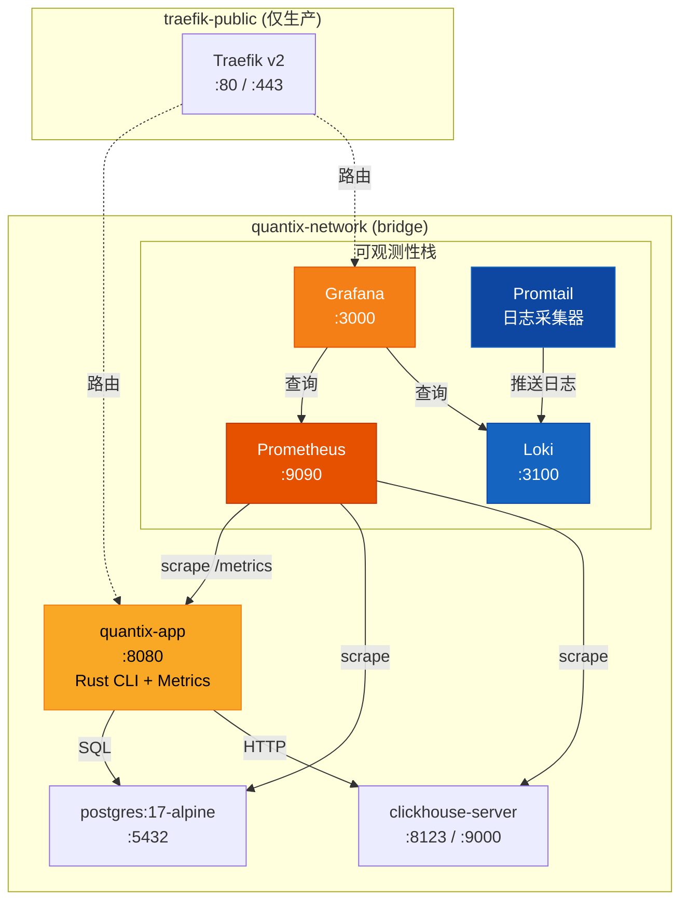
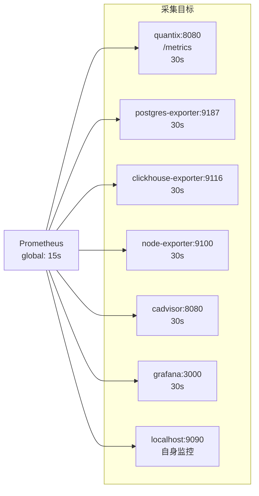
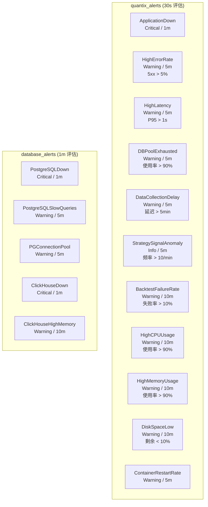
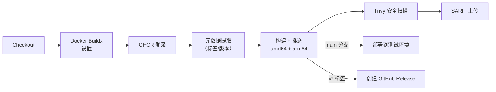

Quantix 采用全容器化部署策略，以 **Docker Compose** 编排应用本体、数据库引擎与可观测性三大支柱（Metrics / Logs / Traces）的完整生命周期。本章从 **多阶段构建原理** 出发，逐步拆解开发/生产两种 Compose 拓扑，深入 Prometheus 指标采集、Grafana 仪表盘可视化、Loki + Promtail 日志聚合的全链路设计，并覆盖告警规则体系、资源配额策略与 CI/CD 镜像构建流水线。

Sources: [docker-compose.yml](docker-compose.yml#L1-L214), [Dockerfile](Dockerfile#L1-L77), [monitoring/](monitoring/)

## 容器化架构总览

整个部署架构以 **bridge 网络** `quantix-network` 为核心，将应用层、数据层与监控层三大组件集群隔离在统一网络平面内，外部仅通过端口映射暴露必要的服务入口。生产环境额外引入 `traefik-public` 网络与 Traefik 反向代理层，实现 TLS 终结与自动证书签发。



**关键设计决策**：开发环境采用 `unless-stopped` 重启策略，所有服务共享单一 bridge 网络，密码硬编码于 Compose 文件便于快速迭代；生产环境则切换为 `always` 重启策略，将 `quantix-network` 设为 `internal: true` 隔离内网，强制外部流量通过 Traefik 反向代理进入，且所有敏感凭证必须通过环境变量注入。

Sources: [docker-compose.yml](docker-compose.yml#L182-L185), [docker-compose.prod.yml](docker-compose.prod.yml#L237-L250)

## 多阶段 Dockerfile 解析

项目提供两个 Dockerfile，分别服务于**生产构建**和**开发热重载**两种场景。

### 生产 Dockerfile（多阶段构建）

[Dockerfile](Dockerfile) 采用经典的两阶段构建模式，将编译环境与运行时环境严格分离：

| 阶段 | 基础镜像 | 目的 | 关键操作 |
|------|---------|------|---------|
| **Stage 1: builder** | `rust:1.75-slim` | 编译二进制 | 依赖缓存层 + 实际源码编译 |
| **Stage 2: runtime** | `debian:bookworm-slim` | 精简运行时 | 仅复制二进制 + 配置文件 |

**依赖缓存优化**：Stage 1 首先仅复制 `Cargo.toml` 和 `Cargo.lock`，创建虚拟 `lib.rs` / `main.rs`（仅含空 `fn main() {}`）执行一次全量 `cargo build --release`，将编译产物留在 Docker 层缓存中。后续实际源码变更时，只需重新编译项目自身代码，依赖库从缓存加载，显著加速增量构建。

**安全加固**：运行时镜像创建非 root 用户 `quantix`（UID 1000），通过 `USER quantix` 指令确保容器进程以最小权限运行。`HEALTHCHECK` 指令每 30 秒执行 `quantix health` 命令，超时 10 秒，最多重试 3 次，启动宽限期 5 秒。

Sources: [Dockerfile](Dockerfile#L1-L77)

### 开发 Dockerfile（热重载）

[Dockerfile.dev](Dockerfile.dev) 基于 `rust:1.75-slim` 单一阶段，预装 `cargo-watch`（文件保存自动重编译）和 `cargo-edit`（依赖管理工具），通过 `CMD ["cargo-watch", "-x", "run"]` 实现开发时的即时反馈循环。日志级别默认 `debug`，并开启 `RUST_BACKTRACE=1` 输出完整调用栈。

Sources: [Dockerfile.dev](Dockerfile.dev#L1-L42)

### .dockerignore 构建上下文优化

[.dockerignore](.dockerignore) 排除了 `.git`、`target/`、`docs/`、`tests/`、`benches/`、`node_modules/`、`.env` 等目录，确保 Docker 构建上下文仅包含编译所需的最小文件集，避免敏感信息泄露和不必要的构建缓存膨胀。

Sources: [.dockerignore](.dockerignore#L1-L86)

## Docker Compose 服务拓扑

### 开发环境服务矩阵

[docker-compose.yml](docker-compose.yml) 定义了 7 个核心服务 + 1 个可选工具服务：

| 服务 | 镜像 | 端口映射 | 健康检查 | 数据卷 |
|------|------|---------|---------|--------|
| **quantix** | 自定义构建 | `8080:8080` | `quantix health` / 30s | `config:ro`, `logs`, `data` |
| **postgres** | `postgres:17-alpine` | `5432:5432` | `pg_isready` / 10s | `postgres-data` |
| **clickhouse** | `clickhouse/clickhouse-server:latest` | `8123:8123`, `9000:9000` | `SELECT 1` / 10s | `clickhouse-data`, `clickhouse-logs` |
| **prometheus** | `prom/prometheus:latest` | `9090:9090` | — | `prometheus-data` |
| **grafana** | `grafana/grafana:latest` | `3000:3000` | — | `grafana-data` |
| **loki** | `grafana/loki:latest` | `3100:3100` | — | `loki-data` |
| **promtail** | `grafana/promtail:latest` | — | — | Docker socket + 容器日志 |
| **pgadmin** ⚙️ | `dpage/pgadmin4:latest` | `5050:80` | — | `pgadmin-data` |

**启动依赖链**：quantix 服务通过 `depends_on` + `condition: service_healthy` 确保 PostgreSQL 和 ClickHouse 完全就绪后才启动应用。Prometheus 和 Grafana 无硬依赖，可独立启动。PgAdmin 使用 `profiles: ["tools"]` 标记，仅在 `docker-compose --profile tools up` 时激活。

**数据库初始化**：PostgreSQL 通过 `scripts/init-postgres.sql` 挂载到 `/docker-entrypoint-initdb.d/` 目录执行首次初始化——创建 `uuid-ossp` 和 `pg_trgm` 扩展，并优化 `shared_buffers`、`work_mem`、`effective_cache_size` 等关键参数。ClickHouse 同理通过 `scripts/init-clickhouse.sql` 创建 `stock_info`、`stock_realtime_quotes`、`kline_data`、`gbbq_events`、`limit_up_events` 五张核心表，其中行情数据表设置了 30 天 TTL，K 线数据设置了 365 天 TTL。

Sources: [docker-compose.yml](docker-compose.yml#L1-L214), [scripts/init-postgres.sql](scripts/init-postgres.sql#L1-L41), [scripts/init-clickhouse.sql](scripts/init-clickhouse.sql#L1-L94)

### 生产环境覆盖配置

[docker-compose.prod.yml](docker-compose.prod.yml) 通过 Docker Compose 的 **override 机制** 与基础配置合并使用：

```bash
docker-compose -f docker-compose.yml -f docker-compose.prod.yml up -d
```

生产覆盖层的核心差异体现在以下维度：

| 维度 | 开发环境 | 生产环境 |
|------|---------|---------|
| **镜像来源** | 本地 Dockerfile 构建 | `ghcr.io/chengjon/quantix-rust/quantix:${VERSION}` |
| **重启策略** | `unless-stopped` | `always` |
| **资源限制** | 无限制 | CPU/Memory limits + reservations |
| **凭证管理** | 硬编码密码 | `${VAR:?required}` 强制环境变量 |
| **网络拓扑** | 单一 bridge | `internal` 内网 + `traefik-public` 外网 |
| **日志驱动** | 默认 | `json-file` + 轮转（max-size/max-file） |
| **反向代理** | 无 | Traefik + Let's Encrypt 自动证书 |

**Traefik 集成**：生产环境引入 Traefik v2 作为反向代理，通过 Docker labels 声明路由规则。Quantix 应用和 Grafana 分别通过 `traefik.http.routers.quantix` 和 `traefik.http.routers.grafana` 路由器暴露到 `websecure` 入口点（443 端口），并绑定 Let's Encrypt ACME 证书解析器。Traefik 自身的 Dashboard 通过 BasicAuth 中间件保护。

**资源配额体系**：每个服务均配置了 `limits`（上限）和 `reservations`（保障）两级资源约束——quantix 应用限制 2 CPU / 4GB 内存、保障 1 CPU / 2GB；ClickHouse 作为最重型的数据引擎，限制 4 CPU / 8GB、保障 2 CPU / 4GB，并设置 `nofile` ulimit 为 262144 以支持大量文件句柄。

Sources: [docker-compose.prod.yml](docker-compose.prod.yml#L1-L251)

## Prometheus 指标采集体系

### 全局配置与采集目标

[monitoring/prometheus.yml](monitoring/prometheus.yml) 定义了 7 个采集任务（scrape job），构成从基础设施到应用层的全栈可观测性：



**全局参数**：`scrape_interval: 15s` 作为默认采集频率，`evaluation_interval: 15s` 控制告警规则评估周期。所有指标附加 `cluster: 'quantix'` 和 `environment: 'production'` 外部标签，便于多集群联邦查询时区分来源。quantix 应用自身的采集间隔放宽至 30 秒，避免对交易决策核心造成不必要的性能开销。

**存储策略**：生产环境配置 `--storage.tsdb.retention.time=30d`（保留 30 天）和 `--storage.tsdb.retention.size=10GB`（磁盘上限 10GB），两项约束取先到者生效。`--web.enable-lifecycle` 启用 HTTP 热加载 API，允许不重启服务即可更新配置。

Sources: [monitoring/prometheus.yml](monitoring/prometheus.yml#L1-L65), [docker-compose.prod.yml](docker-compose.prod.yml#L114-L139)

### 应用侧指标导出（MetricsCollector）

Quantix 在 Rust 代码层实现了自研的 **MetricsCollector**，以 `Arc<RwLock<HashMap<String, Metric>>>` 线程安全地存储运行时指标，并支持 Prometheus 文本格式和 JSON 格式双通道导出。

支持三种标准指标类型：

| 类型 | 注册方法 | 更新方法 | 适用场景 |
|------|---------|---------|---------|
| **Counter** | `register_counter()` | `increment_counter(delta)` | 请求总数、错误总数、信号计数 |
| **Gauge** | `register_gauge()` | `set_gauge(value)` | 连接池使用率、当前持仓数 |
| **Histogram** | `register_histogram()` | `observe_histogram(value)` | 请求延迟、K 线计算耗时 |

**Histogram 桶设计**：采用 Prometheus 默认的 11 个桶阈值 `[0.005, 0.01, 0.025, 0.05, 0.1, 0.25, 0.5, 1.0, 2.5, 5.0, 10.0]`，覆盖从 5ms 到 10s 的完整延迟分布，足以量化 P50/P95/P99 分位值。

**MetricsExporter** 将内部指标转换为 Prometheus 文本暴露格式，输出符合 `# HELP` / `# TYPE` / `metric_name{labels} value` 三行结构的标准规范。Histogram 类型额外输出 `_bucket{le="..."}` 系列行、`_sum` 和 `_count` 汇总行。

Sources: [src/monitoring/metrics.rs](src/monitoring/metrics.rs#L1-L419)

## Loki 日志聚合与 Promtail 采集管线

### Loki 存储引擎

[monitoring/loki.yml](monitoring/loki.yml) 配置为单实例模式（`replication_factor: 1`），使用本地文件系统存储日志数据块（`/loki/chunks`）和规则（`/loki/rules`）。索引采用 `boltdb-shipper` 引擎 + `filesystem` 对象存储，按 24 小时分片。查询结果缓存启用嵌入式缓存（`embedded_cache`，100MB 上限），加速重复查询的响应速度。

Sources: [monitoring/loki.yml](monitoring/loki.yml#L1-L50)

### Promtail 多源采集管线

[monitoring/promtail.yml](monitoring/promtail.yml) 定义了四条日志采集管线，每条管线包含独立的 `static_configs`（发现目标）和 `pipeline_stages`（处理流水线）：

| 管线名称 | 日志源 | 关键处理阶段 |
|---------|-------|------------|
| **containers** | Docker 容器日志（`/var/lib/docker/containers`） | JSON 解析 → 正则提取 container_name → 标签注入 |
| **system** | `/var/log/**/*.log` | 正则提取 level（ERROR/WARN/INFO/DEBUG）→ 标签注入 |
| **quantix** | `/app/logs/*.log`（应用结构化日志） | JSON 解析 → RFC3339 时间戳提取 → level/target 标签 → message 二次 JSON 解析 |
| **postgres** | `/var/log/postgresql/*.log` | 正则匹配 ERROR/FATAL/PANIC → 强制 level=error 标签 |

**quantix 管线深度解析**：应用日志被解析为结构化 JSON，提取 `timestamp`、`level`、`target`（模块路径）、`message`、`span_id`、`trace_id` 六个核心字段。其中 `message` 字段会进行二次 JSON 解析，尝试提取 `query`、`duration_ms`、`user_id`、`request_id` 等业务上下文字段，实现日志从纯文本到可查询结构化数据的转换。

Sources: [monitoring/promtail.yml](monitoring/promtail.yml#L1-L110)

### Grafana 日志查询（LogQL）

日志通过 Grafana Explore 面板使用 **LogQL** 查询语言检索。以下是典型查询模式：

| 场景 | LogQL 表达式 |
|------|-------------|
| 查看所有应用日志 | `{job="quantix"}` |
| 筛选 ERROR 级别 | `{job="quantix"} \|~ "level\":\"error"` |
| 搜索特定股票代码 | `{job="quantix"} \|~ "600519"` |
| 统计每分钟错误数 | `rate({job="quantix"} \|~ "error"\[5m\])` |
| 格式化输出 | `{job="quantix"} \| json \| line_format "{{.timestamp}} {{.level}} {{.message}}"` |

Sources: [monitoring/promtail.yml](monitoring/promtail.yml#L57-L94)

## 告警规则体系

[monitoring/alerts.yml](monitoring/alerts.yml) 定义了两大告警规则组，覆盖 **应用层**、**业务层**、**资源层** 和 **数据库层** 四个维度，共计 14 条规则：



**告警分级策略**：仅 `ApplicationDown`、`PostgreSQLDown`、`ClickHouseDown` 三条标记为 `severity: critical`（核心服务完全不可用），其余均为 `warning` 或 `info`。`for` 子句定义了告警触发前的持续时长——critical 类告警仅需 1 分钟持续即可触发，而资源类告警需 10 分钟持续高水位以过滤瞬时抖动。

**关键业务指标**：`DataCollectionDelay` 监控数据采集新鲜度（`time() - data_last_collection_timestamp > 300`），确保行情数据不滞后超过 5 分钟；`StrategySignalAnomaly` 以 `rate > 10/min` 为阈值检测策略信号突发，可能意味着市场异常或策略 Bug；`BacktestFailureRate` 以 10% 为界监控回测系统稳定性。

Sources: [monitoring/alerts.yml](monitoring/alerts.yml#L1-L217)

## 应用侧健康检查与监控模块

### HealthRegistry 健康检查体系

[src/monitoring/health.rs](src/monitoring/health.rs) 实现了 `HealthCheck` trait 和 `HealthRegistry` 注册中心，支持多组件健康状态的聚合评估：

- **HealthStatus** 枚举分为三级：`Healthy`（全部正常）、`Degraded`（降级但可用）、`Unhealthy`（关键组件故障）
- **HealthRegistry** 收集所有注册组件的 `ComponentHealth`，通过 `HealthStatus::combine()` 取最差值作为全局状态
- **ComponentHealth** 携带 `response_time_ms`（响应延迟）、`last_error`（最近错误信息）、`details`（扩展详情）等上下文

Dockerfile 中定义的 `HEALTHCHECK CMD quantix health` 即调用此健康检查系统，Docker 引擎据此判断容器运行状态并触发自动重启。

Sources: [src/monitoring/health.rs](src/monitoring/health.rs#L1-L188)

### AlertManager 应用内告警

[src/monitoring/alert.rs](src/monitoring/alert.rs) 在 Rust 代码层实现了与 Prometheus 告警互补的应用级告警系统。`AlertThreshold` 结构体封装了**冷却时间**机制（默认 5 分钟），防止同一告警在短时间内重复触发。`AlertType` 枚举覆盖 Signal（策略信号）、Position（持仓变动）、Performance（性能指标）、Risk（风控触发）、System（系统异常）五大告警场景。

Sources: [src/monitoring/alert.rs](src/monitoring/alert.rs#L1-L200)

## CI/CD 镜像构建流水线

### Docker Build & Push Workflow

[.github/workflows/docker.yml](.github/workflows/docker.yml) 在 main 分支推送和版本标签（`v*`）时自动触发，包含四个阶段：



**多架构构建**：通过 `matrix.platform` 策略同时构建 `linux/amd64` 和 `linux/arm64` 两个平台的镜像，利用 GitHub Actions 的 `docker/build-push-action` 和 Buildx 实现跨平台交叉编译。

**镜像标签策略**：通过 `docker/metadata-action` 自动生成六种标签——分支名（`main`）、PR 编号、语义化版本三级（`v1.2.3` / `v1.2` / `v1`）以及 `latest`（仅 main 分支）。

**安全扫描**：构建完成后，Trivy 漏洞扫描器以 SARIF 格式输出结果并上传至 GitHub Security tab，实现镜像安全合规的自动化审计。

Sources: [.github/workflows/docker.yml](.github/workflows/docker.yml#L1-L172)

### 部署脚本

[scripts/deploy/deploy.sh](scripts/deploy/deploy.sh) 封装了多环境部署流程，支持 `dev`（docker-compose 本地部署）、`staging`（docker-compose overlay 合并部署）和 `production`（Kubernetes kubectl apply）三种模式。`--dry-run` 参数允许模拟运行验证流程正确性，部署完成后自动执行健康检查确认服务就绪。

Sources: [scripts/deploy/deploy.sh](scripts/deploy/deploy.sh#L1-L224)

## 快速启动操作指南

### 开发环境一键启动

```bash
# 1. 克隆仓库并配置环境变量
git clone https://github.com/chengjon/quantix-rust.git && cd quantix-rust
cp .env.example .env
# 编辑 .env 填入实际数据源配置

# 2. 启动完整服务栈
docker-compose up -d

# 3. 验证所有服务健康
docker-compose ps
curl http://localhost:8080/health

# 4. 访问监控面板
# Prometheus:  http://localhost:9090
# Grafana:     http://localhost:3000  (admin/admin)
# Loki API:    http://localhost:3100
```

### 生产环境部署

```bash
# 1. 设置必要的环境变量
export POSTGRES_PASSWORD="your_strong_password"
export CLICKHOUSE_PASSWORD="your_strong_password"
export GRAFANA_ADMIN_PASSWORD="your_grafana_password"
export ACME_EMAIL="your@email.com"
export TRAEFIK_AUTH_USERS="admin:$$apr1$$..."

# 2. 合并生产配置启动
docker-compose -f docker-compose.yml -f docker-compose.prod.yml up -d

# 3. 验证 Traefik 路由
curl -k https://quantix.example.com/health
curl -k https://grafana.example.com
```

### 常用运维命令速查

| 操作 | 命令 |
|------|------|
| 查看服务状态 | `docker-compose ps` |
| 跟踪应用日志 | `docker-compose logs -f quantix` |
| 进入 PostgreSQL | `docker-compose exec postgres psql -U quantix -d quantix` |
| 进入 ClickHouse | `docker-compose exec clickhouse clickhouse-client` |
| 重启单个服务 | `docker-compose restart quantix` |
| 热加载 Prometheus 配置 | `curl -X POST http://localhost:9090/-/reload` |
| 查看 Prometheus 目标状态 | `http://localhost:9090/targets` |
| 备份 PostgreSQL | `docker-compose exec -T postgres pg_dump -U quantix quantix > backup.sql` |
| 查看容器资源消耗 | `docker stats` |
| 清理旧镜像/卷 | `docker system prune -a --volumes` |

Sources: [docs/guides/DOCKER_GUIDE.md](docs/guides/DOCKER_GUIDE.md#L1-L436), [scripts/health-check.sh](scripts/health-check.sh#L1-L55)

## 故障排查指南

| 症状 | 诊断步骤 | 根因与解决 |
|------|---------|----------|
| quantix 容器反复重启 | `docker-compose logs quantix` 查看退出码 | 检查 DB 连接配置是否正确，确认 postgres/clickhouse 健康检查通过 |
| Prometheus 无数据 | 访问 `http://localhost:9090/targets` | 检查 scrape target 是否 UP，确认 quantix 暴露 `/metrics` 端点 |
| Grafana 无 Loki 数据 | Grafana Explore → `{job="quantix"}` | 检查 promtail 容器日志，确认 `/app/logs/*.log` 路径可达 |
| 告警不触发 | Prometheus → Alerts 页面检查规则状态 | 确认 `alerts.yml` 已挂载，`rule_files` 路径正确 |
| 容器内存 OOM | `docker stats` 监控内存趋势 | 调整 `deploy.resources.limits.memory` 或优化应用内存使用 |
| ClickHouse 连接超时 | `docker-compose exec clickhouse clickhouse-client --query "SELECT 1"` | 检查 `CLICKHOUSE_URL` 是否使用容器名 `clickhouse` 而非 `localhost` |

Sources: [docs/guides/DOCKER_GUIDE.md](docs/guides/DOCKER_GUIDE.md#L190-L231)

## 架构关联与延伸阅读

本章聚焦于容器化部署与可观测性基础设施。相关架构知识可在以下页面深入探索：

- **[监控系统：告警、健康检查、指标收集与通知](25-jian-kong-xi-tong-gao-jing-jian-kang-jian-cha-zhi-biao-shou-ji-yu-tong-zhi)** — 本章涉及的 `MetricsCollector`、`HealthRegistry`、`AlertManager` 的完整 API 设计与使用模式
- **[CI/CD 流水线、测试策略与性能基准测试](30-ci-cd-liu-shui-xian-ce-shi-ce-lue-yu-xing-neng-ji-zhun-ce-shi)** — Docker 镜像构建流水线在整个 CI/CD 体系中的位置与协作方式
- **[数据库客户端层（ClickHouse / PostgreSQL / TDengine）](8-shu-ju-ku-ke-hu-duan-ceng-clickhouse-postgresql-tdengine)** — 容器化部署中数据库初始化脚本的表结构与索引设计详解
- **[环境变量与配置管理](3-huan-jing-bian-liang-yu-pei-zhi-guan-li)** — `.env.example` 中所有环境变量的完整字段说明与安全最佳实践