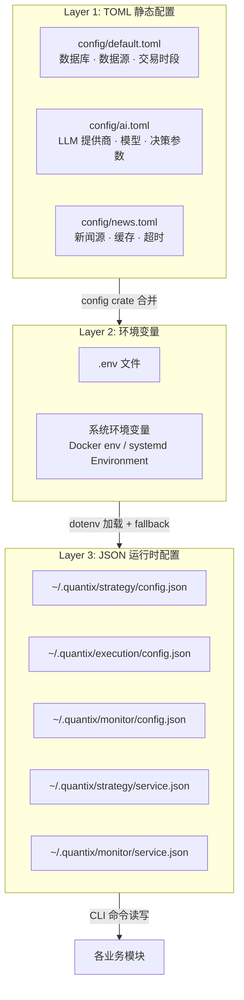
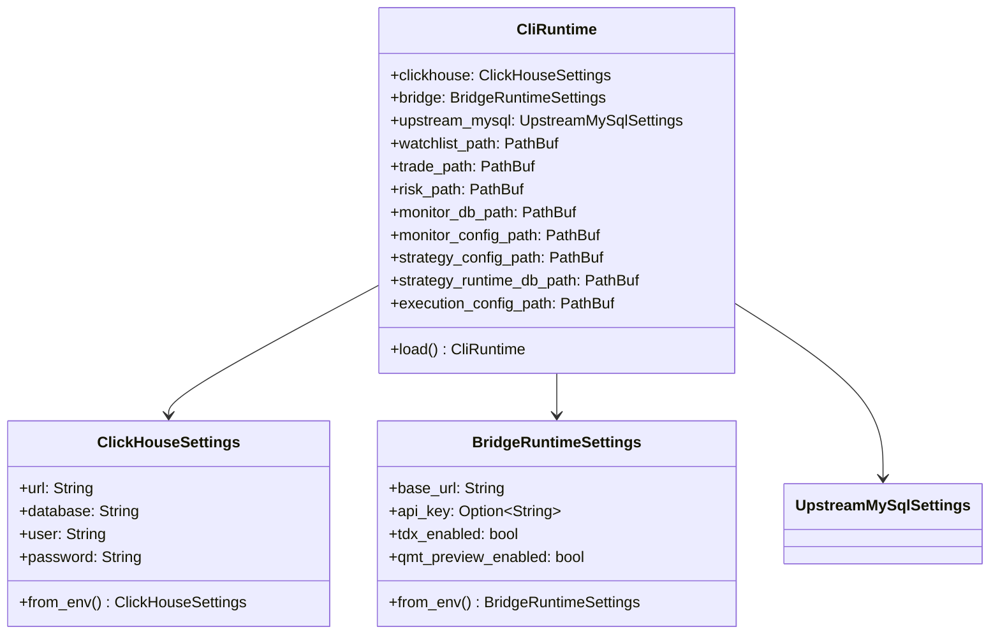
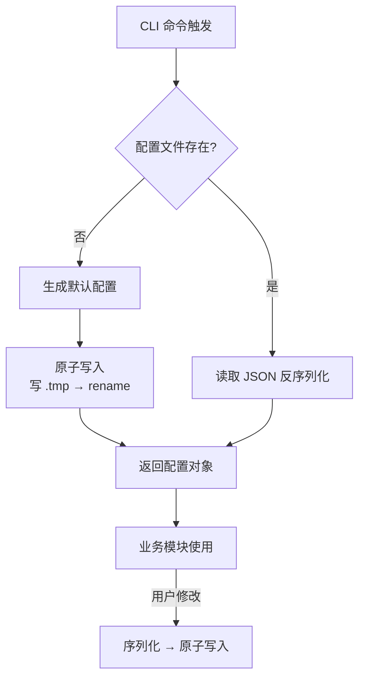
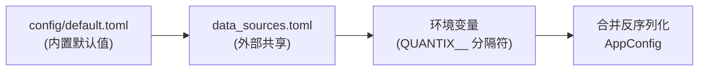

Quantix-Rust 采用**三层配置架构**：TOML 静态配置文件、环境变量（.env 文件 + 系统环境变量）以及 JSON 运行时配置。三层之间形成优先级覆盖关系——环境变量覆盖 TOML 默认值，运行时 JSON 配置则由各模块独立管理、持久化到用户目录。这种设计使得同一份代码能在本地开发、Docker 容器、systemd 生产部署之间无缝切换，仅需调整环境变量或替换配置文件，无需重新编译。

Sources: [config.rs](src/core/config.rs#L1-L96), [runtime.rs](src/core/runtime.rs#L1-L109), [.env.example](.env.example#L1-L105)

## 三层配置架构总览



**Layer 1（TOML 静态配置）**随代码仓库版本控制，定义所有默认值和结构化配置。**Layer 2（环境变量）**承载敏感信息（API Key、数据库密码）和部署环境差异（主机地址、端口），通过 `.env` 文件在本地开发时自动加载。**Layer 3（JSON 运行时配置）**由各模块的 `JsonXxxConfigStore` 管理，支持 CLI 命令动态修改、原子写入，适合运行时频繁变更的参数（如策略参数、告警阈值）。

Sources: [default.toml](config/default.toml#L1-L87), [ai.toml](config/ai.toml#L1-L72), [news.toml](config/news.toml#L1-L57), [runtime.rs](src/core/runtime.rs#L123-L125)

## 配置文件详解

### config/default.toml — 核心默认配置

这是 Quantix 的主配置文件，通过 Rust `config` crate 加载，涵盖数据库连接、数据源、交易时段和定时任务四个核心区域。其结构被反序列化为 `AppConfig` 结构体，支持通过 `QUANTIX_CONFIG_DIR` 环境变量指向外部配置目录，实现与 Python quantix 项目共享配置。

| 配置区域 | TOML 路径 | 对应 Rust 类型 | 说明 |
|---|---|---|---|
| TDengine | `[database.tdengine]` | `TDengineConfig` | 时序数据库连接，支持 rest/websocket 模式 |
| PostgreSQL | `[database.postgresql]` | `PostgresConfig` | 关系数据库，含连接池大小 `pool_max_size` |
| 通达信 | `[data_sources.tdx]` | `TdxConfig` | 多主机列表 `hosts`、端口、超时 |
| AkShare | `[data_sources.akshare]` | `AkShareConfig` | Python 数据源代理地址和频率限制 |
| 交易时段 | `[trading]` | 直接解析 | 上午/下午交易时间定义 |
| 定时任务 | `[task]` | 直接解析 | 开关、日志目录、PID 文件 |
| 通知渠道 | `[notification]` | 直接解析 | 启用渠道列表、最低级别、静默时段 |

Sources: [default.toml](config/default.toml#L1-L87), [config.rs](src/core/config.rs#L25-L96)

### config/ai.toml — AI 决策模块配置

AI 模块独立维护一份 TOML 配置文件，定义了五个 LLM 提供商（DeepSeek、OpenAI、Ollama、Anthropic、Gemini）的连接参数和默认模型映射。**API Key 不存储在此文件中**，而是通过对应的环境变量注入（如 `DEEPSEEK_API_KEY`），遵循敏感信息与配置分离的原则。决策引擎部分控制风险容忍度、最大持仓比例、分析深度等参数。

| 配置项 | TOML 路径 | 默认值 | 说明 |
|---|---|---|---|
| 默认提供商 | `[default].provider` | `deepseek` | LLM 路由入口 |
| 风险容忍度 | `[decision].risk_tolerance` | `moderate` | conservative / moderate / aggressive |
| 最大持仓比例 | `[decision].max_position_pct` | `10.0` | 占组合百分比 |
| 分析深度 | `[decision].analysis_depth` | `standard` | quick / standard / deep |
| 模板目录 | `[prompts].template_dir` | `ai_templates` | 提示词模板路径 |

Sources: [ai.toml](config/ai.toml#L1-L72)

### config/news.toml — 新闻搜索模块配置

新闻模块配置采用**多提供商优先级**机制。每个提供商通过 `priority` 字段定义排序，聚合器按优先级依次尝试，实现 Fallback 容错。`enabled` 开关可独立控制每个源的启用状态，API Key 同样通过环境变量注入。

| 提供商 | 优先级 | 环境变量 | 特点 |
|---|---|---|---|
| Tavily | 1 | `TAVILY_API_KEY` | AI 友好，推荐使用 |
| SerpAPI | 2 | `SERPAPI_API_KEY` | Google 搜索结果 |
| 博查 | 3 | `BOCHA_API_KEY` | 中文优化 |

Sources: [news.toml](config/news.toml#L1-L57), [aggregator.rs](src/news/aggregator.rs#L40-L55)

## 环境变量参考

### .env 文件机制

应用启动时通过 `dotenv` crate 自动检测并加载项目根目录的 `.env` 文件（如果存在）。`.env.example` 是完整的模板文件，包含所有支持的环境变量及其默认值注释。**生产环境中建议通过 Docker 环境变量或 systemd `Environment=` 指令注入**，而非依赖 `.env` 文件。

Sources: [runtime.rs](src/core/runtime.rs#L123-L125), [.env.example](.env.example#L1-L4)

### 数据库配置

| 环境变量 | 默认值 | 说明 |
|---|---|---|
| `CLICKHOUSE_URL` | `http://localhost:8123` | ClickHouse HTTP 地址 |
| `CLICKHOUSE_DB` | `quantix` | ClickHouse 数据库名 |
| `CLICKHOUSE_USER` | `default` | ClickHouse 用户名 |
| `CLICKHOUSE_PASSWORD` | *(空)* | ClickHouse 密码 |
| `POSTGRES_HOST` | `localhost` | PostgreSQL 主机 |
| `POSTGRES_PORT` | `5432` | PostgreSQL 端口 |
| `POSTGRES_DB` | `quantix` | PostgreSQL 数据库名 |
| `POSTGRES_USER` | `quantix` | PostgreSQL 用户名 |
| `POSTGRES_PASSWORD` | *(必填)* | PostgreSQL 密码 |
| `TDENGINE_HOST` | `localhost` | TDengine 主机 |
| `TDENGINE_PORT` | `6041` | TDengine REST 端口 |
| `TDENGINE_DB` | `quantix` | TDengine 数据库名 |
| `TDENGINE_USER` | `root` | TDengine 用户名 |
| `TDENGINE_PASSWORD` | `taosdata` | TDengine 密码 |
| `QUANTIX_UPSTREAM_MYSQL_URL` | `mysql://127.0.0.1:3306` | 上游 MySQL 地址 |
| `QUANTIX_UPSTREAM_MYSQL_DB` | `mystocks` | 上游 MySQL 数据库 |
| `QUANTIX_UPSTREAM_MYSQL_USER` | `root` | 上游 MySQL 用户 |
| `QUANTIX_UPSTREAM_MYSQL_PASSWORD` | *(空)* | 上游 MySQL 密码 |

Sources: [config.rs](src/core/config.rs#L8-L23), [runtime.rs](src/core/runtime.rs#L29-L67), [.env.example](.env.example#L4-L15)

### 数据源配置

| 环境变量 | 默认值 | 说明 |
|---|---|---|
| `TDX_HOSTS` | `114.80.63.12,114.80.63.13` | 通达信服务器地址（逗号分隔） |
| `TDX_PORT` | `7709` | 通达信服务器端口 |
| `TDX_TIMEOUT` | `5000` | 通达信连接超时（毫秒） |
| `AKSHARE_BASE_URL` | `http://localhost:8000` | AkShare 代理服务地址 |
| `AKSHARE_RATE_LIMIT` | `100` | AkShare 请求频率限制 |

Sources: [.env.example](.env.example#L17-L25), [config.rs](src/core/config.rs#L52-L68)

### AI / LLM 配置

| 环境变量 | 说明 |
|---|---|
| `LLM_PROVIDER` | 默认 LLM 提供商（deepseek / openai / ollama / anthropic / gemini） |
| `DEEPSEEK_API_KEY` | DeepSeek API Key |
| `DEEPSEEK_BASE_URL` | DeepSeek API 地址（默认 `https://api.deepseek.com`） |
| `OPENAI_API_KEY` | OpenAI API Key |
| `OPENAI_BASE_URL` | OpenAI API 地址 |
| `ANTHROPIC_API_KEY` | Anthropic API Key |
| `ANTHROPIC_BASE_URL` | Anthropic API 地址 |
| `GOOGLE_API_KEY` | Google Gemini API Key |
| `GOOGLE_BASE_URL` | Gemini API 地址 |
| `OLLAMA_BASE_URL` / `OLLAMA_HOST` | Ollama 本地服务地址 |
| `LLM_DEFAULT_MODEL` | 覆盖默认模型名称 |
| `LLM_FALLBACK_MODELS` | 备选模型列表（逗号分隔） |
| `LLM_TEMPERATURE` | 温度参数（默认 0.7） |
| `LLM_MAX_TOKENS` | 最大 token 数（默认 4096） |

`LlmConfig::from_env()` 方法会逐个检测各提供商的 API Key 环境变量，仅在 Key 存在时才注册该提供商，实现**零配置即用**——设置了哪个 Key 就自动启用哪个提供商。

Sources: [adapter.rs](src/ai/adapter.rs#L84-L188), [.env.example](.env.example#L68-L92)

### 路径配置

每个模块的数据存储路径都遵循**三级 fallback**策略：专用环境变量 → `$HOME/.quantix/<模块>/<文件>` → `./.quantix/<模块>/<文件>`。

| 环境变量 | 默认路径 | 说明 |
|---|---|---|
| `QUANTIX_WATCHLIST_PATH` | `~/.quantix/watchlist/watchlist.json` | 自选池数据文件 |
| `QUANTIX_TRADE_PATH` | `~/.quantix/trade/paper_trade.json` | 模拟交易数据 |
| `QUANTIX_RISK_PATH` | `~/.quantix/risk/risk_state.json` | 风控状态数据 |
| `QUANTIX_MONITOR_DB_PATH` | `~/.quantix/monitor/alerts.db` | 告警 SQLite 数据库 |
| `QUANTIX_MONITOR_CONFIG_PATH` | `~/.quantix/monitor/config.json` | Monitor 模块配置 |
| `QUANTIX_STRATEGY_CONFIG_PATH` | `~/.quantix/strategy/config.json` | 策略守护进程配置 |
| `QUANTIX_STRATEGY_RUNTIME_DB_PATH` | `~/.quantix/strategy/runtime.db` | 策略运行时 SQLite |
| `QUANTIX_EXECUTION_CONFIG_PATH` | `~/.quantix/execution/config.json` | 执行守护进程配置 |
| `QUANTIX_BRIDGE_BASE_URL` | `http://127.0.0.1:17580` | Windows Bridge 地址 |
| `QUANTIX_BRIDGE_API_KEY` | *(可选)* | Bridge 认证 Key |

Sources: [runtime.rs](src/core/runtime.rs#L10-L19), [runtime.rs](src/core/runtime.rs#L69-L109), [runtime.rs](src/core/runtime.rs#L127-L259)

### 通知与新闻 API

| 环境变量 | 说明 |
|---|---|
| `NOTIFICATION_MIN_LEVEL` | 通知最低级别（info / warning / error / critical） |
| `NOTIFICATION_LOG_PATH` | 通知日志路径 |
| `WEBHOOK_URL` | 通用 Webhook 地址 |
| `WECHAT_WORK_WEBHOOK_URL` | 企业微信 Webhook |
| `FEISHU_WEBHOOK_URL` | 飞书 Webhook |
| `TAVILY_API_KEY` | Tavily 新闻搜索 API Key |
| `SERPAPI_API_KEY` | SerpAPI Google 搜索 API Key |
| `BOCHA_API_KEY` | 博查中文搜索 API Key |

Sources: [.env.example](.env.example#L31-L66), [.env.example](.env.example#L93-L105)

## CliRuntime — 运行时配置中枢

`CliRuntime` 是整个应用的配置中心，在 CLI 启动时通过 `CliRuntime::load()` 一次性构建。它聚合了所有模块的路径配置、数据库连接参数和 Bridge 设置，作为依赖注入的根对象传递给各子系统。



`CliRuntime::load()` 内部首先调用 `load_dotenv_if_present()` 加载 `.env` 文件，然后逐一解析各环境变量，缺失时使用内嵌的默认值。所有路径配置统一使用 `resolve_xxx_path()` 模式，确保一致的 fallback 行为。

Sources: [runtime.rs](src/core/runtime.rs#L69-L109), [runtime.rs](src/core/runtime.rs#L92-L121)

## JSON 配置存储模式

各业务模块（策略、执行、监控）采用统一的 `JsonXxxConfigStore` 模式管理运行时 JSON 配置。这个模式具有以下特征：**自动创建**（`load_or_create` 首次运行生成默认配置）、**原子写入**（先写 `.tmp` 文件再 rename，防止写入中断导致数据丢失）、**目录自动创建**（写入前确保父目录存在）。



| 模块 | 配置类型 | 配置文件路径 | 关键字段 |
|---|---|---|---|
| 策略 | `StrategyDaemonConfig` | `~/.quantix/strategy/config.json` | 检查间隔、引导策略、股票策略列表 |
| 执行 | `ExecutionDaemonConfig` | `~/.quantix/execution/config.json` | 轮询间隔、单次最大请求、自动审批模式 |
| 监控 | `MonitorConfig` | `~/.quantix/monitor/config.json` | 检查间隔、观察列表分组、事件持久化 |
| 策略服务 | `StrategyServiceConfig` | `~/.quantix/strategy/service.json` | 可执行文件路径、环境文件路径 |
| 监控服务 | `MonitorServiceConfig` | `~/.quantix/monitor/service.json` | 可执行文件路径 |

其中 `StrategyDaemonConfig` 的结构较为复杂，内嵌了 `ConfiguredStock` → `ConfiguredStrategyInstance` 的二级嵌套，每个股票可以配置多个策略实例，每个策略实例包含 `id`、`name`、`enabled`、`params`（自由 JSON 对象）。

Sources: [strategy/config.rs](src/strategy/config.rs#L1-L109), [execution/config.rs](src/execution/config.rs#L1-L96), [monitor/config.rs](src/monitor/config.rs#L1-L60), [strategy/service_config.rs](src/strategy/service_config.rs#L1-L89), [monitor/service_config.rs](src/monitor/service_config.rs#L1-L88)

## AppConfig 加载机制

核心配置的加载使用 `config` crate 的 Builder 模式，按以下顺序叠加配置源（后加载的覆盖先加载的）：

1. **`config/default.toml`** — 内嵌默认配置
2. **`QUANTIX_CONFIG_DIR/data_sources.toml`** — 外部共享配置（如果目录存在）
3. **环境变量** — 以 `__` 为分隔符映射到 TOML 路径（如 `DATABASE__TDENGINE__HOST` 覆盖 `[database.tdengine].host`）



这种叠加机制意味着开发者可以通过环境变量覆盖 TOML 中的任意字段，非常适合 Docker 部署和 CI 环境。

Sources: [config.rs](src/core/config.rs#L76-L96)

## 部署场景下的配置注入

### Docker Compose 开发环境

`docker-compose.yml` 通过 `environment` 指令为容器注入环境变量。应用容器将 `config/` 目录以只读卷挂载（`./config:/app/config:ro`），数据库连接地址使用 Docker 服务名（如 `postgres`、`clickhouse`）替代 `localhost`。

| 容器 | 关键环境变量 | 说明 |
|---|---|---|
| quantix-app | `POSTGRES_HOST=postgres` | 指向 Docker 网络中的 postgres 服务 |
| quantix-app | `CLICKHOUSE_URL=http://clickhouse:8123` | 指向 Docker 网络中的 clickhouse 服务 |
| quantix-app | `RUST_LOG=quantix_cli=info,sqlx=warn` | 日志级别过滤 |
| postgres | `POSTGRES_PASSWORD=quantix123` | 数据库初始化密码 |
| clickhouse | `CLICKHOUSE_DB=quantix` | 数据库名 |

Sources: [docker-compose.yml](docker-compose.yml#L1-L38)

### Docker Compose 生产环境

`docker-compose.prod.yml` 覆盖开发配置，使用 `${VAR:?message}` 语法强制要求设置敏感环境变量（如 `POSTGRES_PASSWORD`、`CLICKHOUSE_PASSWORD`、`GRAFANA_ADMIN_PASSWORD`），未设置时直接报错拒绝启动。这确保了生产环境不会使用默认密码。

Sources: [docker-compose.prod.yml](docker-compose.prod.yml#L1-L200)

### systemd 服务部署

仓库内提供三套 systemd unit 文件模板，位于 `config/systemd/` 目录。此外，策略守护进程和监控守护进程支持**用户级 systemd 服务**自动安装——通过 CLI 命令（`strategy service install` / `monitor service install`）动态生成 unit 文件，将 `CliRuntime` 解析出的路径以 `Environment=` 指令注入。

```ini
# 自动生成的 systemd unit 片段（策略守护进程）
[Service]
Environment=QUANTIX_STRATEGY_CONFIG_PATH=/home/user/.quantix/strategy/config.json
Environment=QUANTIX_STRATEGY_RUNTIME_DB_PATH=/home/user/.quantix/strategy/runtime.db
EnvironmentFile=-/path/to/custom.env   # 可选的额外环境文件
```

Sources: [quantix-strategy-runner.service](config/systemd/quantix-strategy-runner.service#L1-L46), [quantix-data-collector.service](config/systemd/quantix-data-collector.service#L1-L47), [strategy/systemd.rs](src/strategy/systemd.rs#L65-L94), [monitor/systemd.rs](src/monitor/systemd.rs#L72-L111)

## 配置最佳实践

### 敏感信息管理

**绝对不要**将 API Key、数据库密码等敏感信息提交到版本控制。正确做法是将 `.env.example` 复制为 `.env` 并填入实际值（`.env` 已在 `.gitignore` 中排除）。生产环境应使用 Docker secrets、systemd `EnvironmentFile` 或密钥管理服务。

Sources: [.env.example](.env.example#L1-L4)

### 路径一致性

所有模块的路径解析都统一通过 `CliRuntime` 管理。如果需要自定义数据存储位置，设置对应的环境变量即可（如 `export QUANTIX_STRATEGY_RUNTIME_DB_PATH=/data/quantix/runtime.db`）。多个守护进程在同一用户下运行时，它们会自动共享 `$HOME/.quantix/` 下的配置和数据。

Sources: [runtime.rs](src/core/runtime.rs#L127-L259)

### 配置优先级速查

当同一配置项在多处定义时，优先级从高到低为：

1. **命令行参数**（Clap 解析的 CLI flags）
2. **系统环境变量** / Docker `environment` / systemd `Environment=`
3. **`.env` 文件**（通过 `dotenv` 加载）
4. **外部 TOML 配置**（`QUANTIX_CONFIG_DIR` 指定的目录）
5. **内嵌默认配置**（`config/default.toml`、代码中的 `Default` trait 实现）

Sources: [config.rs](src/core/config.rs#L76-L96), [main.rs](src/main.rs#L15-L19)

## 配置错误排查

所有配置相关的错误统一通过 `QuantixError::Config(String)` 变体报告。以下列出常见配置问题及其排查方法：

| 错误场景 | 报错信息关键词 | 排查方法 |
|---|---|---|
| ClickHouse 连接失败 | `DatabaseConnection` | 检查 `CLICKHOUSE_URL` 是否可达，容器内用服务名 |
| 策略配置文件损坏 | `serde_json` 解析错误 | 检查 `~/.quantix/strategy/config.json` JSON 格式 |
| systemd 服务路径无效 | `quantix_bin_path 不可执行` | 确保 `service.json` 中路径为绝对路径且可执行 |
| Bridge 连接超时 | `BridgeRuntime` 相关 | 检查 `QUANTIX_BRIDGE_BASE_URL` 和 Windows 端 Bridge 进程 |
| LLM 提供商未注册 | `has_any_provider() = false` | 检查是否设置了至少一个 `*_API_KEY` 环境变量 |

Sources: [error.rs](src/core/error.rs#L8-L9)

---

阅读完本文档后，建议继续以下章节深入学习：

- [分层架构设计与模块依赖关系](4-fen-ceng-jia-gou-she-ji-yu-mo-kuai-yi-lai-guan-xi) — 理解配置在各模块间的传递机制
- [CLI 命令体系与 Clap 子命令分发](6-cli-ming-ling-ti-xi-yu-clap-zi-ming-ling-fen-fa) — 了解 CLI 如何解析参数并与配置交互
- [Docker 容器化部署与监控栈](29-docker-rong-qi-hua-bu-shu-yu-jian-kong-zhan-prometheus-grafana-loki) — 实战 Docker 环境下的配置注入
- [策略守护进程、Signal Daemon 与 systemd 服务管理](13-ce-lue-shou-hu-jin-cheng-signal-daemon-yu-systemd-fu-wu-guan-li) — systemd 服务的配置生成细节