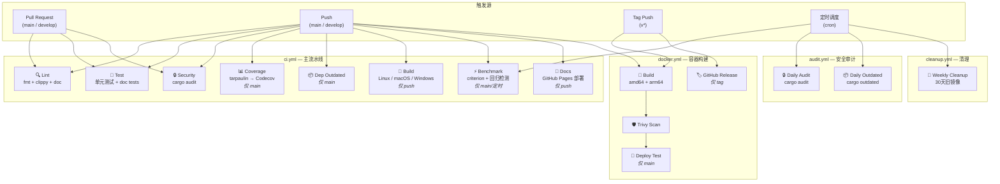
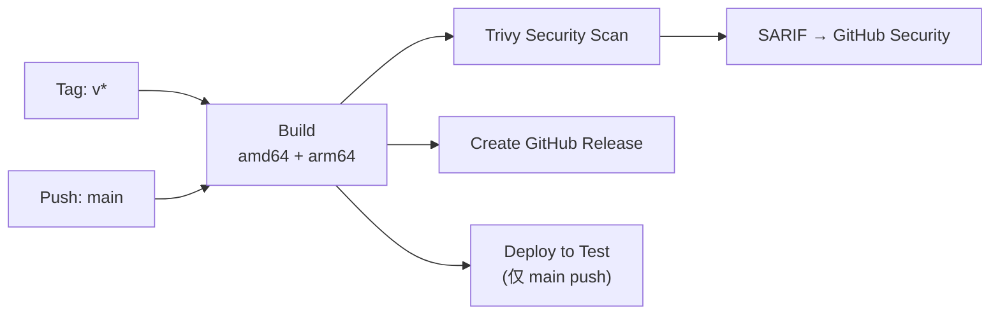
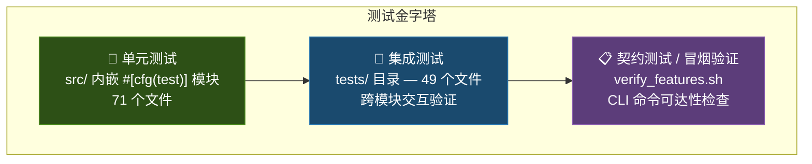
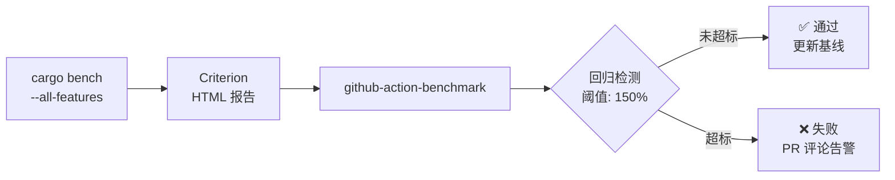

本文档全面解析 Quantix 项目的 **持续集成/持续交付流水线架构**、**多层次的测试策略** 和 **基于 Criterion 的性能基准测试框架**。这三条工程保障线构成了项目从代码提交到生产部署的完整质量防线——CI 守住"能编译、能通过"的下限，测试策略确保"业务逻辑正确"的核心要求，而基准测试则跟踪"性能不退化"的长期目标。理解这三者的分工与协作，是参与本项目高效开发的前提。

Sources: [ci.yml](.github/workflows/ci.yml#L1-L11), [Cargo.toml](Cargo.toml#L106-L124), [bench_main.rs](benches/bench_main.rs#L1-L14)

---

## CI/CD 流水线全景

Quantix 的 CI/CD 体系由四个独立的 GitHub Actions 工作流组成，各自承担不同的质量保障职责。它们通过 **触发条件隔离** 和 **权限分层** 的设计原则，在 PR 快速反馈和主干深度验证之间取得了平衡。

### 四工作流分工架构

### 触发条件与权重路径

CI 工作流的一个核心设计是 **PR 快路径与主干重路径的分离**。下表清晰地展示了不同事件触发下各 Job 的激活状态：

| Job | PR (快路径) | Push main (重路径) | Push develop | 定时调度 |
|-----|:-----------:|:------------------:|:------------:|:--------:|
| **Lint** (fmt + clippy + doc) | ✅ | ✅ | ✅ | — |
| **Test** (unit + doc) | ✅ | ✅ | ✅ | ✅ |
| **Security** (audit) | ✅ | ✅ | ✅ | — |
| **Coverage** (tarpaulin) | — | ✅ | — | — |
| **Dependency Outdated** | — | ✅ | — | — |
| **Build** (跨平台) | — | ✅ | ✅ | — |
| **Benchmark** | — | ✅ | — | ✅ |
| **Docs** (GitHub Pages) | — | ✅ | ✅ | — |

这种设计的意图是：**PR 只跑快速检查（lint + test + audit），确保开发者反馈延迟在 5 分钟以内**；而覆盖率、跨平台构建、性能回归这类耗时操作仅在合并到主干后触发。

Sources: [ci.yml](.github/workflows/ci.yml#L4-L11), [ci.yml](.github/workflows/ci.yml#L73-L78), [ci.yml](.github/workflows/ci.yml#L189-L194), [ci.yml](.github/workflows/ci.yml#L354-L394)

### Docker 构建与发布流水线

`docker.yml` 工作流实现了从镜像构建到安全扫描再到发布的完整链路。它采用 **Docker Buildx 多平台矩阵** 同时构建 `linux/amd64` 和 `linux/arm64` 两个架构的镜像，并推送到 GitHub Container Registry (`ghcr.io/chengjon/quantix-rust/quantix`)。构建完成后，**Trivy 漏洞扫描器** 对镜像进行安全审计，扫描结果以 SARIF 格式上传到 GitHub Security tab，实现漏洞的可视化追踪。

版本标签策略支持多种维度：分支名引用（`main`）、语义化版本（`v1.2.3`、`v1.2`、`v1`）以及默认的 `latest` 标签。当检测到 `v*` 格式的 tag push 时，工作流会自动创建 GitHub Release，附带镜像拉取说明和 CHANGELOG 链接。

Sources: [docker.yml](.github/workflows/docker.yml#L1-L21), [docker.yml](.github/workflows/docker.yml#L76-L103), [docker.yml](.github/workflows/docker.yml#L124-L171)

### 定时任务与安全审计

项目配置了两个定时调度工作流。**audit.yml** 每天凌晨 2 点运行 `cargo audit` 检查依赖漏洞，如果发现安全问题会 **自动创建带 `security` 和 `high-priority` 标签的 GitHub Issue**，确保漏洞不被遗漏。同时运行 `cargo outdated` 检查依赖版本状态，生成过期报告作为 artifact 上传。**cleanup.yml** 则在每周日凌晨 3 点自动清理 GHCR 中超过 30 天的旧版本镜像，防止存储空间无限膨胀。

Sources: [audit.yml](.github/workflows/audit.yml#L1-L8), [audit.yml](.github/workflows/audit.yml#L43-L54), [cleanup.yml](.github/workflows/cleanup.yml#L1-L10), [cleanup.yml](.github/workflows/cleanup.yml#L36-L62)

---

## 质量门禁体系

### 代码格式与静态分析

CI 的 **Lint Job** 是第一道质量门禁，由三个检查步骤串联组成。首先执行 `cargo fmt --all -- --check` 确保代码风格统一，项目在 `config/rustfmt.toml` 中定义了 120 字符行宽、4 空格缩进、`StdExternalCrate` 分组导入等规范。紧接着 `cargo clippy --all-targets --all-features -- -D warnings` 将所有 Clippy 警告升级为错误（编译失败），项目在 `config/clippy.toml` 中针对量化交易场景调高了复杂度阈值（认知复杂度 50、类型复杂度 250、函数参数上限 10）。最后还会执行文档构建，检查是否存在 `unresolved link` 警告。

Sources: [ci.yml](.github/workflows/ci.yml#L24-L71), [rustfmt.toml](config/rustfmt.toml#L1-L31), [clippy.toml](config/clippy.toml#L1-L46)

### 多平台构建矩阵

Build Job 仅在 push 到 `main` 或 `develop` 分支时触发，覆盖三大主流平台的 x86_64 目标：

| 平台 | Target | 用途 |
|------|--------|------|
| `ubuntu-latest` | `x86_64-unknown-linux-gnu` | Linux 服务器部署 |
| `macos-latest` | `x86_64-apple-darwin` | macOS 开发者本地运行 |
| `windows-latest` | `x86_64-pc-windows-msvc` | Windows 桌面环境 |

构建产物通过 `upload-artifact` 上传，可在 GitHub Actions 页面直接下载对应的二进制文件。

Sources: [ci.yml](.github/workflows/ci.yml#L309-L353)

### 覆盖率收集与追踪

Coverage Job 使用 **cargo-tarpaulin** 在 main 分支的每次 push 上生成 Lcov 格式的覆盖率报告，并上传到 Codecov。整个覆盖率收集过程同样依赖 PostgreSQL 和 ClickHouse 服务容器（因为部分测试需要真实的数据库连接），超时设置为 120 秒。Codecov 配置为 `fail_ci_if_error: false`，即覆盖率上传失败不会阻塞 CI，这是一个务实的权衡——覆盖率是参考指标而非硬性门禁。

Sources: [ci.yml](.github/workflows/ci.yml#L189-L287)

---

## 测试策略与分层架构

### 测试金字塔

Quantix 项目采用经典的 **测试金字塔** 模型，从底层到顶层分为三个层次。整个项目拥有 **71 个源文件内嵌单元测试**（通过 `#[cfg(test)]` 模块）、**49 个集成测试文件**（`tests/` 目录下约 141 个 `#[test]` 函数和超过 230 个 `#[tokio::test]` 异步测试函数），以及一个特性冒烟验证脚本。

### 单元测试：模块内部的正确性保障

单元测试分布在 `src/` 各模块的 `#[cfg(test)]` 子模块中，它们测试的是单个函数或结构体的行为。例如 `src/import/csv_parser.rs`、`src/fundamental/valuation.rs`、`src/account/router.rs` 等核心模块都包含独立的单元测试。这些测试通常不依赖外部服务，运行速度极快，是开发过程中最频繁执行的测试层。

### 集成测试：跨模块协作验证

`tests/` 目录下的 49 个集成测试文件是项目测试策略的核心。它们按业务模块命名，每个文件聚焦一个功能域的端到端行为：

| 模块域 | 代表性测试文件 | 测试数量 | 关键测试内容 |
|--------|--------------|:--------:|-------------|
| **策略执行** | `strategy_daemon_test.rs` | 16 | 信号守护进程生命周期、单次执行、信号审批 |
| **策略执行** | `strategy_integration_test.rs` | 8 | 策略与回测引擎集成、多策略对比 |
| **执行内核** | `execution_kernel_test.rs` | 23 | 订单提交/查询/取消、Paper 适配器、MockLive 适配器 |
| **执行内核** | `execution_runtime_store_test.rs` | 22 | SQLite runtime.db 状态持久化、冻结快照 |
| **风控** | `risk_service_test.rs` | 31 | 规则引擎评估、日亏损锁、行业黑名单 |
| **止盈止损** | `stop_service_test.rs` | 21 | 规则 CRUD、实时评估、触发事件记录 |
| **监控** | `monitor_runner_test.rs` | 12 | 价格告警触发、自选池快照 |
| **指标计算** | `indicator_pipeline_test.rs` | 25 | Pipeline 多阶段执行、缓存命中、Polars 批量计算 |
| **文档契约** | `repo_hygiene_test.rs` | 20 | README/USER_MANUAL 关键文本存在性检查 |
| **CI 本身** | `ci_workflow_structure_test.rs` | 1 | 验证 CI 工作流结构完整性 |

集成测试的异步测试使用 `#[tokio::test]` 宏（而非 `#[test]`），这反映了 Quantix 作为异步应用的架构特点——大量 I/O 操作（数据库、HTTP、WebSocket）都需要在 tokio 运行时中执行。

Sources: [strategy_daemon_test.rs](tests/strategy_daemon_test.rs#L1-L15), [execution_kernel_test.rs](tests/execution_kernel_test.rs#L1-L50), [repo_hygiene_test.rs](tests/repo_hygiene_test.rs#L1-L19), [ci_workflow_structure_test.rs](tests/ci_workflow_structure_test.rs#L1-L38)

### CI 中的测试服务容器

Test Job 在 CI 中使用 GitHub Actions 的 **services** 机制启动 PostgreSQL 17 和 ClickHouse 两个数据库容器，为需要真实数据库连接的集成测试提供环境支撑。两个容器都配置了健康检查（PostgreSQL 使用 `pg_isready`，ClickHouse 使用 `SELECT 1`），测试步骤在开始前还有额外的轮询等待逻辑，确保数据库完全就绪后才开始测试。测试命令使用 `--test-threads=1` 串行执行，避免数据库并发写入导致的竞态条件。

Sources: [ci.yml](.github/workflows/ci.yml#L79-L163)

### 契约测试：文档与 CLI 的一致性保障

Quantix 有一个独特的测试类别——**仓库卫生测试**（`repo_hygiene_test.rs`，604 行，20 个测试函数）。这些测试验证的是 **文档与实现的契约**：每个 Phase 的功能描述是否准确反映在 README.md 和 USER_MANUAL.md 中。例如 `readme_documents_phase27_risk_boundary()` 检查了 40 多个预期文本片段，从 CLI 命令格式到环境变量路径再到业务边界约束。这种测试确保了开发过程中文档不会漂移于实际实现。

此外，`verify_features.sh` 脚本作为手动执行的 **特性冒烟验证工具**，逐个检查 CLI 子命令的可达性和基本功能，将输出分为 PASS / WARN / FAIL 三类结果，适用于发布前的全量检查。

Sources: [repo_hygiene_test.rs](tests/repo_hygiene_test.rs#L1-L83), [verify_features.sh](scripts/verify_features.sh#L1-L103)

### 本地测试工作流

开发者可以使用 `scripts/dev/watch-test.sh` 实现基于 `cargo-watch` 的 **测试自动监控**——每当源码文件发生变更，自动运行 `cargo test --all-features`。这个脚本适合在开发过程中保持运行，提供即时反馈。对于需要更细粒度控制的场景，直接使用 `cargo test --lib`（仅单元测试）、`cargo test --doc`（文档测试）或 `cargo test --test <name>`（指定集成测试）即可。

Sources: [watch-test.sh](scripts/dev/watch-test.sh#L1-L27)

---

## 性能基准测试框架

### Criterion 基准测试套件

Quantix 的性能基准测试基于 **Criterion.rs**（v0.5）构建，定义在 `benches/bench_main.rs` 中。整个套件覆盖 5 个关键领域，每个领域通过多梯度数据规模进行压力测试：

| 基准组 | 测试目标 | 数据规模梯度 | 核心度量 |
|--------|---------|:-----------:|---------|
| **indicators** | SMA / EMA / RSI / MACD | 100 / 1K / 10K | 每秒计算次数 |
| **export** | CSV / JSON 导出 | 1K / 10K / 100K | 吞吐量（记录/秒） |
| **validation** | K线校验 / 质量报告 | 100 / 1K / 10K | 吞吐量（记录/秒） |
| **performance** | 总收益率 / 最大回撤 / 夏普比率 | 100 / 500 / 1K | 每秒计算次数 |
| **batch** | 批处理器 | 10K / 100K / 1M | 吞吐量（记录/秒） |

基准测试的统计参数经过精心调优：**3 秒预热**、**10 秒测量窗口**、**100 次采样**、**95% 置信度**（显著性水平 0.05）和 **2% 噪声阈值**。这些参数确保了基准结果的统计学可靠性，同时将单次完整运行的时长控制在合理范围。

Sources: [bench_main.rs](benches/bench_main.rs#L1-L26), [bench_main.rs](benches/bench_main.rs#L247-L268)

### Phase 18 基准测试结果摘要

以下是项目在 2026-03-08 采集的性能基线数据（完整 42 项测试全部通过），它为后续的性能回归检测提供了参考锚点：

| 操作 | 100 条数据 | 1,000 条数据 | 10,000 条数据 |
|------|-----------|-------------|--------------|
| **SMA** | 7.93 µs | 111.49 µs | 1.54 ms |
| **EMA** | 22.65 µs | 229.48 µs | 2.37 ms |
| **RSI** | 38.87 µs | 463.78 µs | 4.98 ms |
| **MACD** | 54.51 µs | 535.31 µs | 5.57 ms |
| **CSV 导出** | 2.02 ms (1K) | 11.46 ms (10K) | 147.28 ms (100K) |
| **数据验证** | 8.14 µs | 85.86 µs | 834.74 µs |
| **批处理** | 426.84 µs (10K) | 5.92 ms (100K) | 102.00 ms (1M) |

**性能亮点**：数据验证模块达到 ~12M 记录/秒的吞吐量，总收益率计算达到 ~18.8M 次/秒，批处理在 100 万条记录规模下仍保持 ~10M 记录/秒。大部分操作显示良好的线性扩展性。

Sources: [PHASE18_BENCHMARK_RESULTS.md](docs/reports/PHASE18_BENCHMARK_RESULTS.md#L1-L120)

### CI 中的性能回归检测

Benchmark Job 仅在 main 分支 push 和定时调度时触发，使用 `benchmark-action/github-action-benchmark` 将 Criterion 结果持久化到 GitHub Pages 的独立分支。该 Action 配置了 **150% 的回归告警阈值**——如果某个基准测试比历史基线慢了 50% 以上，CI 会 **自动失败并在 PR 中添加告警评论**，同时 `@chengjon` 会收到通知。这种设计使得性能退化在合并到主干后能被立即发现。

Sources: [ci.yml](.github/workflows/ci.yml#L354-L394)

### 本地基准测试工具链

项目提供了 `scripts/dev/run_benchmarks.sh` 脚本，封装了完整的本地性能分析工作流：

| 命令 | 功能 | 适用场景 |
|------|------|---------|
| `./scripts/dev/run_benchmarks.sh` | 运行完整基准套件 | 日常性能检查 |
| `./scripts/dev/run_benchmarks.sh --baseline [name]` | 保存当前结果为基线 | 版本发布前建基线 |
| `./scripts/dev/run_benchmarks.sh --compare [name]` | 与基线对比 | 优化后验证改进效果 |
| `./scripts/dev/run_benchmarks.sh --flamegraph` | 生成火焰图 (SVG) | 定位性能热点函数 |
| `./scripts/dev/run_benchmarks.sh --dhat` | 堆分配分析 | 内存使用优化 |
| `./scripts/dev/run_benchmarks.sh --html` | 生成 HTML 报告 | 可视化结果分享 |

Sources: [run_benchmarks.sh](scripts/dev/run_benchmarks.sh#L1-L50), [run_benchmarks.sh](scripts/dev/run_benchmarks.sh#L104-L150)

---

## 最佳实践与开发工作流

### PR 提交前自检清单

在提交 PR 之前，开发者应在本地执行以下检查以确保 CI 能顺利通过：

1. **格式检查**：`cargo fmt --all -- --check`（若有差异则运行 `cargo fmt` 自动修复）
2. **静态分析**：`cargo clippy --all-targets --all-features -- -D warnings`
3. **单元测试**：`cargo test --lib --all-features`
4. **文档测试**：`cargo test --doc --all-features`
5. **安全审计**：`cargo audit`（需安装 `cargo-audit`）

### Release Profile 优化

项目的 `[profile.release]` 配置采用了激进的优化策略：`opt-level = 3`（最高优化级别）、`lto = true`（跨 crate 链接时优化）、`codegen-units = 1`（牺牲编译速度换取更好的运行时优化）和 `strip = true`（移除调试符号减小二进制体积）。这些设置确保生产构建获得最佳性能。

Sources: [Cargo.toml](Cargo.toml#L120-L125)

### Docker 多阶段构建

生产 Dockerfile 采用两阶段构建：第一阶段基于 `rust:1.75-slim` 编译 release 二进制，并利用 **虚拟源代码缓存层** 优化依赖编译（先复制 `Cargo.toml` / `Cargo.lock` 构建依赖缓存，再复制真实源码）。第二阶段使用精简的 `debian:bookworm-slim` 运行时镜像，以非 root 用户 `quantix` 运行，内置 `HEALTHCHECK` 指令和健康检查脚本。

Sources: [Dockerfile](Dockerfile#L1-L77), [health-check.sh](scripts/health-check.sh#L1-L55)

---

## 延伸阅读

- [Docker 容器化部署与监控栈（Prometheus / Grafana / Loki）](29-docker-rong-qi-hua-bu-shu-yu-jian-kong-zhan-prometheus-grafana-loki) — CI 构建的 Docker 镜像如何部署到生产环境
- [Rust 编码规范：文件限制、模块组织与类型安全](28-rust-bian-ma-gui-fan-wen-jian-xian-zhi-mo-kuai-zu-zhi-yu-lei-xing-an-quan) — Clippy / rustfmt 配置背后的编码规范体系
- [技术指标计算引擎与 Polars 批量数据层](31-ji-zhu-zhi-biao-ji-suan-yin-qing-yu-polars-pi-liang-shu-ju-ceng) — 基准测试中指标计算性能对应的底层实现