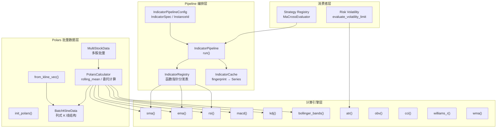
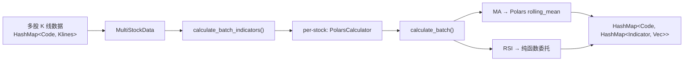
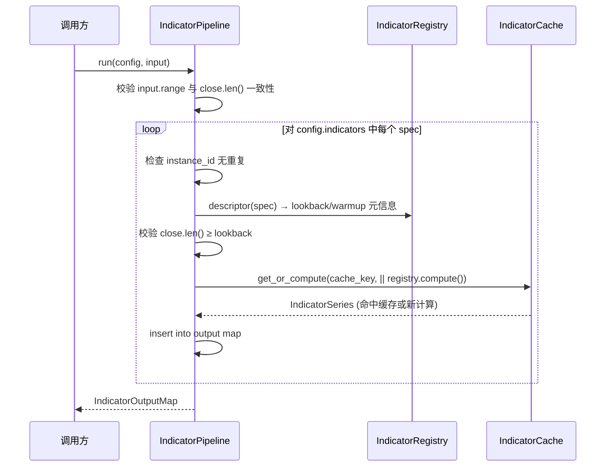
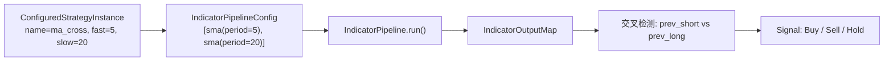

Quantix 的技术指标子系统采用**三层分离架构**：底层纯函数计算引擎基于 `rust_decimal` 保证金融级精度；中间 Polars 批量数据层提供列式向量化处理能力；顶层 Pipeline 框架负责指标注册、缓存与策略编排。这种设计使得单股指标计算、批量扫描和策略信号评估共享同一套经过验证的数学内核，同时通过不同的数据入口适配各自的性能需求。

Sources: [mod.rs](src/analysis/mod.rs#L1-L36), [indicators.rs](src/analysis/indicators.rs#L1-L6), [polars_adapter.rs](src/analysis/polars_adapter.rs#L1-L8)

## 架构总览



整个数据流可以归纳为两条路径：**Pipeline 路径**（策略系统 → `IndicatorPipeline` → `IndicatorRegistry` → 纯函数）适用于需要缓存与配置化管理的场景；**Polars 路径**（批量数据 → `PolarsCalculator` → 纯函数）适用于多股票扫描与向量化批量计算。

Sources: [pipeline.rs](src/analysis/pipeline.rs#L1-L77), [polars_adapter.rs](src/analysis/polars_adapter.rs#L79-L326), [registry.rs](src/strategy/registry.rs#L1-L174)

## 纯函数计算引擎（indicators.rs）

所有技术指标的数学内核以**纯函数**形式实现，输入 `&[Decimal]` 切片，输出 `Vec<Option<T>>` 序列。`Option::None` 表示预热期内数据不足、无法计算的占位。使用 `rust_decimal::Decimal` 而非浮点数确保金融计算中不引入 IEEE 754 舍入误差。

### 指标清单与数学原理

| 指标 | 函数签名 | 核心公式 | 最小数据量 | 输出类型 |
|------|----------|----------|-----------|----------|
| **SMA** 简单移动平均 | `sma(data, period)` | 滑动窗口求和 ÷ period | `period` | `Vec<Option<Decimal>>` |
| **EMA** 指数移动平均 | `ema(data, period)` | α=2/(N+1)，递推 EMAᵢ=α·xᵢ+(1−α)·EMAᵢ₋₁ | `period` | `Vec<Option<Decimal>>` |
| **WMA** 加权移动平均 | `wma(data, period)` | Σ(wᵢ·xᵢ)/Σwᵢ, wᵢ=i | `period` | `Vec<Option<Decimal>>` |
| **RSI** 相对强弱指标 | `rsi(data, period)` | RSI=100−100/(1+RS), RS=avg_gain/avg_loss | `period+1` | `Vec<Option<Decimal>>` |
| **MACD** 异同移动平均 | `macd(data, fast, slow, signal)` | DIF=EMA_fast−EMA_slow, DEA=EMA(DIF), MACD=2·(DIF−DEA) | `slow` | `Vec<Option<Macd>>` |
| **KDJ** 随机指标 | `kdj(high, low, close, n, m1, m2)` | RSV→K→D→J, K=⅔·Kₚ+⅓·RSV, D=⅔·Dₚ+⅓·K, J=3K−2D | `n` | `Vec<Option<Kdj>>` |
| **BOLL** 布林带 | `bollinger_bands(data, period, std_dev)` | mid=MA, σ=√(Σ(x−mid)²/N), upper=mid+k·σ, lower=mid−k·σ | `period` | `Vec<Option<BollingerBands>>` |
| **ATR** 平均真实波幅 | `atr(high, low, close, period)` | TR=max(H−L, |H−Cₚ|, |L−Cₚ|), ATR=EMA(TR) | `period+1` | `Vec<Option<Decimal>>` |
| **OBV** 能量潮 | `obv(close, volume)` | 累加: 若涨 +V, 若跌 −V | 1 | `Vec<Option<i64>>` |
| **CCI** 顺势指标 | `cci(high, low, close, period)` | TP=(H+L+C)/3, CCI=(TP−MA)/0.015·MAD | `period` | `Vec<Option<Decimal>>` |
| **WR** 威廉指标 | `williams_r(high, low, close, period)` | %R=−100·(Hₙ−C)/(Hₙ−Lₙ) | `period` | `Vec<Option<Decimal>>` |

SMA 的实现采用经典的滑动窗口优化——首次计算前 `period` 个元素的完整求和，后续每步仅做 `sum = sum + data[i] - data[i - period]`，将每步复杂度从 O(period) 降至 O(1)。EMA 以 SMA 作为种子值初始化，然后通过指数衰减系数递推。布林带中的标准差通过 Newton-Raphson 近似法 `sqrt_approx()` 计算，精度 ε=1/1000000，最多迭代 20 次。

Sources: [indicators.rs](src/analysis/indicators.rs#L7-L523)

### MACD 结构体与多值输出

部分指标天然产生多个关联数值，通过专用结构体封装：

```rust
// MACD 指标三线输出
pub struct Macd {
    pub dif: Decimal,   // 快线 (DIF)
    pub dea: Decimal,   // 慢线/信号线 (DEA)
    pub macd: Decimal,  // 柱状图 = 2 × (DIF − DEA)
}

// KDJ 指标三值输出
pub struct Kdj {
    pub k: Decimal,
    pub d: Decimal,
    pub j: Decimal,     // J = 3K − 2D
}

// 布林带三轨输出
pub struct BollingerBands {
    pub middle: Decimal, // 中轨 (MA)
    pub upper: Decimal,  // 上轨
    pub lower: Decimal,  // 下轨
}
```

这些复合结构体使得调用方可以在同一时间点访问指标的全部关联维度，避免了多次独立调用导致的数据不一致风险。

Sources: [indicators.rs](src/analysis/indicators.rs#L158-L333)

## Polars 批量数据层（polars_adapter.rs）

Polars 层解决的核心问题：当需要对**大量股票**或**长周期历史数据**进行指标计算时，逐条遍历的纯函数路径会成为性能瓶颈。Polars 0.43 提供的列式内存模型与 `rolling_mean` 等向量化算子可以充分利用 SIMD 指令和缓存局部性。

### BatchKlineData：列式 K 线容器

```rust
pub struct BatchKlineData {
    pub code: String,           // 股票代码
    pub timestamps: Vec<i64>,   // 时间戳
    pub open: Vec<f64>,         // 开盘价（列式存储）
    pub high: Vec<f64>,         // 最高价
    pub low: Vec<f64>,          // 最低价
    pub close: Vec<f64>,        // 收盘价
    pub volume: Vec<i64>,       // 成交量
    pub amount: Vec<f64>,       // 成交额
}
```

`BatchKlineData` 将 K 线数据从传统的行式结构（如 `Vec<Kline>`）转换为列式结构，每列一个连续的 `Vec`。这种布局与 Polars DataFrame 的内部 Arrow 内存格式高度契合，避免了逐行构建 Series 的开销。`close_as_decimal()` 方法提供 `f64 → Decimal` 的桥接转换，使列式数据可以无缝传入底层纯函数。

Sources: [polars_adapter.rs](src/analysis/polars_adapter.rs#L20-L77)

### PolarsCalculator：混合计算策略

`PolarsCalculator` 并非简单地将所有计算委托给 Polars——它采用**混合策略**，根据指标特性选择最优路径：

| 指标 | 计算路径 | 原因 |
|------|---------|------|
| MA (SMA) | **Polars 原生** `rolling_mean` | 向量化滑动窗口，SIMD 加速 |
| EMA | **手动递推** (f64 精度) | Polars 无原生 EMA 算子 |
| RSI | **委托纯函数** | 需多步条件逻辑，Polars 表达能力不足 |
| MACD / KDJ / BOLL | **委托纯函数** | 多输入/多输出复合指标 |

以 MA 为例，Polars 路径利用 `RollingOptionsFixedWindow` 配置滑动窗口参数，直接在 `Series` 上执行 `rolling_mean`：

```rust
let opts = RollingOptionsFixedWindow {
    window_size: period,
    min_periods: period,
    center: false,
    ..Default::default()
};
close_series.rolling_mean(opts)  // → Series，结果 cast 到 f64 再转 Decimal
```

Sources: [polars_adapter.rs](src/analysis/polars_adapter.rs#L79-L326)

### 批量计算与多股票支持

`PolarsCalculator::calculate_batch()` 方法接收指标名称列表（如 `["ma5", "ma10", "ma20", "rsi14"]`），自动解析周期参数，对 MA 类指标构建 DataFrame 并批量执行 `rolling_mean`。这一路径特别适合选股器（Screener）场景，需要对数百只股票同时计算相同指标集。



`MultiStockData` 封装了 `HashMap<String, BatchKlineData>`，提供 `add_stock()` 添加单股数据和 `calculate_batch_indicators()` 统一执行计算。`from_kline_vec()` 桥接函数将领域模型 `Kline`（行式，`Decimal` 精度）转换为 `BatchKlineData`（列式，`f64` 精度），自动提取日期转时间戳、Decimal 转 f64。

Sources: [polars_adapter.rs](src/analysis/polars_adapter.rs#L210-L457)

### 全局初始化

`init_polars()` 在应用启动时调用，通过环境变量 `POLARS_MAX_THREADS` 将 Polars 线程池大小设为 CPU 核心数：

```rust
let num_threads = std::thread::available_parallelism()?;
unsafe { std::env::set_var("POLARS_MAX_THREADS", num_threads.to_string()) };
```

Sources: [polars_adapter.rs](src/analysis/polars_adapter.rs#L10-L18)

## Pipeline 编排框架

Pipeline 框架建立在计算引擎之上，解决三个工程问题：**配置化声明**（哪些指标、什么参数）、**缓存复用**（避免重复计算）、**策略集成**（从策略配置自动生成指标管道）。

### 指标规格与实例 ID

`IndicatorSpec` 描述一个具体的指标计算请求，包含名称、参数映射和自动生成的实例 ID：

```rust
pub struct IndicatorSpec {
    name: String,                              // 如 "sma"
    params: HashMap<String, Value>,            // 如 {"period": 5}
    instance_id: IndicatorInstanceId,          // 自动生成: "sma:{\"period\":5}"
}
```

`IndicatorInstanceId` 的生成算法确保**确定性**和**唯一性**：将参数按 key 字典序排列后序列化为 JSON 后缀拼接在指标名后。空参数则省略后缀，仅用名称作为 ID。这一设计使得 `sma(period=5)` 与 `sma(period=20)` 即使同名也能区分，且相同参数配置无论何时何地构造都产生相同的 ID。

Sources: [indicator_config.rs](src/analysis/indicator_config.rs#L1-L125)

### IndicatorPipeline：编排核心

`IndicatorPipeline` 是整个框架的入口，持有 `IndicatorRegistry`（分发表）和 `IndicatorCache`（缓存）：

```rust
pub struct IndicatorPipeline {
    registry: IndicatorRegistry,
    cache: IndicatorCache,
}
```

`run()` 方法的执行流程如下：



缓存键 `IndicatorCacheKey` 由三元组组成：`dataset_fingerprint`（数据集指纹）、`instance_id`（指标实例）、`range`（数据范围）。数据集指纹通过 `derive_dataset_fingerprint()` 将全部 close 值序列化为逗号分隔字符串生成，确保数据变化时缓存自动失效。

Sources: [pipeline.rs](src/analysis/pipeline.rs#L1-L77), [indicator_cache.rs](src/analysis/indicator_cache.rs#L1-L58)

### IndicatorRegistry：函数指针分发表

Registry 使用 `HashMap<&'static str, BuiltinIndicator>` 维护指标名到计算函数的映射。每个 `BuiltinIndicator` 包含两个函数指针——`meta_fn` 返回元信息（lookback、warmup），`compute_fn` 执行实际计算：

```rust
type ComputeFn = fn(period: usize, input: &IndicatorInput) -> IndicatorSeries;
type MetaFn = fn(period: usize) -> IndicatorMeta;
```

当前 Registry 第一阶段注册了 **SMA、EMA、RSI** 三个内置指标。名称匹配经过 `to_ascii_lowercase()` 归一化，因此 `"EMA"` 与 `"ema"` 等价。`IndicatorSeries` 枚举区分四种输出形态：`ScalarSeries`（标量序列）、`MacdSeries`（三线）、`KdjSeries`（三值）、`AtrSeries`（标量但语义独立）。

Sources: [indicator_registry.rs](src/analysis/indicator_registry.rs#L1-L238)

### IndicatorInput 与数据指纹

```rust
pub struct IndicatorInput {
    dataset_fingerprint: String,
    range: (usize, usize),
    close: Vec<Decimal>,
}
```

`IndicatorInput` 支持三种构造方式：`new()` 自动从 close 数据生成指纹；`with_dataset_fingerprint()` 使用外部提供的指纹（如 `"000001:1d"`），避免每次重新计算；`with_context()` 完全自定义范围和指纹。这种灵活性使得 Pipeline 可以在**同一运行时内处理不同股票的数据**，缓存键中的指纹部分确保不会混淆。

Sources: [indicator_registry.rs](src/analysis/indicator_registry.rs#L40-L103)

## 消费者集成

### 策略系统：MaCrossEvaluator

`MaCrossEvaluator` 是 Pipeline 框架的首个策略消费者，实现了均线交叉（MA Cross）策略。它从 `ConfiguredStrategyInstance`（JSON 配置）中解析 fast/slow 参数，通过 `IndicatorPipelineConfig::try_from()` 自动展开为两个 `IndicatorSpec`（`sma(period=fast)` 和 `sma(period=slow)`）。

评估流程：将 K 线收盘价转为 `IndicatorInput`，通过 Pipeline 计算两条 SMA 序列，逐点比较短均线与长均线的穿越方向——短线上穿长线产生 `Buy` 信号，下穿产生 `Sell` 信号，否则 `Hold`。



Sources: [registry.rs](src/strategy/registry.rs#L37-L143)

### 风控系统：ATR 波动率检查

风控模块中的 `evaluate_volatility_limit()` 函数直接调用底层 `atr()` 纯函数（绕过 Pipeline 层），加载 15 条日线数据（`VOLATILITY_ATR_PERIOD=14` 加 1），计算最新 ATR 值占收盘价的百分比。若超过规则中设定的阈值百分比，返回错误阻止交易。这一路径无需缓存和配置编排，纯函数的直接调用更简洁高效。

Sources: [volatility.rs](src/risk/volatility.rs#L68-L144)

## 性能基准测试

基准测试套件位于 `benches/bench_main.rs`，使用 Criterion 框架对指标计算性能进行系统化测量。测试数据规模覆盖 **100、1000、10000** 三档 K 线数量，覆盖的指标包括 SMA(5)、SMA(20)、EMA(12)、EMA(26)、RSI(14)、MACD(12,26,9)。

`indicators_benches.rs` 提供了基准测试专用的简化版本计算函数（如 `calculate_sma`、`calculate_ema`），这些函数省去了 `Option` 包装，直接返回 `Vec<Decimal>`，用于隔离测量纯数学计算开销，排除 `Option` 体系带来的额外分支判断干扰。

Sources: [bench_main.rs](benches/bench_main.rs#L49-L87), [indicators_benches.rs](src/analysis/indicators_benches.rs#L1-L106)

## 设计决策与演进路径

**Decimal 精度 vs f64 性能**：底层纯函数全部使用 `rust_decimal::Decimal`，这是金融系统的刚性需求——浮点误差在价格比较和信号判定中可能导致错误交易。Polars 层在内部使用 `f64` 进行向量化计算，仅在最终输出时转回 `Decimal`，这是精度与性能的实用平衡点。

**两层计算路径的共存**：Pipeline 路径适合策略评估场景（需要缓存、配置化、Lookback 校验），Polars 路径适合批量扫描场景（需要向量化、多股票并行）。两条路径共享同一套纯函数内核，确保计算结果的一致性。

**Registry 的函数指针设计**：`BuiltinIndicator` 使用 `fn` 指针而非 trait object，避免了动态分发和虚表查找开销。随着更多指标加入 Registry，可以预期将扩展为支持多参数指标（如 MACD 的 fast/slow/signal 三参数）和多输入指标（如 ATR/KDJ 需要 high/low/close 三列）。

Sources: [Cargo.toml](Cargo.toml#L50-L67), [indicator_registry.rs](src/analysis/indicator_registry.rs#L105-L166)

## 延伸阅读

- 指标计算引擎的消费者之一是策略系统，详见 [Strategy Trait 策略接口与内置策略实现](10-strategy-trait-ce-lue-jie-kou-yu-nei-zhi-ce-lue-shi-xian)
- ATR 被风控模块用于波动率限制，详见 [风控服务：规则引擎、行业集中度与波动率检查](16-feng-kong-fu-wu-gui-ze-yin-qing-xing-ye-ji-zhong-du-yu-bo-dong-lu-jian-cha)
- K 线数据的来源与聚合过程，详见 [K线聚合、数据同步与通达信文件解析](9-kxian-ju-he-shu-ju-tong-bu-yu-tong-da-xin-wen-jian-jie-xi)
- 基准测试的完整方法论与 CI 集成，详见 [CI/CD 流水线、测试策略与性能基准测试](30-ci-cd-liu-shui-xian-ce-shi-ce-lue-yu-xing-neng-ji-zhun-ce-shi)