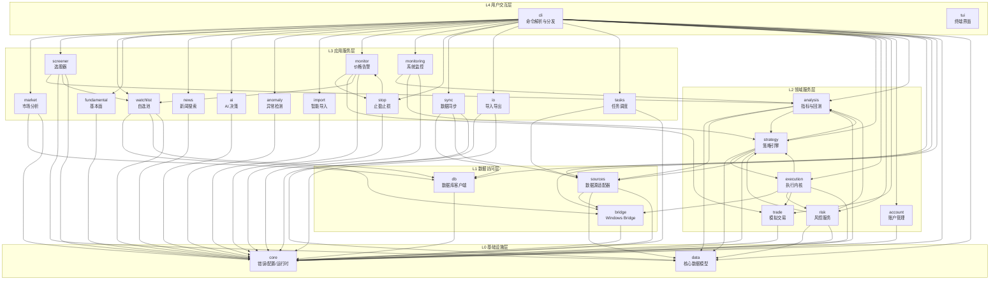
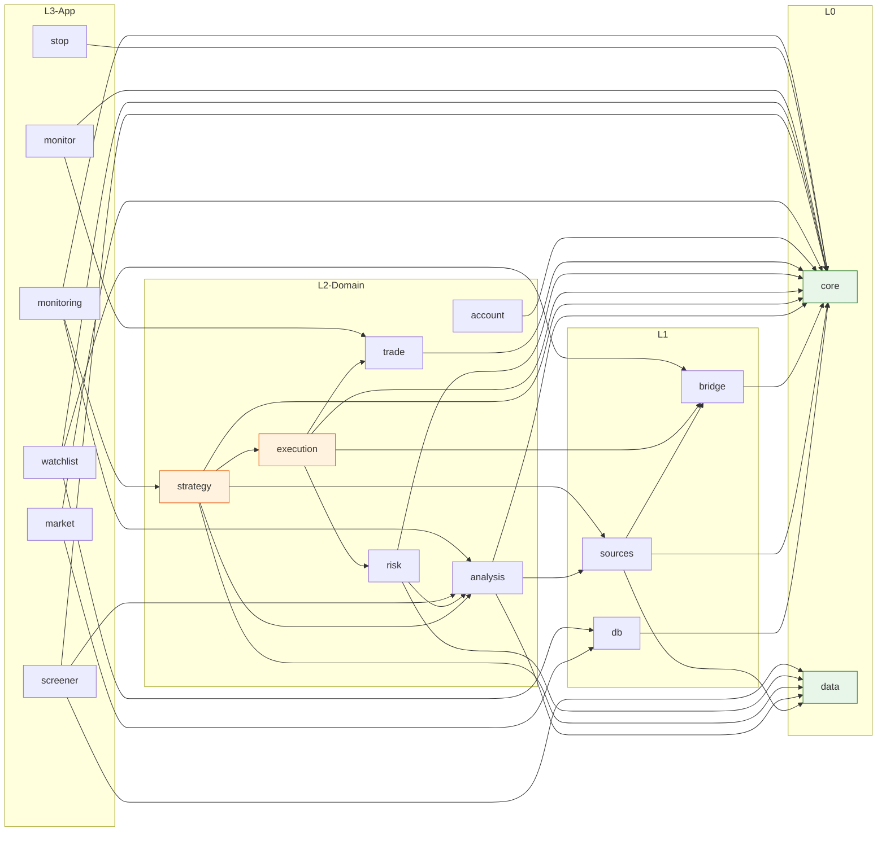

Quantix-Rust 是一个面向 A 股量化交易的 CLI 工具，采用 **单体 Crate、模块化分层** 的架构风格。整个项目编译为单一可执行文件 `quantix`，内部按职责划分为 26 个一级模块，形成从基础设施层到用户交互层的五级依赖栈。本文将从架构全景、分层职责、模块依赖关系图、核心数据流和关键设计模式五个维度，系统解析项目的分层设计。

Sources: [lib.rs](src/lib.rs#L1-L50), [Cargo.toml](Cargo.toml#L1-L125), [main.rs](src/main.rs#L1-L24)

## 架构全景：五级分层模型

项目遵循**依赖倒置原则**——底层模块不依赖上层，上层通过 `use crate::` 引用下层提供的能力。通过代码考古分析，26 个模块可以归类为以下五个层次：

| 层级 | 名称 | 包含模块 | 职责定位 |
|------|------|---------|---------|
| **L0 基础设施层** | Core & Data | `core`, `data` | 错误类型、配置管理、运行时上下文、核心数据模型 |
| **L1 数据访问层** | DB & Sources & Bridge | `db`, `sources`, `bridge` | 数据库客户端、多数据源适配器、Windows Bridge 通信 |
| **L2 领域服务层** | Domain | `analysis`, `strategy`, `execution`, `risk`, `trade`, `account` | 技术指标、策略引擎、执行内核、风控规则、模拟交易、账户管理 |
| **L3 应用服务层** | Application | `market`, `screener`, `watchlist`, `fundamental`, `news`, `ai`, `anomaly`, `import`, `monitoring`, `monitor`, `stop`, `sync`, `io`, `tasks` | 市场分析、选股器、自选池、基本面、新闻、AI 决策、异常检测、导入导出、告警监控等 |
| **L4 用户交互层** | Presentation | `cli`, `tui` | 命令行参数解析、子命令分发、交互式菜单、TUI 界面 |

Sources: [lib.rs](src/lib.rs#L17-L43), [core/mod.rs](src/core/mod.rs#L1-L16), [cli/mod.rs](src/cli/mod.rs#L1-L21)

以下是分层架构的 Mermaid 可视化。在阅读此图前需要理解：箭头方向表示 **"被依赖于"**，即箭头指向的模块是底层基础模块，箭头尾部的模块是上层消费模块。

Sources: 基于 `grep -rh "use crate::" src/<module>/` 全模块交叉引用分析

## L0 基础设施层：一切模块的基石

基础设施层由 `core` 和 `data` 两个模块组成，它们是整个依赖图的根节点——**不依赖任何其他内部模块**，只依赖外部 crate。

### core — 错误、配置与运行时上下文

`core` 模块承担三项基础职责：**统一错误类型** `QuantixError`、**配置加载** `AppConfig`、**运行时上下文** `CliRuntime`。

`QuantixError` 是全项目唯一的错误枚举，通过 `thiserror` 派生 `Error` trait，覆盖配置错误、数据库连接/查询错误、数据源错误、IO 错误、序列化错误、HTTP 错误等 12 种变体，并通过 `From` 实现自动转换。所有模块统一返回 `core::Result<T>` 即 `std::result::Result<T, QuantixError>`。

`CliRuntime` 是应用启动时一次性构建的运行时上下文，从环境变量加载所有外部服务连接参数（ClickHouse、MySQL、Bridge）和本地路径配置（watchlist、trade、risk、monitor、strategy、execution），每个路径都遵循"环境变量优先 → `$HOME/.quantix/` 目录 → 当前目录"三级回退策略。

Sources: [core/error.rs](src/core/error.rs#L1-L58), [core/config.rs](src/core/config.rs#L1-L97), [core/runtime.rs](src/core/runtime.rs#L1-L109), [core/mod.rs](src/core/mod.rs#L1-L16)

### data — 核心数据模型

`data` 模块定义了全项目共享的基础数据结构，其中最重要的是 **`Kline`（K线）** 和 **`Tick`（逐笔）** 模型。`Kline` 结构体包含股票代码、日期、OHLCV（开高低收量）及复权类型，是策略引擎、分析模块、数据源适配器之间的通用数据契约。该模块同样不依赖任何其他内部模块。

Sources: [data/models.rs](src/data/models.rs#L1-L60), [data/mod.rs](src/data/mod.rs#L1-L9)

## L1 数据访问层：外部数据的统一抽象

数据访问层封装了所有外部数据系统的交互逻辑，向上层提供结构化的数据访问接口。

### db — 多数据库客户端

`db` 模块适配三种数据库：**ClickHouse**（主存储，用于 K 线、行情、涨停事件等 OLAP 数据）、**PostgreSQL**（关系型数据，如股票信息、日线数据）、**TDengine**（时序数据库，分钟 K 线）。每种数据库都有独立的客户端实现，对外导出统一的数据类型（如 `KlineDataCH`、`KlineDaily`、`MinuteKline`）。

Sources: [db/mod.rs](src/db/mod.rs#L1-L15)

### sources — 多数据源适配器

`sources` 模块是数据采集的核心，包含 8 个子模块，覆盖了 A 股数据的主要来源：

| 子模块 | 数据来源 | 核心能力 |
|--------|---------|---------|
| `tdx` | 通达信协议 | 实时行情、股票列表 |
| `tdx_file` | 通达信本地文件 | 日线数据导入、复权因子计算 |
| `akshare` | AkShare API | 开源财经数据接口 |
| `eastmoney` | 东方财富 | 板块数据、资金流向、股票信息 |
| `websocket` | WebSocket 实时推送 | 实时行情订阅 |
| `bridge_tdx` | Windows Bridge | 通过 Bridge 间接访问通达信 |
| `kline_aggregator` | 聚合引擎 | 将 tick/multiple 数据聚合为 K 线 |
| `quote_collector` / `auction_collector` | 行情采集 | 批量行情、集合竞价数据 |

Sources: [sources/mod.rs](src/sources/mod.rs#L1-L30)

### bridge — Windows Bridge 通信

`bridge` 模块实现了与 Windows 端 Bridge 服务的 HTTP 通信（`BridgeHttpClient`），用于在 WSL2 环境下桥接通达信/QMT 数据。这是连接 Linux 运行环境与 Windows 金融软件的唯一通道。

Sources: [bridge/mod.rs](src/bridge/mod.rs#L1-L4)

## L2 领域服务层：量化交易核心逻辑

领域服务层包含量化交易的核心业务逻辑，模块间的依赖关系最为复杂。

### analysis — 技术指标与回测引擎

`analysis` 模块是最大的领域模块之一，包含 **技术指标计算**（`indicators`、`indicator_registry`、`indicator_pipeline`）、**回测引擎**（`backtest`）、**K 线形态识别**（`candle_patterns`）、**竞价分析**（`auction`）、**Polars 批量计算**（`polars_adapter`）和**投资组合**（`portfolio`）等子模块。它向下依赖 `data`（读取 K 线）和 `sources`（加载数据），向上被 `strategy`、`risk`、`screener`、`monitoring` 等模块消费。

Sources: [analysis/mod.rs](src/analysis/mod.rs#L1-L36)

### strategy — 策略引擎

策略引擎的核心抽象是 **`Strategy` trait**——定义了 `name()`、`init()`、`on_bar()`、`finish()` 四个异步方法。内置五种策略实现：均线交叉（`ma_cross`）、突破（`breakout`）、网格（`grid`）、均值回归（`mean_reversion`）、动量（`momentum`）。策略运行时由 `StrategyRuntime<L>` 泛型结构驱动，通过 `StrategyBarLoader` trait 解耦数据加载。

`StrategySignalDaemon` 是策略的守护进程实现，负责定时加载配置、遍历活跃股票、执行策略并产生信号，最终将信号写入 `StrategyRuntimeStore`（SQLite runtime.db）。

Sources: [strategy/trait_def.rs](src/strategy/trait_def.rs#L1-L38), [strategy/mod.rs](src/strategy/mod.rs#L1-L45), [strategy/daemon.rs](src/strategy/daemon.rs#L1-L33), [strategy/runtime.rs](src/strategy/runtime.rs#L1-L60)

### execution — 执行决策内核

`execution` 模块实现了**订单生命周期管理**，核心组件包括：

- **`ExecutionAdapter` trait**：执行适配器的统一接口，定义 `submit_order`、`query_order`、`cancel_order` 三个方法
- **`ExecutionKernel`**：执行决策核心，协调信号接收 → 意图构建 → 风控评估 → 适配器提交的完整流程
- **适配器实现**：Paper（模拟成交）、MockLive（模拟实时）、QmtBridge（QMT 桥接预览）、QmtLive（QMT 实盘）
- **`RuntimeJsonRiskServices`**：风控服务的运行时组合，通过 `RiskEvaluator` trait 注入到执行内核

`execution/daemon.rs` 是连接执行与交易的桥梁，它同时依赖 `risk`（风控评估）和 `trade`（模拟交易记账），体现了领域模块间的横向协作。

Sources: [execution/adapter.rs](src/execution/adapter.rs#L1-L64), [execution/kernel.rs](src/execution/kernel.rs#L1-L80), [execution/daemon.rs](src/execution/daemon.rs#L1-L60)

### risk — 风控服务

风控模块实现了**多维度的风险控制**：行业集中度检查（`industry` + `industry_store` + `industry_sync`）、波动率限制（`volatility`）、买入锁定（`BuyLockState`）、实时持仓快照（`RiskAccountSnapshot`）。`RiskService<Store>` 是泛型化的风控服务，通过 trait object 解耦数据存储和行情加载。

Sources: [risk/mod.rs](src/risk/mod.rs#L1-L39), [risk/service.rs](src/risk/service.rs#L1-L80)

### trade — 模拟交易

`trade` 模块管理模拟交易账户的全生命周期：账户初始化、下单、费用计算（`fees`）、持仓管理、交易报告（`reporting`）。`PaperTradeStore` trait 抽象了交易数据持久化，默认实现为 JSON 文件存储。值得注意的是，`trade` 模块是领域层中最独立的模块——**仅依赖 `core`**，不依赖其他领域模块。

Sources: [trade/mod.rs](src/trade/mod.rs#L1-L16)

## L3 应用服务层：面向业务的组合服务

应用服务层将领域层的能力组合为面向具体业务场景的服务，每个模块通常编排一个或多个领域模块来完成特定功能。

以下是应用服务层各模块的依赖与职责一览：

| 模块 | 职责 | 下游领域依赖 | 下游数据依赖 |
|------|------|-------------|-------------|
| `market` | 板块排名、北向资金、龙头股、情绪指数 | — | `db` |
| `screener` | 条件解析、评估引擎、预设筛选 | `analysis` | `data`, `watchlist` |
| `watchlist` | 分组、标签、多源行情解析 | — | `bridge`, `db` |
| `fundamental` | 估值、财报、龙虎榜、机构持仓 | — | — |
| `monitor` | 价格告警、事件存储、systemd 服务 | `stop`, `trade` | `watchlist` |
| `stop` | 止盈止损规则管理与实时评估 | — | `monitor` |
| `anomaly` | Isolation Forest 异常检测 | — | — |
| `ai` | LLM 多模型决策支持 | — | — |
| `news` | 多源新闻搜索与聚合 | — | — |
| `import` | 图片/CSV/文本智能导入 | — | — |
| `sync` | Python quantix 数据同步 | — | `db`, `sources` |
| `io` | CSV/JSON/Parquet 导入导出 | — | `data` |
| `tasks` | Tokio 异步任务调度 | — | `sources` |
| `monitoring` | Prometheus 指标、健康检查、通知 | `analysis`, `strategy` | — |

Sources: 基于 `grep -rh "use crate::" src/<module>/` 全模块交叉引用分析

## L4 用户交互层：CLI 命令分发

用户交互层的核心是 **`cli`** 模块，采用 Clap `derive` 模式定义了 20+ 个顶级子命令（`Data`、`Strategy`、`Analyze`、`Trade`、`Risk`、`Execution`、`Monitor`、`Watchlist` 等），每个子命令进一步嵌套二级和三级子命令。

CLI 模块内部遵循**命令-处理器分离**模式：

- **`cli/commands/`**：纯数据结构，定义 Clap 子命令枚举和参数，不包含任何业务逻辑
- **`cli/handlers/`**：命令处理器，负责实例化各领域服务并调用，是**全项目唯一依赖所有模块的汇聚点**

`cli/handlers/mod.rs` 中的 `pub(crate) use` 语句列出了所有被引入的领域类型，总计从 15 个模块导入了 80+ 个类型，清晰展示了 CLI 层作为"顶层编排者"的角色。

Sources: [cli/commands/mod.rs](src/cli/commands/mod.rs#L1-L238), [cli/handlers/mod.rs](src/cli/handlers/mod.rs#L1-L127)

## 核心依赖关系图

基于代码考古的实际 `use crate::` 引用分析，以下是各层模块间的精确依赖关系：

Sources: 基于全模块 `grep -rh "use crate::" src/<module>/` 交叉引用分析

## 关键设计模式

### Trait 解耦模式

项目大量使用 **trait 抽象**来解耦模块间的依赖，确保每个模块可以独立测试和替换：

| Trait | 所在模块 | 解耦对象 |
|-------|---------|---------|
| `Strategy` | `strategy/trait_def` | 策略实现与策略运行时 |
| `ExecutionAdapter` | `execution/adapter` | 执行适配器（Paper/QMT/MockLive） |
| `RiskEvaluator` | `execution/kernel` | 风控评估逻辑与执行内核 |
| `FillDeltaApplier` | `execution/kernel` | 成交增量与交易记账 |
| `PaperTradeStore` | `trade/service` | 交易数据存储（JSON/SQLite） |
| `StrategyBarLoader` | `strategy/runtime` | K 线数据加载与策略运行 |
| `RiskBarLoader` | `risk/volatility` | 行情加载与波动率计算 |
| `RiskStore` | `risk/service` | 风控状态存储（JSON/SQLite） |
| `FundamentalProvider` | `fundamental/provider` | 基本面数据来源 |
| `NewsProvider` | `news/provider` | 新闻数据来源 |

Sources: [strategy/trait_def.rs](src/strategy/trait_def.rs#L10-L29), [execution/adapter.rs](src/execution/adapter.rs#L48-L63), [execution/kernel.rs](src/execution/kernel.rs#L21-L31)

### 泛型服务 + trait object 组合

`RiskService<Store>` 和 `TradeService<Store>` 采用**泛型参数**绑定存储实现，而内部需要动态分发的组件（如 `RiskBarLoader`、`RiskIndustryResolver`）则通过 `Arc<dyn Trait>` 注入。这种"泛型 + trait object"的混合模式在编译期保证存储类型安全，在运行时灵活切换依赖组件。

Sources: [risk/service.rs](src/risk/service.rs#L50-L56), [trade/service.rs](src/trade/service.rs#L1-L1)

### Daemon 守护进程模式

`StrategySignalDaemon`、`ExecutionDaemon`、`MonitorRunner` 均采用守护进程模式——各自持有独立的配置存储、运行时数据库和业务组件，通过 `run_once()` 或 `run()` 方法实现循环调度。这种模式使得每个守护进程可以独立启停、独立配置，并通过 `systemd` 集成实现系统级服务管理。

Sources: [strategy/daemon.rs](src/strategy/daemon.rs#L24-L33), [execution/daemon.rs](src/execution/daemon.rs#L21-L27)

### 存储策略：JSON 文件与 SQLite

项目采用**双存储策略**：配置类数据（`JsonStrategyConfigStore`、`JsonRiskStore`、`JsonPaperTradeStore`）使用 JSON 文件存储，便于人工查看和编辑；运行时状态数据（`StrategyRuntimeStore`、`SqliteMonitorAlertStore`、`SqliteStopRuleStore`）使用 SQLite，支持事务性写入和复杂查询。所有存储路径通过 `CliRuntime` 统一管理，支持环境变量覆盖。

Sources: [core/runtime.rs](src/core/runtime.rs#L70-L108)

## 依赖流向总结

整个项目的依赖流遵循严格的**自底向上**原则：`core` 和 `data` 作为基石被所有模块依赖；`db`/`sources`/`bridge` 构成数据访问层；`analysis`/`strategy`/`execution`/`risk`/`trade` 形成互相协作的领域层；`cli/handlers` 作为最顶层的编排器，将所有模块的能力组装为用户可操作的命令。

值得注意的是，模块间存在少量**横向依赖**（如 `execution` → `risk`、`execution` → `trade`、`screener` → `watchlist`），这些是领域模块间的自然协作点。项目通过 trait 抽象将这些协作点解耦为接口依赖而非实现依赖，保持了模块的可测试性和可替换性。

Sources: [lib.rs](src/lib.rs#L1-L50), [cli/handlers/mod.rs](src/cli/handlers/mod.rs#L1-L127)

---

**下一步阅读建议**：理解了分层架构后，建议深入各层的关键设计：

- 错误处理体系：[统一错误处理与 QuantixError 体系](5-tong-cuo-wu-chu-li-yu-quantixerror-ti-xi)
- 命令分发机制：[CLI 命令体系与 Clap 子命令分发](6-cli-ming-ling-ti-xi-yu-clap-zi-ming-ling-fen-fa)
- 策略核心抽象：[Strategy Trait 策略接口与内置策略实现](10-strategy-trait-ce-lue-jie-kou-yu-nei-zhi-ce-lue-shi-xian)
- 执行决策流程：[ExecutionKernel 执行决策核心与订单生命周期](11-executionkernel-zhi-xing-jue-ce-he-xin-yu-ding-dan-sheng-ming-zhou-qi)