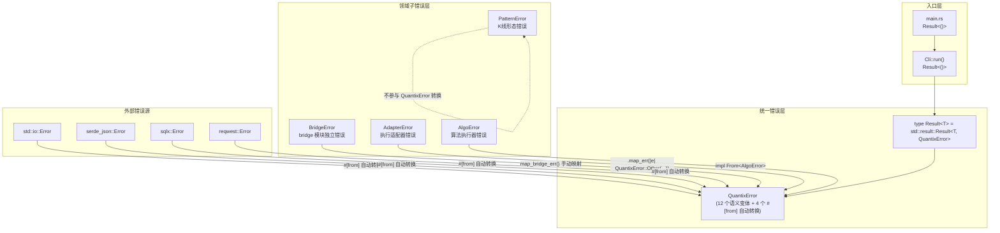
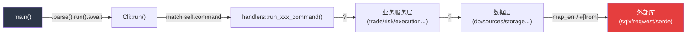
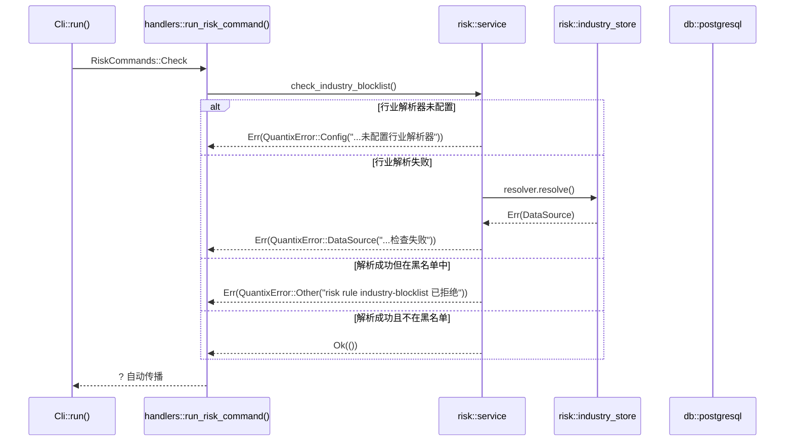

Quantix 项目采用 **单一顶层错误枚举 + 领域子错误类型** 的分层策略，通过 `thiserror` 派生宏实现零成本的错误信息格式化。`QuantixError` 作为贯穿 24 个模块的统一错误类型，结合 `Result<T>` 类型别名，构成了整个项目从底层存储到 CLI 入口的完整错误传播链。本文将深入解析这套错误体系的设计哲学、变体分类、跨模块传播机制，以及项目中存在的领域子错误类型与顶层错误之间的转换关系。

Sources: [error.rs](src/core/error.rs#L1-L58), [mod.rs](src/core/mod.rs#L1-L16)

## 错误体系架构总览

Quantix 的错误处理遵循 Rust 社区最佳实践——在库层面使用具体错误类型（`thiserror`），在应用入口通过 `?` 运算符自动向上传播。整个架构可以划分为三个清晰的层次：



关键设计决策在于：**`QuantixError` 并非试图穷举所有可能的错误**，而是通过语义分类 + `#[from]` 自动转换 + 手动 `From` impl 三种机制，在保持类型安全的同时降低错误处理的心智负担。`color-eyre` 已声明为项目依赖（Cargo.toml 中 `color-eyre = "0.6"`），但在当前版本中尚未启用，错误直接通过 `?` 传播至 `main` 函数返回。

Sources: [main.rs](src/main.rs#L1-L24), [lib.rs](src/lib.rs#L45-L49), [Cargo.toml](Cargo.toml#L89)

## QuantixError 变体详解

`QuantixError` 枚举定义了 14 个变体，可以按其语义职责分为三大类：**业务语义变体**、**外部库桥接变体**和**兜底变体**。

### 业务语义变体

这些变体承载了量化交易系统的领域知识，每个变体都对应一类明确的业务场景：

| 变体 | 格式模板 | 典型使用场景 | 使用频次 |
|------|---------|-------------|---------|
| `Config(String)` | `"配置错误: {0}"` | API Key 缺失、MySQL URL 无效、指标参数格式错误 | 43 |
| `DatabaseConnection(String)` | `"数据库连接失败: {0}"` | ClickHouse 建表失败、TDengine 连接初始化 | 16 |
| `DatabaseQuery(String)` | `"数据库查询失败: {0}"` | SQL 执行错误、批量插入失败、查询结果解析 | 34 |
| `DataSource(String)` | `"数据源错误: {0}"` | TDX TCP 连接失败、Bridge 通信异常 | 16 |
| `DataParse(String)` | `"数据解析错误: {0}"` | JSON 反序列化失败、日期格式无效、数值类型转换 | 25 |
| `Timeout(String)` | `"超时错误: {0}"` | TDX 采集超时、行情收集超时 | 2 |
| `Network(String)` | `"网络错误: {0}"` | HTTP 请求失败、新闻源 API 调用异常 | 11 |
| `Unsupported(String)` | `"功能暂不支持: {0}"` | CLI 未实现的子命令、指标类型未注册 | 41 |
| `Algo(String)` | `"算法错误: {0}"` | 算法参数无效、算法状态异常 | 3 |

**使用频次统计覆盖所有 `src/` 下的 Rust 源文件**（不含测试文件中的 `matches!` 断言）。值得注意的是 `Timeout` 仅有 2 处使用——这反映了当前系统中超时处理尚未全面铺开的现状，多数异步操作依赖 Tokio 的默认超时机制而非主动的超时错误构造。

Sources: [error.rs](src/core/error.rs#L6-L49), [tavily.rs](src/news/providers/tavily.rs#L64-L150), [clickhouse.rs](src/db/clickhouse.rs#L114-L377)

### 外部库桥接变体（`#[from]` 自动转换）

四个变体通过 `#[from]` 属性实现了从外部库错误类型的自动转换，使 `?` 运算符可以直接在返回 `QuantixError` 的函数中使用：

| 变体 | 源类型 | 桥接方式 | 覆盖场景 |
|------|--------|---------|---------|
| `Io(#[from] std::io::Error)` | `std::io::Error` | 自动转换 | 文件读写、系统调用 |
| `Serialization(#[from] serde_json::Error)` | `serde_json::Error` | 自动转换 | JSON 序列化/反序列化 |
| `Sqlx(#[from] sqlx::Error)` | `sqlx::Error` | 自动转换 | PostgreSQL 异步查询 |
| `Http(#[from] reqwest::Error)` | `reqwest::Error` | 自动转换 | HTTP 客户端请求 |

`#[from]` 的核心价值在于**消除样板代码**。在数据库层（`src/db/postgresql.rs`）中，`sqlx::Error` 通过 `#[from]` 可以直接用 `?` 传播，但代码中实际选择了 `map_err(|e| QuantixError::DatabaseQuery(...))` 的方式——这是因为开发者希望提供更精确的中文上下文信息（如 `"查询 K线数据失败: ..."`），而非使用 `#[from]` 生成的默认格式。这两种模式在项目中并存，体现了**精确性**与**便利性**之间的工程权衡。

Sources: [error.rs](src/core/error.rs#L26-L36), [postgresql.rs](src/db/postgresql.rs#L49-L126)

### 兜底变体：`Other(String)`

`Other` 变体是整个错误体系中**使用最频繁**的变体（约 457 处），充当了通用错误容器。它的使用场景覆盖以下几类模式：

**业务规则校验**——在交易模型验证中，当订单代码为空或数值不合法时：
```rust
return Err(QuantixError::Other("trade order code 不能为空".to_string()));
```

**跨层错误包装**——当 `ExecutionAdapter` 返回 `AdapterError` 时，`ExecutionKernel` 使用 `Other` 进行包装：
```rust
.map_err(|err| QuantixError::Other(err.to_string()))?;
```

**Fallback 策略失败**——新闻聚合器中所有 Provider 均不可用时的兜底：
```rust
.unwrap_or_else(|| QuantixError::Other("All news providers failed".to_string()))
```

`Other` 的高频使用揭示了一个架构特征：**部分领域错误尚未被提取为独立的语义变体**。对于中期演进，可以考虑将高频 `Other` 场景（如交易验证失败、风控拒绝）提升为具名变体，以增强模式匹配的精确性。

Sources: [trade/models.rs](src/trade/models.rs#L237-L292), [kernel.rs](src/execution/kernel.rs#L389-L390), [aggregator.rs](src/news/aggregator.rs#L147)

## 错误传播机制

### `Result<T>` 类型别名与全链路传播

项目通过 `pub type Result<T> = std::result::Result<T, QuantixError>` 定义了统一的 Result 别名，并在两个关键位置重新导出：

- `src/core/mod.rs` 中的 `pub use error::{QuantixError, Result}`
- `src/lib.rs` 中的 `pub use core::{QuantixError, Result}`

这使得所有模块都可以通过 `use crate::core::Result` 引入统一的返回类型。从 CLI 入口到业务逻辑的完整传播路径如下：



在 `src/cli/commands/mod.rs` 的 `Cli::run()` 方法中，所有 20+ 个子命令分支（`Commands::Init`、`Commands::Data`、`Commands::Trade` 等）均通过 `handlers::run_xxx_command(cmd).await?` 将错误向上传播，最终汇聚到 `main.rs` 中的 `Cli::parse().run().await`。这种**统一出口**的设计保证了所有错误都有机会被顶层日志框架记录。

Sources: [main.rs](src/main.rs#L13-L23), [commands/mod.rs](src/cli/commands/mod.rs#L154-L231), [lib.rs](src/lib.rs#L47)

### 三种错误转换模式

项目中存在三种将底层错误转换为 `QuantixError` 的模式，按自动化程度从高到低排列：

**模式一：`#[from]` 自动转换（零样板代码）**——适用于外部库错误可以直接映射到 `QuantixError` 变体的场景。当前仅用于 `Io`、`Serialization`、`Sqlx`、`Http` 四种标准库/第三方错误。当 `#[from]` 挂载的函数内部使用 `?` 时，编译器自动插入 `Into::into()` 调用。

**模式二：手动 `impl From<T> for QuantixError`（类型安全转换）**——目前仅有一处实现：`From<AlgoError> for QuantixError`。这种方式在保留类型安全的同时，允许将领域子错误按统一语义映射：

```rust
impl From<crate::execution::algo::AlgoError> for QuantixError {
    fn from(err: crate::execution::algo::AlgoError) -> Self {
        QuantixError::Algo(err.to_string())
    }
}
```

**模式三：`.map_err()` 显式映射（最大灵活性）**——这是项目中使用最多的转换方式（约 159 处 `map_err` + 86 处 `ok_or_else`）。它允许在转换时附加上下文信息：

```rust
// 数据库层：附加查询语义
.map_err(|e| QuantixError::DatabaseQuery(format!("查询 K线数据失败: {}", e)))?;

// 风控层：附加规则上下文
.map_err(|err| QuantixError::DataSource(format!(
    "risk rule industry-blocklist 检查失败: code={} 原因={}",
    projected_buy.code, err
)))?;
```

Sources: [error.rs](src/core/error.rs#L53-L57), [clickhouse.rs](src/db/clickhouse.rs#L599-L647), [risk/service.rs](src/risk/service.rs#L569-L577)

## 领域子错误类型

除了顶层 `QuantixError`，项目中存在四个领域特定的错误类型，它们服务于**不同的错误边界**：

| 错误类型 | 所在模块 | 变体数量 | 与 QuantixError 的关系 |
|---------|---------|---------|---------------------|
| `BridgeError` | `bridge` | 2 (Config, Http) | 通过 `map_bridge_err()` 手动映射为 `DataSource` |
| `AdapterError` | `execution` | 3 (Unsupported, Execution, Network) | 通过 `.map_err()` 映射为 `Other` |
| `AlgoError` | `execution/algo` | 8 (InvalidParams, NotFound 等) | 通过 `impl From` 映射为 `Algo` |
| `PatternError` | `analysis` | 3 (InvalidEpsilon, InvalidOhlc, MissingPreviousCloseReference) | 不参与转换，仅用于内部 |

### BridgeError——Bridge 模块的封闭错误边界

`BridgeError` 是 `bridge` 模块的私有错误类型，拥有自己的 `Result<T>` 别名。它仅包含 `Config` 和 `Http`（通过 `#[from] reqwest::Error`）两个变体，对应 Windows Bridge 客户端可能遇到的两种错误场景。

`BridgeError` 到 `QuantixError` 的转换通过 `src/sources/bridge_tdx.rs` 中的 `map_bridge_err()` 函数完成，将所有 Bridge 错误统一映射为 `QuantixError::DataSource`：

```rust
fn map_bridge_err(err: crate::bridge::error::BridgeError) -> QuantixError {
    QuantixError::DataSource(format!("bridge tdx error: {err}"))
}
```

这种设计使得 `bridge` 模块可以在**不依赖 `QuantixError`** 的前提下独立编译和测试，仅在 `bridge_tdx` 适配器层进行错误类型的桥接。

Sources: [bridge/error.rs](src/bridge/error.rs#L1-L13), [bridge/client.rs](src/bridge/client.rs#L28-L41), [bridge_tdx.rs](src/sources/bridge_tdx.rs#L111-L113)

### AdapterError——执行适配器的标准化接口

`AdapterError` 定义在 `ExecutionAdapter` trait 的同一文件中，是所有执行适配器（Paper / MockLive / QMT Live）的统一错误契约。它包含三个变体：`Unsupported`（功能未实现）、`Execution`（执行失败）和 `Network`（网络异常）。

`AdapterError` 的独特之处在于它实现了 `PartialEq` 和 `Eq`——这支持了单元测试中对错误类型的精确比较。在 `ExecutionKernel` 中，`AdapterError` 通过 `.map_err(|err| QuantixError::Other(err.to_string()))` 进行转换。这里选择 `Other` 而非更语义化的变体，是因为 Kernel 层无法预知具体适配器的错误含义。

Sources: [adapter.rs](src/execution/adapter.rs#L36-L46), [paper.rs](src/execution/paper.rs#L37-L106), [qmt_live_adapter.rs](src/execution/qmt_live_adapter.rs#L163-L297)

### AlgoError——算法执行器的精细状态表达

`AlgoError` 拥有 8 个变体，是项目中粒度最细的领域错误类型，覆盖了算法生命周期的各个阶段：参数校验（`InvalidParams`）、算法发现（`NotFound`）、状态冲突（`AlreadyRunning` / `NotRunning`）、执行失败（`OrderFailed`）、数据缺失（`MarketDataUnavailable`）、超时（`Timeout`）和内部错误（`Internal`）。

`AlgoError` 是唯一通过 `impl From` 正式注册到 `QuantixError` 的领域子错误，映射为 `QuantixError::Algo`。这意味着在返回 `core::Result` 的算法执行器方法（如 `AlgorithmExecutor::initialize`、`start`、`step` 等）中，可以直接使用 `?` 传播 `AlgoError`。

Sources: [executor.rs](src/execution/algo/executor.rs#L15-L41), [error.rs](src/core/error.rs#L53-L57)

## 各模块错误使用分布

以下统计展示了 `QuantixError` 在各模块中的使用分布（基于 `QuantixError::` 构造调用的计数）：

| 模块 | 使用次数 | 主要变体 | 典型场景 |
|------|---------|---------|---------|
| `cli` | 182 | Other, Unsupported | 命令路由、参数校验、业务规则 |
| `risk` | 72 | Other, DataSource, Config | 风控规则检查、行业解析、数据导入 |
| `execution` | 60 | Other, Unsupported, Config | 订单执行、适配器调用、运行时配置 |
| `db` | 42 | DatabaseConnection, DatabaseQuery | 建表、查询、批量插入 |
| `io` | 40 | Other, DataParse | 数据导入导出、CSV 解析 |
| `sources` | 35 | DataSource, Timeout | TDX TCP 连接、Bridge 通信 |
| `strategy` | 34 | Other, Config | 策略配置加载、守护进程 |
| `news` | 25 | Other, Network, Config | 多源新闻聚合、API 调用 |
| `account` | 21 | Other | 账户 CRUD、路由分配 |
| `fundamental` | 19 | Unsupported, Other | 基本面数据（龙虎榜/机构/估值） |
| `analysis` | 19 | Config, Unsupported, DataParse | 指标注册、参数校验 |
| `screener` | 18 | Other | 选股条件评估 |
| `monitor` | 16 | DataParse, Other | 告警存储、事件序列化 |
| `trade` | 13 | Other | 订单验证、交易执行 |

`cli` 模块以 182 次居首，这反映了 CLI handler 层作为**错误聚合点**的角色——它负责将来自所有业务模块的错误统一包装并呈现给用户。

Sources: [基于全代码库 grep 统计](src/core/error.rs#L6-L49)

## 错误传播实战：一次完整的风控检查链路

以风控模块中的行业黑名单检查为例，展示错误如何从最底层传播到 CLI 入口：



这条链路中出现了三种不同的 `QuantixError` 变体：`Config`（缺少依赖配置）、`DataSource`（数据获取失败）和 `Other`（业务规则拒绝），每种都携带了精确的中文上下文信息。最终所有错误通过 `?` 运算符传播到 `main()` 函数，由 Rust 运行时打印 `Display` 格式化结果。

Sources: [risk/service.rs](src/risk/service.rs#L555-L592), [risk/industry_sync.rs](src/risk/industry_sync.rs#L51)

## 设计演进建议

基于当前错误体系的使用模式分析，以下几个方向值得在后续迭代中考虑：

**1. 将高频 `Other` 场景提升为具名变体**——`Other` 变体的 457 次使用中，大量场景可以归类为"业务规则违反"（如交易验证、风控拒绝）和"资源未找到"（如账户不存在、算法不存在）。引入 `BusinessRule(String)` 和 `NotFound(String)` 变体可以显著提升错误匹配的精确性。

**2. 为 `AdapterError` 添加 `From` impl**——当前 `ExecutionKernel` 使用 `QuantixError::Other(err.to_string())` 包装 `AdapterError`，丢失了原始错误的结构化信息。参考 `AlgoError` 的做法，可以添加 `impl From<AdapterError> for QuantixError` 并映射为 `Execution` 变体。

**3. 启用 `color-eyre` 的错误报告**——`color-eyre = "0.6"` 已在 `Cargo.toml` 中声明，但尚未在 `main.rs` 中调用 `color_eyre::install()`。启用后可以为 CLI 用户提供带颜色高亮和调用栈的错误报告，显著改善调试体验。

Sources: [Cargo.toml](Cargo.toml#L89), [kernel.rs](src/execution/kernel.rs#L389-L390), [main.rs](src/main.rs#L13-L23)

## 延伸阅读

- 错误传播到达的 CLI 命令分发层详见 [CLI 命令体系与 Clap 子命令分发](6-cli-ming-ling-ti-xi-yu-clap-zi-ming-ling-fen-fa)
- 错误体系所服务的分层架构全景参见 [分层架构设计与模块依赖关系](4-fen-ceng-jia-gou-she-ji-yu-mo-kuai-yi-lai-guan-xi)
- 数据库层错误的完整使用场景参见 [数据库客户端层（ClickHouse / PostgreSQL / TDengine）](8-shu-ju-ku-ke-hu-duan-ceng-clickhouse-postgresql-tdengine)
- `AdapterError` 与执行适配器的关系详见 [执行适配器架构（Paper / MockLive / QMT Bridge）](12-zhi-xing-gua-pei-qi-jia-gou-paper-mocklive-qmt-bridge)