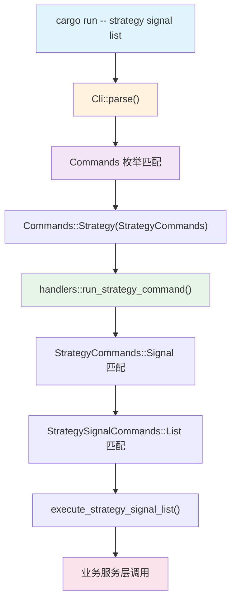

Quantix 的命令行界面采用 **Clap 4 derive 模式**构建了一套三层嵌套子命令体系，覆盖数据查询、策略运行、风控管理、执行自动化等 20 个顶级命令域，总计约 45 个子命令枚举类型。整个分发链路遵循"命令定义 → 枚举匹配 → Handler 执行 → 服务层调用"的严格单向数据流，任何命令从用户输入到业务逻辑的映射路径都可在编译期静态验证。这种设计将参数解析的职责完全委托给 Clap 的 derive 宏，开发者只需关注枚举变体与 Handler 函数之间的语义映射。

Sources: [main.rs](src/main.rs#L1-L24), [cli/commands/mod.rs](src/cli/commands/mod.rs#L1-L238)

## 架构总览：从 `main()` 到 Handler 的完整链路

入口函数极为精简——`Cli::parse().run().await` 一行代码同时完成了参数解析与命令分发。`Cli` 结构体通过 `#[derive(Parser)]` 注解声明应用元信息（名称、版本、描述），其唯一的字段 `command: Commands` 标记为 `#[command(subcommand)]`，驱动 Clap 生成完整的子命令解析器。



分发链路的核心机制是 `Commands::run()` 方法中对 `self.command` 的 `match` 表达式。每个顶层变体直接转发到对应的 `handlers::run_*_command()` 异步函数。这种"胖枚举 + 薄分发"的模式确保了新增命令时只需：(1) 在对应 `commands/*.rs` 中添加枚举变体；(2) 在 `handlers` 层添加匹配分支与处理逻辑。

Sources: [main.rs](src/main.rs#L12-L23), [cli/commands/mod.rs](src/cli/commands/mod.rs#L153-L232)

## 三层命令模型与文件组织

CLI 模块在 `src/cli/` 下严格分为三个职责子目录，每个目录对应命令处理生命周期的不同阶段：

| 目录 | 职责 | 关键特征 |
|------|------|---------|
| `commands/` | **命令定义层** — 纯 Clap derive 结构 | 仅包含 `#[derive(Subcommand)]` 枚举，零业务逻辑 |
| `handlers/` | **命令分发层** — 参数匹配与服务编排 | 聚合多个服务层依赖，执行 `match` 分发 |
| `tests/` | **解析验证层** — Clap 解析正确性测试 | 使用 `Cli::try_parse_from()` 验证命令解析 |

**第一层**：`Commands` 枚举定义在 [cli/commands/mod.rs](src/cli/commands/mod.rs#L49-L151)，包含 20 个顶级变体。其中 `Init`、`Menu`、`Status` 为内联参数变体，其余 17 个通过 `#[command(subcommand)]` 委托到各自的二级命令枚举。

**第二层**：每个顶级命令域（如 `StrategyCommands`、`RiskCommands`）定义在 `commands/` 目录下的独立文件中。这些二级枚举既包含带参数的叶变体（如 `StrategyCommands::Run { name, mode, code }`），也包含通过 `#[command(subcommand)]` 嵌套的三级命令（如 `StrategyCommands::Daemon(StrategyDaemonCommands)`）。

**第三层**：三级命令枚举全部定义在与其父级相同的文件中。例如 `StrategyDaemonCommands`、`StrategySignalCommands`、`StrategyRequestCommands` 等全部位于 [cli/commands/strategy.rs](src/cli/commands/strategy.rs#L1-L209)。这种"同族聚合"策略使命令树的定义高度局部化。

Sources: [cli/commands/mod.rs](src/cli/commands/mod.rs#L1-L34), [cli/commands/strategy.rs](src/cli/commands/strategy.rs#L1-L53)

## 顶级命令域全景

下表列出 `Commands` 枚举的全部 20 个变体及其对应的 Handler 函数和命令定义文件：

| 顶级命令 | 描述 | Handler 函数 | 定义文件 |
|----------|------|-------------|---------|
| `Init` | 初始化配置和数据库 | `run_init()` | mod.rs |
| `Menu` | 交互式菜单（简单/TUI） | `run_simple_menu()` / `run_tui_menu()` | mod.rs |
| `Data` | 数据查询与导出 | `run_data_command()` | data.rs |
| `Strategy` | 策略运行/信号/守护进程 | `run_strategy_command()` | strategy.rs |
| `Task` | 定时任务调度 | `run_task_command()` | analysis.rs |
| `Analyze` | 技术指标/回测/K线形态/选股 | `run_analyze_command()` | analysis.rs |
| `Monitor` | 自选池监控/告警/守护进程 | `run_monitor_command()` | monitor.rs |
| `Stop` | 止盈止损规则管理 | `run_stop_command()` | monitor.rs |
| `Watchlist` | 自选池管理/分组/标签 | `run_watchlist_command()` | market.rs |
| `Market` | 板块排名/北向资金/龙头股 | `run_market_command()` | market.rs |
| `Trade` | 模拟交易/持仓/费用 | `run_trade_command()` | trade.rs |
| `Risk` | 风控规则/导入/行业同步 | `run_risk_command()` | risk.rs |
| `Execution` | 执行配置/守护进程/Bridge | `run_execution_command()` | trade.rs |
| `Anomaly` | Isolation Forest 异常检测 | `run_anomaly_command()` | trade.rs |
| `Algo` | TWAP/VWAP 算法交易 | `run_algo_command()` | trade.rs |
| `Account` | 多账户注册/路由/拆单 | `run_account_command()` | account.rs |
| `Notify` | 多渠道通知发送 | `run_notify_command()` | info.rs |
| `Ai` | LLM 分析/决策/问答 | `run_ai_command()` | info.rs |
| `News` | 多源新闻搜索 | `run_news_command()` | info.rs |
| `Fundamental` | 基本面/估值/龙虎榜 | `run_fundamental_command()` | info.rs |
| `Sentiment` | 舆情分析 | `run_sentiment_command()` | info.rs |
| `Import` | 图片/CSV/剪贴板导入 | `run_import_command()` | info.rs |
| `Status` | 系统状态/健康检查 | `run_status()` | mod.rs |

值得注意的是，命令域与文件并非严格 1:1 映射。[analysis.rs](src/cli/commands/analysis.rs) 同时包含 `TaskCommands` 和 `AnalyzeCommands`；[trade.rs](src/cli/commands/trade.rs) 聚合了 `TradeCommands`、`ExecutionCommands`、`AnomalyCommands`、`AlgoCommands` 四个命令域；[info.rs](src/cli/commands/info.rs) 更是承载了 `NotifyCommands`、`AiCommands`、`NewsCommands`、`FundamentalCommands`、`SentimentCommands`、`ImportCommands` 六个命令域。这种聚合策略将相关功能的命令定义打包在一起，减少了文件数量。

Sources: [cli/commands/mod.rs](src/cli/commands/mod.rs#L49-L151), [cli/handlers/mod.rs](src/cli/handlers/mod.rs#L106-L127)

## 命令嵌套深度分析

命令体系最深可达 **三层嵌套**。以 `strategy` 命令树为例：

```
quantix strategy signal list --approval-status pending --limit 20
   │         │       │
   │         │       └── 三级叶变体 (StrategySignalCommands::List)
   │         └── 二级子命令 (StrategyCommands::Signal)
   └── 一级命令域 (Commands::Strategy)
```

对应的三层枚举定义链为：

1. **`Commands::Strategy(StrategyCommands)`** — 一级匹配在 [cli/commands/mod.rs](src/cli/commands/mod.rs#L169)
2. **`StrategyCommands::Signal(StrategySignalCommands)`** — 二级匹配在 [cli/commands/strategy.rs](src/cli/commands/strategy.rs#L39-L41)
3. **`StrategySignalCommands::List { ... }`** — 三级叶变体在 [cli/commands/strategy.rs](src/cli/commands/strategy.rs#L75-L101)

下表汇总了具有三级嵌套的命令树及其完整路径：

| 一级命令 | 二级子命令 | 三级叶命令 |
|----------|-----------|-----------|
| `strategy` | `config` | `init`, `show` |
| `strategy` | `daemon` | `run` |
| `strategy` | `signal` | `list`, `approve`, `reject` |
| `strategy` | `request` | `list`, `show`, `execute`, `cancel` |
| `strategy` | `service` | `install`, `uninstall`, `start`, `stop`, `status`, `enable`, `disable` |
| `strategy` | `service-config` | `show`, `set` |
| `monitor` | `alert` | `add`, `list`, `remove` |
| `monitor` | `config` | `show`, `set`, `clear-group` |
| `monitor` | `daemon` | `run` |
| `monitor` | `service` | `install`, `uninstall`, `start`, `stop`, `status`, `enable`, `disable` |
| `monitor` | `service-config` | `show`, `set` |
| `monitor` | `event` | `list` |
| `execution` | `config` | `init`, `show` |
| `execution` | `daemon` | `run` |
| `execution` | `bridge` | `status`, `qmt-preview`, `qmt-live`, `qmt-query`, `qmt-cancel`, `qmt-account`, `qmt-positions`, `qmt-asset` |
| `risk` | `import` | `live-trades` |
| `risk` | `sync` | `industry` |
| `risk` | `rebuild` | `live-account` |
| `risk` | `rule` | `set`, `list`, `enable`, `disable` |
| `risk` | `lock` | `release` |
| `analyze` | `screener` | `preset-list`, `run` |
| `watchlist` | `group` | `create`, `list` |
| `watchlist` | `tag` | `add`, `remove`, `list` |
| `account` | `group` | `create`, `list`, `show`, `remove`, `add-account`, `remove-account`, `set-strategy` |

Sources: [cli/commands/strategy.rs](src/cli/commands/strategy.rs#L1-L209), [cli/commands/monitor.rs](src/cli/commands/monitor.rs#L1-L296), [cli/commands/risk.rs](src/cli/commands/risk.rs#L1-L142), [cli/commands/trade.rs](src/cli/commands/trade.rs#L83-L320)

## Handler 层分发模式

Handler 层存在两种分发模式：**集中式**和**委托式**。

### 集中式分发（handlers/mod.rs）

大多数命令的 Handler 直接定义在 [handlers/mod.rs](src/cli/handlers/mod.rs) 中。该文件超过 5600 行，通过 `match` 表达式逐层解构子命令枚举。典型的分发模式如下：

```rust
// handlers/mod.rs 中的二级嵌套 match 模式
pub async fn run_strategy_command(cmd: StrategyCommands) -> Result<()> {
    match cmd {
        StrategyCommands::Run { name, mode, code } => {
            run_strategy(name, mode, code).await?;
        }
        StrategyCommands::List => {
            list_strategies().await?;
        }
        StrategyCommands::Signal(subcommand) => match subcommand {
            StrategySignalCommands::List { approval_status, .. } => {
                execute_strategy_signal_list(approval_status.as_deref(), ..).await?;
            }
            StrategySignalCommands::Approve { signal_id, .. } => {
                execute_strategy_signal_approve(&signal_id, ..).await?;
            }
            // ...
        },
        // ...
    }
}
```

该函数在 [handlers/mod.rs](src/cli/handlers/mod.rs#L370-L484) 中实现，通过嵌套 `match` 解构到三级子命令后调用具体的执行函数。

### 委托式分发（handlers/*.rs）

部分功能域的 Handler 被提取到独立文件中，这些文件通过 `mod` 声明引入并由 `handlers/mod.rs` 的 `pub use` 重新导出：

```rust
// handlers/mod.rs — 模块声明与重新导出
mod account;
mod algo;
mod anomaly;
mod ai;
mod fundamental;
// ...

pub use self::account::run_account_command;
pub use self::algo::run_algo_command;
pub use self::anomaly::run_anomaly_command;
// ...
```

委托式 Handler 内部通常采用 **Output 枚举模式**——将命令执行结果建模为枚举变体，将业务逻辑与输出格式化解耦。以 [handlers/risk.rs](src/cli/handlers/risk.rs#L31-L44) 为例：

```rust
// 业务逻辑返回类型化的 Output 枚举
enum RiskCommandOutput {
    RuleSet(RiskRule),
    RuleList(Vec<RiskRule>),
    ImportSummary(LiveImportBatchSummary),
    Status(RiskStatus),
    // ...
}

// 分发函数返回 Result<RiskCommandOutput>
// 打印函数消费 RiskCommandOutput
```

这种模式将命令执行（`execute_risk_command_with_service_at`）与结果渲染（`print_risk_command_output`）分离，使得同一业务逻辑可被不同的展示层复用，同时便于在测试中验证返回值的正确性。

Sources: [cli/handlers/mod.rs](src/cli/handlers/mod.rs#L106-L127), [cli/handlers/risk.rs](src/cli/handlers/risk.rs#L9-L122)

## Clap 高级参数校验机制

命令定义层大量使用了 Clap 的 `ArgGroup`、`conflicts_with` 等声明式校验，将参数互斥和必需性约束前移至解析阶段，避免在 Handler 层做运行时检查。

### ArgGroup 互斥选择

[monitor.rs](src/cli/commands/monitor.rs#L6-L11) 中的 `MonitorCommands::Watchlist` 使用 `ArgGroup` 强制用户在 `--once` 和 `--repeat` 之间二选一：

```rust
#[command(group(
    ArgGroup::new("monitor_watchlist_mode")
        .args(["once", "repeat"])
        .required(true)
        .multiple(false)
))]
Watchlist {
    #[arg(long)]
    once: bool,
    #[arg(long)]
    repeat: bool,
},
```

类似地，[monitor.rs](src/cli/commands/monitor.rs#L164-L172) 中 `StopCommands::Set` 的 `stop_rule_threshold` 组确保至少指定一种止损/止盈阈值。

### conflicts_with 互斥约束

[monitor.rs](src/cli/commands/monitor.rs#L178-L195) 中的 `StopCommands::Set` 细粒度地声明了参数冲突关系：`--loss` 与 `--trailing` 和 `--loss-pct` 互斥，`--profit` 与 `--profit-pct` 互斥。这意味着固定止损价、百分比止损、跟踪止损三种模式不可混用：

```rust
#[arg(long, conflicts_with = "trailing")]
loss: Option<f64>,
#[arg(long = "loss-pct", conflicts_with_all = ["loss", "trailing"])]
loss_pct: Option<f64>,
#[arg(long, conflicts_with_all = ["loss", "loss_pct"])]
trailing: Option<f64>,
```

Sources: [cli/commands/monitor.rs](src/cli/commands/monitor.rs#L1-L120)

## 命令解析测试策略

CLI 测试集中在 `src/cli/tests/` 目录下，采用 **`Cli::try_parse_from()` 模式**验证命令解析的正确性。每个命令域对应一个独立测试文件：

| 测试文件 | 覆盖范围 |
|----------|---------|
| `strategy.rs` | 策略运行模式、Config/Daemon/Signal/Request/Service 子命令 |
| `execution.rs` | 执行配置、守护进程、Bridge 预览与 QMT 命令 |
| `risk.rs` | 风控导入/同步/重建/规则/锁/状态 |
| `monitor.rs` | 监控告警/配置/守护进程/服务/事件 |
| `trade.rs` | 模拟交易初始化/买卖/历史/费用/持仓 |
| `market.rs` | 板块排名/北向资金/龙头股/概览 |
| `watchlist.rs` | 自选池增删/分组/标签/历史 |
| `stop.rs` | 止盈止损设置/更新/列表/历史 |
| `screener.rs` | 选股预设列表/筛选运行 |
| `analyze.rs` | 技术指标/回测/K线形态 |

测试范式高度统一：构造命令行参数数组 → `Cli::try_parse_from()` → `match` 解构验证字段值。以 [cli/tests/strategy.rs](src/cli/tests/strategy.rs#L4-L16) 为例：

```rust
#[test]
fn parses_strategy_run_modes() {
    let cli = Cli::try_parse_from([
        "quantix", "strategy", "run", "-n", "ma_cross", "--mode", "paper", "-c", "000001",
    ])
    .unwrap();
    match cli.command {
        Commands::Strategy(StrategyCommands::Run { name, mode, code }) => {
            assert_eq!(name, "ma_cross");
            assert_eq!(mode, "paper");
            assert_eq!(code.as_deref(), Some("000001"));
        }
        other => panic!("unexpected command: {:?}", other),
    }
}
```

这种测试模式的显著优势是**零 IO 依赖**——`try_parse_from()` 仅执行 Clap 的解析逻辑，不触及数据库、网络或文件系统，测试可以在毫秒级完成。

Sources: [cli/tests/mod.rs](src/cli/tests/mod.rs#L1-L15), [cli/tests/strategy.rs](src/cli/tests/strategy.rs#L1-L61), [cli/tests/execution.rs](src/cli/tests/execution.rs#L1-L57)

## 交互式菜单模式

除子命令模式外，CLI 还提供 `quantix menu` 交互式入口，通过 `dialoguer` crate 的 `Select` 组件实现终端交互。菜单模式是一个简单的 `loop` 循环，提供数据同步、策略运行、回测分析、任务管理、技术分析、数据导出六个快捷操作，用户选择后直接调用对应 Handler 函数。

`quantix menu --tui` 预留了基于 `ratatui` 的全屏终端界面入口，目前标记为开发中状态（`TODO`）。

Sources: [cli/handlers/mod.rs](src/cli/handlers/mod.rs#L160-L205)

## 扩展新命令的标准流程

基于现有架构模式，添加新命令的标准流程如下：

1. **定义命令枚举** — 在 `src/cli/commands/` 下的对应文件中添加 `#[derive(Subcommand)]` 枚举变体。如果是全新命令域，创建新文件并在 `commands/mod.rs` 中注册。
2. **注册到 Commands 枚举** — 在 [cli/commands/mod.rs](src/cli/commands/mod.rs#L49-L151) 的 `Commands` 枚举中添加新变体，使用 `#[command(subcommand)]` 注解。
3. **Re-export 类型** — 在 [cli/mod.rs](src/cli/mod.rs#L8-L20) 的 `pub use` 列表中添加新枚举类型。
4. **实现 Handler** — 在 `handlers/mod.rs` 或独立 Handler 文件中添加 `run_*_command()` 异步函数，内部通过 `match` 分发子命令。
5. **接入 run() 方法** — 在 [Cli::run()](src/cli/commands/mod.rs#L154-L232) 的 `match self.command` 中添加新分支。
6. **编写解析测试** — 在 `src/cli/tests/` 下创建对应测试文件，覆盖所有子命令的解析路径。

Sources: [cli/commands/mod.rs](src/cli/commands/mod.rs#L153-L232), [cli/mod.rs](src/cli/mod.rs#L1-L21)

## 相关章节

- **上层依赖**：命令分发依赖于 [分层架构设计与模块依赖关系](4-fen-ceng-jia-gou-she-ji-yu-mo-kuai-yi-lai-guan-xi) 中描述的模块分层；Handler 层的错误传播遵循 [统一错误处理与 QuantixError 体系](5-tong-cuo-wu-chu-li-yu-quantixerror-ti-xi) 中定义的 `Result<()>` 约定。
- **下游调用**：每个 Handler 最终调用的业务服务层分布在后续各专题页面中，如 [Strategy Trait 策略接口与内置策略实现](10-strategy-trait-ce-lue-jie-kou-yu-nei-zhi-ce-lue-shi-xian)、[风控服务：规则引擎、行业集中度与波动率检查](16-feng-kong-fu-wu-gui-ze-yin-qing-xing-ye-ji-zhong-du-yu-bo-dong-lu-jian-cha)、[ExecutionKernel 执行决策核心与订单生命周期](11-executionkernel-zhi-xing-jue-ce-he-xin-yu-ding-dan-sheng-ming-zhou-qi) 等。