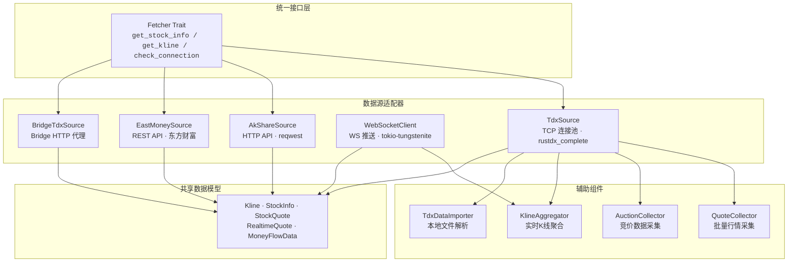
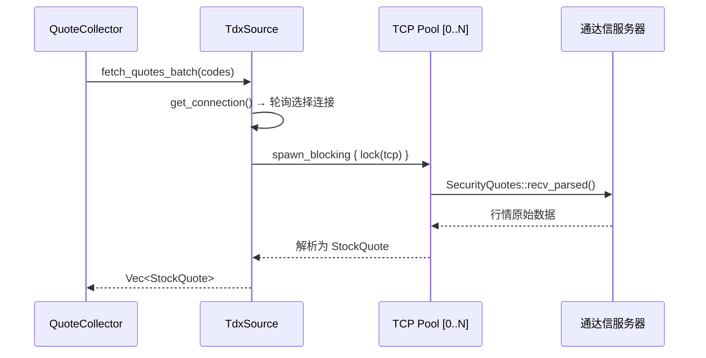
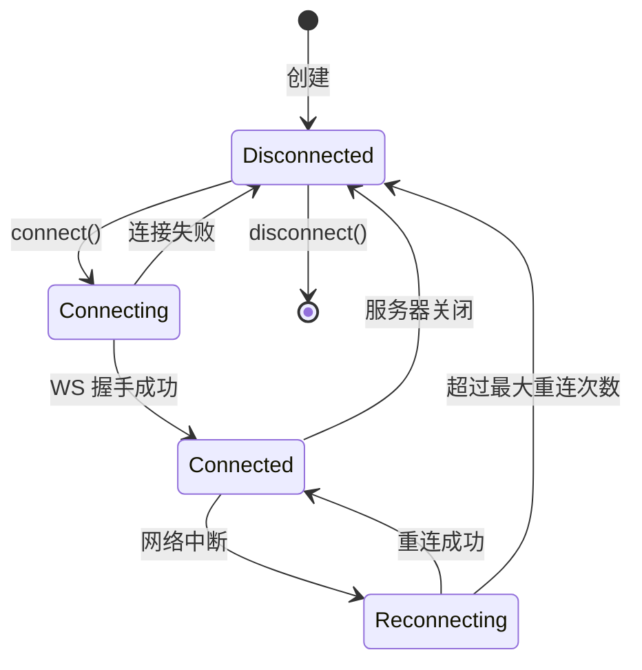
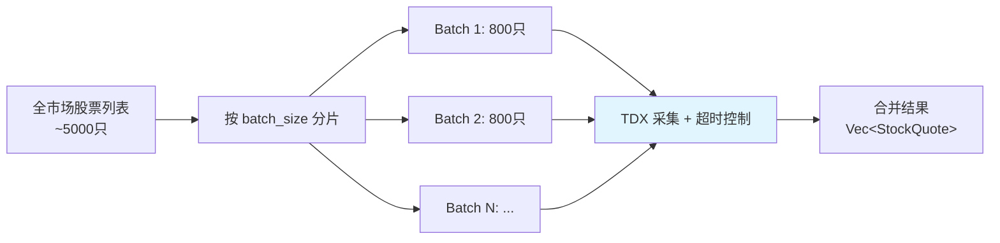
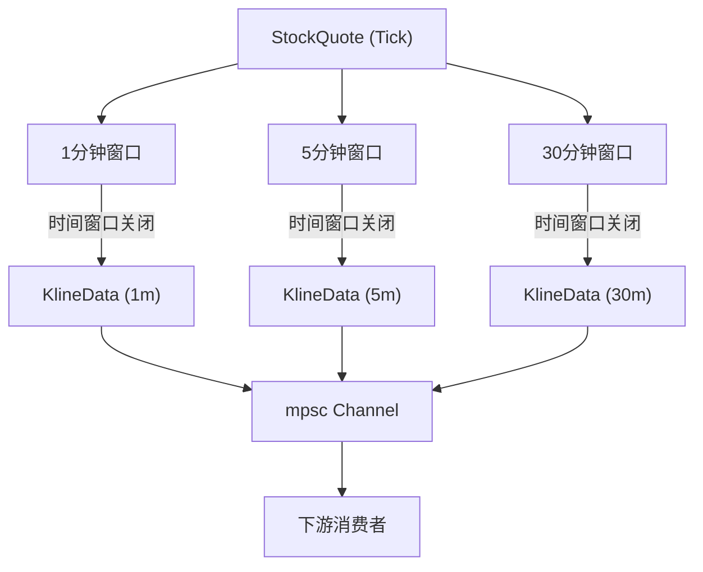

Quantix 的数据获取层采用**Trait 驱动的适配器模式**，在统一的 `Fetcher` 异步接口下封装了四种异构数据源——通达信 TCP 直连、AkShare HTTP API、东方财富 REST API、以及 WebSocket 实时推送。各数据源独立演进，上层策略与执行模块无需感知底层协议差异。本页将系统解析这一适配器层的设计哲学、各数据源的技术实现细节、以及辅助组件（行情采集器、竞价采集器、K线聚合器）的协作机制。

Sources: [mod.rs](src/sources/mod.rs#L1-L30), [fetcher.rs](src/data/fetcher.rs#L1-L26)

## 架构总览

数据源适配器层位于 Quantix 分层架构的**数据层（Data Layer）**核心位置。其设计遵循两个基本原则：**协议无关的统一抽象**——通过 `Fetcher` trait 屏蔽 TCP/HTTP/WS 协议差异；**数据源可替换性**——任意实现了 `Fetcher` 的类型均可注入到策略引擎和执行内核中，支持运行时切换。

整个适配器层由 `src/sources/` 模块承载，通过 `mod.rs` 统一导出所有公开类型。上层模块（策略、执行、监控）通过 `pub use` 引入所需的数据源和数据结构，无需直接了解内部模块组织。

Sources: [mod.rs](src/sources/mod.rs#L7-L12), [models.rs](src/data/models.rs#L1-L112)

## Fetcher Trait：统一数据源契约

`Fetcher` 是整个数据源层的核心抽象，定义在 `src/data/fetcher.rs` 中，使用 `async_trait` 实现异步接口约定。任何需要接入 Quantix 系统的数据源，都必须实现以下三个方法：

| 方法 | 签名 | 职责 |
|------|------|------|
| `get_stock_info` | `async fn(&self, code: &str) -> Result<Option<StockInfo>>` | 获取股票基本信息 |
| `get_kline` | `async fn(&self, code: &str, start: NaiveDate, end: NaiveDate) -> Result<Vec<Kline>>` | 获取指定日期范围的K线数据 |
| `check_connection` | `async fn(&self) -> Result<()>` | 检测数据源连接可用性 |

`Fetcher` trait 使用 `Send + Sync` 约束，确保实现类型可以安全地跨线程共享和传递。返回值统一使用 `crate::core::Result<T>`（即 `std::result::Result<T, QuantixError>`），错误处理参见 [统一错误处理与 QuantixError 体系](5-tong-cuo-wu-chu-li-yu-quantixerror-ti-xi)。需要特别注意的是，当前并非所有数据源都完整实现了 `Fetcher` 的全部方法——部分方法返回 `QuantixError::Unsupported`，表示该能力尚未接入真实 API。

Sources: [fetcher.rs](src/data/fetcher.rs#L9-L25), [error.rs](src/core/error.rs#L41-L42)

## 数据源详解

### TdxSource：通达信 TCP 直连

**TdxSource** 是系统中延迟最低的数据源，通过 `rustdx_complete` crate 直接建立 TCP 长连接到通达信行情服务器。其核心设计是一个**连接池轮询机制**：初始化时创建多个 `Tcp` 连接（建议 3-5 个），运行时通过 `AtomicUsize` 索引实现无锁轮询分配，避免单连接的瓶颈和竞争。

**连接池管理**的关键实现位于 `get_connection` 方法中，使用 `AtomicUsize::fetch_add` 配合 `Ordering::Relaxed` 实现轻量级的轮询负载均衡。当连接池中所有连接都创建失败时，构造函数会立即返回 `QuantixError::DataSource` 错误，确保至少有一个可用连接。

**行情采集流程**中，由于 `rustdx_complete` 的 TCP 操作是阻塞的，TdxSource 使用 `tokio::task::spawn_blocking` 将阻塞 I/O 搬到专用线程池中执行，并通过 `tokio::time::timeout` 包装超时控制。采集到的原始数据经过 `StockQuote::from_tdx` 工厂方法转换为统一模型，自动计算涨跌幅。

| 参数 | 默认值 | 说明 |
|------|--------|------|
| `pool_size` | 3 | TCP 连接池大小 |
| `port` | 7709 | 通达信标准端口 |
| `timeout` | 10s | 单次采集超时 |

Sources: [tdx.rs](src/sources/tdx.rs#L90-L248), [tdx.rs](src/sources/tdx.rs#L154-L162)

### AkShareSource：HTTP API 数据源

**AkShareSource** 设计为通过 HTTP API 桥接 Python 生态的 AkShare 数据。其内部维护一个 `reqwest::Client` 实例和可配置的 `base_url`。当前状态下，`get_stock_info` 和 `get_kline` 两个方法尚未接入真实 API，均返回 `QuantixError::Unsupported`；唯一可用的方法是 `check_connection`，通过向 `{base_url}/health` 发送 GET 请求来验证服务可用性。

这种设计为未来集成预留了完整的骨架——当 AkShare HTTP 服务就绪后，只需填充方法实现即可无缝接入系统。构造函数通过 `reqwest::Client::builder()` 创建客户端，HTTP 层面的错误自动通过 `From<reqwest::Error> for QuantixError` 转换为统一的错误类型。

Sources: [akshare.rs](src/sources/akshare.rs#L10-L52)

### EastMoneySource：东方财富 REST API

**EastMoneySource** 封装了东方财富的公开 API，提供四类数据采集能力。其基础 URL 指向 `https://push2.eastmoney.com`，内建 30 秒 HTTP 超时和 `RwLock<String>` 保护的 Cookie 存储。

| 方法 | API 端点 | 返回类型 | 数据内容 |
|------|----------|----------|----------|
| `get_stock_list` | `/api/qt/clist/getlist` | `Vec<StockInfo>` | 股票列表（按板块分类） |
| `get_realtime_quotes` | `/api/qt/ulist.np/get` | `HashMap<String, Quote>` | 多股票实时行情 |
| `get_money_flow` | `/api/qt/stock/fflow/get` | `MoneyFlowData` | 个股资金流向 |
| `get_financial_data` | — | `FinancialData` | 财务报表数据 |

`get_stock_list` 通过 `fs` 参数支持板块过滤（沪深300、中小板、创业板等），`get_money_flow` 自动根据股票代码首位数字推断市场标识（`6` 开头为上海 `1`，其余为深圳 `0`）。板块分类通过 `Board` 枚举定义，当前支持 HS300、ZZ500、SZ50、KCB50、BZ50 五大指数板块。

东方财富数据源定义了丰富的输出模型：`StockInfo` 承载股票基本信息，`Quote` 封装完整的实时行情（含 OHLCV 和昨收价），`MoneyFlowData` 记录主力/散户的净流入流出，`FinancialData` 包含营收、净利润、EPS、ROE 等核心财务指标。

Sources: [eastmoney.rs](src/sources/eastmoney.rs#L13-L188), [eastmoney.rs](src/sources/eastmoney.rs#L272-L298)

### WebSocketClient：实时推送客户端

**WebSocketClient** 是唯一基于持久连接的实时数据源，基于 `tokio-tungstenite` 构建，支持全双工的行情推送订阅。其生命周期通过 `ConnectionState` 枚举精确管理：

连接建立后，系统启动一个独立的 `tokio::spawn` 任务运行消息循环。循环内部使用 `tokio::select!` 宏同时监听三类事件：**WebSocket 消息接收**（处理 Text/Ping/Close 帧）、**心跳定时器触发**（定期发送 Ping 帧）、**运行状态检查**（响应 disconnect 调用）。

**订阅管理**通过 `Arc<RwLock<HashMap<String, Subscription>>>` 实现，支持动态添加和移除订阅标的。消息通过 `mpsc::UnboundedSender<RealtimeQuote>` 通道推送到消费端，调用方通过 `set_message_handler` 注册接收器。`RealtimeQuote` 模型包含完整的行情字段（含买卖一档价格），是实时策略和K线聚合器的主要数据输入。

| 配置项 | 默认值 | 说明 |
|--------|--------|------|
| `url` | `wss://push2.eastmoney.com/...` | WebSocket 服务地址 |
| `heartbeat_interval` | 30s | 心跳发送间隔 |
| `reconnect_interval` | 5s | 重连等待时间 |
| `max_reconnect` | 10 | 最大重连尝试次数 |
| `buffer_size` | 1000 | 消息缓冲区大小 |

Sources: [websocket.rs](src/sources/websocket.rs#L92-L380), [websocket.rs](src/sources/websocket.rs#L66-L90)

### BridgeTdxSource：Windows Bridge 代理

**BridgeTdxSource** 是一种特殊的间接数据源，通过 [Windows Bridge 架构](27-windows-bridge-jia-gou-wsl2-yu-tong-da-xin-qmt-shu-ju-qiao-jie) 中的 `BridgeHttpClient` 代理访问通达信数据。这使得运行在 WSL2/Linux 环境中的 Quantix 能够通过 HTTP 接口获取 Windows 端通达信客户端的行情和历史K线。

`BridgeTdxSource` 完整实现了 `Fetcher` trait 的 `get_kline` 方法——这是唯一通过 Bridge 获取历史K线的途径。其实现流程为：通过 `infer_symbol` 将裸代码（如 `000001`）转换为带市场后缀的符号格式（`000001.SZ` / `600000.SH`），调用 `BridgeHttpClient::fetch_tdx_kline` 发送 HTTP 请求，然后将响应中的 `bars` 逐一解析为 `Kline` 模型。价格字段使用 `rust_decimal::Decimal` 类型保证金融计算的精度。

符号转换规则简洁明了：6 开头的代码添加 `.SH` 后缀（上海），其余添加 `.SZ` 后缀（深圳）。反向解析由 `split_symbol` 函数完成，将 `600000.SH` 解析为 `("600000", 1)` 的市场+代码元组。

Sources: [bridge_tdx.rs](src/sources/bridge_tdx.rs#L11-L141)

## 辅助采集组件

### QuoteCollector：批量行情采集器

**QuoteCollector** 封装了面向全市场的批量行情采集逻辑，是 TDX 数据源在实际场景中的高级编排器。它将数千只股票按 `batch_size`（默认 800 只/批）分片，逐批调用 `TdxSource::fetch_quotes_batch`，每批之间插入 100ms 间隔以避免触发服务器的请求频率限制。

关键设计决策在于**容错式采集**：单批失败不会中断整个流程，而是记录警告日志后继续下一批。每批操作通过 `tokio::time::timeout` 包装，超时时间默认 10 秒，超时后返回 `QuantixError::Timeout`。

Sources: [quote_collector.rs](src/sources/quote_collector.rs#L18-L167)

### AuctionCollector：竞价数据采集器

**AuctionCollector** 专注于集合竞价时段（9:15-9:25）的数据采集。它直接使用独立的 `Tcp` 连接（非连接池），配合 `TradingCalendar` 进行交易日判断，只在有效交易日的竞价时间窗口内运行。

采集到的竞价数据封装在 `AuctionQuote` 中，除标准的 OHLCV 字段外，还包括**买一/卖一档位**的价格和量、**封单金额**（买一价 × 买一量），以及一个独创的**抢筹强度评分**（0-100 分）。评分算法采用加权公式：涨幅权重 40% + 买盘占比权重 30% + 成交量权重 30%，为竞价选股策略提供量化参考。

`run` 方法实现了无限循环的采集服务模式——每秒采集一次竞价数据，非竞价时段进入 10 秒轮询等待，适合作为守护进程长期运行。

Sources: [auction_collector.rs](src/sources/auction_collector.rs#L56-L304)

### KlineAggregator：实时K线聚合器

**KlineAggregator** 将 Tick 级别的实时行情（`StockQuote`）聚合为多周期K线（`KlineData`）。其核心是**滑动窗口机制**：每种周期维护独立的 `KlineWindow`，以 `"code:period:date"` 为键存储在 `HashMap` 中。

窗口的时间对齐策略因周期而异：1 分钟对齐到秒归零，5 分钟对齐到 `minute / 5 * 5`，日线对齐到 9:30 开盘时刻。每条行情到达时，`process_quote` 同时更新 1 分钟、5 分钟、30 分钟三个窗口，当窗口的 `should_close` 返回 `true` 时，窗口数据被提取为 `KlineData` 并通过 `mpsc::UnboundedSender` 发送到下游。

为防止内存泄漏，聚合器内置了定期清理机制（每 5 分钟运行一次），自动移除超过 2 小时未更新的过期窗口。

Sources: [kline_aggregator.rs](src/sources/kline_aggregator.rs#L200-L384)

## 共享数据模型

所有数据源共享一套核心数据模型，定义在 `src/data/models.rs` 中，确保跨源数据的一致性：

| 模型 | 用途 | 关键字段 |
|------|------|----------|
| `Kline` | 日线/分钟线数据 | code, date, OHLCV (Decimal), adjust_type |
| `StockInfo` | 股票基本信息 | code, name, market (SH/SZ/BJ) |
| `StockQuote` | TDX 实时行情 | code, OHLCV (f64), change_percent, market |
| `RealtimeQuote` | WS 推送行情 | code, OHLCV, bid1/ask1 (Option), timestamp |
| `Quote` | 东方财富行情 | code, OHLCV, change, change_pct |
| `MoneyFlowData` | 资金流向 | main_in/out, retail_in/out, main_net |
| `FinancialData` | 财务数据 | revenue, net_profit, eps, roe |
| `AuctionQuote` | 竞价数据 | OHLCV + 买卖一档 + sealed_amount + strength_score |
| `KlineData` | 聚合K线 | timestamp, period, source |
| `AdjustType` | 复权类型 | None / QFQ (前复权) / HFQ (后复权) |

其中 `Kline` 使用 `rust_decimal::Decimal` 类型存储价格，保证金融场景下的精确计算。`StockQuote` 和 `RealtimeQuote` 使用 `f64`，适合实时行情的高速传递。`Market` 枚举区分上海（SH）、深圳（SZ）、北京（BJ）三大交易所。

Sources: [models.rs](src/data/models.rs#L9-L66), [tdx.rs](src/sources/tdx.rs#L20-L46), [websocket.rs](src/sources/websocket.rs#L24-L52), [eastmoney.rs](src/sources/eastmoney.rs#L212-L242)

## TDX 本地文件解析

除了网络数据源，`src/sources/tdx_file.rs` 提供了一套完整的**本地通达信二进制文件解析**能力，用于导入历史日线和股本变迁数据：

- **TdxDayFile**：解析 `.day` 文件（每条记录 32 字节），提取 OHLCV 数据并转换为 `Kline` 模型。字节布局严格按照通达信格式解析——日期为 `u32`（如 `20210801`），价格为 `u32 / 100`，成交额为 `f32`。
- **TdxGbbqFile**：解析 `gbbq`（股本变迁）文件（每条记录 29 字节），提取除权除息事件，支持按代码分组和 A 股过滤。
- **FuquanCalculator**：基于涨跌幅连续计算的复权引擎。核心算法为 `factor *= close / preclose`，除权日通过 `compute_pre_pct` 调整前收盘价，支持前复权（`apply_qfq`）和后复权（`apply_hfq`）两种模式。
- **TdxDataImporter**：批量导入编排器，支持单只导入和批量导入，自动关联复权因子。

Sources: [tdx_file.rs](src/sources/tdx_file.rs#L70-L193), [tdx_file.rs](src/sources/tdx_file.rs#L357-L455)

## 数据源对比与选型指南

| 维度 | TdxSource | AkShareSource | EastMoneySource | WebSocketClient | BridgeTdxSource |
|------|-----------|---------------|-----------------|-----------------|-----------------|
| **协议** | TCP 直连 | HTTP REST | HTTP REST | WebSocket | HTTP REST (代理) |
| **数据延迟** | 极低 (~ms) | 中等 (~s) | 中等 (~s) | 实时推送 | 中等 (~s) |
| **适用场景** | 批量行情采集 | Python 数据桥接 | 基本面/资金流向 | 实时策略信号 | WSL2 环境历史数据 |
| **Fetcher 实现** | 部分（行情） | 占位 | 未实现 | 不适用 | 完整（K线） |
| **依赖项** | rustdx_complete | reqwest | reqwest | tokio-tungstenite | BridgeHttpClient |
| **运行环境** | 任意 Linux | 需要 AkShare 服务 | 任意 | 任意 | 需要 Windows Bridge |

**选型建议**：对于实时策略执行，优先使用 **TdxSource + QuoteCollector** 进行行情采集，辅以 **WebSocketClient** 监控关键标的。基本面分析场景使用 **EastMoneySource**。WSL2 开发环境下，**BridgeTdxSource** 是获取历史K线的唯一途径。未来 AkShare 集成完成后，**AkShareSource** 将成为补充数据维度的首选。

Sources: [fetcher.rs](src/data/fetcher.rs#L9-L25)

## 错误处理模式

所有数据源遵循统一的错误传播模式：底层协议错误（`reqwest::Error`、`std::io::Error`）通过 `From` trait 自动转换为 `QuantixError` 的对应变体。数据源特有的错误统一包装为 `QuantixError::DataSource(String)`，解析失败使用 `QuantixError::DataParse(String)`，超时使用 `QuantixError::Timeout(String)`，尚未实现的功能使用 `QuantixError::Unsupported(String)` 明确标记。

Sources: [error.rs](src/core/error.rs#L6-L51)

---

**延伸阅读**：数据源获取的原始数据如何持久化，参见 [数据库客户端层（ClickHouse / PostgreSQL / TDengine）](8-shu-ju-ku-ke-hu-duan-ceng-clickhouse-postgresql-tdengine)；K线聚合后的技术指标计算流程，参见 [技术指标计算引擎与 Polars 批量数据层](31-ji-zhu-zhi-biao-ji-suan-yin-qing-yu-polars-pi-liang-shu-ju-ceng)；Bridge 代理的完整架构细节，参见 [Windows Bridge 架构](27-windows-bridge-jia-gou-wsl2-yu-tong-da-xin-qmt-shu-ju-qiao-jie)。