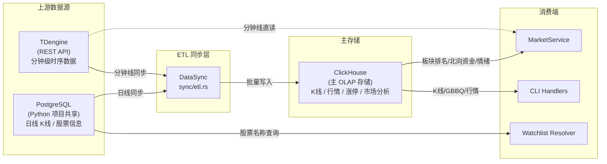
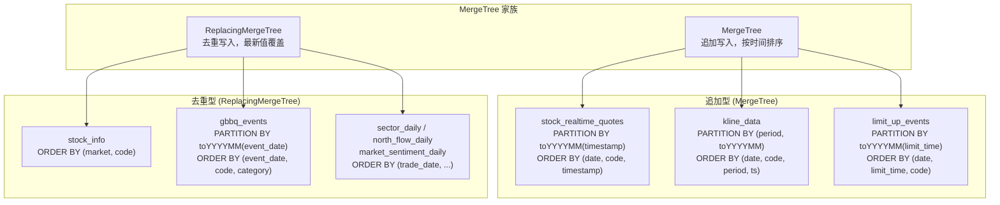
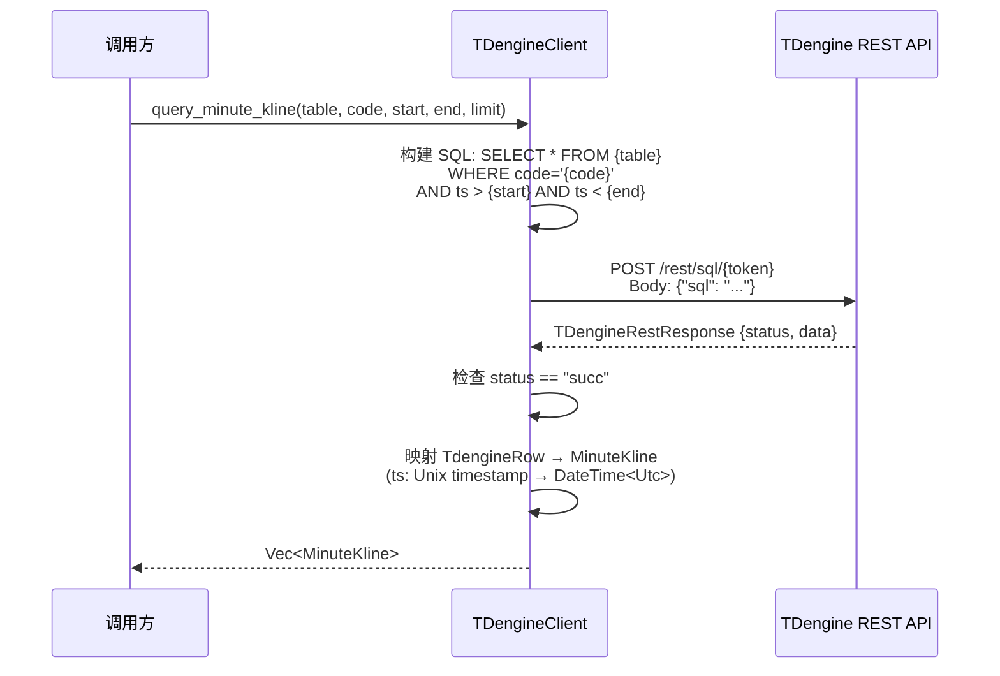

Quantix-Rust 的数据持久化架构采用**多库协同**策略：ClickHouse 承担主存储与 OLAP 分析职责，PostgreSQL 作为与原 Python 项目的共享数据库提供只读访问，TDengine 通过 REST API 提供高频分钟级时序数据读取。三者在 ETL 流水线中形成明确的数据流向——PostgreSQL/TDengine 的历史数据经同步管道汇入 ClickHouse，最终由量化策略和分析引擎统一消费。整个数据库客户端层位于 `src/db/` 目录，对外通过 `mod.rs` 统一导出核心类型。

Sources: [mod.rs](src/db/mod.rs#L1-L15)

## 架构总览与数据流向

下图展示三个数据库客户端在系统中的定位及其之间的数据流向关系。**ClickHouse 是写入密集型的中心枢纽**，所有分析查询都从 ClickHouse 读取；PostgreSQL 和 TDengine 作为上游数据源仅提供只读访问。



Sources: [etl.rs](src/sync/etl.rs#L1-L162), [service.rs](src/market/service.rs#L124-L172), [resolver.rs](src/watchlist/resolver.rs#L110-L126)

## 三库角色对比

三个数据库在设计上各司其职，下表从定位、读写模式、驱动协议、核心数据域等维度进行对比：

| 维度 | **ClickHouse** | **PostgreSQL** | **TDengine** |
|------|----------------|----------------|--------------|
| **定位** | 主 OLAP 存储，所有分析查询的终点 | 与 Python 项目共享的关系型数据库 | 高频时序数据库 |
| **读写模式** | 读写（批量写入 + 复杂查询） | 只读（查询日线和股票信息） | 只读（查询分钟 K线） |
| **Rust 驱动** | `clickhouse` crate (RowBinary) + `reqwest` (HTTP/JSON) | `sqlx` (异步连接池) | `reqwest` (REST API) |
| **连接方式** | HTTP (`http://host:8123`) | 连接池 (`postgresql://...`) | REST (`http://host:6041/rest/sql`) |
| **核心数据域** | K线、实时行情、涨停事件、GBBQ 除权除息、板块日线、北向资金、市场情绪 | 日线 K线、股票基本信息 | 分钟级 K线 |
| **表引擎特色** | MergeTree / ReplacingMergeTree + 按月分区 | 标准关系表 | 超级表 (STable) |
| **Feature Flag** | 始终启用 | `postgresql` (默认启用) | `tdengine-rest` (默认启用) / `tdengine-ws` |
| **配置来源** | 环境变量 `CLICKHOUSE_*` | 环境变量 `POSTGRES_URL` | `config/default.toml` |

Sources: [clickhouse.rs](src/db/clickhouse.rs#L1-L32), [postgresql.rs](src/db/postgresql.rs#L1-L40), [tdengine.rs](src/db/tdengine.rs#L1-L50), [config.rs](src/core/config.rs#L1-L97)

## ClickHouse 客户端：核心存储引擎

`ClickHouseClient` 是系统中功能最完整、代码量最大的数据库客户端（约 1245 行），承担着**建表初始化、批量写入、聚合查询、市场数据读取**四类核心职责。

### 客户端结构体

```rust
pub struct ClickHouseClient {
    client: Client,          // clickhouse crate 原生客户端 (RowBinary)
    database: String,        // 数据库名
    batch_size: usize,       // 批量插入批次大小 (默认 1000)
    http_url: String,        // HTTP URL (用于 JSON 查询)
    http_user: String,       // HTTP 认证用户名
    http_password: String,   // HTTP 认证密码
}
```

客户端内部维护**双通道查询能力**：`client` 字段使用 `clickhouse` crate 的 RowBinary 协议进行高效批量写入；`http_url` 字段配合 `reqwest` 发起 HTTP POST 请求，以 `JSONEachRow` 格式处理复杂查询（如板块排名、北向资金等需要 JOIN 或子查询的场景），绕过 RowBinary 编码在复合结构体上的限制。

Sources: [clickhouse.rs](src/db/clickhouse.rs#L18-L29), [clickhouse.rs](src/db/clickhouse.rs#L95-L144)

### 创建与初始化

客户端支持三种创建方式，形成从灵活到便捷的渐进式 API：

| 方法 | 说明 | 典型场景 |
|------|------|----------|
| `new(url, db, user, password)` | 基础构造器，手动指定所有参数 | 自定义部署环境 |
| `from_settings(&ClickHouseSettings)` | 从共享设置结构体创建 | CLI handler 统一初始化 |
| `with_default_config()` | 从环境变量自动加载默认配置 | 快速原型开发 |

`ClickHouseSettings` 通过 `CliRuntime::load()` 在启动时从四个环境变量（`CLICKHOUSE_URL`、`CLICKHOUSE_DB`、`CLICKHOUSE_USER`、`CLICKHOUSE_PASSWORD`）加载，提供进程级别的单例配置。`init_database()` 方法执行完整的建表流程，按顺序创建 7 张核心表。

Sources: [clickhouse.rs](src/db/clickhouse.rs#L34-L170), [runtime.rs](src/core/runtime.rs#L21-L43)

### 核心表结构与引擎策略

ClickHouse 的 7 张核心表根据数据特征采用差异化的引擎和分区策略：



**引擎选择的核心逻辑**：实时行情、K线、涨停事件这类只追加不回写的数据使用 `MergeTree`；股票信息、除权除息事件、市场日线这类需要最新值覆盖的历史快照数据使用 `ReplacingMergeTree`，利用版本列（如 `updated_at`）实现幂等去重。所有分区统一采用 `toYYYYMM()` 按月分区，既控制分区粒度避免过多小文件，又保证时间范围查询的分区裁剪效率。

Sources: [clickhouse.rs](src/db/clickhouse.rs#L173-L345), [clickhouse.rs](src/db/clickhouse.rs#L998-L1056)

### 批量写入与异步插入优化

ClickHouse 客户端的写入 API 遵循**单条插入 → 批量插入**的渐进式设计模式。以 K线数据为例：

- **`insert_kline_data()`**：单条 SQL INSERT，用于零星数据补录
- **`insert_kline_data_batch()`**：基于 `clickhouse` crate 的 `insert()` API，自动按 `batch_size`（默认 1000）分块，每块启用 `async_insert=1` + `wait_for_async_insert=1` 选项

```
klines (N 条)
  ├── chunk[0..1000]  → insert("kline_data").with_option("async_insert", "1")
  │                       → write(row_0) → write(row_1) → ... → end()
  ├── chunk[1000..2000] → insert("kline_data") ...
  └── ...
```

`async_insert` 选项让 ClickHouse 在服务端攒批后异步刷盘，而 `wait_for_async_insert` 确保客户端收到确认后再继续，在吞吐量和可靠性之间取得平衡。GBBQ 事件、实时行情的批量插入采用完全相同的分块策略。

Sources: [clickhouse.rs](src/db/clickhouse.rs#L617-L708), [clickhouse.rs](src/db/clickhouse.rs#L422-L469)

### HTTP JSON 查询通道

`query_json<T>()` 方法是 ClickHouse 客户端为复杂查询场景设计的旁路通道。它通过 HTTP POST 发送 SQL（附加 `FORMAT JSONEachRow`），逐行反序列化为泛型 `T`，绕过 RowBinary 协议对嵌套结构和 Nullable 字段的编码限制。这一通道被 `MarketDataReader` trait 实现广泛使用，支撑板块排名、北向资金、市场情绪等涉及动态 WHERE 子句和多列投影的查询。

Sources: [clickhouse.rs](src/db/clickhouse.rs#L95-L144), [service.rs](src/market/service.rs#L124-L200)

### 数据模型映射（CH Row ↔ 领域模型）

ClickHouse 的 Row 结构体（如 `KlineDataCH`、`SectorDailyCH`）与领域模型（如 `Kline`、`BoardRankRow`）之间存在双向转换。Row 结构体标注 `#[derive(clickhouse::Row)]`，字段类型使用 ClickHouse 原生类型（`f64`、`u8`、`DateTime<Utc>`）；领域模型则使用 `Decimal`、枚举等 Rust 惯用类型。转换通过 `impl` 块上的 `try_into_*` / `into_*` 方法实现，例如 `SectorDailyCH::try_into_board_rank()` 和 `NorthFlowDailyCH::into_snapshot()`。

Sources: [clickhouse.rs](src/db/clickhouse.rs#L810-L996)

## PostgreSQL 客户端：共享数据库只读层

`PostgresClient` 是三个客户端中最轻量的（约 131 行），定位为**与原 Python quantix 项目的桥接层**，仅提供只读查询能力。

### 客户端结构

```rust
pub struct PostgresClient {
    pool: Pool<Postgres>,  // sqlx 异步连接池，max_connections = 10
}
```

使用 `sqlx` 的 `PgPoolOptions` 创建异步连接池，最大连接数硬编码为 10。连接通过 `postgresql://` URL 字符串建立，URL 从 `POSTGRES_URL` 环境变量获取。

### 查询接口

PostgresClient 暴露三个只读方法，所有 SQL 参数均通过 sqlx 的 `$N` 占位符绑定，防止 SQL 注入：

| 方法 | 目标表 | 参数 | 返回 |
|------|--------|------|------|
| `query_kline_daily(code, start, end, limit)` | `kline_daily` | 股票代码、日期范围、限制条数 | `Vec<KlineDaily>` |
| `query_stock_info(code)` | `stock_info` | 股票代码 | `Option<StockInfo>` |
| `list_stocks(market)` | `stock_info` | 市场过滤（SH/SZ） | `Vec<StockInfo>` |

`KlineDaily` 模型中的 `adjust_type` 字段（`1=前复权, 2=后复权, 0=不复权`）直接映射 Python 端的复权类型约定，确保跨语言数据语义一致。

### 典型使用场景

PostgresClient 在项目中的主要消费点是 `PostgresWatchlistNameLookup`——自选池解析器通过它查询股票中文名称，当用户输入代码时自动补全名称信息。该实现每次查询都创建新的 `PostgresClient` 实例（`PostgresClient::new(&database_url).await?`），这是一种按需创建的无状态模式，适合低频查询场景。

Sources: [postgresql.rs](src/db/postgresql.rs#L1-L131), [resolver.rs](src/watchlist/resolver.rs#L110-L126)

## TDengine 客户端：高频时序数据读取

`TDengineClient` 通过 REST API 连接原 Python 项目的 TDengine 实例，专门用于读取**分钟级高频 K线数据**。

### 客户端结构

```rust
pub struct TDengineClient {
    base_url: String,   // REST API 基础 URL
    token: String,      // 认证 token
    client: Client,     // reqwest HTTP 客户端
}
```

与 ClickHouse 和 PostgreSQL 不同，TDengine 客户端**没有使用原生 SDK**，而是通过 REST API（`/rest/sql/{token}` 端点）发送 SQL 查询。这种设计选择避免了 TDengine C/C++ 客户端库的编译依赖问题，但牺牲了原生协议的性能优势。

### 查询流程



`query_minute_kline()` 是该客户端唯一的业务方法。时间戳通过 `DateTime::from_timestamp()` 从 Unix 秒级时间戳转换为 `DateTime<Utc>`，并兼容毫秒级时间戳的 fallback 处理。OHLCV 字段均为 `Option` 类型，`None` 值默认填充为 0。

Sources: [tdengine.rs](src/db/tdengine.rs#L1-L133)

## Feature Flag 编译控制

数据库客户端的编译通过 Cargo feature flags 精确控制，默认启用 PostgreSQL 和 TDengine REST：

```toml
[features]
default = ["postgresql", "tdengine-rest"]
postgresql = ["sqlx/postgres"]
sqlite = ["sqlx/sqlite"]
tdengine-ws = ["taos-ws"]     # WebSocket 模式（需 taos-ws 依赖）
tdengine-rest = []             # REST 模式（无额外依赖，使用 reqwest）
```

这种设计允许在轻量部署环境中仅编译所需的数据库驱动。ClickHouse 不设 feature gate，始终参与编译，因为它是核心存储引擎。TDengine 提供两种连接模式：`tdengine-rest` 使用 HTTP REST（零额外依赖），`tdengine-ws` 使用 WebSocket（需要 `taos-ws` crate）。

Sources: [Cargo.toml](Cargo.toml) (features section)

## 配置管理与环境变量

三个数据库客户端的配置参数通过不同机制注入，形成**环境变量优先、配置文件兜底**的分层策略：

### ClickHouse 配置

通过四个环境变量配置，`ClickHouseSettings::from_env()` 在运行时读取：

| 环境变量 | 默认值 | 说明 |
|----------|--------|------|
| `CLICKHOUSE_URL` | `http://localhost:8123` | HTTP 接口地址 |
| `CLICKHOUSE_DB` | `quantix` | 数据库名称 |
| `CLICKHOUSE_USER` | `default` | 用户名 |
| `CLICKHOUSE_PASSWORD` | (空) | 密码 |

### PostgreSQL / TDengine 配置

PostgreSQL 和 TDengine 的连接信息在 `config/default.toml` 中声明默认值，同时支持环境变量覆盖。Docker Compose 部署时通过 `docker-compose.yml` 的 `environment` 段注入容器级别的覆盖值。

Sources: [runtime.rs](src/core/runtime.rs#L29-L43), [default.toml](config/default.toml#L1-L27), [docker-compose.yml](docker-compose.yml#L13-L21)

## 统一错误处理

三个客户端的所有错误都统一映射到 `QuantixError` 枚举的两个数据库相关变体：

| 错误变体 | 触发场景 | 典型来源 |
|----------|----------|----------|
| `DatabaseConnection(String)` | 连接建立失败、认证错误 | ClickHouse 建表失败、PostgreSQL 连接池超时、TDengine REST 不可达 |
| `DatabaseQuery(String)` | SQL 执行错误、数据解析失败 | ClickHouse 批量写入失败、sqlx 查询错误、TDengine 返回非 `succ` 状态 |

`QuantixError` 同时通过 `#[from]` 属性自动转换 `sqlx::Error`、`reqwest::Error`、`serde_json::Error` 等底层错误，确保调用方无需关心驱动层面的错误类型差异。

Sources: [error.rs](src/core/error.rs#L1-L51)

## ETL 同步管道

`DataSync`（定义在 `src/sync/etl.rs`）是连接三个数据库的**中枢同步器**，实现两条核心数据管道：

1. **日线同步**（`sync_daily_klines`）：PostgreSQL → ClickHouse，按日期范围拉取日线数据后批量写入 `kline_data` 表
2. **分钟线同步**（`sync_minute_klines`）：TDengine → ClickHouse，按时间范围拉取分钟数据后批量写入 `kline_data` 表

两条管道共享同一个 `write_klines_to_clickhouse()` 内部方法，按 `batch_size` 分块调用 ClickHouse 的 insert API。同步过程记录 `SyncStats`（开始/结束时间、成功/失败条数、耗时），便于监控和重试。

Sources: [etl.rs](src/sync/etl.rs#L66-L162)

## 关键设计决策总结

| 决策点 | 选择 | 理由 |
|--------|------|------|
| 主存储引擎 | ClickHouse | OLAP 场景下聚合查询性能远优于 PostgreSQL，按月分区天然适配时间序列 |
| PostgreSQL 角色 | 只读 | 与 Python 项目共享数据库，避免跨语言写入冲突 |
| TDengine 连接方式 | REST API | 避免 C/C++ FFI 编译复杂性，分钟级查询延迟可接受 |
| ClickHouse 双通道 | RowBinary + HTTP JSON | RowBinary 高效写入，HTTP JSON 灵活处理复杂查询 |
| 批量写入策略 | async_insert + 分块 | 服务端攒批提升吞吐，客户端分块控制内存峰值 |
| 错误统一 | QuantixError 枚举 | 调用方无需关心底层驱动差异，错误信息保留原始上下文 |

---

**延伸阅读**：数据从上游数据库同步到 ClickHouse 后，经过 K线聚合和通达信文件解析进入分析管线，详见 [K线聚合、数据同步与通达信文件解析](9-kxian-ju-he-shu-ju-tong-bu-yu-tong-da-xin-wen-jian-jie-xi)。ClickHouse 中存储的市场数据最终被策略引擎消费，完整链路参见 [Strategy Trait 策略接口与内置策略实现](10-strategy-trait-ce-lue-jie-kou-yu-nei-zhi-ce-lue-shi-xian) 和 [市场分析服务：板块排名、北向资金、龙头股与情绪指数](19-shi-chang-fen-xi-fu-wu-ban-kuai-pai-ming-bei-xiang-zi-jin-long-tou-gu-yu-qing-xu-zhi-shu)。