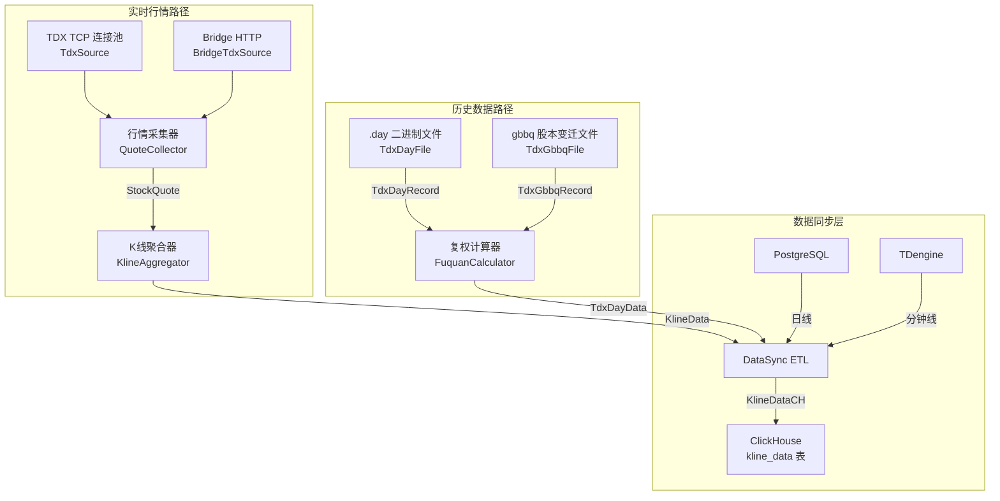
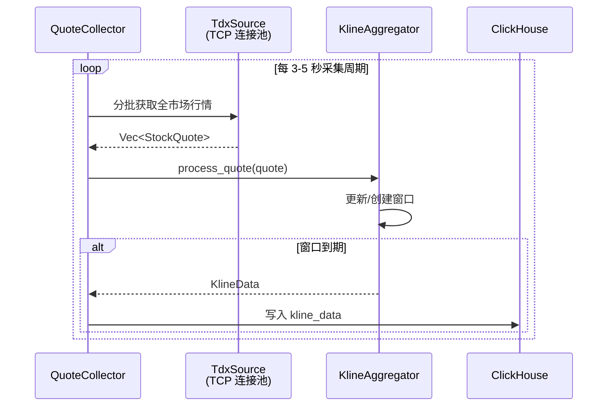

本页深入解析 Quantix 数据管道中三个关键环节：**实时K线聚合**将逐笔行情压缩为多周期 OHLCV 柱状数据；**ETL 数据同步**实现跨存储引擎（PostgreSQL/TDengine → ClickHouse）的数据迁移；**通达信文件解析**直接读取 TDX 本地二进制 day/gbbq 文件并完成复权计算。三者共同构成了从原始数据到分析就绪数据的完整转换链路。

## 整体数据流架构

在深入各模块细节之前，先理解这三个组件在整个数据管道中的协作关系。实时行情通过 TDX TCP 或 Bridge HTTP 进入系统，经由 **K线聚合器**生成多周期K线；历史日线则从通达信本地文件（`.day` / `gbbq`）中直接解析并完成复权；两类数据最终汇聚到 **数据同步 ETL**，统一写入 ClickHouse 的 `kline_data` 表供下游策略和分析引擎消费。



Sources: [mod.rs](src/sources/mod.rs#L1-L30), [sync/mod.rs](src/sync/mod.rs#L1-L7), [data/models.rs](src/data/models.rs#L1-L30)

## K线聚合器：从逐笔行情到多周期 OHLCV

### 核心设计理念

K线聚合器解决的核心问题是：**如何从高频实时行情（Tick 级别）中高效生成多个时间维度的K线数据**。它采用**时间窗口滑动**模式，为每只股票在每个目标周期上维护一个 `KlineWindow`，窗口内的 OHLCV 数据随每笔行情实时更新，当窗口到期时自动关闭并输出一根完整的K线。

### 周期枚举与时间对齐

`KlinePeriod` 枚举定义了六种标准周期，每种周期都有精确的分钟数定义和时间对齐策略：

| 周期 | 标识符 | 分钟数 | 时间对齐规则 |
|------|--------|--------|-------------|
| `OneMinute` | `"1m"` | 1 | 截断到整分钟（秒=0, 纳秒=0） |
| `FiveMinutes` | `"5m"` | 5 | 对齐到 5 的倍数分钟（0, 5, 10, …） |
| `FifteenMinutes` | `"15m"` | 15 | 对齐到 15 的倍数分钟（0, 15, 30, 45） |
| `ThirtyMinutes` | `"30m"` | 30 | 对齐到 0 或 30 分 |
| `OneHour` | `"60m"` | 60 | 对齐到整小时（分钟=0） |
| `Daily` | `"1d"` | 240 | 对齐到 09:30（A股开盘时间） |

日线周期取 240 分钟（4 小时交易时间）而非 1440 分钟，这是 A 股特有的设计决策。`calculate_window_start` 方法根据周期类型执行不同的时间截断逻辑，确保窗口边界精确对齐。例如 5 分钟窗口在 `10:33:45` 的行情数据会被对齐到 `10:30:00`。

Sources: [kline_aggregator.rs](src/sources/kline_aggregator.rs#L10-L64), [kline_aggregator.rs](src/sources/kline_aggregator.rs#L236-L285)

### 窗口数据结构与 OHLCV 更新

`KlineWindow` 是聚合器的基本运算单元，每只股票的每个周期在内存中持有一个活跃窗口：

```rust
pub struct KlineWindow {
    pub code: String,
    pub name: String,
    pub period: KlinePeriod,
    pub open: Option<f64>,      // 首笔成交价，Once 语义
    pub high: f64,              // 初始化为 f64::MIN
    pub low: f64,               // 初始化为 f64::MAX
    pub close: f64,             // 最新成交价
    pub volume: f64,            // 累加成交量
    pub amount: f64,            // 累加成交额
    pub trade_count: u32,       // 累加成交笔数
    pub start_time: DateTime<Utc>,
    pub last_update: DateTime<Utc>,
}
```

**开盘价的 `Option<f64>` 设计**是一个关键细节——只有窗口内第一笔行情才写入 `open`，后续行情只更新 `close`（始终取最新价）、`high`/`low`（取极值）以及累加 `volume`/`amount`/`trade_count`。窗口通过 `should_close` 方法判断是否到期，判断依据是 `current_time - start_time >= period.minutes() * 60`。

Sources: [kline_aggregator.rs](src/sources/kline_aggregator.rs#L96-L198)

### 聚合器运行时模型

`KlineAggregator` 是整个聚合引擎的顶层结构，其内部维护一个 `HashMap<String, KlineWindow>`，key 的格式为 `"code:period:date"`（如 `"000001:5m:2026-01-02"`）。聚合器在创建时返回自身与一个 `mpsc::UnboundedReceiver<KlineData>` 通道，下游消费者可以从该通道接收已完成的K线数据。

运行时有两个并发任务在运作：

1. **主处理路径**：`process_quote` 接收一条 `StockQuote`，分别更新 1 分钟、5 分钟、30 分钟三个周期的窗口（注意当前实现只处理这三个周期，15 分钟和 60 分钟未启用）。每次 `update_window` 调用中，如果窗口到期则从 HashMap 中移除并返回完成的 `KlineData`。

2. **过期清理任务**：每 5 分钟执行一次清理，移除超过 **2 小时**（7200 秒）未更新的窗口。这是一个安全网机制，防止因行情中断（如停牌）导致窗口无限期驻留内存。清理任务在 `KlineAggregator::new` 时通过 `tokio::spawn` 自动启动。

Sources: [kline_aggregator.rs](src/sources/kline_aggregator.rs#L200-L384)

### 聚合器的上游：行情采集器

`QuoteCollector` 是K线聚合器的数据供给者。它封装了 `TdxSource`（TCP 直连）或 `BridgeTdxSource`（HTTP 桥接），将全市场股票按 **800 只一批**（默认 `batch_size`）分片采集，每批设置 **10 秒超时**保护，批次之间插入 100ms 间隔防止 IP 封禁。采集失败的批次会被跳过，不会中断整体流程。



Sources: [quote_collector.rs](src/sources/quote_collector.rs#L1-L167), [tdx.rs](src/sources/tdx.rs#L90-L162)

## 数据同步 ETL：跨存储引擎的数据迁移

### 同步架构与配置

`DataSync` 是一个专门用于 **Python quantix ↔ quantix-rust 数据同步**的 ETL 引擎，数据流方向为 PostgreSQL/TDengine → ClickHouse。它的核心价值在于将 Python 量化系统积累的历史数据无缝迁移到 Rust 系统的高性能分析引擎中。

`SyncConfig` 提供完整的连接参数配置，支持通过环境变量注入：

| 配置项 | 环境变量 | 默认值 | 说明 |
|--------|---------|--------|------|
| `postgres_url` | `POSTGRES_URL` | `postgresql://localhost:5432/quantix` | PostgreSQL 连接串 |
| `clickhouse_url` | `CLICKHOUSE_URL` | `http://localhost:8123` | ClickHouse HTTP 地址 |
| `clickhouse_db` | `CLICKHOUSE_DB` | `quantix` | ClickHouse 数据库名 |
| `clickhouse_user` | `CLICKHOUSE_USER` | `default` | ClickHouse 用户名 |
| `clickhouse_password` | `CLICKHOUSE_PASSWORD` | *(空)* | ClickHouse 密码 |
| `batch_size` | — | `1000` | 每批写入记录数 |
| `sync_interval` | — | `300` | 定时同步间隔（秒） |

Sources: [etl.rs](src/sync/etl.rs#L14-L48)

### 两条同步管道

DataSync 提供两条独立的同步管道，对应不同的数据粒度和源数据库：

**日线同步**（`sync_daily_klines`）：从 PostgreSQL 读取日线数据，指定日期范围，批量写入 ClickHouse。每次同步会记录 `SyncStats` 统计信息，包括起止时间、成功/失败记录数和耗时。

**分钟线同步**（`sync_minute_klines`）：从 TDengine 读取分钟级数据，按时间范围查询，同样批量写入 ClickHouse。

写入 ClickHouse 时，数据通过 `KlineDataCH` 结构映射到 `kline_data` 表。该表使用 **MergeTree 引擎**，按 `(period, toYYYYMM(timestamp))` 分区，按 `(date, code, period, timestamp)` 排序，`index_granularity = 8192`，针对量化分析的多股票、多周期查询模式做了专门优化。

Sources: [etl.rs](src/sync/etl.rs#L96-L216), [clickhouse.rs](src/db/clickhouse.rs#L239-L272)

### 批量写入与错误处理

`write_klines_to_clickhouse` 方法实现了**分块批量写入**：将 `KlineData` 切片按 `batch_size` 分块，每块创建一个 ClickHouse `INSERT` 事务，逐条写入 `KlineDataCH` 行。如果任何一条写入失败，整个批次会以 `DatabaseConnection` 错误向上传播，确保数据一致性。

> ⚠️ **当前状态**：`fetch_daily_source_data` 和 `fetch_minute_source_data` 尚未接入真实数据源，调用时会返回 `QuantixError::Unsupported`。这是 ETL 模块的桩实现阶段，框架已搭建完成，等待具体数据源适配器的对接。`run_sync_schedule` 已实现了完整的定时同步循环，每 `sync_interval` 秒同步最近 30 天的日线数据。

Sources: [etl.rs](src/sync/etl.rs#L218-L262)

### 同步统计数据模型

每次同步操作都会产出 `SyncStats`，包含 `start_time`、`end_time`、`records_synced`、`records_failed` 和 `elapsed_seconds` 五个维度，可用于监控同步效率和诊断问题。

Sources: [etl.rs](src/sync/etl.rs#L50-L63)

## 通达信文件解析：二进制格式到结构化数据

### 模块概述与来源

通达信文件解析模块（`tdx_file`）从 **rustdx** 项目迁移而来，负责直接读取通达信客户端在本地的二进制数据文件。相比通过网络接口获取数据，本地文件解析具有零延迟、无频率限制、数据完整三大优势，是历史数据回测和批量分析的首选路径。

该模块包含三个层次的功能：二进制文件解析（day/gbbq）、复权因子计算、批量数据导入。

Sources: [tdx_file.rs](src/sources/tdx_file.rs#L1-L14)

### Day 文件解析

通达信的 `.day` 文件采用固定 32 字节记录格式，每条记录代表一个交易日的 OHLCV 数据：

| 字节偏移 | 字段 | 类型 | 处理方式 |
|----------|------|------|---------|
| 0-3 | 日期 | `u32` | 直接读取，格式如 `20210801` |
| 4-7 | 开盘价 | `u32` | **÷ 100** 得到真实价格 |
| 8-11 | 最高价 | `u32` | **÷ 100** 得到真实价格 |
| 12-15 | 最低价 | `u32` | **÷ 100** 得到真实价格 |
| 16-19 | 收盘价 | `u32` | **÷ 100** 得到真实价格 |
| 20-23 | 成交额 | `f32` | 直接读取（浮点数） |
| 24-27 | 成交量 | `u32` | 直接读取（单位：股） |
| 28-31 | 保留 | — | 忽略 |

**关键细节**：OHLC 四个价格字段存储的是整数，需要除以 100 才是真实价格（如 `1050` → `10.50` 元），而成交额直接存储为 IEEE 754 浮点数。`TdxDayFile::from_file` 一次性读取整个文件，通过 `chunks_exact(32)` 逐块解析为 `TdxDayRecord`。

`TdxDayRecord` 的 `#[derive(Copy)]` 和 `size_of::<TdxDayRecord>() == 32` 保证了与原始二进制格式的精确对齐，测试中明确断言了这一点。

Sources: [tdx_file.rs](src/sources/tdx_file.rs#L70-L193)

### GBBQ 文件解析（股本变迁）

GBBQ（股本变迁）文件记录了股票的除权除息事件，是复权计算的基础数据。每条记录固定 **29 字节**：

| 字节偏移 | 字段 | 类型 | 说明 |
|----------|------|------|------|
| 0 | 市场 | `u8` | 1=上海, 0=深圳 |
| 1-6 | 股票代码 | `[u8; 6]` | UTF-8 字符串 |
| 8-11 | 日期 | `u32` | 如 `20210801` |
| 12 | 信息类型 | `u8` | 1=除权除息, 2=送配股上市, … |
| 13-16 | 分红/前流通盘 | `f32` | 每10股派现金x元 |
| 17-20 | 配股价/前总股本 | `f32` | 每股配股价x元 |
| 21-24 | 送转股/后流通盘 | `f32` | 每10股送转x股 |
| 25-28 | 配股/后总股本 | `f32` | 每10股配x股 |

文件头部 4 字节是记录总数（`u32` little-endian），随后是等长的记录序列。`TdxGbbqFile::filter_a_stock_dividend` 可过滤出 A 股除权除息记录（代码首字符为 `6`/`0`/`3` 且 `category == 1`），`group_by_code` 按股票代码分组方便后续批量处理。

**除权计算公式**（`compute_pre_pct` 方法）：
```
新前收盘 = (原前收盘 × 10 - 分红 + 配股数 × 配股价) / (10 + 配股数 + 送转股数)
```
该公式统一处理了分红扣减、配股增资、送转股稀释三个因素。

Sources: [tdx_file.rs](src/sources/tdx_file.rs#L200-L323)

### 复权因子计算

`FuquanCalculator` 实现了基于**涨跌幅连续乘积**的复权因子算法，这是业界公认的精度最优方案：

```
factor[i] = factor[i-1] × (close[i] / preclose[i])
```

在除权日，`preclose` 会被 GBBQ 记录修正为除权后的前收盘价，确保涨跌幅计算的连续性。计算过程逐日遍历 day 记录，同时与 GBBQ 记录按日期对齐（使用 `Peekable` 迭代器），遇到非交易日的除权记录会自动跳过。

`FuquanFactor` 结构记录了每个交易日的复权状态：

| 字段 | 类型 | 说明 |
|------|------|------|
| `date` | `NaiveDate` | 交易日期 |
| `factor` | `f64` | 累计复权因子 |
| `preclose` | `f64` | 前收盘价（除权日已调整） |
| `close` | `f64` | 收盘价 |
| `trading` | `bool` | 是否为交易日 |
| `xdxr` | `bool` | 是否为除权日 |

基于复权因子，模块提供了两种复权方式：

- **前复权（QFQ）**：`adj_factor = latest_factor / current_factor`，以最新价为基准向后调整历史价格
- **后复权（HFQ）**：`adj_factor = current_factor`，以历史首日为基准向前调整所有价格

两者都使用 `rust_decimal::Decimal` 进行精确到小数点后 2 位的定点运算，避免浮点精度误差。

Sources: [tdx_file.rs](src/sources/tdx_file.rs#L329-L456)

### 批量导入器

`TdxDataImporter` 将 day 文件解析和复权计算封装为一个完整的导入流水线。给定数据目录和股票代码列表，它依次执行：

1. 读取 `.day` 文件获取原始日线
2. 从 GBBQ 映射中查找对应的除权记录
3. 调用 `FuquanCalculator::calculate` 计算复权因子
4. 将 day 记录与复权因子 zip 合并为 `TdxDayData`

`TdxDayData` 是最终的集成数据结构，包含 OHLCV、前收盘价、复权因子和涨跌幅，可以直接转换为通用的 `Kline` 模型供系统其他模块使用。`import_batch` 方法支持多只股票的批量导入，单只股票导入失败会记录警告日志但不会中断整个批次。

Sources: [tdx_file.rs](src/sources/tdx_file.rs#L551-L611), [tdx_file.rs](src/sources/tdx_file.rs#L462-L545)

## Bridge TDX：远程通达信数据桥接

`BridgeTdxSource` 是另一种通达信数据获取方式，通过 HTTP Bridge（Windows 侧运行的代理服务）间接访问通达信数据，适用于 WSL2 环境下无法直接连接 TDX 服务器的场景。它实现了 `Fetcher` trait，提供 `get_kline`（日线查询）和 `fetch_quotes_batch`（批量实时行情）两个核心方法。

符号编码使用 `code.market` 格式（如 `600000.SH`、`000001.SZ`），市场推断规则为代码以 `6` 开头为上海（`.SH`），其他为深圳（`.SZ`）。K线数据从 Bridge 响应中解析日期字符串（`%Y-%m-%d`），价格字段通过 `Decimal::from_f64_retain` 转换为精确十进制数。

Sources: [bridge_tdx.rs](src/sources/bridge_tdx.rs#L1-L142)

## 核心数据结构对照

整个数据管道涉及多层数据模型转换，以下是关键结构的映射关系：

| 模块 | 结构 | 时间精度 | 价格精度 | 用途 |
|------|------|---------|---------|------|
| TDX TCP | `StockQuote` | `u64` Unix 秒 | `f64` | 实时行情快照 |
| K线聚合 | `KlineData` | `DateTime<Utc>` | `f64` | 多周期聚合K线 |
| TDX 文件 | `TdxDayRecord` | `u32` 日期 | `f32` | 原始日线记录 |
| TDX 文件 | `TdxDayData` | `NaiveDate` | `Decimal` | 含复权的日线 |
| 通用模型 | `Kline` | `NaiveDate` | `Decimal` | 系统标准K线 |
| ClickHouse | `KlineDataCH` | `DateTime<Utc>` | `f64` | 列存K线 |

从实时路径看：`StockQuote` → `KlineData` → `KlineDataCH`（f64 价格，适合实时聚合性能）。从历史路径看：`TdxDayRecord` → `FuquanFactor` + `TdxDayData` → `Kline`（Decimal 精度，适合历史回测准确性）。

Sources: [kline_aggregator.rs](src/sources/kline_aggregator.rs#L67-L93), [tdx.rs](src/sources/tdx.rs#L20-L46), [tdx_file.rs](src/sources/tdx_file.rs#L462-L487), [data/models.rs](src/data/models.rs#L9-L30), [clickhouse.rs](src/db/clickhouse.rs#L838-L853)

## 相关阅读

- [多数据源适配器（TDX / AkShare / 东方财富 / WebSocket）](7-duo-shu-ju-yuan-gua-pei-qi-tdx-akshare-dong-fang-cai-fu-websocket)：理解各数据源如何实现统一的 `Fetcher` trait
- [数据库客户端层（ClickHouse / PostgreSQL / TDengine）](8-shu-ju-ku-ke-hu-duan-ceng-clickhouse-postgresql-tdengine)：深入了解 `kline_data` 表的 MergeTree 引擎设计与查询优化
- [技术指标计算引擎与 Polars 批量数据层](31-ji-zhu-zhi-biao-ji-suan-yin-qing-yu-polars-pi-liang-shu-ju-ceng)：K线数据如何被下游指标引擎消费
- [Windows Bridge 架构：WSL2 与通达信/QMT 数据桥接](27-windows-bridge-jia-gou-wsl2-yu-tong-da-xin-qmt-shu-ju-qiao-jie)：Bridge TDX 的完整网络拓扑