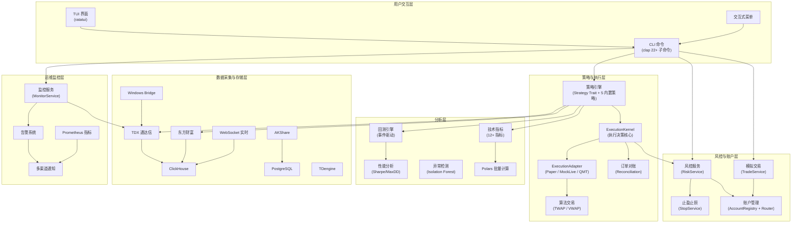

**Quantix-Rust** 是一款面向 **A 股量化交易** 场景的 Rust CLI 工具，与已有的 Python `quantix` 项目共享数据源与数据库基础设施，在保留 Python 端灵活性的同时，承担 **高性能分析、策略执行引擎与 operator 日常操作工作流** 的核心职责。项目的核心价值可以用一句话概括：**策略执行主线必须可靠、可解释、可验证**——从数据采集、技术分析、策略信号生成，到模拟撮合、风控评估、订单对账，形成完整的端到端闭环。

Sources: [Cargo.toml](Cargo.toml#L1-L8), [.planning/PROJECT.md](.planning/PROJECT.md#L1-L9), [src/lib.rs](src/lib.rs#L1-L50)

## Quantix-Rust 解决什么问题

传统 A 股量化工具链常面临三重困境：**Python 端性能瓶颈**（大规模 K 线计算、指标批量处理），**策略执行缺乏结构化生命周期**（信号到成交的路径模糊），以及**风控与交易操作碎片化**（散落在不同脚本与工具中）。Quantix-Rust 的设计目标正是系统性地解决这些问题。

| 痛点 | Quantix-Rust 的方案 | 对应模块 |
|------|---------------------|----------|
| K 线/指标批量计算慢 | Polars DataFrame + SIMD 加速的批量计算管线 | `analysis/polars_adapter` |
| 策略信号到成交无结构化路径 | `ExecutionKernel` 三层抽象 + `ExecutionAdapter` 多模式适配 | `execution/kernel`, `execution/adapter` |
| 风控规则散落各处 | 统一 `RiskService` 支持仓位/亏损/波动率/行业集中度多维规则 | `risk/service` |
| 多数据源切换成本高 | TDX/AKShare/东方财富/Bridge 四源适配 + WebSocket 实时推送 | `sources/*` |
| 回测结果难以复现 | 事件驱动回测引擎 + 冻结快照机制 | `analysis/backtest`, `execution/models` |
| 实盘操作无统一入口 | 22 个 CLI 子命令覆盖完整 operator 工作流 | `cli/commands` |

Sources: [src/analysis/polars_adapter.rs](src/analysis/polars_adapter.rs#L1-L10), [src/execution/kernel/mod.rs](src/execution/kernel/mod.rs#L28-L34), [src/risk/service.rs](src/risk/service.rs#L1-L5), [src/sources/mod.rs](src/sources/mod.rs#L1-L5), [src/cli/commands/mod.rs](src/cli/commands/mod.rs#L44-L163)

## 系统架构全景

下面的 Mermaid 图展示了 Quantix-Rust 从数据源到最终用户交互的完整分层架构。建议先阅读本图建立全局认知，再按需深入各层模块文档。

> **前置知识**：Mermaid 是一种基于文本的图表描述语言，被 GitHub、GitLab 等平台原生支持。下面的代码块可以在支持 Mermaid 的 Markdown 渲染器中直接显示为架构图。



Sources: [src/lib.rs](src/lib.rs#L17-L43), [src/cli/commands/mod.rs](src/cli/commands/mod.rs#L53-L163), [src/execution/mod.rs](src/execution/mod.rs#L1-L14), [src/monitoring/mod.rs](src/monitoring/mod.rs#L1-L5)

## 核心模块一览

项目当前包含 **23 个顶级模块**，覆盖从数据采集到实盘执行的完整链路。下表按功能域分类，帮助快速定位感兴趣的模块。

### 数据与存储域

| 模块 | 职责 | 核心类型/结构 | 存储后端 |
|------|------|---------------|----------|
| `sources` | 多数据源适配（TDX/AKShare/东方财富/Bridge/WebSocket） | `QuoteCollector`, `AuctionCollector`, `KlineAggregator` | — |
| `db` | 多数据库客户端 | `ClickHouseClient`, `PostgresClient`, `TDengineClient` | ClickHouse / PostgreSQL / TDengine |
| `data` | 数据模型与获取接口 | `Kline`, `GbbqEvent`, `CapitalChange` | — |
| `sync` | ETL 数据同步 | `DataSync`, `SyncConfig` | PostgreSQL/TDengine → ClickHouse |
| `io` | 数据导入导出 | `DataExporter`, `DataImporter`, `BatchProcessor` | CSV / JSON / Parquet |

Sources: [src/sources/mod.rs](src/sources/mod.rs#L1-L5), [src/db/mod.rs](src/db/mod.rs#L1-L5), [src/data/models.rs](src/data/models.rs#L1-L10), [src/sync/etl.rs](src/sync/etl.rs#L1-L5), [src/io/mod.rs](src/io/mod.rs#L1-L5)

### 策略与执行域

| 模块 | 职责 | 核心类型/结构 |
|------|------|---------------|
| `strategy` | 策略定义、注册、运行时、守护进程 | `Strategy` trait, `Signal`(Buy/Sell/Hold), `StrategyRuntime`, `StrategyDaemon` |
| `execution` | 执行内核、适配器、对账、运行时存储 | `ExecutionKernel<A,F,R>`, `ExecutionAdapter` trait, `PaperAdapter`, `MockLiveAdapter` |
| `account` | 多账户管理与智能路由 | `AccountConfig`, `AccountGroup`, `AllocationStrategy`, `AccountRouter` |
| `trade` | 模拟交易与费用计算 | `PaperTradeAccount`, `TradeService`, `FeeBreakdown` |
| `stop` | 止盈止损规则与评估 | `StopRule`, `StopService` (固定/百分比/跟踪止损) |
| `risk` | 风控规则体系 | `RiskService`, `RiskRule`(仓位/亏损/波动率/行业) |

Sources: [src/strategy/trait_def.rs](src/strategy/trait_def.rs#L10-L29), [src/execution/kernel/mod.rs](src/execution/kernel/mod.rs#L28-L60), [src/account/models.rs](src/account/models.rs#L1-L10), [src/trade/service.rs](src/trade/service.rs#L1-L5), [src/stop/models.rs](src/stop/models.rs#L1-L5), [src/risk/service.rs](src/risk/service.rs#L1-L5)

### 分析与 AI 域

| 模块 | 职责 | 核心类型/结构 |
|------|------|---------------|
| `analysis` | 技术指标、回测引擎、性能分析、K 线形态、Polars 适配 | `BacktestEngine`, `PerformanceCalculator`, `PolarsCalculator` |
| `anomaly` | 异常检测（Isolation Forest） | `AnomalyDetector`, `FeatureExtractor`, `StockFilter` |
| `ai` | LLM 多模型决策与 Prompt 模板 | `LLMAdapter`, `DecisionEngine`, `ConversationManager` |
| `news` | 多源新闻搜索与聚合 | `NewsProvider` trait, `NewsAggregator`, `NewsCache` |
| `fundamental` | 基本面数据（估值/财报/龙虎榜/机构持仓） | `FundamentalProvider`, `ValuationFetcher`, `DragonTigerFetcher` |
| `screener` | 条件选股与预设筛选 | `ScreenerService`, `evaluate_preset` |

Sources: [src/analysis/mod.rs](src/analysis/mod.rs#L1-L5), [src/anomaly/mod.rs](src/anomaly/mod.rs#L1-L5), [src/ai/mod.rs](src/ai/mod.rs#L1-L5), [src/news/mod.rs](src/news/mod.rs#L1-L5), [src/fundamental/mod.rs](src/fundamental/mod.rs#L1-L5), [src/screener/mod.rs](src/screener/mod.rs#L1-L5)

### 运维监控域

| 模块 | 职责 | 核心类型/结构 |
|------|------|---------------|
| `monitor` | 实时监控服务与 daemon | `MonitorRunner`, `MonitorService`, `PriceAlert` |
| `monitoring` | 告警、健康检查、指标导出、通知 | `AlertManager`, `HealthRegistry`, `MetricsCollector`, `NotificationService` |
| `market` | 市场分析（板块/龙头/北向/情绪） | `MarketService`, `MarketOverview`, `NorthFlowSnapshot` |
| `tasks` | 定时任务调度 | `TaskScheduler`, `CronExpression`, `CollectScheduler` |

Sources: [src/monitor/mod.rs](src/monitor/mod.rs#L1-L5), [src/monitoring/mod.rs](src/monitoring/mod.rs#L1-L5), [src/market/service.rs](src/market/service.rs#L1-L5), [src/tasks/scheduler.rs](src/tasks/scheduler.rs#L1-L5)

### 基础设施域

| 模块 | 职责 | 核心类型/结构 |
|------|------|---------------|
| `core` | 配置管理、错误处理、交易日历、运行时上下文 | `QuantixError`, `AppConfig`, `TradingCalendar`, `CliRuntime` |
| `cli` | 命令解析与处理分发 | `Cli`(clap Parser), `Commands`(22 子命令枚举) |
| `bridge` | Windows Bridge HTTP 客户端 | `BridgeClient`, `BridgeRequest/Response` |
| `import` | 智能导入（股票代码/名称/拼音解析） | `CodeResolver`, `CsvParser`, `TextParser` |

Sources: [src/core/mod.rs](src/core/mod.rs#L1-L16), [src/cli/mod.rs](src/cli/mod.rs#L1-L25), [src/bridge/mod.rs](src/bridge/mod.rs#L1-L5), [src/import/mod.rs](src/import/mod.rs#L1-L5)

## 技术选型与设计哲学

Quantix-Rust 的技术选型遵循 **"与 Python 端兼容、Rust 端高性能"** 的双轨原则。关键决策如下：

| 技术领域 | 选型 | 设计理由 |
|----------|------|----------|
| 异步运行时 | **Tokio** (full features + tracing) | A 股量化场景天然 I/O 密集（网络请求、数据库查询、WebSocket 推送），Tokio 的 `select!` 宏为并发消息处理提供了优雅的表达力 |
| 数据库 | **ClickHouse** (主存储) + PostgreSQL + TDengine (可选) | ClickHouse 的 MergeTree 引擎与列式存储天然适配 K 线时序数据的高吞吐写入与范围查询 |
| DataFrame | **Polars** 0.43 (lazy + rolling_window) | 比逐行迭代快 10-100 倍的批量指标计算；LazyFrame 支持查询优化与内存高效处理 |
| CLI 框架 | **Clap** 4.5 (derive) | 声明式子命令定义，编译时类型安全，与 Rust 的枚举系统天然契合 |
| 错误处理 | **thiserror** + **anyhow** + **color-eyre** | 库层用 `thiserror` 定义精确错误类型，应用层用 `anyhow` 简化传播，CLI 层用 `color-eyre` 提供美观的错误报告 |
| HTTP 客户端 | **reqwest** (cookies + json) | 东方财富等 API 需要 cookie 持久化；与 tokio 运行时无缝集成 |
| 实时行情 | **tokio-tungstenite** | WebSocket 连接管理、心跳保活、自动重连，覆盖 A 股交易时段的长时间连接需求 |
| 序列化 | **serde** + **serde_json** + **csv** + **parquet** | 与 Python 端共享数据格式，支持 JSON/CSV/Parquet 三种导出格式 |

Sources: [Cargo.toml](Cargo.toml#L18-L101), [src/core/error.rs](src/core/error.rs#L1-L51)

### 设计哲学

项目遵循几个贯穿始终的设计原则：

**Trait 驱动的抽象层**：策略（`Strategy` trait）、执行适配器（`ExecutionAdapter` trait）、数据源、新闻提供者、基本面数据提供者等核心接口均通过 trait 定义，实现多态切换而不影响上层逻辑。例如，`ExecutionKernel<A, F, R>` 是一个泛型结构，其中 `A` 可以是 `PaperAdapter`、`MockLiveAdapter` 或未来的真实 broker 适配器。

**本地优先、渐进扩展**：所有用户数据默认持久化在本地文件（`~/.quantix/` 目录），不依赖外部服务即可完成模拟交易、风控评估、止盈止损等核心操作。数据库和网络服务仅在需要时才作为增强能力接入。

**安全的实盘边界**：项目对实盘执行采取极其谨慎的态度——当前 `mock_live` 和 `QMT preview-only` 模式明确标记为非真实执行路径，`live` adapter 的接入需要显式 safety gating 机制。项目文档中反复强调：**不能误导用户把 preview-only / mock_live 当作 real live broker 路径**。

Sources: [src/strategy/trait_def.rs](src/strategy/trait_def.rs#L10-L29), [src/execution/adapter.rs](src/execution/adapter.rs#L48-L60), [.planning/PROJECT.md](.planning/PROJECT.md#L39-L44)

## 项目当前状态

截至当前，项目已完成 **29 个 Phase** 的核心交付，策略执行主线已闭环到 `paper` / `mock_live` / `execution_request` / `execution daemon` 层。以下能力已稳定落地：

```mermaid
graph LR
    subgraph 已完成 ✅
        A1["数据采集<br/>(TDX/AKShare/东财/Bridge/WS)"]
        A2["K线聚合与多周期查询"]
        A3["技术指标管线<br/>(12+ 指标 + Polars 批量)"]
        A4["回测引擎<br/>(事件驱动 + 性能报告)"]
        A5["策略引擎<br/>(5 内置策略 + Daemon)"]
        A6["Paper/MockLive 执行"]
        A7["风控体系<br/>(仓位/亏损/波动率/行业)"]
        A8["止盈止损<br/>(固定/百分比/跟踪)"]
        A9["模拟交易"]
        A10["自选池 + 选股器"]
        A11["市场分析<br/>(板块/龙头/北向/情绪)"]
        A12["监控 + 告警 + 通知"]
        A13["AI 决策<br/>(5 LLM 模型)"]
        A14["异常检测<br/>(Isolation Forest)"]
        A15["多账户管理 + 路由"]
        A16["TWAP/VWAP 算法交易"]
    end

    subgraph 进行中 🚧
        B1["Execution 语义加固"]
        B2["Real Live Broker 边界收口"]
    end

    subgraph 规划中 📋
        C1["风控规则增强"]
        C2["市场分析扩展"]
        C3["TUI 重构"]
    end
```

Sources: [README.md](README.md#L37-L76), [ROADMAP.md](ROADMAP.md#L17-L21), [.planning/ROADMAP.md](.planning/ROADMAP.md#L7-L14)

## 项目目录结构速览

以下树形图展示了源码目录的顶层结构，帮助你快速定位感兴趣的代码区域：

```
src/
├── main.rs              # 入口：CLI 解析 + Tokio 异步运行时
├── lib.rs               # 库入口：23 个模块声明 + 常用类型重导出
├── core/                # 基础设施：配置、错误、交易日历、运行时
├── cli/                 # 命令层：Clap 子命令定义 + Handler 分发
├── sources/             # 数据源：TDX/AKShare/东方财富/Bridge/WebSocket
├── db/                  # 数据库：ClickHouse/PostgreSQL/TDengine 客户端
├── data/                # 数据模型：K线、GBBQ 事件等核心结构
├── sync/                # ETL 同步：跨数据库数据桥接
├── io/                  # 导入导出：CSV/JSON/Parquet + 批处理
├── analysis/            # 分析引擎：指标、回测、Polars、K线形态
├── strategy/            # 策略层：Trait + 5 策略 + Daemon + Runtime
├── execution/           # 执行层：Kernel + Adapter + 对账 + QMT
├── account/             # 账户：多账户管理、账户组、智能路由
├── trade/               # 模拟交易：PaperTrade + 费用计算
├── risk/                # 风控：规则体系 + 波动率 + 行业集中度
├── stop/                # 止盈止损：规则设置 + 实时评估
├── monitor/             # 监控：实时扫描 + Daemon + systemd
├── monitoring/          # 监控基础设施：告警/指标/通知/健康检查
├── market/              # 市场分析：板块/龙头/北向/情绪/舆情
├── screener/            # 选股器：条件解析 + 评估 + 服务
├── watchlist/           # 自选池：分组/标签/行情解析
├── ai/                  # AI 决策：LLM 多模型 + Prompt + 决策引擎
├── news/                # 新闻：多源搜索 + 聚合 + 缓存
├── fundamental/         # 基本面：估值/财报/龙虎榜/机构持仓
├── anomaly/             # 异常检测：Isolation Forest + 东方财富数据
├── import/              # 智能导入：代码解析 + CSV/文本/图片解析
├── bridge/              # Windows Bridge：HTTP 客户端
├── tasks/               # 任务调度：Cron + Scheduler
└── tui/                 # TUI 界面（实验性）
```

Sources: [src/main.rs](src/main.rs#L1-L23), [src/lib.rs](src/lib.rs#L17-L43)

## 推荐阅读路线

对于初次接触本项目的开发者，建议按以下顺序阅读文档，逐步建立从全局到细节的认知：

1. **[快速搭建与运行](2-kuai-su-da-jian-yu-yun-xing)** — 先把项目跑起来，获得第一手的运行体验
2. **[项目架构全景](3-xiang-mu-jia-gou-quan-jing)** — 深入理解分层架构与模块间的依赖关系
3. **[CLI 命令体系与交互流程](4-cli-ming-ling-ti-xi-yu-jiao-hu-liu-cheng)** — 掌握 22 个子命令的使用方法
4. **[配置管理与多环境加载机制](5-pei-zhi-guan-li-yu-duo-huan-jing-jia-zai-ji-zhi)** — 理解 `config/default.toml` 与环境变量的加载优先级
5. **[多数据源适配器架构](8-duo-shu-ju-yuan-gua-pei-qi-jia-gou-tdx-akshare-dong-fang-cai-fu-bridge)** — 了解数据如何从外部源流入系统
6. **[策略 Trait 抽象与内置策略实现](11-ce-lue-trait-chou-xiang-yu-nei-zhi-ce-lue-shi-xian)** — 理解策略如何定义、注册和运行
7. **[ExecutionKernel 执行生命周期](12-executionkernel-zhi-xing-sheng-ming-zhou-qi-yu-feng-kong-ping-gu)** — 深入执行引擎的核心设计

如果你更关注某个特定领域（如风控、AI、运维部署），可以直接跳转到"深度解析"下的对应页面，每个页面都设计为可独立阅读。