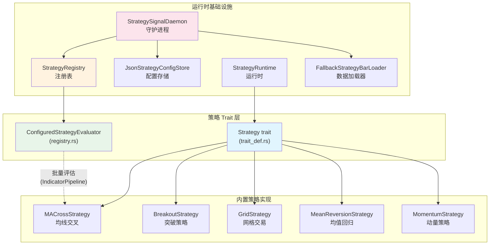
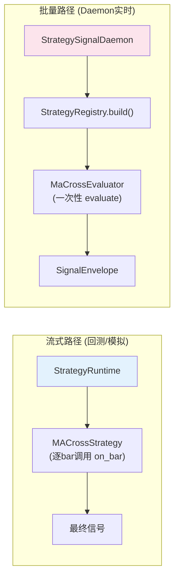
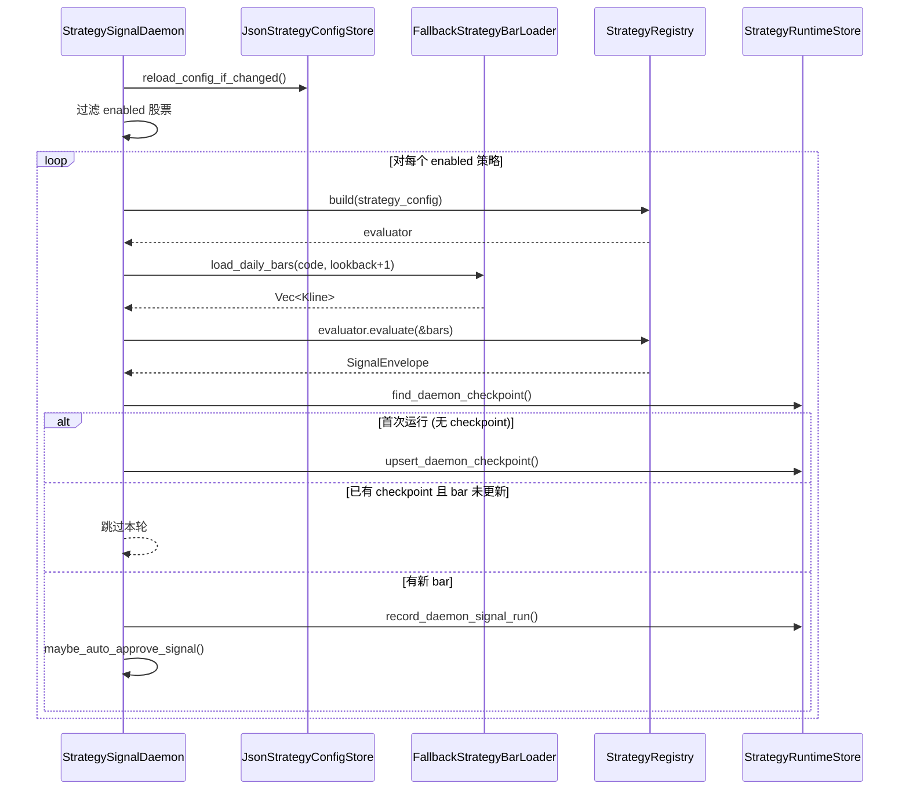
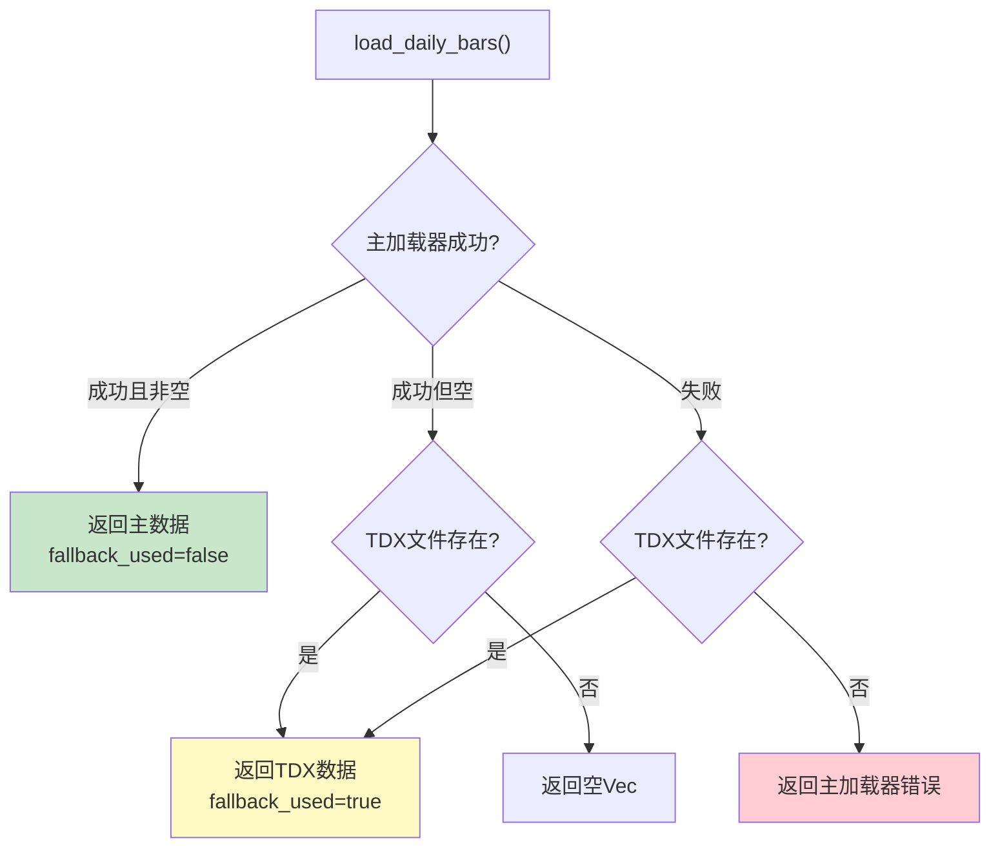

策略模块是 Quantix 的**信号生成中枢**——它定义了所有策略必须遵循的统一接口（`Strategy` trait），同时提供五种风格各异的内置策略实现，覆盖趋势跟踪、均值回归、动量突破和网格交易等经典交易范式。在运行时层面，`StrategySignalDaemon` 守护进程以定时轮询的方式驱动策略评估，将信号写入持久化存储并对接执行引擎。本页将系统性地解析 trait 设计哲学、各策略的核心算法、注册表机制以及 daemon 的完整生命周期。

Sources: [mod.rs](src/strategy/mod.rs#L1-L45), [trait_def.rs](src/strategy/trait_def.rs#L1-L38)

## 架构总览

策略模块的内部架构遵循**双轨评估**设计：面向逐 bar 流式处理的 `Strategy` trait，以及面向批量评估的 `ConfiguredStrategyEvaluator` trait。两条路径共享相同的信号枚举和数据模型，但在状态管理、指标计算方式上各有侧重。



Sources: [mod.rs](src/strategy/mod.rs#L1-L45)

## Strategy Trait 接口设计

`Strategy` trait 是整个策略模块的**契约核心**。任何想要接入 Quantix 策略框架的实现者，都必须满足这个接口，它定义了策略生命周期的四个阶段：命名、初始化、逐 bar 处理和收尾清理。

```rust
#[async_trait]
pub trait Strategy: Send + Sync {
    fn name(&self) -> &str;
    async fn init(&mut self) -> Result<(), Box<dyn std::error::Error>> { Ok(()) }
    async fn on_bar(&mut self, _bar: &Kline) -> Result<Signal, Box<dyn std::error::Error>> { Ok(Signal::Hold) }
    async fn finish(&mut self) -> Result<(), Box<dyn std::error::Error>> { Ok(()) }
}
```

**接口要素解析**：

| 方法 | 职责 | 默认行为 |
|---|---|---|
| `name()` | 返回策略的可读标识符，用于日志和回测报告 | 无默认值，必须实现 |
| `init()` | 策略启动前的准备工作（如加载外部参数） | 空操作 |
| `on_bar()` | 每根 K 线到达时的核心信号计算逻辑 | 返回 `Signal::Hold` |
| `finish()` | 策略结束时的资源清理和状态重置 | 空操作 |

`Send + Sync` 约束确保策略实例可以安全地跨线程传递——这在 daemon 的异步运行时中是必需的。`async_trait` 宏将 trait 方法转换为返回 `Pin<Box<dyn Future>>` 的形式，使得策略实现可以在 `on_bar` 中执行异步操作（如查询远程数据源）。`init` 和 `finish` 提供了合理的默认实现，策略实现者可以根据需要选择性覆写。

Sources: [trait_def.rs](src/strategy/trait_def.rs#L1-L38)

### Signal 信号枚举

策略的输出被抽象为三种互斥状态，这构成了策略与执行引擎之间的**最小通信协议**：

```rust
#[derive(Debug, Clone, Copy, PartialEq, Eq, Serialize, Deserialize)]
pub enum Signal {
    Buy,   // 买入信号
    Sell,  // 卖出信号
    Hold,  // 维持观望
}
```

`Signal` 是 `Copy` 类型，这意味着它可以被高效地复制而不涉及堆分配。`Serialize + Deserialize` 的派生使得信号可以无损地序列化到 JSON 配置或数据库记录中。在 daemon 的信号记录中，`Signal` 通过 `signal_label()` 函数转换为 `"buy"` / `"sell"` / `"hold"` 字符串标签。

Sources: [trait_def.rs](src/strategy/trait_def.rs#L32-L37), [daemon.rs](src/strategy/daemon.rs#L256-L262)

## Kline 数据模型

所有策略的输入都是 `Kline` 结构体，它是日线级别 OHLCV 数据的标准化载体：

```rust
pub struct Kline {
    pub code: String,           // 股票代码
    pub date: NaiveDate,        // 交易日期
    pub open: Decimal,          // 开盘价
    pub high: Decimal,          // 最高价
    pub low: Decimal,           // 最低价
    pub close: Decimal,         // 收盘价
    pub volume: i64,            // 成交量
    pub amount: Option<Decimal>,// 成交额
    pub adjust_type: AdjustType,// 复权类型
}
```

值得注意的是价格字段使用 `rust_decimal::Decimal` 而非 `f64`。这个选择至关重要——**金融计算中浮点精度误差是不可接受的**。`Decimal` 提供了精确的十进制运算，避免了 `0.1 + 0.2 != 0.3` 这类经典问题，对策略中的均线计算、ATR 计算和价格比较逻辑尤为重要。

Sources: [models.rs](src/data/models.rs#L9-L21)

## 五种内置策略实现

### 均线交叉策略（MACrossStrategy）

均线交叉是技术分析中最经典的趋势判断方法。**核心思想**：当短期均线上穿长期均线时形成"金叉"（买入信号），下穿时形成"死叉"（卖出信号）。

**配置参数**：仅需两个整数——`short_period`（短期均线周期）和 `long_period`（长期均线周期），默认组合为 5 日/20 日。

**信号判定逻辑**：
- **金叉**：`prev_short <= prev_long && curr_short > curr_long`——短期均线从下方穿越到上方
- **死叉**：`prev_short >= prev_long && curr_short < curr_long`——短期均线从上方穿越到下方

策略内部维护 `price_history` 向量缓存所有收盘价，每次 `on_bar` 调用时追加最新价格并调用 `ma()` 函数重新计算两条均线。由于需要比较相邻两期的均线值，策略还保存了 `last_short_ma` 和 `last_long_ma` 状态。`position` 布尔字段跟踪当前持仓状态——金叉时设为 `true`，死叉时设为 `false`，这防止了在已持仓状态下重复触发买入。

Sources: [ma_cross.rs](src/strategy/ma_cross.rs#L1-L128)

### 突破策略（BreakoutStrategy）

突破策略捕捉**价格突破关键支撑/阻力位且伴随成交量放大**的交易机会。这是一个典型的动量入场策略，结合了 ATR（平均真实波幅）进行动态止损止盈。

**配置参数**：

| 参数 | 含义 | 默认值 |
|---|---|---|
| `lookback_period` | 观察窗口（计算高低位） | 20 |
| `atr_period` | ATR 计算周期 | 14 |
| `volume_multiplier` | 成交量放大倍数阈值 | 1.5 (存储为 15/10) |
| `min_breakout_atr` | 最小突破幅度（ATR 倍数） | 0.5 (存储为 5/10) |
| `stop_loss_atr` | 止损距离（ATR 倍数） | 2.0 (存储为 20/10) |
| `take_profit_atr` | 止盈距离（ATR 倍数） | 6.0 (存储为 60/10) |

**核心检测流程**：向上突破需要同时满足三个条件——价格突破历史高点、成交量放大到均值的指定倍数、突破幅度超过指定 ATR 比例。一旦入场，策略会基于当前 ATR 值动态设置止损止盈价格，在持仓期间优先检查是否触发退出条件。向下突破（做空）的逻辑对称处理——止损在上方、止盈在下方。

注意配置中的 `Decimal` 值采用"十倍存储"约定（如 `volume_multiplier: Decimal::from(15)` 实际表示 1.5 倍），这是因为 `Decimal::from()` 只接受整数，除以 10 的运算在实际比较时进行。

Sources: [breakout.rs](src/strategy/breakout.rs#L1-L313)

### 网格交易策略（GridStrategy）

网格策略适用于**震荡市场**，在价格区间内等间距布设买卖单，利用价格波动的均值特性反复低买高卖。

**配置参数**：

| 参数 | 含义 | 默认值 |
|---|---|---|
| `grid_count` | 网格数量 | 10 |
| `atr_period` | ATR 计算周期 | 14 |
| `range_multiplier` | 价格区间半径（ATR 倍数） | 2.0 (存储为 20/10) |
| `position_size_pct` | 每格资金比例 | 10% |
| `dynamic_adjustment` | 是否动态调整网格 | true |
| `adjustment_period` | 调整间隔（K 线数） | 100 |

**网格初始化**：以首次到达的收盘价为中心，上下各扩展 `ATR × range_multiplier / 10` 形成交易区间。区间被均分为 `grid_count + 1` 个网格节点，低于中心价的节点挂买单，高于中心价的挂卖单。每根 K 线到达时检查是否触及网格线——价格跌到买单价位触发 `Buy`，涨到卖单价位触发 `Sell`。当 `dynamic_adjustment` 启用时，策略每隔 `adjustment_period` 根 K 线重新计算网格中心价和边界，适应市场趋势的变化。

Sources: [grid.rs](src/strategy/grid.rs#L1-L324)

### 均值回归策略（MeanReversionStrategy）

均值回归策略基于**价格偏离均值后终将回归**的统计假设。它同时使用 RSI（相对强弱指数）和布林带（Bollinger Bands）作为双重确认。

**配置参数**：

| 参数 | 含义 | 默认值 |
|---|---|---|
| `rsi_period` | RSI 计算周期 | 14 |
| `rsi_overbought` | 超买阈值 | 70 |
| `rsi_oversold` | 超卖阈值 | 30 |
| `bb_period` | 布林带周期 | 20 |
| `bb_std_dev` | 标准差倍数 | 2 |
| `buy_deviation_pct` | 低于下轨百分比 | 2% |
| `sell_deviation_pct` | 高于上轨百分比 | 2% |

**入场条件需要双重触发**：买入信号要求 RSI ≤ 30（超卖）**且**价格低于布林带下轨的 `(100 - buy_deviation_pct)%`；卖出信号要求 RSI ≥ 70（超买）**且**价格高于布林带上轨的 `(100 + sell_deviation_pct)%`。这种双指标过滤机制显著降低了单指标误判的风险。策略所需的最少数据量为 `max(bb_period, rsi_period + 1)` 根 K 线。

Sources: [mean_reversion.rs](src/strategy/mean_reversion.rs#L1-L169)

### 动量策略（MomentumStrategy）

动量策略基于 **MACD（移动平均收敛/发散）指标**追踪趋势方向，在趋势启动时入场。

**配置参数**：

| 参数 | 含义 | 默认值 |
|---|---|---|
| `fast_period` | MACD 快线周期 | 12 |
| `slow_period` | MACD 慢线周期 | 26 |
| `signal_period` | 信号线周期 | 9 |
| `macd_positive_threshold` | 多头确认阈值 | 0.05 |
| `macd_negative_threshold` | 空头确认阈值 | -0.05 |
| `enable_divergence` | 是否启用背离检测 | false |

**信号判定**：金叉判定为 MACD 柱状图从负转正（`prev < 0 && curr > 0`），死叉判定为从正转负（`prev > 0 && curr < 0`）。策略最少需要 `max(fast, slow, signal) + slow` 根 K 线数据——这是因为 MACD 的计算本身需要一个 EMA 暖启动期。`enable_divergence` 参数已预留但尚未实现背离检测逻辑。

Sources: [momentum.rs](src/strategy/momentum.rs#L1-L161)

## 策略对比总览

五种策略在市场环境适应性、复杂度和状态管理方面各有特点：

| 维度 | MACross | Breakout | Grid | MeanReversion | Momentum |
|---|---|---|---|---|---|
| **适用市场** | 趋势市 | 趋势市 | 震荡市 | 震荡市 | 趋势市 |
| **核心指标** | MA | ATR + 成交量 | ATR | RSI + 布林带 | MACD |
| **最少数据量** | `long_period` | `lookback + atr + 1` | `atr_period + 1` | `max(bb, rsi+1)` | `max(f,s,sig)+s` |
| **状态复杂度** | 低（两均值） | 高（持仓+止损止盈） | 高（网格订单簿） | 中（RSI+BB缓存） | 中（MACD历史） |
| **内置止损止盈** | ❌ | ✅ (ATR动态) | ❌ (网格替代) | ❌ | ❌ |
| **做空支持** | ❌ | ✅ | ❌ | ❌ | ❌ |
| **动态调参** | ❌ | ❌ | ✅ | ❌ | ❌ |

Sources: [ma_cross.rs](src/strategy/ma_cross.rs#L1-L128), [breakout.rs](src/strategy/breakout.rs#L1-L313), [grid.rs](src/strategy/grid.rs#L1-L324), [mean_reversion.rs](src/strategy/mean_reversion.rs#L1-L169), [momentum.rs](src/strategy/momentum.rs#L1-L161)

## 双轨评估架构

策略模块存在两条并行的评估路径，它们服务于不同的使用场景：

**流式路径（`Strategy` trait）**：策略通过 `on_bar()` 方法逐根接收 K 线数据，内部维护完整的状态历史。这条路径适用于回测引擎和 `StrategyRuntime`——`run_ma_cross_once()` 会遍历全部历史 bar，保留最后一次信号。状态存储在策略结构体自身，每根 bar 的处理结果可能影响后续判断（如持仓状态追踪）。

**批量路径（`ConfiguredStrategyEvaluator` trait）**：注册表中的评估器一次性接收全部 K 线切片，通过 `IndicatorPipeline` 批量计算指标，无内部可变状态。这条路径适用于 daemon 的实时信号评估——它关注的是"基于全部历史数据，当前应产生什么信号"，而非模拟逐 bar 的交易过程。



Sources: [runtime.rs](src/strategy/runtime.rs#L1-L68), [registry.rs](src/strategy/registry.rs#L1-L174)

### StrategyRuntime 运行时

`StrategyRuntime<L>` 是流式路径的核心驱动器，泛型参数 `L` 必须实现 `StrategyBarLoader` trait：

```rust
#[async_trait]
pub trait StrategyBarLoader: Send + Sync {
    async fn load_daily_bars(&self, code: &str, limit: usize) -> Result<Vec<Kline>>;
}
```

当前 `StrategyRuntime` 仅实现了 `run_ma_cross_once()` 方法，它会加载最多 10,000 根日 K 线，创建 `MACrossStrategy` 实例后逐 bar 推送，最终返回 `SignalEnvelope`（包含最后一个信号和元数据）。这个方法目前是硬编码的 MA 交叉策略入口——未来可以扩展为通用的策略运行方法。

Sources: [runtime.rs](src/strategy/runtime.rs#L1-L68)

### StrategyRegistry 注册表

`StrategyRegistry` 是批量路径的**策略工厂**。它将 `ConfiguredStrategyInstance`（JSON 配置中的策略实例）转换为 `Box<dyn ConfiguredStrategyEvaluator>`。当前仅注册了 `"ma_cross"` 策略名，对未知名称返回错误。

`MaCrossEvaluator` 是 registry 中最关键的类型。它不持有可变状态，而是将参数配置转换为 `IndicatorPipelineConfig`，在每次 `evaluate()` 调用时创建新的 `IndicatorPipeline` 实例，批量运行 SMA 计算，然后遍历指标输出序列检测金叉/死叉。`lookback_required()` 返回慢均线周期数，用于确定 daemon 需要加载的最少 K 线数量。

Sources: [registry.rs](src/strategy/registry.rs#L1-L174)

## StrategySignalDaemon 守护进程

`StrategySignalDaemon` 是策略模块的**运行时入口点**，它将配置管理、数据加载、策略评估和结果持久化串联成一个完整的信号生成流水线。

### Daemon 生命周期



Sources: [daemon.rs](src/strategy/daemon.rs#L1-L270)

### 核心方法解析

**`run_once()`** 是 daemon 的主循环体。每次调用执行一轮完整的评估周期：

1. **配置热重载**：通过比较配置文件的 `mtime`（修改时间），如果文件被外部修改则重新加载配置，实现无重启更新
2. **股票过滤**：当前仅支持恰好一个 `enabled` 的股票（MVP 阶段约束）
3. **策略构建**：通过 `StrategyRegistry::build()` 将 JSON 配置转换为评估器
4. **数据加载**：调用 loader 获取足够的历史 K 线（至少 `lookback_required() + 1` 根，或最多 10,000 根）
5. **信号评估**：评估器一次性处理全部 K 线，返回 `SignalEnvelope`
6. **断点判断**：查询数据库中的 checkpoint，如果上次处理过的 bar 结束时间 ≥ 当前最新 bar 的时间，则跳过
7. **结果记录**：写入 `StrategyRunRecord`、`StrategySignalRecord` 和 `StrategyDaemonCheckpointRecord` 三条记录
8. **自动审批**：如果执行配置的 `auto_approval.mode` 为 `Always`，则自动将信号状态从 `Pending` 提升为已审批

**Bootstrap 策略**：首次运行时（数据库中无 checkpoint），daemon 采用 `LatestOnly` 策略——仅记录当前最新 bar 的时间作为断点，不回填历史信号。这避免了系统首次启动时产生大量"虚假"的历史信号。

Sources: [daemon.rs](src/strategy/daemon.rs#L71-L200), [daemon.rs](src/strategy/daemon.rs#L207-L238)

### 时间处理

daemon 中的时间处理遵循严格的规范：日线 bar 的结束时间被统一为上海时间 15:00（A 股收盘时刻），再转换为 UTC 存储到数据库。`normalize_daily_bar_end()` 函数处理了这个转换：

```rust
fn normalize_daily_bar_end(date: NaiveDate) -> Result<DateTime<Utc>> {
    let shanghai = FixedOffset::east_opt(8 * 3600)?;
    let local = shanghai.from_local_datetime(&date.and_time(NaiveTime::from_hms_opt(15, 0, 0).unwrap()))?;
    Ok(local.with_timezone(&Utc))
}
```

Sources: [daemon.rs](src/strategy/daemon.rs#L246-L254)

## 数据加载与容错机制

`FallbackStrategyBarLoader<P>` 实现了**主备切换**的数据加载模式。泛型 `P` 是主加载器（通常从数据库读取），当主加载器返回空数据或出错时，自动降级到本地 TDX 日线文件作为数据源。



**TDX 文件路径解析**：通过 `QUANTIX_TDX_ROOT`（或旧版 `TDX_ROOT`）环境变量定位通达信安装目录，然后在 `vipdoc/{market}/lday/` 下查找 `{market}{code}.day` 文件。市场类型通过 `QUANTIX_TDX_MARKET`（或 `TDX_MARKET`）环境变量指定；若未指定，则依次尝试 `sh`、`sz`、`bj`、`ds` 四个目录。如果代码在多个市场目录中匹配到文件，会报错提示用户显式设置市场变量。

Sources: [fallback_loader.rs](src/strategy/fallback_loader.rs#L1-L197)

## 配置体系

### 策略 Daemon 配置

`StrategyDaemonConfig` 定义了 daemon 的运行参数和股票策略列表：

```rust
pub struct StrategyDaemonConfig {
    pub check_interval_secs: u64,        // 轮询间隔（秒）
    pub bootstrap_policy: BootstrapPolicy, // 启动策略
    pub stocks: Vec<ConfiguredStock>,    // 股票-策略映射
}
```

配置通过 `JsonStrategyConfigStore` 持久化为 JSON 文件（默认路径 `~/.quantix/strategy/config.json`）。存储操作采用**原子写入**模式——先写入 `.tmp` 临时文件，再通过 `rename` 系统调用原子替换目标文件，避免在写入过程中因进程崩溃导致配置文件损坏。

默认配置包含一个示例股票 `000001`，搭配一个 `ma_fast_5_slow_20` 策略实例（5 日/20 日均线交叉）：

```json
{
  "check_interval_secs": 60,
  "bootstrap_policy": "latest_only",
  "stocks": [{
    "code": "000001",
    "enabled": true,
    "strategies": [{
      "id": "ma_fast_5_slow_20",
      "name": "ma_cross",
      "enabled": true,
      "params": { "fast": 5, "slow": 20 }
    }]
  }]
}
```

Sources: [config.rs](src/strategy/config.rs#L1-L111)

### 策略实例配置

`ConfiguredStrategyInstance` 是策略注册表的输入格式，包含策略的唯一标识、名称、启用状态和参数。`params` 字段是 `serde_json::Value` 类型，允许灵活的参数结构——不同策略可以有不同的参数 schema。在注册表构建时，`IndicatorPipelineConfig::try_from(config)` 会验证参数格式是否合法。

Sources: [config.rs](src/strategy/config.rs#L15-L28)

### 服务部署配置

`StrategyServiceConfig` 存储 systemd 用户服务部署所需的二进制路径和环境文件路径。`JsonStrategyServiceConfigStore` 负责其持久化（默认路径 `~/.quantix/strategy/service.json`）。`validate()` 方法在安装前检查二进制路径是否为绝对路径、是否存在且可执行（Unix 平台通过检查文件权限的执行位）。

Sources: [service_config.rs](src/strategy/service_config.rs#L1-L92)

## systemd 服务管理

`StrategyUserServiceInstaller` 封装了策略 daemon 的 systemd 用户级服务安装、卸载和生命周期管理：

| 操作 | 方法 | systemctl 命令 |
|---|---|---|
| 安装 | `install()` | 自动生成 unit 文件和 wrapper 脚本 |
| 卸载 | `uninstall()` | 移除 unit 文件和 wrapper 脚本 |
| 启动 | `start()` | `systemctl --user start quantix-strategy.service` |
| 停止 | `stop()` | `systemctl --user stop quantix-strategy.service` |
| 开机自启 | `enable()` | `systemctl --user enable quantix-strategy.service` |
| 状态查询 | `status_summary()` | 返回 `StrategyServiceStatusSummary` |

安装流程会生成两个文件：wrapper 脚本（`~/.local/bin/quantix-strategy-run`）和 systemd unit 文件（`~/.config/systemd/user/quantix-strategy.service`）。unit 文件中注入了 `QUANTIX_STRATEGY_CONFIG_PATH` 和 `QUANTIX_STRATEGY_RUNTIME_DB_PATH` 两个环境变量，确保 daemon 使用正确的配置和数据库路径。卸载时如果服务仍在运行会拒绝操作，防止误删。

Sources: [systemd.rs](src/strategy/systemd.rs#L1-L319)

## 测试基础设施

策略模块提供了 `test_utils` 子模块（仅在 `#[cfg(test)]` 下编译），包含 `KlineBuilder` 和 `TestDataConfig` 两个测试数据生成工具：

- `KlineBuilder`：Builder 模式生成 K 线数据，支持从收盘价自动推断 OHLCV（默认价差 1.0 元），也可通过 `from_ohlcv()` 手动指定每个字段
- `TestDataConfig`：配置价差、基础成交量等参数，提供 `tight_spread()`（0.1 元）、`wide_spread()`（5.0 元）和 `with_volume()` 预设
- `PriceTrend` 枚举：支持 `Up`、`Down`、`Sideways`、`Volatile` 四种趋势模式，配合 `generate_price_series()` 批量生成指定趋势的 K 线序列

Sources: [test_utils.rs](src/strategy/test_utils.rs#L1-L251)

## SignalEnvelope 信号封装

在批量评估路径中，策略信号被包装为 `SignalEnvelope`，它除了 `Signal` 枚举外还携带 `metadata_json` 元数据：

```rust
pub struct SignalEnvelope {
    pub signal: Signal,
    pub metadata_json: Value,
}
```

这个设计使得执行引擎在接收到信号时，除了知道"买/卖/持有"之外，还可以获取策略的上下文信息（如指标数值、触发原因等）。在 daemon 的信号记录中，metadata 包含策略实例 ID、参数、数据源信息和执行策略快照。

Sources: [models.rs](src/execution/models.rs#L241-L254)

## 延伸阅读

- 了解信号产生后如何进入执行流程：[ExecutionKernel 执行生命周期与风控评估](12-executionkernel-zhi-xing-sheng-ming-zhou-qi-yu-feng-kong-ping-gu)
- 了解 Paper/MockLive 适配器如何消费策略信号：[Paper/MockLive 执行适配器与运行时状态持久化](13-paper-mocklive-zhi-xing-gua-pei-qi-yu-yun-xing-shi-zhuang-tai-chi-jiu-hua)
- 了解策略使用的指标计算细节：[技术指标管线与注册表机制](15-ji-zhu-zhi-biao-guan-xian-yu-zhu-ce-biao-ji-zhi)
- 了解策略在回测场景中的应用：[事件驱动回测引擎与性能指标计算](16-shi-jian-qu-dong-hui-ce-yin-qing-yu-xing-neng-zhi-biao-ji-suan)