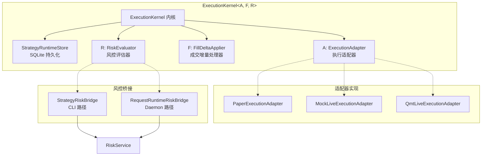
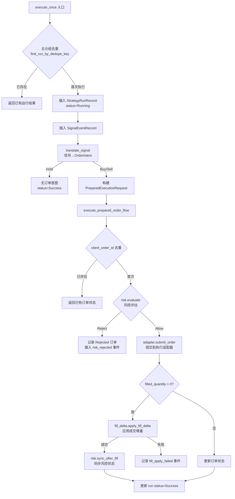
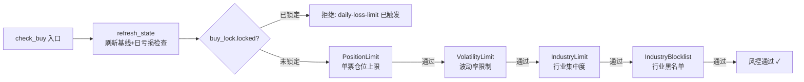
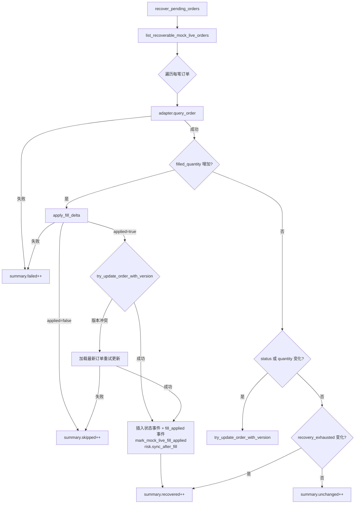

**ExecutionKernel** 是 quantix-rust 交易系统的核心执行引擎，负责将策略信号（Buy/Sell/Hold）安全地转化为订单，并在此过程中执行风控评估、成交增量处理和状态持久化。它采用三层泛型参数化架构 `ExecutionKernel<A, F, R>`，分别注入执行适配器（Adapter）、成交增量处理器（FillDeltaApplier）和风控评估器（RiskEvaluator），实现了执行逻辑与具体适配策略的彻底解耦。

## 架构概览：三层泛型参数化设计

ExecutionKernel 的核心设计哲学是**通过 trait 约束实现策略模式的编译期分派**。结构体定义本身只有四个字段，但通过三个泛型参数 `<A, F, R>` 的 trait bound 约束，它能在统一的流程中支持 paper、mock_live、qmt_live 等多种执行模式。

| 泛型参数 | Trait 约束 | 职责 | 默认实现 |
|---|---|---|---|
| `A` | `ExecutionAdapter` | 订单提交、查询、取消 | Paper / MockLive / QmtLive |
| `F` | `FillDeltaApplier` | 增量成交→交易记录映射 | `NoopFillDeltaApplier` |
| `R` | `RiskEvaluator` | 买入前风控评估 + 成交后同步 | `StrategyRiskBridge` / `RequestRuntimeRiskBridge` |

构造时提供两种工厂方法：`new()` 使用 `NoopFillDeltaApplier` 作为默认的成交处理器（适用于立即成交的 paper 模式），`with_fill_delta()` 则允许注入自定义的增量成交逻辑（适用于 mock_live 等异步成交场景）。

Sources: [kernel/mod.rs](src/execution/kernel/mod.rs#L28-L61), [kernel/traits.rs](src/execution/kernel/traits.rs#L1-L19), [kernel/noop.rs](src/execution/kernel/noop.rs#L1-L22)

## 执行生命周期全流程

ExecutionKernel 提供两个公开入口方法，对应两种不同的调用场景：

| 入口方法 | 调用场景 | 信号来源 | 去重策略 |
|---|---|---|---|
| `execute_once()` | 策略运行时即时执行 | `SignalEnvelope` + `ExecutionRunRequest` | 按 `(strategy, mode, symbol, timeframe, bar_end)` 五元组去重 |
| `execute_request()` | ExecutionDaemon 消费 pending request | 已解析的 `PreparedExecutionRequest` | 按 `client_order_id` 去重 |

### execute_once 信号驱动路径

**去重机制**是 ExecutionKernel 幂等性的核心保障。`execute_once` 在入库前先通过 `find_run_by_dedupe_key` 查询是否已存在相同 `(strategy_name, mode, symbol, timeframe, bar_end)` 的运行记录，若存在则直接返回已有结果，避免重复下单。而 `execute_prepared_order_flow` 内部又通过 `find_order_by_client_order_id` 进行订单级去重，形成双重保护。

**信号翻译**（`translate_signal`）将策略信号转化为具体的 `OrderIntent`：Buy 信号按 `fixed_cash_per_buy / market_price` 计算整手数量（100 股为单位），并加上滑点（`slippage_bps` 个基点）；Sell 信号以当前持仓量作为卖出数量，同样应用滑点。Hold 信号直接返回 `None`，不产生订单。

Sources: [kernel/execute.rs](src/execution/kernel/execute.rs#L9-L141), [kernel/mod.rs](src/execution/kernel/mod.rs#L69-L323), [execution/models.rs](src/execution/models.rs#L409-L493)

### execute_prepared_order_flow 核心编排

这是整个执行引擎的**原子操作单元**，任何入口最终都汇入此方法。其核心流程分为三个阶段：

**阶段一：订单去重检查**。通过 `store.find_order_by_client_order_id` 查询是否已存在相同 client_order_id 的订单，若存在则直接返回该订单的当前状态，保证同一笔交易不会被重复提交。

**阶段二：风控评估**。调用 `risk.evaluate(intent)` 对买入意图进行评估。注意风控仅拦截 **Buy 方向**，Sell 方向在所有已知实现中均直接返回 `RiskDecision::Allow`。风控拒绝时，系统仍会创建一条 `OrderStatus::Rejected` 的订单记录和一条 `risk_rejected` 事件，确保审计链完整。

**阶段三：适配器提交与成交处理**。风控通过后，创建 `OrderStatus::PendingSubmit` 订单并插入 `pending_submit` 事件，然后调用 `adapter.submit_order()` 提交。根据返回的 `filled_quantity` 分两条路径：
- **有成交**（`filled_quantity > 0`）：调用 `fill_delta.apply_fill_delta()` 将成交增量映射为交易记录，成功后触发 `risk.sync_after_fill()` 同步风控状态，更新订单状态和事件链
- **无成交**（如 Accepted）：仅更新订单状态，不触发 fill_delta 和风控同步

| 事件类型 | 触发条件 | 记录内容 |
|---|---|---|
| `pending_submit` | 订单入库 | 空载荷 |
| `risk_rejected` | 风控拒绝 | `{"reason": "..."}` |
| `{status}` | 适配器返回状态 | `filled_quantity`, `avg_fill_price` |
| `fill_applied` | 成交增量成功 | `delta_quantity`, `trade_record_id`, `fill_details` |
| `fill_apply_failed` | 成交增量失败 | `error`, `proposed_status`, `proposed_filled_quantity` |

Sources: [kernel/mod.rs](src/execution/kernel/mod.rs#L69-L323), [kernel/helpers.rs](src/execution/kernel/helpers.rs#L1-L22)

## 风控评估体系

### RiskEvaluator Trait 桥接模式

`RiskEvaluator` trait 定义了两个异步方法——`evaluate` 和 `sync_after_fill`——形成风控系统与执行引擎之间的桥梁。系统中有两个桥接实现：

| 桥接实现 | 所属模块 | 使用场景 | 风控服务获取方式 |
|---|---|---|---|
| `StrategyRiskBridge` | CLI handlers | `strategy run --mode paper` | 直接持有 `RiskService` |
| `RequestRuntimeRiskBridge` | ExecutionDaemon | ExecutionDaemon 消费请求 | 通过 `RuntimeJsonRiskServices.buy_checks()` 延迟初始化 |

两个桥接实现的 `evaluate` 方法遵循相同的核心逻辑：

1. **Sell 放行**：`OrderSide::Sell` 直接返回 `RiskDecision::Allow`
2. **账户快照构建**：从 `PaperTradeStore` 加载账户，计算持仓市值和总资产，构建 `RiskAccountSnapshot`
3. **投影计算**：基于当前持仓和订单请求，计算 `ProjectedBuyImpact`（预计持仓市值和预计总资产）
4. **委托评估**：调用 `RiskService.check_buy()` 执行多规则链式评估
5. **结果映射**：`Ok(())` → `Allow`，`Err(QuantixError::Other(reason))` → `Reject { reason }`

`sync_after_fill` 方法则从交易存储重新加载账户快照，调用 `RiskService.sync_after_trade_snapshot()` 将最新的持仓和盈亏状态同步到风控引擎。

Sources: [kernel/traits.rs](src/execution/kernel/traits.rs#L8-L13), [cli/handlers/mod.rs](src/cli/handlers/mod.rs#L555-L589), [execution/daemon.rs](src/execution/daemon.rs#L89-L138)

### RiskService 多规则链式评估

`RiskService<Store>` 是风控规则的核心执行引擎。`check_buy` 方法在买入前按顺序评估以下规则链：

| 规则类型 | 值类型 | 评估逻辑 | 拒绝条件 |
|---|---|---|---|
| **DailyLossLimit** | `Percentage` 或 `Amount` | 当前总资产 vs 日初基线 | 日亏损超过阈值 → 触发 `buy_lock` |
| **PositionLimit** | `Percentage` | 预计持仓市值 / 预计总资产 | 单票占比超过设定百分比 |
| **VolatilityLimit** | `Percentage` | 目标股票历史波动率 | 波动率超过阈值（需加载 K 线数据） |
| **IndustryLimit** | `Percentage` | 同行业持仓市值 / 预计总资产 | 行业集中度超过阈值（需行业解析器） |
| **IndustryBlocklist** | `TextList` | 目标股票所属行业 | 行业在黑名单中（需行业解析器） |

**日亏损锁**（`DailyLossLimit`）是唯一具有持久副作用的规则——触发后会设置 `BuyLockState`，后续所有买入请求在当日都会被直接拦截，除非通过 `release_buy_lock` 手动释放或跨交易日自动重置。日切检测在 `refresh_state` 中完成：当 `daily_baseline.trading_date` 与当前日期不一致时，自动重置基线和买入锁。

Sources: [risk/service.rs](src/risk/service.rs#L233-L284), [risk/service.rs](src/risk/service.rs#L400-L441), [risk/service/state_helpers.rs](src/risk/service/state_helpers.rs#L3-L90), [risk/service/industry_checks.rs](src/risk/service/industry_checks.rs#L1-L178)

## 成交增量处理与 FillDeltaApplier

### 增量成交模型

在 mock_live 和 qmt_live 模式下，订单成交不是即时的——适配器可能返回部分成交（`PartiallyFilled`）或仅确认接收（`Accepted`）。`FillDeltaApplier` trait 负责将**新旧成交数量的差值**映射为实际的交易记录。

`FillDeltaContext` 携带完整的增量信息：

| 字段 | 含义 |
|---|---|
| `old_filled_quantity` | 之前已成交数量 |
| `new_filled_quantity` | 当前已成交数量 |
| `fill_details` | 成交明细（fill_id, fill_price, fill_quantity, commission 等） |
| `event_time` | 事件时间戳 |

`FillDeltaResult` 返回三个关键字段：`applied`（是否成功应用）、`delta_quantity`（增量数量）、`trade_record_id`（对应的交易记录 ID）。

### NoopFillDeltaApplier 与生产级实现

`NoopFillDeltaApplier` 是最简实现——它仅计算 `new_filled_quantity - old_filled_quantity`，不实际创建交易记录。适用于 paper 模式（PaperExecutionAdapter 内部已自行处理交易记录）。

生产级实现（如 `RequestFillDeltaBridge` 和 `StrategyRiskBridge` 中的 `FillDeltaApplier`）则执行实质操作：
1. 校验 `fill_details` 必须存在
2. 将成交价格和数量转换为 `TradeOrderRequest`
3. 调用 `TradeService.buy()` 或 `TradeService.sell()` 创建交易记录
4. 返回包含 `trade_record_id` 的结果

**失败处理**是设计中至关重要的部分。当 `apply_fill_delta` 返回错误时，ExecutionKernel 会记录 `fill_apply_failed` 事件（包含提议的状态和错误信息），将运行标记为 `Failed`，并将错误向上传播。这确保了成交失败的订单不会静默丢失。

Sources: [kernel/traits.rs](src/execution/kernel/traits.rs#L15-L18), [kernel/noop.rs](src/execution/kernel/noop.rs#L1-L22), [execution/daemon.rs](src/execution/daemon.rs#L36-L87), [execution/models.rs](src/execution/models.rs#L323-L341)

## 订单恢复机制

`recover_pending_orders` 方法是 ExecutionKernel 为异步成交场景提供的**状态修复能力**。它扫描所有可恢复的 mock_live 订单，通过与适配器 `query_order` 查询最新状态，识别并修复本地状态与实际状态的偏差。

恢复流程的关键设计要点：

**乐观锁版本控制**：所有订单更新都通过 `try_update_order_with_version` 执行，该方法在 SQL 层面使用 `WHERE version = ?` 条件，确保并发场景下只有一个更新能成功。若首次更新因版本冲突失败，系统会重新加载最新版本的订单并再次尝试。

**MockLive 状态追踪**：恢复完成后调用 `mark_mock_live_fill_applied`，更新 `MockLiveOrderState.last_applied_fill_id`，避免同一笔成交被重复应用。此方法通过 `fill_details.fill_id` 与 `state.last_applied_fill_id` 的比较实现幂等。

**RecoverySummary 统计**：恢复过程返回精确的统计信息，包含 `scanned`（扫描数）、`recovered`（恢复数）、`unchanged`（无变化数）、`failed`（失败数）和 `skipped`（跳过数），便于监控和告警。

Sources: [kernel/recovery.rs](src/execution/kernel/recovery.rs#L1-L322), [kernel/mod.rs](src/execution/kernel/mod.rs#L325-L347)

## Daemon 模式下的多适配器分发

ExecutionDaemon 通过 `execute_request_by_id_with_components` 函数，根据请求的 `target_mode` 字段动态选择适配器，组装对应的 ExecutionKernel 实例：

| target_mode | 适配器 | FillDelta 处理 | 说明 |
|---|---|---|---|
| `paper` | `PaperExecutionAdapter` | `NoopFillDeltaApplier` | 即时成交，适配器内部处理交易 |
| `mock_live` | `MockLiveExecutionAdapter` | `RequestFillDeltaBridge` | 异步成交，需外部增量处理 |
| `qmt_live` | `QmtLiveExecutionAdapter` | `NoopFillDeltaApplier` | 真实 QMT 桥接提交 |
| `live` | — | — | 未实现，返回 `QuantixError::Unsupported` |

Daemon 模式下的请求状态流转遵循 `Pending → InProgress → Completed/Failed`，使用 `try_start_execution_request`、`try_complete_execution_request`、`try_fail_execution_request` 实现乐观锁状态转换，确保同一请求不会被多个 daemon 实例同时处理。

Sources: [execution/daemon.rs](src/execution/daemon.rs#L185-L310), [execution/daemon/helpers.rs](src/execution/daemon/helpers.rs#L1-L237)

## 关键数据类型速查

| 类型 | 用途 | 核心字段 |
|---|---|---|
| `ExecutionRunRequest` | 策略运行入口请求 | `run_id`, `strategy_name`, `mode`, `policy`, `client_order_id` |
| `PreparedExecutionRequest` | 已解析的执行请求 | `signal`, `intent: OrderIntent`, `client_order_id` |
| `OrderIntent` | 交易意图（风控评估对象） | `symbol`, `side`, `requested_quantity`, `requested_price`, `order_type` |
| `RiskDecision` | 风控决策结果 | `Allow` 或 `Reject { reason }` |
| `KernelExecutionResult` | 执行结果 | `run_id`, `signal`, `order_status`, `client_order_id` |
| `OrderRecord` | 订单持久化记录 | 含 `version`（乐观锁）、`adapter`、`filled_quantity`、`remaining_quantity` |
| `RecoverySummary` | 恢复统计 | `scanned`, `recovered`, `unchanged`, `failed`, `skipped` |

Sources: [kernel/types.rs](src/execution/kernel/types.rs#L1-L58), [execution/models.rs](src/execution/models.rs#L256-L351)

## 延伸阅读

- **执行适配器的具体实现细节**：参见 [Paper/MockLive 执行适配器与运行时状态持久化](13-paper-mocklive-zhi-xing-gua-pei-qi-yu-yun-xing-shi-zhuang-tai-chi-jiu-hua)
- **对账与未知状态恢复的完整流程**：参见 [订单对账、未知状态恢复与 Daemon 守护进程](14-ding-dan-dui-zhang-wei-zhi-zhuang-tai-hui-fu-yu-daemon-shou-hu-jin-cheng)
- **风控规则体系的详细配置与评估逻辑**：参见 [风控规则体系（持仓/亏损/波动率/行业集中度）](18-feng-kong-gui-ze-ti-xi-chi-cang-yu-sun-bo-dong-lu-xing-ye-ji-zhong-du)