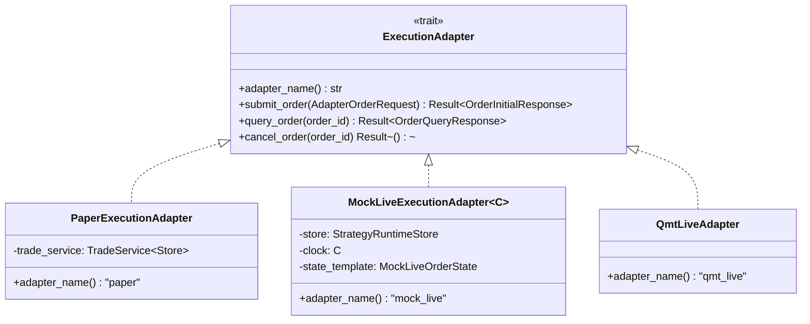
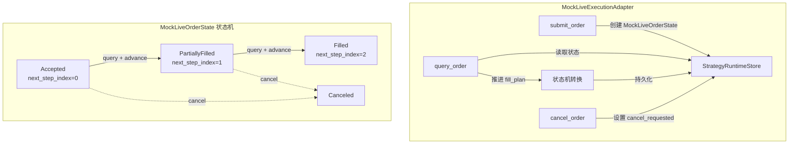
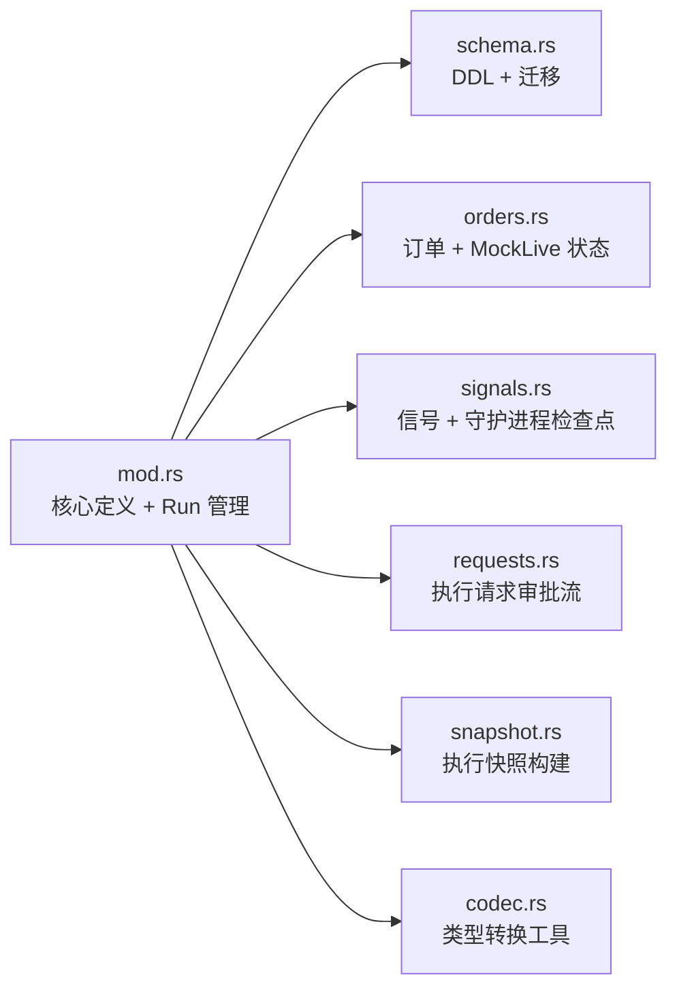
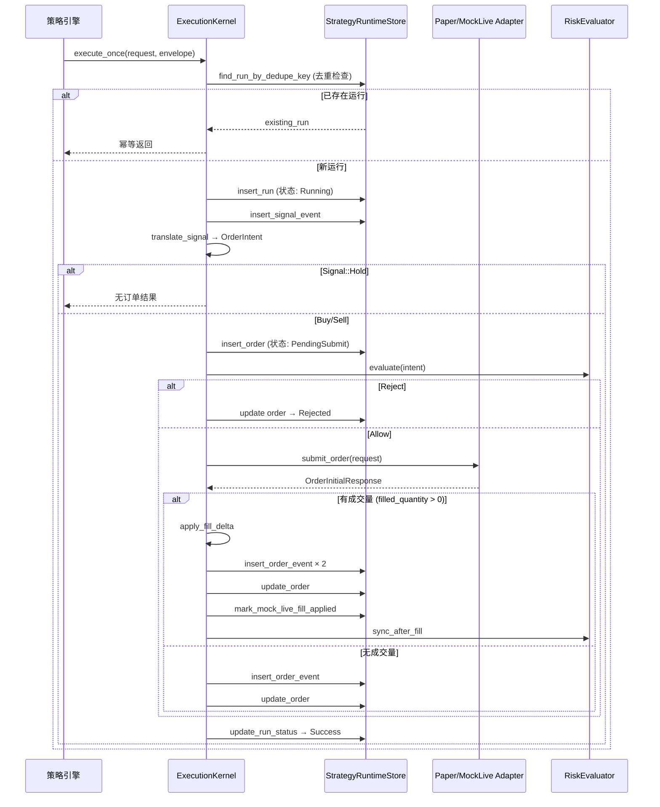

本文档深入解析 Quantix 执行引擎中两种核心模拟适配器——**PaperExecutionAdapter** 与 **MockLiveExecutionAdapter**——的设计原理、状态机模型以及它们共享的 **StrategyRuntimeStore** 持久化层。这两种适配器分别服务于"即时成交模拟"和"多步骤异步成交仿真"两种截然不同的交易验证场景，共同构成了从策略信号到实际券商委托之间的桥梁。

Sources: [adapter.rs](src/execution/adapter.rs#L1-L64), [paper.rs](src/execution/paper.rs#L1-L127), [mock_live.rs](src/execution/mock_live.rs#L1-L456), [runtime_store/mod.rs](src/execution/runtime_store/mod.rs#L1-L476)

## ExecutionAdapter 统一抽象

整个适配器体系建立在 `ExecutionAdapter` trait 之上，定义了三种核心操作：提交订单（`submit_order`）、查询订单（`query_order`）和取消订单（`cancel_order`）。所有适配器共享相同的输入输出类型——`AdapterOrderRequest`、`OrderInitialResponse`、`OrderQueryResponse`——使得上层 `ExecutionKernel` 可以在不感知底层实现的前提下自由切换执行后端。



**AdapterOrderRequest** 承载订单的核心字段：`client_order_id`（幂等键）、`symbol`、`side`（Buy/Sell）、`quantity` 和 `price`。**AdapterError** 区分三类故障语义：`Unsupported`（功能不可用）、`Execution`（业务逻辑错误）和 `Network`（网络层异常）。这种分类在 MockLive 的故障注入机制中被精确利用，用于模拟不同类型的真实交易异常。

Sources: [adapter.rs](src/execution/adapter.rs#L7-L63)

## PaperExecutionAdapter：即时成交模拟

PaperExecutionAdapter 是最简单的执行适配器，其设计哲学是**同步、确定性地立即成交**。它不维护独立的订单状态机，而是将所有委托直接委托给 `TradeService<Store>` 的 `buy`/`sell` 方法执行。

### 执行语义

当 `submit_order` 被调用时，Paper 适配器执行以下操作：

1. 将 `AdapterOrderRequest` 转换为 `TradeOrderRequest`（通过 `to_trade_order_request` 辅助函数，其中包含 Decimal→f64 的安全转换）
2. 根据 `OrderSide` 调用 `trade_service.buy()` 或 `trade_service.sell()`
3. 将 TradeService 返回的 `TradeRecord` 映射为 `OrderInitialResponse`，其中状态固定为 **`OrderStatus::Filled`**

关键设计约束：**Paper 适配器的 `query_order` 和 `cancel_order` 均返回 `AdapterError::Unsupported`**。这是因为 Paper 模式下订单在提交瞬间即完成成交，不存在需要查询或取消的中间状态。这明确界定了 Paper 模式的使用边界——它仅适用于"信号验证"场景，不适合测试异步成交逻辑。

### 与 TradeService 的关系

PaperExecutionAdapter 的泛型参数 `Store` 必须实现 `PaperTradeStore` trait。`TradeService<Store>` 负责管理模拟账户的资金、持仓、手续费计算等全部交易账本逻辑。Paper 适配器本质上只是一个薄转换层，将 ExecutionAdapter 的合约映射到 TradeService 的 API 上。

Sources: [paper.rs](src/execution/paper.rs#L11-L127), [trade/service.rs](src/trade/service.rs#L15-L55), [trade/models.rs](src/trade/models.rs#L12-L63)

## MockLiveExecutionAdapter：多步骤异步成交仿真

MockLiveExecutionAdapter 是一个**可编程的、有状态的执行仿真器**，设计用于真实券商委托的端到端测试。与 Paper 的即时成交不同，MockLive 支持分步成交、故障注入和完整的状态持久化。

### 核心架构



MockLive 适配器包含三个核心组件：

- **StrategyRuntimeStore**：SQLite 持久化层，用于存储 `MockLiveOrderState`
- **Clock（泛型 C: MockLiveClock）**：可注入的时钟抽象，测试时可使用 `FixedClock` 固定时间
- **state_template（MockLiveOrderState）**：预设的状态模板，用于初始化每个新订单的模拟行为

Sources: [mock_live.rs](src/execution/mock_live.rs#L1-L456)

### MockLiveOrderState 状态模型

`MockLiveOrderState` 是 MockLive 适配器的核心数据结构，采用 `serde` 序列化后以 JSON 形式存储在 SQLite 的 `mock_live_orders` 表中。其字段设计精确地覆盖了异步成交仿真的全部需求：

| 字段 | 类型 | 用途 |
|------|------|------|
| `fill_plan` | `Vec<MockLiveFillStep>` | 分步成交计划，每步指定数量和延迟 |
| `next_step_index` | `usize` | 当前推进到的成交步骤索引 |
| `simulated_fill_price` | `Option<Decimal>` | 模拟成交价（未设置时从 orders 表加载） |
| `planned_fill_time` | `Option<DateTime<Utc>>` | 计划成交时间 |
| `fault_injection` | `Option<MockLiveFaultInjection>` | 故障注入配置 |
| `unknown_retries` | `u32` | Unknown 状态重试计数 |
| `recovery_exhausted` | `bool` | 恢复预算是否耗尽 |
| `cancel_requested` | `bool` | 是否已请求取消 |
| `last_applied_fill_id` | `u64` | 上一个已被 kernel 确认的 fill ID |
| `query_script_index` | `usize` | query_script 当前执行位置 |
| `query_script_fill_started` | `bool` | query_script 中 fill 步骤是否已启动 |

`MockLiveFillStep` 定义了每步成交的 `quantity`（数量）和 `delay_secs`（延迟秒数），`MockLiveFaultInjection` 则支持多种故障模式（详见下文）。

Sources: [models/mock_live.rs](src/execution/models/mock_live.rs#L1-L67)

### Fill Plan 机制

MockLive 通过 **fill_plan** 实现多步骤成交模拟。当 `query_order` 被调用时，适配器检查 `next_step_index` 与 `fill_plan` 的关系：

- `next_step_index == 0` → 返回 **Accepted**（尚未开始成交）
- `0 < next_step_index < fill_plan.len()` → 返回 **PartiallyFilled**（部分成交）
- `next_step_index >= fill_plan.len()` → 返回 **Filled**（全部成交）

每次 `query_order` 调用（在非故障注入模式下）自动推进 `next_step_index += 1`，实现状态的单向递进。累计成交数量通过 `cumulative_filled_quantity` 计算：对 `fill_plan` 前 `next_step_index` 个步骤的 `quantity` 求和。

**last_applied_fill_id** 字段实现了"未确认 fill"的检测机制：当 `last_applied_fill_id < next_step_index` 时，表示有新的成交步骤尚未被上层 `ExecutionKernel` 处理，`build_response` 会附带 `FillDetails`。这确保了 kernel 的恢复逻辑能够正确捕获增量成交。

Sources: [mock_live.rs](src/execution/mock_live.rs#L53-L174)

### 故障注入体系

MockLive 提供了一套完整的故障注入框架，用于模拟真实交易中可能遇到的各种异常状况：

| 故障模式 | 行为 | 清除策略 |
|----------|------|----------|
| `unknown_once` | 返回一次 `Unknown` 状态 | 单次触发后自动清除 |
| `unknown_always` | 始终返回 `Unknown` 状态 | 不清除，直到 `unknown_retries > 3` 触发 `recovery_exhausted` |
| `network_timeout` | 等待指定秒数后返回 `Network` 错误 | 单次触发后自动清除 |
| `network_disconnect` | 立即返回 `Network` 错误 | 单次触发后自动清除 |
| `delayed_response:<secs>` | 延迟指定秒数后正常返回 | 单次触发后自动清除 |
| `simulated_rejection:<reason>` | 返回 `Rejected` 状态附带原因 | 单次触发后自动清除 |
| `query_script:` 序列 | 按逗号分隔的状态序列逐步返回 | 全部执行完毕后清除 |

**recovery_exhausted** 机制是 Unknown 状态持续场景的安全阀：当 `unknown_retries > 3` 时，设置 `recovery_exhausted = true` 并附带 `exhausted_reason = "unknown_retry_budget_exceeded"`。ExecutionKernel 的 `recover_pending_orders` 方法检测到此状态变化时会记录 `recovery_exhausted` 事件，确保异常订单不会被无限轮询。

**query_script** 是最复杂的故障注入模式，它允许通过字符串配置一系列 `query_order` 返回值。例如 `"accepted,partially_filled,filled"` 表示第一次查询返回 Accepted、第二次返回 PartiallyFilled、第三次返回 Filled。每个 fill 类型状态需要两次查询才能推进：第一次启动 fill，第二次确认 fill 完成（通过 `query_script_fill_started` 标志位控制）。

Sources: [mock_live.rs](src/execution/mock_live.rs#L116-L265), [models/mock_live.rs](src/execution/models/mock_live.rs#L13-L36)

### Clock 抽象

```rust
pub trait MockLiveClock: Clone + Send + Sync {
    fn now(&self) -> DateTime<Utc>;
}
```

`MockLiveClock` trait 抽象了时间获取，使得 `planned_fill_time` 字段在测试中可被精确控制。生产代码使用 `SystemMockLiveClock`（直接委托给 `Utc::now()`），测试代码可注入 `FixedClock` 返回预设时间戳。这是一个典型的"函数式依赖注入"模式，通过泛型参数而非 trait object 实现，避免了运行时开销。

Sources: [mock_live.rs](src/execution/mock_live.rs#L13-L24)

## StrategyRuntimeStore：运行时状态持久化层

`StrategyRuntimeStore` 是执行引擎的**统一 SQLite 持久化后端**，为 Paper 和 MockLive 模式提供运行时数据存储。它使用 `sqlx::SqlitePool`（单连接池）确保 SQLite 的写入串行化，并在构造时自动创建目录结构和数据库 schema。

### Schema 架构

数据库 schema 包含 **10 张核心表和 12 个索引**，通过 `ensure_schema()` 方法在首次连接时自动创建：

| 表名 | 用途 | 关键索引 |
|------|------|----------|
| `strategy_runs` | 策略运行记录 | `idx_strategy_runs_dedupe`（去重唯一索引） |
| `signal_events` | 信号事件日志 | `idx_signal_events_run_id`, `idx_signal_events_symbol_ts` |
| `orders` | 订单记录 | `idx_orders_run_id`, `idx_orders_symbol_status` |
| `order_events` | 订单状态变更事件 | `idx_order_events_order_id`, `idx_order_events_client_time` |
| `mock_live_orders` | MockLive 适配器私有状态 | 主键 `order_id` |
| `runner_checkpoints` | 运行器检查点 | `idx_runner_checkpoints_stream`（唯一索引） |
| `signals` | 策略信号记录 | `idx_signals_stream_bar`（唯一索引）, 审批索引 |
| `execution_requests` | 执行请求（审批流） | `idx_execution_requests_status`, `idx_execution_requests_target_status` |
| `strategy_daemon_checkpoints` | 策略守护进程检查点 | `idx_strategy_daemon_checkpoints_stream`（唯一索引） |

**schema 演进机制**采用 `ensure_column_exists` 辅助方法，通过 `PRAGMA table_info` 检查列是否存在，按需执行 `ALTER TABLE ADD COLUMN`。目前已有的扩展包括 `remaining_quantity`、`last_transition_at`、`version` 三列，并附带数据回填逻辑。

Sources: [runtime_store/schema.rs](src/execution/runtime_store/schema.rs#L1-L322), [runtime_store/mod.rs](src/execution/runtime_store/mod.rs#L29-L53)

### 模块化拆分

StrategyRuntimeStore 的实现按职责拆分为六个子模块：



- **orders.rs**：提供订单 CRUD、`mock_live_orders` 状态读写、带版本号的乐观并发更新（`try_update_order_with_version`）、可恢复订单查询（`list_recoverable_mock_live_orders`）
- **signals.rs**：信号记录管理、守护进程检查点的 UPSERT 操作
- **requests.rs**：信号审批流的原子事务——`approve_signal_and_create_request` 在单个事务中完成信号状态更新和执行请求创建
- **snapshot.rs**：从信号记录构建执行快照，解析 `execution_policy` 并调用 `translate_signal` 生成 `OrderIntent`
- **codec.rs**：提供 RFC3339 时间戳解析、Decimal 解析、Signal 值映射等底层工具函数

Sources: [runtime_store/orders.rs](src/execution/runtime_store/orders.rs#L1-L462), [runtime_store/signals.rs](src/execution/runtime_store/signals.rs#L1-L248), [runtime_store/requests.rs](src/execution/runtime_store/requests.rs#L1-L200), [runtime_store/snapshot.rs](src/execution/runtime_store/snapshot.rs#L1-L103), [runtime_store/codec.rs](src/execution/runtime_store/codec.rs#L1-L26)

### 乐观并发控制

订单更新采用**版本号乐观锁**机制。`try_update_order_with_version` 在 WHERE 子句中同时匹配 `order_id` 和 `version`，仅当版本号一致时才执行更新并将 `version + 1`。返回 `bool` 指示更新是否成功。这一机制在 `recover_pending_orders` 的并发恢复场景中至关重要——即使多个恢复进程同时运行，也只有一个能成功更新订单状态。

Sources: [runtime_store/orders.rs](src/execution/runtime_store/orders.rs#L292-L327)

## 适配器与 ExecutionKernel 的协作

两种适配器通过 `ExecutionKernel<A, F, R>` 与上层策略系统衔接。Kernel 是一个三层泛型结构：`A`（ExecutionAdapter）、`F`（FillDeltaApplier）和 `R`（RiskEvaluator）。

### 执行流程



### Paper vs MockLive 在 Kernel 中的行为差异

| 维度 | Paper | MockLive |
|------|-------|----------|
| submit_order 返回 | 立即 Filled，含完整 fill_details | 立即 Accepted，filled_quantity=0 |
| 后续 query_order | 不支持 | 多次查询推进 fill_plan |
| 持久化需求 | 无（TradeService 自行管理） | mock_live_orders 表存储私有状态 |
| recovery 适用性 | 不适用 | 完整支持 |
| FillDeltaApplier | NoopFillDeltaApplier | 需要真实实现以同步持仓 |

在 Paper 模式下，`submit_order` 返回时即包含非零 `filled_quantity`，Kernel 立即走完成交处理路径。在 MockLive 模式下，`submit_order` 仅返回 `Accepted` 状态，需要 `recover_pending_orders` 通过周期性调用 `query_order` 来推进状态——这正是 MockLive 设计的核心目标：模拟真实券商的异步回报机制。

Sources: [kernel/mod.rs](src/execution/kernel/mod.rs#L28-L347), [kernel/execute.rs](src/execution/kernel/execute.rs#L1-L142), [kernel/recovery.rs](src/execution/kernel/recovery.rs#L1-L322)

## NoopFillDeltaApplier 与 FillDelta 处理

`NoopFillDeltaApplier` 是 Paper/MockLive 适配器的默认 fill 处理器。它仅计算增量数量（`new_filled_quantity - old_filled_quantity`），不产生交易记录（`trade_record_id: None`）。这使得 Paper 模式可以在不依赖完整交易基础设施的情况下运行。

当 MockLive 模式需要与真实持仓同步时，应使用 `ExecutionKernel::with_fill_delta` 注入真正的 `FillDeltaApplier` 实现，将成交增量写入交易账本。

Sources: [kernel/noop.rs](src/execution/kernel/noop.rs#L1-L22), [kernel/traits.rs](src/execution/kernel/traits.rs#L1-L18)

## 适配器选型指南

| 场景 | 推荐适配器 | 原因 |
|------|-----------|------|
| 策略信号快速验证 | Paper | 即时成交、无额外依赖 |
| 手续费/滑点影响评估 | Paper | TradeService 内置手续费计算 |
| 异步回报流程测试 | MockLive | 模拟多步骤成交 |
| 恢复逻辑端到端验证 | MockLive | 支持 recover_pending_orders |
| 网络异常模拟 | MockLive | 完整故障注入框架 |
| Unknown 状态恢复预算测试 | MockLive | unknown_always + recovery_exhausted |
| 真实券商委托 | QmtLive | 通过 QMT Bridge 对接实盘 |

Paper 模式定位为**轻量级策略验证工具**，适合在策略开发阶段快速迭代。MockLive 模式定位为**执行基础设施的集成测试平台**，其故障注入能力使开发者能在受控环境中验证 Kernel 的恢复逻辑、版本冲突处理和事件记录完整性。

Sources: [adapter.rs](src/execution/adapter.rs#L48-L63), [paper.rs](src/execution/paper.rs#L25-L110), [mock_live.rs](src/execution/mock_live.rs#L267-L456)

## 延伸阅读

- 适配器的上层调用者——[ExecutionKernel 执行生命周期与风控评估](12-executionkernel-zhi-xing-sheng-ming-zhou-qi-yu-feng-kong-ping-gu)
- 异步订单的恢复机制——[订单对账、未知状态恢复与 Daemon 守护进程](14-ding-dan-dui-zhang-wei-zhi-zhuang-tai-hui-fu-yu-daemon-shou-hu-jin-cheng)
- Paper 模式的账户与持仓管理——[多账户管理、账户组与智能订单路由](20-duo-zhang-hu-guan-li-zhang-hu-zu-yu-zhi-neng-ding-dan-lu-you)