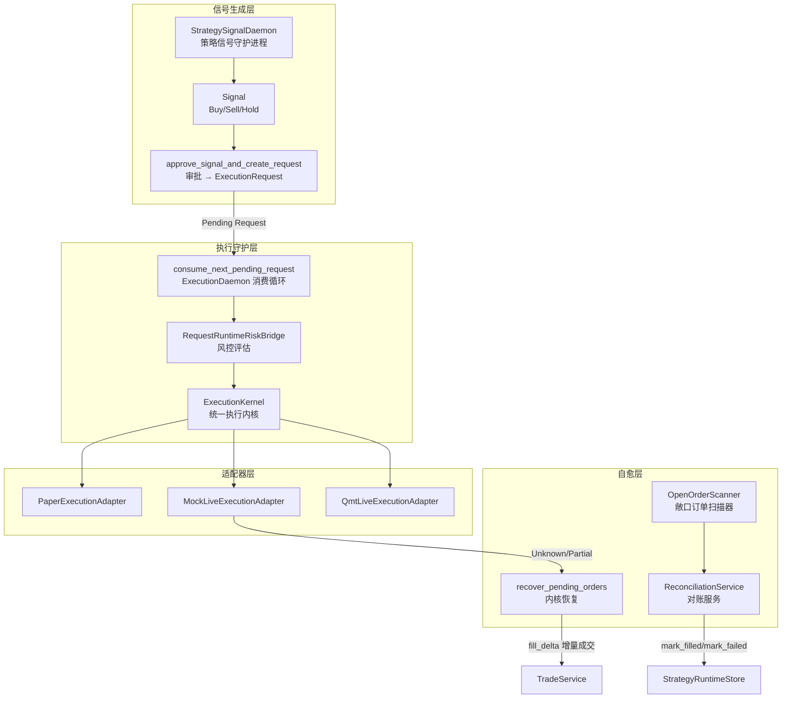
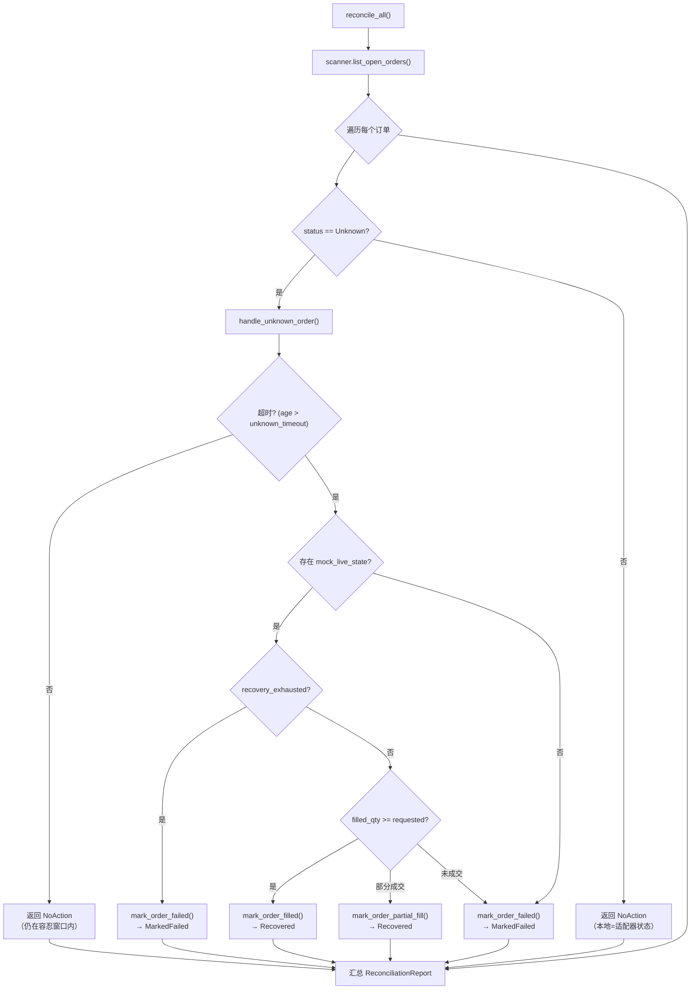
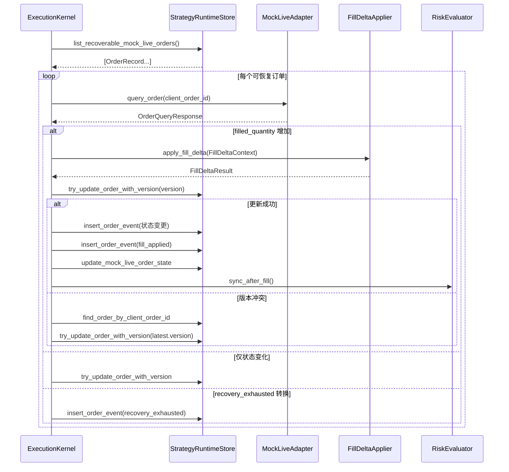
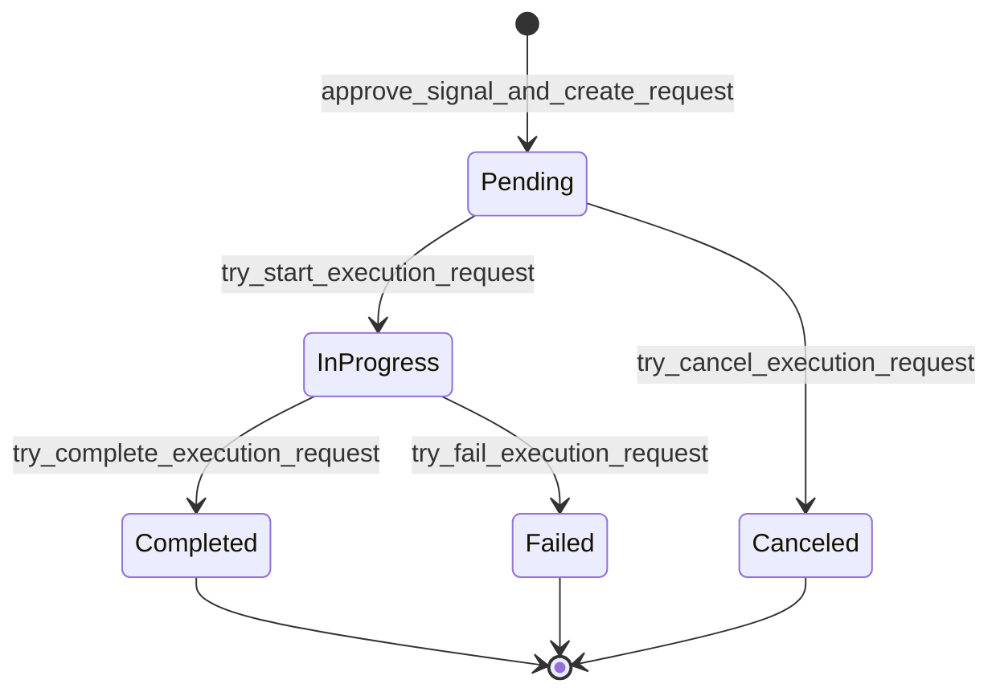

本页深入解析 Quantix 执行系统的三大可靠性保障子系统：**订单对账**（Reconciliation）负责扫描与修复本地订单状态与适配器实际状态之间的差异；**未知状态恢复**（Unknown State Recovery）在 `mock_live` 模式下通过增量成交重放确保订单最终一致性；**Execution Daemon 守护进程**以轮询方式持续消费待审批执行请求，将其分派至对应的执行适配器完成闭环。三者协同构成从信号生成到成交确认的全链路自愈能力。

Sources: [reconciliation.rs](src/execution/reconciliation.rs#L1-L12), [recovery.rs](src/execution/kernel/recovery.rs#L1-L11), [daemon.rs](src/execution/daemon.rs#L1-L26)

---

## 架构总览：三层自愈体系

在理解各子系统细节之前，先从宏观视角审视三个模块在整个执行管线中的定位与协作关系。**StrategySignalDaemon** 负责策略信号生成与审批，**ExecutionDaemon** 负责将已审批的请求路由至适配器执行，而 **ReconciliationService** 与 **ExecutionKernel::recover_pending_orders** 则在事后进行状态校验与修复。



三层之间的关键数据流为：StrategySignalDaemon 通过 `record_daemon_signal_run` 将信号写入 `signals` 表，经审批后生成 `execution_requests` 记录；ExecutionDaemon 轮询 `find_next_pending_execution_request` 消费 Pending 请求，将其路由至 `ExecutionKernel`；Kernel 执行后若订单进入非终态（Accepted/PartiallyFilled/Unknown），ReconciliationService 与 `recover_pending_orders` 将在后续扫描周期中尝试修复。

Sources: [daemon.rs](src/execution/daemon.rs#L140-L183), [strategy/daemon.rs](src/strategy/daemon.rs#L71-L200), [reconciliation.rs](src/execution/reconciliation.rs#L218-L284)

---

## 订单状态机与对账模型

### OrderStatus 完整枚举

订单状态是整个对账与恢复机制的核心数据模型。系统定义了 9 种订单状态，分为**活跃态**（可被扫描恢复）和**终态**（不再变更）两类：

| 状态 | 字符串值 | 类别 | 说明 |
|------|----------|------|------|
| `PendingSubmit` | `pending_submit` | 活跃态 | 已创建尚未提交至适配器 |
| `Submitted` | `submitted` | 活跃态 | 已提交等待券商确认 |
| `Accepted` | `accepted` | 活跃态 | 券商已接受，等待成交 |
| `PartiallyFilled` | `partially_filled` | 活跃态 | 部分成交 |
| `PendingCancel` | `pending_cancel` | 活跃态 | 撤单请求已发出 |
| `Unknown` | `unknown` | 活跃态 | 状态不确定，需恢复 |
| `Filled` | `filled` | 终态 | 完全成交 |
| `Canceled` | `canceled` | 终态 | 已撤销 |
| `Rejected` | `rejected` | 终态 | 已拒绝 |

`list_open_orders` 方法通过 SQL 过滤所有非终态订单（`WHERE status NOT IN ('filled', 'canceled', 'rejected')`），而 `list_recoverable_mock_live_orders` 进一步通过 INNER JOIN `mock_live_orders` 表筛选具有模拟状态且处于 Submitted/Accepted/PartiallyFilled/Unknown/PendingCancel 状态的订单。

Sources: [models.rs](src/execution/models.rs#L41-L83), [orders.rs](src/execution/runtime_store/orders.rs#L425-L461), [orders.rs](src/execution/runtime_store/orders.rs#L231-L268)

### ReconciliationAction 对账动作枚举

对账过程中针对每个订单可采取六种动作，从"无需操作"到"需要人工介入"覆盖了完整的修复光谱：

| 动作 | 触发条件 | 效果 |
|------|----------|------|
| `NoAction` | 本地状态与适配器状态一致 | 无变更 |
| `StateUpdated` | 状态不一致但可修复 | 本地状态更新至匹配适配器 |
| `Recovered` | Unknown 订单从 mock_live 状态恢复 | 更新为 Filled/PartiallyFilled |
| `MarkedFailed` | 超时且恢复耗尽或无恢复源 | 标记为 Rejected |
| `Cancelled` | 严重不一致需撤单 | 取消订单 |
| `ManualIntervention` | 无法自动处理 | 留待人工检查 |

Sources: [reconciliation.rs](src/execution/reconciliation.rs#L62-L102)

---

## ReconciliationService 对账服务详解

### OpenOrderScanner：敞口订单扫描器

**OpenOrderScanner** 是对账服务的数据采集层，负责从 `StrategyRuntimeStore` 中检索需要关注的订单。它维护两个关键阈值参数：`stale_order_threshold_seconds`（默认 3600 秒 = 1 小时）判断订单是否过期，`unknown_timeout_seconds`（默认 300 秒 = 5 分钟）判断 Unknown 状态是否需要强制恢复。

扫描器提供三个核心查询能力：`list_open_orders` 返回所有非终态订单、`list_unknown_orders` 过滤仅 Unknown 状态的订单、`list_stale_orders` 筛选超过过期阈值的订单。此外，`get_open_order_summary` 方法汇总生成包含各状态计数、过期数和未知数的统计快照，便于运维监控。

Sources: [reconciliation.rs](src/execution/reconciliation.rs#L104-L199)

### reconcile_all：全量对账流程

`reconcile_all` 方法执行完整的对账周期，其核心流程如下：



关键设计点在于 **Unknown 状态的双层判断**：首先检查是否超过超时窗口（5 分钟），未超时则容忍等待；超时后尝试从 `mock_live_orders` 表获取模拟状态进行恢复，若 `recovery_exhausted` 为 true 则直接标记失败。恢复时根据已成交量与请求量的比较，分别进入完全成交、部分成交或失败三种终态。

Sources: [reconciliation.rs](src/execution/reconciliation.rs#L238-L461)

### ReconciliationReport 与 ReconciliationSummary

每次对账运行产生一个 `ReconciliationReport`，包含汇总统计和逐笔结果两层信息。`ReconciliationSummary` 记录了对账时间、扫描总数、匹配数、不匹配数、恢复数和失败数以及耗时，是运维告警的关键数据源。

Sources: [reconciliation.rs](src/execution/reconciliation.rs#L22-L39), [reconciliation.rs](src/execution/reconciliation.rs#L464-L471)

---

## 未知状态恢复：ExecutionKernel 的 recover_pending_orders

### 恢复机制与 ReconciliationService 的区别

虽然两者都处理订单状态修复，但它们的职责范围和实现路径存在本质区别：

| 维度 | ReconciliationService | recover_pending_orders |
|------|----------------------|----------------------|
| **触发场景** | 通用对账，处理各类状态不一致 | 专门针对 mock_live 适配器的订单恢复 |
| **数据源** | 直接读取 mock_live_order_state | 通过 adapter.query_order() 查询适配器 |
| **成交处理** | 仅更新订单状态 | 完整执行 fill_delta → trade_record 链路 |
| **版本控制** | 无乐观锁 | try_update_order_with_version 乐观锁 |
| **风控同步** | 不触发风控 | 调用 risk.sync_after_fill() |

Sources: [reconciliation.rs](src/execution/reconciliation.rs#L286-L367), [recovery.rs](src/execution/kernel/recovery.rs#L1-L11)

### recover_pending_orders 完整流程

`recover_pending_orders` 是 `ExecutionKernel` 上的方法，实现对 mock_live 模式下非终态订单的**增量恢复**。其核心流程分为四个阶段：

**阶段一：扫描可恢复订单** — 调用 `store.list_recoverable_mock_live_orders()` 获取所有处于 Submitted/Accepted/PartiallyFilled/Unknown/PendingCancel 且拥有 `mock_live_orders` 关联记录的订单。

**阶段二：查询适配器** — 对每个订单调用 `adapter.query_order(&order.client_order_id)`，获取适配器视角的最新状态。若查询失败则计入 `failed` 并跳过。

**阶段三：增量成交应用** — 如果适配器报告的 `filled_quantity` 大于本地记录，则构造 `FillDeltaContext` 并调用 `fill_delta.apply_fill_delta()` 将增量成交写入交易系统。这一步确保交易账户持仓与订单状态保持同步。

**阶段四：乐观锁更新** — 使用 `try_update_order_with_version` 进行带版本号的 CAS 更新，防止并发修改。若首次更新失败（版本冲突），则重新获取最新订单并尝试二次更新。



Sources: [recovery.rs](src/execution/kernel/recovery.rs#L11-L321)

### RecoverySummary 恢复统计

每次恢复运行返回 `RecoverySummary`，包含五个维度的统计：

| 字段 | 含义 |
|------|------|
| `scanned` | 扫描的可恢复订单总数 |
| `recovered` | 成功恢复/更新的订单数 |
| `unchanged` | 状态未发生变化的订单数 |
| `failed` | 查询失败或 fill_delta 应用失败的订单数 |
| `skipped` | 跳过的订单（fill_delta 未应用或版本冲突后仍失败） |

Sources: [types.rs](src/execution/kernel/types.rs#L50-L57)

### MockLiveOrderState 状态模型

`MockLiveOrderState` 是 mock_live 模式下每个订单的扩展状态，存储在 `mock_live_orders` 表的 `state_json` 字段中，承载了远超基础 `OrderRecord` 的恢复上下文信息：

| 字段 | 类型 | 用途 |
|------|------|------|
| `fill_plan` | `Vec<MockLiveFillStep>` | 预设的成交计划（数量+延迟） |
| `next_step_index` | `usize` | 当前执行到 fill_plan 的第几步 |
| `simulated_fill_price` | `Option<Decimal>` | 模拟成交价格 |
| `fault_injection` | `Option<MockLiveFaultInjection>` | 故障注入配置 |
| `last_applied_fill_id` | `u64` | 已应用的最后一次 fill ID（去重） |
| `unknown_retries` | `u32` | Unknown 状态重试次数 |
| `recovery_exhausted` | `bool` | 恢复预算是否耗尽 |
| `exhausted_reason` | `Option<String>` | 耗尽原因 |
| `cancel_requested` | `bool` | 是否已请求撤单 |
| `query_script_index` | `usize` | 查询脚本执行位置 |

Sources: [mock_live.rs](src/execution/models/mock_live.rs#L38-L66)

---

## Execution Daemon 守护进程

### ExecutionDaemonConfig 配置模型

Execution Daemon 的行为由 `ExecutionDaemonConfig` 控制，通过 `JsonExecutionConfigStore` 以 JSON 文件形式持久化（默认路径 `~/.quantix/execution/config.json`）。配置支持热加载——Daemon 每次轮询前检查文件修改时间，若变化则重新加载。

| 配置项 | 默认值 | 说明 |
|--------|--------|------|
| `poll_interval_secs` | 10 | 轮询间隔（秒） |
| `max_requests_per_iteration` | 1 | 每次迭代最多处理的请求数 |
| `auto_approval.mode` | `Manual` | 自动审批模式（Manual/Always） |

`AutoApprovalMode::Always` 模式下，`StrategySignalDaemon` 在生成信号后立即调用 `approve_signal_and_create_request` 创建 Pending 执行请求，无需人工审批即可进入执行队列。

Sources: [config.rs](src/execution/config.rs#L1-L98), [strategy/daemon.rs](src/strategy/daemon.rs#L227-L237)

### consume_next_pending_request：单次消费循环

`consume_next_pending_request_with_components` 是 Daemon 的核心入口函数，实现了一个完整的"取→执行→记录"循环。其执行流程严格遵循请求状态机的转换约束：

**1. 取请求** — 调用 `store.find_next_pending_execution_request()` 获取最早创建的 Pending 状态请求。若无待处理请求，返回空摘要（claimed=0）。

**2. 状态迁移：Pending → InProgress** — 通过 `try_start_execution_request` 进行 CAS 更新，在 payload 中记录执行器类型和启动时间。若状态已变化（并发冲突），返回错误。

**3. 构建执行上下文** — `build_prepared_request_from_execution_request` 从 payload JSON 中解析出 `execution_snapshot`，构造 `PreparedExecutionRequest`（包含 symbol、side、quantity、price、signal 等完整执行参数）。

**4. 路由至适配器** — 根据 `request.target_mode` 字段分派至三种执行路径：

| target_mode | 适配器 | 特殊处理 |
|-------------|--------|----------|
| `paper` | `PaperExecutionAdapter` | 标准执行 |
| `mock_live` | `MockLiveExecutionAdapter` + `RequestFillDeltaBridge` | 带 fill_delta 的增量成交 |
| `qmt_live` | `QmtLiveExecutionAdapter` | 通过 Bridge API 提交 |
| `live` | 不支持 | 返回 Unsupported 错误并提示使用 qmt_live |

**5. 结果记录** — 执行成功则 `try_complete_execution_request`（InProgress → Completed），失败则 `try_fail_execution_request`（InProgress → Failed），均将结果写入 payload_json。

Sources: [daemon.rs](src/execution/daemon.rs#L140-L309)

### 桥接层：RequestFillDeltaBridge 与 RequestRuntimeRiskBridge

Execution Daemon 通过两个桥接结构将执行内核与业务服务连接：

**RequestFillDeltaBridge** 实现了 `FillDeltaApplier` trait，将增量成交通过 `TradeService` 写入交易账户。核心逻辑在 `apply_fill_delta` 中：首先计算 delta（`new_filled - old_filled`），若无增量则跳过；有增量时从 `FillDetails` 构造 `TradeOrderRequest`，根据方向调用 `trade_service.buy()` 或 `trade_service.sell()`，返回包含 trade_record_id 的结果。

**RequestRuntimeRiskBridge** 实现了 `RiskEvaluator` trait，桥接运行时风控评估。`evaluate` 方法仅对买入方向进行风控检查（卖出直接 Allow），调用 `RuntimeJsonRiskServices.buy_checks()` 获取风控服务实例，执行行业黑名单等规则检查。`sync_after_fill` 在每次成交后同步风控状态。

Sources: [daemon.rs](src/execution/daemon.rs#L36-L138), [helpers.rs](src/execution/daemon/helpers.rs#L154-L221)

### ExecutionDaemonIterationSummary 迭代摘要

每次 Daemon 循环产生一个 `ExecutionDaemonIterationSummary`，包含三个核心指标：

| 字段 | 含义 |
|------|------|
| `claimed` | 是否成功获取到请求（0 或 1） |
| `completed` | 执行成功的请求数（0 或 1） |
| `failed` | 执行失败的请求数（0 或 1） |
| `request` | 关联的 ExecutionRequestRecord（可选） |

Sources: [daemon.rs](src/execution/daemon.rs#L27-L33)

---

## 请求状态机：ExecutionRequest 的生命周期

ExecutionRequest 的状态流转是 Daemon 守护进程的核心数据模型。五个状态通过严格的 CAS 转换保证并发安全：



所有状态转换都通过 `try_update_execution_request_status` 方法实现，该方法使用 `WHERE request_id = ? AND request_status = ?` 条件确保只有当前状态匹配时才能更新。返回布尔值表示是否成功获取锁。每个转换都会将扩展信息（执行结果、错误信息、时间戳等）合并至 `payload_json` 中，形成完整的审计轨迹。

Sources: [requests.rs](src/execution/runtime_store/requests.rs#L257-L397), [models.rs](src/execution/models.rs#L137-L167)

---

## 乐观锁与版本控制

订单的并发安全通过 `version` 字段实现乐观锁机制。`OrderRecord` 中的 `version` 字段（`i64` 类型）在每次更新时自增，`try_update_order_with_version` 使用 SQL `WHERE order_id = ? AND version = ?` 条件确保仅在版本匹配时更新：

```sql
UPDATE orders
SET status = ?, filled_quantity = ?, remaining_quantity = ?,
    avg_fill_price = ?, updated_at = ?, last_transition_at = ?,
    version = version + 1
WHERE order_id = ? AND version = ?
```

在 `recover_pending_orders` 中，当首次 CAS 更新失败时，方法会重新获取最新订单记录并使用最新版本号进行二次尝试，确保在高并发场景下仍能完成状态修复。而普通的 `update_order` 方法（无版本检查）则用于对账服务等低并发场景。

Sources: [orders.rs](src/execution/runtime_store/orders.rs#L292-L327), [recovery.rs](src/execution/kernel/recovery.rs#L86-L98)

---

## OrderEventRecord 审计事件

系统通过 `order_events` 表为每个订单维护完整的事件流。每个事件包含 `event_id`、`order_id`、`client_order_id`、`event_type`、`event_time` 和 `details_json` 六个字段。关键事件类型包括：

| 事件类型 | 触发时机 | details_json 内容 |
|----------|----------|-------------------|
| `pending_submit` | 订单创建 | `{}` |
| `risk_rejected` | 风控拒绝 | `{ "reason": "..." }` |
| `submitted`/`accepted`/`filled` 等 | 状态变更 | `{ "filled_quantity": ..., "avg_fill_price": ... }` |
| `fill_applied` | 增量成交写入 | `{ "delta_quantity": ..., "trade_record_id": ..., "fill_details": ... }` |
| `fill_apply_failed` | 增量成交失败 | `{ "error": "...", "proposed_status": ..., "proposed_filled_quantity": ... }` |
| `recovery_exhausted` | Unknown 恢复预算耗尽 | `{ "unknown_retries": ..., "reason": "..." }` |

这些事件构成了完整的操作审计链，支持事后追溯任何订单的状态变迁历史。

Sources: [models.rs](src/execution/models.rs#L343-L351), [kernel/mod.rs](src/execution/kernel/mod.rs#L96-L296)

---

## 测试覆盖与验证策略

三个子系统均具备完善的集成测试覆盖，核心测试场景如下：

### Execution Daemon 测试

| 测试用例 | 验证要点 |
|----------|----------|
| `daemon_run_once_returns_empty_summary_when_no_pending_request_exists` | 无请求时返回空摘要 |
| `daemon_run_once_consumes_one_pending_paper_request` | paper 模式完整执行闭环，验证 trade_record 生成 |
| `daemon_run_once_rejects_pending_request_when_industry_is_blocked` | 行业黑名单风控拦截，验证 risk_rejected 事件 |
| `daemon_run_once_marks_request_failed_when_industry_resolver_misses` | 行业解析失败时标记 request 为 Failed |
| `daemon_run_once_returns_unsupported_for_live_request` | live 模式提示使用 qmt_live |
| `daemon_run_once_rejects_qmt_live_request_without_order_submit_support` | Bridge 不支持 order_submit 时拦截 |

### Recovery 测试

| 测试用例 | 验证要点 |
|----------|----------|
| `kernel_recover_pending_orders_returns_empty_summary` | 无可恢复订单时返回零值摘要 |
| `kernel_recover_pending_orders_advances_mock_live_order` | 两步 fill_plan 逐步恢复，验证持仓与交易记录 |
| `kernel_recover_pending_orders_resolves_pending_cancel_order` | PendingCancel → Canceled 状态转换 |
| `kernel_recover_pending_orders_marks_unknown_exhaustion` | Unknown 恢复预算耗尽不改变公开状态 |
| `kernel_recover_pending_orders_applies_three_fill_deltas_without_duplication` | 三步增量成交无重复应用 |
| `kernel_recover_pending_orders_handles_unknown_accepted_unknown_then_fill_chain` | 复杂状态振荡链最终收敛至 Filled |
| `kernel_retries_after_query_fault_without_double_applying_existing_fill` | 网络故障后恢复不重复计算已应用成交 |

### Reconciliation 测试

| 测试用例 | 验证要点 |
|----------|----------|
| `open_order_scanner_summary_counts_stale_and_unknown_orders` | 扫描器正确统计过期和未知订单 |
| `reconciliation_service_report_distinguishes_matched_recovered_and_failed_orders` | 对账报告正确区分三种处理结果 |

Sources: [execution_daemon_test.rs](tests/execution_daemon_test.rs#L1-L572), [recovery.rs (test)](tests/execution_kernel_test/recovery.rs#L1-L717), [reconciliation/tests.rs](src/execution/reconciliation/tests.rs#L1-L45)

---

## 模块文件结构

三个子系统的代码组织遵循清晰的模块边界：

```
src/execution/
├── daemon.rs                          # ExecutionDaemon 核心循环与桥接层
├── daemon/
│   └── helpers.rs                     # 请求构造、风控快照、类型转换辅助函数
├── reconciliation.rs                  # ReconciliationService + OpenOrderScanner
├── reconciliation/
│   └── tests.rs                       # 对账服务单元测试
├── kernel/
│   ├── mod.rs                         # ExecutionKernel 定义与 execute_prepared_order_flow
│   ├── recovery.rs                    # recover_pending_orders 恢复逻辑
│   ├── traits.rs                      # RiskEvaluator + FillDeltaApplier trait
│   ├── types.rs                       # RecoverySummary、RiskDecision 等类型
│   └── noop.rs                        # NoopFillDeltaApplier 空实现
├── config.rs                          # ExecutionDaemonConfig + JsonExecutionConfigStore
├── models.rs                          # OrderStatus、OrderRecord、FillDeltaContext 等
├── models/
│   └── mock_live.rs                   # MockLiveOrderState、MockLiveFaultInjection
└── runtime_store/
    ├── orders.rs                      # 订单 CRUD、mock_live_state、乐观锁更新
    └── requests.rs                    # 执行请求状态机、CAS 转换
```

Sources: [mod.rs](src/execution/mod.rs#L1-L14)

---

## 与其他模块的关联阅读

本页内容与以下章节存在紧密关联，建议按需深入阅读：

- **[ExecutionKernel 执行生命周期与风控评估](12-executionkernel-zhi-xing-sheng-ming-zhou-qi-yu-feng-kong-ping-gu)** — 理解 `ExecutionKernel` 的 `execute_prepared_order_flow` 主流程及 `RiskEvaluator` trait 的设计意图
- **[Paper/MockLive 执行适配器与运行时状态持久化](13-paper-mocklive-zhi-xing-gua-pei-qi-yu-yun-xing-shi-zhuang-tai-chi-jiu-hua)** — 深入了解 `MockLiveExecutionAdapter` 的 fill_plan 机制和 `MockLiveOrderState` 的故障注入能力
- **[风控规则体系](18-feng-kong-gui-ze-ti-xi-chi-cang-yu-sun-bo-dong-lu-xing-ye-ji-zhong-du)** — 理解 `RuntimeJsonRiskServices` 的 `buy_checks()` 如何实现行业黑名单、持仓限制等风控规则
- **[多账户管理与智能订单路由](20-duo-zhang-hu-guan-li-zhang-hu-zu-yu-zhi-neng-ding-dan-lu-you)** — 了解账户路由如何影响 ExecutionDaemon 的 target_account 选择