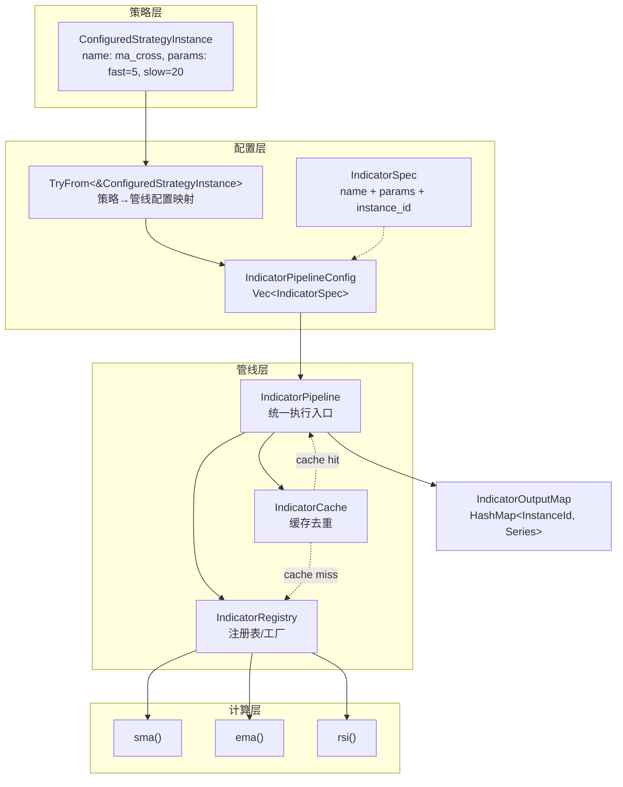
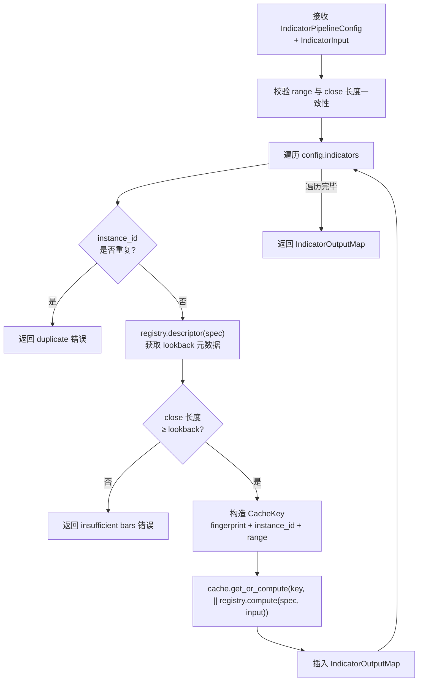

量化交易系统的核心竞争力之一在于对技术指标的高效、统一管理。Quantix 采用**配置驱动 + 注册表工厂 + 缓存去重**的三层架构来组织技术指标的计算流程。这一机制将指标的计算逻辑、参数配置与缓存策略完全解耦，使策略层无需关心底层计算细节，同时通过稳定的实例标识机制解决了同名指标不同参数（如 SMA(5) 与 SMA(20)）的输出覆盖问题。本文将逐层剖析该管线的设计哲学、数据结构与交互模式。

Sources: [mod.rs](src/analysis/mod.rs#L1-L36)

## 架构全景

指标管线由四个核心模块构成，每个模块承担单一职责，通过清晰的接口边界协同工作：

```
analysis/
├── indicators.rs              # 底层指标计算函数（纯函数，无状态）
├── indicator_config.rs        # 配置模型 + 实例 ID + 策略映射
├── indicator_registry.rs      # 注册表/工厂（元数据 + 计算路由）
├── indicator_cache.rs         # 缓存层（基于三元组 key 的去重计算）
└── pipeline.rs                # 统一执行入口（串联上述三层）
```

以下 Mermaid 图展示了完整的模块依赖与数据流向。阅读该图前需理解三个关键概念：**IndicatorSpec** 是"要计算什么"的声明，**IndicatorRegistry** 是"如何计算"的路由表，**IndicatorCache** 是"是否已算过"的判重层。



Sources: [INDICATOR_PIPELINE_MVP_PLAN.md](docs/INDICATOR_PIPELINE_MVP_PLAN.md#L1-L48)

## 配置层：声明"要计算什么"

### IndicatorSpec — 指标实例规格

**IndicatorSpec** 是整个管线的最小配置单元，它携带三个字段：指标名称（`name`）、参数映射（`params`）以及自动生成的实例标识（`instance_id`）。其中实例标识的生成算法是整个防覆盖机制的关键——参数键按字母序排列后序列化为 JSON 后缀，确保 `{period:5, alpha:1}` 与 `{alpha:1, period:5}` 产生完全相同的 ID。

Sources: [indicator_config.rs](src/analysis/indicator_config.rs#L8-L41)

**实例 ID 生成规则**的核心逻辑如下：参数为空时 ID 即为指标名称（如 `"sma"`）；参数非空时按键排序后拼接为 JSON 后缀（如 `"sma:{\"period\":5}"`）。这一设计确保了：(1) 相同参数始终生成相同 ID；(2) 不同类型但相同字符串值的参数不会混淆（`json!(5)` 与 `json!("5")` 产生不同 ID）；(3) 参数值中包含分隔符（如 `"a,b:c=d"`）也不会导致解析歧义。

Sources: [indicator_config.rs](src/analysis/indicator_config.rs#L48-L65)

### IndicatorPipelineConfig — 管线配置

**IndicatorPipelineConfig** 本质上是 `Vec<IndicatorSpec>` 的语义包装。管线在执行时会遍历该列表，为每个 spec 查询元数据、校验输入长度、计算或读取缓存。

Sources: [indicator_config.rs](src/analysis/indicator_config.rs#L43-L46)

### 策略映射：ConfiguredStrategyInstance → IndicatorPipelineConfig

这是连接策略层与指标管线的适配桥梁。当前 MVP 阶段仅支持 `ma_cross` 策略：当策略名称为 `ma_cross` 时，适配器从其 JSON 参数中提取 `fast` 和 `slow` 两个整数值，生成对应的两个 SMA 指标实例。非 `ma_cross` 策略会返回明确的 `Unsupported` 错误，这是一种**渐进式接入**的设计——新策略类型在适配器中显式注册后才可使用管线。

Sources: [indicator_config.rs](src/analysis/indicator_config.rs#L67-L89)

| 策略名称 | 映射逻辑 | 生成的指标实例 |
|---|---|---|
| `ma_cross` | `fast` → SMA(fast), `slow` → SMA(slow) | `sma:{"period":5}`, `sma:{"period":20}` |
| 其他 | 返回 `Unsupported` 错误 | — |

## 注册表层：路由"如何计算"

### IndicatorRegistry — 函数指针注册表

**IndicatorRegistry** 采用 `HashMap<&'static str, BuiltinIndicator>` 的内部结构，以指标规范名称（小写）为键，存储每个内置指标的元数据函数、计算函数和序列类型。核心设计选择是使用**函数指针**（`fn` type）而非 trait object——这避免了虚表开销和动态分派，同时因为所有内置指标在编译期即可确定。

Sources: [indicator_registry.rs](src/analysis/indicator_registry.rs#L105-L172)

注册表在 `new()` 中硬编码注册了三个 MVP 指标，每个指标注册时携带三项能力：

| 指标名称 | `meta_fn`（元数据） | `compute_fn`（计算） | 序列类型 |
|---|---|---|---|
| `sma` | lookback=period, warmup=period-1 | 调用 `sma()` 函数 | `ScalarSeries` |
| `ema` | lookback=period, warmup=period-1 | 调用 `ema()` 函数 | `ScalarSeries` |
| `rsi` | lookback=period+1, warmup=period | 调用 `rsi()` 函数 | `ScalarSeries` |

### IndicatorSeries — 统一输出枚举

`IndicatorSeries` 枚举是管线输出的核心契约，它为不同类型的指标预留了独立的变体。当前 MVP 阶段仅使用 `ScalarSeries`（标量序列），但 `MacdSeries`、`KdjSeries`、`AtrSeries` 的存在确保了后续扩展（MACD/KDJ/ATR 正式接入）不需要修改管线外层接口。

Sources: [indicator_registry.rs](src/analysis/indicator_registry.rs#L10-L24)

### 元数据与描述符

每个指标实例通过 `descriptor()` 方法返回 `IndicatorDescriptor`，其中包含 `IndicatorMeta`（canonical_name、lookback、warmup_len）和 `series_kind`。这些元数据有两个关键用途：(1) 管线在计算前校验输入数据长度是否满足 lookback 要求；(2) 策略层可根据 warmup_len 知道结果序列中前多少个元素是 `None`（即 warmup 区间）。

Sources: [indicator_registry.rs](src/analysis/indicator_registry.rs#L18-L37), [indicator_registry.rs](src/analysis/indicator_registry.rs#L178-L184)

### 参数解析与校验

注册表在路由计算之前执行严格的参数校验：指标名称通过 `to_ascii_lowercase()` 归一化处理（使 `"EMA"` 和 `"ema"` 等价）；`period` 参数必须为正整数；RSI 的 `period` 最低为 2（因为 RSI 至少需要 period+1 个数据点）。任何校验失败都返回携带明确错误信息的 `QuantixError`。

Sources: [indicator_registry.rs](src/analysis/indicator_registry.rs#L191-L244)

## 缓存层：确保"不重复计算"

### IndicatorCacheKey — 三元组缓存键

缓存键由三个维度组成：**dataset_fingerprint**（数据集指纹，如 `"000001:1d"` 标识平安银行日线）、**instance_id**（指标实例 ID）、**range**（数据窗口范围 `(start, end)`）。这三者的组合保证了：(1) 不同股票/周期的数据不会混淆；(2) 同名指标不同参数实例不会互相覆盖；(3) 未来窗口化场景（增量计算）可利用 range 维度做精细化缓存。

Sources: [indicator_cache.rs](src/analysis/indicator_cache.rs#L6-L25)

### get_or_compute — 缓存穿透回调模式

`IndicatorCache` 提供唯一的访问接口 `get_or_compute()`，它采用经典的"查缓存 → 命中则返回 → 未命中则计算并回填"模式。闭包参数 `F: FnOnce() -> Result<IndicatorSeries>` 确保计算逻辑仅在 cache miss 时执行一次。该设计的精妙之处在于将缓存命中判定完全内聚于缓存层，管线层只需调用一个方法即可同时处理两种路径。

Sources: [indicator_cache.rs](src/analysis/indicator_cache.rs#L37-L52)

## 管线层：串联配置、注册与缓存

### IndicatorPipeline — 统一执行入口

`IndicatorPipeline` 持有 `IndicatorRegistry` 和 `IndicatorCache` 两个内部组件，通过 `run()` 方法将整个计算流程编排为六个步骤：



管线在入口处首先校验 `input.range()` 与 `input.close().len()` 的一致性，防止传入不一致的窗口参数。随后对配置中的每个指标实例执行：(1) 重复 ID 检测；(2) lookback 元数据校验；(3) 缓存查询或计算；(4) 结果插入输出映射。这种严格的前置校验策略确保了错误在尽可能早的阶段被捕获，避免在部分计算完成后才发现配置问题。

Sources: [pipeline.rs](src/analysis/pipeline.rs#L16-L76)

## 计算层：底层指标实现

管线注册表中已接入的 SMA/EMA/RSI 指标以及尚未接入管线但已实现的 MACD/KDJ/BOLL/ATR/OBV/CCI/WR 等指标，均在 `indicators.rs` 及其子模块中以**纯函数**形式存在。这些函数的签名设计遵循统一模式：输入切片 `&[Decimal]` 加参数，输出 `Vec<Option<T>>`，其中 warmup 区间的值统一为 `None`。

Sources: [indicators.rs](src/analysis/indicators.rs#L1-L15)

### 已注册指标（管线已接入）

| 指标 | 函数签名 | 输入 | 算法要点 | lookback 公式 |
|---|---|---|---|---|
| **SMA** | `sma(data, period)` | close | 滑动窗口求和，O(n) 复杂度 | `period` |
| **EMA** | `ema(data, period)` | close | 初始 SMA + 指数平滑 (α=2/(period+1)) | `period` |
| **RSI** | `rsi(data, period)` | close | 初始平均涨跌 + Wilder 平滑 | `period + 1` |

SMA 实现采用了经典的高效滑动窗口技巧——维护一个 running sum，每次窗口滑动时减去离开窗口的值、加入新值，使得每个输出点的计算量为 O(1)，整体复杂度 O(n)。EMA 则先计算前 `period` 个点的 SMA 作为初始值，随后用指数平滑系数 `α = 2 / (period + 1)` 逐步递推。

Sources: [indicators.rs](src/analysis/indicators.rs#L14-L72)

### 已实现但未接入管线的指标

| 指标 | 函数签名 | 输入需求 | 说明 |
|---|---|---|---|
| **WMA** | `wma(data, period)` | close | 加权移动平均，近期数据权重更高 |
| **BOLL** | `bollinger_bands(data, period, std_dev)` | close | 布林带（中轨/上轨/下轨），含 Newton-Raphson 平方根近似 |
| **ATR** | `atr(high, low, close, period)` | HLC | 平均真实波幅，需 high/low/close 三列 |
| **OBV** | `obv(close, volume)` | close+volume | 能量潮，返回 `Vec<Option<i64>>` |
| **CCI** | `cci(high, low, close, period)` | HLC | 顺势指标，基于典型价格与平均绝对偏差 |
| **WR** | `williams_r(high, low, close, period)` | HLC | 威廉指标，范围 [-100, 0] |
| **MACD** | `macd(data, fast, slow, signal)` | close | DIF=EMA(fast)-EMA(slow), DEA=EMA(DIF,signal) |
| **KDJ** | `kdj(high, low, close, n, m1, m2)` | HLC | 随机指标，K/D/J 三个值 |

Sources: [indicators.rs](src/analysis/indicators.rs#L75-L349), [momentum.rs](src/analysis/indicators/momentum.rs#L1-L182)

这些指标的计算逻辑均已稳定，但管线注册表中尚未添加对应条目。按设计规划，MACD 和 KDJ 接入时将使用各自的 Series 变体（`MacdSeries`/`KdjSeries`），无需修改管线框架代码。

## Polars 批量计算适配层

除管线注册表驱动的逐指标计算外，系统还提供了基于 **Polars** 的批量计算适配层 `PolarsCalculator`，用于需要一次性计算多个指标的高吞吐场景。该适配器接受 `BatchKlineData` 结构（封装了单只股票的 OHLCV 数据），利用 Polars 的 `rolling_mean` 等窗口函数进行高性能向量计算。

Sources: [polars_adapter.rs](src/analysis/polars_adapter.rs#L84-L325)

`calculate_batch()` 方法是 Polars 适配层的核心，它接受一组指标名称字符串（如 `["ma5", "ma20", "rsi14"]`），自动解析前缀和周期参数，利用 Polars 的 DataFrame 构建和 `rolling_mean` 批量计算所有 MA 类指标。`MultiStockData` 进一步扩展了批量能力，支持按股票分组并行计算指标。

Sources: [polars_adapter.rs](src/analysis/polars_adapter.rs#L220-L324), [polars_adapter.rs](src/analysis/polars_adapter.rs#L333-L399)

| 维度 | 管线注册表路径 | Polars 批量路径 |
|---|---|---|
| 驱动方式 | `IndicatorPipelineConfig` 配置驱动 | 字符串数组（如 `["ma5", "rsi14"]`） |
| 缓存支持 | 内置 `IndicatorCache` | 无缓存 |
| 适用场景 | 策略驱动的精确计算 | 筛股/回测的大批量计算 |
| 输入格式 | `IndicatorInput`（close 数组） | `BatchKlineData`（完整 OHLCV） |
| 类型安全 | `IndicatorSeries` 枚举 | `HashMap<String, Vec<Option<Decimal>>>` |

## IndicatorInput — 数据输入模型

`IndicatorInput` 是管线对输入数据的抽象，携带三个维度：`dataset_fingerprint`（数据集指纹，用于缓存键）、`range`（数据窗口 `(start, end)`）、`close`（收盘价序列）。系统提供了三种构造方式：`new()` 自动从 close 数据推导指纹；`with_dataset_fingerprint()` 允许使用自定义指纹（如 `"000001:1d"`）；`with_context()` 同时指定指纹和范围。

Sources: [indicator_registry.rs](src/analysis/indicator_registry.rs#L40-L103)

指纹推导函数 `derive_dataset_fingerprint()` 将所有 close 值拼接为逗号分隔的字符串（`"close:1,2,3,4,5"`）。这在 MVP 阶段满足需求，但未来流式场景中需要更高效的指纹策略（如哈希摘要）。

## 策略集成示例：MA Cross

以下展示从策略配置到指标结果的完整调用链，这是当前 MVP 唯一已接入的端到端路径：

```rust
// 1. 策略配置（通常来自 JSON 文件）
let strategy_cfg = ConfiguredStrategyInstance {
    id: "ma_fast_5_slow_20".into(),
    name: "ma_cross".into(),
    enabled: true,
    params: json!({"fast": 5, "slow": 20}),
};

// 2. 映射为管线配置（生成两个 SMA 实例）
let pipeline_config = IndicatorPipelineConfig::try_from(&strategy_cfg)?;
// → indicators: [sma:{\"period\":5}, sma:{\"period\":20}]

// 3. 构建管线并执行
let mut pipeline = IndicatorPipeline::with_builtin_registry();
let input = IndicatorInput::with_dataset_fingerprint("000001:1d", close_data);
let output = pipeline.run(&pipeline_config, &input)?;

// 4. 按实例 ID 读取结果
let fast_ma = output.get(&IndicatorInstanceId("sma:{\"period\":5}".into()));
let slow_ma = output.get(&IndicatorInstanceId("sma:{\"period\":20}".into()));
```

注意：当前 `MACrossStrategy` 策略实现仍直接调用 `ma()` 函数（即"旧路径"），尚未切换到管线输出消费。这是 MVP 的有意设计——管线先作为"新能力门面"独立运行，待验证稳定后再逐步替换策略内部调用。

Sources: [ma_cross.rs](src/strategy/ma_cross.rs#L1-L62), [strategy config](src/strategy/config.rs#L15-L57)

## 基准测试与性能特性

系统通过 Criterion 基准测试框架对指标计算性能进行持续监控。基准测试覆盖 SMA/EMA/RSI/MACD 四个核心指标，分别测量 100/1000/10000 条数据规模下的计算耗时。SMA 的 O(n) 滑动窗口算法和 EMA 的递推计算使两者在大数据量下仍保持线性时间复杂度。

Sources: [bench_main.rs](benches/bench_main.rs#L49-L87), [indicators_benches.rs](src/analysis/indicators_benches.rs#L1-L105)

所有指标计算均使用 `rust_decimal::Decimal` 类型而非浮点数，这提供了精确的十进制运算（避免 IEEE 754 浮点误差），但代价是计算速度慢于原生 `f64`。对于批量场景，`PolarsCalculator` 在内部使用 `f64` 进行 Polars 向量运算，仅在最终输出时转换为 `Decimal`。

## 设计约束与扩展路径

### 当前 MVP 的明确边界

| 方面 | 当前状态 | 说明 |
|---|---|---|
| 已注册指标 | SMA, EMA, RSI | 管线路由仅支持这三个 |
| 策略适配 | 仅 `ma_cross` | 其他策略名称返回错误 |
| 输入数据 | 仅 close 列 | ATR/KDJ 需要 HLC 的接口尚未定义 |
| 缓存策略 | 全量内存 HashMap | 无 LRU/容量限制/持久化 |
| 流式计算 | 不支持 | 所有计算基于完整历史批次 |

### 后续扩展规划

1. **MACD/KDJ/ATR 接入管线**：在注册表中添加条目，使用已有的 `MacdSeries`/`KdjSeries`/`AtrSeries` 变体，需扩展 `IndicatorInput` 以支持 high/low/close 多列输入
2. **流式/增量计算**：引入 rolling state 结构（如 EMA 的递推状态机），支持 append-only 数据源的增量更新
3. **指标依赖图（DAG）**：MACD 依赖 EMA，未来可通过拓扑排序自动管理计算顺序
4. **缓存容量管理**：引入 LRU 淘汰或 TTL 过期策略，避免内存无限增长

Sources: [INDICATOR_PIPELINE_OPTIMIZATION_PLAN.md](docs/INDICATOR_PIPELINE_OPTIMIZATION_PLAN.md#L1-L248)

---

**下一步阅读**：理解指标如何参与完整回测流程，可继续阅读 [事件驱动回测引擎与性能指标计算](16-shi-jian-qu-dong-hui-ce-yin-qing-yu-xing-neng-zhi-biao-ji-suan)。要了解策略如何通过 Trait 抽象与指标管线协作，参见 [策略 Trait 抽象与内置策略实现](11-ce-lue-trait-chou-xiang-yu-nei-zhi-ce-lue-shi-xian)。如需深入了解 Polars 批量计算的性能优化策略，参见 [性能优化指南（Polars 批量计算与 Criterion 基准测试）](30-xing-neng-you-hua-zhi-nan-polars-pi-liang-ji-suan-yu-criterion-ji-zhun-ce-shi)。