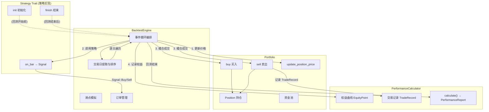
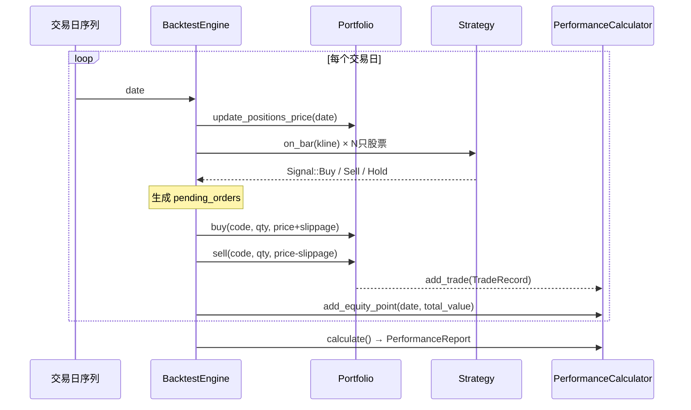

回测引擎是量化交易系统的核心验证工具——它将策略逻辑从"想法"转化为"可量化的历史表现"。Quantix 的回测系统采用 **事件驱动架构**，以交易日为单位逐日推进，在每个交易日依次执行行情更新→策略信号生成→订单撮合成交→权益曲线记录四个阶段，从而确保回测逻辑与实盘交易的高度一致性。本文将深入解析 `BacktestEngine` 的事件循环机制、`Portfolio` 的持仓与资金管理模型，以及 `PerformanceCalculator` 的多维度风险-收益指标计算体系，帮助高级开发者理解系统的设计决策和扩展点。

Sources: [backtest.rs](src/analysis/backtest.rs#L1-L17), [performance.rs](src/analysis/performance.rs#L1-L16), [portfolio.rs](src/analysis/portfolio.rs#L1-L8)

## 架构总览与核心协作关系

回测系统由三个紧密协作的组件构成，各自承担明确职责：**BacktestEngine** 负责事件循环编排，**Portfolio** 负责持仓与资金的状态管理，**PerformanceCalculator** 负责权益曲线记录与性能指标计算。三者之间通过清晰的数据流单向耦合，引擎持有组合与计算器的实例，驱动它们在事件循环中逐步演进。



上图中标注的数字（1-4）对应每个交易日内的四个处理阶段，体现了引擎的**单日四阶段**事件循环模式。策略通过 `Strategy` trait 的 `on_bar` 方法接入引擎，返回 `Signal` 枚举（Buy/Sell/Hold）驱动后续订单生成。引擎对策略完全透明——它不知道也不关心策略的内部实现，只依赖 `Signal` 的返回值。

Sources: [backtest.rs](src/analysis/backtest.rs#L102-L179), [trait_def.rs](src/strategy/trait_def.rs#L9-L37)

## BacktestConfig：回测参数化配置

`BacktestConfig` 将所有影响回测行为的外部参数集中到一处，遵循"配置即契约"的设计理念。每个字段都直接影响资金分配、交易成本或风险计算。

| 字段 | 类型 | 默认值 | 影响范围 |
|------|------|--------|----------|
| `initial_capital` | `Decimal` | 1,000,000 | 初始资金，影响仓位计算与收益率的基数 |
| `commission_rate` | `Decimal` | 0.0003（万三） | 买卖手续费率，从成交金额中扣除 |
| `slippage_bps` | `u32` | 2（2bp） | 滑点基点，买入加价/卖出减价模拟市场冲击 |
| `max_positions` | `usize` | 5 | 最大并行持仓数量，影响单只股票的资金分配 |
| `max_position_ratio` | `Decimal` | 0.2（20%） | 单股最大持仓比例，约束集中度风险 |
| `risk_free_rate` | `Decimal` | 0.03（3%） | 无风险利率（年化），用于夏普比率与索提诺比率的超额收益计算 |

值得注意的是，`commission_rate` 和 `slippage_bps` 分别覆盖了交易成本的**确定性部分**（手续费）和**不确定性部分**（滑点）。滑点以基点（bps）为单位，在 `apply_slippage` 方法中转化为百分比：买入价 = `close × (1 + slippage)`，卖出价 = `close × (1 - slippage)`。这种分离设计允许开发者独立调节两类成本，精确模拟不同市况下的真实交易摩擦。

Sources: [backtest.rs](src/analysis/backtest.rs#L19-L47)

## 事件循环详解：单日四阶段模型

`BacktestEngine::run` 方法的核心逻辑可以形式化为一个**确定性有限状态机**——在所有交易日构成的序列上，对每个交易日执行相同的四阶段处理。以下是这四个阶段的精确语义：

**阶段一：持仓价格更新**（`update_positions_price`）——引擎遍历当前所有持仓，从当天 K 线数据中查找收盘价并更新持仓的市值和浮动盈亏。这一步确保后续步骤中的权益计算基于当日最新价格。

**阶段二：策略信号生成**（`execute_strategy`）——引擎对所有传入数据的每只股票，将当天 K 线传递给策略的 `on_bar` 方法。如果策略返回 `Buy` 信号，引擎根据当前可用资金和 `max_positions` 限制计算买入数量，生成 `BacktestOrder` 加入待成交队列；如果返回 `Sell` 信号，引擎将该持仓的全部数量加入卖出队列。

**阶段三：订单撮合成交**（`execute_orders`）——引擎遍历待成交队列，使用当天 K 线的收盘价经滑点调整后作为成交价。买入操作通过 `Portfolio::buy` 扣除资金并创建/增加持仓；卖出操作通过 `Portfolio::sell` 增加资金并减少/清除持仓，同时生成 `TradeRecord` 交由 `PerformanceCalculator` 记录。

**阶段四：权益曲线记录**（`update_equity`）——引擎将当天的 `portfolio.total_value`（现金 + 持仓市值）追加到权益曲线。



在阶段二中，**订单数量的计算**采用等额分配策略：`target_amount = cash / max_positions`，然后将目标金额除以当前价格后向下取整到 100 的整数倍（A 股最小交易单位为一手 = 100 股）。这保证了：(1) 现金按持仓上限均分，不会过度集中于单只股票；(2) 买入数量符合 A 股交易规则。

Sources: [backtest.rs](src/analysis/backtest.rs#L123-L179), [backtest.rs](src/analysis/backtest.rs#L193-L356)

## Portfolio：持仓与资金的状态管理

`Portfolio` 是一个纯粹的**状态容器**，它不包含交易逻辑的判断，只负责精确的资金记账。其核心数据模型由两层构成：

**Position 层**——每只股票对应一个 `Position` 实例，记录股票代码、持仓数量、平均成本价、当前市值、浮动盈亏及盈亏比例。`Position` 提供了三个原子操作：`update_price`（更新市值与浮动盈亏）、`add`（加仓时重新计算平均成本）、`reduce`（减仓时计算已实现盈亏）。其中平均成本的重新计算公式为 `avg_cost = (原持仓成本 + 新增成本) / 合并后总量`，确保持仓成本的准确性。

**Portfolio 层**——维护 `cash`（可用现金）、`positions`（持仓 HashMap）和 `total_value`（总资产 = cash + 所有持仓市值之和）。每次 `buy` 或 `sell` 操作后，`recalculate_total_value` 自动重算总资产和总盈亏。买入时扣减的金额包含手续费（`amount × commission_rate`），卖出时到账金额同样扣除手续费。

买入/卖出的资金检查和持仓检查严格分离：`buy` 方法首先验证资金充足（含手续费），若不足返回错误字符串；`sell` 方法首先验证持仓数量足够，若不足同样返回错误。这种**先验证后操作**的模式确保了组合状态的一致性——任何失败的交易都不会留下部分修改的脏状态。

Sources: [portfolio.rs](src/analysis/portfolio.rs#L152-L286)

## PerformanceReport：多维度性能指标体系

`PerformanceReport` 是回测的最终输出物，包含 17 项量化指标，覆盖**收益性、风险性、交易质量**三个维度。以下按类别分组解析。

### 收益性指标

| 指标 | 字段名 | 计算公式 | 说明 |
|------|--------|----------|------|
| 总收益率 | `total_return` | `(final_equity - initial_capital) / initial_capital` | 回测期间的绝对收益比率 |
| 年化收益率 | `annual_return` | `(1 + total_return)^(365/days) - 1` | 将总收益率折算为年化值，当指数过大时退化为线性近似 |
| 卡玛比率 | `calmar_ratio` | `annual_return / |max_drawdown|` | 年化收益与最大回撤的比值，衡量风险调整后的收益 |

### 风险性指标

| 指标 | 字段名 | 计算公式 | 说明 |
|------|--------|----------|------|
| 最大回撤 | `max_drawdown` | `max((peak - trough) / peak)` | 从历史最高点到后续最低点的最大跌幅百分比 |
| 夏普比率 | `sharpe_ratio` | `(年化超额收益) / (年化标准差)` | 基于全部收益率的波动性风险调整，无风险利率默认 3% |
| 索提诺比率 | `sortino_ratio` | `(年化超额收益) / (年化下行偏差)` | 仅惩罚下行波动，对偏多策略更合理 |

### 交易质量指标

| 指标 | 字段名 | 计算公式 | 说明 |
|------|--------|----------|------|
| 胜率 | `win_rate` | `win_trades / total_trades × 100%` | 盈利交易占总交易的比例 |
| 盈亏比 | `profit_loss_ratio` | `avg_win / avg_loss` | 平均盈利与平均亏损的比值 |
| 平均盈利/亏损 | `avg_win`, `avg_loss` | 盈利/亏损交易的算术均值 | 分别统计盈利和亏损交易的平均幅度 |
| 最大单笔盈亏 | `max_win`, `max_loss` | 盈利/亏损交易的极值 | 识别尾部风险事件 |
| 最大连续盈亏 | `max_consecutive_wins`, `max_consecutive_losses` | 连续同方向交易的游程长度 | 评估策略的节奏性和回撤深度 |
| 总手续费 | `total_commission` | `Σ(trade.commission)` | 所有交易的手续费累计 |

Sources: [performance.rs](src/analysis/performance.rs#L17-L56), [performance.rs](src/analysis/performance.rs#L174-L231)

## 核心指标的计算原理

### 最大回撤：峰值追踪算法

最大回撤的计算采用 **单遍扫描** 的峰值追踪算法，时间复杂度 O(n)，空间复杂度 O(1)。核心思想是维护一个 `peak` 变量，遍历权益曲线时持续更新峰值，对每个非峰值点计算当前回撤深度 `drawdown = (peak - equity) / peak`，并记录全局最大值。

```rust
// 伪代码还原计算逻辑
let mut peak = initial_capital;
let mut max_drawdown = ZERO;
for point in equity_curve {
    if point.equity > peak { peak = point.equity; }
    let drawdown = (peak - point.equity) / peak;
    if drawdown > max_drawdown { max_drawdown = drawdown; }
}
```

这种算法的一个微妙之处在于 `peak` 初始化为 `initial_capital` 而非权益曲线的第一个点，这意味着如果账户一开始就亏损（第一个权益点低于初始资金），回撤会正确反映这一点。

### 夏普比率与索提诺比率

两者的计算共享相同的分子——**年化超额收益** = `avg_daily_return × 252 - risk_free_rate`，差异在于分母对风险的度量方式不同。

**夏普比率**使用全部日收益率的标准差作为分母（经 `√252` 年化），假设收益呈对称分布。计算步骤：先求日收益率的均值与方差，取方差的平方根得到日标准差，再乘以 `√252` 年化，最后用超额收益除以年化标准差。

**索提诺比率**只考虑**负收益**的下行偏差，公式为 `√(Σ(r < 0) r² / n)`（注意分母是全部收益率数量 n，而非仅负收益数量），同样经 `√252` 年化。这种处理使得仅有少量大幅亏损的策略不会被少量大幅盈利"稀释"其风险度量。

### 交易统计：盈亏分类与游程检测

交易统计以 `TradeRecord.pnl` 的正负号作为盈亏分类依据，将所有交易分为 `wins`（pnl > 0）和 `losses`（pnl < 0）两组。连续盈亏的检测采用简单的游程扫描：维护 `current_wins` 和 `current_losses` 两个计数器，遇到同方向交易时递增、遇到异方向交易时重置，同时持续更新全局最大值。

Sources: [performance.rs](src/analysis/performance.rs#L263-L374), [performance.rs](src/analysis/performance.rs#L376-L485), [metrics.rs](src/analysis/performance/metrics.rs#L1-L72)

## 独立指标函数：metrics 模块

除 `PerformanceCalculator` 中的实例方法外，系统还提供了三个**独立的纯函数**用于指标计算，位于 `performance::metrics` 子模块中。这些函数不依赖任何状态，直接接收权益曲线或收益率序列作为参数：

| 函数 | 签名 | 用途 |
|------|------|------|
| `calculate_total_return` | `(&[Decimal]) → Decimal` | 从权益曲线直接计算总收益率 |
| `calculate_max_drawdown` | `(&[Decimal]) → Decimal` | 从权益曲线直接计算最大回撤 |
| `calculate_sharpe_ratio` | `(&[Decimal], risk_free_rate) → Decimal` | 从日收益率序列计算夏普比率 |

这些独立函数的设计使得指标计算可以脱离完整的 `PerformanceCalculator` 实例，在轻量级场景（如实时监控、增量计算）中复用。它们与 `PerformanceCalculator` 中的同名方法共享相同的算法逻辑，但接口更简洁——输入是 `Decimal` 切片而非 `EquityPoint` 序列。

Sources: [metrics.rs](src/analysis/performance/metrics.rs#L1-L72), [performance.rs](src/analysis/performance.rs#L13)

## BacktestResult 与 TradeRecord：回测输出的数据契约

回测完成后，`BacktestEngine::run` 返回 `BacktestResult` 结构体，它是一个完整的**回测快照**，包含：

- `report: PerformanceReport` — 17 项性能指标汇总
- `final_equity: Decimal` — 最终账户价值
- `trades: Vec<TradeRecord>` — 全部已平仓交易的详细记录
- `config: BacktestConfig` — 回测使用的配置（用于可复现性）

`TradeRecord` 是交易级别的详细记录，每条记录对应一笔完整的开仓-平仓周期，包含股票代码、交易方向（`TradeSide::Long`）、开平仓日期与价格、数量、盈亏金额与百分比、以及手续费。这些字段足够支撑后续的**交易归因分析**——可以按股票、按时间段、按盈亏幅度进行多维度切片。

Sources: [backtest.rs](src/analysis/backtest.rs#L49-L60), [performance.rs](src/analysis/performance.rs#L94-L124)

## 策略接入：Strategy Trait 的回测集成点

策略通过 `Strategy` trait 的三个生命周期方法接入回测引擎：

1. **`init(&mut self)`** — 回测开始前调用一次，用于策略内部状态初始化（如指标预计算、参数加载）
2. **`on_bar(&mut self, bar: &Kline) → Result<Signal>`** — 每个交易日的每只股票调用一次，返回 `Buy`/`Sell`/`Hold` 三种信号之一
3. **`finish(&mut self)`** — 回测结束后调用一次，用于策略清理或最终报告

关键设计决策：`on_bar` 的调用粒度是**单只股票的单日 K 线**，而非整个市场截面数据。这意味着策略在同一交易日内对每只股票的决策是独立的——无法在同一次 `on_bar` 调用中看到其他股票的信号。这种设计简化了引擎逻辑，但要求策略开发者注意：跨股票的协调逻辑（如行业轮动中的仓位再平衡）需要在策略内部维护状态来实现。

Sources: [trait_def.rs](src/strategy/trait_def.rs#L9-L37), [backtest.rs](src/analysis/backtest.rs#L204-L242)

## 滑点模型与交易成本

回测引擎的交易成本模拟包含两个独立部分：

**确定性成本——手续费**：由 `BacktestConfig.commission_rate` 控制（默认万三），在 `Portfolio::buy` 和 `Portfolio::sell` 中以 `amount × commission_rate` 计算。手续费同时影响买入（增加总成本）和卖出（减少到账金额），因此对最终收益的影响是双重的。

**随机性成本——滑点**：由 `BacktestConfig.slippage_bps` 控制（默认 2bp），在 `BacktestEngine::apply_slippage` 中实现。滑点的方向性与订单类型绑定：买入时成交价 = `price × (1 + slippage)`，模拟买盘推动价格上涨；卖出时成交价 = `price × (1 - slippage)`，模拟卖盘推动价格下跌。这种**方向性滑点**设计比固定滑点更贴近真实市场微观结构。

滑点的基点转换公式为 `slippage = slippage_bps / 10000`，因此 2bp 对应 0.02% 的价格偏移。对于一只 10 元的股票，买入成交价为 10.002 元，卖出成交价为 9.998 元。

Sources: [backtest.rs](src/analysis/backtest.rs#L336-L344), [portfolio.rs](src/analysis/portfolio.rs#L196-L224), [portfolio.rs](src/analysis/portfolio.rs#L226-L258)

## 设计约束与已知限制

当前回测引擎在设计上有若干明确的约束，理解这些约束有助于正确使用和合理扩展：

**无当日回转**——由于引擎按日推进且使用收盘价成交，同一交易日内的买入无法在当日卖出（信号在当天生成、次日才可能产生卖出信号）。这符合 A 股 T+1 交易制度。

**单一成交时点**——所有订单以当日收盘价成交，无法模拟盘中分时成交或限价单的撮合逻辑。这意味着日内波动性对回测结果的影响被忽略。

**线性扫单**——`execute_orders` 按待成交队列的顺序逐笔处理，没有考虑订单之间的优先级或市场冲击的累积效应。在持仓数量较多时，实际交易成本可能被低估。

**年化收益的近似计算**——当回测天数较长（`365/days` 对应的幂次 > 50）时，年化收益率退化为线性近似 `total_return × 365 / days`，以避免 `Decimal::pow` 在大指数下的溢出风险。这对长期回测（>7 年）的年化精度有一定影响。

**静态资金分配**——订单数量采用 `cash / max_positions` 的等额分配策略，不支持按波动率、信号强度或仓位管理模型进行动态调仓。

Sources: [backtest.rs](src/analysis/backtest.rs#L123-L179), [backtest.rs](src/analysis/backtest.rs#L244-L253), [performance.rs](src/analysis/performance.rs#L233-L261)

## 延伸阅读

- 回测引擎依赖的技术指标计算管线：[技术指标管线与注册表机制](15-ji-zhu-zhi-biao-guan-xian-yu-zhu-ce-biao-ji-zhi)
- 策略接入回测所需的 trait 定义与内置实现：[策略 Trait 抽象与内置策略实现](11-ce-lue-trait-chou-xiang-yu-nei-zhi-ce-lue-shi-xian)
- 实盘执行引擎对回测逻辑的延续：[ExecutionKernel 执行生命周期与风控评估](12-executionkernel-zhi-xing-sheng-ming-zhou-qi-yu-feng-kong-ping-gu)
- 涉及 Polars 批量计算的性能优化：[性能优化指南（Polars 批量计算与 Criterion 基准测试）](30-xing-neng-you-hua-zhi-nan-polars-pi-liang-ji-suan-yu-criterion-ji-zhun-ce-shi)