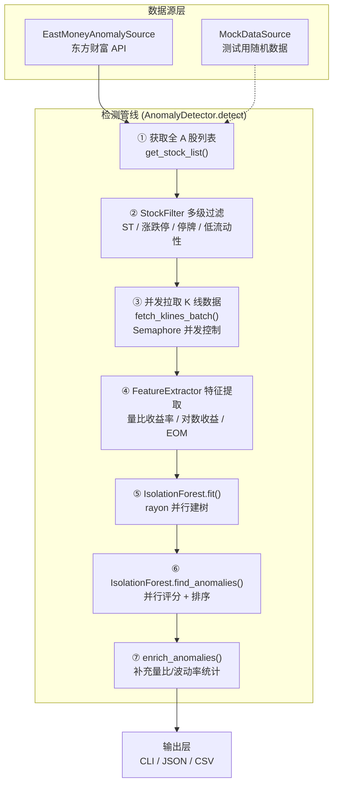

异常检测模块是 quantix-rust 中基于 **Isolation Forest** 算法的实时股票异常行为发现引擎。它从东方财富 API 拉取全市场 A 股 OHLCV 数据，经过 A 股特有的多级过滤（ST、涨跌停、停牌、低流动性），提取多维统计特征后训练 Isolation Forest 模型，最终输出异常分数排序结果。整个管线完全在 Rust 中实现，利用 **rayon** 并行建树和 **tokio** 异步并发拉取数据，适合对数千只股票进行批量实时扫描。

Sources: [mod.rs](src/anomaly/mod.rs#L1-L51)

## 模块架构总览

异常检测模块位于 `src/anomaly/` 目录下，由七个核心文件组成，各司其职形成完整的检测管线：

```
src/anomaly/
├── config.rs            # 多层配置结构（特征/过滤/森林/数据源/输出）
├── forest.rs            # Isolation Forest 核心算法（并行建树+评分）
├── statistics.rs        # 统计函数（线性回归、正态CDF、标准差）
├── features.rs          # OHLCV → 特征向量提取（量比/对数收益/EOM）
├── filter.rs            # A股特通过滤器（ST/涨跌停/停牌/低流动性）
├── eastmoney_source.rs  # 东方财富 API 数据源实现
└── detector.rs          # 管线编排器（整合所有组件的端到端检测流程）
```

下面的架构图展示了从数据拉取到异常输出的完整数据流：



Sources: [detector.rs](src/anomaly/detector.rs#L1-L17), [mod.rs](src/anomaly/mod.rs#L35-L51)

## Isolation Forest 算法实现

Isolation Forest 的核心思想是：**异常数据点因其稀少性，在随机划分空间时更容易被隔离，因此平均路径长度更短**。该模块完全从零实现了这一算法，未依赖外部 ML 框架。

### 算法原理与评分公式

每个样本的异常分数由以下公式计算：

$$s(x, n) = 2^{-\frac{E[h(x)]}{c(n)}} - 0.5$$

其中 $E[h(x)]$ 是样本在所有树中的平均路径长度，$c(n)$ 是归一化因子——即 $n$ 个样本在二叉搜索树中的平均失败路径长度，通过 Euler-Mascheroni 常数近似：

$$c(n) = 2 \ln(n) + 2\gamma - \frac{2(n-1)}{n}, \quad \gamma \approx 0.5772156649$$

分数范围约为 $[-0.5, 0.5]$：**负值表示异常**，越接近 $-0.5$ 异常程度越高；正值表示正常。

Sources: [forest.rs](src/anomaly/forest.rs#L1-L18), [forest.rs](src/anomaly/forest.rs#L296-L327), [forest.rs](src/anomaly/forest.rs#L382-L397)

### 并行建树机制

训练阶段利用 **rayon** 的并行迭代器构建森林。每棵树使用独立的 ChaCha8Rng 伪随机数生成器（通过 `random_state + tree_index` 确定种子），保证结果可复现的同时避免锁竞争。`max_samples` 控制每棵树的无放回子采样量，默认 256 个样本。

```rust
// 核心并行建树逻辑
self.trees = (0..self.n_estimators)
    .into_par_iter()
    .map(|i| {
        let mut rng = ChaCha8Rng::seed_from_u64(self.random_state + i as u64);
        // ... 子采样 + 递归构建
        IsolationTree { root: TreeNode::build(&subset, height_limit, 0, &mut rng) }
    })
    .collect();
```

树的高度限制为 $\lceil \log_2(\min(\text{max\_samples}, n)) \rceil$，到达叶节点时使用 `avg_path_length` 估算未完成路径的贡献，避免无限递归。

Sources: [forest.rs](src/anomaly/forest.rs#L258-L295), [forest.rs](src/anomaly/forest.rs#L52-L183)

### TreeNode 递归构建

单个树节点的构建遵循标准 Isolation Tree 流程：

1. **终止条件**：达到高度限制或仅剩一个样本时返回叶节点，附加估算路径长度
2. **特征筛选**：计算每个特征的值域范围，跳过零方差特征（`valid_features` 过滤）
3. **随机分裂**：从有效特征中随机选择一个，在其 `[min, max]` 区间内均匀随机取分裂点
4. **递归分裂**：按分裂点将数据分为左右子集，空子集时退化为叶节点

评分阶段同样利用 `par_iter` 并行计算所有样本在所有树上的路径长度均值，再统一归一化为异常分数。

Sources: [forest.rs](src/anomaly/forest.rs#L82-L160), [forest.rs](src/anomaly/forest.rs#L162-L183)

## 特征提取管线

特征提取是将原始 OHLCV K 线序列转换为适合 Isolation Forest 消费的多维数值向量的关键步骤。`FeatureExtractor` 支持三类可配置特征族：

| 特征族 | 计算公式 | 产出维度 | 配置开关 |
|--------|---------|----------|---------|
| **量比收益率** | `V[t] / V[t-1]` | `history_to_use` 个原始值 + 3 个回归统计 | `include_volume_returns` |
| **对数收益率** | `ln(C[t] / C[t-1])` | `history_to_use` 个原始值 | `include_log_returns` |
| **EOM（Ease of Movement）** | `(Δmidpoint) / (volume/10⁶ / range)` | 每个周期 3 个回归统计 | `include_eom` |

默认配置下，每只股票产出约 **31 维特征向量**（7 个量比 + 3 回归统计 + 7 个对数收益 + 3×3 EOM 统计），最小需要 50 根 K 线才能进行提取。

Sources: [features.rs](src/anomaly/features.rs#L1-L11), [features.rs](src/anomaly/features.rs#L190-L349)

### 特征计算细节

**量比收益率**（Volume Returns）取最近 `history_to_use`（默认 7）个周期，附加线性回归的斜率、R²、p 值三个统计量，用于捕捉成交量突变趋势。**对数收益率**（Log Returns）直接使用原始对数价格变化率，保留短期价格波动特征。

**EOM 指标**在三个不同周期（默认 5、10、20）上分别计算 SMA 平滑后的趋势回归统计。EOM 本身的计算将价格中点移动幅度除以成交量归一化的价格振幅，衡量"单位成交量推动的价格移动效率"——异常高的 EOM 通常意味着缩量大幅波动。

所有特征在提取后进行 NaN 检查，包含 NaN 的样本会被静默丢弃。同时附加**量比**（当日成交量 / 5 日均量）、**5 周期波动率**、**20 周期波动率**作为元数据供后续结果丰富使用。

Sources: [features.rs](src/anomaly/features.rs#L207-L326), [features.rs](src/anomaly/features.rs#L357-L408)

### 统计支撑函数

`statistics` 模块提供线性回归和概率分布计算的基础设施。线性回归以 `[0, 1, 2, ..., n-1]` 为 X 轴执行最小二乘拟合，返回斜率、截距、R²、p 值和标准误。p 值计算使用 **Abramowitz-Stegun 误差函数近似** 估算标准正态 CDF，在 $n > 30$ 时精度足够。

Sources: [statistics.rs](src/anomaly/statistics.rs#L8-L101), [statistics.rs](src/anomaly/statistics.rs#L145-L167)

## A 股特通过滤器

`StockFilter` 实现了多层 A 股市场专用的过滤规则，确保异常检测在干净且有意义的股票池上运行：

| 过滤规则 | 实现逻辑 | 默认阈值 |
|----------|---------|---------|
| **ST 股票** | 名称包含 "ST"、"\*ST"、"退" | 排除 |
| **涨跌停** | 按板块区分涨跌停阈值 | 主板 ±10%，创业板/科创板 ±20%，北交所 ±30%，ST ±5% |
| **停牌检测** | 最近 5 根 K 线收盘价完全相同 | 排除 |
| **最低成交量** | 平均成交量低于阈值 | 10,000 手 |
| **最低波动率** | 对数收益率标准差低于阈值 | 0.03 |
| **最大股票数** | 限制处理股票数 | 0（无限制） |

涨跌停检测会根据股票代码前缀自动识别板块类型：`300xxx`（创业板）、`688xxx`（科创板）、`8xxxxx/4xxxxx`（北交所），并应用对应的涨跌停阈值。

Sources: [filter.rs](src/anomaly/filter.rs#L1-L9), [filter.rs](src/anomaly/filter.rs#L56-L177)

## 东方财富数据源集成

`EastMoneyAnomalySource` 实现了 `DataSource` trait，通过东方财富 push2 API 获取全市场 A 股实时数据。

### 股票列表获取

使用 `/api/qt/clist/get` 端点，通过 `fs` 参数一次性拉取深圳 A 股（`m:0+t:6`）、创业板（`m:0+t:80`）、上海 A 股（`m:1+t:2`）、科创板（`m:1+t:23`）四个板块的全量股票列表，单次请求最多返回 5000 只。返回字段包括代码（`f12`）、名称（`f14`）、现价（`f2`）、涨跌幅（`f3`）、成交量（`f5`）、成交额（`f6`）。

Sources: [eastmoney_source.rs](src/anomaly/eastmoney_source.rs#L14-L61), [eastmoney_source.rs](src/anomaly_source.rs#L72-L137)

### K 线数据获取

使用 `/api/qt/stock/kline/get` 端点获取单只股票的 K 线数据。关键参数映射如下：

| 参数 | 说明 | 映射逻辑 |
|------|------|---------|
| `secid` | 市场编码.股票代码 | 6 开头 → `1.code`，其他 → `0.code` |
| `klt` | K 线类型 | 1/5/15/30/60 → 分钟级，101 → 日线 |
| `fqt` | 复权类型 | `qfq` → `1`，`hfq` → `2`，其他 → `0` |
| `lmt` | 返回条数 | 直接映射 |

K 线原始数据为逗号分隔字符串 `"time,open,close,high,low,volume,amount"`，解析时过滤掉价格为 0 的无效记录。

Sources: [eastmoney_source.rs](src/anomaly/eastmoney_source.rs#L139-L229), [eastmoney_source.rs](src/anomaly/eastmoney_source.rs#L48-L60)

### 并发控制

检测器通过 `tokio::sync::Semaphore` 控制并发请求数（默认 10），每只股票的 K 线请求在独立的 tokio task 中执行。失败的请求会被静默跳过（debug 级别日志），不影响整体检测结果。

Sources: [detector.rs](src/anomaly/detector.rs#L168-L208)

## 检测管线编排

`AnomalyDetector` 是整个异常检测管线的编排核心。其 `detect()` 方法执行以下八个步骤：

1. **获取股票列表** — 通过 `DataSource` trait 的 `get_stock_list()` 异步获取
2. **多级过滤** — `StockFilter.filter_stock_list()` 剔除不符合条件的股票
3. **并发拉取 K 线** — `fetch_klines_batch()` 带信号量控制的并发获取
4. **特征提取** — `FeatureExtractor.extract_all()` 批量转换为特征矩阵
5. **训练森林** — `IsolationForest.fit()` 并行构建隔离树集合
6. **异常排序** — `find_anomalies()` 按异常分数升序取 Top N
7. **结果丰富** — `enrich_anomalies()` 补充量比和波动率元数据
8. **格式化输出** — 支持 CLI 表格、JSON、CSV 三种输出格式

`DataSource` trait 采用 `async_trait` 定义，使得 `EastMoneyAnomalySource` 和 `MockDataSource` 可以通过 `Arc<dyn DataSource>` 统一注入，便于测试和生产切换。

Sources: [detector.rs](src/anomaly/detector.rs#L59-L89), [detector.rs](src/anomaly/detector.rs#L91-L166)

## 配置体系

`AnomalyConfig` 采用分层结构设计，包含五个独立的配置子结构，均支持 serde 序列化（TOML/JSON）：

| 配置层 | 结构体 | 关键参数 | 默认值 |
|--------|--------|---------|--------|
| **特征配置** | `FeatureConfig` | `history_to_use=7`, `eom_periods=[5,10,20]`, `min_candles=50` | 7 周期窗口 |
| **过滤配置** | `FilterConfig` | `min_volume=10000`, `min_volatility=0.03`, `exclude_st=true` | A 股标准过滤 |
| **森林配置** | `ForestConfig` | `n_estimators=100`, `max_samples=256`, `contamination=0.1`, `top_n=20` | 100 棵树 |
| **数据配置** | `DataConfig` | `kline_period=15`, `kline_limit=100`, `adjust_type="qfq"`, `max_concurrent=10` | 15 分钟线 |
| **输出配置** | `OutputConfig` | `format="cli"`, `anomalies_only=false` | 终端表格 |

配置还提供 builder 模式的便捷方法（`with_top_n()`、`with_period()`、`with_format()`），以及 `from_file()`/`to_file()` 的 TOML 文件读写支持。

Sources: [config.rs](src/anomaly/config.rs#L8-L33), [config.rs](src/anomaly/config.rs#L36-L123), [config.rs](src/anomaly/config.rs#L176-L210)

## CLI 集成

异常检测通过 `quantix anomaly run` 子命令暴露给用户，完整的命令行参数如下：

```bash
quantix anomaly run [OPTIONS]

选项:
  -n, --top-n <N>          显示的异常股票数量 [默认: 20]
  -p, --period <MINUTES>   K线周期: 1, 5, 15, 30, 60 [默认: 15]
      --min-volume <VOL>   最小成交量过滤（手） [默认: 10000]
      --min-volatility <V> 最小波动率过滤 [默认: 0.03]
  -o, --output <FORMAT>    输出格式: cli, json, csv [默认: cli]
      --n-estimators <N>   Isolation Forest 树数量 [默认: 100]
      --history <N>        历史K线数量用于特征 [默认: 7]
      --mock               使用模拟数据（测试用）
      --mock-count <N>     模拟数据股票数量 [默认: 100]
```

CLI handler 根据参数构建 `AnomalyConfig`，选择 `EastMoneyAnomalySource`（生产）或 `MockDataSource`（测试）作为数据源，创建 `AnomalyDetector` 并执行检测。输出格式支持三种模式：CLI 表格模式展示带有 Emoji 标记的中文格式化结果，JSON 模式输出完整的 `AnomalyResult` 序列化结构，CSV 模式输出可直接导入分析工具的表格数据。

Sources: [trade.rs](src/cli/commands/trade.rs#L215-L255), [anomaly.rs](src/cli/handlers/anomaly.rs#L40-L128)

## 典型使用场景

**快速扫描**：使用默认参数对全市场 15 分钟线进行异常检测，找出当日前 20 只最异常的股票。

```bash
quantix anomaly run
```

**高频数据深入分析**：使用 5 分钟 K 线、200 棵树、返回 Top 50 异常股票。

```bash
quantix anomaly run --period 5 --n-estimators 200 --top-n 50 --output json
```

**离线测试验证**：使用模拟数据验证管线逻辑，无需网络连接。

```bash
quantix anomaly run --mock --mock-count 500 --output csv
```

**导出分析**：将结果以 CSV 格式输出，配合 Python/R 进行后续分析。

```bash
quantix anomaly run --output csv > anomalies_$(date +%Y%m%d).csv
```

## 输出结果结构

`AnomalyResult` 包含检测的时间戳、使用的配置摘要、处理的股票总数、被过滤的股票数、有效特征数，以及按异常分数升序排列的 `AnomalyScore` 列表。每个 `AnomalyScore` 包含以下字段：

| 字段 | 类型 | 含义 |
|------|------|------|
| `code` | String | 股票代码 |
| `name` | String | 股票名称 |
| `score` | f64 | 异常分数（< 0 为异常，约 [-0.5, 0.5]） |
| `is_anomaly` | bool | 是否被判定为异常 |
| `volume_ratio` | Option\<f64\> | 量比（当日 / 5 日均量） |
| `volatility_5` | Option\<f64\> | 5 周期波动率 |
| `volatility_20` | Option\<f64\> | 20 周期波动率 |
| `latest_time` | Option\<String\> | 最新 K 线时间戳 |

Sources: [forest.rs](src/anomaly/forest.rs#L22-L49), [detector.rs](src/anomaly/detector.rs#L18-L57)

## 相关页面

- 了解异常检测所依赖的技术指标管线，参阅 [技术指标管线与注册表机制](15-ji-zhu-zhi-biao-guan-xian-yu-zhu-ce-biao-ji-zhi)
- 了解数据源适配器的整体架构，参阅 [多数据源适配器架构（TDX/AKShare/东方财富/Bridge）](8-duo-shu-ju-yuan-gua-pei-qi-jia-gou-tdx-akshare-dong-fang-cai-fu-bridge)
- 了解并行计算优化的通用模式，参阅 [性能优化指南（Polars 批量计算与 Criterion 基准测试）](30-xing-neng-you-hua-zhi-nan-polars-pi-liang-ji-suan-yu-criterion-ji-zhun-ce-shi)
- 了解风控体系如何利用波动率指标，参阅 [风控规则体系（持仓/亏损/波动率/行业集中度）](18-feng-kong-gui-ze-ti-xi-chi-cang-yu-sun-bo-dong-lu-xing-ye-ji-zhong-du)