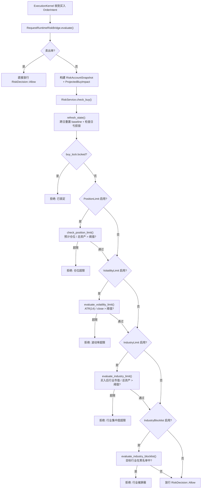
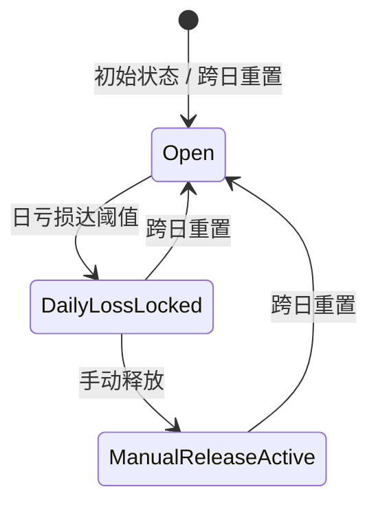

风控规则体系是 Quantix 交易引擎中负责**在买入执行前拦截高风险操作**的核心防线。它围绕六种规则类型——单票仓位上限（PositionLimit）、日亏损限制（DailyLossLimit）、波动率限制（VolatilityLimit）、行业集中度限制（IndustryLimit）、自动减仓（AutoReduce）和行业黑名单（IndustryBlocklist）——构建了一套**声明式规则 + 即时评估**的架构。规则通过 CLI 声明配置，由 `RiskService` 在每次买入请求时同步校验，任何规则触发失败即阻断交易。整个子系统大约 2750 行 Rust 代码，覆盖从持久化存储、行业解析器、ATR 波动率计算到执行引擎桥接的完整链路。

Sources: [mod.rs](src/risk/mod.rs#L1-L39), [models.rs](src/risk/models.rs#L1-L97)

---

## 架构全景：规则如何被评估

理解风控规则体系的第一步是把握**买入请求的评估流程**——一个 `check_buy` 调用如何依次穿过所有启用的规则。下面的流程图展示了这一核心路径：



关键设计决策：**卖出永远不被风控阻断**，只有买入操作才进入完整规则链。这是基于「允许止损、限制追高」的风控哲学。

Sources: [service.rs](src/risk/service.rs#L233-L284), [daemon.rs](src/execution/daemon.rs#L104-L133)

---

## 六种规则类型与值约束

`RiskRuleType` 枚举定义了系统支持的全部规则类型，每条规则由 `RuleValue` 承载具体的阈值数据。规则类型与值类型之间存在严格的约束关系：

| 规则类型 | CLI 标识 | 中文名称 | 允许的值类型 | 示例 | 核心作用 |
|---|---|---|---|---|---|
| `PositionLimit` | `position-limit` | 单票仓位上限 | 仅 `Percentage` | `20%` | 单只股票市值不超过总资产的指定比例 |
| `DailyLossLimit` | `daily-loss-limit` | 日亏损限制 | `Percentage` 或 `Amount` | `5%` 或 `50000` | 当日亏损达阈值后锁定全部买入 |
| `VolatilityLimit` | `volatility-limit` | 波动率限制 | 仅 `Percentage` | `4%` | ATR(14)/close 超阈值则拒绝买入 |
| `IndustryLimit` | `industry-limit` | 行业集中度限制 | 仅 `Percentage` | `30%` | 单行业总市值不超过总资产指定比例 |
| `AutoReduce` | `auto-reduce` | 自动减仓 | `Percentage` 或 `Amount` | `8%` | 亏损达阈值时推荐减仓 50% |
| `IndustryBlocklist` | `industry-blocklist` | 行业黑名单 | 仅 `TextList` | `房地产,银行` | 黑名单行业的股票禁止买入 |

`RuleValue::parse()` 方法在规则设置时执行严格的类型校验——例如 `position-limit` 只接受百分比值（带 `%` 后缀），`industry-blocklist` 只接受逗号分隔的文本列表。这种设计确保了**规则配置的编译期正确性**，错误配置在设置阶段即被拒绝，而非在评估时才暴露。

Sources: [models.rs](src/risk/models.rs#L49-L177)

---

## 核心状态模型：RiskState

`RiskState` 是风控子系统的**单一持久化状态根**，通过 JSON 文件存储在磁盘上。它的结构直接决定了系统的行为语义：

```rust
pub struct RiskState {
    pub version: u32,                              // 状态版本号，当前固定为 1
    pub account_id: String,                        // 关联账户 ID，默认 "default"
    pub rules: Vec<RiskRule>,                      // 已配置的规则列表
    pub daily_baseline: Option<DailyRiskBaseline>, // 当日开盘基准（交易日 + 起始总资产）
    pub buy_lock: BuyLockState,                    // 买入锁状态
    pub events: Vec<RiskLogEvent>,                 // 最近的风控事件日志（默认保留 100 条）
}
```

其中几个关键状态字段的含义值得深入说明：

**`DailyRiskBaseline`** 记录每个交易日的起始总资产，用于计算当日累计盈亏（`daily_pnl = current_total_assets - starting_total_assets`）。当系统检测到日期跨越（`baseline.trading_date != now.date_naive()`）时，会自动重置 baseline 并清除买入锁。这保证了**日亏损限制严格按自然交易日计算**，跨日后自动恢复。

**`BuyLockState`** 是日亏损限制的执行机制。一旦日亏损触发阈值，`locked` 字段设为 `true`，后续所有买入请求被直接拒绝。锁的释放有两条路径：(1) 跨日自动重置；(2) 用户手动调用 `risk lock release`，设置 `released_for_date` 使当日内不再自动重锁。

**事件日志**以有界队列（默认 100 条）的方式记录风控事件，支持按日期和事件类型过滤查询，是事后审计和调试的核心数据源。

Sources: [models.rs](src/risk/models.rs#L16-L38), [models.rs](src/risk/models.rs#L179-L261)

---

## 规则评估详解

### 单票仓位上限（PositionLimit）

仓位检查是**纯同步计算**，不依赖任何外部数据源。核心逻辑在 `check_position_limit` 函数中：

```
projected_ratio_pct = projected_position_value / projected_total_assets × 100
```

其中 `projected_position_value` 包含当前持仓市值加上计划买入金额，`projected_total_assets` 也包含了买入后的总资产。这意味着仓位百分比是基于**买入后的预期状态**计算的，而非当前状态。如果预期仓位比例超过阈值，买入被拒绝。

这一设计确保了一个重要属性：**即使分批买入也不会绕过限制**。因为每次买入请求都基于全量持仓投影计算，第二笔买入的 projected_position_value 已经包含了第一笔的市值。

Sources: [state_helpers.rs](src/risk/service/state_helpers.rs#L64-L90)

### 日亏损限制（DailyLossLimit）

日亏损限制是**唯一会触发状态副作用的规则**——它不仅拒绝买入，还会设置买入锁（`BuyLockState`）。评估逻辑分两步：

1. **计算当日盈亏**：`daily_pnl = current_total_assets - starting_total_assets`，以及百分比形式 `daily_pnl_pct = daily_pnl / starting_total_assets × 100`。
2. **阈值匹配**：根据规则值类型（`Amount` 或 `Percentage`），判断 `daily_pnl <= -limit` 或 `daily_pnl_pct <= -limit_pct`。

一旦触发且当前未被锁定，系统会：
- 设置 `buy_lock.locked = true`
- 记录触发原因和时间戳
- 写入 `DailyLossLockTriggered` 事件

锁的生命周期管理遵循严格的有限状态机：



`RiskLockStateSource` 枚举精确编码了这三个状态，供 CLI 和监控系统查询当前锁来源。

Sources: [state_helpers.rs](src/risk/service/state_helpers.rs#L10-L62), [lock_state.rs](src/risk/models/lock_state.rs#L1-L7)

### 波动率限制（VolatilityLimit）

波动率限制是**唯一的异步规则**，它需要从外部加载 K 线数据并计算技术指标。核心流程：

1. 加载最近 `VOLATILITY_REQUIRED_BARS = 15` 条日线 K 线（`ATR_PERIOD + 1 = 14 + 1`）
2. 调用 ATR（Average True Range）计算函数，取最后一个 ATR(14) 值
3. 计算 `actual_pct = ATR / latest_close × 100`，保留两位小数
4. 若 `actual_pct > limit_pct`，拒绝买入

`DefaultRiskBarLoader` 使用 `FallbackStrategyBarLoader` 作为底层加载器——它首先尝试从环境变量配置的数据源加载 K 线，若主数据源无数据则回退到备用源。如果可用 K 线不足 15 条，规则也会拒绝买入（fail-closed 策略）。

ATR 指标计算依赖 [indicators.rs](src/analysis/indicators.rs) 中的通用 ATR 函数，确保了风控模块与策略分析模块使用完全一致的指标实现。

Sources: [volatility.rs](src/risk/volatility.rs#L1-L144)

### 行业集中度限制（IndustryLimit）

行业集中度检查是系统中**最复杂的规则**，因为它需要将每个持仓股票映射到其所属行业，然后计算同一行业的总市值占比。评估流程：

1. 通过 `IndustryResolver` 解析目标买入股票的行业
2. 遍历当前所有持仓，逐个解析行业
3. 计算同行业持仓的当前市值总和
4. 计算买入增量：`projected_increment = max(0, projected_position_value - current_target_position_value)`
5. 计算预期行业集中度：`projected_industry_value / projected_total_assets × 100`
6. 若超过阈值，拒绝买入

行业解析器（`IndustryResolver`）使用**四级回退策略**解析股票行业：

| 优先级 | 查找源 (`IndustrySourceTier`) | 说明 |
|---|---|---|
| 1 | `CurrentActive` | `industry_reference_current` 表中的最新申万一级行业分类 |
| 2 | `SnapshotMonth` | `risk_industry_snapshots` 表中当月快照 |
| 3 | `Historical` | `industry_reference_history` 表中的历史有效期匹配 |
| 4 | `LatestSnapshot` | `risk_industry_snapshots` 表中最近任意月份快照 |

如果四级回退全部失败，行业解析返回错误，买入被拒绝（fail-closed）。同时，如果 `RiskService` 未配置行业解析器（`industry_resolver` 为 `None`），行业相关规则也会在检查时返回配置错误。

Sources: [industry_checks.rs](src/risk/service/industry_checks.rs#L48-L132), [industry.rs](src/risk/industry.rs#L111-L236)

### 行业黑名单（IndustryBlocklist）

行业黑名单是**最简单的行业规则**——它只检查目标买入股票的行业是否在黑名单列表中，不涉及集中度计算。黑名单值以逗号分隔的文本列表存储（如 `房地产,银行`），匹配逻辑是精确字符串比较。

Sources: [industry_checks.rs](src/risk/service/industry_checks.rs#L4-L46)

### 自动减仓（AutoReduce）

自动减仓规则**不直接阻断买入**，而是在 `RiskStatus` 中生成减仓建议（`AutoReduceRecommendation`）。它的触发条件与日亏损限制相同（亏损达阈值），但行为是推荐性的：

- `reduce_ratio` 固定为 50%（建议减半持仓）
- `positions_to_reduce` 包含所有当前持仓
- `current_loss_pct` 记录当前亏损百分比
- 触发信息通过 `RiskStatus.auto_reduce_recommendation` 字段暴露给上层系统

自动减仓的决策逻辑在 `check_auto_reduce_trigger` 中实现，该函数在 `build_status` 时被调用，如果触发则生成建议数据。上层执行系统可以据此决策是否执行减仓操作。

Sources: [industry_checks.rs](src/risk/service/industry_checks.rs#L138-L177), [state_helpers.rs](src/risk/service/state_helpers.rs#L175-L195)

---

## 行业数据基础设施

行业相关规则（IndustryLimit、IndustryBlocklist）的正确运行依赖于**行业分类参考数据**的完整性和时效性。这一基础设施由三个组件构成：

### 行业数据存储（SqliteIndustryStore）

行业参考数据存储在 SQLite 数据库（`industry_reference.db`）中，包含三张表：

| 表名 | 用途 | 主键 |
|---|---|---|
| `industry_reference_current` | 当前生效的行业分类 | `(standard, level, code)` |
| `industry_reference_history` | 历史行业分类（含有效期） | `(standard, level, code, effective_from)` |
| `risk_industry_snapshots` | 按月快照的行业映射 | `(standard, level, snapshot_month, code)` |

数据库路径默认与 `risk_state.json` 在同一目录下（`industry_reference.db`），由 `SqliteIndustryStore::from_risk_state_path` 自动推导。

Sources: [industry_store.rs](src/risk/industry_store.rs#L1-L106)

### 行业数据同步（IndustrySync）

行业参考数据从上游 MySQL 数据库同步，数据源为申万行业分类体系：

- **当前分类**：从 `sw_industry_classification` 表读取 `股票代码` → `新版一级行业` 映射
- **历史变更**：从 `sw_stock_update`（变更记录）关联 `sw_industry`（行业字典）读取带有效期的历史映射

同步通过 CLI 命令 `quantix risk sync industry --standard shenwan` 触发，由 `MySqlIndustrySyncSource` 连接上游数据库，`sync_industry_reference_data_at` 协调全量替换。历史数据在导入时会进行去重处理——同一股票同一生效日期只保留最新行业名称。

Sources: [industry_sync.rs](src/risk/industry_sync.rs#L1-L190)

### 行业解析器（IndustryResolver）

`IndustryResolver` 是行业规则的**运行时依赖**，封装了四级回退查找逻辑。当 `RiskService` 通过 `with_industry_resolver` 注入了解析器时，行业相关规则才能正常工作；否则这些规则会在评估时返回配置错误。

在执行引擎集成中，`RiskService::from_json_store` 会自动创建 `IndustryResolver`，确保通过 `RuntimeJsonRiskServices` 创建的服务实例具备完整的行业检查能力。

Sources: [industry.rs](src/risk/industry.rs#L111-L236), [service.rs](src/risk/service.rs#L443-L451)

---

## 持久化与原子写入

风控状态通过 `JsonRiskStore` 持久化为 JSON 文件。写入操作采用**原子替换策略**以确保数据完整性：

1. 将序列化后的 JSON 写入临时文件（`.risk_state.json.<uuid>.tmp`）
2. 调用 `fs::sync_all()` 确保数据落盘
3. 通过 `fs::rename` 原子替换目标文件
4. 若任一步骤失败，清理临时文件

这一设计确保了即使写入过程中进程崩溃，也不会损坏现有的状态文件。

Sources: [storage.rs](src/risk/storage.rs#L1-L81)

---

## 执行引擎集成

风控规则与交易执行引擎的集成通过 `RiskEvaluator` trait 桥接。`RequestRuntimeRiskBridge` 是核心桥接组件，它将执行层的 `OrderIntent` 转换为风控层的 `RiskAccountSnapshot` + `ProjectedBuyImpact`，然后调用 `RiskService::check_buy`：

```rust
// 执行引擎只看到 RiskEvaluator trait
async fn evaluate(&self, intent: OrderIntent) -> Result<RiskDecision> {
    if intent.side == OrderSide::Sell {
        return Ok(RiskDecision::Allow); // 卖出永远放行
    }
    // ... 构建 snapshot 和 projected_buy ...
    match risk_service.check_buy(&snapshot, &projected_buy, Utc::now()).await {
        Ok(()) => Ok(RiskDecision::Allow),
        Err(QuantixError::Other(reason)) => Ok(RiskDecision::Reject { reason }),
        Err(other) => Err(other),
    }
}
```

`RuntimeJsonRiskServices` 封装了两个 `RiskService` 实例：`base` 用于状态查询和日常操作，`buy_checks`（延迟初始化）用于买入检查（自动加载行业解析器）。这种双实例设计避免了每次买入检查都重新构建服务。

Sources: [daemon.rs](src/execution/daemon.rs#L89-L138), [service.rs](src/risk/service.rs#L68-L98), [traits.rs](src/execution/kernel/traits.rs#L8-L13)

---

## CLI 命令体系

风控规则的全部管理操作通过 `quantix risk` 命令族暴露：

### 规则管理

```bash
# 设置规则
quantix risk rule set --type position-limit --value 20%
quantix risk rule set --type daily-loss-limit --value 5%
quantix risk rule set --type volatility-limit --value 4%
quantix risk rule set --type industry-limit --value 30%
quantix risk rule set --type auto-reduce --value 8%
quantix risk rule set --type industry-blocklist --value "房地产,银行"

# 查看所有规则
quantix risk rule list

# 启用/禁用规则
quantix risk rule enable --type position-limit
quantix risk rule disable --type daily-loss-limit
```

### 状态查询

```bash
# 完整风控状态
quantix risk status --source paper --account default

# 当日盈亏快照
quantix risk pnl --source live_import

# 持仓风险分布
quantix risk position
```

### 买入锁管理

```bash
# 手动释放买入锁
quantix risk lock release
```

### 事件日志

```bash
# 查看最近风控事件
quantix risk log --limit 20 --date 2026-04-17 --type daily-loss-lock-triggered
```

### 行业数据同步

```bash
# 同步申万行业分类
quantix risk sync industry --standard shenwan
```

Sources: [risk.rs](src/cli/commands/risk.rs#L1-L142), [risk.rs](src/cli/handlers/risk.rs#L12-L32)

---

## 模块结构与文件组织

风控子系统的代码组织遵循**按关注点分离**的原则，每个文件对应一个明确的职责域：

```
src/risk/
├── mod.rs                    # 模块入口与公共导出
├── models.rs                 # 核心领域模型（RiskState, RiskRule, RiskRuleType 等）
├── models/lock_state.rs      # 锁状态枚举
├── service.rs                # RiskService 主入口
├── service/
│   ├── state_helpers.rs      # 状态刷新、仓位检查、日亏损评估、事件推送
│   └── industry_checks.rs    # 行业集中度、行业黑名单、自动减仓检查
├── volatility.rs             # ATR 波动率评估与 RiskBarLoader trait
├── industry.rs               # IndustryResolver 四级回退查找
├── industry_store.rs         # SQLite 行业参考数据存储
├── industry_sync.rs          # 上游 MySQL 行业数据同步
├── storage.rs                # JSON 文件持久化（原子写入）
├── importer.rs               # 实盘流水 CSV/JSON 导入解析
├── import_store.rs           # SQLite 实盘流水存储
├── import_store/parsing.rs   # 流水解析辅助
└── rebuild.rs                # 实盘镜像账户重建引擎
```

Sources: [mod.rs](src/risk/mod.rs#L1-L39)

---

## 设计哲学总结

风控规则体系的设计遵循三个核心原则：

**Fail-closed（安全优先）**：当数据不足（K 线不够、行业解析失败、解析器未配置）时，规则倾向于拒绝买入而非放行。这确保了在不确定性面前，系统总是选择更保守的路径。

**规则无关性（Rule Independence）**：六种规则类型在评估时互不依赖——每条规则独立检查，任何一条触发即拒绝。规则之间没有优先级或覆盖关系，这使得规则组合的效果是可预测的。

**声明式配置（Declarative Configuration）**：用户通过 CLI 声明「我想要什么规则」，而非「如何检查」。系统的 `upsert_rule` 函数保证同一类型只存在一条规则，最新设置覆盖旧值，简化了配置管理。

---

## 延伸阅读

- 了解风控规则如何嵌入完整的执行生命周期，参见 [ExecutionKernel 执行生命周期与风控评估](12-executionkernel-zhi-xing-sheng-ming-zhou-qi-yu-feng-kong-ping-gu)
- 了解止盈止损服务如何与风控体系协同，参见 [止盈止损服务与实时评估](19-zhi-ying-zhi-sun-fu-wu-yu-shi-shi-ping-gu)
- 了解多账户场景下风控如何适配，参见 [多账户管理、账户组与智能订单路由](20-duo-zhang-hu-guan-li-zhang-hu-zu-yu-zhi-neng-ding-dan-lu-you)
- 了解技术指标计算（ATR）的底层实现，参见 [技术指标管线与注册表机制](15-ji-zhu-zhi-biao-guan-xian-yu-zhu-ce-biao-ji-zhi)