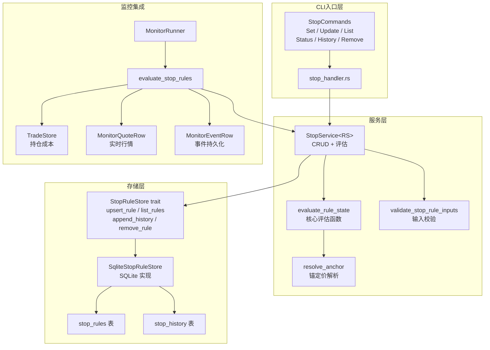
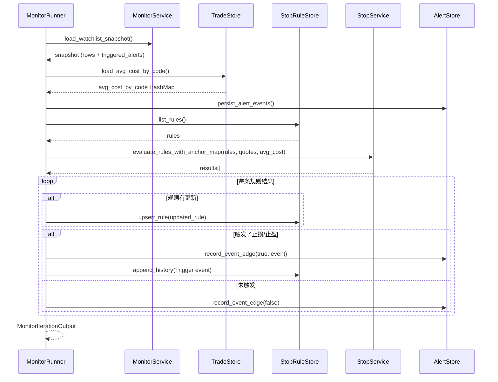

止盈止损（Stop）服务是 Quantix 风控体系中的**实时价格监控层**，负责为自选池中的股票设定止损/止盈/追踪止损规则，并在行情数据到来时持续评估是否触发阈值。该服务以 `StopService<RS>` 为核心，采用**存储无关的泛型设计**（`StopRuleStore` trait），底层通过 SQLite 持久化规则与历史事件。在运行时，`MonitorRunner` 将其嵌入监控循环，结合实时行情与持仓成本，完成批量评估、状态回写和事件推送的完整闭环。

Sources: [mod.rs](src/stop/mod.rs#L1-L16), [service.rs](src/stop/service.rs#L1-L21)

## 架构全景

止盈止损服务在整体架构中位于**监控模块**与**风控规则引擎**的交汇点。下方 Mermaid 图展示了从 CLI 命令入口、Service 层规则管理、实时评估逻辑到 Storage 持久化的完整数据流，以及与 MonitorRunner、TradeStore 的集成关系。



Sources: [service.rs](src/stop/service.rs#L226-L348), [storage.rs](src/stop/storage.rs#L1-L14), [runner.rs](src/monitor/runner.rs#L27-L97)

## 核心数据模型

### StopRule —— 规则实体

`StopRule` 是止盈止损服务的**核心实体**，每条规则以股票代码（`code`）为主键，支持三种独立的阈值维度：

| 字段 | 类型 | 含义 |
|---|---|---|
| `stop_loss_price` | `Option<f64>` | 固定止损价（绝对价格） |
| `take_profit_price` | `Option<f64>` | 固定止盈价（绝对价格） |
| `stop_loss_pct` | `Option<f64>` | 止损百分比（基于锚定价） |
| `take_profit_pct` | `Option<f64>` | 止盈百分比（基于锚定价） |
| `trailing_pct` | `Option<f64>` | 追踪止损百分比（基于最高价） |
| `highest_price` | `Option<f64>` | 追踪止损期间的最高价（运行时维护） |
| `reference_price` | `Option<f64>` | 百分比规则的参考锚定价 |
| `last_triggered_at` | `Option<DateTime<Utc>>` | 最近一次触发时间 |

同一条规则中，**固定价格与百分比不能同时指定同一方向**（如 `stop_loss_price` 与 `stop_loss_pct` 互斥），**追踪止损与止损也不能共存**。但止损和止盈可以同时存在。

Sources: [models.rs](src/stop/models.rs#L8-L20)

### 触发类型与评估状态

**触发类型** `StopTriggerKind` 表示规则被触发时的具体原因，直接影响监控事件的分类：

| 枚举值 | 含义 | 对应 MonitorEventType |
|---|---|---|
| `Loss` | 固定止损价或百分比止损触发 | `StopLoss` |
| `Profit` | 固定止盈价或百分比止盈触发 | `StopProfit` |
| `TrailingLoss` | 追踪止损触发（从最高价回撤超限） | `TrailingStop` |

**评估状态** `StopEvalState` 描述规则在当前周期内的诊断结果：

| 枚举值 | 含义 | 典型场景 |
|---|---|---|
| `Armed` | 已就绪，有锚定价和行情，尚未触发 | 正常运行中 |
| `Triggered` | 已触发，当前价突破了阈值 | 需要关注或执行卖出 |
| `AnchorMissing` | 百分比规则缺少锚定价 | 未设 reference_price 且无持仓成本 |
| `QuoteMissing` | 缺少实时行情 | 行情数据源故障或代码不在自选池 |

Sources: [models.rs](src/stop/models.rs#L22-L28), [models.rs](src/stop/models.rs#L151-L158)

### 历史事件模型

`StopHistoryEvent` 完整记录了规则的**生命周期事件**，采用事件溯源（Event Sourcing）思路，每次 Set/Update/Remove/Trigger 都会追加一条带 UUID 的事件记录。`snapshot_json` 字段以 JSON 形式保存触发时的规则快照，支持后续审计与回溯分析。

Sources: [models.rs](src/stop/models.rs#L104-L115)

## 锚定价解析机制

百分比阈值规则需要一个**锚定价**来计算绝对阈值。锚定价的解析遵循**优先级链**：

1. **持仓成本**（`PositionCost`）：如果 `MonitorRunner` 从 `TradeStore` 获取到该代码的持仓平均成本，优先使用
2. **参考价**（`ReferencePrice`）：使用规则上手动设定的 `reference_price` 字段
3. **无锚定**（`None`）：两者都不可用时，百分比阈值无法计算，评估状态为 `AnchorMissing`

在 CLI 层，设置百分比规则时，系统通过 `resolve_stop_reference_price` 自动尝试获取参考价：先查实时行情价格，若不可用则查持仓成本，两者均失败则拒绝创建规则。这保证了百分比规则在创建时就具备有效的锚定价。

Sources: [service.rs](src/stop/service.rs#L350-L361), [shared_support.rs](src/cli/handlers/shared_support.rs#L89-L120)

## 实时评估引擎

`evaluate_rule_state` 是整个止盈止损服务的**决策核心**，这是一个纯函数，接收规则、当前价、持仓成本和观测时间，返回完整的评估状态。

### 阈值计算优先级

对于**止损方向**，阈值的计算存在明确的优先级链：

```mermaid
graph TD
    A[trailing_pct 是否设定?] -->|是| B[止损阈值 = highest_price × (1 - trailing_pct / 100)]
    A -->|否| C[stop_loss_price 是否设定?]
    C -->|是| D[止损阈值 = stop_loss_price]
    C -->|否| E[stop_loss_pct + 锚定价 是否可用?]
    E -->|是| F[止损阈值 = 锚定价 × (1 - stop_loss_pct / 100)]
    E -->|否| G[无止损阈值]
```

对于**止盈方向**，阈值计算相对简单：

```mermaid
graph TD
    A[take_profit_price 是否设定?] -->|是| B[止盈阈值 = take_profit_price]
    A -->|否| C[take_profit_pct + 锚定价 是否可用?]
    C -->|是| D[止盈阈值 = 锚定价 × (1 + take_profit_pct / 100)]
    C -->|否| E[无止盈阈值]
```

**关键设计决策**：当同时存在追踪止损和止损设置时，追踪止损**优先**。因为追踪止损在运行时会持续更新 `highest_price`，其阈值是动态的，能提供更紧的风险保护。

Sources: [service.rs](src/stop/service.rs#L226-L348)

### 追踪止损的状态演化

追踪止损的运行时行为体现了**有状态评估**的典型模式：

1. 每次评估时，将 `highest_price` 更新为 `max(历史最高价, 当前价)`
2. 计算追踪阈值 = `highest_price × (1 - trailing_pct / 100)`
3. 若当前价 ≤ 追踪阈值，触发 `TrailingLoss`
4. 若规则被更新（`highest_price` 变化），同步回写到存储层

例如设定 `trailing_pct = 5.0`，股票从 15.0 上涨到 20.0，阈值自动上移至 19.0（20.0 × 0.95）。当价格回落到 18.8 时触发止损，锁定 3.8 元的涨幅。

Sources: [service.rs](src/stop/service.rs#L248-L255)

### 触发判断逻辑

触发判断按以下顺序进行，**短路求值**——第一个匹配即返回：

| 优先级 | 条件 | 触发类型 |
|---|---|---|
| 1 | 存在追踪阈值 且 当前价 ≤ 阈值 | `TrailingLoss` |
| 2 | 存在止损阈值 且 当前价 ≤ 阈值 | `Loss` |
| 3 | 存在止盈阈值 且 当前价 ≥ 阈值 | `Profit` |

触发后，`last_triggered_at` 和 `updated_at` 都会被更新为当前观测时间。

Sources: [service.rs](src/stop/service.rs#L275-L322)

## Service 层 API

`StopService<RS>` 提供两组 API：**规则管理 CRUD** 和**评估查询**。泛型参数 `RS: StopRuleStore` 使其在测试中可注入 `FakeStopRuleStore`，在生产中使用 `SqliteStopRuleStore`。

### 规则管理方法

| 方法 | 功能 | 关键行为 |
|---|---|---|
| `set_rule()` | 创建或覆盖规则 | 输入校验 → upsert → 追加 Set 历史事件 |
| `update_rule()` | 局部更新规则 | 先读后合并（merge patch）→ upsert → 追加 Update 事件 |
| `remove_rule()` | 删除规则 | 删除后追加 Remove 历史事件（仅当规则存在时） |
| `list_rules()` | 列出所有规则 | 直接代理到 store |
| `get_rule()` | 查询单条规则 | 直接代理到 store |
| `history()` | 查询历史事件 | 支持按代码、日期、事件类型过滤 |

**输入校验规则**（`validate_stop_rule_inputs`）确保：

- 至少设置一个阈值条件（不能创建空规则）
- 固定价格与百分比互斥（同方向）
- 追踪止损与止损互斥
- 所有价格和百分比必须为有限正数
- 追踪百分比必须在 (0, 100) 区间内

Sources: [service.rs](src/stop/service.rs#L23-L127), [service.rs](src/stop/service.rs#L363-L407)

### Double-Option 更新模式

`StopRuleUpdate` 采用了 Rust 中经典的 **Double-Option 模式**（`Option<Option<f64>>`）来解决「未传递」与「清除为 None」的语义区分问题：

| `StopRuleUpdate` 字段值 | 含义 |
|---|---|
| `None` | 用户未传递此参数，保持原值 |
| `Some(Some(18.0))` | 用户设定了新值 18.0 |
| `Some(None)` | 用户显式清除该字段（通过 `--clear-loss` 等参数） |

合并逻辑在 `merge_stop_rule_patch` 中实现，通过 `unwrap_or` 回退到已有值。CLI 层通过 `patch_value(value, clear)` 辅助函数将 clap 解析结果转换为 Double-Option。

Sources: [models.rs](src/stop/models.rs#L125-L133), [service.rs](src/stop/service.rs#L409-L439), [shared_support.rs](src/cli/handlers/shared_support.rs#L48-L50)

### 评估方法

| 方法 | 签名 | 用途 |
|---|---|---|
| `evaluate_rule()` | 单条规则 + 单一价格 | CLI `status` 命令使用 |
| `evaluate_rules()` | 多条规则 + 行情列表 | 基础批量评估 |
| `evaluate_rules_with_anchor_map()` | 多条规则 + 行情 + 持仓成本映射 | MonitorRunner 使用，含锚定价 |
| `status_rows()` | 生成 `StopStatusRow` 列表 | CLI `status` 命令的完整状态视图 |

Sources: [service.rs](src/stop/service.rs#L129-L223)

## 存储层实现

### SQLite Schema

`SqliteStopRuleStore` 使用两张表存储数据：

**stop_rules 表**（规则主表）：

```sql
CREATE TABLE IF NOT EXISTS stop_rules (
    code TEXT PRIMARY KEY,
    stop_loss_price REAL,
    take_profit_price REAL,
    stop_loss_pct REAL,        -- 后期迁移新增
    take_profit_pct REAL,      -- 后期迁移新增
    trailing_pct REAL,
    highest_price REAL,
    reference_price REAL,      -- 后期迁移新增
    last_triggered_at TEXT,
    created_at TEXT NOT NULL,
    updated_at TEXT NOT NULL
);
```

**stop_history 表**（事件历史表）：

```sql
CREATE TABLE IF NOT EXISTS stop_history (
    id TEXT PRIMARY KEY,
    code TEXT NOT NULL,
    event_type TEXT NOT NULL,      -- set/update/remove/trigger
    trigger_kind TEXT,             -- loss/profit/trailing
    trigger_price REAL,
    anchor_price REAL,
    anchor_source TEXT,            -- position_cost/reference_price
    snapshot_json TEXT NOT NULL,   -- 规则快照
    created_at TEXT NOT NULL
);
```

历史表建有联合索引 `idx_stop_history_code_created_at` 和 `idx_stop_history_event_created_at`，支持按代码+时间、事件类型+时间的高效查询。

Sources: [storage.rs](src/stop/storage.rs#L15-L53)

### Schema 迁移机制

`ensure_stop_rule_schema_extensions` 方法通过 `PRAGMA table_info` 检测列是否存在，按需执行 `ALTER TABLE ADD COLUMN`。这一设计保证了从旧版数据库（不含 `stop_loss_pct`、`take_profit_pct`、`reference_price` 列）到新版本的平滑升级，无需手动迁移。

Sources: [storage.rs](src/stop/storage.rs#L98-L137)

### Upsert 语义

规则写入采用 `ON CONFLICT(code) DO UPDATE` 语句，实现了 **Insert-or-Replace** 语义。同一股票代码的规则完全覆盖写入，简化了 set/update 的存储层逻辑。

Sources: [storage.rs](src/stop/storage.rs#L298-L342)

## MonitorRunner 集成

`MonitorRunner<RW, RQ, SS, TS>` 是止盈止损服务在运行时的**编排器**，将行情获取、规则评估、状态回写和事件推送串联为一个完整的监控循环。

### run_once 生命周期



关键设计点：

- **边缘去重**（Event Edge Deduplication）：`record_event_edge` 通过 `source_key`（如 `stop_rule:000001`）追踪上一次触发状态，只有**状态转换**时（从未触发→触发，或从触发→未触发）才产生新事件，避免行情不变时的重复通知
- **状态回写**：评估后若规则发生变更（`highest_price` 更新或触发时间变化），立即 upsert 回存储层
- **持仓成本作为锚定**：`load_avg_cost_by_code` 从 `PaperTradeStore` 的 `account.positions` 中提取每个代码的 `avg_cost`，优先于 `reference_price` 使用

Sources: [runner.rs](src/monitor/runner.rs#L58-L104), [runner.rs](src/monitor/runner.rs#L178-L281)

## CLI 命令体系

止盈止损服务通过 `quantix stop` 子命令暴露给用户，采用 clap 的 `ArgGroup` 实现参数互斥和必选约束。

### 命令一览

| 子命令 | 功能 | 关键参数 |
|---|---|---|
| `stop set` | 创建规则 | `--loss` / `--profit` / `--loss-pct` / `--profit-pct` / `--trailing`（至少一个） |
| `stop update` | 更新规则 | 同上 + `--clear-loss` / `--clear-profit` 等清除参数 |
| `stop list` | 列出所有规则 | 无参数 |
| `stop status` | 查看实时状态 | `--code`（可选过滤） |
| `stop history` | 查询历史事件 | `--code` / `--date` / `--type` / `--limit` |
| `stop remove` | 删除规则 | `code`（必填） |

Sources: [monitor.rs](src/cli/commands/monitor.rs#L164-L295)

### set 命令的约束矩阵

`set` 命令通过 clap 的 `conflicts_with` 和 `ArgGroup` 声明了严格的参数互斥关系：

| 参数 | 与之互斥 | 原因 |
|---|---|---|
| `--loss` | `--loss-pct`，`--trailing` | 同方向不能两种模式 |
| `--profit` | `--profit-pct` | 同方向不能两种模式 |
| `--loss-pct` | `--loss`，`--trailing` | 与固定止损和追踪止损冲突 |
| `--trailing` | `--loss`，`--loss-pct` | 追踪止损是独立的止损策略 |

此外，使用百分比参数（`--loss-pct` 或 `--profit-pct`）时，handler 会自动调用 `resolve_stop_reference_price` 获取锚定价，确保规则创建时具备有效的计算基础。

Sources: [stop_handler.rs](src/cli/handlers/stop_handler.rs#L49-L89), [shared_support.rs](src/cli/handlers/shared_support.rs#L89-L120)

### 前置校验

所有 set/update 操作都会执行 `ensure_watchlist_contains_code`，验证目标股票代码是否在自选池中。这保证了止盈止损规则只针对用户关注的股票生效，避免因代码拼写错误产生无效规则。

Sources: [shared_support.rs](src/cli/handlers/shared_support.rs#L154-L161)

## StopRuleStore Trait 设计

`StopRuleStore` 是存储层的抽象接口，采用 `async_trait` 实现异步方法，要求实现 `Send + Sync`：

```rust
#[async_trait]
pub trait StopRuleStore: Send + Sync {
    async fn upsert_rule(&self, rule: StopRule) -> Result<StopRule>;
    async fn list_rules(&self) -> Result<Vec<StopRule>>;
    async fn get_rule(&self, code: &str) -> Result<Option<StopRule>>;
    async fn append_history(&self, event: StopHistoryEvent) -> Result<()>;
    async fn list_history(&self, filter: StopHistoryFilter) -> Result<Vec<StopHistoryEvent>>;
    async fn remove_rule(&self, code: &str) -> Result<bool>;
}
```

这一 trait 设计使得：生产环境使用 `SqliteStopRuleStore`（真实持久化），测试环境使用 `FakeStopRuleStore`（内存 HashMap），而 `StopService` 和 `MonitorRunner` 的核心逻辑完全不需要修改。`MonitorRunner` 的泛型签名 `MonitorRunner<RW, RQ, SS, TS>` 中 `SS: StopRuleStore + Clone` 体现了这一设计。

Sources: [types.rs](src/stop/service/types.rs#L1-L20)

## 延伸阅读

- **风控规则体系**：止盈止损是风控体系的一部分，完整的持仓/亏损/波动率/行业集中度规则请参阅 [风控规则体系（持仓/亏损/波动率/行业集中度）](18-feng-kong-gui-ze-ti-xi-chi-cang-yu-sun-bo-bo-dong-lu-xing-ye-ji-zhong-du)
- **监控告警体系**：止盈止损触发后的事件推送和通知链路请参阅 [监控告警体系与 Prometheus 指标导出](24-jian-kong-gao-jing-ti-xi-yu-prometheus-zhi-biao-dao-chu)
- **执行引擎**：触发止损后如何转化为实际卖出操作，请参阅 [ExecutionKernel 执行生命周期与风控评估](12-executionkernel-zhi-xing-sheng-ming-zhou-qi-yu-feng-kong-ping-gu)