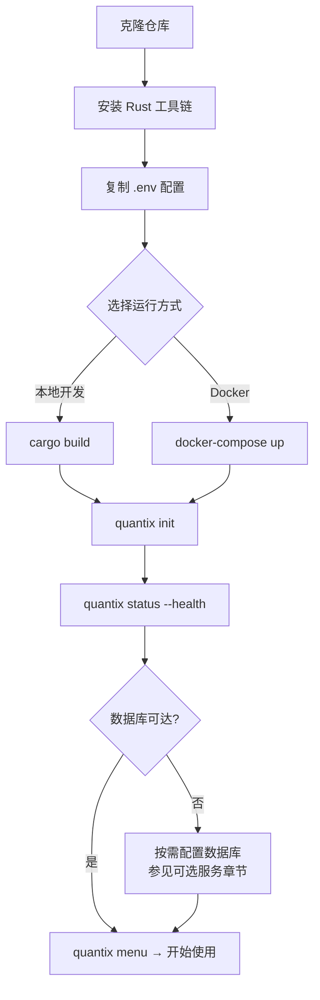

本文档是 **Quantix CLI** 的完整搭建指南。无论你是想在本地 Linux/WSL 环境直接编译运行，还是通过 Docker Compose 一键拉起整套基础设施，这里都有清晰的步骤和对应命令。阅读完毕后，你将能够独立完成从源码克隆到首次 CLI 命令执行的全流程，并理解项目中各类配置文件的作用范围。

Sources: [Cargo.toml](Cargo.toml#L1-L129), [src/main.rs](src/main.rs#L1-L24), [src/cli/commands/mod.rs](src/cli/commands/mod.rs#L49-L69)

## 环境前置要求

在动手之前，请确认你的开发环境满足以下最低要求。**Quantix 使用 Rust 2024 edition**，需要较新的 stable 工具链。数据库和外部服务按需启用——不配置也不影响项目编译和大部分本地功能的运行。

| 组件 | 最低版本 | 是否必须 | 用途说明 |
|------|---------|---------|---------|
| Rust (stable) | 1.85+ (edition 2024) | ✅ 必须 | 编译工具链 |
| Cargo | 随 Rust 安装 | ✅ 必须 | 包管理与构建 |
| PostgreSQL | 17+ | 可选 | 交易、风控、自选池等持久化 |
| ClickHouse | latest | 可选 | K线数据主存储（推荐） |
| Docker + Compose | 20.10+ | 可选 | 一键启动全套服务 |
| Zellij | 0.39+ | 可选 | 多窗格开发环境 |

验证 Rust 工具链是否就绪：

```bash
cargo --version
rustc --version
```

若以上命令不可用，请先通过 [rustup](https://rustup.rs/) 安装：

```bash
curl --proto '=https' --tlsv1.2 -sSf https://sh.rustup.rs | sh
source "$HOME/.cargo/env"
```

> **开发环境边界约定**：默认以 WSL/Linux 作为命令执行基线。Cursor/VS Code 可以作为主编辑器，但不能作为唯一执行路径——关键流程应能在纯 CLI 下完成。

Sources: [Cargo.toml](Cargo.toml#L4-L5), [docs/QUICKSTART.md](docs/QUICKSTART.md#L1-L30)

## 搭建流程总览

下面的流程图展示了从零开始的完整搭建路径。你可以根据需要选择 **本地开发模式** 或 **Docker 容器化模式**，两者共享同一份源码。



Sources: [src/cli/handlers/app_shell.rs](src/cli/handlers/app_shell.rs#L1-L130)

## 第一步：克隆与编译

**1. 克隆仓库**

```bash
git clone https://github.com/chengjon/quantix-rust.git
cd quantix-rust
```

**2. 编译项目**

项目使用 **多阶段缓存构建**——首次编译耗时较长（依赖下载 + 全量编译），后续增量编译极快：

```bash
# 开发模式编译（未优化，编译快）
cargo build

# 发布模式编译（LTO 优化，适合生产部署）
cargo build --release
```

编译成功后，二进制文件位于：
- Debug 版本：`target/debug/quantix`
- Release 版本：`target/release/quantix`

**3. 快速验证**

```bash
# 查看版本与帮助
cargo run -- --help

# 确认核心功能可达
cargo run -- status
```

> **Cargo 特性门控**：项目定义了几个可选 feature flag，默认已启用 `postgresql` 和 `tdengine-rest`。完整列表：
> - `default = ["postgresql", "tdengine-rest"]` — 默认启用
> - `tui` — 启用 TUI 界面（需要 `ratatui` + `crossterm`）
> - `tdengine-ws` — 启用 TDengine WebSocket 连接模式
> - `sqlite` — 启用 SQLite 后端支持

Sources: [Cargo.toml](Cargo.toml#L96-L105), [Cargo.toml](Cargo.toml#L113-L119)

## 第二步：配置环境

Quantix 的配置采用 **三层叠加** 策略：默认配置文件 → 自定义配置文件 → 环境变量覆盖。所有外部服务连接信息都可以通过 `.env` 文件统一管理。

### 环境变量配置

将项目根目录的 `.env.example` 复制为 `.env`，按需填写：

```bash
cp .env.example .env
```

`.env` 文件按功能域分为以下几个区域：

| 配置域 | 关键变量 | 用途 |
|--------|---------|------|
| **数据库** | `CLICKHOUSE_URL`, `CLICKHOUSE_DB` | ClickHouse K线主存储连接 |
| **数据库** | `POSTGRES_HOST`, `POSTGRES_DB` | PostgreSQL 关系型存储连接 |
| **数据源** | `TDX_HOSTS`, `TDX_PORT` | 通达信行情服务器地址 |
| **Bridge** | `QUANTIX_BRIDGE_BASE_URL` | Windows Bridge 网关地址 |
| **通知** | `WEBHOOK_URL`, `FEISHU_WEBHOOK_URL` 等 | 多渠道通知推送 |
| **AI 决策** | `LLM_PROVIDER`, `DEEPSEEK_API_KEY` 等 | LLM 模型接入 |
| **新闻** | `TAVILY_API_KEY`, `SERPAPI_API_KEY` 等 | 新闻搜索 API |

> **核心原则**：所有外部服务都是 **按需启用**。不配置 PostgreSQL 不影响编译，不配置 Bridge 不影响本地策略回测。只有在你要验证对应功能时才需要配置相关环境变量。

Sources: [.env.example](.env.example#L1-L105)

### 配置文件体系

项目内置了多份 TOML 配置文件，位于 `config/` 目录：

```
config/
├── default.toml       # 运行时默认配置（数据库、数据源、交易时段、通知）
├── ai.toml            # AI 决策模块配置（LLM 提供商、模型、温度等）
├── news.toml          # 新闻搜索模块配置（Tavily/SerpAPI/博查）
├── holidays.json      # A股节假日日历
├── clippy.toml        # Clippy 代码检查配置
├── rustfmt.toml       # 代码格式化配置
├── systemd/           # systemd 服务单元文件
└── zellij/            # Zellij 多窗格布局
```

`config/default.toml` 是主配置文件，定义了数据库连接、数据源参数、交易时段和通知渠道的默认值。`CliRuntime::load()` 在启动时会自动读取环境变量，覆盖默认配置中的对应值。

Sources: [config/default.toml](config/default.toml#L1-L87), [config/ai.toml](config/ai.toml#L1-L72), [config/news.toml](config/news.toml#L1-L57), [src/core/runtime.rs](src/core/runtime.rs#L77-L100)

### 运行时数据目录

`quantix init` 命令会在 `~/.quantix/` 下自动创建各模块的数据目录。每个路径都可以通过对应的环境变量覆盖：

| 模块 | 默认路径 | 环境变量覆盖 |
|------|---------|-------------|
| 自选池 | `~/.quantix/watchlist/watchlist.json` | `QUANTIX_WATCHLIST_PATH` |
| 模拟交易 | `~/.quantix/trade/paper_trade.json` | `QUANTIX_TRADE_PATH` |
| 风控状态 | `~/.quantix/risk/risk_state.json` | `QUANTIX_RISK_PATH` |
| 监控告警 | `~/.quantix/monitor/alerts.db` | `QUANTIX_MONITOR_DB_PATH` |
| 策略配置 | `~/.quantix/strategy/config.json` | `QUANTIX_STRATEGY_CONFIG_PATH` |
| 策略运行时 | `~/.quantix/strategy/runtime.db` | `QUANTIX_STRATEGY_RUNTIME_DB_PATH` |
| 执行配置 | `~/.quantix/execution/config.json` | `QUANTIX_EXECUTION_CONFIG_PATH` |

Sources: [src/core/runtime.rs](src/core/runtime.rs#L12-L20), [src/core/runtime.rs](src/core/runtime.rs#L120-L260)

## 第三步：初始化与首次运行

### 执行初始化

```bash
cargo run -- init
```

`quantix init` 会依次完成以下操作：

1. **验证配置目录** — 确认 `config/` 存在或创建
2. **加载运行时配置** — 读取 ClickHouse / MySQL / Bridge 连接参数
3. **创建数据目录** — 在 `~/.quantix/` 下初始化各模块路径
4. **初始化计算引擎** — 配置 Polars 线程池
5. **连通性探测** — 异步检测 ClickHouse、MySQL、Bridge 是否可达

初始化完成后，你会看到类似以下输出：

```
🚀 初始化 Quantix CLI v0.1.0

  ✅ 配置目录已存在: ../config

  ⚙️  加载运行时配置...
    ClickHouse: http://localhost:8123 db=quantix
    MySQL:      mysql://127.0.0.1:3306 db=mystocks
    Bridge:     http://127.0.0.1:17580

  🔧 初始化 Polars 计算引擎... ✅ (8 线程)

  🌐 数据库连通性探测...
    ✅ ClickHouse - 可达
    ⚠️  MySQL - 不可达
    ⚠️  Bridge - 不可达

✅ 初始化完成！
```

> 即使部分外部服务不可达，初始化依然会成功。不可达的服务会在后续使用对应功能时报出具体错误。

Sources: [src/cli/handlers/app_shell.rs](src/cli/handlers/app_shell.rs#L3-L127)

### 健康检查

```bash
cargo run -- status --health
```

该命令会尝试连接 ClickHouse 并报告连接状态。你也可以直接进入交互式菜单开始探索：

```bash
cargo run -- menu
```

交互菜单提供了六个入口，涵盖数据查询、策略运行、回测分析、任务管理、技术指标计算和数据导出，所有操作都有引导式提示。

Sources: [src/cli/handlers/app_shell.rs](src/cli/handlers/app_shell.rs#L129-L200), [src/cli/handlers/app_shell.rs](src/cli/handlers/app_shell.rs#L475-L503)

## 第四步（可选）：Docker 容器化启动

如果你想用 Docker 一键拉起完整基础设施（应用 + 数据库 + 监控），项目提供了完善的 Docker Compose 配置。

### 开发环境

```bash
docker-compose up -d
```

这会启动以下服务：

| 服务 | 端口 | 说明 |
|------|------|------|
| **quantix-app** | 8080 | Quantix CLI 应用 |
| **postgres** | 5432 | PostgreSQL 17 数据库 |
| **clickhouse** | 8123 / 9000 | ClickHouse 列式数据库 |
| **prometheus** | 9090 | Prometheus 指标采集 |
| **grafana** | 3000 | Grafana 监控面板 |
| **loki** | 3100 | Loki 日志聚合 |
| **promtail** | — | Promtail 日志采集 |
| **pgadmin** | 5050 | PostgreSQL 管理工具（可选，需 `--profile tools`） |

首次启动会自动执行数据库初始化脚本：
- `scripts/init-postgres.sql` — 创建 PostgreSQL 扩展、优化参数
- `scripts/init-clickhouse.sql` — 创建 ClickHouse 表结构（stock_info / kline_data / stock_realtime_quotes / gbbq_events / limit_up_events）

### 生产环境

```bash
# 必须通过环境变量设置密码
export POSTGRES_PASSWORD=your_secure_password
export CLICKHOUSE_PASSWORD=your_secure_password
export GRAFANA_ADMIN_PASSWORD=your_secure_password
export VERSION=latest

docker-compose -f docker-compose.yml -f docker-compose.prod.yml up -d
```

生产配置在开发配置基础上增加了资源限制、重启策略、日志轮转和 Traefik 反向代理标签。

Sources: [docker-compose.yml](docker-compose.yml#L1-L200), [docker-compose.prod.yml](docker-compose.prod.yml#L1-L60), [Dockerfile](Dockerfile#L1-L77), [scripts/init-clickhouse.sql](scripts/init-clickhouse.sql#L1-L94), [scripts/init-postgres.sql](scripts/init-postgres.sql#L1-L41)

## 常用 CLI 命令速查

项目提供了丰富的 CLI 子命令。以下是按使用频率排列的核心命令：

| 场景 | 命令 | 说明 |
|------|------|------|
| 初始化 | `quantix init` | 创建目录、加载配置、探测连通性 |
| 交互菜单 | `quantix menu` | 引导式六菜单入口 |
| 健康检查 | `quantix status --health` | 检测数据库连接状态 |
| 数据查询 | `quantix data query --code 000001 --period 1d` | 查询K线数据 |
| 策略列表 | `quantix strategy list` | 查看已注册策略 |
| 策略回测 | `quantix strategy run -n ma_cross --code 000001` | 运行均线交叉策略 |
| Paper 交易 | `quantix strategy run -n ma_cross --mode paper --code 000001` | 模拟盘运行 |
| 技术指标 | `quantix analyze indicators --code 000001 --indicators ma5,ma20,rsi14` | 计算技术指标 |
| 信号守护 | `quantix strategy daemon run --once` | 单轮信号扫描 |
| 风控评估 | `quantix risk status` | 查看当前风控状态 |
| 自选池 | `quantix watchlist list` | 查看自选股列表 |
| 任务调度 | `quantix task start` | 前台启动预置定时任务 |

Sources: [src/cli/commands/mod.rs](src/cli/commands/mod.rs#L69-L200), [docs/QUICKSTART.md](docs/QUICKSTART.md#L98-L170)

## 开发辅助工具

项目内置了多个开发辅助脚本，帮助你提高日常开发效率。

### 热重载监控

```bash
# 需要 cargo-watch（自动安装）
./scripts/dev/watch.sh
```

该脚本监控 `src/` 目录变更，自动执行 **编译 → 测试 → Clippy 检查** 三步流程，延迟 0.5 秒触发，适合持续开发时使用。

Sources: [scripts/dev/watch.sh](scripts/dev/watch.sh#L1-L37)

### 多窗格开发环境

项目提供了 Zellij 多窗格布局，一键启动预配置的开发工作区：

```bash
# 安装 Zellij（仅首次）
./scripts/zellij/install.sh

# 启动默认工作区
./scripts/zellij/start-session.sh

# 启动指定布局
./scripts/zellij/start-session.sh quantix main        # 主工作区
./scripts/zellij/start-session.sh monitor monitor     # 监控工作区
./scripts/zellij/start-session.sh backtest backtest   # 回测工作区
./scripts/zellij/start-session.sh dev dev             # 开发工作区
```

安装脚本会自动创建 Shell 别名（`qz`, `qz-main`, `qz-monitor` 等），添加到 `.bashrc` / `.zshrc`。

Sources: [scripts/zellij/install.sh](scripts/zellij/install.sh#L1-L80), [scripts/zellij/start-session.sh](scripts/zellij/start-session.sh#L1-L50)

### Feature 验证脚本

```bash
./scripts/verify_features.sh
```

这是一个全面的冒烟测试脚本，验证 **编译、CLI 命令可达性、本地功能、外部依赖** 四大类别。输出 PASS / WARN / FAIL 汇总报告，并自动记录到 `logs/` 目录。

Sources: [scripts/verify_features.sh](scripts/verify_features.sh#L1-L70)

### systemd 服务管理

对于生产环境，项目提供了三个 systemd 服务单元：

| 服务名 | 说明 |
|--------|------|
| `quantix-data-collector` | 数据采集服务 |
| `quantix-strategy-runner` | 策略运行服务 |
| `quantix-task-scheduler` | 任务调度服务 |

通过 `scripts/runtime/services.sh` 管理服务生命周期：

```bash
# 启动策略运行服务
./scripts/runtime/services.sh start strategy-runner

# 查看所有服务状态
./scripts/runtime/services.sh status-all

# 查看实时日志
./scripts/runtime/services.sh logs data-collector
```

Sources: [config/systemd/quantix-strategy-runner.service](config/systemd/quantix-strategy-runner.service#L1-L46), [scripts/runtime/services.sh](scripts/runtime/services.sh#L1-L50)

## 提交前质量检查

每次提交代码前，请执行以下四步质量检查。这也是 CI 流水线的核心检查项：

```bash
# 1. 代码格式化
cargo fmt

# 2. 代码质量检查（Clippy 禁止所有警告）
cargo clippy --all-targets --all-features -- -D warnings

# 3. 运行测试
cargo test --lib --all-features

# 4. 安全审计
cargo audit
```

项目使用 GitHub Actions 自动执行以上检查，包含三条流水线：
- **CI** (`ci.yml`) — lint + test + security，所有 PR 必须通过
- **Docker** (`docker.yml`) — 构建并推送 Docker 镜像
- **Audit** (`audit.yml`) — 依赖安全审计

Sources: [.github/workflows/ci.yml](.github/workflows/ci.yml#L1-L60)

## 常见问题排查

| 问题现象 | 可能原因 | 解决方案 |
|----------|---------|---------|
| `cargo build` 报 edition 2024 错误 | Rust 工具链版本过低 | `rustup update stable` 升级到 1.85+ |
| sqlx future-incompat 警告 | 上游 sqlx 0.7.4 已知问题 | 不影响编译，已通过 `.cargo/config.toml` 抑制 |
| `quantix init` 显示数据库不可达 | PostgreSQL/ClickHouse 未启动 | 按需启动：`docker-compose up -d postgres clickhouse` |
| Bridge 不可达 | Windows Bridge 未运行 | 仅在使用 TDX 实时行情或 QMT 预览时需要，可忽略 |
| `cargo test` 失败 | 缺少数据库服务 | 集成测试需要 PostgreSQL 和 ClickHouse 运行中；单元测试无此依赖 |
| 编译时间过长 | 首次全量编译含所有依赖 | 后续增量编译会显著加快；可用 `cargo check` 代替 `cargo build` 快速验证 |

Sources: [.cargo/config.toml](.cargo/config.toml#L1-L6), [.github/workflows/ci.yml](.github/workflows/ci.yml#L18-L22)

## 下一步

搭建完成后，建议按以下顺序深入阅读项目文档：

1. **[项目架构全景](3-xiang-mu-jia-gou-quan-jing)** — 理解整体模块划分和数据流向
2. **[CLI 命令体系与交互流程](4-cli-ming-ling-ti-xi-yu-jiao-hu-liu-cheng)** — 掌握完整的命令树和参数体系
3. **[配置管理与多环境加载机制](5-pei-zhi-guan-li-yu-duo-huan-jing-jia-zai-ji-zhi)** — 深入了解三层配置叠加的底层实现