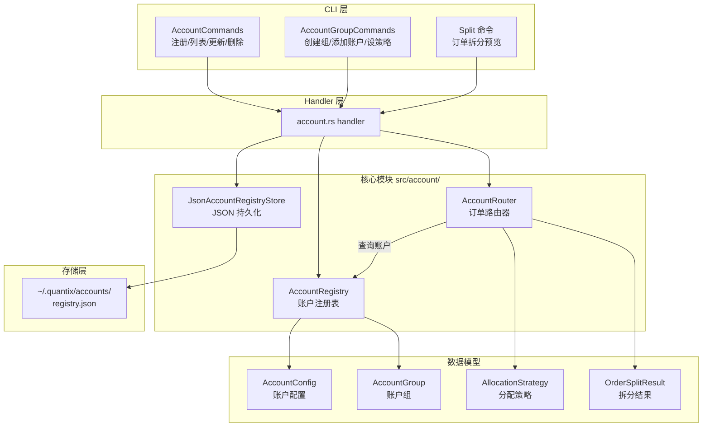
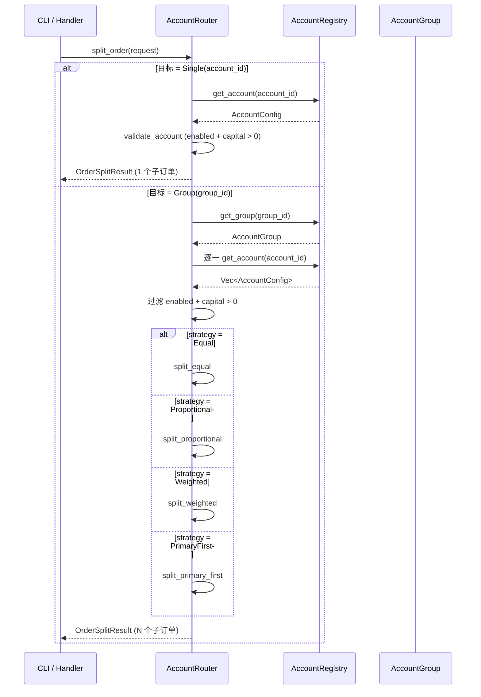

Quantix 的 **账户管理模块**（`src/account/`）提供了一套完整的多账户生命周期管理、账户组编排和智能订单拆分路由机制。该模块以 `AccountRegistry`（注册表）为中枢、`AccountGroup`（账户组）为聚合单元、`AccountRouter`（路由器）为决策引擎，实现了从单账户 CRUD 到多账户协同下单的完整链路。整个模块通过 `Arc<RwLock<...>>` 实现异步并发安全，并通过 JSON 文件持久化到 `~/.quantix/accounts/registry.json`。

Sources: [mod.rs](src/account/mod.rs#L1-L21), [lib.rs](src/lib.rs#L6-L17)

## 模块架构总览

模块由四个核心文件组成，各司其职、边界清晰：

| 文件 | 职责 | 核心类型 |
|------|------|----------|
| `models.rs` | 数据模型定义 | `AccountConfig`, `AccountGroup`, `AllocationStrategy`, `OrderSplitRequest` |
| `registry.rs` | 账户注册表（CRUD + 查询） | `AccountRegistry` |
| `router.rs` | 智能订单拆分路由 | `AccountRouter` |
| `storage.rs` | 持久化存储（JSON 文件） | `JsonAccountRegistryStore` |

以下 Mermaid 图展示了四个组件之间的协作关系。阅读此图需要理解基本的异步并发模型（`Arc<RwLock>`）和策略模式（`AllocationStrategy` 枚举分发）：



Sources: [mod.rs](src/account/mod.rs#L14-L20), [models.rs](src/account/models.rs#L1-L8)

## 账户类型与配置模型

**AccountType** 枚举定义了三种账户类型，每种类型对应一个默认的执行适配器：

| 账户类型 | 说明 | 默认适配器 | 使用场景 |
|----------|------|-----------|----------|
| `Paper` | 模拟交易账户 | `paper` | 策略验证、回测模拟 |
| `Live` | 实盘交易账户 | `qmt_live` | 通过 QMT 桥接实盘交易 |
| `MockLive` | 模拟实盘账户 | `mock_live` | 接近实盘环境的模拟交易 |

**AccountConfig** 是账户的完整配置模型，包含以下关键字段：

- **`account_id`**: 唯一标识符，注册时由用户指定
- **`account_type`**: 账户类型，决定默认适配器
- **`adapter_name`**: 实际执行适配器名称，可覆盖默认值
- **`initial_capital`**: 初始资金（`Decimal` 精度），**必须大于零**
- **`enabled`**: 启用/禁用开关，禁用的账户不参与订单路由
- **`metadata`**: `HashMap<String, serde_json::Value>` 扩展元数据，用于存储任意附加信息

AccountConfig 采用 Builder 模式进行链式配置：

```rust
let config = AccountConfig::new("my-account".into(), AccountType::Paper, dec!(500000))
    .with_name("我的模拟账户")
    .with_adapter("paper");
```

注册表在注册和更新账户时会调用 `validate_account_config()` 校验初始资金必须为正值，否则返回错误。

Sources: [models.rs](src/account/models.rs#L10-L114), [registry.rs](src/account/registry.rs#L270-L279)

## 账户注册表（AccountRegistry）

`AccountRegistry` 是整个模块的中枢数据结构，负责管理所有账户配置和账户组的生命周期。它内部使用 `Arc<RwLock<AccountRegistryInner>>` 实现异步并发安全——读操作获取读锁（`read().await`），写操作获取写锁（`write().await`）。

**核心能力分为三大类**：

**账户管理**：`register_account`、`update_account`、`unregister_account`、`get_account`、`list_accounts`、`list_accounts_by_type`、`list_enabled_accounts`。其中 `register_account` 会拒绝重复 ID 的注册，`update_account` 会拒绝不存在的账户更新。

**默认账户机制**：通过 `default_account_id` 字段维护一个默认账户，`set_default_account` 要求目标账户必须已注册。当策略或交易系统未指定账户时，默认账户充当 fallback。

**账户组管理**：`create_group`、`get_group`、`delete_group`、`add_account_to_group`、`remove_account_from_group`、`set_group_allocation_strategy`、`list_groups`、`get_account_groups`。向组添加账户时会先验证账户存在性，`get_account_groups` 可以反向查询某个账户所属的所有组。

Sources: [registry.rs](src/account/registry.rs#L1-L268)

## 账户组与分配策略

**AccountGroup** 是多个账户的逻辑聚合单元，核心由三部分组成：

- **`account_ids`**: 组内账户 ID 列表，`add_account` 会自动去重
- **`allocation_strategy`**: 资金分配策略，决定订单如何拆分
- **时间戳**: `created_at`/`updated_at` 用于审计追踪

**AllocationStrategy** 枚举定义了四种分配策略：

| 策略 | 行为 | 适用场景 |
|------|------|----------|
| `Equal` | 平均分配数量到每个账户，余数分配给前 N 个账户 | 均匀风险分散 |
| `Proportional` | 按各账户 `initial_capital` 占总资金的比例分配 | 按资金量加权 |
| `Weighted(HashMap)` | 按自定义权重比例分配 | 精细化控制分配比例 |
| `PrimaryFirst { primary_account_id }` | 全部分配给主账户，主账户不可用时退化为平均分配 | 主从模式，备用切换 |

Sources: [models.rs](src/account/models.rs#L116-L175)

## 智能订单路由（AccountRouter）

`AccountRouter` 是订单拆分的决策引擎，持有 `AccountRegistry` 的引用，通过 `split_order` 方法将一个订单请求（`OrderSplitRequest`）拆分为多个子订单（`Vec<SplitOrder>`）。

**路由流程**如下面的 Mermaid 时序图所示：



**订单拆分的关键数据模型**：

- **`OrderSplitRequest`**: 输入，包含 `symbol`（股票代码）、`side`（买卖方向）、`total_quantity`（总数量）、`price`（可选价格，`None` 为市价）、`target`（`Single` 或 `Group`）
- **`SplitTarget`**: 枚举，`Single(String)` 指向单个账户，`Group(String)` 指向账户组
- **`SplitOrder`**: 输出的子订单，包含 `account_id`、`quantity`、`price`
- **`OrderSplitResult`**: 完整结果，保留原始请求引用、子订单列表和实际使用的策略

**四种拆分算法的数值处理**：

1. **Equal**: `base_qty = total / n`，余数 `total % n` 逐个分配给前 `remainder` 个账户
2. **Proportional**: `qty_i = total × (capital_i / total_capital)`，不足 1 股的舍去，剩余分配给第一个账户
3. **Weighted**: `qty_i = total × (weight_i / total_weight)`，同上余数处理
4. **PrimaryFirst**: 全量分配给主账户；若主账户不在启用列表中，退化为 Equal

所有拆分算法都保证 `split.quantity > 0` 的过滤——数量为零的分配会被静默跳过。路由前还会调用 `get_enabled_group_accounts` 过滤掉禁用账户和资金为零的账户。

Sources: [router.rs](src/account/router.rs#L1-L322)

## 持久化存储

模块使用 **trait + 实现** 的经典分层进行持久化。`AccountRegistryStore` trait 定义了 `load` 和 `save` 两个异步方法，`JsonAccountRegistryStore` 是其默认实现：

**存储路径**：`~/.quantix/accounts/registry.json`（由 `dirs::home_dir()` 确定）

**数据格式（`AccountRegistryData`）**：
```json
{
  "version": 1,
  "accounts": {
    "acc-1": { "account_id": "acc-1", "account_type": "paper", ... }
  },
  "groups": {
    "group-1": { "group_id": "group-1", "allocation_strategy": "equal", ... }
  },
  "default_account_id": "acc-1"
}
```

**缓存机制**：`JsonAccountRegistryStore` 内部维护一个 `Arc<RwLock<Option<AccountRegistryData>>>` 缓存。每次 `load` 和 `save` 都会更新缓存，`refresh_cache` 和 `get_cached` 提供缓存级别的操作。文件不存在时 `load` 返回 `Ok(None)`。

**加载/保存辅助函数**：`load_registry` 从存储加载数据并构建 `AccountRegistry` 实例（空存储时返回空注册表），`save_registry` 从注册表导出数据并持久化。这两个函数是 CLI handler 层与存储层之间的桥梁。

Sources: [storage.rs](src/account/storage.rs#L1-L164)

## CLI 命令体系

账户管理通过 `quantix account` 命令族暴露给用户，分为**账户命令**和**账户组命令**两层子命令结构：

### 账户命令（AccountCommands）

| 命令 | 说明 | 关键参数 |
|------|------|----------|
| `register` | 注册新账户 | `--id`, `--account-type`, `--capital`, `--adapter` |
| `list` | 列出所有账户 | `--account-type` (过滤), `--enabled-only` |
| `show` | 查看账户详情 | `--id` |
| `update` | 更新账户配置 | `--id`, `--enable/--disable`, `--capital`, `--adapter` |
| `remove` | 删除账户 | `--id` |
| `default` | 设置默认账户 | `--id` |
| `summary` | 资金聚合视图 | 无参数，按类型汇总资金 |
| `split` | 订单拆分预览 | `--code`, `--side`, `--quantity`, `--target-type`, `--target-id`, `--price` |

### 账户组命令（AccountGroupCommands）

| 命令 | 说明 | 关键参数 |
|------|------|----------|
| `create` | 创建账户组 | `--id`, `--name`, `--strategy` |
| `list` | 列出所有账户组 | 无参数 |
| `show` | 查看账户组详情 | `--id` |
| `remove` | 删除账户组 | `--id` |
| `add-account` | 向组添加账户 | `--group-id`, `--account-id` |
| `remove-account` | 从组移除账户 | `--group-id`, `--account-id` |
| `set-strategy` | 设置分配策略 | `--group-id`, `--strategy`, `--primary-account` |

**CLI 工作流的关键模式**：每个命令处理器都遵循 **"加载注册表 → 执行操作 → 保存注册表"** 的三步模式。`JsonAccountRegistryStore::default_store()` 创建默认存储实例，`load_or_create_registry` 加载或初始化空注册表，操作完成后立即 `save_registry` 持久化。

`summary` 命令提供跨账户的资金聚合视图，按 Paper/Live/MockLive 三类汇总总资金和账户数，并列出所有账户组及其聚合资金。`split` 命令是订单路由的 **预览功能**——只展示拆分结果但不执行实际交易，用于验证分配策略的合理性。

Sources: [account.rs](src/cli/commands/account.rs#L1-L185), [account.rs](src/cli/handlers/account.rs#L1-L663)

## 设计要点与扩展考量

**并发安全设计**：`AccountRegistry` 使用 `Arc<RwLock<AccountRegistryInner>>` 实现多读单写的并发控制。所有公开方法都是 `async` 的，通过 `.await` 获取锁。在 `add_account_to_group` 中甚至出现了先获取读锁验证账户存在、再 `drop` 读锁、重新获取写锁的两阶段锁模式，避免在持有写锁时执行不需要写入的验证逻辑。

**防御性校验**：系统在多个层面进行资金校验——注册和更新时由 `validate_account_config` 拦截非正资金；路由时由 `validate_account` 再次验证单账户的可用性；组路由时由 `get_enabled_group_accounts` 过滤掉 `capital ≤ 0` 的账户。这种多层校验确保即使绕过注册表直接构造数据，路由层也不会分配到无效账户。

**余数处理策略**：所有涉及整数除法的分配算法（Equal、Proportional、Weighted）都采用 **余数累加到第一个账户** 的策略，而非四舍五入。这保证了拆分后总量严格等于请求总量，避免了份额泄漏。

**trait 抽象**：`AccountRegistryStore` trait 为未来扩展留出空间——当前仅有 JSON 文件实现，但 trait 使得引入数据库存储或远程服务存储成为可能，无需修改上层逻辑。

Sources: [registry.rs](src/account/registry.rs#L183-L201), [router.rs](src/account/router.rs#L126-L165)

## 延伸阅读

- 了解订单拆分后如何进入实际执行生命周期：[ExecutionKernel 执行生命周期与风控评估](12-executionkernel-zhi-xing-sheng-ming-zhou-qi-yu-feng-kong-ping-gu)
- 了解风控规则如何对账户交易进行约束：[风控规则体系（持仓/亏损/波动率/行业集中度）](18-feng-kong-gui-ze-ti-xi-chi-cang-yu-sun-bo-dong-lu-xing-ye-ji-zhong-du)
- 了解 Paper/MockLive 执行适配器如何承接路由后的子订单：[Paper/MockLive 执行适配器与运行时状态持久化](13-paper-mocklive-zhi-xing-gua-pei-qi-yu-yun-xing-shi-zhuang-tai-chi-jiu-hua)
- 了解 CLI 命令体系与交互流程的完整概览：[CLI 命令体系与交互流程](4-cli-ming-ling-ti-xi-yu-jiao-hu-liu-cheng)