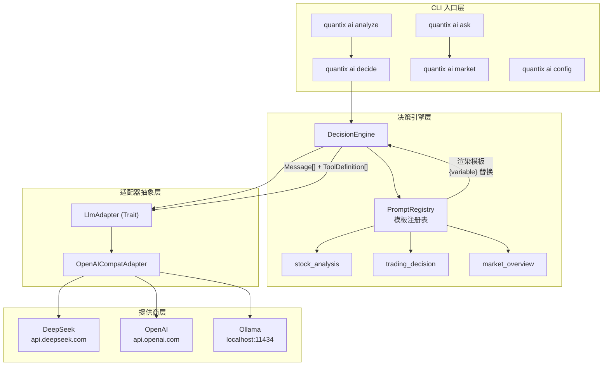

Quantix 的 AI 决策模块为量化交易系统提供了 **统一的 LLM 调用抽象层**，将多模型适配、Prompt 模板管理与交易决策引擎整合为一个内聚的子系统。该模块支持 DeepSeek、OpenAI、Gemini、Anthropic、Ollama 五大类 LLM 提供商，并通过 OpenAI 兼容协议统一通信接口，使上层业务代码无需关心底层模型差异。模块的核心设计遵循 **Trait 抽象 → 适配器实现 → 决策引擎编排** 三层架构，任何新增的 LLM 提供商只需实现 `LlmAdapter` trait 即可无缝接入。

Sources: [mod.rs](src/ai/mod.rs#L1-L22)

## 模块架构总览

AI 决策模块位于 `src/ai/` 目录下，由五个核心子模块和一个模板资源目录组成，每一层职责明确：

```
src/ai/
├── mod.rs              # 模块入口，统一导出公共 API
├── types.rs            # 统一类型系统（Message、ToolCall、LLMResponse 等）
├── adapter.rs          # LlmAdapter trait 定义 + LlmConfig 配置管理
├── providers.rs        # Provider 子模块注册
├── providers/
│   └── openai_compat.rs  # OpenAI 兼容协议适配器（覆盖所有提供商）
├── prompt.rs           # Prompt 模板注册表与渲染引擎
├── templates/          # Markdown 模板文件（通过 include_str! 编译时嵌入）
│   ├── stock_analysis_system.md
│   ├── stock_analysis_user.md
│   ├── decision_system.md
│   ├── decision_user.md
│   ├── market_overview_system.md
│   └── market_overview_user.md
└── decision.rs         # DecisionEngine 决策引擎
```

Sources: [mod.rs](src/ai/mod.rs#L13-L17), [get_dir_structure](src/ai)

### 架构分层与数据流

下面的 Mermaid 图展示了模块内部的调用链路与数据流向。理解此图的前提是：所有 LLM 提供商共享同一套 **OpenAI Chat Completions 兼容协议**，差异仅体现在 base_url 和认证方式上。



Sources: [decision.rs](src/ai/decision.rs#L35-L39), [adapter.rs](src/ai/adapter.rs#L12-L36), [prompt.rs](src/ai/prompt.rs#L9-L12)

## 统一类型系统

**类型层**（`types.rs`）定义了跨所有 LLM 提供商的统一数据模型，是整个模块的数据契约。其设计确保了无论底层使用何种模型，上层代码始终面对相同的 Rust 类型签名。

### 核心类型一览

| 类型 | 用途 | 关键字段 |
|------|------|----------|
| `Message` | 对话消息单元 | `role`, `content`, `tool_calls`, `tool_call_id`, `reasoning_content` |
| `MessageRole` | 消息角色枚举 | `System` / `User` / `Assistant` / `Tool` |
| `LLMResponse` | LLM 返回的标准化响应 | `content`, `tool_calls`, `reasoning_content`, `usage`, `provider`, `model` |
| `ToolCall` | LLM 发起的函数调用请求 | `id`, `name`, `arguments`, `thought_signature` |
| `ToolDefinition` | 工具函数定义 | `name`, `description`, `parameters`（JSON Schema） |
| `LLMCallOptions` | 调用参数配置 | `temperature`, `max_tokens`, `timeout_secs`, `enable_thinking` |
| `LLMProvider` | 提供商标识枚举 | `OpenAI` / `DeepSeek` / `Gemini` / `Anthropic` / `Ollama` / `Custom` |
| `TokenUsage` | Token 消耗统计 | `prompt_tokens`, `completion_tokens`, `total_tokens` |

`Message` 类型通过工厂方法（`Message::system()`, `Message::user()`, `Message::assistant()`, `Message::assistant_with_tools()`, `Message::tool_response()`）简化消息构建，避免外部代码直接操作结构体字段。`reasoning_content` 字段专门为 DeepSeek-R1 等推理模型保留，承载模型输出的链式思维内容。

Sources: [types.rs](src/ai/types.rs#L1-L200)

## LLM 适配器抽象

**适配器层**（`adapter.rs`）定义了 `LlmAdapter` trait——这是所有 LLM 提供商接入的核心抽象。trait 使用 `async_trait` 标注以支持异步方法，并要求实现者满足 `Send + Sync` 约束，确保可安全地跨线程使用。

### LlmAdapter Trait 接口

```rust
#[async_trait]
pub trait LlmAdapter: Send + Sync {
    fn provider(&self) -> LLMProvider;         // 返回提供商标识
    fn is_available(&self) -> bool;             // 检查凭证是否就绪
    async fn complete(                          // 带工具的完整调用
        &self,
        messages: &[Message],
        tools: &[ToolDefinition],
        options: &LLMCallOptions,
    ) -> Result<LLMResponse>;
    async fn complete_text(                     // 纯文本调用（默认实现）
        &self,
        messages: &[Message],
        options: &LLMCallOptions,
    ) -> Result<LLMResponse>;
}
```

`complete_text` 提供了默认实现——将空工具列表传递给 `complete`，因此实现者只需关注 `complete` 方法即可。`is_available` 的判断逻辑因提供商而异：对于云服务（DeepSeek/OpenAI/Gemini/Anthropic），需要 API Key；对于本地 Ollama，仅需要 base_url 可达。

Sources: [adapter.rs](src/ai/adapter.rs#L12-L36)

### LlmConfig 配置管理

`LlmConfig` 是模块的配置中枢，通过 `from_env()` 方法从环境变量自动探测并构建所有可用的提供商配置。其核心设计思想是 **零配置启动**——只要设置了任何一个提供商的 API Key 环境变量，模块即可自动发现并使用该提供商。

| 环境变量 | 对应提供商 | 作用 |
|----------|-----------|------|
| `DEEPSEEK_API_KEY` | DeepSeek | 主 API Key，触发提供商注册 |
| `DEEPSEEK_BASE_URL` | DeepSeek | 可选，默认 `https://api.deepseek.com/v1` |
| `OPENAI_API_KEY` | OpenAI | 主 API Key |
| `OPENAI_BASE_URL` | OpenAI | 可选，支持代理/自定义端点 |
| `GEMINI_API_KEY` | Gemini | Google AI API Key |
| `ANTHROPIC_API_KEY` | Anthropic | Claude 系列 API Key |
| `OLLAMA_API_BASE` / `OLLAMA_HOST` | Ollama | 本地部署地址，默认 `http://localhost:11434` |
| `LLM_DEFAULT_MODEL` | 全局 | 覆盖默认模型名称 |
| `LLM_FALLBACK_MODELS` | 全局 | 逗号分隔的回退模型列表 |
| `LLM_TEMPERATURE` | 全局 | 覆盖默认温度（0.7） |
| `LLM_MAX_TOKENS` | 全局 | 覆盖默认最大 Token（4096） |

`LlmConfig::from_env()` 的执行流程是：先构建默认配置（默认模型 `deepseek-chat`、温度 0.7、超时 60 秒），然后依次探测各提供商的环境变量，将找到的凭证注册到 `providers` HashMap 中。CLI 层据此实现 **优先级选择**：DeepSeek → OpenAI → Ollama。

Sources: [adapter.rs](src/ai/adapter.rs#L39-L199)

## OpenAI 兼容适配器

**`OpenAICompatAdapter`** 是当前唯一的具体实现，但它覆盖了所有支持的 LLM 提供商。其核心洞察是：DeepSeek、Ollama 等均兼容 OpenAI Chat Completions API 格式，因此一个适配器通过不同的 base_url 和认证方式即可服务于多个提供商。

### 适配器工厂方法

| 工厂方法 | 提供商 | 默认 Base URL | 默认模型 |
|---------|--------|--------------|---------|
| `OpenAICompatAdapter::deepseek(config)` | DeepSeek | `https://api.deepseek.com/v1` | `deepseek-chat` |
| `OpenAICompatAdapter::openai(config)` | OpenAI | `https://api.openai.com/v1` | `gpt-4o` |
| `OpenAICompatAdapter::ollama(config)` | Ollama | `http://localhost:11434/v1` | `llama3` |
| `OpenAICompatAdapter::custom(...)` | 任意 | 由调用方指定 | 由调用方指定 |

### 请求/响应转换流程

适配器的 `complete` 方法执行以下步骤：

1. **消息转换**：将内部 `Message` 转换为 `OpenAIMessage` 格式，处理 tool_calls 和 tool_call_id 的序列化差异
2. **工具转换**：将 `ToolDefinition` 转换为 OpenAI 的 `tools` 格式（`type: "function"` + `function` 对象）
3. **思考模式注入**：针对特定模型注入额外的请求体字段（如 DeepSeek-chat 的 `thinking: {type: "enabled"}`）
4. **HTTP 调用**：构建 POST 请求到 `{base_url}/chat/completions`，附加 Bearer Token 认证
5. **响应解析**：将 OpenAI 格式响应反序列化为标准化的 `LLMResponse`

思考模式（Thinking Mode）的处理尤为精妙：`get_thinking_extra` 方法根据模型名称自动判断是否需要注入额外字段。对于 `deepseek-reasoner`、`deepseek-r1`、`qwq` 等内置推理能力的模型，不需要额外参数；对于 `deepseek-chat`，则注入 `thinking: {type: "enabled"}` 以启用推理输出。

Sources: [openai_compat.rs](src/ai/providers/openai_compat.rs#L17-L96), [openai_compat.rs](src/ai/providers/openai_compat.rs#L170-L188), [openai_compat.rs](src/ai/providers/openai_compat.rs#L202-L314)

## Prompt 模板系统

**模板系统**（`prompt.rs`）提供了一套声明式的 Prompt 管理机制，将 LLM 提示词从代码逻辑中解耦。每个模板由一个 **System Prompt**（角色设定）和一个 **User Template**（用户消息模板）组成，模板中使用 `{{variable}}` 占位符标记可变内容。

### PromptRegistry 注册表

`PromptRegistry` 在初始化时通过 `include_str!` 宏将 Markdown 模板文件**编译时嵌入**二进制，无需运行时文件 I/O。这意味着模板与可执行文件始终一致，不存在模板文件缺失的风险。

系统预置了三个业务模板：

| 模板名称 | 用途 | System Prompt 角色 | 变量列表 |
|---------|------|-------------------|---------|
| `stock_analysis` | 个股技术+基本面分析 | 专业 A 股量化分析师 | `code`, `name`, `price_data`, `indicators`, `news` |
| `trading_decision` | 交易决策（买入/卖出/持有） | 量化交易决策助手 | `code`, `current_position`, `analysis`, `risk_level` |
| `market_overview` | 市场整体复盘分析 | 专业 A 股市场分析师 | `date`, `index_data`, `sector_performance`, `north_flow` |

### 模板渲染机制

渲染过程基于 **字符串替换**：`render_system` 和 `render_user` 方法将 `HashMap<String, String>` 中的键值对逐一代入模板中的 `{{key}}` 占位符。例如 `stock_analysis_user.md` 中的 `{{code}}` 会被替换为实际股票代码。`PromptRegistry::render` 方法返回 `(String, String)` 元组，分别为渲染后的 System Prompt 和 User Message。

Sources: [prompt.rs](src/ai/prompt.rs#L9-L97), [prompt.rs](src/ai/prompt.rs#L114-L132)

### 模板内容详解

以 **个股分析模板**（`stock_analysis`）为例，System Prompt 定义了 AI 的角色边界：要求输出包含技术面分析、风险提示和操作建议，同时明确禁止给出具体买入/卖出价位和投资建议。User Template 以 Markdown 结构组织输入数据——基本信息、价格数据、技术指标、相关新闻四个维度，确保 LLM 收到的上下文结构清晰。

**交易决策模板**（`trading_decision`）定义了明确的决策规则：买入条件为"技术面转强 + 风险可控"，卖出条件为"技术面转弱或达到止损/止盈位"，持有条件为"信号不明确或已有持仓且趋势未变"。这种规则化的 Prompt 设计使 LLM 输出更可预测。

**市场复盘模板**（`market_overview`）覆盖大盘走势、板块轮动、北向资金和市场情绪四个维度，要求输出"次日展望"。

Sources: [stock_analysis_system.md](src/ai/templates/stock_analysis_system.md#L1-L16), [decision_system.md](src/ai/templates/decision_system.md#L1-L12), [market_overview_system.md](src/ai/templates/market_overview_system.md#L1-L13)

## DecisionEngine 决策引擎

**DecisionEngine** 是模块的最高层编排组件，将 LLM 适配器和 Prompt 模板系统组合为面向业务的 API。它对外暴露三个核心方法，对应 CLI 的三个主要子命令。

### 引擎配置

| 配置项 | 默认值 | 说明 |
|--------|-------|------|
| `max_retries` | 3 | LLM 调用最大重试次数 |
| `timeout_secs` | 120 | 单次调用超时（秒） |
| `enable_thinking` | true | 是否启用推理模式（支持时） |

### 三大业务方法

**`analyze_stock`** — 个股分析：组装 `stock_analysis` 模板变量（代码、名称、价格数据、技术指标、新闻），渲染 System + User 消息，调用 `complete_text`，返回包含分析内容、推理过程（如有）、模型信息和 Token 用量的 `DecisionResult`。当模板不存在时，提供硬编码的回退 Prompt 确保功能不中断。

**`make_decision`** — 交易决策：使用 `trading_decision` 模板，额外调用 `parse_trading_decision` 函数对 LLM 返回文本进行结构化解析。该函数基于关键词匹配提取 `TradeAction`（Buy/Sell/Hold）和置信度（0-100），同时支持中英文关键词。置信度估算规则为："强烈/非常/highly" → 85，"建议/recommend" → 70，"可能/might/perhaps" → 50，其他 → 60。

**`chat`** — 自由问答：最轻量的方法，接受 prompt 和可选 system prompt，直接调用 `complete_text` 返回纯文本响应。

Sources: [decision.rs](src/ai/decision.rs#L35-L180), [decision.rs](src/ai/decision.rs#L228-L264)

## CLI 集成与使用方式

AI 模块通过 CLI 子命令 `quantix ai` 暴露给终端用户，包含五个子命令。所有子命令共享相同的适配器选择逻辑：**优先 DeepSeek → 回退 OpenAI → 回退 Ollama**。

| CLI 子命令 | 映射方法 | 说明 |
|-----------|---------|------|
| `quantix ai analyze --code 000001` | `analyze_stock()` | 个股技术分析 |
| `quantix ai decide --code 000001 --risk medium` | `make_decision()` | 交易决策建议 |
| `quantix ai ask --question "..."` | `chat()` | 自由问答 |
| `quantix ai market --date 20260401` | `chat()` | 市场复盘 |
| `quantix ai config --show --test` | 配置查看/测试 | 显示提供商状态 |

`config --show` 子命令展示当前环境检测到的所有提供商配置（包含 API Key 是否已设置、可用模型列表），`config --test` 执行连通性测试。当未检测到任何提供商时，会输出引导信息提示用户配置环境变量。

Sources: [ai.rs (CLI handler)](src/cli/handlers/ai.rs#L1-L286), [info.rs (CLI 定义)](src/cli/commands/info.rs#L47-L110)

## 配置文件参考

除环境变量外，`config/ai.toml` 提供了完整的配置参考模板。该文件定义了每个提供商的 base_url、默认模型、温度等参数，以及决策引擎的全局设置（风险容忍度、最大持仓比例、分析深度等）。当前运行时配置以环境变量为主，`ai.toml` 作为文档化和未来扩展的配置蓝图。

```toml
[default]
provider = "deepseek"

[default.models]
deepseek = "deepseek-chat"
openai = "gpt-4o-mini"
ollama = "qwen2.5:7b"

[decision]
risk_tolerance = "moderate"
max_position_pct = 10.0
analysis_depth = "standard"
```

Sources: [ai.toml](config/ai.toml#L1-L72), [.env.example](.env.example#L68-L92)

## 扩展指南

### 新增 LLM 提供商

由于系统已采用 OpenAI 兼容协议作为统一通信层，大多数新提供商只需在 `LlmConfig::load_provider_configs` 中添加环境变量探测逻辑，并在 `OpenAICompatAdapter` 上新增一个工厂方法即可。步骤如下：

1. 在 `types.rs` 的 `LLMProvider` 枚举中添加新变体
2. 在 `adapter.rs` 的 `load_provider_configs` 中添加环境变量探测
3. 在 `openai_compat.rs` 中添加工厂方法（如 `OpenAICompatAdapter::newprovider(config)`）
4. 在 `ai.rs` CLI handler 的适配器选择链中添加对应分支

### 新增 Prompt 模板

1. 在 `src/ai/templates/` 下创建 `{name}_system.md` 和 `{name}_user.md`
2. 在 `PromptRegistry::register_defaults` 中注册新模板，使用 `include_str!` 嵌入
3. 在 `DecisionEngine` 中添加对应的业务方法调用 `PromptRegistry::render`

Sources: [adapter.rs](src/ai/adapter.rs#L122-L188), [prompt.rs](src/ai/prompt.rs#L25-L68), [types.rs](src/ai/types.rs#L194-L204)

## 延伸阅读

- **策略与 AI 的协同**：AI 决策模块的输出可与 [策略 Trait 抽象与内置策略实现](11-ce-lue-trait-chou-xiang-yu-nei-zhi-ce-lue-shi-xian) 中的策略信号结合使用
- **风险控制联动**：`trading_decision` 模板中的 `risk_level` 变量可对接 [风控规则体系（持仓/亏损/波动率/行业集中度）](18-feng-kong-gui-ze-ti-xi-chi-cang-yu-sun-bo-dong-lu-xing-ye-ji-zhong-du) 的实时评估结果
- **新闻数据供给**：`stock_analysis` 模板的 `news` 变量由 [多源新闻搜索与聚合](22-duo-yuan-xin-wen-sou-suo-yu-ju-he) 模块提供
- **通知渠道集成**：AI 分析结果可通过 [多渠道通知（桌面/Webhook/企业微信/飞书/钉钉）](25-duo-qu-dao-tong-zhi-zhuo-mian-webhook-qi-ye-wei-xin-fei-shu-ding-ding) 推送至交易员