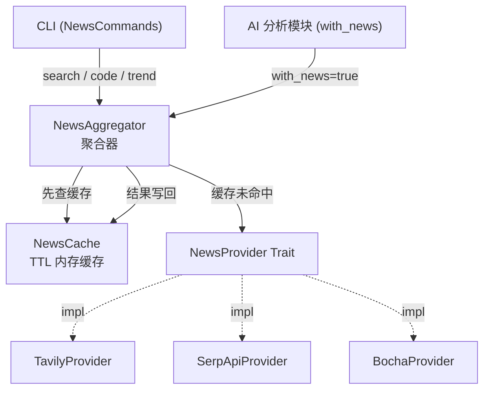
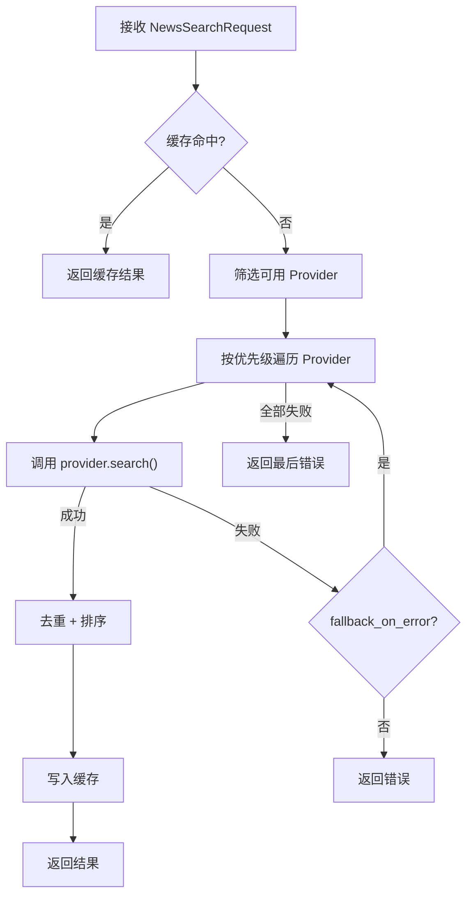

Quantix 的新闻模块提供了一套**多源新闻搜索与聚合**架构，通过统一的 Trait 抽象层将 Tavily、SerpAPI、博查三个外部搜索 API 封装为可互换的 Provider，再由 `NewsAggregator` 聚合器完成按优先级回退搜索或并行搜索，配合内置的 TTL 内存缓存实现结果去重、排序与复用。本页将逐层拆解从 Trait 定义到 Provider 实现、从聚合策略到缓存机制的完整数据流，帮助开发者理解如何扩展新的新闻源以及如何在 CLI 或 AI 分析中消费新闻数据。

Sources: [mod.rs](src/news/mod.rs#L1-L15)

## 模块结构与架构全景

新闻模块位于 `src/news/`，由以下五个核心文件和一个 Provider 子目录组成：

| 文件 | 职责 |
|---|---|
| `types.rs` | 定义 `NewsArticle`、`NewsSearchRequest`、`NewsSearchResult`、`NewsProviderConfig` 等核心数据结构 |
| `provider.rs` | 定义 `NewsProvider` Trait（统一搜索接口）与 `NewsProviderBuilder` Trait（工厂接口） |
| `aggregator.rs` | `NewsAggregator` 聚合器，管理多 Provider 的串行回退与并行搜索，以及结果去重排序 |
| `cache.rs` | `NewsCache` 内存缓存，基于 `RwLock<HashMap>` 的 TTL 缓存，支持容量上限与简易 LRU 淘汰 |
| `providers/` | 三个具体 Provider 实现：`TavilyProvider`、`SerpApiProvider`、`BochaProvider` |

下面的 Mermaid 图展示了模块的静态依赖关系与数据流方向：



Sources: [mod.rs](src/news/mod.rs#L1-L15), [providers/mod.rs](src/news/providers/mod.rs#L1-L12)

## 核心数据类型

### NewsArticle — 新闻文章模型

`NewsArticle` 是新闻搜索结果的原子单元，设计为 Builder 模式友好的链式构造结构。每篇文章携带标题、链接、来源、发布时间、摘要、正文、关联股票代码、标签、情感得分等字段，其中情感得分（`sentiment`）取值范围为 -1.0 到 1.0，在 Tavily Provider 中直接映射 API 返回的 `score` 字段。默认语言为 `"zh"`，反映了对 A 股市场的首要定位。

```rust
let article = NewsArticle::new("标题".into(), "https://...".into(), "tavily".into())
    .with_code("000001")
    .with_tag("银行");
```

Sources: [types.rs](src/news/types.rs#L9-L67)

### NewsSearchRequest — 搜索请求

`NewsSearchRequest` 封装了搜索关键词、关联股票代码、时间范围（天数）、最大结果数、指定提供商、语言、是否包含全文等参数。其 `Default` 实现设定了合理的预设值：3 天时间范围、20 条最大结果数、中文语言、不包含全文。请求对象同样支持链式构造：

```rust
let request = NewsSearchRequest::new("贵州茅台")
    .with_code("600519")
    .with_days(7)
    .with_max_results(50);
```

Sources: [types.rs](src/news/types.rs#L69-L128)

### NewsSearchResult — 搜索结果

`NewsSearchResult` 包含文章列表、总数、耗时（毫秒）、使用的提供商名称、是否来自缓存、搜索时间戳。其 `from_cache()` 方法用于在缓存命中时标记结果，使上层消费者能够区分实时数据和缓存数据。

Sources: [types.rs](src/news/types.rs#L130-L172)

### NewsProviderConfig — 提供商配置

`NewsProviderConfig` 定义了每个 Provider 的运行时参数：启用状态、优先级（数字越小越高）、API Key（支持环境变量名与直接值两种方式）、Base URL、请求超时、每日请求限制。在聚合器中，Provider 按优先级排序决定回退顺序。

Sources: [types.rs](src/news/types.rs#L174-L205)

### 趋势分析辅助类型

`NewsTrend`、`KeywordCount`、`SourceCount`、`SentimentDistribution` 四个结构体为新闻趋势分析提供了数据骨架，按日期聚合文章数量、热门关键词、情感分布（正面/中性/负面）和热门来源。这些类型已在 `types.rs` 中完整定义，CLI 的 `news trend` 子命令将消费这些结构。

Sources: [types.rs](src/news/types.rs#L207-L242)

## NewsProvider Trait — 统一搜索接口

`NewsProvider` 是整个模块的核心抽象，使用 `async_trait` 标注为异步 Trait，并要求 `Send + Sync` 以支持跨线程共享。接口定义了五个方法：

| 方法 | 签名 | 说明 |
|---|---|---|
| `name` | `fn name(&self) -> &'static str` | 返回提供商标识符（如 `"tavily"`） |
| `search` | `async fn search(&self, &NewsSearchRequest) -> Result<NewsSearchResult>` | 核心搜索方法 |
| `search_by_code` | `async fn search_by_code(&self, code, days, max) -> Result<...>` | 默认实现，将股票代码构造为 `NewsSearchRequest` 后调用 `search` |
| `is_available` | `fn is_available(&self) -> bool` | 检查可用性，默认返回 `true` |
| `config` | `fn config(&self) -> &NewsProviderConfig` | 获取当前配置 |
| `remaining_quota` | `fn remaining_quota(&self) -> Option<u32>` | 查询剩余配额，默认 `None` |

此外，`NewsProviderBuilder` Trait 提供了工厂方法 `build(config) -> Box<dyn NewsProvider>` 和配置校验方法 `validate_config`（默认检查 `enabled && api_key.is_some()`），用于从配置文件动态创建 Provider 实例。

Sources: [provider.rs](src/news/provider.rs#L1-L61)

## 三个 Provider 实现

### TavilyProvider（优先级 1）

Tavily 是**高质量 AI 友好的搜索 API**，被设为最高优先级。它使用 POST 请求，将搜索参数以 JSON Body 发送，支持 `search_depth`（basic/advanced）、`include_answer`（是否返回 AI 摘要）、`include_raw_content`（是否返回原文）等特有参数。API 响应中的 `score` 字段被映射为 `NewsArticle::sentiment`。Provider 从 `TAVILY_API_KEY` 或 `TAVILY_API_KEYS` 环境变量读取密钥，默认 Base URL 为 `https://api.tavily.com`。

Sources: [tavily.rs](src/news/providers/tavily.rs#L1-L178)

### SerpApiProvider（优先级 2）

SerpAPI 提供了**Google 搜索结果的 API 接口**，定位为第二优先级回退选项。它使用 GET 请求，通过 URL 查询参数传递 `engine=google_news`、`q`（关键词）和 `num`（结果数）。当请求中包含 `codes`（股票代码）时，会将代码追加到查询关键词后面，增强搜索精确度。Provider 从 `SERPAPI_API_KEY` 或 `SERPAPI_API_KEYS` 环境变量读取密钥，默认 Base URL 为 `https://serpapi.com`。

Sources: [serpapi.rs](src/news/providers/serpapi.rs#L1-L162)

### BochaProvider（优先级 3）

博查是**中文优化的新闻搜索 API**，专为中文场景设计。它使用 GET 请求，通过 `keyword` 和 `count` 查询参数搜索，API 响应结构包含 `code`（状态码）和 `data.list`（新闻列表）。当 `code != 0` 时视为错误。Provider 从 `BOCHA_API_KEY` 或 `BOCHA_API_KEYS` 环境变量读取密钥，默认 Base URL 为 `https://api.bocha.io`，语言固定为 `"zh"`。

Sources: [bocha.rs](src/news/providers/bocha.rs#L1-L178)

### 三方 Provider 对比

| 维度 | Tavily | SerpAPI | 博查 (Bocha) |
|---|---|---|---|
| **优先级** | 1（最高） | 2 | 3 |
| **HTTP 方法** | POST | GET | GET |
| **搜索引擎** | 自有 AI 搜索 | Google News | 自有中文搜索 |
| **特有能力** | AI 摘要、情感得分 | Google 索引广度 | 中文优化 |
| **环境变量** | `TAVILY_API_KEY` | `SERPAPI_API_KEY` | `BOCHA_API_KEY` |
| **适用场景** | 通用搜索、情感分析 | 全球新闻覆盖 | A 股中文新闻 |

Sources: [tavily.rs](src/news/providers/tavily.rs#L60-L94), [serpapi.rs](src/news/providers/serpapi.rs#L38-L67), [bocha.rs](src/news/providers/bocha.rs#L46-L75)

## NewsAggregator — 聚合策略

`NewsAggregator` 是新闻模块的门面（Facade），管理多个 Provider 实例并提供两种搜索策略：**串行回退搜索**和**并行聚合搜索**。

### 串行回退搜索（search）

`search` 方法的工作流如下：

1. **缓存检查**：如果启用了缓存（`enable_cache`），首先以 `query` 为 key 查询 `NewsCache`，命中则直接返回并标记 `from_cache = true`
2. **Provider 筛选**：过滤出 `is_available()` 为 `true` 且在 `enabled_providers` 列表中的 Provider（若请求指定了 `provider`，则只保留该 Provider）
3. **按优先级回退**：依次尝试每个 Provider，成功则对结果去重、写入缓存、返回；失败则根据 `fallback_on_error` 决定是否继续尝试下一个
4. **错误传播**：所有 Provider 均失败时，返回最后一个错误



Sources: [aggregator.rs](src/news/aggregator.rs#L59-L150)

### 并行聚合搜索（search_parallel）

`search_parallel` 使用 `futures::future::join_all` **同时**向所有可用 Provider 发起请求，然后合并所有成功响应的文章列表，再统一去重排序。返回结果中的 `provider` 字段是用逗号拼接的所有成功 Provider 名称。并行模式适合需要**最大化结果覆盖面**的场景，但代价是更高的 API 调用量。

Sources: [aggregator.rs](src/news/aggregator.rs#L152-L233)

### 去重与排序

`deduplicate` 方法执行两层去重：首先基于 **URL 完全匹配**过滤，然后基于**标题小写完全匹配**过滤。去重后按发布时间降序排序（有时间的排在无时间的前面）。当前实现使用精确匹配，是一种保守但高效的策略。

Sources: [aggregator.rs](src/news/aggregator.rs#L235-L267)

### AggregatorConfig

| 参数 | 默认值 | 说明 |
|---|---|---|
| `enabled_providers` | `["tavily", "serpapi", "bocha"]` | 启用的 Provider 列表（同时决定回退顺序） |
| `max_concurrent` | 3 | 最大并发请求数（用于并行模式） |
| `timeout_seconds` | 30 | 请求超时 |
| `enable_cache` | true | 是否启用缓存 |
| `cache_ttl_seconds` | 3600（1小时） | 缓存有效期 |
| `fallback_on_error` | true | Provider 失败时是否回退到下一个 |

Sources: [aggregator.rs](src/news/aggregator.rs#L26-L57)

## NewsCache — TTL 内存缓存

`NewsCache` 是基于 `tokio::sync::RwLock<HashMap<String, CacheEntry>>` 的异步安全内存缓存。每个缓存条目记录结果数据和过期时间点。

### 淘汰策略

当缓存大小达到 `max_size` 上限时，执行两阶段淘汰：首先删除所有已过期条目；如果仍然超限，则删除最早插入的一半条目（简易 LRU 近似）。默认配置为 1000 条上限、3600 秒（1 小时）默认 TTL。

### 统计能力

`stats()` 方法返回 `CacheStats` 结构体，包含总条目数、有效条目数和过期条目数，可用于监控缓存命中率。

| 方法 | 说明 |
|---|---|
| `get(query)` | 读取缓存，过期条目返回 `None` |
| `set(query, result, ttl)` | 写入缓存，超限时触发淘汰 |
| `clear()` | 清空所有缓存 |
| `clear_expired()` | 清除过期条目 |
| `size()` | 当前缓存大小 |
| `stats()` | 缓存统计信息 |

Sources: [cache.rs](src/news/cache.rs#L1-L123)

## 配置文件与环境变量

新闻模块的配置文件位于 `config/news.toml`，按 Provider 分段组织：

```toml
[default]
default_provider = "tavily"
default_days = 3
max_results = 20
cache_ttl_seconds = 3600
enable_cache = true

[tavily]
enabled = true
priority = 1
base_url = "https://api.tavily.com"
search_depth = "basic"
include_answer = true

[serpapi]
enabled = true
priority = 2
base_url = "https://serpapi.com"
engine = "google_news"

[bocha]
enabled = true
priority = 3
base_url = "https://api.bocha.io"
```

API 密钥通过环境变量注入（不硬编码在配置文件中），对应关系如下：

| Provider | 环境变量（优先） | 备选环境变量 |
|---|---|---|
| Tavily | `TAVILY_API_KEY` | `TAVILY_API_KEYS` |
| SerpAPI | `SERPAPI_API_KEY` | `SERPAPI_API_KEYS` |
| 博查 | `BOCHA_API_KEY` | `BOCHA_API_KEYS` |

Sources: [news.toml](config/news.toml#L1-L57), [.env.example](.env.example#L95-L105)

## CLI 集成

新闻模块在 CLI 中通过 `quantix news` 命令暴露四个子命令：

| 子命令 | 参数 | 说明 |
|---|---|---|
| `search` | `-q/--query`, `-c/--code`, `-d/--days`, `-n/--max`, `-p/--provider` | 关键词搜索新闻 |
| `code` | `-c/--code`, `-d/--days`, `-n/--max` | 按股票代码搜索（自动追加"股票"后缀） |
| `trend` | `-d/--date`, `-c/--code` | 新闻趋势分析（开发中） |
| `providers` | 无 | 列出所有 Provider 及其配置状态 |

CLI 层当前为**占位实现**（显示参数和可用性检查），完整的搜索功能需要通过 `NewsAggregator` 调用链完成。在 `ai analyze` 命令中，`--with-news` 标志用于指示 AI 分析流程包含新闻上下文。

Sources: [info.rs](src/cli/commands/info.rs#L112-L165), [news.rs](src/cli/handlers/news.rs#L1-L144)

## 扩展新 Provider

要添加新的新闻搜索源，开发者需要：

1. 在 `src/news/providers/` 下创建新文件（如 `jin10.rs`）
2. 实现 `NewsProvider` Trait 的 `name`、`search`、`is_available`、`config` 方法
3. 在 `src/news/providers/mod.rs` 中注册模块并 re-export
4. 在 `config/news.toml` 中添加对应的配置段
5. 在 `AggregatorConfig::default().enabled_providers` 中添加新 Provider 名称

关键约束：Provider 必须 `Send + Sync`，`search` 方法返回统一的 `Result<NewsSearchResult>`，API 密钥从环境变量读取而非配置文件。

Sources: [provider.rs](src/news/provider.rs#L13-L46), [providers/mod.rs](src/news/providers/mod.rs#L1-L12)

## 与其他模块的关联

新闻模块的数据可在多个上层模块中被消费：

- **[AI 决策模块](21-ai-jue-ce-mo-kuai-llm-duo-mo-xing-gua-pei-yu-prompt-mo-ban)**：`ai analyze --with-news` 标志将新闻摘要作为上下文注入 LLM Prompt，辅助生成更全面的股票分析
- **[基本面数据](23-ji-ben-mian-shu-ju-gu-zhi-cai-bao-long-hu-bang-ji-gou-chi-cang)**：新闻中的 `related_codes` 字段可与基本面数据（财报、龙虎榜）交叉关联
- **[监控告警体系](24-jian-kong-gao-jing-ti-xi-yu-prometheus-zhi-biao-dao-chu)**：`NewsCache::stats()` 可作为 Prometheus 指标暴露，监控缓存效率和 API 调用量