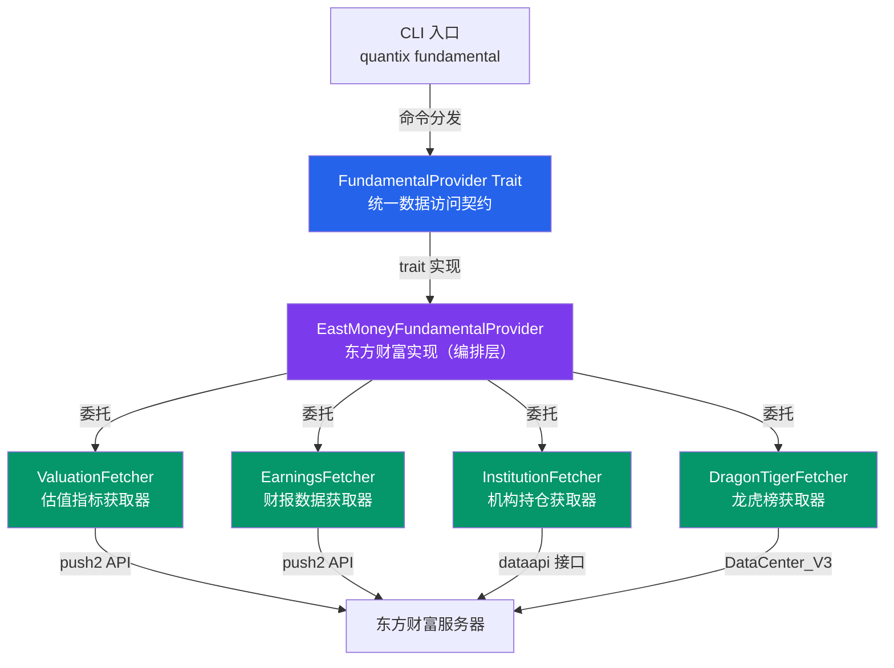
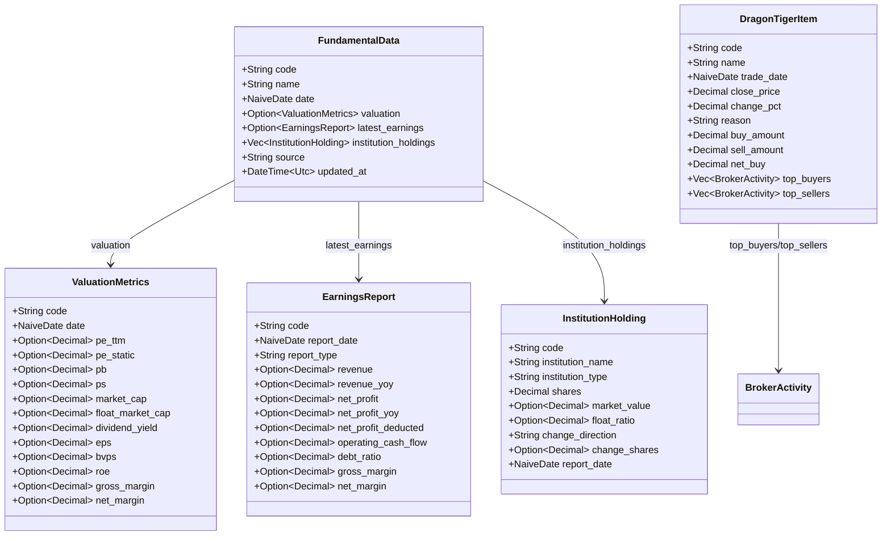
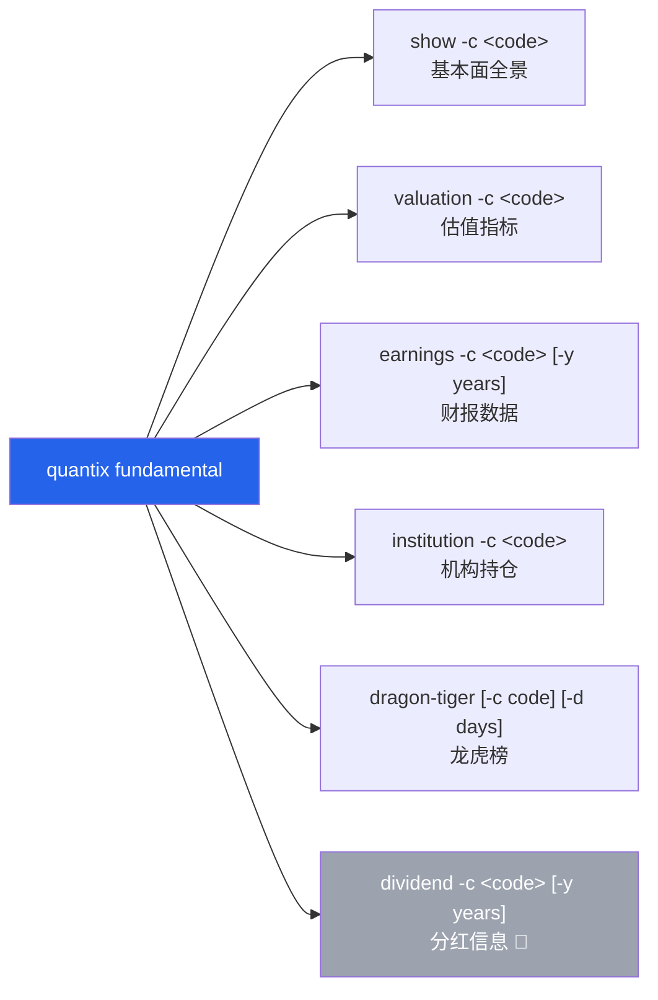
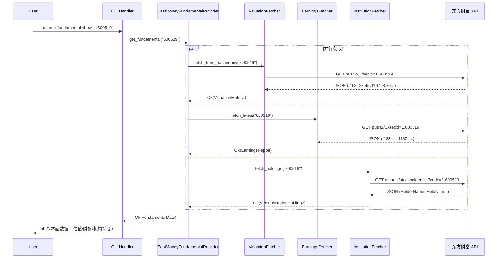

基本面数据模块（`src/fundamental`）为 Quantix 提供了从东方财富 API 获取 A 股基本面数据的能力，涵盖估值指标、财报数据、龙虎榜交易明细和机构持仓四大维度。模块采用 **Trait 抽象 + 专一化 Fetcher 委托** 的分层架构，以 `FundamentalProvider` 统一对外接口，底层由四个独立获取器（`ValuationFetcher`、`EarningsFetcher`、`DragonTigerFetcher`、`InstitutionFetcher`）各自封装 API 调用与数据映射逻辑，当前唯一实现为 `EastMoneyFundamentalProvider`。通过 CLI 子命令 `quantix fundamental` 即可交互式查询任意股票的基本面全景。

Sources: [mod.rs](src/fundamental/mod.rs#L1-L18), [provider.rs](src/fundamental/provider.rs#L1-L63)

## 模块架构总览

模块的核心设计理念是 **关注点分离**：每个数据维度拥有独立的 Fetcher 结构体，封装特定 API 的请求构建与响应解析；而 `FundamentalProvider` trait 定义统一契约，`EastMoneyFundamentalProvider` 则作为编排层将四个 Fetcher 组合在一起。这种架构使得新增数据源（如 AKShare 或 Wind）时只需实现 trait，无需修改任何 Fetcher 内部逻辑。



Sources: [eastmoney.rs](src/fundamental/eastmoney.rs#L17-L35), [provider.rs](src/fundamental/provider.rs#L10-L62)

## 文件组织与职责划分

模块由 8 个文件组成，各司其职：

| 文件 | 核心职责 | 关键类型 |
|------|----------|----------|
| `types.rs` | 全部数据模型定义，7 个结构体 | `FundamentalData`, `ValuationMetrics`, `EarningsReport`, `InstitutionHolding`, `DragonTigerItem`, `BrokerActivity`, `DividendInfo`, `CapitalFlow` |
| `provider.rs` | `FundamentalProvider` async trait 定义 | 统一数据访问接口，含默认的 `get_fundamental` 聚合实现 |
| `eastmoney.rs` | 东方财富提供商编排层 | `EastMoneyFundamentalProvider`，持有四个 Fetcher 实例 |
| `valuation.rs` | 估值指标获取与解析 | `ValuationFetcher`，调用 push2 行情 API |
| `earnings.rs` | 财报数据获取与解析 | `EarningsFetcher`，调用 push2 行情 API（不同字段集） |
| `institution.rs` | 机构持仓获取与解析 | `InstitutionFetcher`，调用 dataapi 接口 |
| `dragon_tiger.rs` | 龙虎榜数据获取与解析 | `DragonTigerFetcher`，调用 DataCenter_V3 接口 |
| `mod.rs` | 模块声明与再导出 | 再导出 `EastMoneyFundamentalProvider`, `FundamentalProvider` 及 5 个核心类型 |

Sources: [types.rs](src/fundamental/types.rs#L1-L243), [mod.rs](src/fundamental/mod.rs#L5-L17)

## FundamentalProvider Trait 契约

`FundamentalProvider` 是整个模块的 **统一数据访问契约**，使用 `async_trait` 定义了 8 个异步方法。其中 `get_fundamental` 提供了默认的聚合实现——它并行调用估值、财报和机构持仓三个子方法，将结果组合为完整的 `FundamentalData` 结构体。这一设计使得调用方无需关心底层多次请求的编排细节。

```rust
#[async_trait]
pub trait FundamentalProvider: Send + Sync {
    fn name(&self) -> &'static str;

    // 聚合方法（有默认实现）
    async fn get_fundamental(&self, code: &str) -> Result<FundamentalData>;

    // 以下方法由实现者提供
    async fn get_valuation(&self, code: &str) -> Result<ValuationMetrics>;
    async fn get_latest_earnings(&self, code: &str) -> Result<EarningsReport>;
    async fn get_earnings_history(&self, code: &str, years: u32) -> Result<Vec<EarningsReport>>;
    async fn get_institution_holdings(&self, code: &str) -> Result<Vec<InstitutionHolding>>;
    async fn get_dragon_tiger(&self, code: &str, days: u32) -> Result<Vec<DragonTigerItem>>;
    async fn get_dividend_history(&self, code: &str, years: u32) -> Result<Vec<DividendInfo>>;
    async fn get_capital_flow(&self, code: &str, days: u32) -> Result<Vec<CapitalFlow>>;
}
```

trait 要求实现者为 `Send + Sync`，这意味着它可以安全地跨线程使用，适合在异步运行时中共享。`get_fundamental` 的默认实现中，对子方法的错误使用了容错策略（`.ok()` 和 `unwrap_or_default()`），即使某个子数据源失败，也能返回部分成功的结果。

Sources: [provider.rs](src/fundamental/provider.rs#L10-L62)

## 数据模型体系

模块定义了 7 个核心数据结构，构成完整的 **基本面数据金字塔**。`FundamentalData` 是顶层汇总结构，聚合了估值、财报和机构持仓三个维度；而 `DividendInfo` 和 `CapitalFlow` 是已定义类型但尚未实现获取逻辑的扩展维度。



所有数值字段均使用 `rust_decimal::Decimal` 确保金融计算的精度，而非 `f64` 浮点数。字段普遍采用 `Option` 包装，以优雅地处理 API 返回数据缺失的情况——这在实际数据采集场景中极为常见。

Sources: [types.rs](src/fundamental/types.rs#L1-L243)

### ValuationMetrics — 估值指标

估值指标是基本面分析的起点，记录了市场对公司价值的定价共识。以下表格列出了所有字段及其金融含义：

| 字段 | 含义 | 单位 | API 字段映射 |
|------|------|------|-------------|
| `pe_ttm` | 滚动市盈率（Trailing Twelve Months） | 倍 | `f162` |
| `pe_static` | 静态市盈率 | 倍 | — |
| `pb` | 市净率 | 倍 | `f167` |
| `ps` | 市销率 | 倍 | — |
| `market_cap` | 总市值 | 亿元 | `f116`（原始单位：元） |
| `float_market_cap` | 流通市值 | 亿元 | `f117`（原始单位：元） |
| `dividend_yield` | 股息率 | % | — |
| `eps` | 每股收益 | 元 | `f187` |
| `bvps` | 每股净资产 | 元 | — |
| `roe` | 净资产收益率 | % | `f173` |
| `gross_margin` | 毛利率 | % | — |
| `net_margin` | 净利率 | % | — |

`ValuationFetcher` 从东方财富 push2 API 的 `/api/qt/stock/get` 端点获取数据。该 API 返回的结构体中字段以 `f` + 数字编号命名（如 `f162` 代表市盈率 TTM），fetcher 负责将这些晦涩的编号映射为语义清晰的字段，同时执行单位转换（例如市值从元转换为亿元，除以 10⁸）。

Sources: [types.rs](src/fundamental/types.rs#L29-L80), [valuation.rs](src/fundamental/valuation.rs#L72-L137)

### EarningsReport — 财报数据

财报数据捕捉了公司经营成果的核心指标，按季度发布。`EarningsReport` 结构体覆盖了从营收到利润率的关键财务指标：

| 字段 | 含义 | 单位 |
|------|------|------|
| `revenue` | 营业收入 | 亿元 |
| `revenue_yoy` | 营业收入同比增长率 | % |
| `net_profit` | 净利润 | 亿元 |
| `net_profit_yoy` | 净利润同比增长率 | % |
| `net_profit_deducted` | 扣非净利润 | 亿元 |
| `operating_cash_flow` | 经营活动现金流 | 亿元 |
| `total_assets` / `net_assets` | 总资产 / 净资产 | 亿元 |
| `debt_ratio` | 资产负债率 | % |
| `gross_margin` / `net_margin` | 毛利率 / 净利率 | % |
| `announce_date` | 公告日期 | — |

`EarningsFetcher` 同样调用 push2 API，但请求的 fields 集合不同（`f183`=总营收、`f184`=营收同比、`f185`=净利润同比、`f186`=毛利率、`f187`=净利润）。值得注意的是，当前 `fetch_history` 方法是简化实现，无论请求多少年的历史数据，都只返回最新一期财报。

Sources: [types.rs](src/fundamental/types.rs#L83-L137), [earnings.rs](src/fundamental/earnings.rs#L76-L141)

### InstitutionHolding — 机构持仓

机构持仓数据反映了专业投资者对个股的配置偏好，是基本面分析的重要参考维度。

| 字段 | 含义 | 单位 |
|------|------|------|
| `institution_name` | 机构名称 | — |
| `institution_type` | 机构类型 | 枚举：基金/QFII/社保/券商/保险/信托/其他 |
| `shares` | 持股数量 | 万股 |
| `market_value` | 持股市值 | 万元 |
| `float_ratio` | 占流通股比例 | % |
| `change_direction` | 变动方向 | 枚举：新进/增持/减持/不变 |
| `change_shares` | 变动数量 | 万股 |

`InstitutionFetcher` 调用的 API 与前两个 Fetcher 不同——它使用 `dataapi` 接口（`/dataapi/stockholder/list`），返回的数据采用 **PascalCase** 命名（如 `HolderName`、`HoldNum`），通过 `#[serde(rename_all = "PascalCase")]` 自动映射。机构类型的数值编码（1=基金, 2=QFII, 3=社保, 4=券商, 5=保险, 6=信托）由 `holder_type_label()` 函数翻译为中文标签。

Sources: [types.rs](src/fundamental/types.rs#L140-L160), [institution.rs](src/fundamental/institution.rs#L51-L145)

### DragonTigerItem — 龙虎榜

龙虎榜记录了交易所披露的异常交易个股的买卖营业部明细，是短线交易者的重要信息来源。

| 字段 | 含义 | 单位 |
|------|------|------|
| `close_price` | 收盘价 | 元 |
| `change_pct` | 涨跌幅 | % |
| `reason` | 上榜原因 | —（如"日涨幅偏离值达7%"） |
| `buy_amount` / `sell_amount` | 买入/卖出总额 | 万元 |
| `net_buy` | 净买入 | 万元 |
| `top_buyers` / `top_sellers` | 买卖前5营业部明细 | `Vec<BrokerActivity>` |

`DragonTigerFetcher` 是唯一提供两个公开方法的 Fetcher：`fetch(code, days)` 按个股查询历史龙虎榜，`fetch_today()` 获取全市场今日龙虎榜。两个方法调用的是同一 `DataCenter_V3` 接口的不同端点。当前实现中 `top_buyers` 和 `top_sellers` 字段始终为空（`Vec::new()`），营业部明细的解析属于待扩展功能。

Sources: [types.rs](src/fundamental/types.rs#L163-L200), [dragon_tiger.rs](src/fundamental/dragon_tiger.rs#L68-L195)

## 东方财富 API 集成细节

四个 Fetcher 分别调用东方财富的不同 API 子系统，下表总结了各接口的技术特征：

| 获取器 | API 基础 URL | 数据格式 | 请求超时 | Referer |
|--------|-------------|----------|---------|---------|
| `ValuationFetcher` | `push2.eastmoney.com/api/qt/stock/get` | JSON（f-编号字段） | 10s | `quote.eastmoney.com` |
| `EarningsFetcher` | `push2.eastmoney.com/api/qt/stock/get` | JSON（f-编号字段） | 10s | `quote.eastmoney.com` |
| `InstitutionFetcher` | `data.eastmoney.com/dataapi/stockholder/list` | JSON（PascalCase） | 10s | `data.eastmoney.com` |
| `DragonTigerFetcher` | `data.eastmoney.com/DataCenter_V3/stock2016/TradeDetail` | JSON（PascalCase） | 10s | `data.eastmoney.com` |

所有 Fetcher 的证券代码格式化遵循统一规则：上海市场（代码以 `6` 或 `9` 开头）使用前缀 `1.`，深圳市场使用前缀 `0.`。例如贵州茅台（600519）的 secid 为 `1.600519`，平安银行（000001）的 secid 为 `0.000001`。

每个 Fetcher 内部维护独立的 `reqwest::Client` 实例，通过 `Client::builder().timeout(Duration::from_secs(10))` 设置请求超时。JSON 响应的解析普遍采用防御性编程：使用 `Option<serde_json::Value>` 接收可能为空的字段，通过 `value_to_f64()` 辅助函数统一处理 Number 和 String 两种 JSON 类型。

Sources: [valuation.rs](src/fundamental/valuation.rs#L57-L148), [earnings.rs](src/fundamental/earnings.rs#L60-L158), [institution.rs](src/fundamental/institution.rs#L74-L161), [dragon_tiger.rs](src/fundamental/dragon_tiger.rs#L68-L195)

## CLI 命令体系

基本面模块通过 `quantix fundamental` 子命令暴露给用户，下设 6 个子命令。每个子命令对应 `FundamentalCommands` 枚举的一个变体，在 `src/cli/handlers/fundamental.rs` 中实现终端输出格式化。



各子命令的功能说明如下：

| 命令 | 参数 | 实现状态 | 说明 |
|------|------|----------|------|
| `show` | `-c <code>`（必填） | ✅ 已实现 | 一次性获取估值 + 财报 + 机构持仓的聚合视图 |
| `valuation` | `-c <code>`（必填） | ✅ 已实现 | 以表格形式展示 13 项估值指标 |
| `earnings` | `-c <code>` `-y <years>`（默认3） | ✅ 已实现 | 最新一期财报或历史多期财报（箭头标注同比方向） |
| `institution` | `-c <code>`（必填） | ✅ 已实现 | 机构持仓明细，含按类型统计 + 前10条列表 |
| `dragon-tiger` | `-c <code>`（可选） `-d <days>`（默认5） | ✅ 已实现 | 指定个股龙虎榜或全市场今日龙虎榜 |
| `dividend` | `-c <code>` `-y <years>`（默认3） | 🚧 待实现 | 提示用户使用其他子命令 |

`dragon-tiger` 是唯一允许省略 `code` 参数的子命令——不指定时自动获取全市场今日龙虎榜，这一设计利用了 `fetch_today()` 方法。

Sources: [info.rs](src/cli/commands/info.rs#L168-L221), [fundamental.rs](src/cli/handlers/fundamental.rs#L1-L476)

## 数据流与请求处理流程

以 `show` 子命令为例，完整的数据获取与展示流程如下：



`get_fundamental` 的默认实现采用了 **容错聚合** 策略：估值和财报使用 `.ok()` 将错误转为 `None`，机构持仓使用 `unwrap_or_default()` 将错误转为空 `Vec`。这意味着即使部分 API 失败（如网络超时），用户仍能获取到已成功返回的数据维度。

Sources: [provider.rs](src/fundamental/provider.rs#L17-L35), [fundamental.rs](src/cli/handlers/fundamental.rs#L25-L97)

## 单位转换与数据清洗

四个 Fetcher 在解析 API 原始数据时，均需要执行 **单位转换** 以统一到人类可读的标准单位。这是金融数据集成中最容易出错的一环。

| Fetcher | 原始单位 → 目标单位 | 转换因子 | 示例 |
|---------|-------------------|---------|------|
| `ValuationFetcher` | 元 → 亿元 | ÷ 10⁸ | `f116`=2200000000000 → `market_cap`=22000.0 |
| `ValuationFetcher` | 元 → 亿元 | ÷ 10⁸ | `f117` 流通市值 |
| `EarningsFetcher` | 元 → 亿元 | ÷ 10⁸ | `f183`=1200000000000 → `revenue`=12000.0 |
| `InstitutionFetcher` | 股 → 万股 | ÷ 10000 | `HoldNum` 持股数量 |
| `InstitutionFetcher` | 元 → 万元 | ÷ 10000 | `HoldValue` 持股市值 |
| `DragonTigerFetcher` | 元 → 万元 | ÷ 10000 | `BuyAmount`/`SellAmount` |

数值精度控制方面，`ValuationFetcher` 使用了 `f64_to_decimal()` 函数，先乘以 10000 再取整再除以 10000，从而实现 **4 位小数截断**；而其他三个 Fetcher 直接使用 `Decimal::from_f64_retain()` 保留完整精度。

Sources: [valuation.rs](src/fundamental/valuation.rs#L52-L54), [earnings.rs](src/fundamental/earnings.rs#L56-L58), [institution.rs](src/fundamental/institution.rs#L47-L49), [dragon_tiger.rs](src/fundamental/dragon_tiger.rs#L58-L60)

## 测试覆盖

每个 Fetcher 文件都内嵌了单元测试模块，测试覆盖了以下关键维度：

| 测试类别 | 涉及文件 | 测试内容 |
|---------|---------|---------|
| 代码格式化 | `valuation.rs`, `earnings.rs` | `format_secid` 正确区分沪（`1.xxx`）深（`0.xxx`）市场 |
| JSON 解析 | 全部 4 个 Fetcher | 解析正常的 JSON 响应体、解析空响应（`data: null`） |
| 类型转换 | `valuation.rs` | `value_to_f64` 处理 Number、String 和 None 三种 JSON 值 |
| 业务逻辑 | `institution.rs` | 机构类型编码映射（1=基金, 2=QFII...）、变动方向判断（正=增持, 负=减持, 零/空=不变） |
| 日期解析 | `dragon_tiger.rs` | 正常日期字符串解析、None 回退到当前日期 |

Sources: [valuation.rs](src/fundamental/valuation.rs#L156-L204), [earnings.rs](src/fundamental/earnings.rs#L160-L204), [institution.rs](src/fundamental/institution.rs#L163-L214), [dragon_tiger.rs](src/fundamental/dragon_tiger.rs#L204-L254)

## 扩展方向与待实现功能

当前模块存在明确的扩展空间，以下功能已在类型层面定义但尚未实现数据获取逻辑：

| 功能 | 类型已定义 | 获取器实现状态 | API 端点 | trait 方法 |
|------|-----------|--------------|---------|-----------|
| **分红历史** | `DividendInfo` ✅ | ❌ 未实现 | — | `get_dividend_history()` |
| **资金流向** | `CapitalFlow` ✅ | ❌ 未实现 | — | `get_capital_flow()` |
| **历史多期财报** | — | ⚠️ 简化实现 | 仅返回最新一期 | `get_earnings_history()` |
| **营业部买卖明细** | `BrokerActivity` ✅ | ❌ 未填充 | — | `DragonTigerItem.top_buyers/top_sellers` |

在 `EastMoneyFundamentalProvider` 中，`get_dividend_history` 和 `get_capital_flow` 直接返回 `QuantixError::Unsupported` 错误，明确告知调用方功能不可用。这一设计避免了"静默失败"，让上层逻辑能正确处理未支持的特性。

Sources: [eastmoney.rs](src/fundamental/eastmoney.rs#L69-L81), [types.rs](src/fundamental/types.rs#L203-L242)

---

**相关阅读**：要了解基本面数据的上游数据源架构（如东方财富、AKShare 等多数据源适配），请参阅 [多数据源适配器架构（TDX/AKShare/东方财富/Bridge）](8-duo-shu-ju-yuan-gua-pei-qi-jia-gou-tdx-akshare-dong-fang-cai-fu-bridge)；要了解 CLI 命令体系的全貌，请参阅 [CLI 命令体系与交互流程](4-cli-ming-ling-ti-xi-yu-jiao-hu-liu-cheng)；要了解如何将基本面数据融入 AI 分析决策，请参阅 [AI 决策模块（LLM 多模型适配与 Prompt 模板）](21-ai-jue-ce-mo-kuai-llm-duo-mo-xing-gua-pei-yu-prompt-mo-ban)。