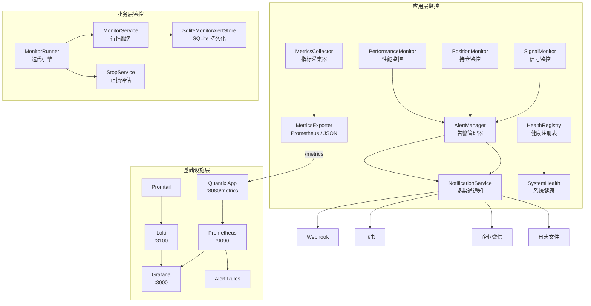

Quantix 的监控告警体系由两个互补层次构成：**应用内监控框架**（`src/monitoring/`）提供实时指标采集、告警触发与多渠道通知；**基础设施监控栈**（`monitoring/`）以 Prometheus + Grafana + Loki 为核心，实现指标持久化存储、可视化面板与日志聚合。两者通过 Prometheus text-format 指标端点桥接，形成从数据采集到告警响应的完整闭环。本文将从架构概览出发，逐层深入指标导出机制、告警引擎、健康检查体系及基础设施配置。

Sources: [mod.rs](src/monitoring/mod.rs#L1-L28), [docker-compose.yml](docker-compose.yml#L90-L159)

## 架构全景

监控体系的设计遵循**关注点分离**原则：`src/monitoring/` 模块专注于应用层可观测性（策略信号、持仓状态、绩效指标），而 `src/monitor/` 模块处理业务层面的行情监控（价格告警、止损触发）。基础设施层则通过 Docker Compose 编排独立的监控组件。



Sources: [mod.rs](src/monitoring/mod.rs#L1-L28), [mod.rs](src/monitor/mod.rs#L1-L19), [prometheus.yml](monitoring/prometheus.yml#L1-L65)

## 模块组织结构

监控相关的代码分布在两个独立的模块中，各有明确的职责边界：

| 模块路径 | 职责 | 核心类型 |
|---------|------|---------|
| `src/monitoring/` | 应用可观测性框架（Phase 16） | `MetricsCollector`, `AlertManager`, `HealthRegistry` |
| `src/monitor/` | 业务行情监控与止损评估 | `MonitorService`, `MonitorRunner`, `SqliteMonitorAlertStore` |
| `monitoring/` | 基础设施配置文件 | `prometheus.yml`, `alerts.yml`, `loki.yml`, `promtail.yml` |

`src/monitoring/` 模块内部结构如下：

```
src/monitoring/
├── mod.rs              # 模块入口与统一导出
├── metrics.rs          # 指标采集与 Prometheus/JSON 导出
├── health.rs           # 健康检查注册表与系统状态
├── alert.rs            # 告警管理器与阈值引擎
├── alert_builder.rs    # 预定义告警阈值构建器
├── signal_monitor.rs   # 策略信号实时追踪
├── position_monitor.rs # 持仓状态实时更新
├── performance_monitor.rs # 实时绩效指标计算
└── notification/       # 多渠道通知子系统
    ├── mod.rs
    ├── traits.rs       # NotificationSender trait
    ├── types.rs        # Notification / NotificationChannel / QuietHours
    ├── service.rs      # NotificationService 路由层
    ├── desktop.rs      # 桌面通知
    ├── webhook.rs      # HTTP Webhook
    ├── feishu.rs       # 飞书机器人
    ├── wechat_work.rs  # 企业微信机器人
    └── log.rs          # 日志文件
```

Sources: [mod.rs](src/monitoring/mod.rs#L1-L28), [mod.rs](src/monitor/mod.rs#L1-L19)

## 指标采集与 Prometheus 导出

**MetricsCollector** 是整个指标体系的核心采集器，通过 `Arc<RwLock<HashMap>>` 实现线程安全的指标注册与更新。所有指标自动添加 `quantix_` 前缀，遵循 Prometheus 命名规范。系统支持三种标准指标类型：

| 指标类型 | Rust 类型 | 典型用途 | 示例指标名 |
|---------|----------|---------|-----------|
| Counter | `i64` | 单调递增计数器 | `quantix_requests_total` |
| Gauge | `f64` | 可增可减的瞬时值 | `quantix_active_positions` |
| Histogram | `count + sum + buckets` | 分布统计 | `quantix_request_duration_seconds` |

Histogram 默认采用 Prometheus 标准桶边界：`[0.005, 0.01, 0.025, 0.05, 0.1, 0.25, 0.5, 1.0, 2.5, 5.0, 10.0]`，覆盖从 5ms 到 10s 的典型延迟范围。每次 `observe()` 调用会递增计数器、累加总和值，并对所有满足 `value <= threshold` 的桶递增计数。

Sources: [metrics.rs](src/monitoring/metrics.rs#L14-L53), [metrics.rs](src/monitoring/metrics.rs#L87-L218)

### 指标注册与操作

指标注册采用**先注册后操作**的模式——调用 `register_counter/gauge/histogram` 获得带前缀的完整指标名，后续通过该名称进行增量或赋值操作：

```rust
// 注册指标
let counter = collector.register_counter("requests_total", "Total requests", labels);
let gauge = collector.register_gauge("active_connections", "Active connections", labels);
let hist = collector.register_histogram("request_duration", "Duration in seconds", labels);

// 操作指标
collector.increment_counter(&counter, 1);
collector.set_gauge(&gauge, 42.0);
collector.observe_histogram(&hist, 0.127);
```

`MetricsCollector` 实现了 `Clone` trait，通过 `Arc::clone` 共享底层存储，可在多个异步任务间安全传递。

Sources: [metrics.rs](src/monitoring/metrics.rs#L109-L233)

### Prometheus 文本格式导出

**MetricsExporter** 负责将采集器中的指标序列化为 Prometheus 文本格式或 JSON 格式。Prometheus 格式严格遵循 OpenMetrics 规范，每条指标包含三行输出：`# HELP`（帮助文本）、`# TYPE`（类型声明）和值行。Histogram 类型还会展开 `_bucket{le="..."}` 分位数桶、`_sum` 总和和 `_count` 计数三组数据：

```
# HELP quantix_request_duration Request duration in seconds
# TYPE quantix_request_duration histogram
quantix_request_duration_bucket{le="0.005"} 0
quantix_request_duration_bucket{le="0.01"} 1
...
quantix_request_duration_bucket{le="+Inf"} 3
quantix_request_duration_sum 2.6
quantix_request_duration_count 3
```

Prometheus 服务器以 30 秒间隔从 `quantix:8080/metrics` 端点抓取此格式数据。

Sources: [metrics.rs](src/monitoring/metrics.rs#L235-L338), [prometheus.yml](monitoring/prometheus.yml#L28-L34)

## 告警引擎

### 告警阈值与冷却机制

**AlertManager** 是应用内告警的核心管理器，通过 `AlertThreshold` 定义每个告警规则的触发条件。告警阈值包含四个关键属性：阈值数值（`threshold`）、告警级别（`level`）、启用状态（`enabled`）和冷却时间（`cooldown_secs`，默认 5 分钟）。冷却机制通过比较当前时间与上次告警时间，防止同一告警在短时间内反复触发。

`AlertThreshold.should_alert()` 方法执行两层检查：首先验证告警是否启用且当前值超过阈值，然后检查是否已过冷却期。只有两个条件都满足时才返回 `true`，同时调用方需手动调用 `update_last_alert()` 刷新冷却计时。

Sources: [alert.rs](src/monitoring/alert.rs#L49-L123)

### 告警级别与类型体系

系统定义四级告警严重性，每个级别对应不同的日志输出级别和处理优先级：

| 级别 | 日志级别 | 典型场景 | 冷却默认值 |
|------|---------|---------|-----------|
| Info | `tracing::info` | 信号频率变化、策略状态更新 | 5 分钟 |
| Warning | `tracing::warn` | 回撤接近阈值、持仓比例偏高 | 5 分钟 |
| Error | `tracing::error` | 数据采集失败、连接超时 | 5 分钟 |
| Critical | `tracing::error` | 应用下线、严重回撤、数据库不可用 | 5 分钟 |

告警类型覆盖五个维度：**Signal**（策略信号异常）、**Position**（持仓变动）、**Performance**（绩效指标越界）、**Risk**（风控规则触发）、**System**（系统级故障）。

Sources: [alert.rs](src/monitoring/alert.rs#L14-L47)

### 预定义告警构建器

`AlertThresholdBuilder` 提供一组开箱即用的告警阈值工厂方法，简化常见告警场景的配置：

| 工厂方法 | 告警 ID | 默认级别 | 用途 |
|---------|---------|---------|------|
| `drawdown_warning(threshold)` | `drawdown_warning` | Warning | 回撤达到预警线 |
| `drawdown_critical(threshold)` | `drawdown_critical` | Critical | 回撤达到危险线 |
| `position_ratio(threshold)` | `position_ratio` | Warning | 单标的持仓占比过高 |
| `signal_frequency(threshold)` | `signal_frequency` | Info | 策略信号频率异常 |

Sources: [alert_builder.rs](src/monitoring/alert_builder.rs#L1-L47)

### 告警生命周期

`AlertManager` 维护两个列表：**活跃告警**（`active_alerts`，未确认）和**告警历史**（`alert_history`，全部记录）。`check_and_alert()` 方法执行完整的评估-触发-记录流程：查找阈值 → 检查条件 → 创建 `Alert` 对象 → 输出到控制台和日志 → 计入历史。历史记录上限由 `AlertConfig.max_alert_history` 控制（默认 1000 条），超出后移除最早记录。告警确认通过 `acknowledge_alert()` 方法标记，已确认的告警不再出现在 `get_unacknowledged_alerts()` 结果中。

Sources: [alert.rs](src/monitoring/alert.rs#L238-L427)

## 健康检查体系

**HealthRegistry** 提供组件级别的健康状态聚合机制。各子系统通过实现 `HealthCheck` trait 注册为可检查组件，`HealthRegistry` 汇总后输出 `SystemHealth` 整体状态。健康状态采用**最差优先**的聚合策略——只要有一个组件为 `Unhealthy`，整体状态即为 `Unhealthy`；存在 `Degraded` 则整体降级。

| 状态 | 含义 | 聚合规则 |
|------|------|---------|
| Healthy | 组件正常运行 | 所有组件均 Healthy |
| Degraded | 部分功能降级但仍可用 | 至少一个 Degraded，无 Unhealthy |
| Unhealthy | 关键组件不可用 | 任一组件 Unhealthy |

`ComponentHealth` 记录组件名称、状态、最后成功时间、错误信息、响应耗时等细节，支持 Builder 模式链式设置：`ComponentHealth::healthy("database").with_response_time(12).with_detail("pool_size", "20")`。`SystemHealth` 还包含系统运行时间（`uptime_seconds`），可用于监控告警中的启动时间判断。

Sources: [health.rs](src/monitoring/health.rs#L1-L188)

## 专项监控器

### 信号监控器（SignalMonitor）

**SignalMonitor** 追踪策略产生的交易信号（Buy/Sell/Hold），按**策略名称**和**股票代码**两个维度维护独立统计。统计信息包括买卖次数、频率（每分钟）、最近信号序列和时间窗口内聚合。

核心配置项 `stats_window_secs`（默认 3600 秒）控制统计重置周期。当窗口到期时，`reset_window_stats()` 清零所有计数器和频率值，同时重置时间起点。信号历史通过 `VecDeque` 实现 FIFO 淘汰，上限由 `max_history_size`（默认 1000）控制。每个 `SignalEvent` 记录策略名、代码、信号类型、价格、K 线时间和可选元数据。

Sources: [signal_monitor.rs](src/monitoring/signal_monitor.rs#L1-L148)

### 持仓监控器（PositionMonitor）

**PositionMonitor** 检测持仓变化事件并生成快照。它维护当前持仓映射表（`HashMap<String, PositionInfo>`），每次 `update_positions()` 调用时与上次状态对比，自动识别五种变化类型：

| 变化类型 | 触发条件 |
|---------|---------|
| `New` | 新出现的持仓代码 |
| `Increased` | 持仓数量增加 |
| `Decreased` | 持仓数量减少 |
| `Closed` | 原有代码不再出现在新持仓中 |
| `PriceUpdated` | 仅价格变化，数量不变 |

配置项 `max_position_ratio_threshold`（默认 0.2 即 20%）用于单标的占比告警。`snapshot_interval_secs`（默认 60 秒）控制快照生成频率，每份快照记录所有持仓的市值、成本和浮动盈亏汇总。

Sources: [position_monitor.rs](src/monitoring/position_monitor.rs#L1-L200)

### 性能监控器（PerformanceMonitor）

**PerformanceMonitor** 是最复杂的监控器，实时计算十二项核心绩效指标。它维护两条时序数据：权益历史（`VecDeque<EquityPoint>`）和交易盈亏记录（`VecDeque<Decimal>`），每次 `update_equity()` 或 `record_trade_pnl()` 调用后自动触发全量重算。

**RealtimeMetrics** 包含的关键指标及计算方法：

| 指标 | 计算方式 |
|------|---------|
| 总收益率 | `(current_equity - initial_capital) / initial_capital` |
| 年化收益率 | `daily_return × 365` |
| 当前回撤 | `(peak_equity - current_equity) / peak_equity` |
| 最大回撤 | 权益历史中回撤最大值 |
| 夏普比率 | `(mean_return - risk_free_rate/365) / std_dev × √365` |
| 索提诺比率 | `(mean_return - risk_free_rate/365) / downside_deviation × √365` |
| 胜率 | `win_trades / total_trades × 100` |
| 盈亏比 | `total_profit / total_loss` |

回撤状态划分为四级（Normal → Caution → Warning → Critical），`check_drawdown_alert()` 在回撤超过 `drawdown_alert_threshold`（默认 10%）时返回 `true`。配置默认无风险利率为 3%（年化）。

Sources: [performance_monitor.rs](src/monitoring/performance_monitor.rs#L1-L148), [performance_monitor.rs](src/monitoring/performance_monitor.rs#L218-L371)

## 业务层行情监控

### MonitorRunner 迭代引擎

`MonitorRunner` 是业务层监控的核心驱动器，将行情采集、价格告警评估和止损规则检查编排为单次迭代循环。每次 `run_once()` 调用执行三个阶段：**加载快照**（从关注列表获取实时行情）→ **持久化告警事件**（检测价格触发条件，去重写入事件表）→ **评估止损规则**（调用 StopService 对所有活跃止损规则逐一判定）。

去重机制通过 `monitor_trigger_states` 表实现——仅当状态从 "未触发" 变为 "已触发" 时才写入事件记录，避免同一告警在持续触发状态下重复写入。`MonitorIterationOutput` 返回当前快照、触发的止损列表和新增事件列表，供上层消费。

Sources: [runner.rs](src/monitor/runner.rs#L1-L104)

### 事件持久化（SQLite）

`SqliteMonitorAlertStore` 使用 SQLite 作为告警和事件的持久化存储，设计三张核心表：

| 表名 | 用途 |
|------|------|
| `price_alerts` | 价格告警规则（上穿/下穿目标价） |
| `monitor_events` | 告警事件日志（含事件类型、代码、价格、消息） |
| `monitor_trigger_states` | 触发状态去重（source_type + source_key 联合主键） |

事件类型包括四种：`PriceAlert`（价格告警）、`StopLoss`（止损）、`StopProfit`（止盈）、`TrailingStop`（追踪止损）。`record_event_edge()` 方法实现边沿检测逻辑——仅在状态翻转时记录事件，持续状态不重复写入。历史记录通过 `trim_event_history()` 保留最近 N 条（由 `MonitorConfig.max_event_history` 控制，默认 1000）。

Sources: [storage.rs](src/monitor/storage.rs#L15-L197), [models.rs](src/monitor/models.rs#L31-L37)

### MonitorService 与 systemd 集成

`MonitorService` 封装关注列表读取、行情加载和告警存储三个 trait 依赖，提供 `add_alert / list_alerts / remove_alert` 等业务操作。`MonitorUserServiceInstaller` 支持将监控守护进程安装为 systemd user service，自动生成 wrapper 脚本和 unit 文件：

- **Wrapper 脚本**：`~/.local/bin/quantix-monitor-run`，执行 `quantix monitor daemon run`
- **Systemd Unit**：`~/.config/systemd/user/quantix-monitor.service`，配置自动重启和环境变量注入

安装流程校验二进制路径的绝对性和可执行权限，卸载前检查服务是否仍在运行以防止误操作。

Sources: [service.rs](src/monitor/service.rs#L1-L180), [systemd.rs](src/monitor/systemd.rs#L1-L112)

## Prometheus 基础设施配置

### 抓取配置

`monitoring/prometheus.yml` 定义了七个抓取任务，覆盖从应用到基础设施的全栈监控：

| 抓取任务 | 目标 | 抓取间隔 | 用途 |
|---------|------|---------|------|
| `prometheus` | `localhost:9090` | 15s | Prometheus 自身监控 |
| `quantix` | `quantix:8080/metrics` | 30s | 应用业务指标 |
| `postgres` | `postgres-exporter:9187` | 30s | PostgreSQL 数据库指标 |
| `clickhouse` | `clickhouse-exporter:9116` | 30s | ClickHouse 数据库指标 |
| `node` | `node-exporter:9100` | 30s | 系统资源指标（CPU/内存/磁盘） |
| `grafana` | `grafana:3000` | 30s | Grafana 面板服务指标 |
| `cadvisor` | `cadvisor:8080` | 30s | 容器资源使用指标 |

全局配置设定 15 秒的评估间隔和 `cluster: quantix / environment: production` 外部标签，告警规则文件挂载到 `/etc/prometheus/alerts.yml`。

Sources: [prometheus.yml](monitoring/prometheus.yml#L1-L65)

### Prometheus 告警规则

`monitoring/alerts.yml` 定义了两组告警规则，按**应用层、业务层、资源层、数据库层**四个维度覆盖：

**quantix_alerts 组**（30 秒评估间隔）：

| 规则名 | PromQL 表达式 | 持续时间 | 严重性 | 监控维度 |
|-------|--------------|---------|--------|---------|
| `ApplicationDown` | `up{job="quantix"} == 0` | 1m | Critical | 应用存活 |
| `HighErrorRate` | 5xx 比率 > 5% | 5m | Warning | 应用质量 |
| `HighLatency` | P95 延迟 > 1s | 5m | Warning | 应用性能 |
| `DatabaseConnectionPoolExhausted` | 连接池使用率 > 90% | 5m | Warning | 数据库 |
| `DataCollectionDelay` | 采集延迟 > 300s | 5m | Warning | 数据采集 |
| `StrategySignalAnomaly` | 信号频率 > 10/min | 5m | Info | 策略行为 |
| `BacktestFailureRate` | 失败率 > 10% | 10m | Warning | 回测 |
| `HighCPUUsage` | CPU > 90% | 10m | Warning | 系统资源 |
| `HighMemoryUsage` | 内存 > 90% | 10m | Warning | 系统资源 |
| `DiskSpaceLow` | 磁盘剩余 < 10% | 10m | Warning | 系统资源 |

**database_alerts 组**（1 分钟评估间隔）覆盖 PostgreSQL 和 ClickHouse 的下线检测、慢查询和连接池耗尽场景。

Sources: [alerts.yml](monitoring/alerts.yml#L1-L217)

### 日志聚合（Loki + Promtail）

**Loki** 配置为单节点模式，使用文件系统存储（BoltDB shipper + filesystem object store），索引按 24 小时分片。内嵌缓存最大 100MB，适合中等规模日志量。

**Promtail** 配置四个日志采集管道，每个管道包含结构化解析和标签提取阶段：

| 采集任务 | 日志源 | 解析方式 | 提取标签 |
|---------|-------|---------|---------|
| `containers` | Docker 容器日志 | JSON + 正则 | `container_name`, `container_id`, `stream` |
| `system` | `/var/log/**/*.log` | 正则匹配日志级别 | `level` |
| `quantix` | `/app/logs/*.log` | JSON（RFC3339 时间戳） | `level`, `target` |
| `postgres` | PostgreSQL 日志 | 正则匹配 ERROR/FATAL/PANIC | `level: error` |

Quantix 日志管道最为精细——先解析 JSON 提取时间戳、级别、目标模块，再从 message 字段提取 `query`、`duration_ms`、`request_id` 等结构化字段，支持在 Grafana 中按请求 ID 和执行耗时进行精准查询。

Sources: [loki.yml](monitoring/loki.yml#L1-L50), [promtail.yml](monitoring/promtail.yml#L1-L110)

## Docker Compose 监控栈

`docker-compose.yml` 编排了完整的监控组件集合，所有服务运行在 `quantix-network` 桥接网络中：

| 服务 | 镜像 | 端口映射 | 数据持久化 |
|------|------|---------|-----------|
| quantix | 自定义 Dockerfile | 8080:8080 | `quantix-logs`, `quantix-data` |
| postgres | postgres:17-alpine | 5432:5432 | `quantix-postgres-data` |
| clickhouse | clickhouse/clickhouse-server:latest | 8123:8123, 9000:9000 | `quantix-clickhouse-data` |
| prometheus | prom/prometheus:latest | 9090:9090 | `quantix-prometheus-data`（保留 30 天） |
| grafana | grafana/grafana:latest | 3000:3000 | `quantix-grafana-data` |
| loki | grafana/loki:latest | 3100:3100 | `quantix-loki-data` |
| promtail | grafana/promtail:latest | — | 挂载 Docker socket 和容器目录 |

Prometheus 配置了 `--storage.tsdb.retention.time=30d` 和 `--web.enable-lifecycle`（支持热加载配置）。Grafana 默认凭据为 `admin/admin`，通过 volume 挂载 `monitoring/grafana/provisioning` 和 `monitoring/grafana/dashboards` 实现数据源和面板的自动配置。Quantix 应用容器配置了健康检查（`quantix health` 命令，30 秒间隔，10 秒超时，3 次重试），确保依赖服务就绪后才启动。

Sources: [docker-compose.yml](docker-compose.yml#L1-L214)

## 配置参考

监控相关的用户可配置项集中在 `config/default.toml` 的 `[notification]` 段：

```toml
[notification]
enabled_channels = ["log"]                    # 启用的通知渠道
min_level = "warning"                         # 最低通知级别
log_path = "./logs/notifications.log"         # 日志通知路径

# [notification.quiet_hours]                  # 静默时段（可选）
# start = "23:00"
# end = "07:00"

# [notification.wechat_work]                  # 企业微信（可选）
# webhook_url = "https://qyapi.weixin.qq.com/..."

# [notification.feishu]                       # 飞书（可选）
# webhook_url = "https://open.feishu.cn/..."
```

通知系统同时支持**环境变量**方式配置（通过 `NotificationConfig::from_env()`），检测 `WECHAT_WORK_WEBHOOK_URL`、`FEISHU_WEBHOOK_URL`、`WEBHOOK_URL` 等环境变量是否存在来自动启用对应渠道。`QuietHours` 支持跨午夜时段（如 23:00-07:00），在静默时段内所有通知将被静默跳过。

Sources: [default.toml](config/default.toml#L45-L87), [types.rs](src/monitoring/notification/types.rs#L89-L153)

MonitorConfig 的默认值设定监控间隔 30 秒、不限制关注列表分组、启用事件持久化、最多保留 1000 条历史事件。这些配置通过 `JsonMonitorConfigStore` 以 JSON 文件形式持久化到本地文件系统。

Sources: [config.rs](src/monitor/config.rs#L8-L25)

---

**相关阅读**：
- 告警触发后的通知渠道实现细节，参见 [多渠道通知（桌面/Webhook/企业微信/飞书/钉钉）](25-duo-qu-dao-tong-zhi-zhuo-mian-webhook-qi-ye-wei-xin-fei-shu-ding-ding)
- 监控栈的容器化部署方式，参见 [Docker 容器化部署与生产环境配置](26-docker-rong-qi-hua-bu-shu-yu-sheng-chan-huan-jing-pei-zhi)
- CI/CD 流水线中的监控配置验证，参见 [GitHub Actions CI/CD 流水线](27-github-actions-ci-cd-liu-shui-xian)