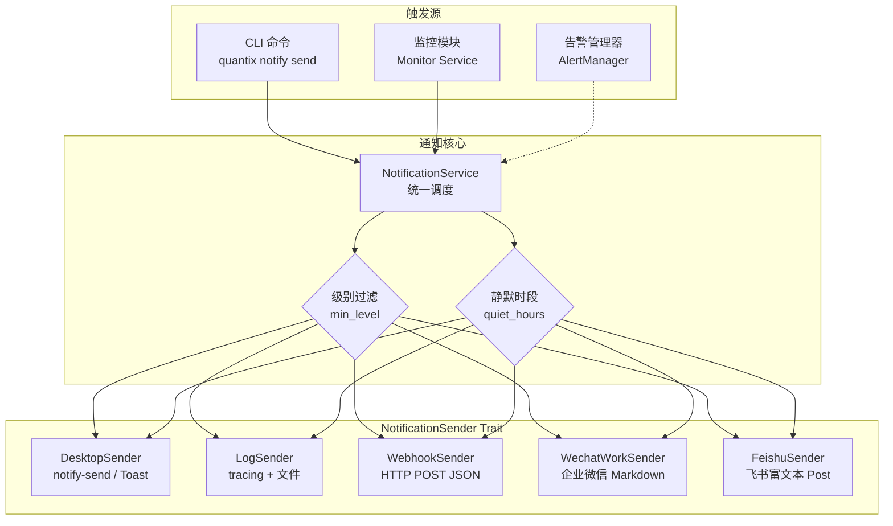
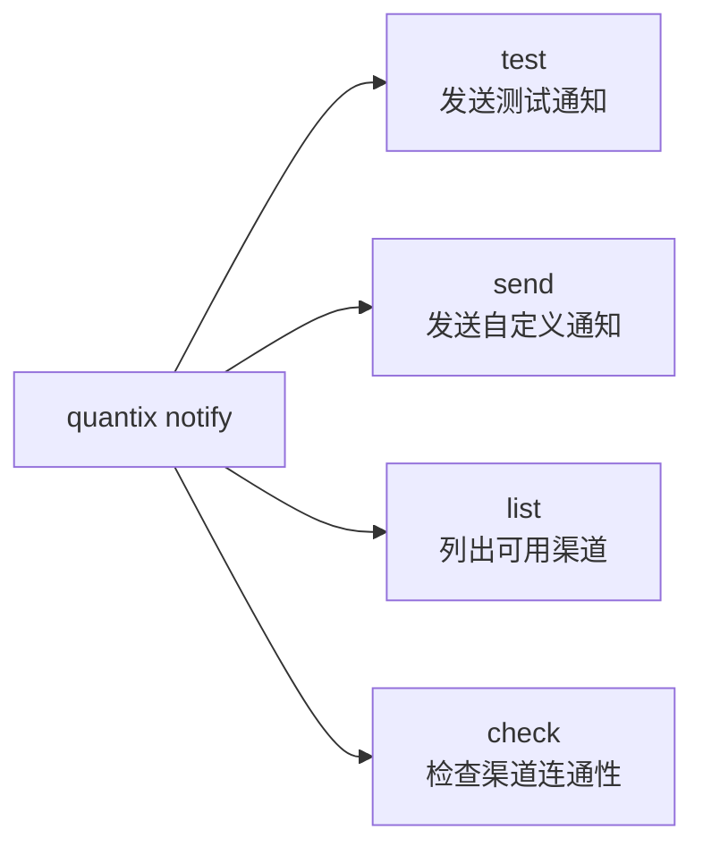
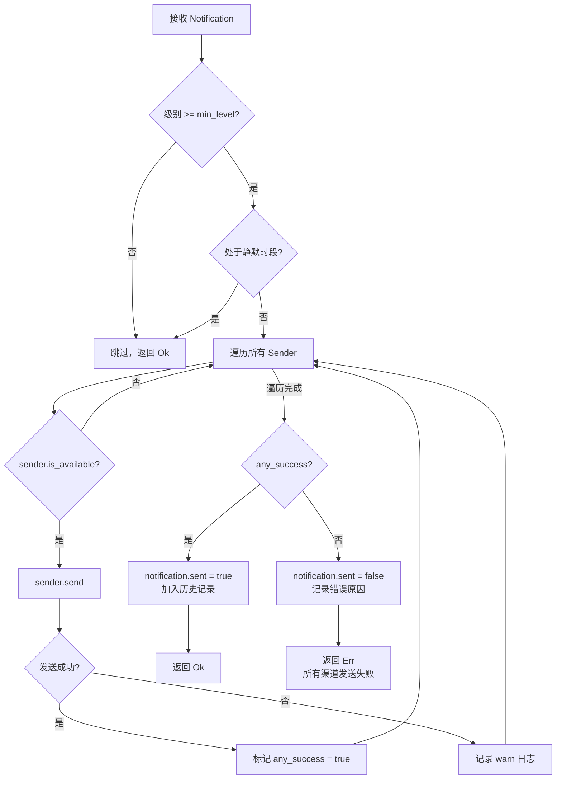

当量化交易系统在无人值守的状态下运行时，**及时的消息触达能力**直接决定了风控事件的响应速度。Quantix 的通知系统采用 **Trait 统一抽象 + 多渠道并行推送** 的架构设计，将桌面弹窗、自定义 Webhook、企业微信机器人、飞书机器人等渠道封装为可插拔的发送器（Sender），并通过 `NotificationService` 统一调度。你只需要配置环境变量或 TOML 文件，系统就能在策略信号触发、持仓异常、风控告警等关键时刻，将消息同时推送到你指定的所有渠道——零代码修改，开箱即用。

Sources: [mod.rs](src/monitoring/notification/mod.rs#L1-L21), [types.rs](src/monitoring/notification/types.rs#L1-L33)

---

## 架构总览：Trait 抽象与多渠道调度

通知系统的核心设计遵循 Rust 的 **Trait 抽象模式**。所有通知渠道都实现同一个 `NotificationSender` trait，使得 `NotificationService` 可以用统一的 `Vec<Box<dyn NotificationSender>>` 列表管理任意数量的渠道。这意味着新增一个渠道（比如钉钉），只需实现 trait 的三个方法，无需修改调度逻辑。



上图中，三个触发源（CLI 命令、监控服务、告警管理器）产生的通知统一进入 `NotificationService`。服务先执行**级别过滤**（低于 `min_level` 的通知直接丢弃），再检查**静默时段**，最后将通知并行分发给所有已启用的 `NotificationSender` 实现。只要任一渠道发送成功，通知即视为送达。

Sources: [traits.rs](src/monitoring/notification/traits.rs#L1-L20), [service.rs](src/monitoring/notification/service.rs#L10-L60)

---

## NotificationSender Trait：渠道的统一契约

整个通知系统的扩展点就是 `NotificationSender` 这个异步 trait。它定义了三个方法：

| 方法 | 签名 | 作用 |
|------|------|------|
| **`send`** | `async fn send(&self, notification: &Notification) -> Result<()>` | 执行实际的消息发送逻辑 |
| **`channel`** | `fn channel(&self) -> NotificationChannel` | 返回该发送器对应的渠道枚举值 |
| **`is_available`** | `fn is_available(&self) -> bool` | 检查渠道当前是否可用（默认返回 `true`） |

`is_available` 是一个关键的防护层——例如 `DesktopSender` 在 Linux 上会检查 `/usr/bin/notify-send` 是否存在，在非 Linux/Windows 平台直接返回 `false`。`NotificationService` 在分发时只对 `is_available()` 返回 `true` 的发送器调用 `send`，避免不必要的错误。

```rust
// 核心调度逻辑：遍历所有 sender，跳过不可用的，任一成功即可
for sender in &self.senders {
    if sender.is_available() {
        match sender.send(&notification).await {
            Ok(()) => { any_success = true; }
            Err(e) => { tracing::warn!("渠道 {} 发送失败: {}", sender.channel(), e); }
        }
    }
}
```

Sources: [traits.rs](src/monitoring/notification/traits.rs#L8-L20), [service.rs](src/monitoring/notification/service.rs#L83-L96)

---

## 支持的渠道一览

当前系统定义了 **11 种通知渠道**枚举，其中 **5 种已完整实现**，其余为预留接口。下表按实现状态分类：

| 渠道 | 枚举值 | 实现状态 | 配置方式 | 消息格式 |
|------|--------|---------|---------|---------|
| **日志** | `Log` | ✅ 已实现 | `log_path` 参数 | `[时间] [级别] 标题 - 内容` |
| **桌面通知** | `Desktop` | ✅ 已实现 | 无需配置 | 系统原生弹窗 |
| **通用 Webhook** | `Webhook` | ✅ 已实现 | `WEBHOOK_URL` 环境变量 | JSON POST |
| **企业微信** | `WechatWork` | ✅ 已实现 | `WECHAT_WORK_WEBHOOK_URL` | Markdown 富文本 |
| **飞书** | `Feishu` | ✅ 已实现 | `FEISHU_WEBHOOK_URL` | Post 富文本 |
| Telegram | `Telegram` | 🔲 预留 | `TELEGRAM_BOT_TOKEN` + `TELEGRAM_CHAT_ID` | — |
| Discord | `Discord` | 🔲 预留 | `DISCORD_WEBHOOK_URL` | — |
| Slack | `Slack` | 🔲 预留 | `SLACK_WEBHOOK_URL` | — |
| 钉钉 | `Dingtalk` | 🔲 预留 | `DINGTALK_WEBHOOK_URL` | — |
| PushPlus | `Pushplus` | 🔲 预留 | `PUSHPLUS_TOKEN` | — |
| 邮件 | `Email` | 🔲 预留 | — | — |

Sources: [types.rs](src/monitoring/notification/types.rs#L8-L33), [mod.rs](src/monitoring/notification/mod.rs#L10-L17)

---

## 已实现渠道详解

### 桌面通知（DesktopSender）

桌面通知利用操作系统原生通知机制，**Linux 通过 `notify-send`**，**Windows 通过 PowerShell 调用 Toast Notification API**。通知的紧急程度（urgency）会根据 `AlertLevel` 自动映射：`Info → low`、`Warning → normal`、`Error/Critical → critical`。

可用性检查逻辑基于平台：
- **Linux**：检测 `/usr/bin/notify-send` 是否存在
- **Windows**：始终返回 `true`（依赖 PowerShell）
- **其他平台**：返回 `false`

需要注意，桌面通知在无头服务器（headless server）或 Docker 容器中通常不可用，此时 `is_available()` 会正确返回 `false`，通知流程自动跳过此渠道。

Sources: [desktop.rs](src/monitoring/notification/desktop.rs#L1-L129)

### 日志通知（LogSender）

日志渠道是**唯一默认启用的渠道**，也是最可靠的后备通道。它同时做两件事：
1. 通过 `tracing` 框架按级别输出到标准日志（`info!` / `warn!` / `error!`）
2. 如果配置了 `log_path`，将格式化后的日志条目**追加写入**到指定文件

日志格式为：`[2026-04-20 14:30:00] [WARN] 标题 - 消息内容`。由于不依赖任何外部服务，`LogSender` 的 `is_available()` 始终返回 `true`。

Sources: [log.rs](src/monitoring/notification/log.rs#L1-L61)

### 通用 Webhook（WebhookSender）

Webhook 渠道向指定的 URL 发送 **HTTP POST JSON** 请求。Payload 结构包含通知 ID、标题、消息、级别、创建时间和元数据：

```json
{
  "id": "uuid-string",
  "title": "止盈止损触发",
  "message": "000001.SZ 已触发止损",
  "level": "critical",
  "created_at": "2026-04-20T06:30:00Z",
  "metadata": { "code": "000001.SZ", "event_type": "stop_loss" }
}
```

发送器使用 `reqwest::Client` 发起异步请求，判断 HTTP 响应状态码是否为 2xx 来确定成功与否。可用性条件为 URL 非空。

Sources: [webhook.rs](src/monitoring/notification/webhook.rs#L1-L61)

### 企业微信（WechatWorkSender）

企业微信渠道通过**群机器人 Webhook** 推送消息，消息格式为 **Markdown**。系统会自动将 `AlertLevel` 映射为对应的 emoji 前缀（ℹ️ / ⚠️ / ❌ / 🚨），并格式化为：

```
### 🚨 止盈止损触发

**2026-04-20 14:30:00**

> 000001.SZ 已触发止损
```

发送后，系统会解析响应体中的 `errcode` 字段，`errcode: 0` 表示成功。这意味着你可以直接用企业微信的群机器人 Webhook URL（格式为 `https://qyapi.weixin.qq.com/cgi-bin/webhook/send?key=YOUR_KEY`），无需额外开发。

Sources: [wechat_work.rs](src/monitoring/notification/wechat_work.rs#L1-L98)

### 飞书（FeishuSender）

飞书渠道使用**富文本 Post 消息类型**（`msg_type: "post"`），比纯文本和 Markdown 有更好的排版能力。消息体结构包含中文标题和分段内容标签：

```json
{
  "msg_type": "post",
  "content": {
    "post": {
      "zh_cn": {
        "title": "【critical】止盈止损触发",
        "content": [[
          {"tag": "text", "text": "000001.SZ 已触发止损"},
          {"tag": "text", "text": "\n\n时间: 2026-04-20 14:30:00"},
          {"tag": "text", "text": "\n级别颜色: red"}
        ]]
      }
    }
  }
}
```

飞书 API 的成功判断条件为响应 JSON 中 `code == 0`，与 `errcode` 的模式不同，系统已针对此差异做了适配。你只需提供飞书群机器人的 Webhook URL（格式为 `https://open.feishu.cn/open-apis/bot/v2/hook/YOUR_HOOK`）。

Sources: [feishu.rs](src/monitoring/notification/feishu.rs#L1-L103)

---

## Notification 消息模型

每条通知都是一个 `Notification` 结构体，通过**建造者模式**（Builder Pattern）链式构建：

```rust
let notification = Notification::new("止盈止损触发", "000001.SZ 已触发止损", AlertLevel::Critical)
    .with_alert_type(AlertType::Position {
        code: "000001.SZ".into(),
        reason: "跌破止损价".into(),
    })
    .with_metadata("code", "000001.SZ")
    .with_metadata("event_type", "stop_loss");
```

核心字段说明：

| 字段 | 类型 | 说明 |
|------|------|------|
| `id` | `String` | UUID 自动生成，全局唯一 |
| `title` | `String` | 通知标题 |
| `message` | `String` | 通知正文 |
| `level` | `AlertLevel` | 四级：Info / Warning / Error / Critical |
| `alert_type` | `Option<AlertType>` | 关联的告警类型（Signal / Position / Performance / Risk / System） |
| `sent` | `bool` | 发送后由服务标记 |
| `metadata` | `HashMap<String, String>` | 扩展键值对，用于 Webhook payload 等场景 |

`AlertLevel` 实现了 `Ord` trait，支持大小比较，使得 `min_level` 过滤可以直接用 `notification.level < self.config.min_level` 实现——级别从低到高为 `Info < Warning < Error < Critical`。

Sources: [types.rs](src/monitoring/notification/types.rs#L178-L251), [alert.rs](src/monitoring/alert.rs#L14-L32)

---

## 配置方式：环境变量与 TOML

通知系统支持**两种配置方式**，可以单独使用或组合使用。

### 方式一：环境变量（推荐用于生产/容器部署）

在 `.env` 文件或 Docker 环境变量中设置。系统会自动检测哪些渠道的必要变量已配置，并将其加入 `enabled_channels` 列表：

```bash
# 最低通知级别
NOTIFICATION_MIN_LEVEL=warning

# 通知日志路径
NOTIFICATION_LOG_PATH=./logs/notifications.log

# 按需启用（配置了哪个就启用哪个）
WEBHOOK_URL=https://your-server.com/webhook
WECHAT_WORK_WEBHOOK_URL=https://qyapi.weixin.qq.com/cgi-bin/webhook/send?key=xxx
FEISHU_WEBHOOK_URL=https://open.feishu.cn/open-apis/bot/v2/hook/xxx
DINGTALK_WEBHOOK_URL=https://oapi.dingtalk.com/robot/send?access_token=xxx
DINGTALK_SECRET=your_secret
```

`NotificationConfig::from_env()` 方法会逐一检查所有渠道的环境变量，已配置的渠道自动启用，未配置的自动跳过。**日志渠道始终启用**，作为兜底保障。

Sources: [types.rs](src/monitoring/notification/types.rs#L91-L153), [.env.example](.env.example#L33-L65)

### 方式二：TOML 配置文件

在 `config/default.toml` 中声明通知配置：

```toml
[notification]
enabled_channels = ["log", "wechat_work", "feishu"]
min_level = "warning"
log_path = "./logs/notifications.log"

# 静默时段（可选）
[notification.quiet_hours]
start = "23:00"
end = "07:00"

[notification.wechat_work]
webhook_url = "https://qyapi.weixin.qq.com/cgi-bin/webhook/send?key=YOUR_KEY"

[notification.feishu]
webhook_url = "https://open.feishu.cn/open-apis/bot/v2/hook/YOUR_HOOK"
```

Sources: [default.toml](config/default.toml#L44-L86)

### 静默时段（QuietHours）

静默时段是一个可选功能，配置后在该时段内**所有通知都不会发送**。支持跨午夜配置（例如 `23:00 → 07:00`），系统会自动判断当前时间是否落在区间内。

Sources: [types.rs](src/monitoring/notification/types.rs#L155-L176)

---

## CLI 命令：发送、测试与诊断

通知系统通过 `quantix notify` 命令提供完整的 CLI 交互能力，包含四个子命令：



### 列出可用渠道

```bash
quantix notify list
```

输出所有已定义的渠道名称、显示名和配置要求，帮助快速确认需要设置哪些环境变量。

### 发送测试通知

```bash
# 向所有已配置渠道发送测试
quantix notify test

# 指定渠道 + 自定义消息
quantix notify test --channel wechat_work --message "企业微信连通性测试"
```

### 发送自定义通知

```bash
# 基础用法
quantix notify send --title "手动告警" --message "沪深300突破关键阻力位"

# 指定级别和渠道
quantix notify send --title "风控通知" --message "持仓集中度过高" --level warning --channel feishu
```

`--level` 参数支持 `info` / `warning` / `error` / `critical`，`--channel` 参数支持中英文别名（如 `wechat` / `企业微信` / `wechat_work` 均可识别）。

### 检查渠道连通性

```bash
quantix notify check --channel feishu
```

该命令会先检查目标渠道的环境变量是否已配置，如果已配置则尝试发送一条测试通知，根据返回结果报告连通性状态。如果未配置，则输出需要设置的环境变量名称。

Sources: [notify.rs](src/cli/handlers/notify.rs#L1-L249), [info.rs](src/cli/commands/info.rs#L4-L44)

---

## 通知发送流程详解

`NotificationService.notify()` 方法是整个系统的调度核心。以下是完整执行流程：



关键设计决策：
- **任一成功即可**：不要求所有渠道都发送成功，只要有一个渠道成功就返回 `Ok`
- **失败不中断**：某个渠道发送失败只会记录 warn 日志，不会阻止后续渠道的发送
- **历史记录**：所有通知（无论成功失败）都会被记录到 `notification_history`，上限 100 条，超出后 FIFO 淘汰
- **级别比较**：`AlertLevel` 实现了 `Ord`，`Info < Warning < Error < Critical`，低于 `min_level` 的通知直接丢弃

Sources: [service.rs](src/monitoring/notification/service.rs#L66-L132)

---

## 与监控模块的集成

通知系统不是孤立的——它被 `monitor`（监控服务）在每次迭代后自动调用。当监控服务检测到新事件（价格告警、止损触发等），`send_monitor_notifications` 函数会为每个事件构建带元数据的 `Notification` 并调用 `NotificationService.notify()`：

```rust
// 监控服务中的通知集成
async fn send_monitor_notifications(output: &MonitorIterationOutput) -> Result<()> {
    let config = NotificationConfig::from_env();
    let mut service = NotificationService::new(config);
    for event in &output.new_events {
        let notification = Notification::new(
            format!("Monitor {} {}", event_label, event.code),
            format!("{}\n模式: {}\n时间: {}", event.message, event.run_mode, event.time),
            monitor_notification_level(event.event_type),  // PriceAlert → Warning, StopLoss → Critical
        )
        .with_metadata("event_type", ...)
        .with_metadata("code", event.code);
        let _ = service.notify(notification).await;
    }
    Ok(())
}
```

这意味着当你启用了监控服务（`quantix monitor run`）并配置了通知渠道后，监控事件会**自动推送**到你配置的企业微信、飞书等渠道，无需任何额外代码。

Sources: [monitor_handler.rs](src/cli/handlers/monitor_handler.rs#L677-L710)

---

## 扩展新渠道：开发者指南

添加一个新的通知渠道（例如钉钉），只需三步：

**第一步**：在 `src/monitoring/notification/` 下创建新文件 `dingtalk.rs`，实现 `NotificationSender` trait：

```rust
// dingtalk.rs
use async_trait::async_trait;
use crate::core::{QuantixError, Result};
use super::{Notification, NotificationChannel, NotificationSender};

pub struct DingtalkSender {
    webhook_url: String,
    client: reqwest::Client,
}

impl DingtalkSender {
    pub fn new(webhook_url: String) -> Self {
        Self { webhook_url, client: reqwest::Client::new() }
    }
}

#[async_trait]
impl NotificationSender for DingtalkSender {
    async fn send(&self, notification: &Notification) -> Result<()> {
        // 1. 构造钉钉 API payload
        // 2. 发送 HTTP POST
        // 3. 解析响应判断成功
        todo!("实现钉钉消息发送逻辑")
    }

    fn channel(&self) -> NotificationChannel { NotificationChannel::Dingtalk }
    fn is_available(&self) -> bool { !self.webhook_url.is_empty() }
}
```

**第二步**：在 `mod.rs` 中注册模块并导出：

```rust
mod dingtalk;
pub use self::dingtalk::DingtalkSender;
```

**第三步**：在 `service.rs` 的 `NotificationService::new()` 中添加渠道匹配分支，从配置读取 URL 并实例化 `DingtalkSender`。

Sources: [mod.rs](src/monitoring/notification/mod.rs#L1-L21), [service.rs](src/monitoring/notification/service.rs#L22-L52)

---

## 下一步阅读

- 通知系统是 **监控告警体系** 的推送层，理解告警的阈值配置和冷却机制请参阅 [监控告警体系与 Prometheus 指标导出](24-jian-kong-gao-jing-ti-xi-yu-prometheus-zhi-biao-dao-chu)
- 通知渠道的连通性依赖于正确的外部服务配置，生产环境部署请参阅 [Docker 容器化部署与生产环境配置](26-docker-rong-qi-hua-bu-shu-yu-sheng-chan-huan-jing-pei-zhi)
- 通知触发的风控事件来源请参阅 [风控规则体系（持仓/亏损/波动率/行业集中度）](18-feng-kong-gui-ze-ti-xi-chi-cang-yu-sun-bo-dong-lu-xing-ye-ji-zhong-du) 和 [止盈止损服务与实时评估](19-zhi-ying-zhi-sun-fu-wu-yu-shi-shi-ping-gu)