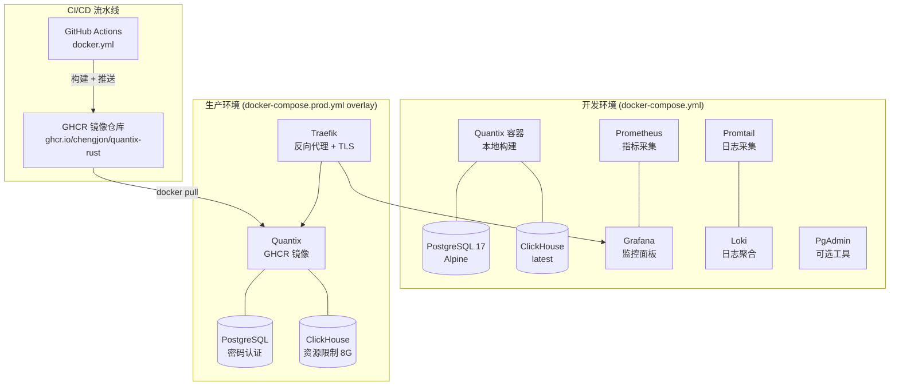
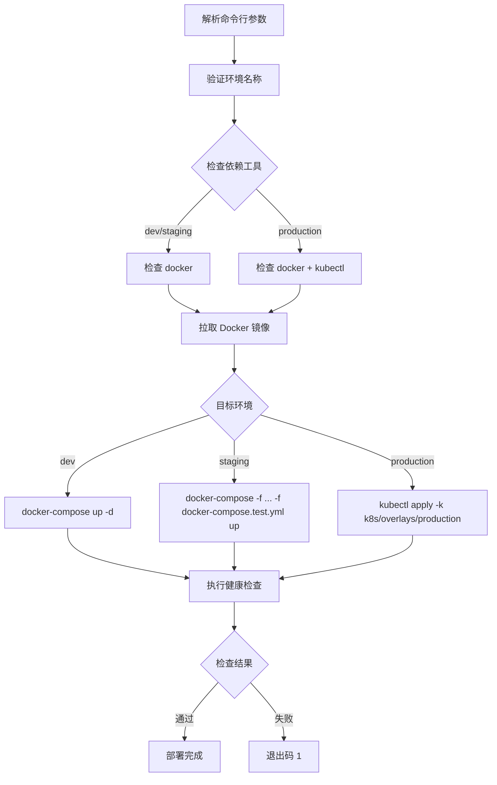

Quantix 采用 **Docker 多阶段构建** 与 **Compose 分层叠加** 的容器化策略，将 Rust 编译产物的构建与运行时环境完全分离，同时通过 `docker-compose.yml`（开发基线）与 `docker-compose.prod.yml`（生产覆盖）的 overlay 模式实现一套编排定义、两套运行配置。本文将从镜像构建原理、编排架构、监控栈集成、部署自动化以及非容器化 systemd 方案五个维度，系统解析项目的容器化部署体系。

## 容器化架构总览

项目在容器化层面提供两种互补的运行模式：**Docker Compose 全栈编排**（覆盖应用、数据库、监控链路）和 **systemd 裸机服务**（适用于无需容器化的生产宿主机部署）。两者共享同一份编译产物和配置目录，通过不同的进程管理方式实现灵活适配。

Sources: [Dockerfile](Dockerfile#L1-L77), [docker-compose.yml](docker-compose.yml#L1-L214), [docker-compose.prod.yml](docker-compose.prod.yml#L1-L251), [.github/workflows/docker.yml](.github/workflows/docker.yml#L1-L172)

## 多阶段构建：Dockerfile 深度解析

生产环境使用 **两阶段构建**，第一阶段基于 `rust:1.75-slim` 完成 Release 编译，第二阶段基于 `debian:bookworm-slim` 提供最小化运行时。这种分离策略的核心优势在于：最终镜像不包含 Rust 工具链和编译中间产物，体积从数 GB 压缩到百 MB 级别。

**第一阶段 — 依赖缓存层构建**：Dockerfile 利用 Cargo 的增量编译特性，先创建虚拟 `lib.rs` 和 `main.rs`（空 `fn main() {}`），执行 `cargo build --release` 预编译所有依赖。这一层产生的缓存只要 `Cargo.toml` 和 `Cargo.lock` 不变就不会失效，后续源码变更仅触发应用代码的增量编译。

**第二阶段 — 最小化运行时**：仅安装 `ca-certificates`、`postgresql-client`、`wget` 三个运行时必需的包，创建 `quantix` 非 root 用户（UID 1000），从构建阶段拷贝编译产物，设置 `RUST_LOG=info` 和 `QUANTIX_CONFIG_DIR=/app/config` 两个环境变量，并通过 `HEALTHCHECK` 指令声明 30 秒间隔的 `quantix health` 健康探针。

| 构建阶段 | 基础镜像 | 关键操作 | 目标 |
|----------|---------|---------|------|
| builder | `rust:1.75-slim` | 安装 `pkg-config`/`libssl-dev`，依赖缓存 + 应用编译 | 生成 Release 二进制 |
| runtime | `debian:bookworm-slim` | 安装 `ca-certificates`/`postgresql-client`/`wget`，创建 quantix 用户 | 最小化运行时 |

Sources: [Dockerfile](Dockerfile#L1-L77)

### 开发环境 Dockerfile

`Dockerfile.dev` 采用完全不同的策略：基于 `rust:1.75-slim` 单阶段构建，预装 `cargo-watch`（热重载工具）和 `cargo-edit`（依赖管理工具），启动命令为 `cargo-watch -x run`，在源码文件保存时自动触发重新编译和运行。`RUST_LOG=debug` 和 `RUST_BACKTRACE=1` 的环境变量设置确保开发期间能获得最详尽的诊断信息。

Sources: [Dockerfile.dev](Dockerfile.dev#L1-L42)

### .dockerignore 过滤策略

项目通过 `.dockerignore` 文件精确控制 Docker 构建上下文的范围。核心策略是将 `.git`、`docs/`、`tests/`、`benches/`、`target/` 等非构建必需的内容排除在外，同时保留 `README.md`（通过 `!README.md` 反向排除规则）。敏感文件如 `.env`、`.env.local` 被彻底排除，防止密钥泄露到镜像层中。

Sources: [.dockerignore](.dockerignore#L1-L86)

## 开发环境编排：docker-compose.yml

开发环境的 `docker-compose.yml` 定义了 **8 个服务**，形成一个完整的全栈开发环境。所有服务运行在 `quantix-network` 桥接网络中，通过 Docker 内部 DNS 实现服务发现。

### 核心服务配置

**Quantix 应用容器**通过本地 Dockerfile 构建，以只读模式挂载 `./config` 配置目录，使用命名卷 `quantix-logs` 和 `quantix-data` 持久化日志和本地数据。容器声明了对 `postgres` 和 `clickhouse` 的 `service_healthy` 依赖条件，确保数据库就绪后才启动应用。

**PostgreSQL 17** 使用 `postgres:17-alpine` 轻量镜像，挂载 `scripts/init-postgres.sql` 作为初始化脚本，通过 `pg_isready` 命令进行 10 秒间隔的健康检查。

**ClickHouse** 使用 `clickhouse/clickhouse-server:latest` 官方镜像，同时暴露 HTTP 接口（8123）和原生协议端口（9000），挂载 `scripts/init-clickhouse.sql` 初始化数据库和表结构，健康检查通过 `clickhouse-client --query "SELECT 1"` 验证。

| 服务 | 镜像 | 端口映射 | 健康检查方式 |
|------|------|---------|-------------|
| quantix | 本地 Dockerfile 构建 | 8080:8080 | `quantix health` (30s) |
| postgres | postgres:17-alpine | 5432:5432 | `pg_isready` (10s) |
| clickhouse | clickhouse/clickhouse-server:latest | 8123:8123, 9000:9000 | `clickhouse-client SELECT 1` (10s) |
| prometheus | prom/prometheus:latest | 9090:9090 | — |
| grafana | grafana/grafana:latest | 3000:3000 | — |
| loki | grafana/loki:latest | 3100:3100 | — |
| promtail | grafana/promtail:latest | — | — |
| pgadmin | dpage/pgadmin4:latest | 5050:80 | — (需 `--profile tools`) |

PgAdmin 使用 Docker Compose 的 `profiles` 特性，仅在使用 `docker-compose --profile tools up` 时启动，避免开发环境中不必要的资源占用。

Sources: [docker-compose.yml](docker-compose.yml#L1-L214)

### 数据卷规划

项目将数据持久化分为四类命名卷，全部带有 `quantix-` 前缀以便识别：

| 卷名 | 用途 | 挂载点 |
|------|------|-------|
| `quantix-logs` | 应用日志 | `/app/logs` |
| `quantix-data` | 本地数据文件 | `/app/data` |
| `quantix-postgres-data` | PostgreSQL 数据 | `/var/lib/postgresql/data` |
| `quantix-clickhouse-data` | ClickHouse 数据 | `/var/lib/clickhouse` |
| `quantix-prometheus-data` | Prometheus 时序数据 | `/prometheus` |
| `quantix-grafana-data` | Grafana 面板配置 | `/var/lib/grafana` |
| `quantix-loki-data` | Loki 日志存储 | `/loki` |

Sources: [docker-compose.yml](docker-compose.yml#L187-L214)

## 生产环境覆盖：docker-compose.prod.yml

生产环境采用 **Compose overlay 模式**：`docker-compose.prod.yml` 作为覆盖文件，仅声明与开发环境不同的配置项，两者合并后形成最终的生产配置。启动命令为 `docker-compose -f docker-compose.yml -f docker-compose.prod.yml up -d`。

### 资源限制与重启策略

生产配置为每个服务声明了精细的 CPU 和内存限制，通过 `deploy.resources` 块实现容器级别的资源隔离。Quantix 应用限制为 2 核 4GB，ClickHouse 因需要处理大量时序数据获得 4 核 8GB 的最高配额。

| 服务 | CPU 上限 | 内存上限 | CPU 预留 | 内存预留 |
|------|---------|---------|---------|---------|
| quantix | 2 核 | 4 GB | 1 核 | 2 GB |
| postgres | 2 核 | 4 GB | 1 核 | 2 GB |
| clickhouse | 4 核 | 8 GB | 2 核 | 4 GB |
| prometheus | 1 核 | 2 GB | 0.5 核 | 1 GB |
| grafana | 0.5 核 | 512 MB | 0.25 核 | 256 MB |
| loki | 1 核 | 1 GB | 0.5 核 | 512 MB |

应用的 `restart_policy` 配置为 `on-failure`，最多重试 3 次，每次间隔 5 秒，监控窗口 120 秒。ClickHouse 的 `ulimits.nofile` 提升到 262144，确保高并发时序写入不会因文件描述符耗尽而失败。

Sources: [docker-compose.prod.yml](docker-compose.prod.yml#L1-L200)

### Traefik 反向代理与 TLS

生产环境引入 Traefik v2.10 作为反向代理，提供自动 TLS 证书管理（Let's Encrypt）、路由分发和基础认证。Traefik 暴露 80（HTTP）和 443（HTTPS）端口，通过 Docker provider 自动发现带有 `traefik.enable=true` 标签的服务。

**网络隔离设计**：生产环境定义了两个网络 — `quantix-network`（标记为 `internal: true`）和 `traefik-public`。应用和数据库仅连接内部网络，无法被外部直接访问；只有 Traefik 同时连接两个网络，作为唯一的入口网关。这种双网络架构确保数据库服务不暴露到公网。

**必需环境变量**：`docker-compose.prod.yml` 使用 Docker Compose 的 `${VAR:?message}` 语法强制要求以下环境变量存在：

| 环境变量 | 用途 | 验证 |
|---------|------|------|
| `POSTGRES_PASSWORD` | PostgreSQL 密码 | 启动时检查 |
| `CLICKHOUSE_PASSWORD` | ClickHouse 密码 | 启动时检查 |
| `GRAFANA_ADMIN_PASSWORD` | Grafana 管理员密码 | 启动时检查 |
| `ACME_EMAIL` | Let's Encrypt 邮箱 | 启动时检查 |
| `TRAEFIK_AUTH_USERS` | Traefik 基础认证凭据 | 启动时检查 |
| `VERSION` | 镜像版本标签 | 默认 `latest` |

Sources: [docker-compose.prod.yml](docker-compose.prod.yml#L201-L251)

### 日志驱动与轮转配置

所有生产服务统一使用 `json-file` 日志驱动，并配置了日志轮转策略。应用容器保留最多 5 个 100MB 的日志文件，数据库和监控服务保留 3 个 50MB 的文件，Promtail 最精简仅保留 1 个 10MB 文件。这种分层配置确保日志不会无限增长占用磁盘空间。

Sources: [docker-compose.prod.yml](docker-compose.prod.yml#L34-L39)

## 数据库初始化与性能调优

### PostgreSQL 初始化

`scripts/init-postgres.sql` 在容器首次启动时执行，完成三项关键配置：创建 `uuid-ossp` 和 `pg_trgm` 扩展（支持 UUID 自动生成和模糊匹配），授权 `quantix` 用户对数据库的完整权限，以及通过 `ALTER SYSTEM` 进行性能参数调优 — `shared_buffers=256MB`、`effective_cache_size=1GB`、`work_mem=2621kB` 等，这些都是针对 4GB 内存容器的优化值。

Sources: [scripts/init-postgres.sql](scripts/init-postgres.sql#L1-L41)

### ClickHouse 初始化

`scripts/init-clickhouse.sql` 创建了五张核心业务表，每张表都针对查询模式进行了分区和排序优化：

| 表名 | 引擎 | 排序键 | 分区策略 | TTL |
|------|------|--------|---------|-----|
| `stock_info` | MergeTree | `(market, code)` | `toYYYYMM(list_date)` | 无 |
| `stock_realtime_quotes` | MergeTree | `(timestamp, code)` | `toYYYYMM(timestamp)` | 30 天 |
| `kline_data` | MergeTree | `(timestamp, code, period)` | `(toYYYYMM(timestamp), period)` | 365 天 |
| `gbbq_events` | MergeTree | `(ex_date, code)` | `toYYYYMM(ex_date)` | 无 |
| `limit_up_events` | MergeTree | `(trade_date, code)` | `toYYYYMM(trade_date)` | 730 天 |

实时行情表设置 30 天 TTL 自动过期，K 线数据保留一年，涨停板事件保留两年，实现了存储成本与数据可用性的平衡。

Sources: [scripts/init-clickhouse.sql](scripts/init-clickhouse.sql#L1-L94)

## 监控栈：Prometheus + Grafana + Loki

### Prometheus 指标采集

Prometheus 配置文件定义了 6 个采集目标，覆盖从应用层到基础设施层的完整可观测性链路。Quantix 应用的采集间隔为 30 秒（比全局默认的 15 秒更保守），路径为 `/metrics`。数据保留策略为 30 天（开发环境）或 30 天 + 10GB 上限（生产环境）。

| 采集目标 | Job 名称 | 采集间隔 | 监控范围 |
|---------|---------|---------|---------|
| Prometheus 自身 | `prometheus` | 15s | 采集器健康状态 |
| Quantix 应用 | `quantix` | 30s | API 请求、数据库连接、策略信号 |
| PostgreSQL | `postgres` | 30s | 连接池、查询性能（需 postgres_exporter） |
| ClickHouse | `clickhouse` | 30s | 内存、查询吞吐（需 clickhouse_exporter） |
| Node Exporter | `node` | 30s | CPU、内存、磁盘（需 node_exporter） |
| cAdvisor | `cadvisor` | 30s | 容器资源使用率 |

Sources: [monitoring/prometheus.yml](monitoring/prometheus.yml#L1-L65)

### Promtail 日志采集管线

Promtail 配置了四条日志采集管线，针对不同来源使用差异化的解析策略：

- **容器日志**：从 Docker 容器标准输出采集，使用 JSON + 正则表达式提取 `container_name` 和 `container_id` 标签
- **系统日志**：扫描 `/var/log/**/*.log`，通过正则匹配日志级别（ERROR/WARN/INFO/DEBUG）
- **Quantix 应用日志**：解析 JSON 格式日志，提取 `timestamp`、`level`、`target`、`span_id`、`trace_id` 等结构化字段
- **PostgreSQL 日志**：过滤包含 `ERROR:`、`FATAL:`、`PANIC:` 的关键日志行

Sources: [monitoring/promtail.yml](monitoring/promtail.yml#L1-L110)

### Loki 日志聚合

Loki 使用单节点模式（`replication_factor: 1`），基于文件系统存储（`boltdb-shipper` + `filesystem`），启用 100MB 的嵌入式缓存加速查询。Schema 版本为 v11，索引按 24 小时分片。生产环境限制 Loki 使用 1 核 1GB 内存。

Sources: [monitoring/loki.yml](monitoring/loki.yml#L1-L50)

### 告警规则体系

`monitoring/alerts.yml` 定义了两大告警规则组，共计 15 条规则，覆盖应用层、业务层、资源层和数据库层四个维度：

**应用层告警**（`quantix_alerts` 组，30 秒评估间隔）：

| 规则名称 | 条件 | 持续时间 | 严重级别 |
|---------|------|---------|---------|
| `ApplicationDown` | `up{job="quantix"} == 0` | 1 分钟 | critical |
| `HighErrorRate` | 5xx 比率 > 5% | 5 分钟 | warning |
| `HighLatency` | P95 延迟 > 1s | 5 分钟 | warning |
| `DatabaseConnectionPoolExhausted` | 连接池使用率 > 90% | 5 分钟 | warning |

**业务层告警**：

| 规则名称 | 条件 | 严重级别 |
|---------|------|---------|
| `DataCollectionDelay` | 最后采集时间超过 5 分钟 | warning |
| `StrategySignalAnomaly` | 策略信号频率 > 10/分钟 | info |
| `BacktestFailureRate` | 回测失败率 > 10% | warning |

Sources: [monitoring/alerts.yml](monitoring/alerts.yml#L1-L217)

## 健康检查机制

项目建立了 **多层健康检查** 体系。Dockerfile 内嵌了 `HEALTHCHECK` 指令，以 30 秒间隔执行 `quantix health` 命令，启动宽限期 5 秒，超时 10 秒，连续 3 次失败标记为 unhealthy。Docker Compose 配置进一步将启动宽限期延长至 40 秒，为应用初始化和数据库连接建立留出充足时间。

`scripts/health-check.sh` 脚本提供了更灵活的健康检查方案，按优先级尝试三种检测方式：首先使用 `curl` 访问 HTTP 健康端点（默认 `http://localhost:8080/health`），检查响应中是否包含 `"status":"ok"` 或 `"healthy":true`；curl 不可用时回退到 `wget`；两者都不可用时直接执行 `quantix health` CLI 命令。

Sources: [Dockerfile](Dockerfile#L68-L69), [docker-compose.yml](docker-compose.yml#L33-L38), [scripts/health-check.sh](scripts/health-check.sh#L1-L55)

## 部署自动化

### deploy.sh 部署脚本

`scripts/deploy/deploy.sh` 是一个多环境部署脚本，支持 `dev`、`staging`、`production` 三种环境，提供 `--dry-run` 模拟运行选项。脚本的核心工作流如下：

开发环境使用 `docker-compose up -d --force-recreate quantix` 强制重建容器；测试环境叠加 `docker-compose.test.yml` 覆盖文件；生产环境通过 `kubectl apply -k k8s/overlays/production` 部署到 Kubernetes 集群，并使用 `kubectl rollout status` 等待部署完成（超时 5 分钟）。健康检查阶段，dev/staging 通过 `curl http://localhost:8080/health` 验证，production 通过检查 Pod 运行状态验证。

Sources: [scripts/deploy/deploy.sh](scripts/deploy/deploy.sh#L1-L224)

### GitHub Actions CI/CD

`.github/workflows/docker.yml` 定义了四个 Job 组成完整的镜像发布流水线：

**构建阶段**（`build`）：使用 Docker Buildx 进行多平台构建（`linux/amd64` + `linux/arm64`），通过 GitHub Actions Cache（`cache-from: type=gha`）缓存构建层，利用 `docker/metadata-action` 自动生成语义化标签 — 分支推送产生 `main` 标签，Tag 推送产生 `v1.0.0`、`v1.0`、`v1` 三级标签，main 分支始终标记为 `latest`。

**安全扫描**（`security-scan`）：使用 Trivy 漏洞扫描器对镜像进行 SARIF 格式扫描，结果上传到 GitHub Security 标签页。

**测试部署**（`deploy-test`）：仅 main 分支的 push 事件触发，部署到测试环境后执行验证。

**发布**（`release`）：仅在 `v*` 标签推送时触发，自动生成包含 Docker 镜像拉取命令和变更日志的 GitHub Release。

Sources: [.github/workflows/docker.yml](.github/workflows/docker.yml#L1-L172)

## 非容器化方案：systemd 服务部署

对于不适合使用 Docker 的生产环境，项目提供了完整的 **systemd 服务** 方案。`config/systemd/` 目录包含三个服务单元文件，覆盖数据采集、策略运行和任务调度三个核心业务模块。

### 服务单元配置

以 `quantix-data-collector.service` 为例，服务单元配置了以下关键参数：

- **依赖关系**：通过 `After=network-online.target clickhouse.service postgresql.service` 确保网络和数据库就绪
- **进程管理**：`Restart=always`，`RestartSec=10s`，60 秒内最多重启 3 次（`StartLimitBurst=3`）
- **资源限制**：`MemoryMax=2G`，`CPUQuota=200%`
- **安全加固**：`NoNewPrivileges=true`，`PrivateTmp=true`，`ProtectSystem=strict`，`ProtectHome=true`，仅允许 `/opt/quantix-rust` 和 `/var/log/quantix` 可写

**三个服务的资源分配差异**：

| 服务 | 内存上限 | CPU 配额 | 用途 |
|------|---------|---------|------|
| data-collector | 2 GB | 200% | 数据采集（高 I/O） |
| task-scheduler | 512 MB | 50% | 任务调度（轻量） |
| strategy-runner | — | — | 策略运行 |

Sources: [config/systemd/quantix-data-collector.service](config/systemd/quantix-data-collector.service#L1-L47), [config/systemd/quantix-task-scheduler.service](config/systemd/quantix-task-scheduler.service#L1-L47)

### 服务管理工具链

`scripts/runtime/install-services.sh` 负责将 `.service` 文件安装到 `/etc/systemd/system/`，执行 `systemctl daemon-reload` 并启用开机自启。`scripts/runtime/services.sh` 提供统一的管理入口，支持 `start`/`stop`/`restart`/`status`/`logs`/`enable`/`disable` 七种操作，以及 `start-all`/`stop-all`/`status-all` 批量操作，内部通过关联数组将 `data-collector`、`strategy-runner`、`task-scheduler` 短名称映射到完整的 systemd 单元名。

Sources: [scripts/runtime/install-services.sh](scripts/runtime/install-services.sh#L1-L57), [scripts/runtime/services.sh](scripts/runtime/services.sh#L1-L200)

## 环境变量配置体系

`.env.example` 定义了项目的完整环境变量模板，按功能分为五个区块。在 Docker 部署中，这些变量通过 `docker-compose.yml` 的 `environment` 字段注入容器；在 systemd 部署中，通过服务单元的 `Environment` 指令设置。

| 区块 | 核心变量 | 说明 |
|------|---------|------|
| 数据库 | `POSTGRES_HOST`, `CLICKHOUSE_URL`, `TDENGINE_HOST` | 多数据库连接配置 |
| 数据源 | `TDX_HOSTS`, `TDX_PORT`, `AKSHARE_BASE_URL` | TDX/AKShare 数据源 |
| 通知 | `NOTIFICATION_MIN_LEVEL`, `WEBHOOK_URL`, `WECHAT_WORK_WEBHOOK_URL` | 多渠道通知集成 |
| AI 决策 | `LLM_PROVIDER`, `DEEPSEEK_API_KEY`, `OPENAI_API_KEY` | LLM 多模型适配 |
| 新闻搜索 | `TAVILY_API_KEY`, `SERPAPI_API_KEY`, `BOCHA_API_KEY` | 多源新闻聚合 |

Sources: [.env.example](.env.example#L1-L105)

## 生产环境安全加固清单

| 加固措施 | 实现方式 | 配置位置 |
|---------|---------|---------|
| 非 root 运行 | 创建 `quantix` 用户（UID 1000） | Dockerfile L46 |
| 密码强制验证 | `${VAR:?message}` 语法 | docker-compose.prod.yml |
| 网络隔离 | `internal: true` 内部网络 | docker-compose.prod.yml L240 |
| 日志轮转 | `json-file` 驱动 + `max-size/max-file` | docker-compose.prod.yml |
| TLS 终止 | Traefik + Let's Encrypt ACME | docker-compose.prod.yml L212-L214 |
| 基础认证 | `traefik.http.middlewares.auth.basicauth` | docker-compose.prod.yml L235 |
| 资源限制 | `deploy.resources.limits` | docker-compose.prod.yml |
| 只读配置挂载 | `./config:/app/config:ro` | docker-compose.yml L23 |
| 最小运行时依赖 | `debian:bookworm-slim` + 3 个包 | Dockerfile L39-L43 |
| systemd 安全加固 | `NoNewPrivileges`/`ProtectSystem`/`PrivateTmp` | systemd service 文件 |

Sources: [Dockerfile](Dockerfile#L46-L62), [docker-compose.prod.yml](docker-compose.prod.yml#L1-L251), [config/systemd/quantix-data-collector.service](config/systemd/quantix-data-collector.service#L37-L43)

## 延伸阅读

- 了解 CI/CD 流水线的完整构建与发布流程：[GitHub Actions CI/CD 流水线](27-github-actions-ci-cd-liu-shui-xian)
- 深入监控告警规则的设计与通知渠道配置：[监控告警体系与 Prometheus 指标导出](24-jian-kong-gao-jing-ti-xi-yu-prometheus-zhi-biao-dao-chu)、[多渠道通知](25-duo-qu-dao-tong-zhi-zhuo-mian-webhook-qi-ye-wei-xin-fei-shu-ding-ding)
- 理解应用层的配置加载与环境变量集成：[配置管理与多环境加载机制](5-pei-zhi-guan-li-yu-duo-huan-jing-jia-zai-ji-zhi)
- 数据库初始化脚本对应的存储层实现：[多数据库集成](9-duo-shu-ju-ku-ji-cheng-clickhouse-postgresql-tdengine)