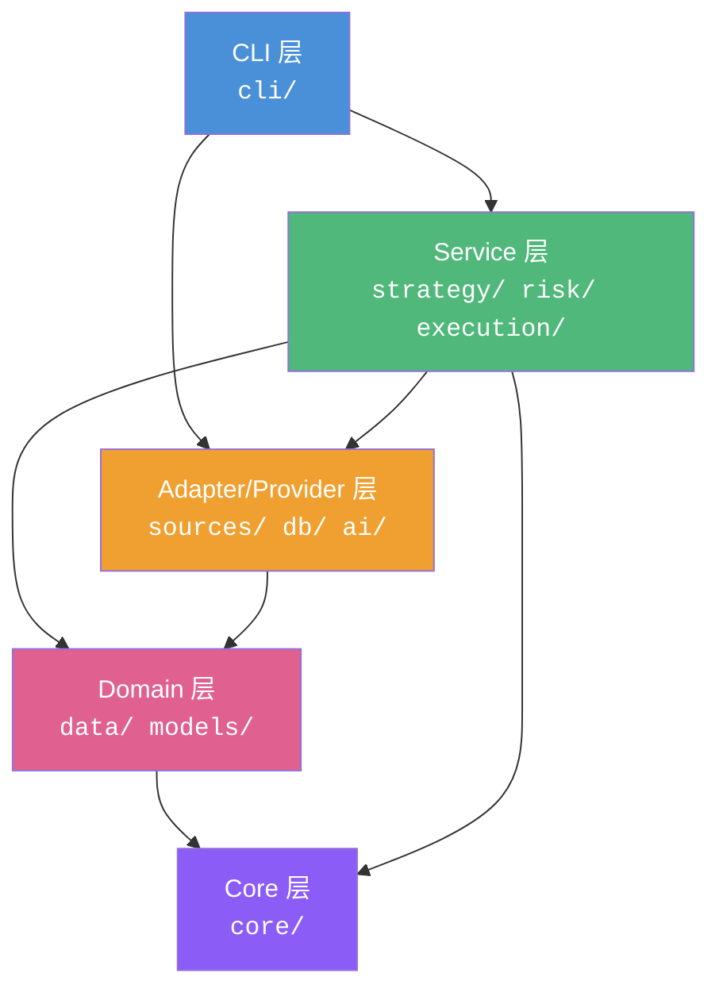

本项目 quantix-rust 是一个面向 A股量化交易的 Rust CLI 工具，拥有 26 个功能模块、超过 200 个源文件。在这样一个规模的代码库中，统一的编码规范不是"锦上添花"，而是团队协作和长期维护的**生存底线**。本文档聚焦三个核心维度——**文件拆分**、**模块组织**和**类型安全**——带你从实际代码中理解项目为什么这样写，以及你在贡献代码时应该遵循什么模式。

如果你还没有阅读过项目的整体结构，建议先从 [项目架构全景](3-xiang-mu-jia-gou-quan-jing) 了解模块划分的全貌。

Sources: [lib.rs](src/lib.rs#L1-L50), [Cargo.toml](Cargo.toml#L1-L129)

---

## 一、文件拆分：控制单文件复杂度

### 1.1 行数阈值体系

项目对各类文件设定了明确的行数上限，一旦超过阈值就必须拆分：

| 文件类型 | ⚠️ 考虑拆分 | 🚫 强制拆分 | 说明 |
|----------|:-----------:|:-----------:|------|
| 普通模块文件 `.rs` | > 500 行 | > 800 行 | 含 `mod.rs` |
| 单一 struct/enum 实现 | > 300 行 | > 500 行 | 应拆分 trait impl 到独立文件 |
| CLI handler 文件 | > 800 行 | > 1200 行 | 拆为 `handlers/xxx.rs` 目录模式 |
| `lib.rs` / `main.rs` | > 100 行 | > 150 行 | 仅保留 `mod` 声明和 re-export |
| 集成测试 `tests/*.rs` | > 500 行 | > 1000 行 | 按功能模块拆分 |

这些阈值不是凭空设定的——它们来自对项目中实际文件复杂度的统计分析。以本项目的入口文件为例，`lib.rs` 只有 50 行，`main.rs` 仅 24 行，它们严格遵循"入口文件只做声明和转发"的原则。

Sources: [lib.rs](src/lib.rs#L1-L50), [main.rs](src/main.rs#L1-L24), [RUST_CODING_STANDARDS.md](docs/RUST_CODING_STANDARDS.md#L7-L16)

### 1.2 拆分策略：按职责分层

当文件达到拆分阈值时，按照以下四个维度拆分：

```
拆分前:
src/risk/
├── mod.rs              (600+ 行，混杂模型、存储、服务逻辑)

拆分后:
src/risk/
├── mod.rs              (40 行，仅 mod 声明 + pub use)
├── models.rs           (数据结构定义)
├── storage.rs          (持久化逻辑)
├── service.rs          (业务编排)
├── industry.rs         (行业解析)
├── volatility.rs       (波动率计算)
├── import_store/       (复杂子功能，进一步拆为目录)
│   └── ...
└── service/            (service 的辅助文件)
    ├── industry_checks.rs
    └── state_helpers.rs
```

这遵循四个核心原则：

1. **按职责拆**：类型定义（`models.rs`）、Trait 定义（`adapter.rs`）、业务逻辑（`service.rs`）、持久化（`storage.rs`）各归其位
2. **`mod.rs` 纯净**：只允许 `pub mod` 声明和 `pub use` 重导出，禁止业务逻辑
3. **单文件单一关注点**：一个文件只做一件事
4. **`#[path]` 辅助拆分**：当 `.rs` 文件和同名目录共存时（如 `service.rs` 旁有 `service/` 目录），使用 `#[path = "service/xxx.rs"]` 引用子模块

Sources: [risk/mod.rs](src/risk/mod.rs#L1-L40), [risk/service.rs](src/risk/service.rs#L1-L26)

### 1.3 `#[path]` 属性：同名文件与目录共存

当一个模块既需要独立的 `.rs` 文件，又需要子目录来存放辅助代码时，Rust 不允许同名的 `.rs` 和目录直接共存。项目使用 `#[path]` 属性解决这一问题：

```rust
// src/risk/service.rs
#[path = "service/industry_checks.rs"]
mod industry_checks;
mod state_helpers;
```

这样 `service.rs` 可以保持为主入口，同时将 `industry_checks.rs` 和 `state_helpers.rs` 放在 `service/` 子目录中，实现了逻辑拆分而不破坏模块层级。

Sources: [risk/service.rs](src/risk/service.rs#L1-L4)

### 1.4 `#[cfg(test)]` 模式：测试工具仅测试时编译

策略模块中的 `test_utils.rs` 只在测试时编译：

```rust
// src/strategy/mod.rs
#[cfg(test)]
pub mod test_utils;
```

这确保测试辅助代码不会进入生产构建，减小二进制体积和编译时间。CLI 模块也采用同样模式：

```rust
// src/cli/mod.rs
#[cfg(test)]
mod tests;
```

Sources: [strategy/mod.rs](src/strategy/mod.rs#L14-L15), [cli/mod.rs](src/cli/mod.rs#L23-L24)

---

## 二、模块组织：清晰的层级与导出

### 2.1 模块层级依赖方向

项目严格遵循**单向依赖层级**，禁止循环依赖和反向依赖：



| 层级 | 目录 | 职责 | 依赖方向 |
|------|------|------|----------|
| **CLI 层** | `cli/` | 命令解析、用户交互、输出格式化 | → Service / Adapter |
| **Service 层** | `strategy/`, `risk/`, `execution/` | 业务编排、状态管理、规则评估 | → Adapter / Domain / Core |
| **Adapter 层** | `sources/`, `db/`, `ai/` | 外部 API 封装、数据库连接 | → Domain / Core |
| **Domain 层** | `data/` | 纯数据结构定义 | → Core |
| **Core 层** | `core/` | 错误类型、配置、运行时工具 | 无外部依赖 |

**绝对禁止**的依赖方向：`core ← cli`（Core 不能依赖 CLI）、`execution ↔ risk`（双向循环）。

Sources: [core/mod.rs](src/core/mod.rs#L1-L16), [cli/mod.rs](src/cli/mod.rs#L1-L25)

### 2.2 `mod.rs` 标准模板

项目中每个模块的 `mod.rs` 都遵循统一的**三段式结构**：文档注释 → 子模块声明 → 类型重导出。以下是一个典型案例：

```rust
// src/risk/mod.rs

// ① 子模块声明（按字母序排列）
pub mod import_store;
pub mod importer;
pub mod industry;
pub mod industry_store;
pub mod industry_sync;
pub mod models;
pub mod rebuild;
pub mod service;
pub mod storage;
pub mod volatility;

// ② 类型重导出（按使用频率排序，最常用的排前面）
pub use import_store::SqliteLiveImportStore;
pub use models::{RiskRule, RiskRuleType, RiskState, RiskStatus, RuleValue};
pub use service::{RiskService, RiskStore};
pub use storage::JsonRiskStore;
```

这个模式的好处是：外部模块只需要 `use crate::risk::RiskService`，不需要知道 `RiskService` 定义在哪个子文件里。

Sources: [risk/mod.rs](src/risk/mod.rs#L1-L40)

### 2.3 `lib.rs` 与 `main.rs`：极致精简

**`lib.rs`**（50 行）只做两件事——声明所有顶级模块和重新导出最常用的类型：

```rust
// src/lib.rs — 模块级文档注释
/// quantix-cli - A股量化交易 CLI 工具
pub mod account;
pub mod core;
pub mod execution;
pub mod risk;
pub mod strategy;
// ... 共 26 个顶级模块

// 重新导出常用类型，降低外部使用成本
pub use cli::Cli;
pub use core::{QuantixError, Result};
```

**`main.rs`**（24 行）作为二进制入口，只做三件事——初始化日志、解析命令、运行：

```rust
// src/main.rs
use clap::Parser;
use quantix_cli::{Cli, Result};

#[tokio::main]
async fn main() -> Result<()> {
    tracing_subscriber::fmt()
        .with_env_filter(std::env::var("RUST_LOG")
            .unwrap_or_else(|_| "quantix_cli=info,sqlx=warn".to_string()))
        .init();
    Cli::parse().run().await
}
```

**红线**：`lib.rs` 禁止超过 150 行，`main.rs` 禁止包含任何业务逻辑。

Sources: [lib.rs](src/lib.rs#L1-L50), [main.rs](src/main.rs#L1-L24)

### 2.4 CLI 命令的分层分发

CLI 层采用**命令定义 → Handler 分发**的两层架构。`commands/mod.rs` 定义枚举和 `run()` 分发方法，`handlers/` 目录下的文件实现具体逻辑：

```
src/cli/
├── mod.rs              (导出 commands + handlers)
├── commands/
│   ├── mod.rs          (Cli 枚举定义 + run() 分发)
│   ├── strategy.rs     (策略相关命令子枚举)
│   ├── risk.rs         (风控相关命令子枚举)
│   └── ...
└── handlers/           (各命令的具体执行逻辑)
```

命令枚举使用 `clap` 的 derive 模式，每个子命令对应一个 `Handlers` 中的函数：

```rust
// 命名规范：run_{模块}_{子命令}
pub async fn run_market_command(cmd: MarketCommands) -> Result<()> {
    match cmd {
        MarketCommands::Sector { top, date } => run_market_sector(top, date).await,
        // ...
    }
}
```

Sources: [cli/commands/mod.rs](src/cli/commands/mod.rs#L44-L200), [cli/mod.rs](src/cli/mod.rs#L1-L25)

---

## 三、类型安全：用编译器消灭运行时错误

### 3.1 枚举替代魔法值

项目中**所有状态、方向、类型都用枚举表示**，杜绝字符串硬编码。以订单状态为例：

```rust
// src/execution/models.rs
#[derive(Debug, Clone, Copy, PartialEq, Eq, Serialize, Deserialize)]
pub enum OrderStatus {
    PendingSubmit,
    Submitted,
    Accepted,
    PartiallyFilled,
    PendingCancel,
    Filled,
    Canceled,
    Rejected,
    Unknown,
}
```

每个枚举都配备 `as_str()` 和 `from_str()` 方法用于序列化/反序列化：

```rust
impl OrderStatus {
    pub fn as_str(self) -> &'static str {
        match self {
            Self::PendingSubmit => "pending_submit",
            Self::Filled => "filled",
            // ...
        }
    }
}
```

这种模式在整个项目中一致出现——`StrategyRunStatus`、`SignalStatus`、`ApprovalStatus`、`ExecutionRequestStatus`、`OrderSide`、`OrderType` 等枚举都采用完全相同的 derive 集合和方法签名。

Sources: [execution/models.rs](src/execution/models.rs#L15-L109)

### 3.2 `Decimal` 替代浮点数：金融数据的铁律

在量化交易场景中，`f64` 的精度丢失是不可接受的。项目**强制要求所有价格和金额字段使用 `rust_decimal::Decimal`**：

```rust
// src/data/models.rs
#[derive(Debug, Clone, Serialize, Deserialize)]
pub struct Kline {
    pub code: String,
    pub date: NaiveDate,
    pub open: Decimal,    // ✅ Decimal，非 f64
    pub high: Decimal,
    pub low: Decimal,
    pub close: Decimal,
    pub volume: i64,       // ✅ 整数，非 f64
    pub amount: Option<Decimal>,
    pub adjust_type: AdjustType,
}
```

这同样适用于执行层的请求/响应模型和风控层的状态快照。项目的 `Cargo.toml` 中同时启用了 `rust_decimal` 的 `serde` 和 `db-tokio-postgres` feature，确保序列化和数据库交互的精度一致性。

Sources: [data/models.rs](src/data/models.rs#L1-L30), [Cargo.toml](Cargo.toml#L54)

### 3.3 Trait 抽象：面向接口编程

项目通过 Trait 将核心能力抽象为接口，使不同实现可以互换。以下是三个关键 Trait 的对比：

| Trait | 定义位置 | 核心方法 | 实现者 |
|-------|---------|---------|--------|
| `ExecutionAdapter` | `execution/adapter.rs` | `submit_order()`, `query_order()`, `cancel_order()` | `PaperExecutionAdapter`, `QmtLiveExecutionAdapter`, `MockLiveExecutionAdapter` |
| `RiskEvaluator` | `execution/kernel/traits.rs` | `evaluate()`, `sync_after_fill()` | `RiskService` |
| `RiskStore` | `risk/service.rs` | `load_state()`, `save_state()` | `JsonRiskStore` |

`ExecutionAdapter` 的定义展示了项目的 Trait 设计范式：

```rust
#[async_trait]
pub trait ExecutionAdapter: Send + Sync {
    fn adapter_name(&self) -> &'static str;

    async fn submit_order(
        &self,
        request: AdapterOrderRequest,
    ) -> std::result::Result<OrderInitialResponse, AdapterError>;

    async fn query_order(
        &self,
        order_id: &str,
    ) -> std::result::Result<OrderQueryResponse, AdapterError>;

    async fn cancel_order(&self, order_id: &str) -> std::result::Result<(), AdapterError>;
}
```

注意三个关键设计点：
- **`Send + Sync` bound**：确保 Trait 对象可以安全地在异步任务间传递
- **`#[async_trait]`**：因为 Rust 原生异步 Trait 尚未完全稳定，项目使用 `async-trait` crate
- **独立错误类型**：每个 Trait 可以定义自己的错误类型（如 `AdapterError`），与全局 `QuantixError` 通过 `From` impl 互转

Sources: [execution/adapter.rs](src/execution/adapter.rs#L1-L64), [execution/kernel/traits.rs](src/execution/kernel/traits.rs#L1-L19), [risk/service.rs](src/risk/service.rs#L31-L36)

### 3.4 泛型参数化：`ExecutionKernel` 的设计

`ExecutionKernel` 是项目中泛型设计的典范。它通过三个泛型参数实现核心逻辑与具体实现的解耦：

```rust
pub struct ExecutionKernel<A, F, R> {
    store: StrategyRuntimeStore,
    adapter: A,     // 执行适配器：Paper / QMT Live / Mock
    fill_delta: F,   // 成交增量处理器
    risk: R,         // 风控评估器
}
```

编译器会在实例化时确保泛型参数满足 Trait 约束：

```rust
impl<A, F, R> ExecutionKernel<A, F, R>
where
    A: ExecutionAdapter,
    F: FillDeltaApplier,
    R: RiskEvaluator,
{
    // 只有满足约束的组合才能调用业务方法
}
```

同时提供不同构造方式——默认的 `NoopFillDeltaApplier` 和自定义的 `with_fill_delta`——实现了**类型级别的策略模式**。

Sources: [execution/kernel/mod.rs](src/execution/kernel/mod.rs#L28-L68)

### 3.5 策略 Trait 与注册表

策略模块定义了统一的 `Strategy` Trait，所有策略实现同一接口：

```rust
#[async_trait]
pub trait Strategy: Send + Sync {
    fn name(&self) -> &str;
    async fn init(&mut self) -> Result<(), Box<dyn std::error::Error>> { Ok(()) }
    async fn on_bar(&mut self, _bar: &Kline) -> Result<Signal, Box<dyn std::error::Error>> { Ok(Signal::Hold) }
    async fn finish(&mut self) -> Result<(), Box<dyn std::error::Error>> { Ok(()) }
}
```

而 `StrategyRegistry` 则通过字符串名称到具体实现的映射，实现了策略的动态配置化加载：

```rust
pub fn build(&self, config: &ConfiguredStrategyInstance)
    -> Result<Box<dyn ConfiguredStrategyEvaluator>>
{
    match config.name.as_str() {
        "ma_cross" => Ok(Box::new(MaCrossEvaluator::from_config(config)?)),
        other => Err(QuantixError::Other(format!("未知策略: {other}"))),
    }
}
```

这种设计使得新增策略只需要：① 实现 Trait ② 在 Registry 中注册，无需修改任何现有代码。

Sources: [strategy/trait_def.rs](src/strategy/trait_def.rs#L1-L38), [strategy/registry.rs](src/strategy/registry.rs#L26-L34)

---

## 四、错误处理：统一错误类型与传播链

### 4.1 `QuantixError` 统一错误枚举

项目在 `core/error.rs` 中定义了全局统一错误类型，覆盖所有业务场景：

```rust
#[derive(Error, Debug)]
pub enum QuantixError {
    #[error("配置错误: {0}")]
    Config(String),
    #[error("数据库连接失败: {0}")]
    DatabaseConnection(String),
    #[error("IO 错误: {0}")]
    Io(#[from] std::io::Error),         // 自动 From 转换
    #[error("HTTP 请求错误: {0}")]
    Http(#[from] reqwest::Error),       // 自动 From 转换
    #[error("SQLx 错误: {0}")]
    Sqlx(#[from] sqlx::Error),          // 自动 From 转换
    // ...
}

pub type Result<T> = std::result::Result<T, QuantixError>;
```

使用 `#[from]` 属性后，`?` 操作符可以自动将 `io::Error`、`reqwest::Error`、`sqlx::Error` 转换为 `QuantixError`，极大减少了样板代码。

Sources: [core/error.rs](src/core/error.rs#L1-L58)

### 4.2 错误处理的红线规则

| 规则 | 要求 | 正确做法 |
|------|------|---------|
| 🚫 禁止 `unwrap()` | 生产代码中绝不使用 | `?` 或 `map_err` |
| 🚫 禁止 `panic!()` | 业务逻辑禁止 panic | 返回 `Result` |
| 🚫 禁止吞错误 | `let _ = may_fail()` | 至少 `tracing::warn!` |
| ✅ 错误上下文 | `map_err` 必须附加描述 | `.map_err(|e| QuantixError::Other(format!("读取配置失败: {e}")))?` |
| ✅ 局部错误类型 | Trait 可定义专属 Error | `AdapterError` → `QuantixError` 通过 `From` 转换 |

### 4.3 局部错误类型与全局转换

对于特定领域的错误（如执行适配器），项目定义局部 `enum`，然后通过 `From` impl 桥接到全局类型：

```rust
// execution/adapter.rs — 适配器专属错误
#[derive(Debug, Error, PartialEq, Eq)]
pub enum AdapterError {
    #[error("execution adapter 暂不支持: {0}")]
    Unsupported(String),
    #[error("execution adapter 执行失败: {0}")]
    Execution(String),
    #[error("execution adapter 网络错误: {0}")]
    Network(String),
}

// core/error.rs — 全局错误通过 From 接收
impl From<crate::execution::algo::AlgoError> for QuantixError {
    fn from(err: crate::execution::algo::AlgoError) -> Self {
        QuantixError::Algo(err.to_string())
    }
}
```

这种"局部错误 + 全局桥接"的模式使得每个模块可以保持自己的错误语义，同时不失与全局错误链的兼容性。

Sources: [execution/adapter.rs](src/execution/adapter.rs#L36-L46), [core/error.rs](src/core/error.rs#L53-L57)

---

## 五、代码格式化与质量门禁

### 5.1 `rustfmt` 配置

项目在 `config/rustfmt.toml` 中定义了格式化规则，核心配置包括：

| 配置项 | 值 | 作用 |
|--------|-----|------|
| `max_width` | 120 | 单行最大宽度 |
| `imports_granularity` | `Crate` | 同 crate 的导入合并为一条 |
| `group_imports` | `StdExternalCrate` | 按 `std` → 外部 crate → 本项目 分组 |
| `reorder_imports` | `true` | 导入按字母序排列 |
| `use_field_init_shorthand` | `true` | 字段与变量同名时使用简写 |
| `trailing_comma` | `Vertical` | 多行时保留尾随逗号 |

运行命令：`cargo fmt --all -- --check`（CI 中强制检查）

Sources: [config/rustfmt.toml](config/rustfmt.toml#L1-L87)

### 5.2 Clippy 配置

`config/clippy.toml` 针对量化交易场景调整了复杂度阈值：

| 配置项 | 值 | 说明 |
|--------|-----|------|
| `cognitive-complexity-threshold` | 50 | 允许较高的认知复杂度（业务逻辑本身就复杂） |
| `type-complexity-threshold` | 250 | 类型复杂度上限 |
| `too-many-arguments-threshold` | 10 | 函数参数上限 |
| `too-many-lines-threshold` | 100 | 函数体行数上限 |

CI 中以 **warning 视为错误** 的方式运行：`cargo clippy --all-targets --all-features -- -D warnings`

Sources: [config/clippy.toml](config/clippy.toml#L1-L116), [ci.yml](.github/workflows/ci.yml#L57-L61)

### 5.3 CI 质量门禁完整流水线


每一项都是**硬性门禁**——任何一项失败都会阻止合并到 `main` 分支。

Sources: [ci.yml](.github/workflows/ci.yml#L22-L71)

---

## 六、项目中的规范实例对照

下表汇总了项目中各模块对编码规范的实际应用，可作为编写新代码时的参考模板：

| 规范维度 | 典型模块 | 文件结构 | 要点 |
|----------|---------|---------|------|
| **三层分离（models/service/storage）** | `stop/` | `models.rs` + `service.rs` + `storage.rs` | 最简洁的标准模式 |
| **四层分离（models/adapter/daemon/kernel）** | `execution/` | 多层目录，kernel 内再拆为 `traits.rs` + `types.rs` + `execute.rs` | 复杂模块的深度拆分范例 |
| **目录级拆分（同名 .rs + 子目录）** | `risk/` | `service.rs` + `service/` 目录 | 使用 `#[path]` 属性共存 |
| **Trait 策略模式** | `strategy/` | `trait_def.rs` + 各策略实现 + `registry.rs` | 新增策略只需实现 Trait + 注册 |
| **完整文档注释** | `anomaly/` | 模块级 `//!` + 使用示例 ` ```ignore ``` ` | 公共模块必须有文档和使用示例 |
| **纯 re-export mod.rs** | `monitoring/` | 28 行，仅声明和导出 | 模块入口零业务逻辑 |

Sources: [stop/mod.rs](src/stop/mod.rs#L1-L16), [execution/mod.rs](src/execution/mod.rs#L1-L14), [risk/mod.rs](src/risk/mod.rs#L1-L40), [strategy/mod.rs](src/strategy/mod.rs#L1-L45), [anomaly/mod.rs](src/anomaly/mod.rs#L1-L51), [monitoring/mod.rs](src/monitoring/mod.rs#L1-L28)

---

## 七、快速参考卡

当你准备贡献代码时，用这张卡片快速自检：

```
📋 文件拆分自检
├── 新文件是否超过 500 行？        → 考虑拆分
├── mod.rs 是否包含业务逻辑？      → 移到子文件
├── lib.rs 是否超过 150 行？       → 精简 re-export
└── handler 是否超过 800 行？      → 拆为 handlers/ 目录

📦 模块组织自检
├── mod.rs 是否按"声明 → 导出"顺序？  → 保持一致
├── 是否存在循环依赖？               → 重构模块边界
├── pub use 是否覆盖常用类型？       → 降低使用成本
└── #[cfg(test)] 是否保护测试代码？  → 防止进入生产构建

🛡️ 类型安全自检
├── 价格/金额是否用 Decimal？        → 禁止 f64
├── 状态/方向是否用枚举？            → 禁止字符串硬编码
├── 公共 API 是否有显式返回类型？    → 必须标注
├── Trait 是否标注 Send + Sync？     → 异步安全
└── 是否使用了 unwrap()？            → 改用 ? 或 map_err
```

### 延伸阅读

- [测试策略与覆盖要求](29-ce-shi-ce-lue-yu-fu-gai-yao-qiu) — 了解如何为遵循这些规范的代码编写测试
- [性能优化指南](30-xing-neng-you-hua-zhi-nan-polars-pi-liang-ji-suan-yu-criterion-ji-zhun-ce-shi) — Decimal 与 Polars 批量计算的性能平衡
- [统一错误处理与异步运行时](6-tong-cuo-wu-chu-li-yu-yi-bu-yun-xing-shi) — 深入理解 `QuantixError` 与 Tokio 运行时的协作