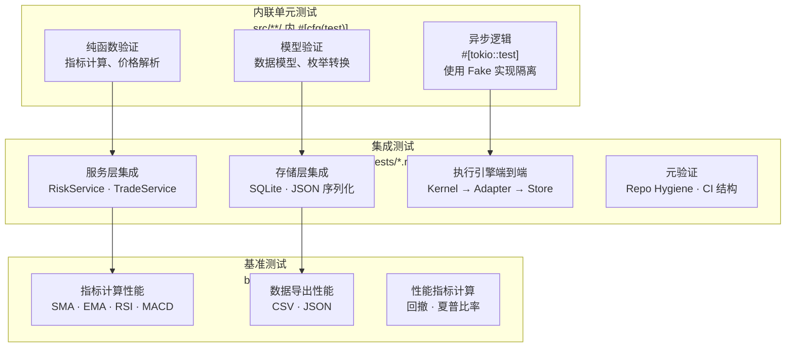
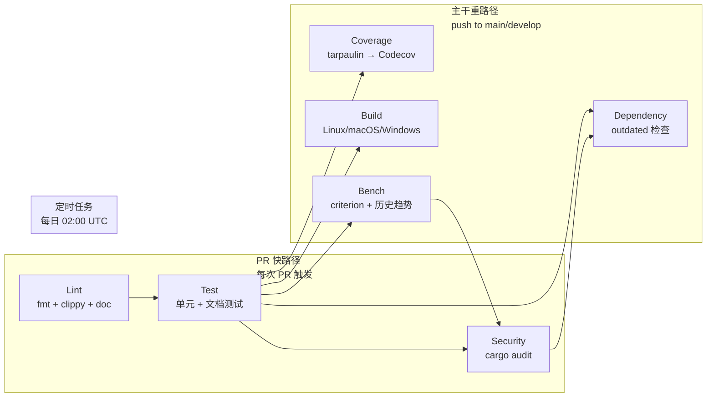

本项目采用**三层测试策略**——内联单元测试、独立集成测试与 Criterion 基准测试——构成从函数级验证到系统级闭环的质量保障体系。整体设计遵循 Rust 社区的"测试即文档"理念：单元测试紧邻业务代码，集成测试验证跨模块协作，基准测试守护性能基线。当前仓库共包含约 **520 个内联测试函数**（分布在 85 个 `#[cfg(test)]` 模块中）和约 **380 个集成测试函数**（分布在 `tests/` 目录的 51 个文件中），覆盖从核心数据模型到策略执行引擎的全部关键路径。

Sources: [Cargo.toml](Cargo.toml#L110-L123), [lib.rs](src/lib.rs#L1-L50)

## 测试架构全景

测试体系按验证粒度和依赖范围分为三个层次，每一层承担不同的质量守卫职责。内联单元测试（`src/**/*.rs` 中的 `#[cfg(test)] mod tests`）验证纯逻辑正确性，不依赖外部服务；集成测试（`tests/*.rs`）验证跨模块协作与外部系统交互；基准测试（`benches/`）追踪关键路径的性能演变。



内联测试与源码同文件共存，遵循 Rust 惯例通过 `#[cfg(test)]` 条件编译在发布构建中完全消除。集成测试位于 `tests/` 目录，每个文件对应一个功能域，通过 `use quantix_cli::` 访问公共 API，验证模块间协作的正确性。基准测试使用 Criterion 框架，在 CI 的 `main` 分支和定时任务中自动运行，并通过 `benchmark-action/github-action-benchmark` 追踪历史趋势，当性能回退超过 150% 时触发告警。

Sources: [ci.yml](.github/workflows/ci.yml#L354-L393), [bench_main.rs](benches/bench_main.rs#L1-L26)

## 测试目录结构

项目测试文件按功能域组织在 `tests/` 目录下，命名遵循 `<模块>_<子功能>_test.rs` 的统一约定，便于快速定位特定功能域的测试覆盖：

| 目录/文件 | 覆盖域 | 测试类型 | 典型依赖 |
|---|---|---|---|
| `tests/risk_*_test.rs`（6 个文件） | 风控规则、行业同步、波动率、重建 | 服务层 + Fake Store | FakeRiskStore |
| `tests/execution_*_test.rs`（5 个文件） | 执行内核、Daemon、运行时存储 | 端到端 + Mock Adapter | PaperAdapter, MockLiveAdapter |
| `tests/strategy_*_test.rs`（5 个文件） | 策略集成、Daemon、Paper/MockLive 运行 | 策略-引擎集成 | KlineBuilder, BacktestEngine |
| `tests/monitor_*_test.rs`（6 个文件） | 监控配置、服务、事件存储、Runner | 配置验证 + SQLite | tempfile |
| `tests/watchlist_*_test.rs`（6 个文件） | 自选股存储、解析、服务、CLI | JSON 序列化 + Resolver | tempfile |
| `tests/stop_*_test.rs`（2 个文件） | 止盈止损服务与数据库 | 止盈止损评估 | SQLite |
| `tests/trade_*_test.rs`（3 个文件） | 交易服务、存储、报表 | 交易生命周期 | FakePaperTradeStore |
| `tests/screener_*_test.rs`（3 个文件） | 选股解析器、评估器、服务 | 表达式解析 + 评估 | — |
| `tests/*bridge*_test.rs`（3 个文件） | Bridge 客户端与 TDX 数据源 | HTTP 交互 | wiremock |
| `tests/repo_hygiene_test.rs` | 仓库卫生与文档一致性 | 元验证 | 文件系统 |
| `tests/ci_workflow_structure_test.rs` | CI 工作流结构完整性 | 元验证 | 文件系统 |

内联测试方面，`src/cli/tests/` 目录包含 14 个 CLI 测试模块（覆盖 `analyze`、`backtest`、`data`、`execution`、`market`、`monitor`、`performance`、`risk`、`screener`、`stop`、`strategy`、`trade`、`watchlist` 等 CLI 命令），`src/cli/handlers/tests/` 目录则包含处理器级别的测试子模块（如 `monitor_runtime`、`market`、`trade_quotes`）。

Sources: [tests/](tests/), [src/cli/tests/](src/cli/tests/)

## 核心测试模式与约定

### Fake 实现模式

项目广泛采用 **trait 级 Fake 实现** 来隔离外部依赖。核心模式是定义一个实现业务 trait 的轻量级结构体，内部使用 `Arc<Mutex<Option<T>>>` 模拟持久化状态，使测试能够完全控制数据流向而不依赖真实数据库或网络服务。以风控模块为例，`FakeRiskStore` 实现了 `RiskStore` trait，`FakeIndustryResolver` 实现了 `RiskIndustryResolver` trait，两者均可在纯内存中运行完整的规则评估流程：

```rust
// 典型 Fake 实现模式
#[derive(Clone, Default)]
struct FakeRiskStore {
    state: Arc<Mutex<Option<RiskState>>>,
}

#[async_trait]
impl RiskStore for FakeRiskStore {
    async fn load_state(&self) -> Result<Option<RiskState>> {
        Ok(self.state.lock().unwrap().clone())
    }
    async fn save_state(&self, state: &RiskState) -> Result<()> {
        *self.state.lock().unwrap() = Some(state.clone());
        Ok(())
    }
}
```

同样的模式出现在执行引擎的 `FakePaperTradeStore`、交易模块的 `FakePaperTradeStore`、策略模块的 `FakeBarLoader` 等多个组件中。这些 Fake 实现不仅消除了外部依赖，还通过 `Arc<Mutex<>>` 的共享状态模式支持在测试中断言内部状态变化。

Sources: [risk_service_test.rs](tests/risk_service_test.rs#L16-L40), [execution_kernel_test.rs](tests/execution_kernel_test.rs#L134-L155)

### 测试数据生成器

策略模块提供了 `KlineBuilder` 测试数据生成器（位于 `src/strategy/test_utils.rs`），支持通过 Builder 模式灵活构造 K 线测试数据。该生成器通过 `TestDataConfig` 控制价差、成交量、是否包含金额字段等参数，并提供 `PriceTrend` 枚举（`Up`、`Down`、`Sideways`、`Volatile`）快速生成不同趋势的价格序列：

```rust
// 使用 KlineBuilder 生成测试数据
let klines = KlineBuilder::new("000001", date)
    .with_config(TestDataConfig::tight_spread())
    .generate_price_series(100.0, 60, PriceTrend::Up);
```

集成测试中同样广泛使用辅助工厂函数来降低测试数据的构造成本，如 `fixed_ts()` 提供确定性时间戳、`snapshot()` 构造账户快照、`sample_order()` 和 `sample_run()` 分别构造订单记录和策略运行记录。

Sources: [test_utils.rs](src/strategy/test_utils.rs#L1-L178), [execution_kernel_test.rs](tests/execution_kernel_test.rs#L37-L118)

### 文件系统隔离

涉及持久化的测试统一使用 `tempfile::tempdir()` 创建临时目录，确保测试间完全隔离且不留副作用。这一模式在 `watchlist_storage_test.rs`、`stop_db_test.rs`、`execution_runtime_store_test.rs` 等文件中一致应用：

```rust
#[test]
fn save_and_load_round_trip_preserves_groups() {
    let dir = tempdir().unwrap();
    let path = dir.path().join("watchlist.json");
    let storage = WatchlistStorage::new(path);
    // 测试结束后 tempdir 自动清理
}
```

Sources: [watchlist_storage_test.rs](tests/watchlist_storage_test.rs#L28-L53)

### 记录器模式

执行引擎测试引入了 **Recording TradeFillDeltaApplier** 模式，在实现 `FillDeltaApplier` trait 的同时，通过 `Arc<Mutex<HashSet<>>>` 和 `Arc<Mutex<Vec<>>>` 记录所有调用参数和返回结果。这使得端到端测试能够在完整运行执行内核后，断言中间过程的 Fill Delta 应用行为是否符合预期，而不需要侵入内核实现：

```rust
// Recording 模式：记录所有 Fill Delta 调用
#[derive(Clone)]
struct RecordingTradeFillDeltaApplier<Store> {
    trade_service: TradeService<Store>,
    seen_fill_ids: Arc<Mutex<HashSet<(String, u64)>>>,
    results: Arc<Mutex<Vec<FillDeltaResult>>>,
}
```

Sources: [execution_kernel_test.rs](tests/execution_kernel_test.rs#L157-L179)

## 覆盖率要求与质量门禁

### 各模块覆盖重点

项目对不同类型模块设定了差异化的覆盖要求。**核心业务逻辑**（策略信号生成、订单路由、风控评估、止盈止损计算）要求必须有完整的单元测试覆盖边界条件和错误路径。**数据模型层**（序列化/反序列化、枚举转换、验证规则）需要正向和反向的测试用例。**服务层**（Service 与 Store 的交互）通过 Fake 实现验证状态流转的正确性。**CLI 层**的测试侧重于参数解析和输出格式，而非交互式行为。

### unwra/expect 使用规则

开发规范明确规定：**生产代码严格禁止使用 `unwrap()` / `expect()`**，这些方法仅在测试代码中使用。生产代码中所有可能失败的操作必须通过 `Result` 类型显式处理错误，使用 `?` 操作符传播。仅在逻辑上不可能到达的死代码路径（如"已知枚举已穷尽"的分支）允许使用 `unreachable!()` 或 `panic!()`。

Sources: [DEVELOPMENT_GUIDELINES.md](docs/standards/DEVELOPMENT_GUIDELINES.md#L1327-L1377)

### 收口阶段门禁规则

当任务进入"可收口"阶段（主体实现完成、剩余问题集中在测试验证门禁）后，必须遵守以下强制规则：

1. **优先完成运行门禁闭环**：先完成 `cargo test`、`cargo clippy`、`cargo fmt --check` 以及集成验证和 repo hygiene 等门禁
2. **不得扩散 cosmetic 微调**：门禁未闭环前，禁止新增命名清理、注释润色、顺手重构等改动
3. **新增改动必须说明与门禁关系**：如确需修改，必须能明确回答"这项修改解决了哪个未闭环的门禁阻塞"
4. **闭环后才允许独立处理 cosmetic 清理**

Sources: [DEVELOPMENT_GUIDELINES.md](docs/standards/DEVELOPMENT_GUIDELINES.md#L1438-L1476)

## CI/CD 质量流水线

CI 流水线采用 **PR 快路径 / 主干重路径** 的分层策略，在保证每次提交质量的同时避免 PR 阶段过度消耗资源。整个流水线由 `.github/workflows/ci.yml` 定义，配合 `.github/workflows/audit.yml` 执行安全审计。



### PR 快路径（lint → test → security）

每个 Pull Request 自动触发三个并行的质量检查 Job：

- **Lint Job**：执行 `cargo fmt --all -- --check` 确保格式一致性，`cargo clippy --all-targets --all-features -- -D warnings` 将所有 Clippy 警告视为错误，以及文档链接完整性检查
- **Test Job**：在 PostgreSQL 17 和 ClickHouse 双服务容器的环境中执行 `cargo test --lib --all-features --verbose -- --test-threads=1`（单线程串行避免并发冲突）和 `cargo test --doc --all-features` 文档测试
- **Security Audit Job**：执行 `cargo audit` 检查依赖漏洞

### 主干重路径（coverage + build + bench + docs）

仅当 `push` 事件触发到 `main` 或 `develop` 分支时，额外运行以下重量级 Job：

| Job | 触发条件 | 工具 | 说明 |
|---|---|---|---|
| Coverage | push to main | `cargo-tarpaulin` | 生成 Lcov 格式报告并上传至 Codecov |
| Build | push to main/develop | `cargo build --release` | 三平台交叉编译（Linux/macOS/Windows） |
| Benchmark | push to main 或定时任务 | `cargo bench` | Criterion 基准测试 + 150% 回退告警 |
| Dependency Outdated | push to main | `cargo outdated` | 检测依赖版本滞后 |
| Documentation | push to main | `cargo doc` | 生成 API 文档并部署至 GitHub Pages |

Sources: [ci.yml](.github/workflows/ci.yml#L1-L72), [audit.yml](.github/workflows/audit.yml#L1-L55)

## 本地开发测试工作流

### 日常测试命令

开发过程中常用以下命令组合进行质量自检：

| 命令 | 用途 | 适用场景 |
|---|---|---|
| `cargo test --all-features` | 运行全部测试（lib + tests + doc） | 提交前全量验证 |
| `cargo test --lib --all-features` | 仅运行内联单元测试 | 快速验证当前模块 |
| `cargo test -p quantix-cli --test risk_service_test` | 运行指定集成测试文件 | 调试特定功能域 |
| `cargo test --test execution_kernel_test -- --test-threads=1` | 单线程运行指定测试 | 调试并发问题 |
| `cargo clippy --all-targets --all-features -- -D warnings` | Clippy 严格检查 | 代码质量验证 |
| `cargo fmt --all -- --check` | 格式一致性检查 | 提交前检查 |
| `cargo bench --all-features` | 运行基准测试 | 性能回归验证 |

项目提供了 `scripts/dev/watch-test.sh` 脚本，基于 `cargo-watch` 实现文件变更自动触发测试，适合在开发过程中持续监控代码质量：

```bash
# 启动测试监控（需要 cargo-watch）
./scripts/dev/watch-test.sh
```

Sources: [watch-test.sh](scripts/dev/watch-test.sh#L1-L27)

### 元验证测试

项目创新性地引入了两类**元验证测试**（Meta-Validation Tests），用于验证项目基础设施本身的一致性：

- **`repo_hygiene_test.rs`**：验证 README.md、USER_MANUAL.md 等文档是否包含特定 Phase 的功能描述、CLI 命令示例和关键约束说明。当新增功能但未更新文档时，此类测试会自动失败
- **`ci_workflow_structure_test.rs`**：验证 CI 工作流文件是否包含必要的 Job 定义（coverage、dependency_outdated、build、bench），确保流水线结构完整性不被意外破坏
- **`verify_features_script_test.rs`**：验证 `scripts/verify_features.sh` 功能验证脚本是否覆盖了已发布的核心功能 smoke test

这种"测试测试基础设施"的做法确保了项目文档与实现、CI 配置与预期行为之间的一致性。

Sources: [repo_hygiene_test.rs](tests/repo_hygiene_test.rs#L1-L113), [ci_workflow_structure_test.rs](tests/ci_workflow_structure_test.rs#L1-L39), [verify_features_script_test.rs](tests/verify_features_script_test.rs#L1-L72)

## 测试工具链

项目在 `[dev-dependencies]` 中声明了以下测试专用依赖，每个工具承担特定角色：

| 依赖 | 版本 | 用途 |
|---|---|---|
| `tokio-test` | 0.4 | 异步测试工具（`#[tokio::test]` 宏的底层支持） |
| `criterion` | 0.5 | 统计学基准测试框架，支持参数化 benchmark 和性能回归检测 |
| `tempfile` | 3.8 | 创建隔离的临时目录和文件，确保存储相关测试无副作用 |
| `wiremock` | 0.6 | HTTP 服务 Mock 框架，用于 Bridge 客户端和外部 API 测试 |

CI 环境中额外使用 `cargo-tarpaulin`（覆盖率收集）、`cargo-audit`（安全审计）、`cargo-outdated`（依赖版本检查）和 `cargo-watch`（本地开发热重载）等工具。

Sources: [Cargo.toml](Cargo.toml#L110-L114)

## 编写新测试的规范

### 单元测试结构

内联单元测试遵循以下结构约定：在源文件底部添加 `#[cfg(test)] mod tests` 模块，每个测试函数名使用 `test_<行为描述>` 的命名格式，测试体按 Arrange-Act-Assert 三段式组织。纯函数测试不依赖任何外部资源，异步逻辑测试使用 `#[tokio::test]` 并通过 Fake 实现隔离外部依赖：

```rust
#[cfg(test)]
mod tests {
    use super::*;
    use rust_decimal_macros::dec;

    #[test]
    fn test_parse_price_rejects_negative() {
        // Arrange: 构造非法输入
        let input = "-1";
        // Act & Assert: 验证拒绝负数
        assert!(parse_price(input).is_err());
    }

    #[tokio::test]
    async fn test_risk_evaluation_with_fake_store() {
        // Arrange: 使用 Fake 实现
        let store = FakeRiskStore::default();
        let service = RiskService::new(store.clone());
        // Act: 执行业务操作
        service.set_rule("position-limit", "20%", fixed_ts()).await.unwrap();
        // Assert: 验证状态变化
        let state = store.snapshot().unwrap();
        assert_eq!(state.rules.len(), 1);
    }
}
```

### 集成测试结构

集成测试文件位于 `tests/` 目录，按 `<模块>_<子功能>_test.rs` 命名。每个文件顶部导入所需的公共类型，随后定义该测试文件所需的 Fake 实现和辅助函数，最后是具体的测试用例。对于复杂的测试域（如执行引擎），使用 `#[path = "..."]` 属性将子模块拆分到独立文件中，如 `tests/execution_kernel_test/` 目录下的 `paper.rs` 和 `recovery.rs`。

### 基准测试结构

基准测试在 `benches/bench_main.rs` 中定义，使用 `criterion_group!` 和 `criterion_main!` 宏组织。每个 benchmark 组通过 `BenchmarkId` 参数化不同数据规模，使用 `black_box` 防止编译器过度优化。当前的 benchmark 覆盖了技术指标计算（SMA/EMA/RSI/MACD，数据量 100/1000/10000）、数据导出（CSV/JSON，数据量 1000/10000/100000）和性能指标计算（总收益率/最大回撤/夏普比率）三大类。

Sources: [bench_main.rs](benches/bench_main.rs#L49-L87), [DEVELOPMENT_GUIDELINES.md](docs/standards/DEVELOPMENT_GUIDELINES.md#L1327-L1377)

## 延伸阅读

- 了解 Clippy 规则配置的详细说明，参见 [Rust 编码规范（文件拆分、模块组织、类型安全）](28-rust-bian-ma-gui-fan-wen-jian-chai-fen-mo-kuai-zu-zhi-lei-xing-an-quan)
- 了解基准测试的具体性能数据和优化实践，参见 [性能优化指南（Polars 批量计算与 Criterion 基准测试）](30-xing-neng-you-hua-zhi-nan-polars-pi-liang-ji-suan-yu-criterion-ji-zhun-ce-shi)
- 了解 CI/CD 完整流水线的部署流程，参见 [GitHub Actions CI/CD 流水线](27-github-actions-ci-cd-liu-shui-xian)